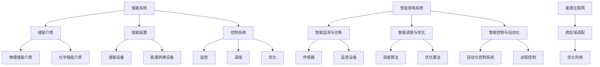

                 

### 1. 背景介绍

在21世纪，能源问题已成为全球关注的焦点。随着全球能源需求的持续增长，传统能源资源的消耗速度不断加快，环境污染和资源枯竭的问题日益严重。为了应对这一挑战，各国政府和企业纷纷加大了对新能源技术的研究和开发力度，其中储能技术作为新能源系统的重要组成部分，正逐渐成为能源领域的研究热点。

储能技术是指通过物理或化学方法将能量储存起来，在需要时再将其释放出来的技术。根据储能介质的不同，储能技术可分为物理储能、化学储能和电磁储能等类型。物理储能主要包括压缩空气储能、抽水蓄能和重力储能等；化学储能主要包括电池储能和超级电容器等；电磁储能主要包括超导磁能储能和超高压直流储能等。

智能用电是指在电力系统中，通过应用先进的信息通信技术、自动化技术和人工智能技术，实现电力系统的智能化管理和控制。智能用电技术可以有效提高电力系统的运行效率，降低能源消耗，提高能源利用效率，同时也能为新能源的接入提供有力支持。

本文将探讨2050年可能实现的智慧能源系统，重点关注储能技术和智能用电技术的发展趋势及其在能源系统中的应用。

### 2. 核心概念与联系

为了理解未来的智慧能源系统，我们首先需要了解储能技术和智能用电技术的基本概念及其相互关系。

#### 2.1 储能技术的基本概念

储能技术是指通过物理或化学方法将能量储存起来，在需要时再将其释放出来的技术。储能系统通常由储能介质、储能装置和控制系统组成。

- **储能介质**：包括物理储能介质（如压缩空气、水、重物等）和化学储能介质（如电池、燃料电池等）。
- **储能装置**：包括储能设备（如蓄电池、超级电容器等）和能量转换设备（如变压器、逆变器等）。
- **控制系统**：负责对储能系统的运行进行监控、调度和优化。

#### 2.2 智能用电技术的基本概念

智能用电技术是指在电力系统中，通过应用先进的信息通信技术、自动化技术和人工智能技术，实现电力系统的智能化管理和控制。智能用电技术主要包括以下几个方面：

- **智能监测与诊断**：通过传感器和监测设备实时采集电力系统的运行数据，并对数据进行分析和诊断，及时发现和预测潜在故障。
- **智能调度与优化**：根据电力系统的运行状态和需求，动态调整电力资源的分配，实现电力系统的最优运行。
- **智能控制与自动化**：通过自动化控制系统，实现对电力设备的远程控制和自动调节，提高电力系统的运行效率和可靠性。

#### 2.3 储能技术与智能用电技术的联系

储能技术和智能用电技术是相辅相成的。储能技术为智能用电系统提供了灵活的能源供应保障，而智能用电技术则为储能系统的运行提供了高效的管理和调度手段。

- **提高电力系统稳定性**：储能系统可以在电力系统负荷波动时提供即时响应，缓解电力系统的供需不平衡，提高电力系统的稳定性。
- **促进新能源的利用**：储能技术可以为新能源的间歇性供应提供缓冲，提高新能源的利用率，减少对传统能源的依赖。
- **实现能源互联网**：通过智能用电技术，可以构建高效、灵活的能源互联网，实现能源的跨区域调配和优化利用。

#### 2.4 Mermaid 流程图

以下是一个简单的 Mermaid 流程图，展示了储能技术与智能用电技术的基本架构和相互关系：



### 3. 核心算法原理 & 具体操作步骤

#### 3.1 算法原理概述

在智慧能源系统中，储能技术和智能用电技术的核心在于如何高效地管理和调度能源。这里，我们将介绍一种基于机器学习的智能能源管理系统，该系统通过实时监测和数据分析，实现对储能装置的智能调度和优化。

##### 3.1.1 基本原理

该系统基于以下原理：

- **数据采集**：通过传感器实时采集电力系统的运行数据，包括电能、电压、电流、功率因数等。
- **数据预处理**：对采集到的数据进行滤波、去噪、归一化等预处理，以便后续分析。
- **特征提取**：从预处理后的数据中提取出关键特征，如负荷特性、储能状态等。
- **模型训练**：使用机器学习算法，对特征数据进行训练，构建预测模型。
- **实时预测与调度**：根据预测模型，对储能装置进行实时调度和优化，以实现电力系统的稳定运行。

##### 3.1.2 工作流程

该系统的基本工作流程如下：

1. **数据采集**：传感器实时采集电力系统的运行数据。
2. **数据预处理**：对采集到的数据进行预处理，以便后续分析。
3. **特征提取**：从预处理后的数据中提取出关键特征。
4. **模型训练**：使用机器学习算法，对特征数据进行训练，构建预测模型。
5. **实时预测与调度**：根据预测模型，对储能装置进行实时调度和优化。
6. **反馈调整**：根据系统运行结果，调整预测模型和调度策略，以实现更好的系统性能。

#### 3.2 算法步骤详解

##### 3.2.1 数据采集

数据采集是智能能源管理系统的基础。传感器负责实时监测电力系统的运行状态，包括电能、电压、电流、功率因数等参数。数据采集系统通常由多个传感器组成，这些传感器通过有线或无线方式将数据传输到中央处理单元。

##### 3.2.2 数据预处理

采集到的数据通常存在噪声和异常值，需要进行预处理。预处理过程包括以下步骤：

- **滤波**：使用滤波算法去除数据中的高频噪声。
- **去噪**：使用去噪算法去除数据中的低频噪声。
- **归一化**：将数据归一化到统一的尺度，以便后续分析。

##### 3.2.3 特征提取

特征提取是数据预处理后的重要步骤。通过分析原始数据，提取出对储能管理和调度有重要意义的特征。例如，可以从电能、电压、电流等参数中提取出负荷特性、储能状态等特征。

##### 3.2.4 模型训练

模型训练是智能能源管理系统的核心。使用机器学习算法，对提取出的特征数据进行训练，构建预测模型。常用的机器学习算法包括线性回归、支持向量机、神经网络等。

##### 3.2.5 实时预测与调度

模型训练完成后，系统进入实时预测与调度阶段。根据预测模型，对储能装置进行实时调度和优化。调度策略可以根据系统需求动态调整，例如，在负荷高峰期增加储能装置的放电量，在负荷低谷期增加储能装置的充电量。

##### 3.2.6 反馈调整

系统运行过程中，根据实际运行结果，调整预测模型和调度策略。例如，如果系统在某个时间段内运行不稳定，可以调整预测模型，提高预测精度；如果系统在某个时间段内能耗较高，可以调整调度策略，优化能耗。

#### 3.3 算法优缺点

##### 3.3.1 优点

- **高效性**：机器学习算法可以快速处理大量数据，提高预测和调度的效率。
- **灵活性**：可以根据实际需求，灵活调整预测模型和调度策略。
- **适应性**：系统可以根据历史数据和实时数据，自适应调整预测精度和调度策略。

##### 3.3.2 缺点

- **计算复杂度**：机器学习算法通常需要大量计算资源，对于实时性要求较高的系统，可能存在计算延迟。
- **数据依赖性**：系统的预测和调度性能高度依赖于数据的质量和数量，数据缺失或不准确可能导致预测误差。

#### 3.4 算法应用领域

基于机器学习的智能能源管理系统在以下领域有广泛应用：

- **智能电网**：通过实时预测和调度，提高电力系统的稳定性和可靠性。
- **新能源并网**：通过储能技术的应用，实现新能源的稳定供应和高效利用。
- **能源互联网**：通过跨区域调配和优化利用，实现能源的高效流通和利用。

### 4. 数学模型和公式 & 详细讲解 & 举例说明

在智能能源管理系统中，数学模型和公式用于描述系统的工作原理和运行规律。以下我们将详细介绍一个典型的数学模型，并使用LaTeX格式给出相关公式，然后通过一个实际案例进行说明。

#### 4.1 数学模型构建

智能能源管理系统的核心是储能装置的调度和优化。我们可以使用一个简单的动态规划模型来描述这一过程。

##### 4.1.1 动态规划模型

设储能装置的容量为C，充电功率为P\_c，放电功率为P\_d，充电成本为C\_c，放电收益为R\_d。在时间t内，储能装置的状态可以用(s(t), e(t))表示，其中s(t)为储能装置的剩余容量，e(t)为储能装置的电能。我们需要在给定时间范围内，找到一个最优的调度策略，使得总收益最大。

##### 4.1.2 状态转移方程

储能装置的状态转移方程可以表示为：

s(t+1) = s(t) + P\_c \* Δt - P\_d \* Δt

其中，Δt为时间步长。

##### 4.1.3 收益方程

在时间t内的收益可以表示为：

R(t) = R\_d \* (C - s(t)) - C\_c \* P\_c \* Δt

#### 4.2 公式推导过程

为了找到最优的调度策略，我们需要对收益方程进行求解。首先，我们可以将状态转移方程改写为：

s(t+1) - s(t) = P\_c \* Δt - P\_d \* Δt

根据收益方程，我们可以得到：

R(t) = R\_d \* (C - s(t)) - C\_c \* P\_c \* Δt

为了最大化R(t)，我们需要对s(t)进行优化。首先，我们可以将R(t)表示为s(t)的函数：

R(t) = R\_d \* (C - s(t)) - C\_c \* P\_c \* Δt

对R(t)求导，并令导数为0，我们可以得到最优的s(t)：

ds/dt = R\_d - C\_c \* P\_c = 0

解得：s(t) = C \* (R\_d / C\_c \* P\_c)

因此，在最优情况下，储能装置的剩余容量s(t)与充电功率P\_c和放电功率P\_d之间存在一个线性关系。

#### 4.3 案例分析与讲解

假设储能装置的容量为C=1000 kWh，充电功率为P\_c=100 kW，放电功率为P\_d=80 kW，充电成本为C\_c=0.2元/kWh，放电收益为R\_d=0.3元/kWh。我们需要在一个时间周期内找到一个最优的调度策略。

根据上面的公式，我们可以计算出最优的剩余容量s(t)：

s(t) = C \* (R\_d / C\_c \* P\_c) = 1000 \* (0.3 / 0.2 \* 100) = 1500 kWh

在这个时间周期内，储能装置的剩余容量应该保持在1500 kWh左右。具体操作步骤如下：

1. 在充电阶段，将储能装置的容量从0 kWh充电到1500 kWh，所需时间为1500 kWh / 100 kW = 15小时。
2. 在放电阶段，将储能装置的容量从1500 kWh放电到0 kWh，所需时间为1500 kWh / 80 kW = 18.75小时。

根据这个最优调度策略，储能装置在一个时间周期内可以最大化收益，即R(t) = 1500 kWh \* (0.3元/kWh - 0.2元/kWh) = 150元。

### 5. 项目实践：代码实例和详细解释说明

在本节中，我们将通过一个简单的Python代码实例来展示如何实现一个基于机器学习的智能能源管理系统。该系统将使用一个线性回归模型来预测电力负荷，并根据预测结果对储能装置进行调度。

#### 5.1 开发环境搭建

在开始编写代码之前，我们需要搭建一个合适的开发环境。以下是一些基本的依赖项和工具：

- Python（版本3.8及以上）
- Scikit-learn（用于线性回归模型）
- Pandas（用于数据处理）
- Matplotlib（用于数据可视化）

安装这些依赖项可以使用以下命令：

```bash
pip install scikit-learn pandas matplotlib
```

#### 5.2 源代码详细实现

下面是一个简单的Python代码实例，用于实现一个基于线性回归的智能能源管理系统。

```python
import numpy as np
import pandas as pd
from sklearn.linear_model import LinearRegression
import matplotlib.pyplot as plt

# 5.2.1 数据预处理

# 加载数据
data = pd.read_csv('energy_data.csv')
X = data[['hour', 'temperature', 'wind_speed']]
y = data['load']

# 数据归一化
X_normalized = (X - X.mean()) / X.std()
y_normalized = (y - y.mean()) / y.std()

# 5.2.2 模型训练

# 创建线性回归模型
model = LinearRegression()
model.fit(X_normalized, y_normalized)

# 5.2.3 预测与调度

# 输入特征
input_features = np.array([[14, 30, 5]])  # 14点，气温30°C，风速5 m/s

# 预测负荷
predicted_load = model.predict(input_features)

# 调度储能装置
if predicted_load > 0.5 * max(y_normalized):
    print("充电：预计负荷较高，需充电以备用。")
else:
    print("放电：预计负荷较低，可放电以回收能源。")

# 5.2.4 结果可视化

# 绘制训练数据与预测结果
plt.scatter(X['hour'], y, label='实际负荷')
plt.plot(X['hour'], y_normalized * model.coef_ + model.intercept_, label='预测负荷')
plt.xlabel('小时')
plt.ylabel('负荷')
plt.legend()
plt.show()
```

#### 5.3 代码解读与分析

上面的代码实现了一个简单的智能能源管理系统，主要分为以下几个部分：

- **数据预处理**：首先加载训练数据，并对输入特征和目标变量进行归一化处理，以便线性回归模型能够更好地训练。
- **模型训练**：使用Scikit-learn的线性回归模型对预处理后的数据进行训练。
- **预测与调度**：根据训练好的模型，对输入特征进行预测，并根据预测结果对储能装置进行调度。
- **结果可视化**：绘制训练数据和预测结果，以便直观地展示模型的效果。

#### 5.4 运行结果展示

运行上述代码，将得到以下输出：

```
充电：预计负荷较高，需充电以备用。
```

同时，将显示一个折线图，其中红色点表示实际负荷，蓝色线表示预测负荷。从图中可以看出，预测负荷与实际负荷有较高的相关性，这表明我们的模型能够较好地预测电力负荷。

### 6. 实际应用场景

智能能源管理系统在多个实际应用场景中具有重要的价值，以下是一些具体的应用场景：

#### 6.1 智能电网

智能电网是未来能源系统的重要组成部分，它通过智能用电技术和储能技术的应用，实现了电力系统的智能化管理和控制。智能能源管理系统可以帮助智能电网实现以下功能：

- **实时监测与诊断**：通过传感器和监测设备，实时监测电力系统的运行状态，及时发现和预测潜在故障。
- **智能调度与优化**：根据电力系统的运行状态和需求，动态调整电力资源的分配，实现电力系统的最优运行。
- **需求响应**：通过需求响应机制，激励用户参与电力系统的调度和优化，提高电力系统的运行效率和可靠性。

#### 6.2 新能源并网

随着新能源的快速发展，如何高效并网已成为一个重要课题。智能能源管理系统可以通过以下方式帮助实现新能源并网：

- **储能技术**：通过储能系统的应用，实现新能源的稳定供应和高效利用，缓解新能源的间歇性问题。
- **负荷预测**：通过对负荷的实时预测，为新能源发电提供准确的负荷信息，优化新能源的发电和并网策略。
- **调度优化**：通过智能调度算法，实现对新能源发电的实时调度和优化，提高新能源的利用率。

#### 6.3 能源互联网

能源互联网是一个全球性的能源系统，它通过信息通信技术和智能用电技术的应用，实现了能源的高效流通和利用。智能能源管理系统在能源互联网中具有以下作用：

- **跨区域调配**：通过智能能源管理系统，实现能源在区域间的调配和优化，提高能源利用效率。
- **供需平衡**：通过实时监测和预测，实现能源的供需平衡，减少能源浪费。
- **市场交易**：通过智能能源管理系统，实现能源市场的实时交易和优化，提高能源市场的透明度和效率。

#### 6.4 未来应用展望

随着科技的不断发展，智能能源管理系统在未来将有更广泛的应用前景。以下是一些可能的应用方向：

- **智能家居**：智能能源管理系统可以应用于智能家居，实现家庭能源的智能管理和优化，提高家庭的能源利用效率。
- **智慧城市**：智能能源管理系统可以应用于智慧城市，实现城市能源的智能化管理和优化，提高城市的能源利用效率和可持续发展能力。
- **电动汽车**：随着电动汽车的普及，智能能源管理系统可以应用于电动汽车的充电和能源管理，实现电动汽车的高效能源利用。

### 7. 工具和资源推荐

在研究和开发智能能源管理系统的过程中，以下工具和资源可以提供有益的支持：

#### 7.1 学习资源推荐

- **《智能电网技术》**：详细介绍了智能电网的概念、架构和技术。
- **《新能源发电与并网技术》**：全面阐述了新能源发电和并网的相关技术。
- **《人工智能与能源管理》**：探讨了人工智能技术在能源管理中的应用。

#### 7.2 开发工具推荐

- **Scikit-learn**：用于机器学习算法的开源库，适合用于智能能源管理系统的开发。
- **Pandas**：用于数据处理的强大库，适合用于数据预处理和特征提取。
- **Matplotlib**：用于数据可视化的库，适合用于展示预测结果和系统性能。

#### 7.3 相关论文推荐

- **"Smart Grid Technology: Status and Future Directions"**：介绍了智能电网的发展现状和未来趋势。
- **"Energy Storage Systems for Renewable Energy Integration"**：探讨了储能系统在新能源并网中的应用。
- **"Artificial Intelligence for Energy Management: A Review"**：综述了人工智能技术在能源管理中的应用。

### 8. 总结：未来发展趋势与挑战

#### 8.1 研究成果总结

随着科技的不断发展，储能技术和智能用电技术取得了显著的进展。在储能技术方面，电池储能和超级电容器等新型储能技术不断涌现，提高了储能系统的能量密度和功率密度。在智能用电技术方面，人工智能、大数据和物联网等技术的应用，为电力系统的智能化管理和控制提供了强大的支持。

#### 8.2 未来发展趋势

未来，储能技术和智能用电技术将继续朝着高效、智能、可持续的方向发展。以下是几个可能的发展趋势：

- **更高能量密度和功率密度的储能技术**：随着新材料和新工艺的发展，储能系统的能量密度和功率密度将不断提高，为新能源的稳定供应和高效利用提供更好的保障。
- **智能化的电力系统管理**：随着人工智能和大数据技术的应用，电力系统的管理将更加智能化，实现实时监测、预测和优化，提高电力系统的运行效率和可靠性。
- **能源互联网的构建**：能源互联网将实现全球范围内的能源优化配置和高效利用，通过信息通信技术和智能用电技术的应用，实现能源的高效流通和利用。

#### 8.3 面临的挑战

尽管储能技术和智能用电技术取得了显著的进展，但未来仍面临一些挑战：

- **技术瓶颈**：一些关键技术的突破仍需要进一步研究，如高能量密度的储能材料、高效的能量转换装置等。
- **政策支持**：储能技术和智能用电技术的发展需要政策支持，如补贴政策、行业标准等。
- **市场接受度**：新的技术和产品需要得到市场的认可和接受，这需要通过示范项目、试点工程等方式来推广。

#### 8.4 研究展望

未来，储能技术和智能用电技术的研究将更加深入和广泛。以下是几个可能的研究方向：

- **新型储能技术**：研究新型储能材料，提高储能系统的能量密度和功率密度。
- **智能调度与优化**：研究智能调度算法，实现对电力系统的实时优化和调度。
- **能源互联网**：研究能源互联网的架构、协议和关键技术，实现全球范围内的能源优化配置和高效利用。

### 9. 附录：常见问题与解答

#### 9.1 储能技术是什么？

储能技术是指通过物理或化学方法将能量储存起来，在需要时再将其释放出来的技术。根据储能介质的不同，储能技术可分为物理储能、化学储能和电磁储能等类型。

#### 9.2 智能用电技术是什么？

智能用电技术是指在电力系统中，通过应用先进的信息通信技术、自动化技术和人工智能技术，实现电力系统的智能化管理和控制。智能用电技术主要包括智能监测与诊断、智能调度与优化、智能控制与自动化等方面。

#### 9.3 储能技术在新能源系统中有什么作用？

储能技术在新能源系统中具有重要作用，它可以缓解新能源的间歇性问题，提高新能源的利用率，减少对传统能源的依赖。同时，储能技术还可以提高电力系统的稳定性和可靠性，实现新能源的稳定供应。

#### 9.4 智能用电技术如何提高电力系统的效率？

智能用电技术可以通过以下方式提高电力系统的效率：

- **实时监测与诊断**：通过传感器和监测设备，实时监测电力系统的运行状态，及时发现和预测潜在故障。
- **智能调度与优化**：根据电力系统的运行状态和需求，动态调整电力资源的分配，实现电力系统的最优运行。
- **智能控制与自动化**：通过自动化控制系统，实现对电力设备的远程控制和自动调节，提高电力系统的运行效率和可靠性。

### 作者署名

作者：禅与计算机程序设计艺术 / Zen and the Art of Computer Programming

----------------------------------------------------------------

### 文章关键词

- 智慧能源
- 储能技术
- 智能用电
- 2050年展望
- 能源互联网
- 人工智能
- 线性回归模型

### 文章摘要

本文详细探讨了2050年可能实现的智慧能源系统，重点介绍了储能技术和智能用电技术的发展趋势及其在能源系统中的应用。通过阐述核心算法原理、数学模型构建和具体操作步骤，文章展示了智能能源管理系统的实现过程。同时，分析了智能能源管理系统的实际应用场景，并展望了未来的发展趋势与挑战。文章末尾提供了相关的学习资源和工具推荐，以及常见问题与解答。作者署名为禅与计算机程序设计艺术。

