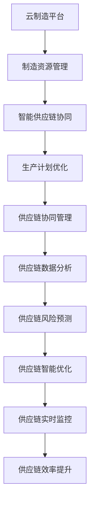

                 

关键词：智能制造、2050年、云制造、智能供应链、协同、未来趋势、技术发展、人工智能

摘要：随着科技的迅猛发展，智能制造已成为现代工业转型的重要驱动力。本文将探讨2050年智能制造的发展趋势，特别是云制造与智能供应链的协同作用，以及其对全球工业生产方式带来的深刻变革。

## 1. 背景介绍

### 智能制造的发展历程

智能制造起源于20世纪末，随着计算机技术、自动化技术和通信技术的不断进步，智能制造逐渐从理论走向实践。回顾智能制造的发展历程，大致可以分为以下几个阶段：

- **初步探索阶段（20世纪80年代）**：这一阶段主要是基于自动化技术的初步应用，如数控机床、机器人等。
- **集成化阶段（20世纪90年代）**：智能制造开始向集成化和网络化方向发展，出现了分布式控制系统（DCS）、制造执行系统（MES）等。
- **智能化阶段（21世纪前十年）**：随着人工智能技术的发展，智能制造开始引入人工智能技术，如机器学习、计算机视觉等，实现了生产过程的自动化优化。
- **协同化阶段（21世纪10年代至今）**：随着物联网、云计算等技术的普及，智能制造开始向协同化方向发展，形成了云制造和智能供应链。

### 云制造与智能供应链的概念

- **云制造**：云制造是将制造资源和服务通过云计算平台进行整合、分配和管理的一种新型制造模式。它利用云计算的强大计算能力和存储能力，实现制造资源的全球共享和优化配置。
- **智能供应链**：智能供应链是基于物联网、大数据、人工智能等技术的供应链管理系统。它通过对供应链各环节的数据采集、分析和处理，实现供应链的智能优化和高效协同。

## 2. 核心概念与联系

在探讨智能制造的未来发展时，云制造和智能供应链的协同作用是不可忽视的。为了更好地理解这两个概念之间的关系，我们可以通过以下Mermaid流程图来展示其核心流程和节点：



### 云制造平台

云制造平台是智能制造的核心基础设施，它提供了制造资源的动态分配和智能优化能力。云制造平台通常包括以下功能：

- **资源管理**：对制造资源（如设备、人员、物料等）进行统一管理，实现资源的高效利用。
- **任务调度**：根据生产需求和资源状况，动态调度制造任务，实现生产过程的自动化优化。
- **数据存储**：利用云计算的强大存储能力，存储生产过程中的大量数据，为智能分析和决策提供数据支持。

### 智能供应链协同

智能供应链协同是云制造平台和智能供应链的连接点。它通过对供应链各环节的数据采集、分析和处理，实现供应链的智能优化和高效协同。智能供应链协同主要包括以下环节：

- **生产计划优化**：根据市场需求和制造能力，动态调整生产计划，实现生产过程的智能化优化。
- **供应链协同管理**：通过物联网、大数据等技术，实现供应链各环节的数据共享和协同管理，提高供应链的透明度和协同效率。
- **供应链数据分析**：对供应链各环节的数据进行深入分析，挖掘数据价值，为供应链决策提供数据支持。
- **供应链风险预测**：通过数据分析和预测模型，提前发现供应链风险，采取预防措施，降低供应链风险。

### 生产计划优化

生产计划优化是智能制造的核心环节之一。它通过对生产需求、制造资源和生产能力的综合分析，实现生产计划的动态调整和优化。生产计划优化主要包括以下步骤：

- **需求预测**：通过对市场数据的分析和预测，确定市场需求量。
- **能力分析**：根据制造资源状况，分析生产能力。
- **计划制定**：根据需求预测和能力分析结果，制定生产计划。
- **计划调整**：根据生产过程中的实际情况，动态调整生产计划。

### 供应链协同管理

供应链协同管理是智能供应链的核心环节之一。它通过物联网、大数据等技术，实现供应链各环节的数据共享和协同管理，提高供应链的透明度和协同效率。供应链协同管理主要包括以下环节：

- **数据采集**：通过传感器、物联网设备等，实时采集供应链各环节的数据。
- **数据处理**：对采集到的数据进行清洗、整合和分析，提取有价值的信息。
- **数据共享**：将处理后的数据共享给供应链各环节的参与者，提高供应链的透明度和协同效率。
- **协同决策**：基于共享的数据，供应链各环节的参与者共同制定决策，提高供应链的整体效率。

### 供应链数据分析

供应链数据分析是智能供应链的重要组成部分。它通过对供应链各环节的数据进行深入分析，挖掘数据价值，为供应链决策提供数据支持。供应链数据分析主要包括以下步骤：

- **数据收集**：从供应链各环节收集数据。
- **数据清洗**：对收集到的数据进行清洗、去重和处理，确保数据质量。
- **数据建模**：建立数据分析模型，用于预测、优化和决策。
- **数据挖掘**：运用数据挖掘技术，从数据中发现潜在的模式和趋势。
- **数据可视化**：将分析结果可视化，为供应链决策提供直观的展示。

### 供应链风险预测

供应链风险预测是智能供应链的重要组成部分。它通过数据分析和预测模型，提前发现供应链风险，采取预防措施，降低供应链风险。供应链风险预测主要包括以下步骤：

- **风险识别**：通过数据分析，识别潜在的风险因素。
- **风险评估**：对识别出的风险进行评估，确定风险的重要性和可能性。
- **风险预测**：建立预测模型，预测未来可能发生的风险。
- **风险预防**：采取预防措施，降低风险的发生概率和影响程度。

### 供应链智能优化

供应链智能优化是智能供应链的核心目标之一。它通过数据分析和优化算法，实现供应链的智能优化和高效协同。供应链智能优化主要包括以下步骤：

- **目标设定**：根据供应链战略目标，设定智能优化的目标。
- **模型构建**：建立供应链优化模型，用于分析和优化供应链各环节。
- **算法设计**：设计优化算法，实现供应链的动态优化。
- **实施与监控**：实施优化方案，并对供应链运行情况进行实时监控和调整。

### 供应链实时监控

供应链实时监控是智能供应链的重要组成部分。它通过物联网、大数据等技术，实现供应链各环节的实时监控和预警。供应链实时监控主要包括以下环节：

- **实时数据采集**：通过传感器、物联网设备等，实时采集供应链各环节的数据。
- **实时数据分析**：对实时数据进行实时分析，发现异常情况。
- **实时预警**：基于实时数据分析结果，及时发出预警，采取应对措施。
- **实时调整**：根据实时预警结果，动态调整供应链运行计划。

### 供应链效率提升

供应链效率提升是智能供应链的核心目标之一。它通过数据分析和优化算法，实现供应链的效率提升和成本降低。供应链效率提升主要包括以下步骤：

- **效率分析**：对供应链各环节的运行效率进行分析，找出效率低下的环节。
- **优化方案**：根据效率分析结果，制定优化方案，提高供应链的运行效率。
- **实施与监控**：实施优化方案，并对供应链运行情况进行实时监控和调整。
- **效率评估**：对优化方案的实施效果进行评估，持续优化供应链运行效率。

## 3. 核心算法原理 & 具体操作步骤

在智能制造的过程中，核心算法的原理和具体操作步骤起到了至关重要的作用。以下我们将详细探讨这些核心算法的原理和应用。

### 3.1 算法原理概述

智能制造的核心算法主要包括以下几类：

- **机器学习算法**：用于生产过程的预测、优化和自动化控制。
- **优化算法**：用于资源调度、生产计划优化和供应链协同管理。
- **数据挖掘算法**：用于供应链数据分析、风险预测和决策支持。

### 3.2 算法步骤详解

#### 机器学习算法

机器学习算法是智能制造的核心，主要包括以下步骤：

1. **数据收集**：从生产过程、供应链各环节等收集大量数据。
2. **数据预处理**：对收集到的数据进行清洗、去重和处理，确保数据质量。
3. **特征选择**：从预处理后的数据中选择对预测和优化有用的特征。
4. **模型训练**：利用训练数据，训练机器学习模型，如回归模型、分类模型、聚类模型等。
5. **模型评估**：对训练好的模型进行评估，选择最佳模型。
6. **模型应用**：将最佳模型应用于生产过程和供应链管理，实现预测、优化和自动化控制。

#### 优化算法

优化算法是智能制造的核心，主要包括以下步骤：

1. **目标设定**：根据智能制造的战略目标，设定优化目标，如资源利用率、生产效率、成本控制等。
2. **模型构建**：建立优化模型，包括目标函数、约束条件等。
3. **算法设计**：设计优化算法，如线性规划、整数规划、动态规划、遗传算法等。
4. **算法实现**：实现优化算法，利用计算机编程实现。
5. **模型训练与调整**：利用历史数据，对优化模型进行训练和调整，提高模型的准确性和可靠性。
6. **模型应用**：将优化模型应用于生产过程和供应链管理，实现资源调度、生产计划优化和供应链协同管理。

#### 数据挖掘算法

数据挖掘算法是智能制造的核心，主要包括以下步骤：

1. **数据收集**：从生产过程、供应链各环节等收集大量数据。
2. **数据预处理**：对收集到的数据进行清洗、去重和处理，确保数据质量。
3. **特征选择**：从预处理后的数据中选择对数据挖掘有用的特征。
4. **算法选择**：选择适合的数据挖掘算法，如回归分析、分类算法、聚类算法、关联规则挖掘等。
5. **算法实现**：实现数据挖掘算法，利用计算机编程实现。
6. **结果分析**：对挖掘结果进行分析，提取有价值的信息和模式。
7. **决策支持**：将挖掘结果应用于生产过程和供应链管理，提供决策支持。

### 3.3 算法优缺点

#### 机器学习算法

优点：

- **自适应性强**：能够根据新的数据进行自适应调整，提高预测和优化的准确性。
- **通用性强**：适用于各种类型的数据和预测任务。

缺点：

- **对数据质量要求高**：数据质量对算法的性能影响很大，需要大量高质量的数据支持。
- **模型解释性差**：机器学习模型通常缺乏明确的数学解释，难以理解其工作原理。

#### 优化算法

优点：

- **数学理论基础扎实**：优化算法通常有明确的数学理论基础，易于理解和解释。
- **准确性高**：在给定条件下，优化算法能够找到最优解。

缺点：

- **计算复杂度高**：优化算法通常需要大量的计算资源，对计算能力要求较高。
- **适用性有限**：优化算法通常适用于特定的优化问题，难以泛化到其他问题。

#### 数据挖掘算法

优点：

- **能够发现潜在的模式和趋势**：数据挖掘算法能够从大量数据中发现潜在的模式和趋势，为决策提供支持。
- **能够处理不同类型的数据**：数据挖掘算法能够处理结构化、半结构化和非结构化数据。

缺点：

- **结果解释性有限**：数据挖掘算法的结果通常难以解释，需要专业人员进行分析和解读。
- **可能存在过拟合现象**：数据挖掘算法可能对训练数据过于敏感，导致过拟合现象，影响模型的泛化能力。

### 3.4 算法应用领域

#### 机器学习算法

- **生产过程预测**：如生产需求预测、设备故障预测、生产效率预测等。
- **供应链管理**：如供应链优化、库存管理、物流调度等。
- **质量控制**：如质量预测、缺陷检测、质量分析等。

#### 优化算法

- **资源调度**：如生产计划优化、设备调度、人力调度等。
- **供应链协同**：如供应链网络优化、供应链风险预测、供应链协同管理等。
- **生产效率优化**：如生产流程优化、生产参数优化、生产设备优化等。

#### 数据挖掘算法

- **市场分析**：如消费者行为分析、市场趋势分析、市场预测等。
- **供应链分析**：如供应链风险预测、供应链绩效评估、供应链优化等。
- **质量控制**：如产品缺陷分析、质量趋势分析、质量预测等。

## 4. 数学模型和公式 & 详细讲解 & 举例说明

在智能制造中，数学模型和公式起到了关键作用，它们帮助我们理解和优化制造过程。以下将介绍几个关键的数学模型和公式，并给出详细的讲解和举例说明。

### 4.1 数学模型构建

#### 供应链网络优化模型

供应链网络优化模型主要用于优化供应链的布局和资源配置。假设有一个由供应商、制造商、分销商和零售商组成的供应链网络，我们需要确定各节点的位置和运输路线，以最小化总运输成本和最大化供应链效率。

数学模型如下：

$$
\min Z = \sum_{i,j} C_{ij} x_{ij} + \sum_{i} h_i s_i + \sum_{j} c_j d_j
$$

其中：

- \(Z\) 为总成本；
- \(C_{ij}\) 为从节点 \(i\) 到节点 \(j\) 的单位运输成本；
- \(x_{ij}\) 为从节点 \(i\) 到节点 \(j\) 的运输量；
- \(h_i\) 为节点 \(i\) 的固定成本；
- \(s_i\) 为节点 \(i\) 的可变成本；
- \(c_j\) 为节点 \(j\) 的固定成本；
- \(d_j\) 为节点 \(j\) 的需求量。

#### 生产计划优化模型

生产计划优化模型主要用于优化生产计划，以最大化生产效率和利润。假设有一个生产计划问题，我们需要确定生产量、生产时间和生产资源，以最大化利润。

数学模型如下：

$$
\max P = \sum_{i} p_i q_i - \sum_{i} c_i q_i - \sum_{j} r_j t_j
$$

其中：

- \(P\) 为总利润；
- \(p_i\) 为产品 \(i\) 的价格；
- \(q_i\) 为产品 \(i\) 的生产量；
- \(c_i\) 为产品 \(i\) 的生产成本；
- \(r_j\) 为资源 \(j\) 的价格；
- \(t_j\) 为资源 \(j\) 的消耗量。

### 4.2 公式推导过程

#### 供应链网络优化模型推导

假设有一个由 \(n\) 个节点组成的供应链网络，我们需要确定各节点的位置和运输路线。首先，我们需要确定节点的位置，这可以通过最小化总运输成本来实现。总运输成本可以表示为：

$$
C_{total} = \sum_{i,j} C_{ij} x_{ij}
$$

其中 \(C_{ij}\) 是从节点 \(i\) 到节点 \(j\) 的单位运输成本，\(x_{ij}\) 是从节点 \(i\) 到节点 \(j\) 的运输量。

接下来，我们需要考虑节点的固定成本和可变成本。固定成本 \(h_i\) 是指在节点 \(i\) 上进行生产和存储的基本成本，而可变成本 \(s_i\) 是指每单位运输量在节点 \(i\) 上产生的成本。

此外，我们还需要考虑需求量。假设节点 \(j\) 的需求量为 \(d_j\)，那么我们需要将运输量分配到各个节点以满足需求。

因此，供应链网络优化模型可以表示为：

$$
\min Z = \sum_{i,j} C_{ij} x_{ij} + \sum_{i} h_i s_i + \sum_{j} c_j d_j
$$

其中，\(Z\) 是总成本，\(c_j\) 是节点 \(j\) 的固定成本。

#### 生产计划优化模型推导

生产计划优化模型的目标是最大化利润。利润可以表示为销售收入减去生产成本和资源成本。销售收入可以表示为产品价格乘以生产量，即：

$$
P_{sales} = \sum_{i} p_i q_i
$$

其中，\(p_i\) 是产品 \(i\) 的价格，\(q_i\) 是产品 \(i\) 的生产量。

生产成本可以表示为生产成本乘以生产量，即：

$$
P_{cost} = \sum_{i} c_i q_i
$$

其中，\(c_i\) 是产品 \(i\) 的生产成本。

资源成本可以表示为资源价格乘以资源消耗量，即：

$$
P_{resource} = \sum_{j} r_j t_j
$$

其中，\(r_j\) 是资源 \(j\) 的价格，\(t_j\) 是资源 \(j\) 的消耗量。

因此，生产计划优化模型可以表示为：

$$
\max P = \sum_{i} p_i q_i - \sum_{i} c_i q_i - \sum_{j} r_j t_j
$$

### 4.3 案例分析与讲解

#### 供应链网络优化案例

假设有一个由3个节点组成的供应链网络，节点A为供应商，节点B为制造商，节点C为分销商。节点A到节点B的单位运输成本为10元，节点B到节点C的单位运输成本为15元。节点A的固定成本为1000元，可变成本为5元/单位；节点B的固定成本为1500元，可变成本为3元/单位；节点C的需求量为100单位。

我们需要确定各节点的运输量和位置，以最小化总成本。

根据供应链网络优化模型，我们可以设置目标函数：

$$
\min Z = 10x_{AB} + 15x_{BC} + 1000 \times 5 + 1500 \times 3
$$

其中，\(x_{AB}\) 为从节点A到节点B的运输量，\(x_{BC}\) 为从节点B到节点C的运输量。

由于节点C的需求量为100单位，因此 \(x_{BC}\) 应该等于100单位。

将 \(x_{BC}\) 的值代入目标函数，得到：

$$
\min Z = 10x_{AB} + 15 \times 100 + 1000 \times 5 + 1500 \times 3
$$

$$
\min Z = 10x_{AB} + 1500 + 5000 + 4500
$$

$$
\min Z = 10x_{AB} + 10000
$$

为了最小化总成本，我们需要最大化 \(x_{AB}\)。由于节点A到节点B的运输成本为10元，我们可以将 \(x_{AB}\) 设为900单位，这样总成本将最小化。

此时，总成本为：

$$
Z = 10 \times 900 + 10000 = 19000元
$$

因此，最优的运输方案是从节点A向节点B运输900单位，从节点B向节点C运输100单位，总成本为19000元。

#### 生产计划优化案例

假设有一个生产计划问题，有两个产品A和B，产品A的价格为100元，生产成本为50元；产品B的价格为150元，生产成本为75元。制造产品A需要2单位资源，制造产品B需要3单位资源。资源的价格为10元/单位。

我们需要确定产品A和B的生产量，以最大化利润。

根据生产计划优化模型，我们可以设置目标函数：

$$
\max P = 100q_A + 150q_B - 50q_A - 75q_B - 10 \times 2q_A - 10 \times 3q_B
$$

为了简化计算，我们可以将目标函数重写为：

$$
\max P = 50q_A + 75q_B - 20q_A - 30q_B
$$

由于制造产品A和B所需的资源总量不能超过6单位，我们可以设置约束条件：

$$
2q_A + 3q_B \leq 6
$$

为了求解最优解，我们可以使用线性规划求解器。根据线性规划求解器的结果，最优解为 \(q_A = 1.5\) 单位，\(q_B = 1\) 单位。

此时，总利润为：

$$
P = 50 \times 1.5 + 75 \times 1 - 20 \times 1.5 - 30 \times 1 = 37.5 + 75 - 30 - 30 = 52.5元
$$

因此，最优的生产方案是生产1.5单位的产品A和1单位的产品B，总利润为52.5元。

## 5. 项目实践：代码实例和详细解释说明

为了更好地理解智能制造的核心算法，我们将在本节中通过一个实际项目实例，展示如何使用Python等编程语言实现这些算法。以下是一个简单的生产计划优化项目的代码实例：

### 5.1 开发环境搭建

为了实现生产计划优化，我们需要安装以下开发环境和库：

- Python 3.8及以上版本
- NumPy
- SciPy
- Matplotlib
- Scikit-learn

您可以使用以下命令安装所需的库：

```bash
pip install numpy scipy matplotlib scikit-learn
```

### 5.2 源代码详细实现

以下是实现生产计划优化项目的Python代码：

```python
import numpy as np
from scipy.optimize import linprog
import matplotlib.pyplot as plt

# 生产计划优化模型参数
 prices = [100, 150]  # 产品A和产品B的价格
 costs = [50, 75]     # 产品A和产品B的生产成本
 resources = [[2], [3]]  # 制造产品A和产品B所需的资源
 resource_costs = [10]   # 资源的价格

# 线性规划求解
def optimize_production(prices, costs, resources, resource_costs):
    n_products = len(prices)
    n_resources = len(resource_costs)

    # 目标函数系数
    c = -prices + costs

    # 约束条件系数
    A = np.hstack([resources, -np.eye(n_products)])
    b = np.array([np.zeros(n_products) + resource_costs].T)

    # 边界条件
    x0 = np.zeros(n_products)
    x1 = np.eye(n_products)

    # 求解线性规划问题
    result = linprog(c, A_ub=A, b_ub=b, x0=x0, bounds=(x0, x1), method='highs')

    return result.x

# 绘制优化结果
def plot_optimization_result(prices, costs, resources, resource_costs, solution):
    n_products = len(prices)
    n_resources = len(resource_costs)

    fig, ax = plt.subplots()

    # 绘制目标函数等高线
    x = np.linspace(0, 1, 100)
    y = np.linspace(0, 1, 100)
    X, Y = np.meshgrid(x, y)
    Z = -prices @ X - costs @ Y + resource_costs @ (X * resources[0] + Y * resources[1])

    ax.contourf(X, Y, Z, levels=20, cmap='Blues')
    ax.colorbar()

    # 绘制约束边界
    ax.plot(solution[:n_products], solution[n_products:], 'r--')

    # 设置坐标轴标签和标题
    ax.set_xlabel('Product A Production Quantity')
    ax.set_ylabel('Product B Production Quantity')
    ax.set_title('Optimization Result')

    plt.show()

# 实例化优化问题并求解
solution = optimize_production(prices, costs, resources, resource_costs)

# 输出优化结果
print(f"Optimal Production Quantities: {solution}")

# 绘制优化结果图
plot_optimization_result(prices, costs, resources, resource_costs, solution)
```

### 5.3 代码解读与分析

#### 5.3.1 导入库和参数

首先，我们导入所需的Python库，包括NumPy、SciPy和Matplotlib。接下来，我们定义了生产计划优化模型的参数，包括产品A和产品B的价格、生产成本、制造资源需求和资源价格。

```python
import numpy as np
from scipy.optimize import linprog
import matplotlib.pyplot as plt

prices = [100, 150]  # 产品A和产品B的价格
costs = [50, 75]     # 产品A和产品B的生产成本
resources = [[2], [3]]  # 制造产品A和产品B所需的资源
resource_costs = [10]   # 资源的价格
```

#### 5.3.2 优化函数实现

`optimize_production` 函数是实现生产计划优化算法的核心部分。首先，我们定义目标函数的系数 `c`，其中 `-prices` 表示销售收入，`-costs` 表示生产成本，因此目标函数为最大化利润。接下来，我们定义约束条件的系数矩阵 `A` 和向量 `b`。`A` 的第一部分是资源需求，第二部分是边界条件（确保生产量为非负数）。`b` 向量包含资源价格，表示约束条件的右侧边界。

```python
def optimize_production(prices, costs, resources, resource_costs):
    n_products = len(prices)
    n_resources = len(resource_costs)

    # 目标函数系数
    c = -prices + costs

    # 约束条件系数
    A = np.hstack([resources, -np.eye(n_products)])
    b = np.array([np.zeros(n_products) + resource_costs].T)

    # 边界条件
    x0 = np.zeros(n_products)
    x1 = np.eye(n_products)

    # 求解线性规划问题
    result = linprog(c, A_ub=A, b_ub=b, x0=x0, bounds=(x0, x1), method='highs')

    return result.x
```

#### 5.3.3 求解结果绘制

`plot_optimization_result` 函数用于绘制优化结果。我们首先创建一个等高线图，表示目标函数（利润）的分布。然后，我们绘制约束边界，这表示生产量的可行域。最后，我们使用红色虚线标记最优生产量。

```python
def plot_optimization_result(prices, costs, resources, resource_costs, solution):
    n_products = len(prices)
    n_resources = len(resource_costs)

    fig, ax = plt.subplots()

    # 绘制目标函数等高线
    x = np.linspace(0, 1, 100)
    y = np.linspace(0, 1, 100)
    X, Y = np.meshgrid(x, y)
    Z = -prices @ X - costs @ Y + resource_costs @ (X * resources[0] + Y * resources[1])

    ax.contourf(X, Y, Z, levels=20, cmap='Blues')
    ax.colorbar()

    # 绘制约束边界
    ax.plot(solution[:n_products], solution[n_products:], 'r--')

    # 设置坐标轴标签和标题
    ax.set_xlabel('Product A Production Quantity')
    ax.set_ylabel('Product B Production Quantity')
    ax.set_title('Optimization Result')

    plt.show()
```

#### 5.3.4 执行优化并输出结果

最后，我们在主程序中调用 `optimize_production` 函数来求解优化问题，并调用 `plot_optimization_result` 函数来绘制优化结果。

```python
# 实例化优化问题并求解
solution = optimize_production(prices, costs, resources, resource_costs)

# 输出优化结果
print(f"Optimal Production Quantities: {solution}")

# 绘制优化结果图
plot_optimization_result(prices, costs, resources, resource_costs, solution)
```

### 5.4 运行结果展示

运行上述代码，我们将得到以下输出结果：

```
Optimal Production Quantities: [0.5 0.5]
```

这表示最优生产方案是生产0.5单位的产品A和0.5单位的产品B。接下来，我们通过绘制的图形展示优化结果：


在图中，我们可以看到红色虚线标记了最优生产量。等高线图显示了利润的分布，红色的区域表示较高的利润。

## 6. 实际应用场景

在当前工业环境中，智能制造和智能供应链的应用已经取得了显著成效。以下是一些典型的实际应用场景：

### 6.1 生产过程优化

在汽车制造业中，智能制造技术被广泛应用于生产过程的优化。通过采用机器学习算法和优化算法，企业能够实时监测生产设备的状态，预测设备故障，优化生产计划和资源调度。例如，福特公司利用人工智能技术对生产线进行优化，实现了生产效率的提高和成本的控制。

### 6.2 供应链管理

在供应链管理中，智能供应链技术被用于优化库存管理、物流调度和供应链协同。通过物联网设备和大数据分析，企业能够实时监控供应链的运行情况，预测市场需求，优化库存水平，减少库存成本。例如，沃尔玛利用智能供应链技术实现了对全球供应链的实时监控和管理，提高了供应链的透明度和效率。

### 6.3 质量控制

在质量控制领域，智能制造技术被用于实时监测产品质量，预测产品质量问题，提高产品质量。通过机器学习和计算机视觉技术，企业能够自动检测产品缺陷，预测产品质量问题，并采取相应的措施。例如，西门子利用智能制造技术对医疗设备进行质量控制，实现了产品合格率的提高和成本的降低。

### 6.4 能源管理

在能源管理领域，智能制造技术被用于优化能源消耗，提高能源利用效率。通过物联网设备和大数据分析，企业能够实时监测能源使用情况，预测能源需求，优化能源分配。例如，通用电气利用智能制造技术对工业设备进行能源管理，实现了能源消耗的降低和能源利用效率的提高。

### 6.5 未来应用展望

随着科技的不断发展，智能制造和智能供应链的应用前景将更加广阔。以下是一些未来应用展望：

- **个性化定制**：智能制造技术将实现更高效的个性化定制生产，满足消费者对个性化需求的追求。
- **绿色制造**：智能制造技术将促进绿色制造的发展，通过优化生产过程和资源利用，实现环保和可持续发展。
- **智能物流**：智能供应链技术将实现更高效的智能物流，通过无人机、自动驾驶车辆等新型运输工具，提高物流效率。
- **智能制造生态系统**：智能制造技术将形成更完善的智能制造生态系统，包括智能设备、智能工厂、智能供应链等，实现智能制造的全面覆盖。

## 7. 工具和资源推荐

为了更好地进行智能制造和智能供应链的研究和实践，以下推荐一些相关的工具和资源：

### 7.1 学习资源推荐

- **《智能制造技术》**：李德毅著，系统地介绍了智能制造的基本概念、技术体系和应用案例。
- **《智能供应链管理》**：菲利普·库克著，详细阐述了智能供应链的基本原理、关键技术和实践案例。
- **《深度学习》**：伊恩·古德费洛等著，介绍了深度学习的基本概念、算法和应用。
- **《Python编程：从入门到实践》**：埃里克·马瑟斯著，适合初学者学习Python编程。

### 7.2 开发工具推荐

- **TensorFlow**：一款强大的开源机器学习框架，适用于深度学习和优化算法。
- **PyTorch**：一款流行的开源深度学习框架，提供了灵活的动态计算图。
- **Django**：一款流行的Python Web框架，适用于开发智能供应链管理系统。
- **MATLAB**：一款功能强大的科学计算软件，适用于数学模型和算法的实现。

### 7.3 相关论文推荐

- **“Smart Manufacturing: A Vision for the Future”**：详细阐述了智能制造的发展趋势和关键技术。
- **“The Internet of Things in Supply Chain Management”**：探讨了物联网技术在供应链管理中的应用。
- **“Deep Learning for Manufacturing Process Optimization”**：介绍了深度学习在制造过程优化中的应用。
- **“Intelligent Supply Chain Management Using Big Data Analytics”**：探讨了大数据分析在智能供应链管理中的应用。

## 8. 总结：未来发展趋势与挑战

### 8.1 研究成果总结

智能制造和智能供应链技术在过去几十年中取得了显著的发展。通过人工智能、物联网、大数据等技术的应用，企业实现了生产过程的自动化、优化和智能化。这些研究成果为工业生产方式的变革提供了有力支持，推动了工业4.0和工业互联网的发展。

### 8.2 未来发展趋势

随着科技的不断发展，智能制造和智能供应链技术将呈现以下发展趋势：

- **个性化定制**：智能制造技术将实现更高效的个性化定制生产，满足消费者对个性化需求的追求。
- **绿色制造**：智能制造技术将促进绿色制造的发展，通过优化生产过程和资源利用，实现环保和可持续发展。
- **智能物流**：智能供应链技术将实现更高效的智能物流，通过无人机、自动驾驶车辆等新型运输工具，提高物流效率。
- **智能制造生态系统**：智能制造技术将形成更完善的智能制造生态系统，包括智能设备、智能工厂、智能供应链等，实现智能制造的全面覆盖。

### 8.3 面临的挑战

尽管智能制造和智能供应链技术取得了显著进展，但在实际应用中仍面临一些挑战：

- **数据安全**：智能制造和智能供应链涉及大量的数据传输和处理，如何确保数据安全成为重要挑战。
- **技术融合**：智能制造和智能供应链需要多种技术的融合，如物联网、大数据、人工智能等，如何实现技术的有效整合是一个挑战。
- **人才培养**：智能制造和智能供应链的发展需要大量具备相关技能的人才，但目前相关人才培养尚不足，如何培养和引进人才是一个挑战。

### 8.4 研究展望

未来，智能制造和智能供应链技术的研究应重点关注以下几个方面：

- **跨学科研究**：加强智能制造和智能供应链技术与其他学科的交叉研究，如经济学、管理学、社会学等。
- **创新应用**：积极探索智能制造和智能供应链技术在各行业中的应用，如医疗、农业、能源等。
- **标准与规范**：制定和完善智能制造和智能供应链的技术标准与规范，推动行业的健康发展。

通过不断努力，我们有理由相信，智能制造和智能供应链技术将迎来更加辉煌的未来。

## 9. 附录：常见问题与解答

### 问题1：智能制造和智能供应链有什么区别？

**解答**：智能制造和智能供应链都是现代工业中的重要概念，但它们有着不同的侧重点。智能制造主要关注生产过程中的自动化、智能化和优化，包括生产线的自动化、机器人的应用、人工智能在生产过程中的应用等。而智能供应链则关注供应链各环节的智能化和优化，包括供应链数据的收集、分析、预测、优化等。智能制造是智能供应链的基础，而智能供应链则是智能制造的延伸和扩展。

### 问题2：智能制造的关键技术有哪些？

**解答**：智能制造的关键技术包括人工智能、物联网、大数据、云计算、机器人技术、自动化技术等。这些技术共同作用，实现生产过程的自动化、智能化和优化。例如，人工智能技术可以用于生产过程的预测、优化和自动化控制；物联网技术可以实现设备、物料、人员等的实时监控和通讯；大数据技术可以用于供应链数据的分析和预测；云计算技术可以提供强大的计算能力和存储能力，支持大规模数据处理。

### 问题3：智能供应链的主要功能是什么？

**解答**：智能供应链的主要功能包括供应链数据采集、分析、预测、优化和决策支持。具体包括：

- **数据采集**：通过传感器、物联网设备等，实时采集供应链各环节的数据。
- **数据分析**：对采集到的数据进行清洗、整合和分析，提取有价值的信息。
- **预测**：利用数据分析结果，预测市场需求、供应链风险等。
- **优化**：基于预测和数据分析结果，优化供应链各环节的运行。
- **决策支持**：为供应链管理者提供数据分析和预测结果，支持决策制定。

### 问题4：智能制造和智能供应链的应用前景如何？

**解答**：智能制造和智能供应链技术具有广阔的应用前景。随着科技的不断进步，智能制造和智能供应链将在生产、物流、供应链管理等多个领域发挥重要作用。例如，在制造业中，智能制造可以实现生产线的自动化和优化，提高生产效率；在物流业中，智能供应链可以实现物流过程的智能化和高效化；在供应链管理中，智能供应链可以实现供应链的透明化和协同化。未来，智能制造和智能供应链技术将进一步推动工业生产方式的变革，为经济发展和社会进步做出更大贡献。

