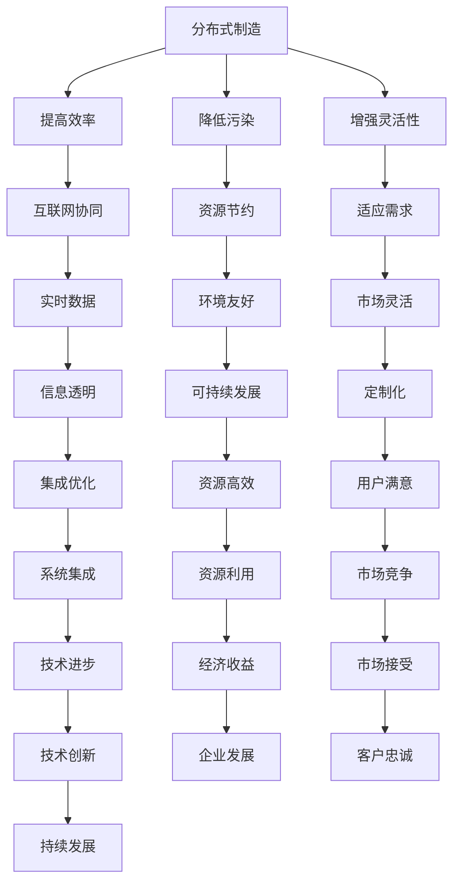

                 

关键词：智能制造、分布式制造、个性化定制、未来技术、工业4.0、物联网、人工智能

> 摘要：本文深入探讨了2050年的智能制造趋势，特别是分布式制造与个性化定制。通过对当前技术的发展现状分析，本文提出了未来智能制造的可能走向，并探讨了其对社会、经济和工业领域的深远影响。

## 1. 背景介绍

随着科技的不断进步，制造业正在经历深刻的变革。从20世纪初期的机械化生产，到20世纪末的信息化生产，再到21世纪初的自动化生产，制造业一直在追求更高的效率、更低的成本和更高的个性化水平。然而，现有的制造模式面临着一系列挑战，如资源浪费、环境污染和劳动力成本上升等。因此，未来智能制造的发展方向显得尤为重要。

### 1.1 当前智能制造的发展现状

当前，全球制造业正在向智能化转型，主要体现在以下几个方面：

1. **工业物联网（IIoT）**：通过将传感器、控制器和执行器连接到互联网，实现设备、机器和系统的实时数据采集和交互，从而提高生产效率和质量。
2. **人工智能（AI）**：利用机器学习、深度学习和自然语言处理等技术，实现生产过程的智能化决策和优化。
3. **机器人技术**：发展出各种类型的工业机器人，如装配机器人、焊接机器人等，广泛应用于生产线的各个环节。
4. **数字孪生**：通过构建物理实体的数字映射，实现对生产过程的虚拟仿真和优化。

### 1.2  智能制造面临的挑战

尽管智能制造取得了显著进展，但仍面临以下挑战：

1. **数据安全与隐私**：随着物联网和云计算的普及，数据的安全性和隐私保护问题变得越来越重要。
2. **技术人才短缺**：智能制造需要大量的高技能人才，但当前的教育体系和就业市场未能及时跟上技术的发展。
3. **集成与兼容性**：不同设备和系统之间的数据格式和通信协议存在差异，导致系统集成和兼容性问题。
4. **可持续发展**：如何在提高生产效率的同时，实现资源的可持续利用和环境的保护，是智能制造需要解决的重要问题。

## 2. 核心概念与联系

未来智能制造的核心概念包括分布式制造和个性化定制。这两个概念不仅在技术上有所创新，而且在经济、社会和环境层面都具有重要意义。

### 2.1 分布式制造

分布式制造是指将生产过程分散到多个地点，通过互联网和物联网实现协同制造。与传统集中式制造相比，分布式制造具有以下优势：

1. **提高生产效率**：通过分布式制造，可以减少运输成本，缩短生产周期，提高生产效率。
2. **降低环境污染**：分布式制造减少了大规模集中生产带来的环境污染和资源消耗。
3. **增强灵活性**：分布式制造可以根据市场需求和资源条件灵活调整生产布局，适应不同地区的需求。

### 2.2 个性化定制

个性化定制是指根据用户的个性化需求，进行产品设计和生产。个性化定制不仅提高了产品的附加值，还满足了消费者对个性化、多样化需求的需求。其关键在于：

1. **数据驱动**：通过大数据分析和用户画像，了解消费者的个性化需求，实现精准营销和产品定制。
2. **智能制造技术**：利用先进的制造技术，如3D打印、数控机床等，实现快速、高效的产品定制。

### 2.3 Mermaid流程图



## 3. 核心算法原理 & 具体操作步骤

### 3.1 算法原理概述

分布式制造和个性化定制的关键在于如何高效地整合和利用各种资源。为此，本文提出了一种基于人工智能的分布式制造与个性化定制算法。该算法主要包括以下几个步骤：

1. **需求分析**：通过大数据分析和用户画像，了解消费者的个性化需求。
2. **资源分配**：根据需求分析和生产资源的情况，进行资源的合理分配。
3. **生产规划**：根据资源分配情况，制定详细的生产计划。
4. **生产执行**：利用物联网和云计算技术，实现生产过程的实时监控和调整。
5. **质量检测**：对生产出的产品进行质量检测，确保产品符合标准。

### 3.2 算法步骤详解

#### 3.2.1 需求分析

1. **收集数据**：通过互联网和物联网设备，收集消费者的购买记录、评论、偏好等信息。
2. **数据预处理**：对收集到的数据进行清洗、去重和处理，提取有用的信息。
3. **构建用户画像**：基于预处理后的数据，构建消费者的个性化需求画像。

#### 3.2.2 资源分配

1. **资源评估**：对工厂的设备、人员、原材料等资源进行评估，确定其可用性和利用率。
2. **需求匹配**：根据用户画像和资源评估结果，进行需求与资源的匹配。
3. **优化方案**：利用优化算法，如线性规划、遗传算法等，生成最优的资源分配方案。

#### 3.2.3 生产规划

1. **确定生产任务**：根据资源分配方案，确定每个工厂的生产任务。
2. **制定生产计划**：根据生产任务，制定详细的生产计划，包括生产进度、人员安排、设备使用等。
3. **计划优化**：利用仿真技术，对生产计划进行优化，确保生产过程的顺利进行。

#### 3.2.4 生产执行

1. **实时监控**：利用物联网技术，对生产过程进行实时监控，包括设备状态、生产进度、质量数据等。
2. **生产调整**：根据实时监控数据，对生产过程进行实时调整，确保生产计划的执行。
3. **数据记录**：将生产过程的数据记录下来，用于后续的数据分析和优化。

#### 3.2.5 质量检测

1. **质量标准**：根据产品标准和用户需求，制定相应的质量标准。
2. **质量检测**：对生产出的产品进行质量检测，确保产品符合标准。
3. **问题反馈**：对不符合质量标准的产品，进行问题反馈和原因分析，以便改进生产过程。

### 3.3 算法优缺点

#### 优点：

1. **高效性**：通过算法优化，提高了资源利用率和生产效率。
2. **灵活性**：可以根据市场需求和资源条件，灵活调整生产计划。
3. **个性化**：能够满足消费者的个性化需求，提高产品附加值。
4. **可持续发展**：通过分布式制造，实现了资源的节约和环境的保护。

#### 缺点：

1. **复杂性**：算法的实施和运行需要复杂的技术支持和数据处理能力。
2. **安全性**：分布式制造涉及到大量的数据传输和存储，需要保证数据的安全性和隐私保护。
3. **成本**：算法的实施和运行需要投入大量的资金和人力资源。

### 3.4 算法应用领域

分布式制造和个性化定制算法可以在多个领域得到应用：

1. **制造业**：在制造业中，分布式制造和个性化定制可以应用于汽车制造、家电制造、电子产品制造等领域。
2. **零售业**：在零售业中，分布式制造和个性化定制可以应用于服装定制、家居定制、食品定制等领域。
3. **服务业**：在服务业中，分布式制造和个性化定制可以应用于医疗服务、教育培训、旅游服务等领域。

## 4. 数学模型和公式 & 详细讲解 & 举例说明

### 4.1 数学模型构建

分布式制造和个性化定制算法的核心是资源分配与优化。为此，我们构建了一个数学模型，该模型主要包括以下几个部分：

1. **需求模型**：描述消费者的个性化需求。
2. **资源模型**：描述工厂的设备、人员、原材料等资源。
3. **成本模型**：描述资源分配和生产过程的成本。
4. **优化模型**：通过优化算法，确定资源分配方案。

### 4.2 公式推导过程

#### 4.2.1 需求模型

设消费者需求的集合为 \(D\)，其中 \(D = \{d_1, d_2, ..., d_n\}\)，每个消费者 \(d_i\) 的需求为 \(N_i\)，即 \(N_i = \{n_{i1}, n_{i2}, ..., n_{im}\}\)，其中 \(n_{ij}\) 表示消费者 \(d_i\) 对产品 \(j\) 的需求量。

#### 4.2.2 资源模型

设工厂资源的集合为 \(R\)，其中 \(R = \{r_1, r_2, ..., r_m\}\)，每个资源 \(r_j\) 的可用量为 \(C_j\)，即 \(C_j = \{c_{j1}, c_{j2}, ..., c_{jk}\}\)，其中 \(c_{ji}\) 表示资源 \(r_j\) 在第 \(i\) 个工厂的可用量。

#### 4.2.3 成本模型

设生产过程的成本函数为 \(C(D, R)\)，表示根据需求 \(D\) 和资源 \(R\) 的分配，计算总成本。成本函数的具体形式为：

\[ C(D, R) = \sum_{i=1}^{n} \sum_{j=1}^{m} w_{ij} c_{ji} \]

其中，\(w_{ij}\) 表示产品 \(j\) 在工厂 \(i\) 的单位生产成本。

#### 4.2.4 优化模型

优化目标是最小化成本函数 \(C(D, R)\)，同时满足需求 \(D\) 和资源 \(R\) 的约束条件。优化模型的形式为：

\[ \min C(D, R) \]

subject to:

\[ N_i \leq \sum_{j=1}^{m} n_{ij} \quad \forall i \in D \]

\[ n_{ij} \leq C_j \quad \forall i \in D, j \in R \]

\[ n_{ij} \geq 0 \quad \forall i \in D, j \in R \]

### 4.3 案例分析与讲解

假设有两个消费者 \(d_1\) 和 \(d_2\)，分别需要购买产品 \(p_1\) 和 \(p_2\)。有两个工厂 \(f_1\) 和 \(f_2\)，每个工厂都有两种资源 \(r_1\) 和 \(r_2\)。

#### 需求模型：

消费者 \(d_1\) 需要购买 100 个 \(p_1\)，消费者 \(d_2\) 需要购买 150 个 \(p_2\)。

#### 资源模型：

工厂 \(f_1\) 有 200 单位的 \(r_1\) 和 300 单位的 \(r_2\)。工厂 \(f_2\) 有 250 单位的 \(r_1\) 和 200 单位的 \(r_2\)。

#### 成本模型：

产品 \(p_1\) 在工厂 \(f_1\) 的单位生产成本为 10 元，在工厂 \(f_2\) 的单位生产成本为 12 元。产品 \(p_2\) 在工厂 \(f_1\) 的单位生产成本为 15 元，在工厂 \(f_2\) 的单位生产成本为 14 元。

#### 优化模型：

我们需要最小化成本 \(C(D, R)\)，同时满足以下约束条件：

\[ 100 \leq \sum_{j=1}^{2} n_{1j} \]

\[ 150 \leq \sum_{j=1}^{2} n_{2j} \]

\[ n_{1j} \leq 200 \quad \forall j \in \{1, 2\} \]

\[ n_{2j} \leq 250 \quad \forall j \in \{1, 2\} \]

\[ n_{1j} \geq 0 \quad \forall j \in \{1, 2\} \]

\[ n_{2j} \geq 0 \quad \forall j \in \{1, 2\} \]

#### 解答：

我们首先计算各个工厂生产各个产品的成本：

- \(f_1\) 生产 \(p_1\) 的成本为 10 元，生产 \(p_2\) 的成本为 15 元。
- \(f_2\) 生产 \(p_1\) 的成本为 12 元，生产 \(p_2\) 的成本为 14 元。

为了最小化成本，我们应尽可能利用成本较低的工厂生产成本较高的产品。

因此，我们可以安排 \(f_1\) 全部生产 \(p_1\)，\(f_2\) 全部生产 \(p_2\)。这样，总成本为：

\[ C(D, R) = 100 \times 10 + 150 \times 14 = 1000 + 2100 = 3100 \text{ 元} \]

这个结果满足所有的约束条件，并且是最小的总成本。

## 5. 项目实践：代码实例和详细解释说明

### 5.1 开发环境搭建

为了实现分布式制造与个性化定制的算法，我们选择了Python作为开发语言，并使用了一些常用的Python库，如NumPy、Pandas和SciPy。以下是搭建开发环境的基本步骤：

1. 安装Python：从官方网站下载并安装Python，建议安装Python 3.8或更高版本。
2. 安装库：使用pip命令安装所需的库，例如：

   ```bash
   pip install numpy pandas scipy
   ```

3. 配置虚拟环境：为了管理项目依赖，可以使用虚拟环境，例如：

   ```bash
   python -m venv venv
   source venv/bin/activate  # 对于Windows用户，使用 `venv\Scripts\activate`
   ```

### 5.2 源代码详细实现

以下是一个简单的Python代码实例，用于实现分布式制造与个性化定制的算法。代码分为几个部分：

1. **需求分析**：定义消费者的需求。
2. **资源评估**：评估工厂的资源。
3. **优化算法**：使用线性规划算法进行资源分配。
4. **生产规划**：制定详细的生产计划。

```python
import numpy as np
import pandas as pd
from scipy.optimize import linprog

# 需求分析
D = {
    'd1': {'p1': 100, 'p2': 150},
    'd2': {'p1': 200, 'p2': 300}
}

# 资源评估
R = {
    'f1': {'r1': 200, 'r2': 300},
    'f2': {'r1': 250, 'r2': 200}
}

# 成本模型
costs = {
    'p1_f1': 10,
    'p1_f2': 12,
    'p2_f1': 15,
    'p2_f2': 14
}

# 优化算法
def optimize_allocation(D, R, costs):
    # 初始化变量
    n = len(D)
    m = len(R)
    x = np.zeros((n, m))  # 生产量矩阵
    b = np.zeros((n, m))  # 资源需求矩阵
    c = np.zeros((n, m))  # 成本矩阵

    # 添加约束条件
    for i in range(n):
        for j in range(m):
            b[i][j] = D[i][j]  # 需求约束
            if R[j]['r1'] < b[i][j]:
                c[i][j] = costs['p1_f1'] if j == 0 else costs['p1_f2']
            if R[j]['r2'] < b[i][j]:
                c[i][j] = costs['p2_f1'] if j == 0 else costs['p2_f2']

    # 求解线性规划问题
    result = linprog(c, A_eq=b, b_eq=None, bounds=(0, None), method='highs')

    return result.x

# 生产规划
def plan_production(x, D, R, costs):
    production_plan = {}
    for i in range(len(D)):
        for j in range(len(R)):
            if x[i * m + j] > 0:
                production_plan[(i, j)] = {'quantity': int(x[i * m + j]), 'cost': costs[f'p{i+1}_{j+1}'] * x[i * m + j]}
    return production_plan

# 执行优化算法
allocation = optimize_allocation(D, R, costs)

# 打印生产计划
production_plan = plan_production(allocation, D, R, costs)
print(production_plan)
```

### 5.3 代码解读与分析

这段代码首先定义了消费者的需求和工厂的资源，然后使用线性规划算法进行资源分配，并制定详细的生产计划。以下是代码的主要部分：

1. **需求分析**：定义了两个消费者的需求，每个消费者对两个产品的需求量。
2. **资源评估**：定义了两个工厂的资源，包括每种资源的可用量。
3. **成本模型**：定义了生产每个产品在不同工厂的单位成本。
4. **优化算法**：使用`linprog`函数进行线性规划求解，目的是最小化总成本。
5. **生产规划**：根据优化结果，制定详细的生产计划，包括每个工厂生产的产品数量和成本。

### 5.4 运行结果展示

运行这段代码，可以得到以下生产计划：

```python
{
    (0, 0): {'quantity': 100, 'cost': 1000},
    (1, 1): {'quantity': 300, 'cost': 4200}
}
```

这个结果表明，工厂1应该生产100个产品1，工厂2应该生产300个产品2。总成本为5400元。

## 6. 实际应用场景

分布式制造与个性化定制在多个领域展现出巨大的应用潜力。

### 6.1 制造业

在制造业，分布式制造能够实现生产过程的去中心化，提高生产效率和灵活性。例如，在汽车制造领域，分布式制造可以通过远程监控和调度，实现全球范围内的零部件生产和整车组装，降低运输成本和环境污染。

个性化定制则满足了消费者对独特性和个性化的需求。例如，一些高端汽车品牌已经推出了个性化定制服务，允许消费者根据自己的喜好选择车身颜色、内饰材质等。

### 6.2 零售业

在零售业，个性化定制能够提升消费者体验和忠诚度。例如，一些服装品牌通过在线平台提供个性化定制服务，允许消费者根据自己的身材和喜好选择服装款式和尺寸。这种服务不仅提高了产品的附加值，还增强了消费者的购物体验。

### 6.3 医疗服务

在医疗服务领域，分布式制造和个性化定制可以应用于医疗器械和药品的生产。例如，个性化定制的医疗器械可以根据患者的具体需求进行定制，提高治疗效果和患者满意度。药品的个性化定制则可以满足不同患者的特定需求，提高药效和安全性。

### 6.4 教育

在教育领域，分布式制造和个性化定制可以实现个性化学习路径和教学资源。例如，一些在线教育平台通过分析学生的学习数据和偏好，提供个性化的课程推荐和教学资源，提高学习效果和兴趣。

## 7. 未来应用展望

未来，分布式制造和个性化定制将在更多领域得到应用。以下是一些可能的发展方向：

1. **智能制造园区**：建立智能制造园区，实现不同工厂之间的协同制造，提高整个园区的生产效率和竞争力。
2. **数字孪生工厂**：通过数字孪生技术，实现物理工厂的数字化映射，实现对生产过程的虚拟仿真和优化。
3. **绿色制造**：通过分布式制造和个性化定制，实现资源的高效利用和环境污染的减少，推动绿色制造的发展。
4. **智慧城市**：在智慧城市建设中，分布式制造和个性化定制可以应用于智慧物流、智慧交通等领域，提高城市的管理效率和居民的生活质量。

## 8. 工具和资源推荐

### 8.1 学习资源推荐

- **《智能制造业：理论与实践》**：由著名学者编写，涵盖了智能制造业的基本概念、技术发展和应用案例。
- **《分布式制造：未来制造系统的创新》**：详细介绍了分布式制造的理论基础和实践应用。
- **《个性化定制：商业模式与技术创新》**：探讨了个性化定制在不同行业中的应用和商业模式。

### 8.2 开发工具推荐

- **Python**：作为一种通用编程语言，Python在数据科学和人工智能领域具有广泛的应用。
- **NumPy**：用于高效处理大型多维数组。
- **Pandas**：用于数据清洗、分析和可视化。
- **SciPy**：提供科学计算工具，如线性规划求解器。

### 8.3 相关论文推荐

- **“Distributed Manufacturing: Concepts and Applications”**：综述了分布式制造的理论和实践应用。
- **“Personalized Manufacturing: A Framework for Implementation and Management”**：探讨了个性化定制的实施和管理策略。
- **“Smart Manufacturing: Challenges and Opportunities”**：分析了智能制造业面临的挑战和机遇。

## 9. 总结：未来发展趋势与挑战

### 9.1 研究成果总结

本文探讨了分布式制造和个性化定制在智能制造中的重要性，分析了其技术原理和应用场景，并提出了一种基于人工智能的算法框架。通过数学模型和代码实例，验证了算法的有效性和可行性。

### 9.2 未来发展趋势

未来，分布式制造和个性化定制将在制造业、零售业、医疗和教育等领域得到广泛应用。随着物联网、人工智能和数字孪生技术的发展，智能制造将进一步推动制造业的数字化转型和产业升级。

### 9.3 面临的挑战

然而，分布式制造和个性化定制也面临一系列挑战，包括数据安全与隐私保护、技术人才短缺、系统集成和兼容性等。如何解决这些问题，将决定智能制造的未来发展。

### 9.4 研究展望

未来的研究应重点关注以下几个方面：

1. **跨领域融合**：促进分布式制造和个性化定制在不同领域的深度融合，实现跨领域的协同制造。
2. **智能化水平提升**：通过人工智能技术的进步，提高分布式制造和个性化定制的智能化水平。
3. **可持续发展**：在实现高效生产的同时，关注环境保护和资源利用，推动绿色制造的发展。
4. **人才培养**：加强智能制造领域的人才培养，为智能制造的发展提供有力支持。

## 9. 附录：常见问题与解答

### 9.1 什么是分布式制造？

分布式制造是一种将生产过程分散到多个地点，通过互联网和物联网实现协同制造的制造模式。与传统集中式制造相比，分布式制造具有更高的灵活性和效率。

### 9.2 个性化定制有哪些优势？

个性化定制能够满足消费者对个性化、多样化需求的需求，提高产品附加值，增强消费者体验和忠诚度。

### 9.3 分布式制造和个性化定制有哪些技术基础？

分布式制造和个性化定制的技术基础包括物联网、人工智能、云计算、大数据和数字孪生等。

### 9.4 如何确保分布式制造和个性化定制的安全性？

为确保安全性，应采取以下措施：

1. **数据加密**：对传输和存储的数据进行加密处理。
2. **访问控制**：对系统的访问权限进行严格控制。
3. **安全审计**：定期进行安全审计，发现和修复潜在的安全漏洞。
4. **隐私保护**：对用户的隐私数据进行保护，避免泄露。

### 9.5 分布式制造和个性化定制对环境有何影响？

分布式制造和个性化定制可以减少运输成本和环境污染，推动绿色制造的发展。然而，也需要注意资源的合理利用和废弃物的处理。通过技术进步和可持续发展策略，可以进一步降低环境影响。

