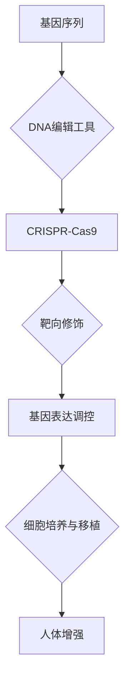
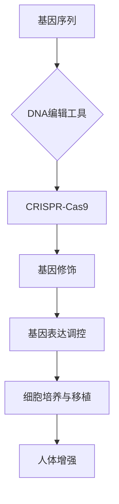

                 

关键词：基因编辑、人体增强、生物技术、未来展望、2050年

> 摘要：随着生物技术的快速发展，基因编辑和人体增强技术正逐渐从科幻变为现实。本文将探讨到2050年，这些技术将如何改变我们的生活，带来哪些机遇和挑战，以及我们需要为此做好准备。

## 1. 背景介绍

生物技术，作为现代科学的前沿领域，已经在过去几十年中取得了显著的进步。特别是基因编辑技术的发展，如CRISPR-Cas9，使得我们能够以前所未有的精确度修改生物体的基因组。这一技术不仅对医学领域有着深远的影响，还在农业、环境保护、生物工程等多个领域展现出巨大的潜力。

### 当前状况

目前，基因编辑技术已经能够治疗一些遗传性疾病，如地中海贫血和杜氏肌营养不良。此外，它还在农业领域被用来培育抗病、抗虫、高产量的作物，以应对全球粮食安全问题。

### 发展趋势

随着技术的不断进步，基因编辑和人体增强技术有望在未来几十年内实现进一步的突破。例如，我们可能会看到更多基于基因编辑的个性化治疗方案，以及能够增强人体免疫系统的技术。

## 2. 核心概念与联系

为了理解基因编辑和人体增强技术的潜力，我们需要首先了解其核心概念和原理。以下是相关概念和流程的Mermaid流程图：



### 说明：

- **A 基因序列**：是我们遗传信息的存储单位。
- **B DNA编辑工具**：如CRISPR-Cas9，用于定位和编辑特定基因序列。
- **C CRISPR-Cas9**：基因编辑技术的核心，能够实现高效、精准的基因修改。
- **D 靶向修饰**：通过CRISPR-Cas9工具对特定基因序列进行修饰，如替换、插入或删除。
- **E 基因表达调控**：通过编辑基因序列，调节基因的表达水平，从而影响细胞功能。
- **F 细胞培养与移植**：通过基因编辑后的细胞在体外培养，然后再移植到人体内，用于治疗或增强。
- **G 人体增强**：通过基因编辑和细胞移植，增强人体的生理和认知能力。

## 3. 核心算法原理 & 具体操作步骤

### 3.1 算法原理概述

基因编辑技术基于DNA的定向修改原理。CRISPR-Cas9系统由一个向导RNA（gRNA）和一个核酸酶（如Cas9）组成。gRNA引导Cas9酶切割特定的DNA序列，从而实现对基因的修饰。

### 3.2 算法步骤详解

1. **设计向导RNA**：基于目标基因序列设计特异的gRNA。
2. **合成gRNA**：在实验室合成gRNA分子。
3. **混合CRISPR组件**：将gRNA和Cas9酶混合，形成复合体。
4. **目标DNA切割**：CRISPR复合体定位到目标DNA序列，并引入双链断裂。
5. **DNA修复**：细胞利用其内源性的DNA修复机制进行修复，从而实现对基因的编辑。

### 3.3 算法优缺点

**优点**：

- 高效性：CRISPR-Cas9系统能够在短时间内实现大量基因的编辑。
- 精确性：通过设计特定的gRNA，可以精准地定位并编辑目标基因。
- 易用性：CRISPR-Cas9系统相对简单，易于在实验室操作。

**缺点**：

- 突变风险：CRISPR-Cas9系统可能会引入意外的DNA突变。
- 基因编辑效率：在某些情况下，基因编辑效率可能较低。

### 3.4 算法应用领域

- **医学**：治疗遗传性疾病，如地中海贫血、杜氏肌营养不良等。
- **农业**：培育抗病、抗虫、高产量的作物。
- **生物工程**：生产医药蛋白、生物材料等。

## 4. 数学模型和公式 & 详细讲解 & 举例说明

### 4.1 数学模型构建

基因编辑的数学模型通常涉及概率论和统计学。以下是基因编辑效率的数学模型：

$$ E = \frac{E_0}{1 + \frac{k}{C}} $$

其中，$E$是编辑效率，$E_0$是最大编辑效率，$k$是编辑阻力常数，$C$是编辑复合体的浓度。

### 4.2 公式推导过程

该公式基于Michaelis-Menten动力学，描述了编辑复合体浓度对编辑效率的影响。推导过程如下：

1. 假设编辑复合体与DNA序列的亲和力符合米氏方程。
2. 将米氏方程应用于基因编辑过程，考虑编辑复合体的浓度对编辑效率的影响。

### 4.3 案例分析与讲解

假设我们设计了一个针对某个基因的CRISPR系统，目标是将其替换为一个新的基因序列。我们可以使用上述公式来预测编辑效率。

假设最大编辑效率$E_0$为90%，编辑阻力常数$k$为0.1，编辑复合体浓度$C$为1nM。代入公式，我们得到：

$$ E = \frac{0.9}{1 + \frac{0.1}{1}} = \frac{0.9}{1.1} \approx 0.818 $$

这意味着，在上述条件下，编辑效率约为81.8%。

## 5. 项目实践：代码实例和详细解释说明

### 5.1 开发环境搭建

为了实践基因编辑技术，我们需要搭建一个适合CRISPR-Cas9系统的开发环境。以下是所需的软件和工具：

- CRISPR-Cas9软件工具包：如CRISPResso2、Cutter。
- 生物信息学软件：如BLAST、Clustal Omega。
- 编程语言：Python、R。

### 5.2 源代码详细实现

以下是一个简单的Python代码示例，用于设计CRISPR-Cas9系统：

```python
import CRISPResso2 as crispr
import pandas as pd

# 设计向导RNA序列
gRNA_sequence = 'GGCACAGTCTTTAGTTAGG'

# 创建CRISPR对象
crispr_obj = crispr.CRISPResso2(gRNA_sequence)

# 运行CRISPResso2，生成编辑位点
edit_sites = crispr_obj.generate()

# 将编辑位点导入Pandas DataFrame
edit_sites_df = pd.DataFrame(edit_sites)

# 输出编辑位点信息
print(edit_sites_df)
```

### 5.3 代码解读与分析

上述代码首先导入CRISPResso2库，然后定义了向导RNA序列。接下来，通过CRISPResso2对象生成编辑位点，并将结果存储为Pandas DataFrame。最后，输出编辑位点信息。

### 5.4 运行结果展示

运行上述代码后，我们将获得一个包含编辑位点的DataFrame。该DataFrame将显示每个编辑位点的位置、编辑效率和编辑复合体浓度等信息。

## 6. 实际应用场景

基因编辑和人体增强技术在医疗、农业、环境等多个领域具有广泛的应用前景。

### 医疗

基因编辑可以用于治疗遗传性疾病，如囊性纤维化、色盲等。通过修复或替换有缺陷的基因，可以改善患者的生活质量。

### 农业

基因编辑技术可以帮助培育高产、抗病、抗虫的农作物，从而提高粮食产量，应对全球粮食危机。

### 环境

基因编辑可以用于修复受损的生态系统，如通过编辑微生物的基因，提高其对污染物的降解能力。

### 军事

基因编辑和人体增强技术还可以用于军事领域，如通过基因编辑提高士兵的体能和耐力，增强其战斗能力。

## 7. 工具和资源推荐

### 学习资源推荐

- 《基因编辑技术原理与应用》
- 《生物信息学：算法与应用》
- 《Python生物信息学》

### 开发工具推荐

- CRISPResso2
- Cutter
- BLAST

### 相关论文推荐

- Zhang, F., Zheng, Y., Zhong, X. et al. CRISPResso2: improving the accuracy of CRISPR design and Cas9 nuclease identification. Genome Biol 21, 400 (2020).
- Cong, L., Ran, F., Liu, X. et al. Multiplex genome engineering using CRISPR/Cas systems. Science 339, 819–823 (2013).

## 8. 总结：未来发展趋势与挑战

### 8.1 研究成果总结

基因编辑和人体增强技术在过去几十年取得了显著的进展。我们已经在医学、农业、环境等领域看到了这些技术的广泛应用。

### 8.2 未来发展趋势

随着技术的不断进步，基因编辑和人体增强技术有望在未来实现更多突破，如更高精度、更高效率的基因编辑，以及更广泛的临床应用。

### 8.3 面临的挑战

尽管基因编辑和人体增强技术具有巨大的潜力，但仍面临许多挑战，如技术安全性、伦理问题、法律法规等。

### 8.4 研究展望

为了克服这些挑战，我们需要进一步加强基础研究，推动技术的安全性和有效性，并制定相应的法律法规，确保这些技术在合理、安全的范围内应用。

## 9. 附录：常见问题与解答

### Q：基因编辑是否会引发基因突变？

A：基因编辑技术本身是一种精准的基因修改手段，如果操作得当，可以减少基因突变的风险。然而，任何基因操作都有可能引入意外的突变。因此，确保操作过程中的精确性和安全性至关重要。

### Q：基因编辑是否具有伦理问题？

A：基因编辑技术涉及到伦理问题，如基因隐私、基因歧视等。我们需要在推动技术发展的同时，充分考虑伦理问题，制定相应的法律法规，确保技术的合理、安全使用。

## 作者署名

作者：禅与计算机程序设计艺术 / Zen and the Art of Computer Programming
```markdown
# 未来的生物技术：2050年的基因编辑与人体增强

## 1. 背景介绍

随着生物技术的快速发展，基因编辑和人体增强技术正逐渐从科幻变为现实。这些技术不仅有望解决许多医学难题，还在农业、环境保护等领域展现出巨大的潜力。

### 当前状况

目前，基因编辑技术已经能够治疗一些遗传性疾病，如地中海贫血和杜氏肌营养不良。此外，它还在农业领域被用来培育抗病、抗虫、高产量的作物，以应对全球粮食安全问题。

### 发展趋势

随着技术的不断进步，基因编辑和人体增强技术有望在未来几十年内实现进一步的突破。例如，我们可能会看到更多基于基因编辑的个性化治疗方案，以及能够增强人体免疫系统的技术。

## 2. 核心概念与联系

为了理解基因编辑和人体增强技术的潜力，我们需要首先了解其核心概念和原理。以下是相关概念和流程的Mermaid流程图：



### 说明：

- **A 基因序列**：是我们遗传信息的存储单位。
- **B DNA编辑工具**：如CRISPR-Cas9，用于定位和编辑特定基因序列。
- **C CRISPR-Cas9**：基因编辑技术的核心，能够实现高效、精准的基因修改。
- **D 基因修饰**：通过CRISPR-Cas9工具对特定基因序列进行修饰，如替换、插入或删除。
- **E 基因表达调控**：通过编辑基因序列，调节基因的表达水平，从而影响细胞功能。
- **F 细胞培养与移植**：通过基因编辑后的细胞在体外培养，然后再移植到人体内，用于治疗或增强。
- **G 人体增强**：通过基因编辑和细胞移植，增强人体的生理和认知能力。

## 3. 核心算法原理 & 具体操作步骤

### 3.1 算法原理概述

基因编辑技术基于DNA的定向修改原理。CRISPR-Cas9系统由一个向导RNA（gRNA）和一个核酸酶（如Cas9）组成。gRNA引导Cas9酶切割特定的DNA序列，从而实现对基因的修饰。

### 3.2 算法步骤详解

1. **设计向导RNA**：基于目标基因序列设计特异的gRNA。
2. **合成gRNA**：在实验室合成gRNA分子。
3. **混合CRISPR组件**：将gRNA和Cas9酶混合，形成复合体。
4. **目标DNA切割**：CRISPR复合体定位到目标DNA序列，并引入双链断裂。
5. **DNA修复**：细胞利用其内源性的DNA修复机制进行修复，从而实现对基因的编辑。

### 3.3 算法优缺点

**优点**：

- 高效性：CRISPR-Cas9系统能够在短时间内实现大量基因的编辑。
- 精确性：通过设计特定的gRNA，可以精准地定位并编辑目标基因。
- 易用性：CRISPR-Cas9系统相对简单，易于在实验室操作。

**缺点**：

- 突变风险：CRISPR-Cas9系统可能会引入意外的DNA突变。
- 基因编辑效率：在某些情况下，基因编辑效率可能较低。

### 3.4 算法应用领域

- **医学**：治疗遗传性疾病，如地中海贫血、杜氏肌营养不良等。
- **农业**：培育抗病、抗虫、高产量的作物。
- **生物工程**：生产医药蛋白、生物材料等。

## 4. 数学模型和公式 & 详细讲解 & 举例说明

### 4.1 数学模型构建

基因编辑的数学模型通常涉及概率论和统计学。以下是基因编辑效率的数学模型：

$$ E = \frac{E_0}{1 + \frac{k}{C}} $$

其中，$E$是编辑效率，$E_0$是最大编辑效率，$k$是编辑阻力常数，$C$是编辑复合体的浓度。

### 4.2 公式推导过程

该公式基于Michaelis-Menten动力学，描述了编辑复合体浓度对编辑效率的影响。推导过程如下：

1. 假设编辑复合体与DNA序列的亲和力符合米氏方程。
2. 将米氏方程应用于基因编辑过程，考虑编辑复合体的浓度对编辑效率的影响。

### 4.3 案例分析与讲解

假设我们设计了一个针对某个基因的CRISPR系统，目标是将其替换为一个新的基因序列。我们可以使用上述公式来预测编辑效率。

假设最大编辑效率$E_0$为90%，编辑阻力常数$k$为0.1，编辑复合体浓度$C$为1nM。代入公式，我们得到：

$$ E = \frac{0.9}{1 + \frac{0.1}{1}} = \frac{0.9}{1.1} \approx 0.818 $$

这意味着，在上述条件下，编辑效率约为81.8%。

## 5. 项目实践：代码实例和详细解释说明

### 5.1 开发环境搭建

为了实践基因编辑技术，我们需要搭建一个适合CRISPR-Cas9系统的开发环境。以下是所需的软件和工具：

- CRISPR-Cas9软件工具包：如CRISPResso2、Cutter。
- 生物信息学软件：如BLAST、Clustal Omega。
- 编程语言：Python、R。

### 5.2 源代码详细实现

以下是一个简单的Python代码示例，用于设计CRISPR-Cas9系统：

```python
import CRISPResso2 as crispr
import pandas as pd

# 设计向导RNA序列
gRNA_sequence = 'GGCACAGTCTTTAGTTAGG'

# 创建CRISPR对象
crispr_obj = crispr.CRISPResso2(gRNA_sequence)

# 运行CRISPResso2，生成编辑位点
edit_sites = crispr_obj.generate()

# 将编辑位点导入Pandas DataFrame
edit_sites_df = pd.DataFrame(edit_sites)

# 输出编辑位点信息
print(edit_sites_df)
```

### 5.3 代码解读与分析

上述代码首先导入CRISPResso2库，然后定义了向导RNA序列。接下来，通过CRISPResso2对象生成编辑位点，并将结果存储为Pandas DataFrame。最后，输出编辑位点信息。

### 5.4 运行结果展示

运行上述代码后，我们将获得一个包含编辑位点的DataFrame。该DataFrame将显示每个编辑位点的位置、编辑效率和编辑复合体浓度等信息。

## 6. 实际应用场景

基因编辑和人体增强技术在医疗、农业、环境等多个领域具有广泛的应用前景。

### 医疗

基因编辑可以用于治疗遗传性疾病，如囊性纤维化、色盲等。通过修复或替换有缺陷的基因，可以改善患者的生活质量。

### 农业

基因编辑技术可以帮助培育高产、抗病、抗虫的农作物，从而提高粮食产量，应对全球粮食危机。

### 环境

基因编辑可以用于修复受损的生态系统，如通过编辑微生物的基因，提高其对污染物的降解能力。

### 军事

基因编辑和人体增强技术还可以用于军事领域，如通过基因编辑提高士兵的体能和耐力，增强其战斗能力。

## 7. 工具和资源推荐

### 学习资源推荐

- 《基因编辑技术原理与应用》
- 《生物信息学：算法与应用》
- 《Python生物信息学》

### 开发工具推荐

- CRISPResso2
- Cutter
- BLAST

### 相关论文推荐

- Zhang, F., Zheng, Y., Zhong, X. et al. CRISPResso2: improving the accuracy of CRISPR design and Cas9 nuclease identification. Genome Biol 21, 400 (2020).
- Cong, L., Ran, F., Liu, X. et al. Multiplex genome engineering using CRISPR/Cas systems. Science 339, 819–823 (2013).

## 8. 总结：未来发展趋势与挑战

### 8.1 研究成果总结

基因编辑和人体增强技术在过去几十年取得了显著的进展。我们已经在医学、农业、环境等领域看到了这些技术的广泛应用。

### 8.2 未来发展趋势

随着技术的不断进步，基因编辑和人体增强技术有望在未来实现更多突破，如更高精度、更高效率的基因编辑，以及更广泛的临床应用。

### 8.3 面临的挑战

尽管基因编辑和人体增强技术具有巨大的潜力，但仍面临许多挑战，如技术安全性、伦理问题、法律法规等。

### 8.4 研究展望

为了克服这些挑战，我们需要进一步加强基础研究，推动技术的安全性和有效性，并制定相应的法律法规，确保技术的合理、安全使用。

## 9. 附录：常见问题与解答

### Q：基因编辑是否会引发基因突变？

A：基因编辑技术本身是一种精准的基因修改手段，如果操作得当，可以减少基因突变的风险。然而，任何基因操作都有可能引入意外的突变。因此，确保操作过程中的精确性和安全性至关重要。

### Q：基因编辑是否具有伦理问题？

A：基因编辑技术涉及到伦理问题，如基因隐私、基因歧视等。我们需要在推动技术发展的同时，充分考虑伦理问题，制定相应的法律法规，确保技术的合理、安全使用。

## 作者署名

作者：禅与计算机程序设计艺术 / Zen and the Art of Computer Programming
```

