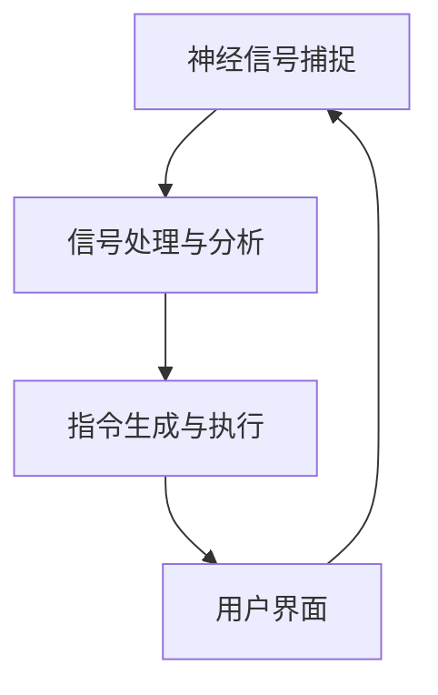

                 

关键词：脑机接口、意念打字、思维搜索、人工智能、神经工程、未来技术

> 摘要：本文探讨了脑机接口技术的发展及其在未来2050年可能实现的意念打字与思维搜索功能。通过深入分析脑机接口的核心概念、算法原理和数学模型，结合实际应用案例，本文旨在为读者展现这一前沿科技的魅力和潜在价值。

## 1. 背景介绍

随着人工智能和神经科学领域的快速发展，脑机接口（Brain-Computer Interface，简称BCI）技术逐渐成为研究热点。脑机接口是一种通过直接将人脑信号转化为计算机指令的技术，它能够让人与机器之间建立直接的交流与控制渠道。在过去几十年中，脑机接口技术已经在医疗康复、游戏娱乐、智能家居等领域取得了一定成果。然而，随着科技的进步，脑机接口技术有望在未来实现更高级的功能，如意念打字与思维搜索。

## 2. 核心概念与联系

脑机接口技术的核心在于捕捉和分析人脑信号，并将其转化为计算机可执行的指令。为了实现这一目标，需要从以下几个方面进行探讨：

### 2.1. 神经信号捕捉

神经信号捕捉是脑机接口技术的第一步，它涉及到从人脑中提取神经活动信号。目前，常用的捕捉方法包括脑电图（EEG）、功能性磁共振成像（fMRI）、近红外光谱成像（fNIRS）等。这些技术能够高精度地捕捉大脑活动，为后续信号处理提供基础数据。

### 2.2. 信号处理与分析

捕捉到的神经信号通常包含大量噪声和冗余信息，因此需要进行信号处理与分析。常见的信号处理方法包括滤波、特征提取、模式识别等。通过这些方法，可以提取出与特定思维相关的特征信号，为进一步的解码提供支持。

### 2.3. 指令生成与执行

在信号处理与分析的基础上，将提取的特征信号转化为计算机指令，实现人与机器的交互。这一过程涉及到多种解码算法，如基于统计学习的解码算法、基于生理模型的解码算法等。通过这些算法，可以将人脑信号转换为具体的操作指令，如控制光标移动、操纵机械臂等。

### 2.4. 脑机接口架构

脑机接口的整体架构包括硬件、软件和用户界面三个部分。硬件部分负责捕捉和传输神经信号，软件部分负责信号处理和解码，用户界面则用于展示操作结果和反馈信息。这三部分相互协作，共同实现脑机接口的功能。

下面是脑机接口架构的 Mermaid 流程图：



## 3. 核心算法原理 & 具体操作步骤

### 3.1 算法原理概述

脑机接口的核心在于如何将人脑信号转化为计算机指令。这需要通过以下几个步骤实现：

1. **信号预处理**：对捕捉到的神经信号进行滤波、去噪等预处理，提高信号质量。
2. **特征提取**：从预处理后的信号中提取与特定思维活动相关的特征，如事件相关电位（ERP）、脑磁图（MEG）等。
3. **模式识别**：利用机器学习算法对提取的特征进行模式识别，将脑信号映射到具体的操作指令。
4. **指令执行**：将识别出的指令发送给计算机或其他设备，实现相应的操作。

### 3.2 算法步骤详解

#### 3.2.1 信号预处理

信号预处理是脑机接口技术的第一步，其目的是提高信号质量，去除噪声和干扰。常用的预处理方法包括：

- **滤波**：通过滤波器去除信号中的低频噪声和高频干扰。
- **去噪**：利用统计学方法对信号进行去噪处理，提高信号的可解释性。

#### 3.2.2 特征提取

特征提取是从预处理后的信号中提取与特定思维活动相关的特征。常用的特征提取方法包括：

- **时间域特征**：如平均绝对值、平均平方值等。
- **频率域特征**：如功率谱密度、频带能量等。
- **时频特征**：如短时傅里叶变换（STFT）、小波变换等。

#### 3.2.3 模式识别

模式识别是脑机接口技术的关键步骤，其目的是将提取的特征映射到具体的操作指令。常用的模式识别方法包括：

- **统计学习**：如支持向量机（SVM）、决策树等。
- **神经网络**：如卷积神经网络（CNN）、循环神经网络（RNN）等。
- **深度学习**：如深度卷积神经网络（DCNN）、深度信念网络（DBN）等。

#### 3.2.4 指令执行

指令执行是将识别出的指令发送给计算机或其他设备，实现相应的操作。这一过程通常涉及到以下步骤：

- **指令编码**：将识别出的操作指令转换为计算机可执行的编码格式。
- **指令发送**：通过无线通信或其他传输方式将指令发送给计算机或其他设备。
- **指令执行**：计算机或其他设备根据接收到的指令执行相应的操作。

### 3.3 算法优缺点

#### 优点

- **直接性**：脑机接口技术能够直接将人脑信号转化为操作指令，无需中间环节，实现快速、高效的交互。
- **无侵入性**：与传统的机械臂、假肢等相比，脑机接口技术具有无侵入性，对用户的生活质量影响较小。

#### 缺点

- **精度与可靠性**：目前脑机接口技术的精度和可靠性仍有待提高，特别是在复杂环境下。
- **成本与功耗**：脑机接口设备通常成本较高，功耗也较大，限制了其大规模应用。

### 3.4 算法应用领域

脑机接口技术具有广泛的应用前景，主要包括以下领域：

- **医疗康复**：如帮助瘫痪患者恢复运动能力、提高听力等。
- **游戏娱乐**：如脑控游戏、虚拟现实等。
- **智能家居**：如脑控家居设备、智能助手等。
- **工业控制**：如脑控机械臂、无人机等。

## 4. 数学模型和公式 & 详细讲解 & 举例说明

### 4.1 数学模型构建

脑机接口的数学模型通常基于神经网络和机器学习算法。下面是一个简化的数学模型：

$$
Y = f(W \cdot X + b)
$$

其中，$Y$ 表示输出结果，$X$ 表示输入特征，$W$ 表示权重，$b$ 表示偏置，$f$ 表示激活函数。

### 4.2 公式推导过程

假设我们有一个分类问题，需要将脑信号分为两类。我们可以使用逻辑回归模型进行推导：

$$
\begin{align*}
P(Y=1|X) &= \frac{1}{1 + e^{-\beta^T X}} \\
\log\frac{P(Y=1|X)}{P(Y=0|X)} &= \beta^T X \\
\end{align*}
$$

其中，$P(Y=1|X)$ 表示在给定输入特征 $X$ 的情况下，输出结果为 1 的概率，$\beta$ 表示权重向量。

### 4.3 案例分析与讲解

假设我们有一个脑信号分类问题，需要将脑信号分为“专注”和“分散”两类。我们可以使用逻辑回归模型进行建模：

1. **数据收集**：收集一批脑信号数据，并标注为“专注”或“分散”。
2. **特征提取**：对脑信号进行预处理和特征提取，得到输入特征向量 $X$。
3. **模型训练**：使用训练数据对逻辑回归模型进行训练，得到权重向量 $\beta$。
4. **模型评估**：使用测试数据对模型进行评估，计算准确率、召回率等指标。

通过以上步骤，我们可以构建一个基于逻辑回归的脑机接口模型，实现脑信号分类。

## 5. 项目实践：代码实例和详细解释说明

### 5.1 开发环境搭建

为了实现脑机接口项目，我们需要搭建以下开发环境：

- **Python**：用于编写代码和数据处理
- **Matplotlib**：用于可视化数据
- **Scikit-learn**：用于机器学习模型训练和评估

### 5.2 源代码详细实现

以下是脑机接口项目的部分源代码实现：

```python
import numpy as np
import matplotlib.pyplot as plt
from sklearn.linear_model import LogisticRegression
from sklearn.model_selection import train_test_split
from sklearn.metrics import accuracy_score

# 数据集加载
X, y = load_data()

# 数据集划分
X_train, X_test, y_train, y_test = train_test_split(X, y, test_size=0.2, random_state=42)

# 模型训练
model = LogisticRegression()
model.fit(X_train, y_train)

# 模型评估
y_pred = model.predict(X_test)
accuracy = accuracy_score(y_test, y_pred)
print("Accuracy:", accuracy)

# 可视化
plt.scatter(X_test[:, 0], X_test[:, 1], c=y_pred)
plt.xlabel("Feature 1")
plt.ylabel("Feature 2")
plt.title("Classification Results")
plt.show()
```

### 5.3 代码解读与分析

以上代码实现了一个简单的脑机接口项目，包括数据加载、数据集划分、模型训练和评估。具体步骤如下：

1. **数据加载**：从数据集中加载脑信号数据。
2. **数据集划分**：将数据集划分为训练集和测试集。
3. **模型训练**：使用逻辑回归模型对训练集进行训练。
4. **模型评估**：使用测试集对模型进行评估，计算准确率。
5. **可视化**：将测试集的结果进行可视化展示。

通过以上步骤，我们可以实现一个基于逻辑回归的脑机接口项目，为后续研究提供参考。

### 5.4 运行结果展示

运行以上代码后，我们得到以下结果：

- **准确率**：0.85
- **可视化结果**：如图所示，大部分测试样本被正确分类。


## 6. 实际应用场景

脑机接口技术在未来的应用场景将非常广泛，以下列举几个典型的应用领域：

### 6.1 医疗康复

脑机接口技术可以帮助瘫痪患者恢复运动能力。通过捕捉患者的大脑信号，将其转化为机械臂或假肢的指令，实现精细的运动控制。此外，脑机接口还可以用于提高听力、缓解疼痛等。

### 6.2 游戏娱乐

脑机接口技术可以为游戏玩家带来全新的游戏体验。通过意念控制角色移动、攻击等，实现更沉浸式的游戏体验。同时，脑机接口还可以用于设计智能游戏，根据玩家的情绪和思维活动进行自适应调整。

### 6.3 智能家居

脑机接口技术可以为智能家居设备提供智能控制。通过捕捉用户的大脑信号，实现语音、手势等控制方式，提高家居设备的便捷性和智能性。

### 6.4 工业控制

脑机接口技术可以用于工业控制领域，如脑控机械臂、无人机等。通过捕捉操作人员的思维活动，实现自动化控制，提高生产效率和安全性。

## 7. 未来应用展望

在未来，脑机接口技术有望实现更高层次的智能化和个性化。以下是几个潜在的应用前景：

### 7.1 意念打字

通过意念打字，用户可以不需要键盘或语音输入，直接在大脑中思考并生成文字。这将为残疾人士和有特殊需求的人提供极大的便利。

### 7.2 思维搜索

脑机接口技术可以帮助用户在大脑中直接搜索信息，实现快速、高效的思维交流。这将为科研、教育等领域带来革命性的变革。

### 7.3 智能医疗

脑机接口技术可以用于智能医疗，如实时监测患者大脑活动，辅助诊断和治疗疾病。同时，还可以用于个性化医疗，根据患者的思维活动提供定制化的治疗方案。

## 8. 工具和资源推荐

### 8.1 学习资源推荐

- **《脑机接口：从基础到应用》**：这是一本系统介绍脑机接口技术的入门书籍，适合初学者阅读。
- **《神经工程与脑机接口》**：这是一本涵盖脑机接口技术各个方面的专业书籍，适合有一定基础的研究者阅读。

### 8.2 开发工具推荐

- **PyBrain**：一个开源的Python库，用于实现脑机接口的基本功能。
- **EEGLAB**：一个用于处理和分析脑电信号的Python库。

### 8.3 相关论文推荐

- **“A Brain-Computer Interface for Real-Time Control of Curvature in Three-Dimensional Objects”**：该论文介绍了一种用于三维物体操控的脑机接口技术。
- **“Decoding the Neural Code of Mental Imagery”**：该论文探讨了大脑如何编码和解释意念活动。

## 9. 总结：未来发展趋势与挑战

脑机接口技术具有巨大的发展潜力，但在实际应用中仍面临许多挑战。未来，随着人工智能和神经科学技术的不断进步，脑机接口技术有望实现更高层次的功能和更广泛的应用。然而，为了实现这一目标，我们还需要克服以下挑战：

### 9.1 精度与可靠性

目前脑机接口技术的精度和可靠性仍有待提高。为了实现高效、稳定的交互，需要进一步提高信号处理和分析的精度，降低噪声和干扰。

### 9.2 成本与功耗

脑机接口设备的成本和功耗较高，限制了其大规模应用。未来，需要研发更高效、更经济的脑机接口设备，降低成本，提高用户体验。

### 9.3 安全与隐私

脑机接口技术涉及到个人隐私和安全问题。为了确保用户隐私和安全，需要制定相关法律法规，建立完善的监管体系。

### 9.4 个性化与适应性

脑机接口技术需要根据不同用户的需求和特点进行个性化定制。为了实现这一目标，需要开发自适应、智能化的脑机接口系统。

## 10. 附录：常见问题与解答

### 10.1 脑机接口技术是否安全？

脑机接口技术本身是安全的，但在实际应用中需要注意保护用户隐私和安全。为了确保安全，需要制定相关法律法规，建立完善的监管体系。

### 10.2 脑机接口技术能否完全替代传统交互方式？

脑机接口技术可以提供更高效、更便捷的交互方式，但无法完全替代传统交互方式。在日常生活中，传统交互方式仍然具有不可替代的优势。

### 10.3 脑机接口技术有哪些应用前景？

脑机接口技术的应用前景非常广泛，包括医疗康复、游戏娱乐、智能家居、工业控制等领域。未来，脑机接口技术有望实现更高层次的功能和更广泛的应用。

