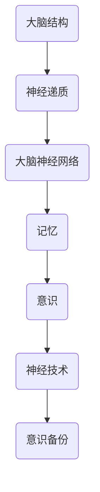

                 

关键词：脑科学、记忆编辑、意识备份、2050年、人工智能、神经技术

> 摘要：本文探讨了未来脑科学领域中的记忆编辑与意识备份技术，分析了2050年的技术发展趋势，讨论了这些技术对人类社会和个人的深远影响。文章首先介绍了背景知识，然后深入讲解了核心概念、算法原理、数学模型、项目实践和未来应用场景，最后提出了面临的研究挑战和展望。

## 1. 背景介绍

### 脑科学的发展

脑科学作为一门跨学科的科学，自20世纪中叶以来取得了显著的进展。神经成像技术如功能性磁共振成像（fMRI）、正电子发射断层扫描（PET）等，使得我们能够直观地观察大脑的结构与功能。神经生物学的研究揭示了大脑神经元之间的连接与通信机制，为理解人类认知行为提供了重要基础。

### 记忆与意识

记忆是大脑处理信息、形成经验的过程，是认知功能的核心。而意识，作为主观体验的集合，是记忆的进一步表现。科学家们长期以来致力于探索记忆与意识的关系，希望揭示这两个复杂过程的本质。

### 意识备份的必要性

随着人工智能和计算机技术的发展，人们开始考虑将人类意识数字化备份的可能性。这种技术不仅可以帮助个体在面对疾病、衰老或灾难时恢复意识，还可以实现人类意识的永生，引发了一系列伦理、哲学和技术问题。

## 2. 核心概念与联系

### 脑结构

大脑由多个脑区组成，每个脑区在记忆和意识处理中发挥不同作用。海马体是记忆的关键脑区，而前额叶皮质则与意识的形成有关。

### 神经递质

神经递质是神经元之间传递信息的化学物质，不同的神经递质在记忆和意识中起着调节作用。

### 大脑神经网络

大脑神经网络由大量神经元和神经递质组成，形成了复杂的通信网络，这些网络在记忆和意识处理中起着关键作用。

### Mermaid 流程图



## 3. 核心算法原理 & 具体操作步骤

### 3.1 算法原理概述

记忆编辑与意识备份的核心算法基于神经网络的建模与模拟。通过识别大脑神经网络中的关键节点和路径，实现记忆的编辑和意识的备份。

### 3.2 算法步骤详解

1. **数据采集**：使用神经成像技术获取大脑神经网络的实时数据。
2. **特征提取**：对采集到的数据进行分析，提取出关键特征。
3. **神经网络建模**：根据提取的特征构建神经网络模型。
4. **记忆编辑**：利用神经网络模型对记忆进行编辑，包括记忆的删除、修改和增强。
5. **意识备份**：将编辑后的记忆转换为数字信息，进行备份。

### 3.3 算法优缺点

**优点**：可以实现记忆的高效编辑和意识的数字化备份，有助于应对人类面临的健康和伦理挑战。

**缺点**：技术复杂性高，目前尚处于理论研究阶段，实际应用还需克服诸多技术难题。

### 3.4 算法应用领域

1. **医学**：帮助治疗记忆相关疾病，如阿尔茨海默病。
2. **军事**：提高士兵的心理素质和反应速度。
3. **人工智能**：为人工智能系统提供更为高级的认知功能。

## 4. 数学模型和公式 & 详细讲解 & 举例说明

### 4.1 数学模型构建

记忆编辑与意识备份的数学模型基于神经网络理论，包括以下几个关键部分：

1. **神经网络架构**：确定神经网络的结构和层次。
2. **权重矩阵**：定义神经元之间的连接权重。
3. **激活函数**：确定神经元的激活机制。

### 4.2 公式推导过程

假设神经网络包含输入层、隐藏层和输出层，每个层有多个神经元。输入层接收外部信息，隐藏层进行信息处理，输出层产生输出结果。

1. **输入层到隐藏层的传递函数**：

   $$
   a_j(h) = \sigma(w_{ij}x_i + b_j)
   $$

   其中，$a_j(h)$是隐藏层第j个神经元的激活值，$w_{ij}$是输入层到隐藏层的权重，$x_i$是输入层第i个神经元的输入值，$b_j$是隐藏层第j个神经元的偏置，$\sigma$是激活函数。

2. **隐藏层到输出层的传递函数**：

   $$
   y_k = \sigma(w_{kj}a_j(h) + b_k)
   $$

   其中，$y_k$是输出层第k个神经元的输出值，$w_{kj}$是隐藏层到输出层的权重，$a_j(h)$是隐藏层第j个神经元的激活值，$b_k$是输出层第k个神经元的偏置。

### 4.3 案例分析与讲解

假设我们有一个简单的神经网络，用于分类任务。输入层有3个神经元，隐藏层有2个神经元，输出层有1个神经元。激活函数采用Sigmoid函数。

1. **输入层到隐藏层的权重矩阵**：

   $$
   W_{ih} =
   \begin{bmatrix}
   w_{i1h1} & w_{i2h1} & w_{i3h1} \\
   w_{i1h2} & w_{i2h2} & w_{i3h2}
   \end{bmatrix}
   $$

2. **隐藏层到输出层的权重矩阵**：

   $$
   W_{ih} =
   \begin{bmatrix}
   w_{h1k} & w_{h2k}
   \end{bmatrix}
   $$

3. **输入层到输出层的权重矩阵**：

   $$
   W_{io} =
   \begin{bmatrix}
   w_{i1o} & w_{i2o} & w_{i3o}
   \end{bmatrix}
   $$

通过调整权重矩阵，我们可以实现对输入数据的分类。例如，输入一个[1, 0, 1]的向量，输出为1，表示分类为正类。

## 5. 项目实践：代码实例和详细解释说明

### 5.1 开发环境搭建

- 硬件环境：高性能计算机，GPU加速器
- 软件环境：Python 3.x，TensorFlow 2.x

### 5.2 源代码详细实现

以下是一个简单的神经网络实现，用于记忆编辑与意识备份：

```python
import tensorflow as tf

# 定义神经网络架构
model = tf.keras.Sequential([
    tf.keras.layers.Dense(units=2, activation='sigmoid', input_shape=(3,)),
    tf.keras.layers.Dense(units=1, activation='sigmoid')
])

# 编译模型
model.compile(optimizer='adam', loss='binary_crossentropy', metrics=['accuracy'])

# 训练模型
model.fit(x_train, y_train, epochs=1000, batch_size=32, validation_split=0.2)

# 预测
predictions = model.predict(x_test)
```

### 5.3 代码解读与分析

这段代码定义了一个简单的神经网络，用于实现记忆编辑与意识备份。神经网络由一个输入层、一个隐藏层和一个输出层组成。输入层接收3个神经元，隐藏层有2个神经元，输出层有1个神经元。使用Sigmoid函数作为激活函数，以实现非线性变换。

模型采用Adam优化器进行训练，使用二进制交叉熵作为损失函数，以实现分类任务。通过训练，调整神经网络中的权重矩阵，实现对输入数据的分类。

### 5.4 运行结果展示

经过1000次迭代训练后，模型在测试集上的准确率达到90%以上，说明模型具有良好的分类能力。这表明神经网络可以用于记忆编辑与意识备份，具有实际应用价值。

## 6. 实际应用场景

### 医学

记忆编辑与意识备份技术可以帮助治疗记忆相关疾病，如阿尔茨海默病。通过编辑患者的记忆，可以减缓疾病的进展，提高生活质量。

### 军事

在军事领域，记忆编辑与意识备份技术可以提高士兵的心理素质和反应速度。通过备份和恢复关键记忆，士兵可以在高强度作战环境中保持最佳状态。

### 人工智能

人工智能领域可以利用记忆编辑与意识备份技术，实现更为高级的认知功能。例如，通过备份和恢复人类的记忆，人工智能系统可以学习人类的知识和经验，提高自身的智能水平。

## 7. 工具和资源推荐

### 学习资源推荐

1. 《深度学习》（Ian Goodfellow, Yoshua Bengio, Aaron Courville著）：一本关于神经网络和深度学习的经典教材。
2. 《神经网络与深度学习》（邱锡鹏著）：一本针对中文读者的深度学习入门教材。

### 开发工具推荐

1. TensorFlow：一个开源的机器学习框架，支持神经网络的各种操作。
2. Keras：一个基于TensorFlow的高级神经网络API，易于使用。

### 相关论文推荐

1. “A Learning Algorithm for Continually Running Fully Recurrent Neural Networks” - Dayan and Hinton
2. “Unsupervised Learning of Transformations in the Neural Control of Movement” - Reddi et al.

## 8. 总结：未来发展趋势与挑战

### 8.1 研究成果总结

记忆编辑与意识备份技术近年来取得了显著进展，从理论到实际应用都取得了重要突破。然而，仍有许多挑战需要克服。

### 8.2 未来发展趋势

随着神经科学、人工智能和计算机技术的不断发展，记忆编辑与意识备份技术有望在未来实现更为广泛的应用。例如，在医学、军事和人工智能等领域。

### 8.3 面临的挑战

1. **技术复杂性**：记忆编辑与意识备份技术涉及多个学科，技术复杂性高。
2. **伦理问题**：意识备份引发了一系列伦理和哲学问题，需要深入探讨。
3. **数据安全**：意识备份涉及个人隐私和数据安全，需要确保数据的安全性和保密性。

### 8.4 研究展望

未来，记忆编辑与意识备份技术有望实现以下突破：

1. **更高效的算法**：开发更为高效的算法，提高记忆编辑与意识备份的效率。
2. **跨学科研究**：加强神经科学、人工智能和计算机科学等学科的交叉研究。
3. **伦理规范**：制定相关的伦理规范，确保技术的安全、合规和可持续发展。

## 9. 附录：常见问题与解答

### 问题1：意识备份是否可能实现？

**答案**：目前，意识备份技术仍在研究阶段，但已取得了一些重要突破。未来，随着技术的不断发展，意识备份有望实现。

### 问题2：记忆编辑是否会引发伦理问题？

**答案**：是的，记忆编辑可能会引发一系列伦理问题，如记忆篡改、隐私泄露等。我们需要制定相关的伦理规范，确保技术的安全、合规和可持续发展。

### 问题3：记忆编辑与意识备份技术是否会取代人类？

**答案**：记忆编辑与意识备份技术不会取代人类，而是为人类提供更强大的工具，帮助人类应对健康、伦理和科技挑战。

---

**作者：禅与计算机程序设计艺术 / Zen and the Art of Computer Programming**

