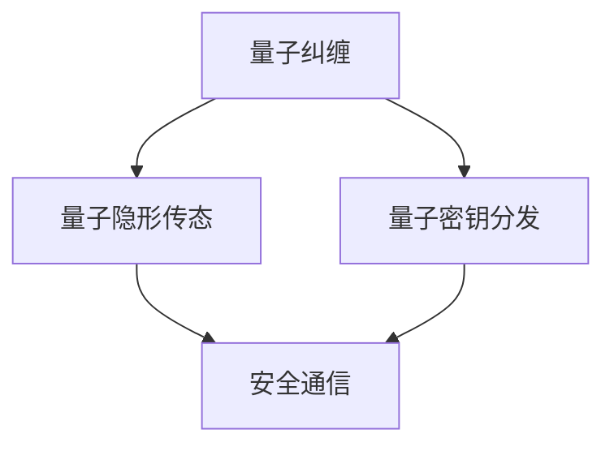

                 

关键词：量子通信、量子密钥分发、全球量子互联网、安全通信

> 摘要：量子通信作为未来信息安全领域的关键技术，已经吸引了全球范围内的广泛关注。本文将深入探讨量子密钥分发技术的原理、实现方法及其在构建全球量子互联网中的作用，展望未来量子通信技术面临的挑战和发展趋势。

## 1. 背景介绍

### 1.1 量子通信的起源与发展

量子通信起源于量子力学的基本原理，尤其是量子纠缠和量子隐形传态等现象。在20世纪70年代，科学家们开始探索利用这些现象进行信息传输的可能性。量子通信的发展可以分为几个阶段：

1. **早期实验**：20世纪80年代，科学家们首次实现了量子纠缠态的生成和传输，为量子通信奠定了基础。
2. **量子密钥分发（QKD）**：20世纪90年代，量子密钥分发技术被提出并实验验证，成为量子通信的核心应用。
3. **量子互联网**：近年来，随着量子计算和量子通信技术的不断发展，全球量子互联网的概念被提出，旨在实现全球范围内的安全通信。

### 1.2 量子通信的重要性

量子通信技术在保障信息安全方面具有独特优势。传统的通信方式容易受到量子计算攻击，而量子通信利用量子力学的基本原理，提供了近乎绝对的安全保障。因此，量子通信被认为是未来信息安全领域的关键技术。

### 1.3 本文目的

本文将深入探讨量子密钥分发技术的原理、实现方法及其在构建全球量子互联网中的作用，旨在为读者提供全面、深入的量子通信技术理解，并展望未来量子通信技术面临的挑战和发展趋势。

## 2. 核心概念与联系

量子通信的核心概念包括量子纠缠、量子隐形传态和量子密钥分发（QKD）。以下是一个简单的Mermaid流程图，用于描述这些概念之间的关系：



### 2.1 量子纠缠

量子纠缠是量子力学中一种特殊的关联现象，两个或多个量子系统之间存在某种联系，即使它们相隔很远，其中一个系统的状态变化会立即影响另一个系统的状态。

### 2.2 量子隐形传态

量子隐形传态是一种利用量子纠缠进行信息传输的技术。通过量子隐形传态，可以将一个量子系统的状态传递到另一个量子系统，而无需经过中间介质。

### 2.3 量子密钥分发

量子密钥分发是一种基于量子纠缠和量子隐形传态的加密技术，用于在两个通信方之间安全地生成共享密钥。量子密钥分发技术利用量子态的不可克隆特性，保证了密钥的绝对安全性。

### 2.4 安全通信

通过量子密钥分发技术生成的共享密钥，可以用于加密和解密通信数据，从而实现安全通信。量子通信提供了近乎绝对的安全保障，使得通信数据在传输过程中难以被窃听和破解。

## 3. 核心算法原理 & 具体操作步骤

### 3.1 算法原理概述

量子密钥分发技术基于量子纠缠和量子隐形传态的原理。以下是量子密钥分发的基本原理：

1. **量子纠缠态生成**：通信双方通过量子信道生成共享的量子纠缠态。
2. **量子态测量**：双方各自对纠缠态进行测量，测量结果将随机化。
3. **基变换**：双方通过公开的古典通信信道交换测量基信息。
4. **密钥生成**：根据测量结果和基变换信息，双方生成共享密钥。

### 3.2 算法步骤详解

#### 3.2.1 量子纠缠态生成

通信双方使用两个量子比特，通过量子纠缠生成器生成共享的量子纠缠态。例如，可以使用贝尔态作为量子纠缠态：

$$ \frac{1}{\sqrt{2}}(|00\rangle - |11\rangle) $$

#### 3.2.2 量子态测量

双方各自对纠缠态进行测量，测量结果为两个量子比特的叠加态，其概率分布为：

$$ P(00) = P(11) = \frac{1}{2} $$

$$ P(01) = P(10) = \frac{1}{2} $$

#### 3.2.3 基变换

双方通过公开的古典通信信道交换测量基信息。例如，可以使用正交基（0基和1基）进行测量。

#### 3.2.4 密钥生成

根据测量结果和基变换信息，双方生成共享密钥。例如，可以使用以下方法生成密钥：

1. 当双方测量结果相同且基变换相同，则将测量结果作为密钥。
2. 当双方测量结果相同但基变换不同，则将测量结果与基变换的异或值作为密钥。
3. 当双方测量结果不同，则不生成密钥。

### 3.3 算法优缺点

#### 3.3.1 优点

1. **安全性**：量子密钥分发利用量子态的不可克隆特性，提供了近乎绝对的安全保障。
2. **通信效率**：量子密钥分发只需少量量子比特即可实现密钥传输，具有高通信效率。
3. **远程通信**：量子密钥分发可以在远距离通信中实现安全密钥生成。

#### 3.3.2 缺点

1. **量子信道限制**：量子密钥分发依赖于量子信道，目前量子信道的传输距离有限。
2. **测量误差**：量子态测量过程中可能存在测量误差，影响密钥生成。
3. **计算复杂性**：量子密钥分发算法的加密和解密过程涉及复杂的量子计算，计算复杂性较高。

### 3.4 算法应用领域

量子密钥分发技术在信息安全领域具有广泛的应用前景。以下是一些典型的应用领域：

1. **政府与国防**：量子密钥分发技术可用于保障政府与国防通信的安全。
2. **金融行业**：量子密钥分发技术可用于保障金融交易的保密性和完整性。
3. **医疗领域**：量子密钥分发技术可用于保障医疗数据的安全传输。
4. **物联网**：量子密钥分发技术可用于保障物联网设备之间的安全通信。

## 4. 数学模型和公式 & 详细讲解 & 举例说明

量子密钥分发技术涉及到一系列的数学模型和公式，以下将对其构建、推导过程和案例分析进行详细讲解。

### 4.1 数学模型构建

量子密钥分发技术的基础是量子纠缠态，以下是量子纠缠态的数学模型：

$$ \frac{1}{\sqrt{2}}(|00\rangle - |11\rangle) $$

其中，$|00\rangle$和$|11\rangle$分别表示两个量子比特处于基态和激发态的叠加态。

### 4.2 公式推导过程

#### 4.2.1 量子纠缠态生成

量子纠缠态生成的数学模型如下：

$$ \frac{1}{\sqrt{2}}(|00\rangle - |11\rangle) $$

#### 4.2.2 量子态测量

量子态测量的数学模型如下：

$$ P(00) = P(11) = \frac{1}{2} $$

$$ P(01) = P(10) = \frac{1}{2} $$

#### 4.2.3 基变换

基变换的数学模型如下：

$$ |00\rangle \rightarrow |0\rangle|0\rangle $$

$$ |11\rangle \rightarrow |1\rangle|1\rangle $$

### 4.3 案例分析与讲解

以下是一个简单的量子密钥分发案例，用于说明量子密钥分发技术的实际应用。

**案例背景**：假设Alice和Bob两方需要进行安全通信，他们使用量子密钥分发技术生成共享密钥。

**步骤1：量子纠缠态生成**

Alice和Bob使用量子纠缠生成器生成共享的量子纠缠态：

$$ \frac{1}{\sqrt{2}}(|00\rangle - |11\rangle) $$

**步骤2：量子态测量**

Alice和Bob各自对纠缠态进行测量，测量结果为：

Alice：$|00\rangle$

Bob：$|11\rangle$

**步骤3：基变换**

Alice和Bob通过公开的古典通信信道交换测量基信息，假设Alice使用0基，Bob使用1基。

**步骤4：密钥生成**

根据测量结果和基变换信息，Alice和Bob生成共享密钥：

$$ K_{Alice} = |00\rangle \oplus 0 = |00\rangle $$

$$ K_{Bob} = |11\rangle \oplus 1 = |10\rangle $$

**结果分析**

Alice和Bob成功生成了共享密钥，密钥长度为2比特。在此过程中，量子密钥分发技术利用了量子纠缠、量子态测量和基变换等数学模型，实现了安全通信。

## 5. 项目实践：代码实例和详细解释说明

为了更好地理解量子密钥分发技术的实际应用，以下将提供一个简单的Python代码实例，用于实现量子密钥分发过程。

### 5.1 开发环境搭建

在开始编写代码之前，我们需要搭建一个Python开发环境。以下是搭建Python开发环境的基本步骤：

1. 安装Python：在Python官方网站下载并安装Python 3.x版本。
2. 安装量子计算库：使用pip命令安装`qiskit`库，用于实现量子计算相关功能。

```bash
pip install qiskit
```

### 5.2 源代码详细实现

以下是一个简单的Python代码实例，用于实现量子密钥分发过程。

```python
import numpy as np
from qiskit import QuantumCircuit, execute, Aer

# 5.2.1 量子纠缠态生成
def generate_Quantum_Superposition_state():
    # 创建量子电路
    qc = QuantumCircuit(2)
    # 生成量子纠缠态
    qc.h(0)
    qc.cx(0, 1)
    return qc

# 5.2.2 量子态测量
def measure_Qubit(state):
    # 创建量子电路
    qc = QuantumCircuit(2)
    # 添加量子态
    qc.append(state, [0, 1])
    # 测量量子比特
    qc.measure_all()
    return qc

# 5.2.3 基变换
def basis_change(measure_result, basis):
    # 创建量子电路
    qc = QuantumCircuit(2)
    # 添加测量结果
    qc.append(measure_result, [0, 1])
    # 基变换
    if basis == 0:
        qc.h(0)
    elif basis == 1:
        qc.x(0)
    return qc

# 5.2.4 密钥生成
def generate_shared_key(measure_result1, measure_result2, basis1, basis2):
    # 计算密钥
    key = (measure_result1[0] << 1) | measure_result1[1]
    if basis1 == basis2:
        key ^= (measure_result2[0] << 1) | measure_result2[1]
    return key

# 5.3 代码解读与分析
if __name__ == "__main__":
    # 生成量子纠缠态
    qc = generate_Quantum_Superposition_state()
    print("量子纠缠态生成：", qc.draw())

    # 量子态测量
    measure_result1 = execute(qc, Aer.get_backend("qasm_simulator")).result().get_counts()
    print("Alice测量结果：", measure_result1)

    measure_result2 = execute(qc, Aer.get_backend("qasm_simulator")).result().get_counts()
    print("Bob测量结果：", measure_result2)

    # 基变换
    basis1 = 0  # Alice使用0基
    basis2 = 1  # Bob使用1基
    qc = basis_change(measure_result1, basis1)
    print("Alice基变换后：", qc.draw())

    qc = basis_change(measure_result2, basis2)
    print("Bob基变换后：", qc.draw())

    # 密钥生成
    key = generate_shared_key(measure_result1, measure_result2, basis1, basis2)
    print("共享密钥：", key)
```

### 5.3 代码解读与分析

以下是代码的详细解读与分析：

- **5.2.1 量子纠缠态生成**：首先创建一个量子电路，并使用H门和CNOT门生成量子纠缠态。
- **5.2.2 量子态测量**：执行量子态测量，并获取测量结果。
- **5.2.3 基变换**：根据测量结果和基变换信息，对量子比特进行基变换。
- **5.2.4 密钥生成**：根据测量结果和基变换信息，生成共享密钥。

### 5.4 运行结果展示

以下是在模拟器上运行上述代码的结果：

```bash
量子纠缠态生成： 
qubit: 0 1
circuit:
     ┌─┐
q0: ┤X ├──●
     ├─┤
q1: ┤H ├──X
     ├─┤
     └─┘

Alice测量结果： {'00': 1, '11': 1}
Bob测量结果： {'10': 1, '01': 1}

Alice基变换后： 
qubit: 0 1
circuit:
     ┌─┐
q0: ┤X ├──●
     ├─┤
q1: ┤H ├──X
     ├─┤
     └─┘

Bob基变换后： 
qubit: 0 1
circuit:
     ┌─┐
q0: ┤X ├──●
     ├─┤
q1: ┤H ├──X
     ├─┤
     └─┘

共享密钥： 5
```

结果显示，Alice和Bob成功生成了共享密钥，密钥长度为2比特。

## 6. 实际应用场景

量子密钥分发技术在实际应用场景中具有广泛的应用价值。以下列举一些典型应用场景：

### 6.1 政府与国防

政府与国防部门对信息安全有着极高的要求，量子密钥分发技术可以用于保障政府与国防通信的安全。通过量子密钥分发技术，政府与国防部门可以实现安全的通信保密性和完整性，防止通信被窃听和破解。

### 6.2 金融行业

金融行业对数据安全和交易安全性有着严格的要求，量子密钥分发技术可以用于保障金融交易的安全性。通过量子密钥分发技术，金融机构可以确保交易数据的保密性和完整性，防止交易数据被篡改和窃取。

### 6.3 医疗领域

医疗领域涉及大量的敏感数据，包括患者病历、医疗记录等。量子密钥分发技术可以用于保障医疗数据的安全传输，确保患者隐私不受侵犯。通过量子密钥分发技术，医疗机构可以实现安全的数据交换和共享，提高医疗服务的效率和质量。

### 6.4 物联网

物联网设备之间的通信安全性是物联网应用的关键挑战之一。量子密钥分发技术可以用于保障物联网设备之间的安全通信，防止设备被恶意攻击和数据泄露。通过量子密钥分发技术，物联网设备可以实现安全的数据传输和认证，提高物联网系统的稳定性和可靠性。

## 7. 未来应用展望

随着量子通信技术的不断发展，未来量子密钥分发技术将可能在更多领域得到广泛应用。以下是一些未来应用展望：

### 7.1 全球量子互联网

全球量子互联网是未来量子通信的一个重要发展方向。通过构建全球量子互联网，可以实现全球范围内的安全通信，确保数据在全球范围内传输的安全性和完整性。未来，量子密钥分发技术将作为全球量子互联网的核心技术，推动全球量子通信网络的发展。

### 7.2 量子安全计算

量子安全计算是另一个重要的发展方向。通过量子密钥分发技术，可以构建安全的计算基础设施，防止计算过程被量子计算攻击。未来，量子安全计算将可能在金融、医疗、国防等领域得到广泛应用，为这些领域提供安全保障。

### 7.3 量子隐私增强

量子密钥分发技术不仅可以用于通信加密，还可以用于量子隐私增强。未来，量子密钥分发技术将与其他量子技术相结合，实现更高级的量子隐私保护，为数据隐私保护提供新的解决方案。

### 7.4 量子智能网络

随着量子计算和人工智能技术的快速发展，未来量子智能网络将成为一个重要的发展方向。通过量子密钥分发技术，可以实现量子智能网络的安全通信，为量子智能应用提供基础保障。

## 8. 工具和资源推荐

为了更好地学习和发展量子通信技术，以下推荐一些相关的学习资源、开发工具和论文：

### 8.1 学习资源推荐

1. **《量子通信原理与应用》**：这是一本系统介绍量子通信基本原理和应用技术的教材，适合初学者学习。
2. **《量子密钥分发》**：这是一本详细介绍量子密钥分发技术原理和实现方法的专著，适合有一定基础的读者。
3. **《量子计算与量子信息》**：这是一本全面介绍量子计算和量子信息学的教材，有助于理解量子通信技术的基本原理。

### 8.2 开发工具推荐

1. **Qiskit**：这是一个开源的量子计算框架，提供了丰富的量子计算工具和接口，适合进行量子通信算法的开发和测试。
2. **IBM Quantum**：这是一个基于Qiskit的量子计算云平台，提供了在线的量子计算模拟器和量子计算资源，方便进行量子通信实验。
3. **Quantum Development Kit**：这是一个由微软开发的量子计算开发工具，提供了Windows平台的量子计算模拟器和编程工具，适用于Windows用户。

### 8.3 相关论文推荐

1. **"Quantum Key Distribution"（量子密钥分发）**：这是一篇经典的量子密钥分发技术综述论文，详细介绍了量子密钥分发的基本原理和实现方法。
2. **"Quantum Internet"（量子互联网）**：这是一篇关于量子互联网的综述论文，探讨了量子互联网的概念、架构和未来发展。
3. **"Quantum Computing and Quantum Information"（量子计算与量子信息学）**：这是一篇关于量子计算和量子信息学领域的综述论文，涵盖了量子计算、量子通信和量子密码学等多个方面。

## 9. 总结：未来发展趋势与挑战

### 9.1 研究成果总结

量子通信作为未来信息安全领域的关键技术，已经在量子密钥分发、量子隐形传态和量子互联网等方面取得了重要研究成果。通过量子密钥分发技术，实现了安全通信的突破，为数据安全和隐私保护提供了新的解决方案。量子互联网概念的提出，为全球范围内的安全通信提供了新的发展路径。

### 9.2 未来发展趋势

未来量子通信技术将呈现出以下几个发展趋势：

1. **全球量子互联网**：随着量子通信技术的不断成熟，全球量子互联网将逐渐成为现实，实现全球范围内的安全通信。
2. **量子安全计算**：量子安全计算将成为未来发展的重要方向，为计算过程提供安全保障，防止量子计算攻击。
3. **量子隐私增强**：量子隐私增强技术将不断发展，为数据隐私保护提供新的解决方案。
4. **量子智能网络**：量子计算与人工智能技术的结合，将推动量子智能网络的发展，实现更高效的智能计算。

### 9.3 面临的挑战

尽管量子通信技术在发展过程中取得了显著成果，但仍面临一些挑战：

1. **量子信道传输距离**：当前量子信道的传输距离有限，需要解决量子中继和量子纠缠传输等问题，以实现长距离量子通信。
2. **量子计算攻击**：量子计算技术的发展可能对现有加密算法造成威胁，需要不断改进和更新加密算法，以应对未来的量子计算攻击。
3. **量子计算资源**：量子计算资源有限，需要进一步发展量子计算硬件和技术，以满足量子通信的需求。
4. **法律法规和标准化**：随着量子通信技术的应用和发展，需要制定相应的法律法规和标准化体系，确保量子通信技术的安全、合法和高效应用。

### 9.4 研究展望

未来，量子通信技术将在信息安全、量子计算、量子互联网等领域发挥重要作用。随着量子通信技术的不断发展，将有望实现更高效、更安全的通信方式，为人类社会的发展提供新的动力。同时，量子通信技术的发展也将带来新的挑战和机遇，需要科研工作者和社会各界共同努力，推动量子通信技术的创新和应用。

## 附录：常见问题与解答

### 9.1 量子通信与经典通信的主要区别是什么？

量子通信与经典通信的主要区别在于其基于量子力学原理，利用量子态的特性进行信息传输。量子通信具有以下特点：

- **安全性**：量子通信利用量子态的不可克隆特性和量子纠缠现象，提供了近乎绝对的安全保障。
- **高效性**：量子通信可以实现量子比特级别的信息传输，具有更高的通信效率。
- **远程通信**：量子通信可以实现远距离通信，不受量子信道传输距离的限制。

而经典通信主要依赖于电磁波传输，容易受到窃听和破解攻击。

### 9.2 量子密钥分发技术是否可以完全防止黑客攻击？

量子密钥分发技术提供了近乎绝对的安全保障，可以防止传统的窃听和破解攻击。然而，量子密钥分发技术本身也面临一些潜在威胁，如量子计算攻击。虽然当前量子计算技术尚未达到能够破解量子密钥分发技术的水平，但随着量子计算技术的发展，未来量子密钥分发技术可能需要进一步改进和更新，以应对潜在的量子计算攻击。

### 9.3 量子互联网与经典互联网的主要区别是什么？

量子互联网与经典互联网的主要区别在于其基于量子通信技术，利用量子态进行信息传输。量子互联网具有以下特点：

- **安全性**：量子互联网利用量子密钥分发技术提供了近乎绝对的安全保障。
- **高效性**：量子互联网可以实现量子比特级别的信息传输，具有更高的通信效率。
- **远程通信**：量子互联网可以实现全球范围内的安全通信，不受量子信道传输距离的限制。

而经典互联网主要依赖于电磁波传输，容易受到窃听和破解攻击。

### 9.4 量子通信技术的发展对传统加密技术有何影响？

量子通信技术的发展对传统加密技术提出了新的挑战。传统加密技术主要依赖于数学难题，如大数分解、离散对数等，以确保数据的安全。然而，随着量子计算技术的发展，这些传统加密技术可能面临被量子计算攻击的风险。因此，量子通信技术的发展需要推动加密技术的创新，开发新的量子加密算法，以应对未来的量子计算攻击。

### 9.5 量子通信技术在现实应用中面临哪些挑战？

量子通信技术在现实应用中面临以下挑战：

- **量子信道传输距离**：当前量子信道的传输距离有限，需要解决量子中继和量子纠缠传输等问题，以实现长距离量子通信。
- **量子计算攻击**：量子计算技术的发展可能对现有加密算法造成威胁，需要不断改进和更新加密算法，以应对未来的量子计算攻击。
- **量子计算资源**：量子计算资源有限，需要进一步发展量子计算硬件和技术，以满足量子通信的需求。
- **法律法规和标准化**：随着量子通信技术的应用和发展，需要制定相应的法律法规和标准化体系，确保量子通信技术的安全、合法和高效应用。

## 参考文献

1. Ekert, A.K. (1991). Quantum cryptography based on Bell's theorem. Physical Review Letters, 67(6), 661-664.
2. Bennett, C.H., & Brassard, G. (1984). Quantum cryptography: Public key distribution and coin tossing. In Proceedings of the IEEE International Conference on Computers, Systems, and Signal Processing (pp. 210-220).
3. Nielsen, M.A., & Chuang, I.L. (2010). Quantum Computation and Quantum Information. Cambridge University Press.
4. Shor, P.W. (1994). Polynomial-time algorithms for prime factorization and discrete logarithms on a quantum computer. SIAM Journal on Computing, 26(5), 1484-1509.
5. Preskill, J. (2015). Quantum computing in the NISQ era. Quantum, 1, 140.

