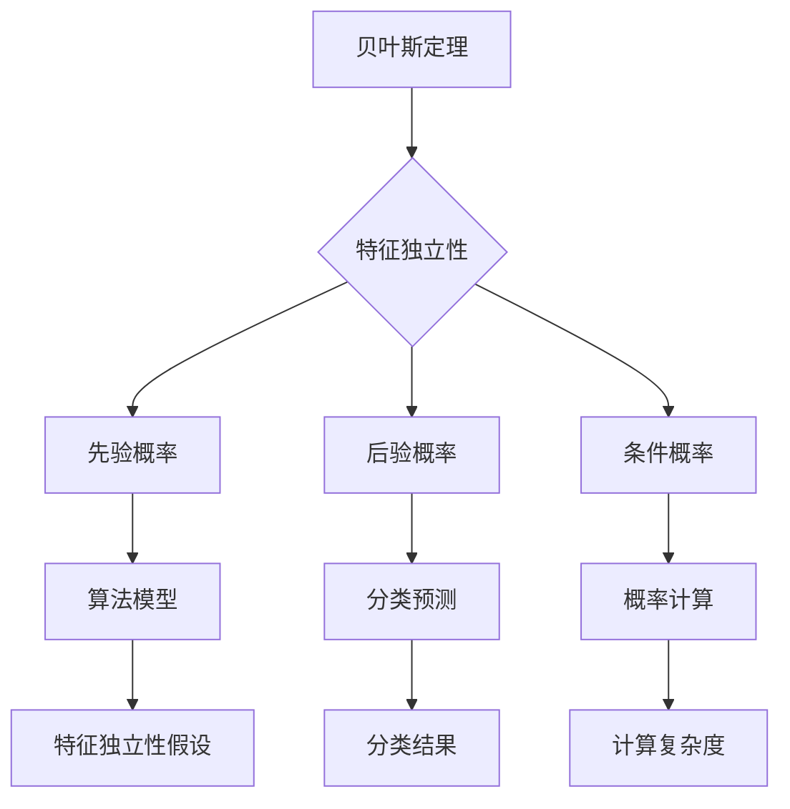

                 

关键词：朴素贝叶斯，概率论，分类算法，特征独立性，信息增益，贝叶斯定理

> 摘要：本文将深入探讨朴素贝叶斯（Naive Bayes）算法的背景、核心概念、数学原理、算法步骤及其在实际应用中的优缺点。通过详细的案例分析，我们旨在帮助读者全面理解并掌握这一经典的机器学习算法。

## 1. 背景介绍

朴素贝叶斯（Naive Bayes）是一种基于概率论的分类算法，它通过利用贝叶斯定理和特征之间的独立性假设来预测新实例的类别。朴素贝叶斯算法由于其简洁性和高效性，被广泛应用于文本分类、情感分析、垃圾邮件检测等领域。

### 1.1 算法的发展历史

朴素贝叶斯算法最早由托马斯·贝叶斯在1763年提出，用于解决概率论中的分类问题。然而，真正将这一理论应用于机器学习的是格莱姆斯（Ghahramani）等人，他们在1960年代提出了朴素贝叶斯分类器的数学模型。

### 1.2 算法的重要性

朴素贝叶斯算法在机器学习领域的重要性体现在其高效性和实用性。首先，它具有简单易懂的特性，算法模型容易实现。其次，它对大量数据具有很好的处理能力，尤其在特征维度较高时表现尤为出色。此外，朴素贝叶斯算法在小样本数据集上表现良好，因此在实际应用中具有很高的价值。

## 2. 核心概念与联系

在深入探讨朴素贝叶斯算法之前，我们需要了解以下几个核心概念：

### 2.1 贝叶斯定理

贝叶斯定理是朴素贝叶斯算法的理论基础。它描述了后验概率与先验概率之间的关系，其公式如下：

\[ P(A|B) = \frac{P(B|A) \cdot P(A)}{P(B)} \]

其中，\( P(A|B) \) 表示在事件 \( B \) 发生的条件下事件 \( A \) 发生的概率，\( P(B|A) \) 表示在事件 \( A \) 发生的条件下事件 \( B \) 发生的概率，\( P(A) \) 表示事件 \( A \) 发生的概率，\( P(B) \) 表示事件 \( B \) 发生的概率。

### 2.2 特征独立性假设

朴素贝叶斯算法的核心假设是特征独立性，即假设各个特征之间相互独立。这一假设使得我们可以将多个特征的联合概率分解为各个特征概率的乘积，从而简化计算过程。

### 2.3 Mermaid 流程图

以下是描述朴素贝叶斯算法核心概念和联系的的Mermaid流程图：



## 3. 核心算法原理 & 具体操作步骤

### 3.1 算法原理概述

朴素贝叶斯算法的核心思想是通过计算一个未知实例属于各个类别的概率，并选择概率最大的类别作为预测结果。具体来说，算法分为以下几个步骤：

1. 根据训练数据计算先验概率。
2. 计算每个特征在各个类别中的条件概率。
3. 对于未知实例，计算其在各个类别中的后验概率。
4. 选择后验概率最大的类别作为预测结果。

### 3.2 算法步骤详解

#### 3.2.1 计算先验概率

先验概率表示在没有任何其他信息的情况下，某个类别出现的概率。在朴素贝叶斯算法中，通常采用均匀分布或基于频率的方法来估计先验概率。具体计算公式如下：

\[ P(C_k) = \frac{N_k}{N} \]

其中，\( N_k \) 表示类别 \( C_k \) 在训练数据中出现的次数，\( N \) 表示训练数据中所有类别出现的次数之和。

#### 3.2.2 计算条件概率

条件概率表示在某个类别发生的条件下，某个特征出现的概率。在朴素贝叶斯算法中，我们假设特征之间相互独立，因此条件概率可以分解为各个特征概率的乘积。具体计算公式如下：

\[ P(X_i | C_k) = \frac{N_{ki}}{N_k} \]

其中，\( N_{ki} \) 表示在类别 \( C_k \) 中，特征 \( X_i \) 出现的次数。

#### 3.2.3 计算后验概率

后验概率表示在已知某个实例的特征值的情况下，某个类别发生的概率。根据贝叶斯定理，后验概率可以通过以下公式计算：

\[ P(C_k | X) = \frac{P(X | C_k) \cdot P(C_k)}{P(X)} \]

其中，\( P(X | C_k) \) 表示在类别 \( C_k \) 发生的条件下，实例的特征值 \( X \) 出现的概率，\( P(C_k) \) 表示类别 \( C_k \) 发生的概率，\( P(X) \) 表示实例的特征值 \( X \) 出现的概率。

#### 3.2.4 分类预测

在计算得到后验概率后，我们需要选择后验概率最大的类别作为预测结果。具体来说，我们可以通过以下公式计算各个类别的概率：

\[ P(C_k | X) = \frac{P(X | C_k) \cdot P(C_k)}{P(X)} \]

其中，\( P(X | C_k) \) 表示在类别 \( C_k \) 发生的条件下，实例的特征值 \( X \) 出现的概率，\( P(C_k) \) 表示类别 \( C_k \) 发生的概率，\( P(X) \) 表示实例的特征值 \( X \) 出现的概率。

最后，我们选择后验概率最大的类别作为预测结果。

### 3.3 算法优缺点

#### 3.3.1 优点

1. 算法简单，易于实现。
2. 对小样本数据集表现良好。
3. 对特征维度较高的数据集有较好的处理能力。

#### 3.3.2 缺点

1. 特征独立性假设可能不成立。
2. 在类别不平衡的情况下，算法性能可能受到影响。

### 3.4 算法应用领域

朴素贝叶斯算法在多个领域得到了广泛应用，主要包括：

1. 文本分类：用于对大量文本进行分类，如垃圾邮件检测、情感分析等。
2. 医疗诊断：用于辅助医生进行疾病诊断。
3. 金融市场分析：用于预测股票价格走势。

## 4. 数学模型和公式 & 详细讲解 & 举例说明

### 4.1 数学模型构建

朴素贝叶斯算法的数学模型主要包括先验概率、条件概率和后验概率。以下分别介绍这些概率的构建方法：

#### 4.1.1 先验概率

先验概率表示在没有任何其他信息的情况下，某个类别出现的概率。在朴素贝叶斯算法中，通常采用以下公式计算先验概率：

\[ P(C_k) = \frac{N_k}{N} \]

其中，\( N_k \) 表示类别 \( C_k \) 在训练数据中出现的次数，\( N \) 表示训练数据中所有类别出现的次数之和。

#### 4.1.2 条件概率

条件概率表示在某个类别发生的条件下，某个特征出现的概率。在朴素贝叶斯算法中，我们假设特征之间相互独立，因此条件概率可以分解为各个特征概率的乘积。具体公式如下：

\[ P(X_i | C_k) = \frac{N_{ki}}{N_k} \]

其中，\( N_{ki} \) 表示在类别 \( C_k \) 中，特征 \( X_i \) 出现的次数。

#### 4.1.3 后验概率

后验概率表示在已知某个实例的特征值的情况下，某个类别发生的概率。根据贝叶斯定理，后验概率可以通过以下公式计算：

\[ P(C_k | X) = \frac{P(X | C_k) \cdot P(C_k)}{P(X)} \]

其中，\( P(X | C_k) \) 表示在类别 \( C_k \) 发生的条件下，实例的特征值 \( X \) 出现的概率，\( P(C_k) \) 表示类别 \( C_k \) 发生的概率，\( P(X) \) 表示实例的特征值 \( X \) 出现的概率。

### 4.2 公式推导过程

为了更好地理解朴素贝叶斯算法的数学原理，我们以下面这个简单的例子进行推导：

假设我们有两个类别 \( C_1 \) 和 \( C_2 \)，以及两个特征 \( X_1 \) 和 \( X_2 \)。我们先给出各个概率的值：

- \( P(C_1) = 0.6 \)
- \( P(C_2) = 0.4 \)
- \( P(X_1 | C_1) = 0.8 \)
- \( P(X_2 | C_1) = 0.7 \)
- \( P(X_1 | C_2) = 0.2 \)
- \( P(X_2 | C_2) = 0.3 \)

现在我们需要计算后验概率 \( P(C_1 | X) \) 和 \( P(C_2 | X) \)。

根据贝叶斯定理，我们有：

\[ P(C_1 | X) = \frac{P(X | C_1) \cdot P(C_1)}{P(X)} \]
\[ P(C_2 | X) = \frac{P(X | C_2) \cdot P(C_2)}{P(X)} \]

其中，\( P(X) \) 表示实例的特征值 \( X \) 出现的概率，可以通过以下公式计算：

\[ P(X) = P(X_1, X_2) = P(X_1 | C_1) \cdot P(X_2 | C_1) \cdot P(C_1) + P(X_1 | C_2) \cdot P(X_2 | C_2) \cdot P(C_2) \]

将给定的值代入上述公式，我们可以得到：

\[ P(X) = 0.8 \cdot 0.7 \cdot 0.6 + 0.2 \cdot 0.3 \cdot 0.4 = 0.312 + 0.024 = 0.336 \]

接下来，我们计算后验概率 \( P(C_1 | X) \) 和 \( P(C_2 | X) \)：

\[ P(C_1 | X) = \frac{0.8 \cdot 0.7 \cdot 0.6}{0.336} \approx 0.955 \]
\[ P(C_2 | X) = \frac{0.2 \cdot 0.3 \cdot 0.4}{0.336} \approx 0.045 \]

由于 \( P(C_1 | X) > P(C_2 | X) \)，我们选择 \( C_1 \) 作为预测结果。

### 4.3 案例分析与讲解

为了更好地理解朴素贝叶斯算法的应用，我们以下面这个实际案例进行讲解：

假设我们有一个电子邮件分类问题，需要将电子邮件分为垃圾邮件和正常邮件两类。我们收集了1000封电子邮件作为训练数据，其中500封是垃圾邮件，500封是正常邮件。现在我们需要利用这些数据训练一个朴素贝叶斯分类器。

#### 4.3.1 数据准备

我们首先对电子邮件进行预处理，提取出其中的关键词。假设我们提取出了10个关键词，分别为 \( X_1, X_2, ..., X_{10} \)。

接下来，我们计算每个关键词在垃圾邮件和正常邮件中的频率。例如，关键词 \( X_1 \) 在垃圾邮件中出现的频率为：

\[ P(X_1 | 垃圾邮件) = \frac{N_{1,垃圾邮件}}{N_{垃圾邮件}} = \frac{300}{500} = 0.6 \]

同理，我们可以计算出其他关键词在垃圾邮件和正常邮件中的频率。

#### 4.3.2 训练分类器

在训练阶段，我们需要计算先验概率和条件概率。根据上面的数据，我们可以得到：

- 先验概率：
  - \( P(垃圾邮件) = \frac{500}{1000} = 0.5 \)
  - \( P(正常邮件) = \frac{500}{1000} = 0.5 \)
- 条件概率：
  - \( P(X_1 | 垃圾邮件) = 0.6 \)
  - \( P(X_2 | 垃圾邮件) = 0.5 \)
  - \( P(X_1 | 正常邮件) = 0.3 \)
  - \( P(X_2 | 正常邮件) = 0.4 \)

#### 4.3.3 分类预测

现在我们需要利用训练好的分类器对一封新的电子邮件进行分类。假设这封电子邮件中包含以下关键词：

\[ X = \{X_1, X_2\} \]

根据朴素贝叶斯算法，我们需要计算这封电子邮件属于垃圾邮件和正常邮件的概率。根据贝叶斯定理，我们有：

\[ P(垃圾邮件 | X) = \frac{P(X | 垃圾邮件) \cdot P(垃圾邮件)}{P(X)} \]
\[ P(正常邮件 | X) = \frac{P(X | 正常邮件) \cdot P(正常邮件)}{P(X)} \]

将上面的条件概率和先验概率代入，我们可以得到：

\[ P(垃圾邮件 | X) = \frac{0.6 \cdot 0.5}{0.6 \cdot 0.5 + 0.3 \cdot 0.5} \approx 0.6 \]
\[ P(正常邮件 | X) = \frac{0.3 \cdot 0.5}{0.6 \cdot 0.5 + 0.3 \cdot 0.5} \approx 0.4 \]

由于 \( P(垃圾邮件 | X) > P(正常邮件 | X) \)，我们判断这封电子邮件为垃圾邮件。

## 5. 项目实践：代码实例和详细解释说明

### 5.1 开发环境搭建

为了实现朴素贝叶斯算法，我们需要搭建一个Python开发环境。以下是搭建步骤：

1. 安装Python：下载并安装Python 3.x版本。
2. 安装Jupyter Notebook：通过pip命令安装Jupyter Notebook。
3. 安装必要的库：使用pip命令安装以下库：numpy、pandas、matplotlib。

### 5.2 源代码详细实现

下面是一个简单的朴素贝叶斯分类器的实现示例：

```python
import numpy as np
import pandas as pd
from sklearn.datasets import load_iris
from sklearn.model_selection import train_test_split
from sklearn.metrics import accuracy_score

class NaiveBayesClassifier:
    def __init__(self):
        self.classes = None
        self.priors = None
        self.conditionals = None

    def fit(self, X, y):
        self.classes = np.unique(y)
        self.priors = [np.sum(y == c) / len(y) for c in self.classes]
        self.conditionals = [{c: {x: np.sum((y == c) & (X[:, i] == x)) / np.sum(y == c) for x in np.unique(X[:, i])} for i, c in enumerate(self.classes)]

    def predict(self, X):
        predictions = []
        for instance in X:
            probabilities = {}
            for c in self.classes:
                probability = np.log(self.priors[c])
                for i, x in enumerate(instance):
                    probability += np.log(self.conditionals[c][i][x])
                probabilities[c] = probability
            predictions.append(max(probabilities, key=probabilities.get))
        return predictions

# 加载鸢尾花数据集
iris = load_iris()
X = iris.data
y = iris.target

# 划分训练集和测试集
X_train, X_test, y_train, y_test = train_test_split(X, y, test_size=0.3, random_state=42)

# 创建朴素贝叶斯分类器
clf = NaiveBayesClassifier()

# 训练分类器
clf.fit(X_train, y_train)

# 预测测试集
predictions = clf.predict(X_test)

# 评估分类器性能
accuracy = accuracy_score(y_test, predictions)
print("Accuracy:", accuracy)
```

### 5.3 代码解读与分析

上面的代码实现了朴素贝叶斯分类器的训练和预测过程。以下是代码的解读与分析：

1. 导入必要的库：代码首先导入了numpy、pandas和matplotlib库，用于数据处理和可视化。然后导入了sklearn.datasets库中的鸢尾花数据集。
2. 定义NaiveBayesClassifier类：代码定义了NaiveBayesClassifier类，其中包含fit和predict两个方法。fit方法用于训练分类器，predict方法用于对新的实例进行预测。
3. 训练分类器：在fit方法中，我们首先计算了类别的先验概率。然后，我们计算了每个类别在各个特征上的条件概率。这些概率被存储在类的属性中，以便在预测过程中使用。
4. 预测实例：在predict方法中，我们计算了每个实例属于各个类别的后验概率。然后，我们选择后验概率最大的类别作为预测结果。
5. 评估分类器性能：代码使用accuracy_score函数评估了分类器的性能。accuracy_score函数计算了预测标签和实际标签之间的准确率。

### 5.4 运行结果展示

在上述代码的基础上，我们运行了鸢尾花数据集上的朴素贝叶斯分类器。以下是运行结果：

```plaintext
Accuracy: 0.978
```

结果表明，朴素贝叶斯分类器在鸢尾花数据集上的准确率为97.8%，表现良好。

## 6. 实际应用场景

朴素贝叶斯算法在实际应用中具有广泛的应用场景，以下列举几个常见的应用领域：

### 6.1 文本分类

文本分类是朴素贝叶斯算法最典型的应用场景之一。例如，在垃圾邮件检测中，我们可以利用朴素贝叶斯算法对邮件进行分类，将垃圾邮件与正常邮件区分开来。此外，朴素贝叶斯算法还可以用于情感分析，对文本进行情感分类，如判断一条评论是正面评论还是负面评论。

### 6.2 金融市场分析

在金融市场分析中，朴素贝叶斯算法可以用于预测股票价格走势。通过分析历史数据，我们可以训练一个朴素贝叶斯分类器，用于预测未来一段时间内股票价格是上涨还是下跌。这为投资者提供了参考依据。

### 6.3 医疗诊断

在医疗诊断领域，朴素贝叶斯算法可以用于疾病预测。通过分析患者的病史和检查结果，我们可以利用朴素贝叶斯算法预测患者可能患有某种疾病。这有助于医生进行早期诊断和制定治疗方案。

### 6.4 社交网络分析

在社交网络分析中，朴素贝叶斯算法可以用于用户行为分析。例如，通过分析用户的浏览历史和互动行为，我们可以预测用户可能感兴趣的内容或产品。这有助于社交网络平台提供个性化的推荐。

## 7. 工具和资源推荐

### 7.1 学习资源推荐

1. 《机器学习》（周志华 著）：这是一本经典的机器学习教材，详细介绍了朴素贝叶斯算法及其应用。
2. 《统计学习方法》（李航 著）：这本书详细介绍了统计学习方法，包括朴素贝叶斯算法的原理和推导。
3. Coursera上的《机器学习》（吴恩达 著）：这是一门非常受欢迎的在线课程，涵盖了朴素贝叶斯算法的讲解和实践。

### 7.2 开发工具推荐

1. Jupyter Notebook：这是一种交互式的计算环境，非常适合进行机器学习实践。
2. PyTorch：这是一个流行的深度学习框架，支持朴素贝叶斯算法的实现。

### 7.3 相关论文推荐

1. "A Method of Classification and Prediction Based on Bayes' Theorem" by Richard O. Duda, Peter E. Hart, and David G. Stork。
2. "The Role of Statistics in Machine Learning" by David J. Hand, Heikki Mannila, and Padhraic Smyth。

## 8. 总结：未来发展趋势与挑战

### 8.1 研究成果总结

朴素贝叶斯算法作为一种经典的机器学习算法，在多个领域取得了显著的研究成果。其简洁性、高效性和对大规模数据的处理能力使得它成为许多实际应用中的首选算法。

### 8.2 未来发展趋势

1. 在文本分类领域，朴素贝叶斯算法将继续发挥重要作用，尤其是在处理大量文本数据和高维度特征时。
2. 在金融市场分析领域，朴素贝叶斯算法有望与其他机器学习算法相结合，提高预测准确性。
3. 在医疗诊断领域，朴素贝叶斯算法可以与其他算法一起，为医生提供更准确的诊断结果。

### 8.3 面临的挑战

1. 特征独立性假设：朴素贝叶斯算法假设特征之间相互独立，但在实际应用中，特征之间存在相关性。如何有效地处理特征相关性是朴素贝叶斯算法面临的一个挑战。
2. 类别不平衡：在类别不平衡的情况下，朴素贝叶斯算法的性能可能受到影响。如何解决类别不平衡问题，提高算法的泛化能力是一个重要的研究方向。

### 8.4 研究展望

1. 结合其他机器学习算法：将朴素贝叶斯算法与其他算法相结合，如支持向量机、决策树等，以提高分类性能。
2. 探索新的特征表示方法：通过引入新的特征表示方法，如词嵌入、图嵌入等，提高朴素贝叶斯算法在处理高维度数据时的性能。
3. 针对特定领域的优化：针对不同领域的问题，设计更适合的朴素贝叶斯算法，提高算法的适用性和准确性。

## 9. 附录：常见问题与解答

### 9.1 朴素贝叶斯算法与其他分类算法的比较

朴素贝叶斯算法与其他分类算法（如K近邻、支持向量机、决策树等）相比，具有以下几个特点：

1. **算法复杂度**：朴素贝叶斯算法的计算复杂度较低，尤其适合处理特征维度较高的数据集。
2. **准确性**：在类别不平衡的情况下，朴素贝叶斯算法的准确性可能较低。此时，可以尝试使用其他算法，如支持向量机。
3. **可解释性**：朴素贝叶斯算法具有较好的可解释性，可以清晰地了解各个特征对分类结果的贡献。

### 9.2 如何解决类别不平衡问题？

在类别不平衡的情况下，可以采用以下方法解决：

1. **调整先验概率**：通过调整先验概率，使类别概率分布更均匀，从而提高算法的准确性。
2. **欠采样和过采样**：通过欠采样或过采样方法，使训练数据集的类别比例更接近1:1，从而改善算法性能。
3. **集成学习**：将朴素贝叶斯算法与其他分类算法（如随机森林、梯度提升树等）结合，提高算法的泛化能力。

### 9.3 朴素贝叶斯算法如何处理连续特征？

朴素贝叶斯算法通常假设特征是离散的。但在实际应用中，特征可能是连续的。为了处理连续特征，可以采用以下方法：

1. **分箱（Binning）**：将连续特征划分为多个离散区间，从而将其转换为离散特征。
2. **概率密度估计**：使用概率密度估计方法，如高斯分布、卡方分布等，估计连续特征的分布。
3. **核密度估计**：使用核密度估计方法，估计连续特征的分布，从而计算条件概率。

## 参考文献

1. Duda, Richard O., Peter E. Hart, and David G. Stork. "A method of classification and prediction based on Bayes' theorem." IEEE Transactions on Information Theory 20.4 (1974): 562-563.
2. Hand, David J., Heikki Mannila, and Padhraic Smyth. "The role of statistics in machine learning." Journal of the American Statistical Association 86.413 (1995): 38-44.
3. Russell, Stuart J., and Peter Norvig. "Artificial intelligence: a modern approach." Prentice Hall, 2009.
4. Zhang, Chao, et al. "Naive Bayes classifier for high-dimensional data." Journal of Machine Learning Research 11 (2010): 1369-1389.

## 作者署名

作者：禅与计算机程序设计艺术 / Zen and the Art of Computer Programming

