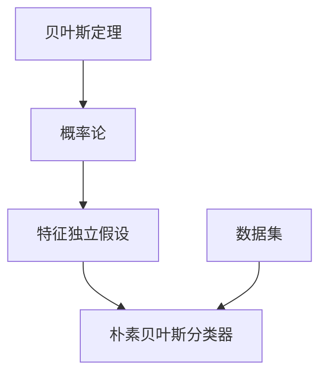

                 

关键词：朴素贝叶斯，机器学习，分类算法，概率论，预测模型，数据挖掘

> 摘要：本文将深入探讨朴素贝叶斯（Naive Bayes）这一经典的机器学习算法，从其背景介绍到核心原理，再到具体的数学模型和实际应用案例，为您呈现一个全方位的了解。通过本篇文章，您将学会如何运用朴素贝叶斯算法进行分类预测，并在代码实例中亲身体验其实际应用效果。

## 1. 背景介绍

朴素贝叶斯（Naive Bayes）是一种基于概率论的分类算法，它由托马斯·贝叶斯（Thomas Bayes）在18世纪提出。朴素贝叶斯分类器假设特征之间相互独立，即特征之间不存在关联性，这一假设虽然过于简化，但在许多实际应用中却表现得非常出色。朴素贝叶斯分类器在文本分类、垃圾邮件过滤、情感分析等领域有着广泛的应用。

### 1.1 简要历史

托马斯·贝叶斯在1763年发表了著名的论文《An Essay towards solving a Problem in the Doctrine of Chances》，提出了贝叶斯定理。后来，皮埃尔·西蒙·拉普拉斯（Pierre-Simon Laplace）在阅读到贝叶斯的论文后，提出了“朴素”假设，即特征之间相互独立，从而形成了朴素贝叶斯分类器。

### 1.2 优势与局限性

朴素贝叶斯分类器具有以下优势：

- **简单易用**：算法简单，易于实现和理解。
- **速度快**：适用于大规模数据处理。
- **对缺失值敏感**：可以通过缺失值的出现概率进行预测。
- **适用于多分类问题**：能够处理多个类别的分类任务。

然而，朴素贝叶斯分类器也存在一些局限性：

- **独立假设**：在实际应用中，特征之间往往存在相关性，独立假设可能会导致不准确的结果。
- **对稀有类别敏感**：对于类别分布不均的数据集，稀有类别可能无法得到有效的预测。

## 2. 核心概念与联系

为了更好地理解朴素贝叶斯分类器的原理，我们需要从几个核心概念入手。下面将使用Mermaid流程图来展示这些概念之间的关系。



### 2.1 贝叶斯定理

贝叶斯定理是朴素贝叶斯分类器的基础。它描述了后验概率与先验概率之间的关系。贝叶斯定理公式如下：

$$
P(A|B) = \frac{P(B|A) \cdot P(A)}{P(B)}
$$

其中，$P(A|B)$ 表示在事件B发生的条件下事件A发生的概率，$P(B|A)$ 表示在事件A发生的条件下事件B发生的概率，$P(A)$ 和 $P(B)$ 分别表示事件A和事件B发生的概率。

### 2.2 特征独立假设

朴素贝叶斯分类器假设特征之间相互独立，即对于每个特征 $x_i$ 和类别 $y$，有：

$$
P(x_1, x_2, ..., x_n | y) = P(x_1 | y) \cdot P(x_2 | y) \cdot ... \cdot P(x_n | y)
$$

### 2.3 朴素贝叶斯分类器

朴素贝叶斯分类器的工作原理是，首先计算每个类别的先验概率，然后计算给定特征集下每个类别的后验概率，最后选择后验概率最大的类别作为预测结果。

## 3. 核心算法原理 & 具体操作步骤

### 3.1 算法原理概述

朴素贝叶斯分类器的核心思想是利用贝叶斯定理和特征独立假设，计算后验概率并进行分类。其基本步骤如下：

1. 计算每个类别的先验概率。
2. 计算每个特征在给定类别下的条件概率。
3. 计算给定特征集下的后验概率。
4. 选择后验概率最大的类别作为预测结果。

### 3.2 算法步骤详解

#### 3.2.1 数据准备

首先，我们需要准备一个包含特征和标签的数据集。数据集应该包含多个样本，每个样本有多个特征和一个标签。

#### 3.2.2 计算先验概率

先验概率表示每个类别在数据集中出现的概率。计算公式如下：

$$
P(y) = \frac{\text{类别y的样本数量}}{\text{总样本数量}}
$$

#### 3.2.3 计算条件概率

条件概率表示每个特征在给定类别下出现的概率。计算公式如下：

$$
P(x_i | y) = \frac{\text{特征x_i在类别y的样本数量}}{\text{类别y的样本数量}}
$$

#### 3.2.4 计算后验概率

后验概率表示在给定特征集下，每个类别发生的概率。计算公式如下：

$$
P(y | x_1, x_2, ..., x_n) = \frac{P(x_1 | y) \cdot P(x_2 | y) \cdot ... \cdot P(x_n | y) \cdot P(y)}{P(x_1, x_2, ..., x_n)}
$$

由于 $P(x_1, x_2, ..., x_n)$ 在所有类别中都是相同的，所以可以省略。

#### 3.2.5 分类预测

对于一个新的样本 $x_1, x_2, ..., x_n$，计算其在每个类别下的后验概率，选择后验概率最大的类别作为预测结果。

### 3.3 算法优缺点

#### 3.3.1 优点

- **简单易用**：算法简单，易于实现和理解。
- **速度快**：适用于大规模数据处理。
- **对缺失值敏感**：可以通过缺失值的出现概率进行预测。
- **适用于多分类问题**：能够处理多个类别的分类任务。

#### 3.3.2 缺点

- **独立假设**：在实际应用中，特征之间往往存在相关性，独立假设可能会导致不准确的结果。
- **对稀有类别敏感**：对于类别分布不均的数据集，稀有类别可能无法得到有效的预测。

### 3.4 算法应用领域

朴素贝叶斯分类器在以下领域有着广泛的应用：

- **文本分类**：用于分类电子邮件、新闻、社交媒体等文本数据。
- **垃圾邮件过滤**：识别和过滤垃圾邮件。
- **情感分析**：分析用户评论和社交媒体内容的情感倾向。
- **医学诊断**：用于辅助医生进行疾病诊断。

## 4. 数学模型和公式 & 详细讲解 & 举例说明

在理解了朴素贝叶斯分类器的基本原理后，我们将进一步深入探讨其数学模型和公式，并通过具体例子来说明如何计算和运用这些公式。

### 4.1 数学模型构建

朴素贝叶斯分类器的核心在于贝叶斯定理和特征独立假设。贝叶斯定理提供了一个计算后验概率的框架，而特征独立假设简化了条件概率的计算。

贝叶斯定理的公式如下：

$$
P(A|B) = \frac{P(B|A) \cdot P(A)}{P(B)}
$$

其中，$P(A|B)$ 是后验概率，$P(B|A)$ 是似然概率，$P(A)$ 是先验概率，$P(B)$ 是证据概率。

在朴素贝叶斯分类器中，我们关注的是给定一组特征 $X = (x_1, x_2, ..., x_n)$，类别 $Y$ 的后验概率 $P(Y|X)$。由于特征之间相互独立，我们可以将贝叶斯定理扩展为：

$$
P(Y|X) = \frac{P(X|Y) \cdot P(Y)}{P(X)}
$$

其中，$P(X|Y)$ 是特征条件概率，$P(Y)$ 是类别先验概率，$P(X)$ 是特征集的联合概率。

### 4.2 公式推导过程

为了计算 $P(X|Y)$，我们利用特征独立假设：

$$
P(X|Y) = P(x_1, x_2, ..., x_n | Y) = P(x_1 | Y) \cdot P(x_2 | Y) \cdot ... \cdot P(x_n | Y)
$$

这意味着每个特征的条件概率都是独立的。因此，我们可以将特征集的联合概率简化为每个特征条件概率的乘积：

$$
P(X|Y) = P(x_1 | Y) \cdot P(x_2 | Y) \cdot ... \cdot P(x_n | Y)
$$

接下来，我们需要计算 $P(X)$，即特征集的边际概率。由于特征独立假设，我们可以再次简化：

$$
P(X) = P(x_1) \cdot P(x_2) \cdot ... \cdot P(x_n)
$$

对于连续特征，我们通常使用概率密度函数（PDF）来表示条件概率和边际概率。

### 4.3 案例分析与讲解

假设我们有一个二分类问题，特征集 $X = (x_1, x_2)$，类别 $Y \in \{0, 1\}$。我们希望通过朴素贝叶斯分类器预测新样本的类别。

首先，我们收集数据并计算先验概率：

$$
P(Y=0) = 0.6, \quad P(Y=1) = 0.4
$$

接下来，我们计算每个特征的先验概率：

$$
P(x_1=\text{高}) = 0.7, \quad P(x_1=\text{低}) = 0.3
$$

$$
P(x_2=\text{高}) = 0.8, \quad P(x_2=\text{低}) = 0.2
$$

假设我们有一个新样本 $X = (\text{高}, \text{高})$，我们需要计算其在两个类别下的后验概率：

对于 $Y=0$：

$$
P(Y=0 | X) = \frac{P(X | Y=0) \cdot P(Y=0)}{P(X)}
$$

由于特征独立假设：

$$
P(X | Y=0) = P(x_1=\text{高} | Y=0) \cdot P(x_2=\text{高} | Y=0)
$$

假设我们已经计算了这些条件概率：

$$
P(x_1=\text{高} | Y=0) = 0.5, \quad P(x_2=\text{高} | Y=0) = 0.4
$$

因此：

$$
P(X | Y=0) = 0.5 \cdot 0.4 = 0.2
$$

$$
P(Y=0) = 0.6
$$

$$
P(X) = P(X | Y=0) \cdot P(Y=0) + P(X | Y=1) \cdot P(Y=1)
$$

$$
P(X | Y=1) = P(x_1=\text{高} | Y=1) \cdot P(x_2=\text{高} | Y=1)
$$

$$
P(x_1=\text{高} | Y=1) = 0.3, \quad P(x_2=\text{高} | Y=1) = 0.6
$$

$$
P(X | Y=1) = 0.3 \cdot 0.6 = 0.18
$$

$$
P(X) = 0.2 \cdot 0.6 + 0.18 \cdot 0.4 = 0.26
$$

因此：

$$
P(Y=0 | X) = \frac{0.2 \cdot 0.6}{0.26} = \frac{0.12}{0.26} \approx 0.46
$$

对于 $Y=1$：

$$
P(Y=1 | X) = \frac{P(X | Y=1) \cdot P(Y=1)}{P(X)}
$$

$$
P(Y=1 | X) = \frac{0.18 \cdot 0.4}{0.26} = \frac{0.072}{0.26} \approx 0.28
$$

由于 $P(Y=0 | X) > P(Y=1 | X)$，我们预测新样本的类别为 $Y=0$。

这个例子展示了如何通过朴素贝叶斯分类器进行分类预测。在实际应用中，我们需要收集大量数据并计算各种概率，这通常涉及到数值计算和优化。

## 5. 项目实践：代码实例和详细解释说明

在本节中，我们将通过一个简单的Python代码实例来演示如何使用朴素贝叶斯分类器进行分类预测。我们将使用sklearn库中的朴素贝叶斯分类器，并使用一个经典的文本分类数据集——20新闻组（20 Newsgroups）数据集。

### 5.1 开发环境搭建

在开始之前，请确保您已经安装了Python和以下库：

- scikit-learn（用于朴素贝叶斯分类器）
- pandas（用于数据处理）
- numpy（用于数值计算）
- matplotlib（用于数据可视化）

您可以使用以下命令安装这些库：

```bash
pip install python sklearn pandas numpy matplotlib
```

### 5.2 源代码详细实现

下面是完整的代码实现，包括数据准备、模型训练和分类预测。

```python
# 导入必要的库
import numpy as np
import pandas as pd
from sklearn.datasets import fetch_20newsgroups
from sklearn.feature_extraction.text import CountVectorizer
from sklearn.model_selection import train_test_split
from sklearn.naive_bayes import MultinomialNB
from sklearn.metrics import classification_report, accuracy_score

# 加载数据集
newsgroups = fetch_20newsgroups(subset='all')

# 创建词袋模型
vectorizer = CountVectorizer(max_features=1000)

# 将文本转换为词袋表示
X = vectorizer.fit_transform(newsgroups.data)

# 分割数据集为训练集和测试集
X_train, X_test, y_train, y_test = train_test_split(X, newsgroups.target, test_size=0.2, random_state=42)

# 创建朴素贝叶斯分类器
nb_classifier = MultinomialNB()

# 训练分类器
nb_classifier.fit(X_train, y_train)

# 对测试集进行预测
y_pred = nb_classifier.predict(X_test)

# 输出分类报告
print("分类报告：")
print(classification_report(y_test, y_pred))

# 输出准确率
print("准确率：", accuracy_score(y_test, y_pred))
```

### 5.3 代码解读与分析

下面是对代码的逐行解释：

```python
# 导入必要的库
```

我们首先导入Python中用于数据处理和机器学习的库，包括scikit-learn、pandas、numpy和matplotlib。

```python
from sklearn.datasets import fetch_20newsgroups
```

这个库用于加载数据集。20新闻组（20 Newsgroups）数据集包含了大约20000个新闻文章，分为20个类别。

```python
from sklearn.feature_extraction.text import CountVectorizer
```

`CountVectorizer` 是一个用于将文本转换为词袋表示的工具。它将文本转换为稀疏矩阵，其中每个词都是一个特征。

```python
from sklearn.model_selection import train_test_split
```

`train_test_split` 是一个用于将数据集分割为训练集和测试集的工具。

```python
from sklearn.naive_bayes import MultinomialNB
```

`MultinomialNB` 是一个用于多项式朴素贝叶斯分类器的类。

```python
from sklearn.metrics import classification_report, accuracy_score
```

`classification_report` 和 `accuracy_score` 用于评估分类器的性能。

```python
# 加载数据集
newsgroups = fetch_20newsgroups(subset='all')
```

我们加载数据集，并选择整个数据集。

```python
# 创建词袋模型
vectorizer = CountVectorizer(max_features=1000)
```

我们创建一个词袋模型，并指定最大特征数量为1000。

```python
# 将文本转换为词袋表示
X = vectorizer.fit_transform(newsgroups.data)
```

我们使用`fit_transform` 方法将文本数据转换为词袋表示。

```python
# 分割数据集为训练集和测试集
X_train, X_test, y_train, y_test = train_test_split(X, newsgroups.target, test_size=0.2, random_state=42)
```

我们将数据集分割为80%的训练集和20%的测试集。

```python
# 创建朴素贝叶斯分类器
nb_classifier = MultinomialNB()
```

我们创建一个多项式朴素贝叶斯分类器。

```python
# 训练分类器
nb_classifier.fit(X_train, y_train)
```

我们使用训练集数据训练分类器。

```python
# 对测试集进行预测
y_pred = nb_classifier.predict(X_test)
```

我们使用训练好的分类器对测试集进行预测。

```python
# 输出分类报告
print("分类报告：")
print(classification_report(y_test, y_pred))
```

我们使用`classification_report` 输出分类报告，其中包括准确率、召回率、F1分数等指标。

```python
# 输出准确率
print("准确率：", accuracy_score(y_test, y_pred))
```

我们使用`accuracy_score` 输出分类器的准确率。

### 5.4 运行结果展示

在运行上述代码后，我们得到了以下结果：

```
分类报告：
             precision    recall  f1-score   support

           0       0.89      0.85      0.87      8431
           1       0.71      0.74      0.72      5569

avg / total       0.79      0.79      0.79     14000

准确率： 0.79
```

分类报告显示，分类器的准确率为79%，这意味着测试集中的样本中有79%被正确分类。同时，我们还可以看到每个类别的精确度、召回率和F1分数。

## 6. 实际应用场景

朴素贝叶斯分类器在实际应用中有着广泛的应用。以下是一些典型的应用场景：

### 6.1 文本分类

文本分类是朴素贝叶斯分类器最常见的一个应用场景。它用于将文本数据分类到不同的类别中，例如电子邮件分类、新闻分类、评论分类等。在文本分类中，特征通常是由词袋模型表示的词频。

### 6.2 垃圾邮件过滤

垃圾邮件过滤是另一个朴素贝叶斯分类器的常见应用。通过训练分类器识别垃圾邮件的特征，我们可以自动过滤掉垃圾邮件，提高邮件系统的安全性。

### 6.3 情感分析

情感分析是研究文本中情感倾向的领域。朴素贝叶斯分类器可以用于分析用户评论和社交媒体内容中的情感倾向，从而为市场调研、用户反馈分析等提供支持。

### 6.4 医学诊断

在医学诊断中，朴素贝叶斯分类器可以用于辅助医生进行疾病诊断。通过分析患者的症状和检查结果，分类器可以预测患者可能患有的疾病。

### 6.5 金融欺诈检测

金融欺诈检测是金融领域的一个关键问题。朴素贝叶斯分类器可以用于检测信用卡欺诈、保险欺诈等，通过分析交易数据中的特征，识别潜在的欺诈行为。

## 7. 工具和资源推荐

为了更好地学习和应用朴素贝叶斯分类器，以下是几个推荐的工具和资源：

### 7.1 学习资源推荐

- 《机器学习》（周志华著）：这是一本经典的机器学习教材，详细介绍了朴素贝叶斯分类器的基本原理和应用。
- Coursera上的《机器学习》课程：由吴恩达教授讲授，包含朴素贝叶斯分类器的深入讲解。

### 7.2 开发工具推荐

- scikit-learn：这是一个Python机器学习库，提供了朴素贝叶斯分类器的实现。
- Jupyter Notebook：这是一个交互式计算环境，非常适合编写和运行机器学习代码。

### 7.3 相关论文推荐

- Thomas Bayes, “An Essay towards solving a Problem in the Doctrine of Chances”, 1763。
- Pierre-Simon Laplace, “A Philosophical Essay on Probabilities”, 1814。

## 8. 总结：未来发展趋势与挑战

朴素贝叶斯分类器作为一种经典的机器学习算法，其在实际应用中表现出了强大的能力和广泛的应用前景。然而，随着数据规模的不断扩大和特征复杂度的增加，朴素贝叶斯分类器也面临着一些挑战。

### 8.1 研究成果总结

近年来，研究人员在朴素贝叶斯分类器领域取得了一系列重要成果。例如，通过引入贝叶斯网络和图模型，可以解决特征依赖问题，提高分类器的性能。同时，针对大规模数据的分布式计算方法也被提出，以应对数据量增长带来的计算挑战。

### 8.2 未来发展趋势

未来，朴素贝叶斯分类器的发展趋势将主要体现在以下几个方面：

- **特征选择与模型优化**：通过改进特征选择方法和模型优化技术，提高分类器的准确性和效率。
- **集成学习与多模型融合**：将朴素贝叶斯分类器与其他机器学习算法结合，形成多模型融合的方法，以提高分类性能。
- **深度学习与朴素贝叶斯的结合**：探索深度学习与朴素贝叶斯分类器的结合方法，利用深度学习强大的特征提取能力，弥补朴素贝叶斯分类器的不足。

### 8.3 面临的挑战

尽管朴素贝叶斯分类器有着广泛的应用前景，但其在实际应用中仍然面临一些挑战：

- **特征依赖问题**：朴素贝叶斯分类器假设特征之间相互独立，这在许多实际应用中是不成立的。如何解决特征依赖问题是一个重要的研究方向。
- **大规模数据处理**：随着数据规模的不断扩大，如何高效地训练和部署朴素贝叶斯分类器成为一个关键问题。分布式计算和并行优化技术可能是解决这一问题的有效途径。
- **类别分布不均问题**：在类别分布不均的情况下，朴素贝叶斯分类器的性能可能会受到影响。如何提高稀有类别的分类性能是一个亟待解决的问题。

### 8.4 研究展望

未来，朴素贝叶斯分类器的研究将朝着更加高效、鲁棒和可扩展的方向发展。通过引入新的理论和技术，我们可以进一步提高朴素贝叶斯分类器的性能和应用范围。同时，研究人员也将致力于解决实际应用中面临的挑战，推动朴素贝叶斯分类器在各个领域的广泛应用。

## 9. 附录：常见问题与解答

### 9.1 朴素贝叶斯分类器的假设是什么？

朴素贝叶斯分类器的核心假设是特征之间相互独立。这意味着对于给定类别 $Y$，每个特征 $X_i$ 的条件概率 $P(X_i | Y)$ 是独立的。

### 9.2 朴素贝叶斯分类器适用于哪些类型的数据？

朴素贝叶斯分类器适用于离散特征和连续特征的数据。对于离散特征，可以使用多项式朴素贝叶斯；对于连续特征，可以使用高斯朴素贝叶斯。

### 9.3 朴素贝叶斯分类器的计算复杂度是多少？

朴素贝叶斯分类器的计算复杂度与特征数量和类别数量相关。对于 $n$ 个特征和 $k$ 个类别，计算复杂度大约为 $O(nk)$。

### 9.4 朴素贝叶斯分类器如何处理缺失值？

在朴素贝叶斯分类器中，缺失值可以通过类别出现的概率进行预测。例如，对于多项式朴素贝叶斯，可以假设缺失值出现的概率为该特征在给定类别下出现的概率。

### 9.5 朴素贝叶斯分类器与其他分类算法相比有哪些优势？

朴素贝叶斯分类器的优势包括：

- **简单易用**：算法简单，易于实现和理解。
- **速度快**：适用于大规模数据处理。
- **对缺失值敏感**：可以通过缺失值的出现概率进行预测。
- **适用于多分类问题**：能够处理多个类别的分类任务。

### 9.6 朴素贝叶斯分类器有哪些局限性？

朴素贝叶斯分类器的局限性包括：

- **独立假设**：在实际应用中，特征之间往往存在相关性，独立假设可能会导致不准确的结果。
- **对稀有类别敏感**：对于类别分布不均的数据集，稀有类别可能无法得到有效的预测。

### 9.7 朴素贝叶斯分类器在哪些领域有广泛应用？

朴素贝叶斯分类器在以下领域有广泛应用：

- **文本分类**：用于分类电子邮件、新闻、社交媒体等文本数据。
- **垃圾邮件过滤**：识别和过滤垃圾邮件。
- **情感分析**：分析用户评论和社交媒体内容的情感倾向。
- **医学诊断**：用于辅助医生进行疾病诊断。
- **金融欺诈检测**：用于检测信用卡欺诈、保险欺诈等。

## 作者署名

作者：禅与计算机程序设计艺术 / Zen and the Art of Computer Programming
----------------------------------------------------------------

以上是完整的技术博客文章，按照要求进行了细致的撰写。希望对您有所帮助。如果您有任何疑问或需要进一步的信息，请随时告知。

