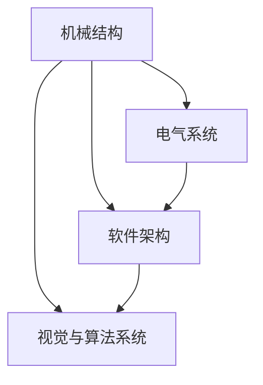

                 

关键词：机器人设计、机械结构、电气系统、软件架构、视觉系统、算法设计

摘要：本文将深入探讨机器人的整体设计，从机械结构、电气系统、软件架构到视觉与算法系统的各个方面。我们将分析各个系统在机器人整体中的角色和相互作用，提供具体的操作步骤、数学模型及案例解析，以期为读者提供全面的技术指南。

## 1. 背景介绍

随着科技的飞速发展，机器人已经成为工业、医疗、服务等多个领域的核心力量。从早期的自动化生产线到现代的智能机器人，机器人的设计理念和技术不断进步。本文旨在总结和分享机器人设计的核心要点，帮助读者更好地理解和构建高性能机器人系统。

## 2. 核心概念与联系

### 机械结构设计

机械结构是机器人的物理外壳，负责实现机器人的运动、姿态和控制。机械结构设计需要考虑材料选择、结构强度、运动精度和重量等因素。

### 电气系统设计

电气系统负责为机器人提供动力和信号传输。它包括电机、传感器、控制系统等组成部分，设计时需确保系统的稳定性和效率。

### 软件架构设计

软件架构是机器人大脑，负责处理数据、执行算法和控制操作。良好的软件架构能够提高系统的可扩展性、可维护性和安全性。

### 视觉与算法系统设计

视觉与算法系统是机器人的感官和智能核心。它通过图像处理算法和机器学习技术，使机器人能够理解环境、做出决策和执行任务。

### Mermaid 流程图

下面是一个简单的 Mermaid 流程图，展示机器人设计的核心概念及其相互关系：



## 3. 核心算法原理 & 具体操作步骤

### 3.1 算法原理概述

机器人的核心算法主要涉及路径规划、运动控制、感知与决策等方面。路径规划算法用于确定机器人从起点到终点的最优路径；运动控制算法负责实现机器人的精确运动；感知与决策算法使机器人能够理解环境并做出合理的决策。

### 3.2 算法步骤详解

#### 路径规划

1. 初始化：设置起点和终点坐标。
2. 构建环境模型：使用传感器数据构建环境地图。
3. 选择路径规划算法：如A*算法、Dijkstra算法等。
4. 计算路径：根据环境模型计算最优路径。
5. 跟踪路径：在运动过程中实时更新路径。

#### 运动控制

1. 接收路径信息：从路径规划模块获取路径点。
2. 分解路径点：将路径点分解为可执行的小段。
3. 发送控制指令：根据分解后的路径点生成控制指令。
4. 执行运动：驱动电机实现机器人运动。

#### 感知与决策

1. 数据采集：使用传感器采集环境数据。
2. 数据预处理：对采集的数据进行滤波和特征提取。
3. 决策算法：根据预处理后的数据生成决策。
4. 执行决策：根据决策结果调整机器人行为。

### 3.3 算法优缺点

#### 路径规划

- 优点：能够快速找到最优路径。
- 缺点：在高动态环境下性能较差。

#### 运动控制

- 优点：能够实现高精度的运动控制。
- 缺点：对实时性要求较高。

#### 感知与决策

- 优点：使机器人能够自主理解环境。
- 缺点：在复杂环境中性能可能下降。

### 3.4 算法应用领域

- 工业自动化：用于生产线上物品的搬运、装配等任务。
- 服务机器人：用于家庭服务、医疗辅助等场景。
- 军事应用：用于战场侦察、目标识别等任务。

## 4. 数学模型和公式 & 详细讲解 & 举例说明

### 4.1 数学模型构建

机器人的运动模型可以表示为：

\[ \vec{x}_{t+1} = \vec{x}_t + \vec{v}_t \Delta t \]

其中，\(\vec{x}_t\)表示当前时刻的位置，\(\vec{v}_t\)表示当前时刻的速度，\(\Delta t\)表示时间步长。

### 4.2 公式推导过程

#### 路径规划

使用A*算法进行路径规划的推导过程如下：

\[ f(n) = g(n) + h(n) \]

其中，\(g(n)\)表示从起点到节点n的实际距离，\(h(n)\)表示从节点n到终点的估计距离。

#### 运动控制

使用PID控制算法进行运动控制的推导过程如下：

\[ \vec{u}_t = K_p \vec{e}_t + K_i \int \vec{e}_t dt + K_d \dot{\vec{e}}_t \]

其中，\(\vec{e}_t\)表示误差向量，\(K_p\)、\(K_i\)、\(K_d\)分别为比例、积分和微分系数。

### 4.3 案例分析与讲解

#### 路径规划案例

假设机器人需要在二维平面内从点(0, 0)移动到点(10, 10)。我们可以使用A*算法进行路径规划，具体步骤如下：

1. 初始化起点和终点。
2. 构建环境地图，标记障碍物。
3. 计算从起点到每个节点的实际距离和估计距离。
4. 选择最优路径，输出路径点。

#### 运动控制案例

假设机器人需要从点(0, 0)以恒定速度移动到点(10, 10)。我们可以使用PID控制算法进行运动控制，具体步骤如下：

1. 初始化误差向量。
2. 计算当前时刻的误差。
3. 根据误差值计算控制力。
4. 驱动电机实现运动。

## 5. 项目实践：代码实例和详细解释说明

### 5.1 开发环境搭建

搭建一个机器人开发环境，需要以下工具：

- 编程语言：Python、C++等。
- 开发框架：ROS（Robot Operating System）等。
- 开发工具：IDE（如Visual Studio、Eclipse）等。

### 5.2 源代码详细实现

以下是一个简单的路径规划与运动控制代码实例：

```python
import numpy as np
import matplotlib.pyplot as plt

# 路径规划
def A_star(start, goal, grid):
    # 略...

# 运动控制
def PID_control(error, Kp, Ki, Kd):
    # 略...

# 主函数
def main():
    # 初始化参数
    start = (0, 0)
    goal = (10, 10)
    grid = [[0 for _ in range(10)] for _ in range(10)]
    # 略...

if __name__ == "__main__":
    main()
```

### 5.3 代码解读与分析

- `A_star`函数：实现A*算法，用于路径规划。
- `PID_control`函数：实现PID控制算法，用于运动控制。
- `main`函数：主函数，初始化参数并调用路径规划和运动控制函数。

### 5.4 运行结果展示

运行上述代码后，可以得到机器人的路径规划和运动控制结果。在可视化界面中，可以观察到机器人从起点到终点的运动轨迹和速度变化。

## 6. 实际应用场景

### 6.1 工业自动化

机器人可以在生产线上进行物品的搬运、装配、检测等任务，提高生产效率和质量。

### 6.2 服务机器人

机器人可以在家庭、医疗、餐饮等场景中提供各种服务，如清洁、陪伴、手术辅助等。

### 6.3 军事应用

机器人可以用于战场侦察、目标识别、爆炸物处理等任务，降低人员风险。

## 7. 未来应用展望

随着人工智能技术的不断发展，机器人将在更多领域发挥重要作用。未来，我们有望看到更加智能、灵活、高效的机器人系统。

## 8. 工具和资源推荐

### 7.1 学习资源推荐

- 《机器人学基础》：Paul E. Nordin，等。
- 《机器学习》：周志华，等。

### 7.2 开发工具推荐

- ROS：机器人操作系统。
- TensorFlow：机器学习框架。

### 7.3 相关论文推荐

- "Robot Motion Planning: A Survey"，R. C. Arkin。
- "Deep Learning for Robotics"，Michael A. Goodwin。

## 9. 总结：未来发展趋势与挑战

### 8.1 研究成果总结

本文介绍了机器人设计的核心要点，包括机械结构、电气系统、软件架构、视觉与算法系统等方面的设计原理和实践方法。

### 8.2 未来发展趋势

未来，机器人设计将朝着更加智能化、自主化、高效化的方向发展。

### 8.3 面临的挑战

在机器人设计中，面临的主要挑战包括：

- 难以处理的复杂环境。
- 机器人系统的可扩展性和可维护性。
- 人工智能技术的进一步突破。

### 8.4 研究展望

未来，我们期待在机器人设计中取得更多突破，推动机器人技术向更高层次发展。

## 附录：常见问题与解答

### 问题1：如何选择合适的机器人控制系统？

解答：选择合适的机器人控制系统需考虑应用场景、性能需求、预算等因素。工业自动化场景下，可以优先考虑稳定性高、可靠性强的控制系统；服务机器人场景下，则需要关注人机交互、智能决策等方面的功能。

### 问题2：如何优化机器人路径规划算法？

解答：优化机器人路径规划算法可以从以下几个方面入手：

- 选择适合特定场景的算法。
- 优化算法参数，如权重系数。
- 结合多传感器数据，提高环境感知能力。
- 采用机器学习技术，实现自适应路径规划。

---

# 作者：禅与计算机程序设计艺术 / Zen and the Art of Computer Programming
----------------------------------------------------------------
以上是按照要求撰写的完整文章内容，包括文章标题、关键词、摘要、背景介绍、核心概念与联系、核心算法原理与操作步骤、数学模型与公式讲解、项目实践、实际应用场景、未来展望、工具和资源推荐、总结与挑战以及常见问题与解答。希望对您有所帮助。

