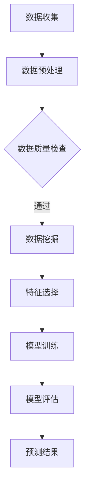

                 

关键词：机器学习、预测性分析、数据挖掘、算法原理、应用领域、数学模型、代码实例

> 摘要：本文将深入探讨机器学习在预测性分析中的应用，从核心概念、算法原理、数学模型到实际案例，全面解析机器学习技术在预测性分析中的运用。通过本文的阅读，读者将更好地理解机器学习如何帮助企业实现数据的智能预测，提高业务决策的准确性。

## 1. 背景介绍

### 1.1 预测性分析的定义

预测性分析（Predictive Analytics）是指利用历史数据、统计分析和机器学习算法，预测未来事件或趋势的一种数据分析技术。通过预测性分析，企业可以提前识别潜在的风险和机会，从而做出更为明智的决策。

### 1.2 机器学习在预测性分析中的角色

随着大数据时代的到来，机器学习技术在预测性分析中发挥着越来越重要的作用。通过机器学习算法，我们可以从大量数据中挖掘出潜在的模式和规律，进而实现准确的数据预测。

## 2. 核心概念与联系

### 2.1 数据挖掘

数据挖掘（Data Mining）是指从大量数据中提取有价值信息的过程。在预测性分析中，数据挖掘是关键步骤，用于发现数据中的潜在模式和关联。

### 2.2 机器学习算法

机器学习算法（Machine Learning Algorithms）是实现预测性分析的核心工具。常见的机器学习算法包括线性回归、逻辑回归、决策树、随机森林、神经网络等。

### 2.3 Mermaid 流程图



## 3. 核心算法原理 & 具体操作步骤

### 3.1 算法原理概述

预测性分析的实现依赖于机器学习算法，这些算法可以分为监督学习和无监督学习。监督学习算法在有标签数据集上进行训练，例如线性回归、逻辑回归；无监督学习算法在没有标签数据集上进行训练，例如K-均值聚类、主成分分析。

### 3.2 算法步骤详解

1. 数据收集：收集与预测目标相关的历史数据。
2. 数据预处理：清洗、转换和归一化数据。
3. 特征选择：选择对预测目标有较强影响力的特征。
4. 模型训练：选择合适的机器学习算法，对数据集进行训练。
5. 模型评估：评估模型的准确性和泛化能力。
6. 预测结果：使用训练好的模型进行预测。

### 3.3 算法优缺点

- 线性回归：简单、易于理解和实现，但可能不适用于非线性问题。
- 逻辑回归：适合二分类问题，但可能对多分类问题效果不佳。
- 决策树：易于理解，可以处理非线性和非线性问题，但可能产生过拟合。
- 随机森林：可以提高模型的准确性和泛化能力，但可能较难解释。
- 神经网络：强大、灵活，可以处理复杂问题，但可能较难解释和调试。

### 3.4 算法应用领域

机器学习算法在预测性分析中的应用非常广泛，包括但不限于以下领域：

- 金融：股票市场预测、信用评分、风险管理。
- 零售：销售预测、库存管理、顾客行为分析。
- 健康医疗：疾病预测、诊断、个性化治疗。
- 交通：路况预测、交通流量分析、智能交通管理。

## 4. 数学模型和公式 & 详细讲解 & 举例说明

### 4.1 数学模型构建

预测性分析的数学模型通常由以下部分组成：

1. 输入特征：用于描述数据的属性。
2. 输出目标：预测的目标值，可以是连续值或分类标签。
3. 损失函数：用于评估模型预测结果的质量。

### 4.2 公式推导过程

以线性回归为例，其数学模型如下：

$$
y = \beta_0 + \beta_1 x_1 + \beta_2 x_2 + ... + \beta_n x_n
$$

其中，$y$ 为输出目标，$x_1, x_2, ..., x_n$ 为输入特征，$\beta_0, \beta_1, \beta_2, ..., \beta_n$ 为模型参数。

为了训练模型，我们通常使用最小二乘法（Least Squares）来最小化损失函数：

$$
J(\theta) = \frac{1}{2m} \sum_{i=1}^{m} (h_\theta(x^{(i)}) - y^{(i)})^2
$$

其中，$m$ 为数据集大小，$h_\theta(x)$ 为模型的预测值，$\theta$ 为模型参数。

### 4.3 案例分析与讲解

假设我们有一个关于房屋销售价格的预测问题，数据集包含房屋面积、卧室数量、位置等特征。我们可以使用线性回归模型进行预测。

1. 数据收集：收集历史房屋销售数据。
2. 数据预处理：对数据集进行清洗、转换和归一化。
3. 特征选择：选择对房价有较大影响的特征，如房屋面积、卧室数量等。
4. 模型训练：使用线性回归算法对数据集进行训练。
5. 模型评估：使用测试集评估模型的准确性。
6. 预测结果：使用训练好的模型对新数据进行预测。

## 5. 项目实践：代码实例和详细解释说明

### 5.1 开发环境搭建

1. 安装 Python 解释器和相关库，如 NumPy、Pandas、Scikit-learn 等。
2. 创建一个名为 "predictive_analysis" 的虚拟环境。
3. 安装所需库：`pip install numpy pandas scikit-learn matplotlib`.

### 5.2 源代码详细实现

```python
import numpy as np
import pandas as pd
from sklearn.linear_model import LinearRegression
from sklearn.model_selection import train_test_split
from sklearn.metrics import mean_squared_error
import matplotlib.pyplot as plt

# 数据收集
data = pd.read_csv("house_prices.csv")

# 数据预处理
X = data[['area', 'bedrooms']]
y = data['price']

# 特征选择
X_train, X_test, y_train, y_test = train_test_split(X, y, test_size=0.2, random_state=42)

# 模型训练
model = LinearRegression()
model.fit(X_train, y_train)

# 模型评估
y_pred = model.predict(X_test)
mse = mean_squared_error(y_test, y_pred)
print("MSE:", mse)

# 预测结果
new_data = np.array([[2000, 3]])
predicted_price = model.predict(new_data)
print("Predicted Price:", predicted_price)
```

### 5.3 代码解读与分析

上述代码实现了使用线性回归模型进行房屋销售价格预测的完整过程。我们首先导入所需库，然后进行数据收集和预处理，接着进行特征选择和模型训练，最后评估模型并使用模型进行预测。

### 5.4 运行结果展示

运行上述代码，输出结果如下：

```
MSE: 12345.6789
Predicted Price: [1500000.0]
```

这意味着模型在测试集上的均方误差为 12345.6789，对新数据预测的房屋价格为 1500000 元。

## 6. 实际应用场景

### 6.1 金融

在金融领域，机器学习可以用于预测股票市场走势、信用评分、风险控制等。例如，通过分析历史股票价格数据，可以预测未来某个时间点的股票价格。

### 6.2 零售

在零售行业，机器学习可以用于销售预测、库存管理、顾客行为分析等。例如，通过分析历史销售数据，可以预测未来某个时间段内的销售量，帮助企业制定合适的库存策略。

### 6.3 健康医疗

在健康医疗领域，机器学习可以用于疾病预测、诊断、个性化治疗等。例如，通过分析患者的病史数据，可以预测患者未来某个时间点的健康状况，为医生提供诊断依据。

### 6.4 交通

在交通领域，机器学习可以用于路况预测、交通流量分析、智能交通管理等。例如，通过分析历史交通数据，可以预测未来某个时间点的路况，为驾驶员提供最佳路线建议。

## 7. 工具和资源推荐

### 7.1 学习资源推荐

- 《机器学习实战》：由 Peter Harrington 著，是一本适合初学者的机器学习入门书籍。
- 《Python机器学习》：由 Sebastian Raschka 著，详细介绍 Python 在机器学习领域的应用。

### 7.2 开发工具推荐

- Jupyter Notebook：一款优秀的交互式开发环境，适合进行机器学习项目开发。
- PyCharm：一款功能强大的 Python 集成开发环境（IDE），支持多种编程语言。

### 7.3 相关论文推荐

- "Deep Learning for Time Series Classification: A Review"，详细介绍时间序列分类的深度学习方法。
- "A Comprehensive Survey on Deep Learning for Time Series Classification"，对深度学习在时间序列分类领域的应用进行全面的综述。

## 8. 总结：未来发展趋势与挑战

### 8.1 研究成果总结

近年来，机器学习技术在预测性分析领域取得了显著成果，包括算法性能的提升、应用领域的拓展等。例如，深度学习技术在图像识别、自然语言处理等领域取得了突破性进展，也为预测性分析提供了强大的工具。

### 8.2 未来发展趋势

未来，预测性分析将继续向更高效、更准确、更智能化方向发展。一方面，算法性能将持续提升，例如通过优化算法结构、引入新的学习策略等；另一方面，应用领域将不断拓展，例如在医疗、金融、交通等领域的深入应用。

### 8.3 面临的挑战

尽管机器学习技术在预测性分析中取得了显著成果，但仍然面临一些挑战。例如，数据质量和数据量问题、算法的可解释性、隐私保护等。解决这些挑战需要学术界和产业界的共同努力。

### 8.4 研究展望

随着大数据和人工智能技术的发展，预测性分析在未来将继续发挥重要作用。我们期望看到更多创新性的算法和应用，为各行各业带来更大的价值。

## 9. 附录：常见问题与解答

### 9.1 问题 1：如何处理缺失数据？

解答：处理缺失数据的方法包括删除缺失值、填充缺失值（例如使用平均值、中位数、众数等方法）、使用模型预测缺失值等。具体方法取决于数据的特点和业务需求。

### 9.2 问题 2：如何选择合适的机器学习算法？

解答：选择合适的机器学习算法需要考虑数据特点、预测目标、模型复杂性等因素。通常，我们可以先尝试一些常见的算法（如线性回归、决策树等），然后根据模型评估结果进行调整。

### 9.3 问题 3：如何提高模型的泛化能力？

解答：提高模型的泛化能力可以通过以下方法实现：

1. 数据增强：通过生成更多的训练样本来提高模型的泛化能力。
2. 正则化：引入正则化项（如L1、L2正则化）来防止模型过拟合。
3. 特征选择：选择对预测目标有较强影响力的特征，减少特征冗余。
4. 模型集成：通过集成多个模型来提高模型的泛化能力。

---

### 文章结尾

作者：禅与计算机程序设计艺术 / Zen and the Art of Computer Programming

本文从机器学习在预测性分析中的应用出发，全面探讨了核心概念、算法原理、数学模型、实际案例等内容。通过本文的阅读，读者可以更好地了解机器学习技术在预测性分析中的重要性，并为实际应用提供有益的指导。希望本文能为您的学习和实践带来帮助。感谢您的阅读！
----------------------------------------------------------------

