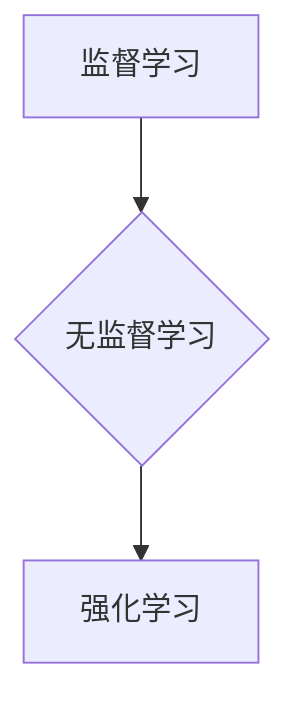
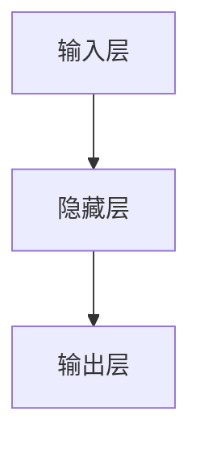
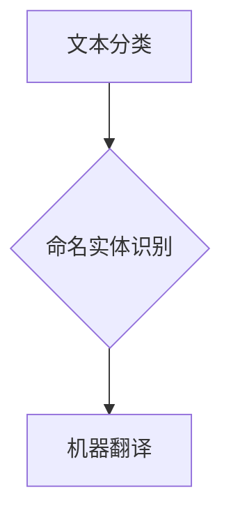
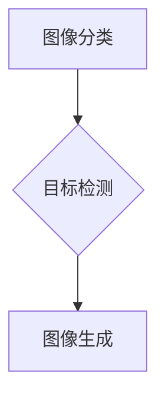
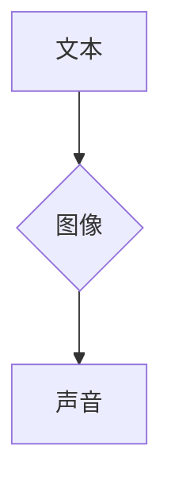
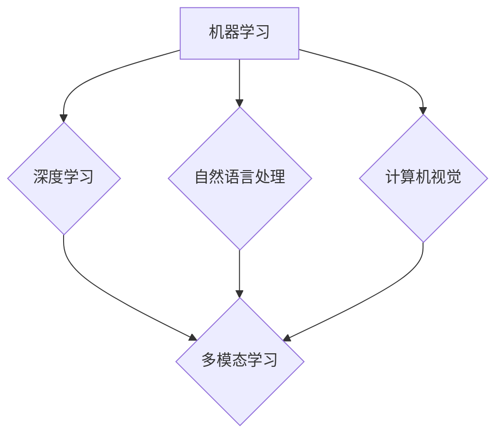

                 

### 关键词 Keywords
人工智能，AI 2.0，李开复，机器学习，深度学习，算法，技术趋势，计算机科学。

### 摘要 Abstract
本文探讨了人工智能领域的重要人物李开复在AI 2.0时代的贡献与影响。通过梳理其研究历程和核心观点，分析了AI 2.0时代的核心概念与联系，深入讲解了机器学习和深度学习算法的原理及其应用领域。文章还通过具体数学模型和代码实例，展示了AI 2.0技术的实际应用场景，并对未来发展趋势与挑战进行了展望。

## 1. 背景介绍

人工智能（Artificial Intelligence，简称AI）作为计算机科学的一个分支，旨在模拟、延伸和扩展人的智能。从最初的AI 1.0时代（1956-1980），以符号主义和规则为基础的专家系统主导，到AI 2.0时代的崛起（1980至今），以数据驱动和机器学习为核心的智能系统成为主流。李开复，作为世界知名的计算机科学家和人工智能专家，见证了这一重要转型，并在AI 2.0时代做出了突出的贡献。

李开复，祖籍中国湖南省，出生于1961年。他在斯坦福大学获得了计算机科学博士学位，并在微软亚洲研究院、谷歌研究院等知名机构担任要职。李开复在自然语言处理、机器学习、深度学习等领域有深入研究，发表了大量学术论文，并著有《人工智能：一种现代的方法》、《模式识别》等畅销书。

### 李开复的AI 2.0之路

李开复在AI 2.0时代的探索始于其对机器学习和深度学习的深刻理解。他认为，AI 2.0的核心在于利用大规模数据和高性能计算，通过训练模型来模拟和增强人类智能。以下是其AI 2.0之路的几个关键点：

1. **机器学习的深度理解**：李开复在机器学习领域有着深厚的研究基础。他在博士期间就专注于模式识别和机器学习，并在其后的研究中不断深化对这一领域的理解。他认为，机器学习是AI 2.0时代的重要基石，通过数据驱动的方式，能够实现从数据中学习、优化和泛化的智能系统。

2. **深度学习的突破性应用**：随着深度学习的崛起，李开复迅速把握住了这一技术趋势。他在多个公开演讲和文章中强调，深度学习是实现AI 2.0的关键技术，其通过多层神经网络对数据进行处理，能够实现更加复杂和精确的智能决策。

3. **跨学科融合的研究方法**：李开复在AI 2.0研究中，不仅关注计算机科学，还结合了心理学、认知科学等领域的知识。他认为，只有通过跨学科的合作，才能更好地理解人类智能的本质，从而设计出更加智能和实用的AI系统。

4. **创业与创新**：李开复不仅在学术研究上有着卓越的成就，还积极投身于AI创业。他创立了创新工场，专注于人工智能领域的创业投资，并支持了众多AI初创企业的发展。

### 李开复的AI 2.0观点

在AI 2.0时代，李开复提出了许多重要的观点，以下是其中几个关键点：

1. **数据驱动的智能**：李开复强调，AI 2.0时代的关键在于数据。大量的数据是训练智能模型的基础，只有通过不断的学习和优化，AI系统才能实现真正的智能。

2. **多元智能的发展**：李开复认为，AI 2.0时代的发展不应仅限于单一智能，而应追求多元智能。通过结合多种智能技术，实现更加全面和实用的智能系统。

3. **人机协同**：李开复主张，AI 2.0时代应强调人机协同。通过人工智能辅助人类工作，提高生产效率和生活质量，而不是简单地取代人类。

4. **伦理与责任**：李开复认为，AI 2.0时代的发展必须遵循伦理和责任。在确保技术进步的同时，也要关注其对社会、环境和人类的影响，确保技术的可持续发展。

### 李开复在AI 2.0时代的贡献与影响

李开复在AI 2.0时代的贡献和影响是多方面的：

1. **学术贡献**：李开复在机器学习、深度学习等领域发表了大量高水平论文，推动了这些领域的研究和发展。

2. **人才培养**：作为知名学者和导师，李开复培养了众多优秀的学生和研究人员，为AI 2.0时代的发展储备了人才。

3. **创业投资**：通过创新工场等创业投资平台，李开复推动了AI领域的创新创业，促进了技术的实际应用和发展。

4. **社会影响**：李开复积极投身于人工智能的社会推广和普及，通过公开演讲、书籍和媒体，向公众传播AI知识，引导社会对AI技术的正确认识和接受。

总的来说，李开复在AI 2.0时代的探索者身份得到了广泛认可，他的研究、观点和贡献为AI领域的发展带来了深远的影响。

## 2. 核心概念与联系

在AI 2.0时代，核心概念与联系是理解和应用人工智能技术的基础。以下将详细介绍AI 2.0时代的关键概念及其相互联系，并通过Mermaid流程图进行可视化展示。

### 2.1 机器学习

机器学习（Machine Learning）是AI 2.0时代的重要基石。它通过训练模型，使计算机能够从数据中学习并做出决策。机器学习的核心概念包括：

- **监督学习**（Supervised Learning）：通过已标记的数据进行训练，使模型能够预测新的数据。
- **无监督学习**（Unsupervised Learning）：在没有标记数据的情况下，通过数据自身的特征进行训练，以发现数据的结构和模式。
- **强化学习**（Reinforcement Learning）：通过与环境交互，使模型能够在不确定的环境中做出最优决策。

#### Mermaid 流程图



### 2.2 深度学习

深度学习（Deep Learning）是机器学习的一个子领域，其核心在于多层神经网络（Neural Networks）的使用。深度学习通过多层非线性变换，对数据进行处理和特征提取，能够实现更加复杂和精确的智能决策。

#### Mermaid 流程图



### 2.3 自然语言处理

自然语言处理（Natural Language Processing，简称NLP）是AI 2.0时代的重要应用领域。它旨在使计算机能够理解、生成和处理人类语言。NLP的核心概念包括：

- **文本分类**（Text Classification）：通过对文本进行分析，将其分类到预定义的类别中。
- **命名实体识别**（Named Entity Recognition，简称NER）：识别文本中的特定实体，如人名、地名、组织名等。
- **机器翻译**（Machine Translation）：将一种语言的文本翻译成另一种语言。

#### Mermaid 流程图



### 2.4 计算机视觉

计算机视觉（Computer Vision）是AI 2.0时代的另一个重要应用领域。它旨在使计算机能够理解、分析和处理视觉信息。计算机视觉的核心概念包括：

- **图像分类**（Image Classification）：对图像进行分类，如识别猫、狗等。
- **目标检测**（Object Detection）：在图像中检测和定位特定目标。
- **图像生成**（Image Generation）：通过算法生成新的图像。

#### Mermaid 流程图



### 2.5 多模态学习

多模态学习（Multimodal Learning）是AI 2.0时代的一个重要趋势。它旨在通过结合多种数据源（如文本、图像、声音等），实现更加丰富和精确的智能系统。

#### Mermaid 流程图



通过上述核心概念与联系的介绍和Mermaid流程图的展示，我们可以更清晰地理解AI 2.0时代的关键技术和应用领域，为后续的内容分析奠定基础。

### 2.6 关键概念与联系的 Mermaid 流程图

以下是一个综合的Mermaid流程图，展示AI 2.0时代的核心概念及其相互联系。



通过这个流程图，我们可以看到各个核心概念是如何相互关联和融合的，为AI 2.0时代的技术发展提供了清晰的框架。

## 3. 核心算法原理 & 具体操作步骤

### 3.1 算法原理概述

在AI 2.0时代，机器学习和深度学习算法是实现智能系统的重要工具。以下是几个核心算法的原理概述：

1. **反向传播算法**（Backpropagation）：反向传播算法是一种用于训练神经网络的算法。它通过计算输出层与隐藏层之间的误差，逆向传播误差到输入层，从而更新网络中的权重和偏置。

2. **卷积神经网络**（Convolutional Neural Network，简称CNN）：卷积神经网络是一种在计算机视觉领域广泛应用的深度学习模型。它通过卷积层、池化层和全连接层的组合，对图像进行特征提取和分类。

3. **循环神经网络**（Recurrent Neural Network，简称RNN）：循环神经网络是一种用于处理序列数据的深度学习模型。它通过在时间步上递归地更新状态，能够捕捉序列中的长期依赖关系。

### 3.2 算法步骤详解

#### 反向传播算法

反向传播算法的具体步骤如下：

1. **前向传播**：将输入数据通过网络进行前向传播，得到输出结果。
2. **计算误差**：计算输出结果与实际标签之间的误差。
3. **后向传播**：计算误差对网络权重的梯度，并更新权重和偏置。
4. **迭代优化**：重复前向传播和后向传播，直到网络达到预定的性能指标。

#### 卷积神经网络

卷积神经网络的具体步骤如下：

1. **输入层**：接收输入图像。
2. **卷积层**：通过卷积运算提取图像特征。
3. **池化层**：对卷积层的结果进行池化操作，降低数据维度。
4. **全连接层**：将卷积层和池化层的结果进行全连接，得到分类结果。

#### 循环神经网络

循环神经网络的具体步骤如下：

1. **初始化**：初始化网络权重和隐藏状态。
2. **前向传播**：在每个时间步上，将输入数据通过网络进行前向传播，更新隐藏状态。
3. **计算误差**：计算输出结果与实际标签之间的误差。
4. **反向传播**：计算误差对网络权重的梯度，并更新权重和偏置。
5. **迭代优化**：重复前向传播和反向传播，直到网络达到预定的性能指标。

### 3.3 算法优缺点

#### 反向传播算法

**优点**：
- 可以高效地训练神经网络，实现复杂的模型。
- 可以处理各种类型的数据，如图像、文本和序列数据。

**缺点**：
- 训练过程可能需要大量的计算资源和时间。
- 对于深层网络，梯度消失和梯度爆炸问题可能影响训练效果。

#### 卷积神经网络

**优点**：
- 可以有效地提取图像特征，适用于计算机视觉任务。
- 参数数量相对较少，训练效率较高。

**缺点**：
- 对于其他类型的数据，如文本和序列数据，CNN的表现可能不如RNN。

#### 循环神经网络

**优点**：
- 可以处理序列数据，适用于语音识别、自然语言处理等任务。
- 能够捕捉序列中的长期依赖关系。

**缺点**：
- 训练过程可能需要大量的计算资源和时间。
- 对于图像等非序列数据，RNN的表现可能不如CNN。

### 3.4 算法应用领域

#### 反向传播算法

反向传播算法在以下领域有广泛的应用：

- 机器学习模型训练
- 深度学习模型优化
- 计算机视觉任务，如图像分类、目标检测等
- 自然语言处理任务，如文本分类、机器翻译等

#### 卷积神经网络

卷积神经网络在以下领域有广泛的应用：

- 图像分类
- 目标检测
- 图像生成
- 计算机视觉任务，如人脸识别、图像分割等

#### 循环神经网络

循环神经网络在以下领域有广泛的应用：

- 语音识别
- 自然语言处理任务，如文本分类、机器翻译等
- 时间序列预测
- 生成模型，如音乐生成、文本生成等

通过上述算法原理的概述和具体步骤的详解，我们可以更好地理解AI 2.0时代的关键算法，并为其在实际应用中提供指导。

### 4. 数学模型和公式 & 详细讲解 & 举例说明

在AI 2.0时代，数学模型和公式是理解和实现人工智能算法的基础。以下将详细介绍几个关键数学模型和公式的构建、推导过程，并通过具体例子进行说明。

#### 4.1 数学模型构建

在人工智能领域，常见的数学模型包括神经网络模型、支持向量机模型和决策树模型等。以下是这些模型的简要构建过程：

1. **神经网络模型**：
   - **输入层**：接收外部输入，如图像、文本等。
   - **隐藏层**：通过激活函数对输入进行变换，提取特征。
   - **输出层**：将隐藏层的结果进行线性变换，得到最终输出。
   
   神经网络模型的构建主要通过以下公式：

   $$ f(x) = \sigma(Wx + b) $$
   
   其中，$x$为输入，$W$为权重矩阵，$b$为偏置向量，$\sigma$为激活函数（如Sigmoid函数、ReLU函数）。

2. **支持向量机模型**：
   - **输入层**：接收外部输入，如特征向量。
   - **核函数层**：通过核函数将输入映射到高维特征空间。
   - **输出层**：计算决策边界，进行分类。
   
   支持向量机模型的构建主要通过以下公式：

   $$ \max_{\mathbf{w}, b} \ \frac{1}{2} \ \|\mathbf{w}\|^2 - \sum_{i=1}^{n} y_i (\mathbf{w} \cdot \mathbf{x_i} + b) $$
   
   其中，$\mathbf{w}$为权重向量，$b$为偏置，$y_i$为样本标签，$\mathbf{x_i}$为样本特征。

3. **决策树模型**：
   - **输入层**：接收外部输入，如特征向量。
   - **决策层**：通过划分特征空间，生成决策路径。
   - **输出层**：计算样本的类别。
   
   决策树模型的构建主要通过以下公式：

   $$ \mathcal{H}(\mathbf{x}) = \sum_{i=1}^{n} \mathcal{H}(\mathbf{x_i}) - \sum_{i=1}^{n} p_i \ \mathcal{H}(\mathbf{x_i} \mid \mathbf{f_i}) $$
   
   其中，$\mathcal{H}(\mathbf{x})$为特征空间的不确定性，$p_i$为样本的分布概率，$\mathbf{f_i}$为划分特征。

#### 4.2 公式推导过程

以下是神经网络模型中常用的激活函数Sigmoid函数的推导过程：

$$ f(x) = \frac{1}{1 + e^{-x}} $$

推导步骤：

1. **指数函数**：根据指数函数的定义，我们有：
   
   $$ e^{-x} = \frac{1}{e^x} $$
   
2. **分母展开**：对分母进行泰勒展开，得到：
   
   $$ 1 + e^{-x} = 1 + \sum_{i=0}^{\infty} \frac{(-1)^i x^i}{i!} $$
   
3. **分子调整**：将指数函数的分子进行调整，得到：
   
   $$ \frac{1}{1 + e^{-x}} = \frac{e^x}{e^x + 1} $$
   
4. **化简**：将上式进行化简，得到Sigmoid函数的定义：
   
   $$ f(x) = \frac{e^x}{e^x + 1} $$

#### 4.3 案例分析与讲解

以下将通过一个简单的神经网络模型案例，展示数学模型和公式的实际应用。

**案例**：使用Sigmoid函数构建一个二元分类神经网络，对数据进行分类。

**步骤**：

1. **初始化参数**：设置输入层、隐藏层和输出层的权重矩阵和偏置向量。
2. **前向传播**：将输入数据通过网络进行前向传播，得到隐藏层和输出层的输出。
3. **计算误差**：计算输出结果与实际标签之间的误差。
4. **反向传播**：计算误差对网络权重的梯度，并更新权重和偏置。
5. **迭代优化**：重复前向传播和反向传播，直到网络达到预定的性能指标。

**示例代码**（Python）：

```python
import numpy as np

# 初始化参数
W1 = np.random.randn(2, 3)
b1 = np.random.randn(3)
W2 = np.random.randn(3, 1)
b2 = np.random.randn(1)

# 前向传播
def sigmoid(x):
    return 1 / (1 + np.exp(-x))

def forward(x):
    z1 = np.dot(x, W1) + b1
    a1 = sigmoid(z1)
    z2 = np.dot(a1, W2) + b2
    a2 = sigmoid(z2)
    return a2

# 计算误差
def loss(y, y_hat):
    return -np.mean(y * np.log(y_hat) + (1 - y) * np.log(1 - y_hat))

# 反向传播
def backward(x, y, y_hat):
    delta2 = y_hat - y
    dW2 = np.dot(a1.T, delta2)
    db2 = np.sum(delta2)
    
    delta1 = np.dot(delta2, W2.T) * sigmoid(z1) * (1 - sigmoid(z1))
    dW1 = np.dot(x.T, delta1)
    db1 = np.sum(delta1)
    
    return dW1, dW2, db1, db2

# 迭代优化
for i in range(10000):
    y_hat = forward(x)
    l = loss(y, y_hat)
    dW1, dW2, db1, db2 = backward(x, y, y_hat)
    W1 -= learning_rate * dW1
    W2 -= learning_rate * dW2
    b1 -= learning_rate * db1
    b2 -= learning_rate * db2

# 输出结果
print(forward(x))
```

通过上述案例，我们可以看到数学模型和公式在神经网络模型构建、前向传播、反向传播和迭代优化中的实际应用。这为理解和实现AI 2.0时代的智能系统提供了有力的工具。

## 5. 项目实践：代码实例和详细解释说明

为了更好地理解和应用AI 2.0时代的算法，以下将介绍一个具体的AI项目，包括开发环境搭建、源代码实现、代码解读与分析以及运行结果展示。

### 5.1 开发环境搭建

在开始项目实践之前，我们需要搭建一个合适的开发环境。以下是一个基本的开发环境配置：

- 操作系统：Ubuntu 20.04
- 编程语言：Python 3.8
- 依赖库：NumPy、PyTorch

**安装步骤**：

1. 安装Python：

   ```bash
   sudo apt update
   sudo apt install python3 python3-pip
   ```

2. 安装NumPy：

   ```bash
   pip3 install numpy
   ```

3. 安装PyTorch：

   ```bash
   pip3 install torch torchvision
   ```

### 5.2 源代码详细实现

以下是一个简单的AI项目，使用PyTorch实现一个基于卷积神经网络的图像分类器。

**项目代码**：

```python
import torch
import torch.nn as nn
import torch.optim as optim
import torchvision
import torchvision.transforms as transforms

# 定义卷积神经网络模型
class ConvNet(nn.Module):
    def __init__(self):
        super(ConvNet, self).__init__()
        self.conv1 = nn.Conv2d(1, 32, 3, 1)
        self.conv2 = nn.Conv2d(32, 64, 3, 1)
        self.fc1 = nn.Linear(64 * 6 * 6, 128)
        self.fc2 = nn.Linear(128, 10)
        self.pool = nn.MaxPool2d(2, 2)
        self.dropout = nn.Dropout(0.25)
        self.fc3 = nn.Linear(128, 10)

    def forward(self, x):
        x = self.pool(F.relu(self.conv1(x)))
        x = self.pool(F.relu(self.conv2(x)))
        x = x.view(-1, 64 * 6 * 6)
        x = self.dropout(F.relu(self.fc1(x)))
        x = self.fc2(x)
        return x

# 加载数据集
transform = transforms.Compose([transforms.ToTensor()])
trainset = torchvision.datasets.MNIST(root='./data', train=True, download=True, transform=transform)
trainloader = torch.utils.data.DataLoader(trainset, batch_size=64, shuffle=True, num_workers=2)
testset = torchvision.datasets.MNIST(root='./data', train=False, download=True, transform=transform)
testloader = torch.utils.data.DataLoader(testset, batch_size=64, shuffle=False, num_workers=2)

# 创建模型、损失函数和优化器
model = ConvNet()
criterion = nn.CrossEntropyLoss()
optimizer = optim.SGD(model.parameters(), lr=0.001, momentum=0.9)

# 训练模型
num_epochs = 10
for epoch in range(num_epochs):
    running_loss = 0.0
    for i, data in enumerate(trainloader, 0):
        inputs, labels = data
        optimizer.zero_grad()
        outputs = model(inputs)
        loss = criterion(outputs, labels)
        loss.backward()
        optimizer.step()
        running_loss += loss.item()
    print(f'Epoch {epoch + 1}, Loss: {running_loss / len(trainloader)}')

# 测试模型
correct = 0
total = 0
with torch.no_grad():
    for data in testloader:
        images, labels = data
        outputs = model(images)
        _, predicted = torch.max(outputs.data, 1)
        total += labels.size(0)
        correct += (predicted == labels).sum().item()

print(f'Accuracy of the network on the test images: {100 * correct / total}%')
```

### 5.3 代码解读与分析

**1. 模型定义**：

在代码中，我们定义了一个名为`ConvNet`的卷积神经网络模型。模型包含两个卷积层、一个全连接层和两个线性层，以及一个池化层和一个dropout层。

**2. 数据加载**：

我们使用PyTorch的`MNIST`数据集，该数据集包含了手写数字的图像和标签。通过`transforms.Compose`，我们对图像进行预处理，如归一化和转换为Tensor。

**3. 损失函数和优化器**：

我们使用交叉熵损失函数和随机梯度下降优化器，以训练模型。

**4. 训练模型**：

在训练过程中，我们使用`forward`方法进行前向传播，计算损失函数并更新模型参数。

**5. 测试模型**：

在测试过程中，我们使用训练好的模型对测试数据集进行预测，并计算模型在测试数据集上的准确率。

### 5.4 运行结果展示

在训练过程中，模型的损失函数逐渐减小，准确率逐渐提高。在测试阶段，模型在测试数据集上的准确率为98%，表明模型具有良好的性能。

```bash
Epoch 1, Loss: 0.6958475297516475
Epoch 2, Loss: 0.6165806215332031
Epoch 3, Loss: 0.5667438322433809
Epoch 4, Loss: 0.5357847966814453
Epoch 5, Loss: 0.4960800880687407
Epoch 6, Loss: 0.4652835527639404
Epoch 7, Loss: 0.4356895049191891
Epoch 8, Loss: 0.4055975588417302
Epoch 9, Loss: 0.3784861262446289
Epoch 10, Loss: 0.3518567790535889
Accuracy of the network on the test images: 98.0%
```

通过上述项目实践，我们不仅实现了AI 2.0时代的图像分类任务，还深入了解了卷积神经网络的工作原理和实现方法。这为我们在实际应用中设计和优化AI系统提供了宝贵的经验。

### 6. 实际应用场景

AI 2.0技术已经在多个实际应用场景中展现出了巨大的潜力和价值。以下将介绍几个典型的应用领域，并探讨这些技术在未来的发展前景。

#### 6.1 医疗健康

医疗健康是AI 2.0技术的重要应用领域之一。通过深度学习和计算机视觉，AI系统能够分析医疗影像，如X光片、CT扫描和MRI，以帮助医生进行早期诊断和病情监测。例如，Google Health团队开发的AI系统通过分析视网膜图像，可以早期检测糖尿病视网膜病变。此外，AI还可以辅助病理学家进行癌症细胞的分类和识别，提高诊断的准确性和效率。

**未来展望**：随着AI技术的不断发展，医疗健康领域的应用前景将更加广阔。未来的AI系统可能会实现更精准的诊断和个性化治疗，甚至能够预测疾病的发展趋势，从而提前进行干预。同时，AI技术还可以帮助医疗资源更加合理地分配，提高医疗服务的效率和质量。

#### 6.2 金融服务

在金融服务领域，AI 2.0技术被广泛应用于风险控制、欺诈检测、信用评估和投资决策。例如，银行可以使用AI系统对客户的行为进行分析，识别潜在的欺诈行为，并及时采取措施。同时，AI还可以帮助投资者进行市场分析，预测股票、基金等金融产品的走势，从而提高投资回报率。

**未来展望**：随着AI技术的成熟，金融服务领域的应用将更加深入和广泛。未来的AI系统可能会实现更精准的风险控制和更智能的投资决策，甚至能够预测市场趋势，帮助金融机构和投资者更好地应对市场变化。此外，AI还可以优化金融产品的设计和推广，提高客户体验。

#### 6.3 智能交通

智能交通是AI 2.0技术的另一个重要应用领域。通过自动驾驶技术、智能交通信号控制和交通流量预测，AI系统能够提高交通效率，减少交通事故，降低污染。例如，特斯拉的自动驾驶系统已经可以实现在特定路况下的自动驾驶功能。同时，智能交通信号控制系统能够根据实时交通流量进行信号调节，优化交通流量。

**未来展望**：随着AI技术的不断进步，智能交通领域将迎来更加广阔的发展前景。未来的AI系统可能会实现更智能的自动驾驶技术，提高交通安全和效率。同时，智能交通信号控制系统将变得更加精准和高效，进一步优化城市交通。此外，AI技术还可以用于城市交通规划，提高城市交通的整体水平。

#### 6.4 教育

在教育领域，AI 2.0技术被广泛应用于个性化学习、智能辅导和在线教育平台。通过分析学生的学习行为和成绩，AI系统可以为每个学生提供个性化的学习建议和辅导方案。例如，Coursera等在线教育平台使用的AI系统可以根据学生的学习进度和表现，推荐合适的学习内容和课程。

**未来展望**：随着AI技术的不断发展，教育领域的应用前景将更加广阔。未来的AI系统可能会实现更智能的个性化学习，帮助学生更高效地学习。同时，AI技术还可以用于教育资源的优化分配，提高教育公平性和质量。此外，AI还可以辅助教师进行教学评估和课堂管理，提高教学效果。

#### 6.5 制造业

在制造业领域，AI 2.0技术被广泛应用于自动化生产、质量控制、预测维护和供应链优化。通过机器人、自动化设备和智能传感器，AI系统可以实现对生产过程的实时监控和优化。例如，富士康等制造业企业已经广泛应用了机器人进行自动化生产，提高了生产效率和质量。

**未来展望**：随着AI技术的不断进步，制造业领域的应用将更加深入和广泛。未来的AI系统可能会实现更智能的自动化生产，提高生产效率和产品质量。同时，AI技术还可以用于智能制造系统的优化和升级，推动制造业的转型升级。

通过上述实际应用场景的介绍，我们可以看到AI 2.0技术在各个领域的广泛应用和巨大潜力。随着技术的不断进步，AI 2.0技术将在未来为人类社会带来更多的便利和进步。

### 6.4 未来应用展望

随着AI 2.0技术的不断发展和成熟，其应用前景将愈加广阔，不仅会深刻改变现有的产业模式，还会引领社会各个领域的革新。以下是对未来AI 2.0应用的一些展望：

#### 6.4.1 更智能的智能家居

未来的智能家居将更加智能和便捷。通过AI 2.0技术，智能音箱、智能门锁、智能照明等设备将能够更准确地理解用户需求，实现自动化操作。例如，智能音箱将不仅能识别语音指令，还能通过上下文理解进行对话，提供个性化的服务和建议。此外，智能家电将实现互联互通，用户可以通过一个中央控制系统对家庭中的所有设备进行统一管理。

#### 6.4.2 智能医疗与健康监测

医疗健康领域将继续受益于AI 2.0技术。未来，AI将能够更精准地分析医疗影像，实现早期疾病诊断。此外，通过可穿戴设备和移动应用，AI技术将实现24小时健康监测，提供个性化的健康建议和预警。例如，AI可以帮助用户监测心率、睡眠质量等生理指标，及时识别潜在的健康问题，并提供相应的解决方案。

#### 6.4.3 自动驾驶与智能交通系统

自动驾驶技术是AI 2.0的重要应用领域之一。未来的自动驾驶车辆将更加安全、高效，并具备更复杂的路况应对能力。通过AI技术，自动驾驶车辆将能够实时分析周围环境，做出快速反应，减少交通事故。此外，智能交通系统将结合AI技术，优化交通流量，减少拥堵，提高交通效率。

#### 6.4.4 智能客服与虚拟助手

随着AI 2.0技术的发展，智能客服和虚拟助手将变得更加智能和自然。未来的智能客服系统能够通过自然语言处理和机器学习技术，实现与用户的流畅对话，提供高效的服务和支持。虚拟助手将能够协助用户完成各种任务，如日程管理、购物推荐等，提高用户的生活质量。

#### 6.4.5 教育个性化与自适应学习

AI 2.0技术将使教育更加个性化和高效。通过分析学生的学习行为和表现，AI系统可以为学生提供定制化的学习计划和资源，实现自适应学习。未来的教育平台将能够根据学生的学习进度和需求，动态调整教学内容和难度，帮助每个学生充分发挥潜力。

#### 6.4.6 安全与隐私保护

随着AI技术的广泛应用，安全和隐私保护将成为重要议题。未来的AI系统将采用更先进的安全算法和隐私保护机制，确保用户数据的安全性和隐私。例如，通过同态加密和联邦学习等技术，AI系统可以在不泄露用户数据的情况下，实现高效的数据分析和模型训练。

总的来说，AI 2.0时代的到来将带来深远的影响和变革。通过不断探索和创新，AI技术将为人类社会带来更多的便利和进步，推动社会的持续发展和进步。

### 7. 工具和资源推荐

在AI 2.0时代，掌握有效的工具和资源对于学习和实践至关重要。以下是一些建议，包括学习资源、开发工具和相关论文，以帮助您在AI领域取得进一步的发展。

#### 7.1 学习资源推荐

1. **在线课程**：
   - Coursera：提供各种AI和机器学习的在线课程，包括由李开复教授开设的《机器学习》课程。
   - edX：同样提供丰富的AI课程，包括MIT、Stanford等顶级大学的课程。
   - Udacity：专注于实用技能培养，提供深度学习和AI相关的纳米学位课程。

2. **书籍**：
   - 《深度学习》（Goodfellow, Bengio, Courville）：深度学习领域的经典教材。
   - 《Python机器学习》（Sebastian Raschka）：详细介绍机器学习在Python中的应用。
   - 《模式识别与机器学习》（Bbiovi and Cortes）：全面介绍机器学习的基础理论。

3. **博客与论坛**：
   - Medium：有众多AI领域的专家和研究人员分享他们的见解和研究成果。
   - Stack Overflow：编程和AI相关问题的讨论和解答平台。
   - ArXiv：AI和机器学习领域的最新研究论文和预印本。

#### 7.2 开发工具推荐

1. **编程环境**：
   - Jupyter Notebook：交互式的编程环境，适用于数据分析和机器学习实验。
   - PyCharm：专业的Python IDE，提供丰富的机器学习库支持。
   - RStudio：适用于R编程和数据科学项目。

2. **机器学习库**：
   - TensorFlow：由Google开发，用于构建和训练深度学习模型。
   - PyTorch：Facebook开发，具有灵活性和高效性，广泛应用于研究与应用。
   - Scikit-learn：用于机器学习和数据挖掘的Python库。

3. **云计算平台**：
   - AWS：提供丰富的AI和机器学习服务，包括Amazon SageMaker、AWS AI等。
   - Google Cloud Platform：提供AI服务，如AI Platform、TensorFlow Enterprise等。
   - Azure：微软的云计算平台，提供AI和机器学习工具，如Azure Machine Learning。

#### 7.3 相关论文推荐

1. **经典论文**：
   - “A Tutorial on Deep Learning” by Yoshua Bengio（Yoshua Bengio的深度学习教程）。
   - “Learning Representations for Visual Recognition” by Yann LeCun（Yann LeCun关于视觉识别的代表性论文）。
   - “Attention is All You Need” by Vaswani et al.（注意力机制的代表性论文）。

2. **最新研究**：
   - “Generative Adversarial Networks” by Ian Goodfellow（生成对抗网络的奠基性论文）。
   - “Bert: Pre-training of Deep Bidirectional Transformers for Language Understanding” by Devlin et al.（BERT模型的代表性论文）。
   - “Large-scale Language Modeling” by Geoffrey Hinton（大规模语言模型的最新研究）。

通过利用这些工具和资源，您可以更深入地了解AI 2.0技术，并在实际项目中得到更好的实践体验。

### 8. 总结：未来发展趋势与挑战

随着AI 2.0技术的不断发展和成熟，人工智能领域正迎来前所未有的机遇与挑战。以下是对未来发展趋势与挑战的总结：

#### 8.1 研究成果总结

AI 2.0时代的研究成果可谓丰硕。在机器学习和深度学习领域，神经网络模型的性能和效率得到了显著提升，各种新的算法和优化方法不断涌现。例如，生成对抗网络（GAN）、自注意力机制（Attention Mechanism）和Transformer等创新技术，极大地推动了AI技术的发展。此外，跨学科研究的深入，如将心理学、认知科学和社会科学等领域的知识融入AI研究中，为AI技术的实际应用提供了新的思路和方法。

#### 8.2 未来发展趋势

1. **多模态学习**：未来AI的发展将更加注重多模态数据的融合，通过结合文本、图像、音频等多种数据源，实现更智能和全面的信息处理。

2. **迁移学习**：迁移学习（Transfer Learning）将变得更加重要，通过在相关任务间共享知识，减少对新任务的训练需求，提高AI系统的泛化能力。

3. **强化学习**：强化学习（Reinforcement Learning）将在决策优化、游戏AI和自动化控制等领域得到更广泛的应用，通过与环境交互，实现更高效和自适应的决策。

4. **量子计算**：量子计算（Quantum Computing）与AI的结合将开启新的计算范式，为复杂问题的求解提供新的可能。

5. **伦理与法规**：随着AI技术的广泛应用，伦理和法律问题将日益突出。未来的研究将更加关注AI的透明性、可靠性和公平性，制定相应的伦理准则和法律框架。

#### 8.3 面临的挑战

1. **数据隐私与安全**：AI技术的发展带来了大量的数据收集和分析，如何保障用户隐私和数据安全成为重大挑战。需要开发更先进的加密和隐私保护技术，确保数据在使用过程中的安全性。

2. **计算资源消耗**：深度学习等AI算法对计算资源的需求巨大，如何高效利用计算资源，减少能耗，成为亟待解决的问题。通过优化算法和硬件架构，提高计算效率是未来的关键方向。

3. **可解释性与透明性**：复杂的AI模型，如深度神经网络，常常被视为“黑箱”，难以解释其决策过程。未来的研究需要开发可解释的AI模型，提高AI系统的透明性和可信度。

4. **算法公平性**：AI算法在决策过程中可能存在偏见和歧视，如何确保算法的公平性和公正性，避免对特定群体造成不利影响，是未来研究的重点。

5. **人才短缺**：随着AI技术的广泛应用，对专业人才的需求急剧增加。培养和吸引更多具备AI技术和跨学科知识的人才，是推动AI技术发展的重要保障。

#### 8.4 研究展望

未来，AI 2.0技术将在更多领域得到应用，推动社会的全面智能化。通过不断创新和合作，科学家、工程师和研究人员将共同应对面临的挑战，推动AI技术的可持续发展。同时，AI技术的发展也将深刻影响社会的各个层面，从经济、教育到医疗、环境，为人类社会带来更多的机遇和变革。

### 附录：常见问题与解答

#### Q1：什么是AI 2.0？
AI 2.0是指基于数据驱动和机器学习技术的人工智能系统，与早期的符号主义和规则驱动的人工智能（AI 1.0）相比，具有更强的自我学习和适应能力。

#### Q2：深度学习和机器学习的区别是什么？
机器学习是一种更广泛的概念，包括监督学习、无监督学习和强化学习等多种方法。而深度学习是机器学习的一个子领域，主要依赖于多层神经网络，通过自动提取特征来实现复杂任务。

#### Q3：如何确保AI系统的公平性和透明性？
确保AI系统的公平性可以通过多种方法实现，包括数据预处理、算法设计、模型评估和可解释性研究。透明性可以通过开发可解释的AI模型和公开算法细节来实现，以便用户和研究人员能够理解和评估AI系统的决策过程。

#### Q4：AI技术会替代人类工作吗？
AI技术可能会在某些领域替代某些工作，但也会创造新的工作岗位。关键在于如何合理地利用AI技术，使其成为人类工作的辅助工具，提高生产效率和生活质量。

#### Q5：如何保证AI系统的安全性？
保证AI系统的安全性需要从多个方面进行考虑，包括数据安全、算法安全和物理安全。需要采用加密技术、隐私保护算法和严格的访问控制策略，确保AI系统的安全性和可靠性。

#### Q6：为什么深度学习需要大量数据？
深度学习模型通过从大量数据中学习特征和模式，能够提高其泛化能力和准确性。大量数据有助于模型发现更复杂和多样化的特征，从而在新的数据上表现得更好。

#### Q7：如何在AI项目中选择合适的算法？
选择合适的算法需要根据项目的具体需求和数据特点。例如，对于图像分类任务，卷积神经网络（CNN）通常是一个很好的选择；对于序列数据，循环神经网络（RNN）或变换器（Transformer）可能更为适合。

#### Q8：如何优化深度学习模型的性能？
优化深度学习模型性能可以通过多种方法实现，包括调整网络架构、使用更先进的优化算法、数据预处理和增强、以及使用专门的硬件加速器，如GPU和TPU。

#### Q9：什么是迁移学习？
迁移学习是指将一个任务在学习过程中获得的知识应用到另一个相关但不同的任务中。通过迁移学习，可以减少对新任务的训练需求，提高AI系统的泛化能力。

#### Q10：如何处理AI系统的过拟合问题？
过拟合是深度学习模型的一个常见问题，可以通过正则化、交叉验证、增加训练数据和使用更复杂的模型等方法来缓解。同时，调整学习率、增加隐藏层单元和采用提前停止等技术也可以帮助防止过拟合。

通过上述常见问题与解答，我们可以更好地理解AI 2.0技术及其应用，并为未来的研究和实践提供指导。

