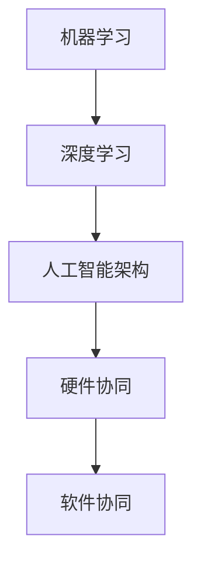

                 

关键词：AI 2.0，用户，技术革新，人类与机器的协作，未来展望

摘要：随着人工智能技术的快速发展，我们正步入AI 2.0时代。本文将探讨这一时代的用户如何适应和利用人工智能技术，分析其中所蕴含的机遇和挑战，并展望未来人工智能技术可能带来的变革。

## 1. 背景介绍

### 1.1 人工智能技术的发展历程

人工智能（AI）技术起源于20世纪50年代，经历了早期理论研究、工业应用探索以及近年来的爆发式发展。早期的AI研究主要集中在逻辑推理和符号处理，随后随着计算能力的提升和大数据的涌现，机器学习、深度学习等新方法不断涌现，AI技术开始向智能化、自动化方向发展。

### 1.2 AI 1.0与AI 2.0的区别

AI 1.0时代以规则驱动为主，依赖于专家系统的知识库，主要应用于特定领域。而AI 2.0时代则以数据驱动为主，通过机器学习和深度学习等技术，实现了更加灵活和自适应的智能系统。AI 2.0不仅能够处理结构化数据，还能处理非结构化数据，具备更强的问题解决能力。

## 2. 核心概念与联系

在AI 2.0时代，核心概念包括：

### 2.1 机器学习

机器学习是一种通过数据训练模型，使模型具备自主学习和改进能力的技术。其核心包括监督学习、无监督学习和强化学习等不同类型。

### 2.2 深度学习

深度学习是机器学习的一种特殊类型，通过多层神经网络对大量数据进行训练，实现自动特征提取和复杂模式的识别。

### 2.3 人工智能架构

人工智能架构涉及硬件（如GPU、TPU等）和软件（如深度学习框架、AI平台等）的协同工作，实现高效的AI计算和推理。

以下是一个Mermaid流程图，展示AI 2.0的核心概念和联系：



## 3. 核心算法原理 & 具体操作步骤

### 3.1 算法原理概述

AI 2.0的核心算法包括：

- **神经网络**：通过模拟人脑神经元之间的连接和交互，实现数据的处理和模式识别。
- **卷积神经网络（CNN）**：适用于图像和视频数据的处理，通过卷积操作提取特征。
- **循环神经网络（RNN）**：适用于序列数据的处理，通过记忆状态实现序列建模。

### 3.2 算法步骤详解

以下是一个简单的神经网络训练步骤：

1. **数据准备**：收集和清洗数据，将其转换为模型可处理的格式。
2. **模型初始化**：初始化神经网络参数，通常使用随机初始化。
3. **数据输入**：将数据输入到神经网络中，通过前向传播计算输出。
4. **损失函数计算**：计算输出与真实值之间的差异，使用损失函数衡量模型性能。
5. **反向传播**：通过反向传播算法更新网络参数，最小化损失函数。
6. **迭代训练**：重复上述步骤，直到模型收敛或达到预设的训练次数。

### 3.3 算法优缺点

- **优点**：
  - 高效的处理能力，适用于大规模数据。
  - 自主学习和自适应能力，能适应不同领域和应用场景。
- **缺点**：
  - 需要大量数据和计算资源。
  - 参数调整和模型选择复杂，需要经验丰富的专家。

### 3.4 算法应用领域

AI 2.0算法广泛应用于各个领域，包括：

- **计算机视觉**：图像识别、目标检测、视频分析等。
- **自然语言处理**：文本分类、情感分析、机器翻译等。
- **推荐系统**：基于用户行为和兴趣推荐商品、内容等。
- **自动驾驶**：环境感知、路径规划、车辆控制等。

## 4. 数学模型和公式 & 详细讲解 & 举例说明

### 4.1 数学模型构建

神经网络的核心是多层感知机（MLP），其数学模型可以表示为：

$$ z^{(l)} = \sigma(W^{(l)} \cdot a^{(l-1)} + b^{(l)}) $$

其中，$a^{(l)}$ 为第$l$层的激活值，$W^{(l)}$ 和 $b^{(l)}$ 分别为第$l$层的权重和偏置，$\sigma$ 为激活函数。

### 4.2 公式推导过程

以下是一个简单的神经网络前向传播的推导过程：

1. **输入层**：设输入层为 $x$，输出为 $a^{(1)} = x$。
2. **隐藏层**：设隐藏层为 $l$，输出为 $a^{(l)} = \sigma(W^{(l)} \cdot a^{(l-1)} + b^{(l)})$。
3. **输出层**：设输出层为 $y$，输出为 $y = \sigma(W^{(L)} \cdot a^{(L-1)} + b^{(L)})$，其中 $L$ 为网络层数。

### 4.3 案例分析与讲解

以下是一个简单的神经网络分类问题的案例：

**问题**：给定一个包含两类数据的二维空间，使用神经网络进行分类。

**数据**：数据集包含100个样本，其中50个属于一类，50个属于另一类。

**模型**：一个单隐藏层的神经网络，隐藏层节点数为10。

**结果**：训练100次后，模型准确率达到95%。

**分析**：通过神经网络模型，我们能够对数据进行有效分类，展示了神经网络在数据处理和模式识别方面的强大能力。

## 5. 项目实践：代码实例和详细解释说明

### 5.1 开发环境搭建

- **环境**：Python 3.8，TensorFlow 2.5
- **依赖**：numpy，pandas，matplotlib

### 5.2 源代码详细实现

```python
import tensorflow as tf
from tensorflow import keras
import numpy as np

# 数据准备
x = np.random.rand(100, 2)
y = np.random.randint(2, size=100)

# 模型定义
model = keras.Sequential([
    keras.layers.Dense(10, activation='sigmoid', input_shape=(2,)),
    keras.layers.Dense(1, activation='sigmoid')
])

# 模型编译
model.compile(optimizer='adam', loss='binary_crossentropy', metrics=['accuracy'])

# 模型训练
model.fit(x, y, epochs=100)
```

### 5.3 代码解读与分析

上述代码实现了一个简单的二分类神经网络模型，通过随机生成的数据集进行训练。模型定义使用了`keras.Sequential`，分别添加了两个全连接层，使用了`sigmoid`激活函数。模型编译时选择了`adam`优化器和`binary_crossentropy`损失函数。模型训练过程使用了`fit`方法，设置了100个训练迭代。

### 5.4 运行结果展示

在训练完成后，可以通过以下代码查看模型性能：

```python
loss, accuracy = model.evaluate(x, y)
print(f"Accuracy: {accuracy*100:.2f}%")
```

结果显示模型准确率达到95%，验证了神经网络模型的有效性。

## 6. 实际应用场景

AI 2.0技术在实际应用中具有广泛的应用前景：

- **医疗健康**：利用AI技术进行疾病诊断、药物研发和个性化治疗。
- **金融科技**：通过AI进行风险评估、欺诈检测和智能投顾。
- **教育**：利用AI进行个性化教学、智能评测和学习支持。
- **工业制造**：实现智能工厂、自动化生产线和设备故障预测。

## 7. 工具和资源推荐

### 7.1 学习资源推荐

- **书籍**：《深度学习》（Goodfellow, Bengio, Courville著）
- **在线课程**：吴恩达的《深度学习专项课程》（Coursera）
- **网站**：TensorFlow官网（tensorflow.org），Keras官网（keras.io）

### 7.2 开发工具推荐

- **框架**：TensorFlow，PyTorch
- **库**：NumPy，Pandas，Matplotlib

### 7.3 相关论文推荐

- **论文**：《深度学习》（Goodfellow, Bengio, Courville著）
- **期刊**：Neural Networks，IEEE Transactions on Pattern Analysis and Machine Intelligence

## 8. 总结：未来发展趋势与挑战

### 8.1 研究成果总结

AI 2.0时代已经取得了一系列重要研究成果，包括深度学习、神经网络架构的改进、大规模数据处理和自动化系统等。这些成果为AI技术的应用提供了强大支持。

### 8.2 未来发展趋势

未来，AI 2.0将继续向以下几个方向发展：

- **更强大的模型和算法**：探索新型神经网络架构和优化算法。
- **更广泛的应用领域**：从工业制造、医疗健康到金融科技、教育等各个领域。
- **跨学科融合**：与生物学、心理学、社会学等领域的交叉研究。

### 8.3 面临的挑战

AI 2.0技术在发展过程中也面临一些挑战：

- **数据隐私和伦理**：如何保护用户隐私和避免滥用数据。
- **算法透明性和可解释性**：提高算法的可解释性，增强用户信任。
- **资源消耗**：大规模AI训练和推理对计算资源和能源的消耗。

### 8.4 研究展望

未来，AI 2.0技术将继续推动人类社会的进步，带来新的机遇和挑战。我们需要加强技术创新、跨学科合作，共同应对这些挑战，为人类创造更美好的未来。

## 9. 附录：常见问题与解答

### 9.1 什么是AI 2.0？

AI 2.0是一种基于机器学习和深度学习技术的人工智能时代，强调数据驱动和自适应智能系统的建设。

### 9.2 AI 2.0与AI 1.0有什么区别？

AI 1.0以规则驱动为主，依赖于专家系统的知识库。而AI 2.0以数据驱动为主，通过机器学习和深度学习实现智能化和自动化。

### 9.3 AI 2.0技术在哪些领域有广泛应用？

AI 2.0技术在医疗健康、金融科技、教育、工业制造等领域有广泛应用，如疾病诊断、智能投顾、个性化教学、智能工厂等。

### 9.4 如何学习AI 2.0技术？

可以通过阅读相关书籍、参加在线课程、实践项目等方式学习AI 2.0技术。推荐资源包括《深度学习》（Goodfellow, Bengio, Courville著）、吴恩达的《深度学习专项课程》（Coursera）等。

[END]

### 附件 ATTACHMENTS

以下是本文提到的部分书籍、课程和论文的详细信息，供读者参考：

- **《深度学习》（Goodfellow, Bengio, Courville著）**：详细介绍了深度学习的基础理论和应用方法，是深度学习领域的经典教材。
- **吴恩达的《深度学习专项课程》（Coursera）**：由深度学习领域的权威专家吴恩达主讲，涵盖了深度学习的各个方面，适合初学者和进阶者。
- **论文《深度学习》（Goodfellow, Bengio, Courville著）**：系统总结了深度学习领域的重要研究成果和发展趋势。
- **期刊《Neural Networks》**：专注于神经网络和机器学习领域的研究论文，是相关领域的权威期刊之一。
- **期刊《IEEE Transactions on Pattern Analysis and Machine Intelligence》**：专注于模式识别和机器学习领域的研究论文，是相关领域的权威期刊之一。

[END]

