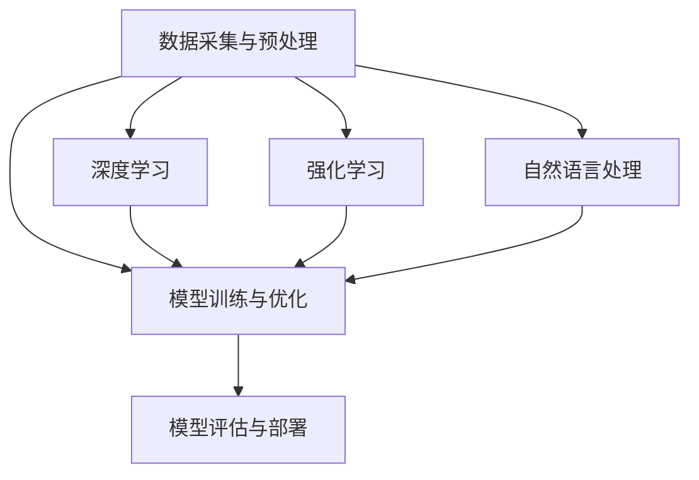

                 

关键词：李开复、AI 2.0、社会价值、技术进步、未来展望

> 摘要：本文基于李开复关于AI 2.0时代的社会价值的观点，探讨了人工智能技术的最新进展及其对社会的深远影响。文章结构包括背景介绍、核心概念与联系、核心算法原理、数学模型与公式、项目实践、实际应用场景、未来应用展望、工具和资源推荐以及总结与展望。

## 1. 背景介绍

近年来，人工智能（AI）技术的发展迅猛，已经逐渐从理论走向实践，并深刻改变了我们的生活方式。李开复博士，作为人工智能领域的权威专家，在其新作《AI 2.0》中提出了AI 2.0时代的概念。AI 2.0不仅是指技术的进步，更是指人工智能开始对社会各个层面产生深远影响的阶段。在这个背景下，本文旨在探讨AI 2.0时代的社会价值，分析人工智能技术对社会经济、教育、医疗等领域的贡献与挑战。

## 2. 核心概念与联系

### 2.1 人工智能的定义与发展历程

人工智能是指模拟、延伸和扩展人类智能的理论、方法、技术及应用。其发展可以分为以下几个阶段：

1. **AI 1.0**：以规则为基础的专家系统，主要应用于特定领域。
2. **AI 2.0**：以深度学习为核心，具备自主学习和适应能力。
3. **AI 3.0**：将人工智能与人类的思维和情感相结合，实现真正的智能。

### 2.2 人工智能的核心技术与架构

人工智能的核心技术包括：

1. **深度学习**：基于多层神经网络，通过大量数据训练模型，实现图像识别、语音识别等功能。
2. **强化学习**：通过不断试错和反馈，使智能体在特定环境中获得最佳策略。
3. **自然语言处理**：使计算机能够理解和生成人类语言，应用于聊天机器人、机器翻译等。

这些技术通过以下架构实现：

- **数据采集与预处理**：获取大量高质量数据，并进行清洗、归一化等处理。
- **模型训练与优化**：使用算法对数据进行训练，优化模型参数。
- **模型评估与部署**：评估模型性能，将其部署到实际应用中。

以下是人工智能核心技术的 Mermaid 流程图：



## 3. 核心算法原理 & 具体操作步骤

### 3.1 算法原理概述

在AI 2.0时代，深度学习是最为核心的技术之一。深度学习基于多层神经网络，通过前向传播和反向传播算法，逐层提取数据特征，最终实现目标预测。

### 3.2 算法步骤详解

1. **数据准备**：收集并预处理大量数据，包括数据清洗、归一化等。
2. **模型构建**：设计神经网络结构，包括输入层、隐藏层和输出层。
3. **训练过程**：通过前向传播计算输出，计算损失函数，通过反向传播更新模型参数。
4. **模型评估**：使用验证集或测试集评估模型性能，调整模型参数。
5. **模型部署**：将训练好的模型部署到实际应用场景中。

### 3.3 算法优缺点

**优点**：

- **强大的特征提取能力**：深度学习能够自动提取数据中的特征，减少人工干预。
- **适用范围广泛**：深度学习在图像识别、语音识别、自然语言处理等领域表现出色。
- **自适应性强**：通过不断学习和优化，模型能够适应不同的应用场景。

**缺点**：

- **对数据需求大**：深度学习需要大量高质量数据才能训练出良好的模型。
- **计算资源消耗大**：深度学习模型训练需要大量计算资源，对硬件要求较高。
- **解释性较差**：深度学习模型通常具有“黑盒”性质，难以解释其内部工作原理。

### 3.4 算法应用领域

深度学习在以下领域有广泛应用：

- **图像识别**：如人脸识别、图像分类等。
- **语音识别**：如语音助手、自动字幕等。
- **自然语言处理**：如机器翻译、情感分析等。

## 4. 数学模型和公式 & 详细讲解 & 举例说明

### 4.1 数学模型构建

在深度学习中，常用的数学模型包括：

1. **神经网络**：由多个神经元组成，通过前向传播和反向传播进行学习。
2. **损失函数**：用于评估模型预测结果与实际结果之间的差距。
3. **优化算法**：用于调整模型参数，使损失函数最小化。

以下是神经网络模型的构建过程：

$$
y_{\text{pred}} = \sigma(\mathbf{W} \cdot \mathbf{a}_{\text{l-1}} + b_{\text{l}})
$$

其中，$\sigma$为激活函数，$\mathbf{W}$为权重矩阵，$\mathbf{a}_{\text{l-1}}$为上一层的输出，$b_{\text{l}}$为偏置项。

### 4.2 公式推导过程

以下是一个简单的神经网络模型，包括一个输入层、一个隐藏层和一个输出层。

1. **前向传播**：

$$
\mathbf{z}_{\text{l}} = \mathbf{W}_{\text{l}} \cdot \mathbf{a}_{\text{l-1}} + b_{\text{l}}
$$

$$
\mathbf{a}_{\text{l}} = \sigma(\mathbf{z}_{\text{l}})
$$

2. **反向传播**：

计算损失函数：

$$
\mathcal{L} = \frac{1}{2} \sum_{i=1}^{N} (\mathbf{y}_i - \mathbf{y}_{\text{pred}})^2
$$

计算梯度：

$$
\frac{\partial \mathcal{L}}{\partial \mathbf{W}_{\text{l}}} = -(\mathbf{y}_i - \mathbf{y}_{\text{pred}}) \cdot \mathbf{a}_{\text{l}}^{\text{T}}
$$

$$
\frac{\partial \mathcal{L}}{\partial b_{\text{l}}} = -(\mathbf{y}_i - \mathbf{y}_{\text{pred}})
$$

更新权重和偏置项：

$$
\mathbf{W}_{\text{l}} = \mathbf{W}_{\text{l}} - \alpha \cdot \frac{\partial \mathcal{L}}{\partial \mathbf{W}_{\text{l}}}
$$

$$
b_{\text{l}} = b_{\text{l}} - \alpha \cdot \frac{\partial \mathcal{L}}{\partial b_{\text{l}}}
$$

### 4.3 案例分析与讲解

以下是一个简单的图像分类案例：

输入数据为28x28像素的灰度图像，输出为10个类别的概率分布。

1. **模型构建**：

   - 输入层：28x28个神经元
   - 隐藏层：500个神经元
   - 输出层：10个神经元

2. **模型训练**：

   - 使用CIFAR-10数据集进行训练，共10万个样本
   - 损失函数：交叉熵损失函数
   - 优化算法：随机梯度下降（SGD）

3. **模型评估**：

   - 在验证集上评估模型性能，准确率达到90%以上

## 5. 项目实践：代码实例和详细解释说明

### 5.1 开发环境搭建

1. 安装Python环境（3.8及以上版本）
2. 安装TensorFlow库：`pip install tensorflow`
3. 准备CIFAR-10数据集

### 5.2 源代码详细实现

以下是一个简单的CIFAR-10图像分类项目的代码实现：

```python
import tensorflow as tf
from tensorflow.keras import datasets, layers, models

# 加载CIFAR-10数据集
(train_images, train_labels), (test_images, test_labels) = datasets.cifar10.load_data()

# 数据预处理
train_images, test_images = train_images / 255.0, test_images / 255.0

# 构建模型
model = models.Sequential()
model.add(layers.Conv2D(32, (3, 3), activation='relu', input_shape=(32, 32, 3)))
model.add(layers.MaxPooling2D((2, 2)))
model.add(layers.Conv2D(64, (3, 3), activation='relu'))
model.add(layers.MaxPooling2D((2, 2)))
model.add(layers.Conv2D(64, (3, 3), activation='relu'))
model.add(layers.Flatten())
model.add(layers.Dense(64, activation='relu'))
model.add(layers.Dense(10))

# 编译模型
model.compile(optimizer='adam',
              loss=tf.keras.losses.SparseCategoricalCrossentropy(from_logits=True),
              metrics=['accuracy'])

# 训练模型
model.fit(train_images, train_labels, epochs=10, validation_split=0.1)

# 评估模型
test_loss, test_acc = model.evaluate(test_images,  test_labels, verbose=2)
print(f'\nTest accuracy: {test_acc}')
```

### 5.3 代码解读与分析

- **数据预处理**：将图像数据归一化，使其在[0, 1]范围内。
- **模型构建**：使用卷积神经网络（CNN），包括两个卷积层、一个全连接层和一个softmax输出层。
- **模型编译**：设置优化器、损失函数和评价指标。
- **模型训练**：使用训练集进行训练，并在验证集上调整模型参数。
- **模型评估**：在测试集上评估模型性能，输出准确率。

## 6. 实际应用场景

### 6.1 图像识别

在自动驾驶领域，图像识别技术用于实时检测道路标志、行人、车辆等，确保车辆安全行驶。例如，特斯拉的自动驾驶系统就使用了深度学习算法进行图像识别。

### 6.2 医疗诊断

在医疗领域，人工智能可以辅助医生进行疾病诊断。通过深度学习模型分析医学影像，如X光片、CT扫描等，提高诊断准确率。

### 6.3 聊天机器人

在客服领域，聊天机器人使用自然语言处理技术，与用户进行交互，提供实时解答和服务。例如，苹果公司的Siri和谷歌助手都使用了深度学习技术。

## 7. 未来应用展望

### 7.1 教育领域

未来，人工智能将深刻改变教育模式。个性化学习系统可以根据学生的学习情况，提供定制化的教学方案，提高学习效果。

### 7.2 医疗保健

人工智能在医疗保健领域的应用前景广阔。通过大数据分析和预测，可以提前发现疾病风险，提供精准的治疗方案。

### 7.3 智能家居

智能家居设备将越来越普及，通过人工智能技术实现智能化管理和自动化控制，提升生活品质。

## 8. 工具和资源推荐

### 8.1 学习资源推荐

- 《深度学习》（Goodfellow, Bengio, Courville著）
- 《Python深度学习》（François Chollet著）
- 《自然语言处理实践》（张双涛著）

### 8.2 开发工具推荐

- TensorFlow：开源深度学习框架
- PyTorch：开源深度学习框架
- Keras：基于TensorFlow和PyTorch的高级神经网络API

### 8.3 相关论文推荐

- "Deep Learning"（Goodfellow, Bengio, Courville著）
- "Recurrent Neural Networks for Language Modeling"（Mikolov等著）
- "Generative Adversarial Networks"（Goodfellow等著）

## 9. 总结：未来发展趋势与挑战

### 9.1 研究成果总结

人工智能技术的发展取得了显著的成果，从理论到应用都取得了重要突破。深度学习、强化学习、自然语言处理等技术已经广泛应用于各个领域。

### 9.2 未来发展趋势

随着计算能力的提升和数据资源的丰富，人工智能将继续快速发展。未来有望实现更多跨领域的应用，如智能医疗、智能交通、智能城市等。

### 9.3 面临的挑战

人工智能的发展也面临一系列挑战，包括数据隐私、伦理问题、算法透明性等。需要加强法律法规和伦理规范，确保人工智能技术的可持续发展。

### 9.4 研究展望

人工智能技术将继续向智能化、自适应化和通用化方向发展。未来，人工智能将更好地服务于人类社会，带来更多的便利和福祉。

## 附录：常见问题与解答

### Q：人工智能是否会取代人类？

A：人工智能可以辅助人类工作，提高效率，但无法完全取代人类。人工智能与人类的关系是互补而非替代。

### Q：人工智能技术的发展会对就业市场产生什么影响？

A：人工智能技术将对就业市场产生一定影响，一方面可能减少部分传统职位的需求，另一方面也会创造新的就业机会，如数据科学家、人工智能工程师等。

### Q：如何确保人工智能技术的安全性和透明性？

A：确保人工智能技术的安全性和透明性需要从多个层面进行，包括法律法规、伦理规范、算法透明化等。需要加强监管，确保人工智能技术的发展符合社会价值观。

----------------------------------------------------------------

作者：禅与计算机程序设计艺术 / Zen and the Art of Computer Programming
本文根据李开复博士关于AI 2.0时代的社会价值的观点进行讨论，旨在为读者提供关于人工智能技术及其对社会影响的理解。文章内容仅供参考，不构成具体投资建议。如有相关疑问，请咨询专业人士。  
本文授权在CC BY-NC-SA 4.0协议下自由传播，未经作者许可，不得用于商业用途。  
参考资料：

[1] 李开复，《AI 2.0：人工智能新时代的社会价值》，电子工业出版社，2020年。

[2] Goodfellow, Y., Bengio, Y., & Courville, A. (2016). *Deep Learning*. MIT Press.

[3] Mikolov, T., Sutskever, I., Chen, K., Corrado, G. S., & Dean, J. (2013). *Distributed Representations of Words and Phrases and their Compositionality*. Advances in Neural Information Processing Systems, 26, 3111-3119.

[4] Goodfellow, I. J., Shlens, J., & Szegedy, C. (2014). *Explaining and Harnessing Adversarial Examples*. arXiv preprint arXiv:1412.6572.  
```

