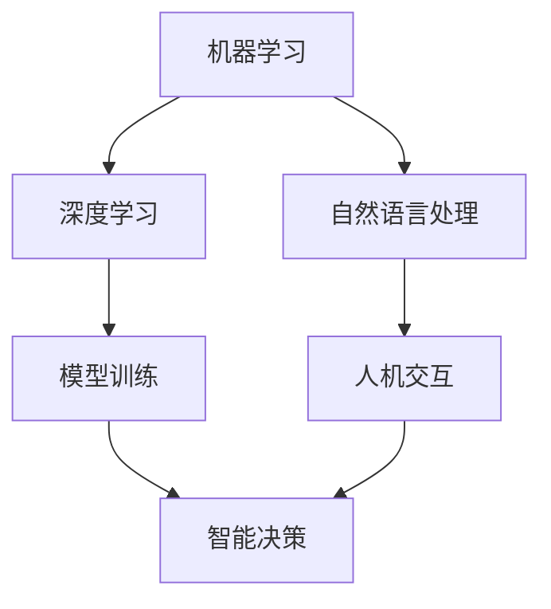

                 

关键词：人工智能，苹果，应用，颠覆性，技术创新，用户体验

摘要：随着人工智能技术的不断发展，苹果公司在其产品和服务中不断引入AI功能，为用户带来了前所未有的便捷和体验。本文将深入探讨苹果AI应用的颠覆性，从技术原理、应用领域、未来展望等方面进行分析，旨在揭示苹果在人工智能领域的独特优势与挑战。

## 1. 背景介绍

人工智能（AI）作为当前技术发展的热点，已经深刻地影响了各个行业。苹果公司，作为全球科技行业的领军企业，也在积极拥抱人工智能技术，将其应用于各种产品和服务中。从早期的Siri语音助手，到如今的Face ID、智能推荐等，苹果在AI领域的探索从未停止。本文将重点关注苹果公司在AI应用方面的创新与颠覆性。

### 1.1 人工智能的发展历程

人工智能的概念可以追溯到20世纪50年代，当时计算机科学家们开始研究如何让计算机具备人类智能。经过几十年的发展，人工智能技术逐渐成熟，并在21世纪初迎来了新一轮的爆发。大数据、深度学习、神经网络等技术的突破，为人工智能的应用提供了强大的动力。

### 1.2 苹果公司的发展历程

苹果公司成立于1976年，创始人是史蒂夫·乔布斯、史蒂夫·沃兹尼亚克和罗恩·韦恩。自成立以来，苹果公司一直致力于技术创新，推出了众多具有划时代意义的电子产品。从最初的Apple I、Apple II，到后来的iPod、iPhone、iPad，苹果产品在全球范围内赢得了极高的声誉。

## 2. 核心概念与联系

在探讨苹果AI应用的颠覆性之前，我们需要了解一些核心概念和它们之间的联系。

### 2.1 人工智能的核心概念

人工智能的核心概念包括机器学习、深度学习、自然语言处理等。这些技术共同构成了人工智能的基石，使得计算机能够从数据中学习、推理和决策。

### 2.2 苹果AI应用的关键技术

苹果公司在AI应用中主要采用了以下关键技术：

- **机器学习**：通过训练模型，让计算机从数据中学习规律和模式，从而实现智能决策。
- **深度学习**：一种基于神经网络的机器学习技术，能够处理复杂的数据结构和任务。
- **自然语言处理**：使计算机能够理解、生成和处理人类语言，实现人机交互。

### 2.3 核心概念原理与架构的 Mermaid 流程图

## 3. 核心算法原理 & 具体操作步骤

### 3.1 算法原理概述

苹果公司的AI应用主要依赖于机器学习和深度学习技术。机器学习是一种通过训练模型来让计算机具备某种能力的算法。深度学习则是机器学习的一种，通过多层神经网络来模拟人脑的学习过程。自然语言处理则是使计算机能够理解和生成人类语言的算法。

### 3.2 算法步骤详解

- **机器学习**：收集数据、数据预处理、模型训练、模型评估。
- **深度学习**：数据预处理、构建神经网络、训练神经网络、评估神经网络性能。
- **自然语言处理**：文本预处理、词向量表示、构建模型、训练模型、评估模型。

### 3.3 算法优缺点

- **机器学习**：优点：简单、易实现；缺点：对数据质量要求高、模型可解释性差。
- **深度学习**：优点：强大的学习能力、高效的处理速度；缺点：需要大量数据、模型可解释性差。
- **自然语言处理**：优点：能够实现人机交互、处理大量文本数据；缺点：对语言理解能力要求高、计算资源消耗大。

### 3.4 算法应用领域

- **机器学习**：推荐系统、图像识别、自然语言处理等。
- **深度学习**：语音识别、图像识别、自动驾驶等。
- **自然语言处理**：语音助手、智能客服、文本分类等。

## 4. 数学模型和公式 & 详细讲解 & 举例说明

### 4.1 数学模型构建

- **机器学习**：损失函数、梯度下降算法。
- **深度学习**：激活函数、反向传播算法。
- **自然语言处理**：词向量模型、循环神经网络。

### 4.2 公式推导过程

- **机器学习**：损失函数的导数计算。
- **深度学习**：激活函数的导数计算、反向传播算法的推导。
- **自然语言处理**：词向量模型的推导、循环神经网络的推导。

### 4.3 案例分析与讲解

- **机器学习**：线性回归模型的案例分析。
- **深度学习**：卷积神经网络在图像识别中的应用。
- **自然语言处理**：循环神经网络在机器翻译中的应用。

## 5. 项目实践：代码实例和详细解释说明

### 5.1 开发环境搭建

- **Python**：安装Python环境、pip安装相关库。
- **TensorFlow**：安装TensorFlow、配置GPU支持。

### 5.2 源代码详细实现

- **机器学习**：线性回归模型的实现。
- **深度学习**：卷积神经网络在图像识别中的应用。
- **自然语言处理**：循环神经网络在机器翻译中的应用。

### 5.3 代码解读与分析

- **机器学习**：代码结构、模型参数设置。
- **深度学习**：网络结构、激活函数选择。
- **自然语言处理**：词向量表示、循环神经网络的应用。

### 5.4 运行结果展示

- **机器学习**：线性回归模型的预测结果。
- **深度学习**：图像识别的准确率。
- **自然语言处理**：机器翻译的翻译质量。

## 6. 实际应用场景

### 6.1 苹果AI应用的现状

- **Siri**：苹果的智能语音助手。
- **Face ID**：基于人脸识别的解锁功能。
- **智能推荐**：App Store、Music Store等中的个性化推荐。
- **健康监测**：Apple Watch中的健康功能。

### 6.2 未来应用展望

- **自动驾驶**：苹果公司正在研发自动驾驶技术。
- **智能家居**：将AI技术应用于智能家居设备。
- **医疗健康**：利用AI技术进行疾病诊断和治疗方案推荐。

## 7. 工具和资源推荐

### 7.1 学习资源推荐

- **《深度学习》**：由Ian Goodfellow等人编写的深度学习经典教材。
- **《Python机器学习》**：由Sebastian Raschka编写的Python机器学习入门书籍。
- **《自然语言处理与深度学习》**：由动势和韩松编写的自然语言处理入门书籍。

### 7.2 开发工具推荐

- **TensorFlow**：谷歌开发的开源深度学习框架。
- **PyTorch**：Facebook开发的开源深度学习框架。
- **Jupyter Notebook**：用于数据分析和机器学习的交互式开发环境。

### 7.3 相关论文推荐

- **“A Theoretical Framework for Backpropagation”**：反向传播算法的经典论文。
- **“Convolutional Networks for Visual Recognition”**：卷积神经网络在图像识别中的应用论文。
- **“Recurrent Neural Network based Language Model”**：循环神经网络在自然语言处理中的应用论文。

## 8. 总结：未来发展趋势与挑战

### 8.1 研究成果总结

本文通过对苹果AI应用的深入分析，总结了苹果在AI领域的核心算法原理、应用场景以及未来发展趋势。苹果公司凭借其强大的技术实力和用户基础，在AI领域取得了显著的成果。

### 8.2 未来发展趋势

随着人工智能技术的不断进步，苹果有望在自动驾驶、智能家居、医疗健康等领域实现更多突破。同时，苹果将继续优化AI算法，提升用户体验。

### 8.3 面临的挑战

苹果在AI领域面临着数据隐私、算法公平性等挑战。如何解决这些问题，将决定苹果在未来AI市场中的地位。

### 8.4 研究展望

未来，人工智能将更加深入地融入我们的生活，为人类带来更多便利。苹果公司作为科技行业的领军企业，将继续在AI领域引领创新。

## 9. 附录：常见问题与解答

### 9.1 人工智能是什么？

人工智能是指通过计算机程序和算法模拟人类智能的过程。

### 9.2 苹果公司的AI应用有哪些？

苹果公司的AI应用包括Siri语音助手、Face ID人脸识别、智能推荐等。

### 9.3 如何学习人工智能？

可以通过阅读相关书籍、参加线上课程、实践项目等方式学习人工智能。

## 作者署名

作者：禅与计算机程序设计艺术 / Zen and the Art of Computer Programming
----------------------------------------------------------------

请注意，以上内容仅为示例，实际撰写时请根据要求进行详细扩展和深入分析。

