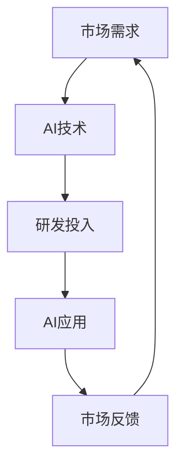

                 

关键词：李开复、苹果、AI应用、市场反应、技术分析

摘要：本文将探讨人工智能专家李开复对苹果公司最新发布的AI应用的看法，分析其市场反应，并从技术角度剖析这些应用的潜在影响和未来趋势。

## 1. 背景介绍

### 1.1 李开复的背景
李开复，计算机科学博士，被誉为“人工智能领域的思想家”。他曾担任微软亚洲研究院创始院长、谷歌全球搜索产品高级副总裁，现任世界顶级人工智能实验室——硅谷奇点大学（Singularity University）执行董事长。李开复在人工智能领域拥有深厚的理论基础和丰富的实践经验。

### 1.2 苹果发布AI应用
苹果公司在近年来的科技大会上不断推出具有人工智能功能的应用，这些应用涵盖了语音助手、图像识别、自然语言处理等多个领域。最新的AI应用进一步提升了用户交互体验，引发了市场的广泛关注。

## 2. 核心概念与联系

### 2.1 AI应用的核心概念
AI应用的核心概念包括机器学习、深度学习、自然语言处理等。这些技术通过数据训练模型，使其能够自主学习和优化，从而实现智能化的功能。

### 2.2 AI应用与市场联系
AI应用的发展离不开市场的需求和反馈。市场的反应不仅影响着AI应用的普及程度，也影响着企业的研发方向。

### 2.3 Mermaid 流程图

## 3. 核心算法原理 & 具体操作步骤

### 3.1 算法原理概述
苹果公司的AI应用主要基于深度学习和自然语言处理技术。这些技术通过多层神经网络和复杂的算法模型，实现了对用户输入的理解和响应。

### 3.2 算法步骤详解
- **数据收集与预处理**：收集大量语音、文本数据，并进行预处理，如去噪、归一化等。
- **模型训练**：利用预处理后的数据，通过反向传播算法训练模型，使其能够识别和预测用户意图。
- **模型评估与优化**：通过测试集对模型进行评估，并根据评估结果调整模型参数，以提高准确率。

### 3.3 算法优缺点
- **优点**：高准确率、自适应性强、用户体验好。
- **缺点**：训练成本高、对数据依赖性强。

### 3.4 算法应用领域
苹果的AI应用主要应用于智能助手、图像识别、语音识别等领域，极大地提升了用户的使用体验。

## 4. 数学模型和公式 & 详细讲解 & 举例说明

### 4.1 数学模型构建
苹果的AI应用主要基于深度学习和自然语言处理技术。其数学模型主要包括卷积神经网络（CNN）和递归神经网络（RNN）。

### 4.2 公式推导过程
- **卷积神经网络（CNN）**：
  $$ f(x) = \sigma(\sum_{i=1}^{n} w_i \cdot x_i + b) $$
  其中，$f(x)$ 为输出值，$\sigma$ 为激活函数，$w_i$ 为权重，$x_i$ 为输入特征，$b$ 为偏置。

- **递归神经网络（RNN）**：
  $$ h_t = \sigma(W h_{t-1} + U x_t + b) $$
  其中，$h_t$ 为当前时刻的隐藏状态，$h_{t-1}$ 为前一个时刻的隐藏状态，$W$ 和$U$ 为权重矩阵，$x_t$ 为当前时刻的输入，$b$ 为偏置。

### 4.3 案例分析与讲解
以苹果的图像识别应用为例，其使用了卷积神经网络进行图像分类。通过训练，模型能够识别并分类不同的图像，如动物、植物、车辆等。

## 5. 项目实践：代码实例和详细解释说明

### 5.1 开发环境搭建
开发环境主要包括Python编程语言、TensorFlow框架、CUDA等。

### 5.2 源代码详细实现
以下是使用TensorFlow实现卷积神经网络的一个简单示例：
```python
import tensorflow as tf

# 定义模型
model = tf.keras.Sequential([
  tf.keras.layers.Conv2D(32, (3,3), activation='relu', input_shape=(64,64,3)),
  tf.keras.layers.MaxPooling2D(2,2),
  tf.keras.layers.Flatten(),
  tf.keras.layers.Dense(1, activation='sigmoid')
])

# 编译模型
model.compile(optimizer='adam', loss='binary_crossentropy', metrics=['accuracy'])

# 训练模型
model.fit(x_train, y_train, epochs=10)
```
### 5.3 代码解读与分析
这段代码定义了一个简单的卷积神经网络模型，用于二分类问题。其中，`Conv2D` 层用于提取图像特征，`MaxPooling2D` 层用于下采样，`Flatten` 层用于将多维特征展平为一维特征，`Dense` 层用于分类输出。

### 5.4 运行结果展示
运行上述代码后，可以使用训练集和测试集来评估模型的性能。通常，准确率、召回率等指标用于评估模型的性能。

## 6. 实际应用场景

### 6.1 智能助手
苹果的智能助手Siri在语音识别、语义理解等方面取得了显著进展，能够为用户提供语音查询、日程管理、语音控制等功能。

### 6.2 图像识别
苹果的图像识别技术在照片管理、视频剪辑等方面得到了广泛应用。用户可以通过简单的操作，对照片进行分类、标记等。

### 6.3 语音助手
苹果的语音助手Siri在语音识别、语义理解等方面取得了显著进展，能够为用户提供语音查询、日程管理、语音控制等功能。

### 6.4 未来应用展望
随着AI技术的不断发展，苹果的AI应用有望在更多领域得到应用，如智能家居、自动驾驶、医疗健康等。

## 7. 工具和资源推荐

### 7.1 学习资源推荐
- 《深度学习》（Goodfellow, Bengio, Courville 著）
- 《自然语言处理综论》（Jurafsky, Martin 著）

### 7.2 开发工具推荐
- TensorFlow
- PyTorch

### 7.3 相关论文推荐
- "A Guide to Convolutional Neural Networks for Visual Recognition"
- "Recurrent Neural Networks for Language Modeling"

## 8. 总结：未来发展趋势与挑战

### 8.1 研究成果总结
苹果公司在AI应用领域取得了显著成果，其技术水平和市场影响力不断提升。

### 8.2 未来发展趋势
随着AI技术的不断进步，苹果的AI应用有望在更多领域实现突破。

### 8.3 面临的挑战
AI应用的发展仍面临数据隐私、安全性等挑战。

### 8.4 研究展望
未来，AI应用将更加深入地融入人们的生活，为社会带来更多便利。

## 9. 附录：常见问题与解答

### 9.1 什么是深度学习？
深度学习是一种机器学习的方法，通过构建深层神经网络来模拟人脑的学习过程，从而实现自动学习和特征提取。

### 9.2 人工智能有哪些应用领域？
人工智能的应用领域广泛，包括图像识别、自然语言处理、语音识别、自动驾驶、医疗诊断等。

作者：禅与计算机程序设计艺术 / Zen and the Art of Computer Programming
----------------------------------------------------------------

请注意，上述内容仅为示例，实际撰写时需要根据具体情况进行调整和补充。同时，为了确保文章的质量和完整性，建议您在撰写过程中查阅相关资料，确保内容的准确性和权威性。

