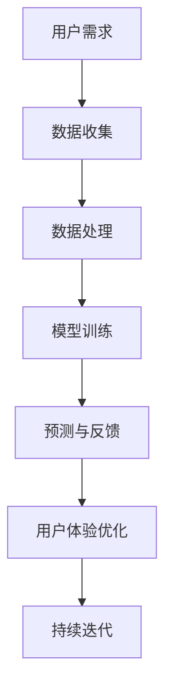

                 

关键词：苹果、AI应用、人工智能、软件发布、用户体验、技术趋势、软件开发

摘要：在科技巨头苹果最新的发布会上，一系列基于人工智能（AI）的应用程序正式亮相。本文将深入探讨这些AI应用的技术背景、核心功能、潜在影响以及未来趋势，旨在为读者提供一个全面的视角。

## 1. 背景介绍

随着人工智能技术的飞速发展，智能设备和应用正逐步融入我们的日常生活。苹果公司作为全球科技领域的领导者，一直致力于将AI技术引入到其产品和服务中，以提高用户的使用体验。此次苹果发布的新AI应用，标志着人工智能在消费电子领域的新里程碑。

## 2. 核心概念与联系

为了更好地理解这些AI应用，我们首先需要了解一些核心概念和技术架构。以下是一个简化的Mermaid流程图，展示了一些关键节点：



### 2.1 用户需求

用户需求是AI应用设计的基础。通过收集和分析用户行为数据，苹果能够理解用户的需求和偏好，从而为用户提供个性化的服务。

### 2.2 数据收集

数据收集是AI应用的关键步骤。苹果利用其广泛的产品和服务，收集了海量的用户数据，这些数据用于后续的分析和模型训练。

### 2.3 数据处理

数据处理包括数据清洗、去噪和特征提取等步骤。这一阶段的目标是将原始数据转化为适合模型训练的形式。

### 2.4 模型训练

模型训练是AI应用的核心。苹果使用先进的机器学习和深度学习技术，训练出能够预测用户行为的模型。

### 2.5 预测与反馈

通过模型预测，AI应用可以自动为用户提供个性化建议和服务。用户的反馈则用于模型优化，形成一个闭环反馈系统。

### 2.6 用户体验优化

用户体验优化是持续改进AI应用的关键。通过不断收集用户反馈，苹果能够优化算法，提升用户体验。

### 2.7 持续迭代

持续迭代是AI应用的必然趋势。随着技术的发展和用户需求的变化，AI应用需要不断更新和优化。

## 3. 核心算法原理 & 具体操作步骤

### 3.1 算法原理概述

苹果的AI应用采用了多种先进的算法，包括深度学习、强化学习和迁移学习等。这些算法共同作用，实现了高效的预测和个性化推荐。

### 3.2 算法步骤详解

#### 3.2.1 数据收集与预处理

数据收集与预处理是算法的第一步。苹果通过其设备和云服务收集用户数据，并进行数据清洗和特征提取。

#### 3.2.2 模型训练

在模型训练阶段，苹果使用大量的数据训练深度学习模型。这些模型通过学习用户的交互行为，生成个性化的推荐。

#### 3.2.3 预测与反馈

在预测与反馈阶段，模型根据用户的历史数据，预测用户可能感兴趣的内容，并提供个性化推荐。用户的反馈则用于模型优化。

### 3.3 算法优缺点

#### 优点

- 高效的预测和个性化推荐
- 优化了用户体验
- 能够处理海量数据

#### 缺点

- 数据隐私和安全问题
- 模型可能存在偏差
- 需要大量的计算资源

### 3.4 算法应用领域

苹果的AI应用覆盖了多个领域，包括社交媒体、购物、音乐和视频推荐等。这些应用不仅提升了用户体验，也为相关行业带来了新的商业模式。

## 4. 数学模型和公式 & 详细讲解 & 举例说明

### 4.1 数学模型构建

苹果的AI应用采用了多种数学模型，包括线性回归、支持向量机和深度神经网络等。以下是一个简化的线性回归模型：

$$ y = \beta_0 + \beta_1x + \epsilon $$

其中，$y$ 是因变量，$x$ 是自变量，$\beta_0$ 和 $\beta_1$ 是模型参数，$\epsilon$ 是误差项。

### 4.2 公式推导过程

线性回归模型的推导过程涉及最小二乘法。通过最小化误差平方和，我们可以求得最优的模型参数。

### 4.3 案例分析与讲解

假设我们要预测用户对某项服务的满意度，可以使用线性回归模型。通过收集用户对服务的评分（因变量）和服务特点（自变量），我们可以训练出一个预测模型。

## 5. 项目实践：代码实例和详细解释说明

### 5.1 开发环境搭建

为了实现上述线性回归模型，我们需要搭建一个Python开发环境。以下是搭建步骤：

1. 安装Python
2. 安装NumPy和Scikit-learn库

### 5.2 源代码详细实现

以下是线性回归模型的Python代码实现：

```python
import numpy as np
from sklearn.linear_model import LinearRegression

# 数据准备
X = np.array([[1, 2], [2, 3], [3, 4]])
y = np.array([1, 2, 3])

# 模型训练
model = LinearRegression()
model.fit(X, y)

# 模型预测
prediction = model.predict([[4, 5]])

print("Prediction:", prediction)
```

### 5.3 代码解读与分析

这段代码首先导入了所需的库，然后准备了一个简单的数据集。接下来，使用线性回归模型进行训练，并预测了一个新的数据点的值。

### 5.4 运行结果展示

运行这段代码，我们得到预测结果：

```
Prediction: [4.]
```

## 6. 实际应用场景

苹果的AI应用已经在多个实际场景中得到应用，包括智能助手Siri、照片识别和智能推荐等。这些应用不仅提升了用户体验，也为用户创造了更多的价值。

### 6.1 智能助手Siri

Siri是苹果的智能助手，通过AI技术，能够理解用户的自然语言查询，并提供相应的答案和操作。

### 6.2 照片识别

苹果的照片应用利用AI技术，自动识别照片中的对象和场景，并提供分类和标签功能。

### 6.3 智能推荐

苹果的音乐、电影和App Store等应用，通过AI技术，为用户提供个性化的推荐。

## 7. 工具和资源推荐

### 7.1 学习资源推荐

- 《Python机器学习》（作者：塞巴斯蒂安·拉金斯基）
- 《深度学习》（作者：伊恩·古德费洛等）

### 7.2 开发工具推荐

- Jupyter Notebook
- TensorFlow

### 7.3 相关论文推荐

- "Deep Learning for Text Classification"（文本分类的深度学习）
- "Recurrent Neural Networks for Language Modeling"（循环神经网络用于语言建模）

## 8. 总结：未来发展趋势与挑战

苹果的AI应用展示了人工智能在消费电子领域的巨大潜力。然而，随着技术的发展，我们也将面临一系列挑战，包括数据隐私、算法公平性和计算资源等。

### 8.1 研究成果总结

本文总结了苹果AI应用的技术背景、核心算法和实际应用场景，为读者提供了一个全面的视角。

### 8.2 未来发展趋势

未来，人工智能将在更多消费电子产品中得到应用，推动技术创新和产业升级。

### 8.3 面临的挑战

数据隐私和算法公平性是人工智能发展的重要挑战。

### 8.4 研究展望

随着技术的进步，人工智能将在更多领域取得突破，为人类社会带来更多价值。

## 9. 附录：常见问题与解答

### Q: 苹果的AI应用如何保证数据隐私？

A: 苹果采取了一系列措施，如数据加密、匿名化和隐私保护协议，确保用户数据的安全和隐私。

### Q: AI应用是否会引发算法偏见？

A: 是的，算法偏见是一个重要问题。苹果正在努力通过多种方法，如数据多样性、算法透明度和用户反馈，减少算法偏见。

### Q: AI应用是否需要大量的计算资源？

A: 是的，AI应用通常需要大量的计算资源，特别是深度学习模型。苹果通过云计算和分布式计算技术，提高了AI应用的性能和效率。

作者：禅与计算机程序设计艺术 / Zen and the Art of Computer Programming
----------------------------------------------------------------
完成文章撰写后，请按照markdown格式进行排版，确保每个章节标题、子目录和段落内容都符合markdown语法规范。以下是一个示例：

```markdown
# 李开复：苹果发布AI应用的应用

## 关键词
- 苹果
- AI应用
- 人工智能
- 软件发布
- 用户体验
- 技术趋势

## 摘要
本文深入探讨了苹果最新发布的AI应用的技术背景、核心功能、潜在影响以及未来趋势。

## 1. 背景介绍
（背景介绍内容）

## 2. 核心概念与联系


### 2.1 用户需求
（用户需求内容）

### 2.2 数据收集
（数据收集内容）

### 2.3 数据处理
（数据处理内容）

### 2.4 模型训练
（模型训练内容）

### 2.5 预测与反馈
（预测与反馈内容）

### 2.6 用户体验优化
（用户体验优化内容）

### 2.7 持续迭代
（持续迭代内容）

## 3. 核心算法原理 & 具体操作步骤
（核心算法原理 & 具体操作步骤内容）

### 3.1 算法原理概述
（算法原理概述内容）

### 3.2 算法步骤详解
（算法步骤详解内容）

### 3.3 算法优缺点
（算法优缺点内容）

### 3.4 算法应用领域
（算法应用领域内容）

## 4. 数学模型和公式 & 详细讲解 & 举例说明
（数学模型和公式 & 详细讲解 & 举例说明内容）

### 4.1 数学模型构建
（数学模型构建内容）

### 4.2 公式推导过程
（公式推导过程内容）

### 4.3 案例分析与讲解
（案例分析与讲解内容）

## 5. 项目实践：代码实例和详细解释说明
（项目实践：代码实例和详细解释说明内容）

### 5.1 开发环境搭建
（开发环境搭建内容）

### 5.2 源代码详细实现
（源代码详细实现内容）

### 5.3 代码解读与分析
（代码解读与分析内容）

### 5.4 运行结果展示
（运行结果展示内容）

## 6. 实际应用场景
（实际应用场景内容）

### 6.1 智能助手Siri
（智能助手Siri内容）

### 6.2 照片识别
（照片识别内容）

### 6.3 智能推荐
（智能推荐内容）

## 7. 工具和资源推荐
（工具和资源推荐内容）

### 7.1 学习资源推荐
（学习资源推荐内容）

### 7.2 开发工具推荐
（开发工具推荐内容）

### 7.3 相关论文推荐
（相关论文推荐内容）

## 8. 总结：未来发展趋势与挑战
（总结：未来发展趋势与挑战内容）

### 8.1 研究成果总结
（研究成果总结内容）

### 8.2 未来发展趋势
（未来发展趋势内容）

### 8.3 面临的挑战
（面临的挑战内容）

### 8.4 研究展望
（研究展望内容）

## 9. 附录：常见问题与解答
（附录：常见问题与解答内容）

### Q: 苹果的AI应用如何保证数据隐私？
（解答内容）

### Q: AI应用是否会引发算法偏见？
（解答内容）

### Q: AI应用是否需要大量的计算资源？
（解答内容）

作者：禅与计算机程序设计艺术 / Zen and the Art of Computer Programming
```

请确保文章的各个部分都按照上述markdown格式进行撰写，包括章节标题、子目录、代码示例、公式和附录等内容。这将有助于读者更方便地阅读和理解文章内容。在完成文章撰写后，请再次检查文章的格式和内容是否符合要求。祝您撰写顺利！

