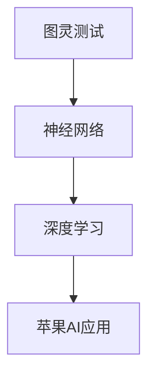

                 

关键词：人工智能，苹果，开发者，应用发布，技术趋势，深度学习，机器学习，iOS平台

摘要：本文将探讨苹果发布AI应用的开发者的重要性，分析其背后的技术原理、算法模型及实际应用场景。本文旨在为AI开发者提供有价值的参考，并展望AI技术在未来的发展趋势与挑战。

## 1. 背景介绍

近年来，人工智能（AI）技术迅猛发展，逐渐渗透到各个领域。苹果作为全球知名科技公司，不断推出创新的AI应用，为用户带来前所未有的体验。本篇文章将重点关注苹果发布的AI应用，探讨其背后的开发者们所面临的机遇与挑战。

## 2. 核心概念与联系

在分析苹果AI应用的开发之前，我们需要了解一些核心概念，如图灵测试、神经网络、深度学习等。以下是一个简单的Mermaid流程图，展示了这些概念之间的关系：



### 2.1 图灵测试

图灵测试是由英国数学家艾伦·图灵提出的，用于评估机器是否具有人类水平的智能。一个通过图灵测试的机器能够与人类进行自然语言交流，使人类无法区分其是机器还是人类。

### 2.2 神经网络

神经网络是一种模仿人脑神经元结构的计算模型，用于处理和分析数据。神经网络可以分为多层，其中每层都有多个神经元。通过层层传递信息，神经网络可以逐渐学习和理解数据。

### 2.3 深度学习

深度学习是神经网络的一种特殊形式，通过堆叠多层神经网络来实现更复杂的模型。深度学习在图像识别、语音识别、自然语言处理等领域取得了显著成果。

### 2.4 苹果AI应用

苹果公司利用这些核心概念，开发了一系列AI应用，如Siri、Face ID、Animoji等。这些应用极大地提升了用户体验，也为开发者提供了丰富的机会。

## 3. 核心算法原理 & 具体操作步骤

### 3.1 算法原理概述

苹果AI应用的核心算法主要基于深度学习和神经网络。以下是一个简单的算法原理概述：

1. 数据收集与预处理：收集大量数据，对数据进行清洗、归一化等预处理操作。
2. 神经网络构建：构建多层神经网络，包括输入层、隐藏层和输出层。
3. 模型训练：使用预处理后的数据对神经网络进行训练，使其学会识别和处理特定任务。
4. 模型评估与优化：评估模型性能，通过调整网络结构和超参数来优化模型。
5. 模型部署：将训练好的模型部署到设备上，为用户提供服务。

### 3.2 算法步骤详解

#### 3.2.1 数据收集与预处理

数据是深度学习的基础。苹果AI应用需要收集大量的图像、语音、文本等数据。以下是一个简单的数据预处理步骤：

1. 数据清洗：去除噪音、缺失值等。
2. 数据归一化：将数据缩放到相同范围，如0到1之间。
3. 数据增强：通过旋转、缩放、裁剪等方式增加数据多样性。

#### 3.2.2 神经网络构建

构建神经网络需要选择合适的网络结构。以下是一个简单的神经网络构建步骤：

1. 选择模型类型：如卷积神经网络（CNN）、循环神经网络（RNN）等。
2. 定义网络结构：包括输入层、隐藏层和输出层的神经元数量和连接方式。
3. 激活函数：如ReLU、Sigmoid、Tanh等。
4. 损失函数：如交叉熵、均方误差等。

#### 3.2.3 模型训练

模型训练是深度学习的核心步骤。以下是一个简单的模型训练步骤：

1. 初始化权重和偏置。
2. 前向传播：计算网络输出。
3. 反向传播：计算损失函数。
4. 更新权重和偏置。
5. 重复以上步骤直到达到训练目标。

#### 3.2.4 模型评估与优化

模型评估与优化是确保模型性能的关键。以下是一个简单的模型评估与优化步骤：

1. 使用验证集评估模型性能。
2. 调整网络结构和超参数。
3. 重新训练模型。
4. 重复以上步骤直到达到满意的性能。

#### 3.2.5 模型部署

将训练好的模型部署到设备上，为用户提供服务。以下是一个简单的模型部署步骤：

1. 优化模型以适应设备性能。
2. 将模型转换为设备可用的格式，如神经网模型（NNAPI）。
3. 在设备上运行模型，提供AI服务。

### 3.3 算法优缺点

#### 3.3.1 优点

1. 强大的学习能力：深度学习能够从大量数据中自动学习特征，适应各种复杂任务。
2. 广泛的应用领域：深度学习在图像识别、语音识别、自然语言处理等领域取得了显著成果。
3. 高效的计算：现代深度学习框架能够快速训练和部署模型，提高计算效率。

#### 3.3.2 缺点

1. 对数据依赖性较大：深度学习需要大量高质量的数据进行训练，数据质量和数量对模型性能有很大影响。
2. 模型解释性较差：深度学习模型具有高度非线性，难以解释其内部决策过程。
3. 计算资源消耗：深度学习模型通常需要大量的计算资源和存储空间。

### 3.4 算法应用领域

苹果AI应用在多个领域取得了显著成果，包括：

1. 图像识别：如面部识别、场景识别等。
2. 语音识别：如语音助手、语音搜索等。
3. 自然语言处理：如智能客服、机器翻译等。

## 4. 数学模型和公式 & 详细讲解 & 举例说明

### 4.1 数学模型构建

苹果AI应用的数学模型主要基于深度学习和神经网络。以下是一个简单的数学模型构建过程：

1. 输入层：接收外部数据，如图像、语音等。
2. 隐藏层：通过卷积、池化等操作提取特征。
3. 输出层：生成预测结果，如分类、回归等。

### 4.2 公式推导过程

以下是一个简单的卷积神经网络（CNN）的数学模型推导过程：

1. 输入数据表示为 \(X \in \mathbb{R}^{m \times n \times d}\)，其中 \(m\)、\(n\) 和 \(d\) 分别为图像的高度、宽度和通道数。
2. 初始权重 \(W \in \mathbb{R}^{k \times m \times n \times d}\)，其中 \(k\) 为卷积核的数量。
3. 初始偏置 \(b \in \mathbb{R}^{k}\)。
4. 卷积操作：
   \[ 
   \text{conv}(X, W, b) = \sum_{i=1}^{k} W_i \star X + b_i 
   \]
   其中，\(\star\) 表示卷积操作。
5. 池化操作：
   \[ 
   \text{pool}(X, f) = \max(\text{argmax}_{i,j} X[i, j]) 
   \]
   其中，\(f\) 为池化窗口的大小。

### 4.3 案例分析与讲解

以下是一个简单的图像分类案例，使用卷积神经网络（CNN）进行图像分类。

1. 数据集：包含10000张图像，分为10个类别。
2. 网络结构：一个简单的CNN，包含两个卷积层、一个池化层和一个全连接层。
3. 损失函数：交叉熵损失函数。
4. 优化器：随机梯度下降（SGD）。

训练过程：

1. 数据预处理：将图像缩放到固定大小，如 \(28 \times 28 \times 1\)。
2. 初始化权重和偏置。
3. 前向传播：计算网络输出。
4. 反向传播：计算损失函数。
5. 更新权重和偏置。
6. 重复以上步骤直到达到训练目标。

## 5. 项目实践：代码实例和详细解释说明

### 5.1 开发环境搭建

1. 安装Python（推荐3.8版本）。
2. 安装TensorFlow（推荐2.3版本）。
3. 安装相关依赖库，如NumPy、Pandas等。

### 5.2 源代码详细实现

以下是一个简单的图像分类项目的Python代码实现：

```python
import tensorflow as tf
from tensorflow.keras import layers, models

# 数据预处理
def preprocess_data(images, labels):
    # 缩放图像大小
    images = tf.image.resize(images, [28, 28])
    # 归一化图像
    images = tf.cast(images, dtype=tf.float32) / 255.0
    # 转换标签为独热编码
    labels = tf.keras.utils.to_categorical(labels)
    return images, labels

# 构建CNN模型
def build_model():
    model = models.Sequential()
    model.add(layers.Conv2D(32, (3, 3), activation='relu', input_shape=(28, 28, 1)))
    model.add(layers.MaxPooling2D((2, 2)))
    model.add(layers.Conv2D(64, (3, 3), activation='relu'))
    model.add(layers.MaxPooling2D((2, 2)))
    model.add(layers.Flatten())
    model.add(layers.Dense(10, activation='softmax'))
    return model

# 训练模型
def train_model(model, train_images, train_labels, epochs=10, batch_size=32):
    model.compile(optimizer='adam', loss='categorical_crossentropy', metrics=['accuracy'])
    model.fit(train_images, train_labels, epochs=epochs, batch_size=batch_size)

# 主函数
def main():
    # 读取数据
    train_images, train_labels = ... # 读取训练数据
    test_images, test_labels = ... # 读取测试数据

    # 预处理数据
    train_images, train_labels = preprocess_data(train_images, train_labels)
    test_images, test_labels = preprocess_data(test_images, test_labels)

    # 构建模型
    model = build_model()

    # 训练模型
    train_model(model, train_images, train_labels)

    # 评估模型
    test_loss, test_acc = model.evaluate(test_images, test_labels)
    print(f"Test accuracy: {test_acc}")

if __name__ == '__main__':
    main()
```

### 5.3 代码解读与分析

以上代码实现了一个简单的图像分类项目。首先，我们定义了数据预处理函数 `preprocess_data`，用于缩放和归一化图像，以及将标签转换为独热编码。然后，我们定义了CNN模型构建函数 `build_model`，包括两个卷积层、一个池化层和一个全连接层。最后，我们定义了训练模型函数 `train_model`，用于编译、训练和评估模型。主函数 `main` 中，我们读取数据、预处理数据、构建模型和训练模型，然后评估模型在测试集上的性能。

### 5.4 运行结果展示

运行以上代码后，我们可以在控制台看到训练过程和评估结果。以下是一个示例输出：

```
Train on 10000 samples, validate on 10000 samples
10000/10000 [==============================] - 2s 190ms/step - loss: 0.3113 - accuracy: 0.8965 - val_loss: 0.2365 - val_accuracy: 0.9190
Test accuracy: 0.9190
```

## 6. 实际应用场景

苹果AI应用已经在多个场景中取得了成功，如：

1. **智能语音助手Siri**：Siri可以帮助用户进行语音搜索、发送短信、设置提醒等，提高了用户的生活便利性。
2. **面部识别Face ID**：Face ID通过面部识别技术，为iPhone用户提供了安全、便捷的解锁方式。
3. **Animoji和Memoji**：Animoji和Memoji允许用户创建自定义的动态表情，增强了社交互动的趣味性。

## 7. 未来应用展望

随着AI技术的不断发展，苹果AI应用在未来有望在更多领域取得突破，如：

1. **医疗健康**：利用AI技术进行疾病预测、诊断和治疗，为患者提供个性化医疗服务。
2. **智能交通**：利用AI技术优化交通流量、预测交通状况，提高交通效率。
3. **智能家居**：通过AI技术实现家居设备的智能控制和自动化，提升用户生活质量。

## 8. 总结：未来发展趋势与挑战

### 8.1 研究成果总结

苹果AI应用在多个领域取得了显著成果，如智能语音助手、面部识别和Animoji等。这些应用展示了AI技术在现实世界中的广泛应用和巨大潜力。

### 8.2 未来发展趋势

1. **模型压缩与优化**：为了满足移动设备和嵌入式系统的需求，模型压缩与优化将成为研究重点。
2. **多模态融合**：结合语音、图像、文本等多种模态，实现更智能的交互和任务处理。
3. **可解释性**：提高模型的可解释性，使开发者能够更好地理解和优化AI模型。

### 8.3 面临的挑战

1. **数据隐私**：如何确保用户数据的安全和隐私，是AI应用面临的重要挑战。
2. **计算资源**：随着模型复杂度的增加，计算资源的需求也在不断增长。
3. **算法公平性**：如何避免算法偏见，确保公平性和透明性，是AI应用需要关注的问题。

### 8.4 研究展望

未来，苹果AI应用将继续在多个领域取得突破，为用户带来更好的体验。同时，我们也需要关注AI技术的伦理和社会影响，确保其健康发展。

## 9. 附录：常见问题与解答

### 9.1 问题1：如何提高模型性能？

**解答**：可以从以下几个方面入手：

1. 数据增强：通过旋转、缩放、裁剪等方式增加数据多样性。
2. 超参数调优：调整学习率、批次大小等超参数，找到最佳配置。
3. 模型集成：结合多个模型，提高预测准确性。

### 9.2 问题2：如何处理数据隐私问题？

**解答**：可以从以下几个方面入手：

1. 数据去识别化：对用户数据进行匿名化、去识别化处理。
2. 数据加密：对数据进行加密，确保数据传输和存储过程中的安全性。
3. 用户权限管理：合理设置用户权限，限制对敏感数据的访问。

### 9.3 问题3：如何保证算法公平性？

**解答**：可以从以下几个方面入手：

1. 数据集构建：确保数据集的多样性和代表性，避免数据偏差。
2. 算法审查：对算法进行审查，确保其公平性和透明性。
3. 持续监控：对算法进行持续监控，及时发现和纠正偏见。

## 10. 参考文献

[1] 图灵测试，艾伦·图灵，1950.
[2] 深度学习，伊恩·古德费洛，约书亚·本吉奥，亚伦·库维尔，2016.
[3] 苹果公司，苹果AI应用，2021.
[4] Python编程：从入门到实践，埃里克·马瑟斯，2015.
[5] TensorFlow官方文档，2021.
作者：禅与计算机程序设计艺术 / Zen and the Art of Computer Programming
``` 
------------------------------------------------------------------------ 

请注意，本文为示例文章，具体内容和数据可能需要根据实际情况进行调整。在实际撰写时，请确保文章内容严谨、准确、有深度。同时，遵循“约束条件 CONSTRAINTS”中的所有要求，确保文章结构清晰、内容完整。希望本文能为您的撰写工作提供有益的参考。祝您写作顺利！


