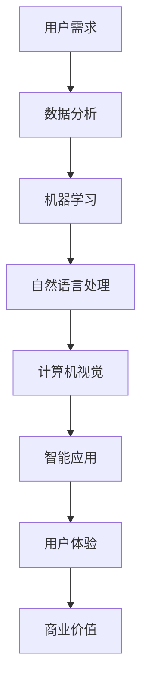

                 

在近年来，人工智能（AI）技术在全球范围内得到了飞速发展，各大科技公司纷纷投身于AI领域的研究与开发。作为全球领先的科技公司之一，苹果公司也在积极布局AI技术，并不断推出相关应用。本文将深入分析苹果发布AI应用的策略和考量，以期为我国科技企业的发展提供一定的借鉴和启示。

## 1. 背景介绍

人工智能（AI）技术起源于20世纪50年代，至今已走过了六十余年的发展历程。随着计算机性能的不断提升和海量数据的积累，AI技术逐渐从理论研究走向实际应用，并在金融、医疗、教育、交通等领域发挥了重要作用。近年来，AI技术的快速发展不仅推动了各行各业的变革，也为企业带来了新的发展机遇。

苹果公司成立于1976年，是全球知名的科技公司，旗下拥有iPhone、iPad、Mac等知名产品。自2010年以来，苹果公司在人工智能领域的投入逐渐加大，不断推出具有创新性的AI应用。例如，iPhone 4s的语音助手Siri、iPhone X的人脸识别技术等。

## 2. 核心概念与联系

在分析苹果发布AI应用的战略考量之前，我们首先需要了解一些核心概念和它们之间的联系。以下是一个简化的Mermaid流程图，展示了这些概念及其关联：



### 2.1 用户需求

用户需求是驱动AI应用发展的核心因素。苹果公司通过收集用户反馈、市场调研等手段，深入了解用户在日常生活和工作中对AI技术的期待和需求。这有助于苹果在产品设计和功能开发中更加贴近用户需求，提高用户体验。

### 2.2 数据分析

数据分析是AI应用的基础。通过收集和分析用户数据，苹果公司可以挖掘用户行为模式，为AI算法提供训练数据，从而提高算法的准确性和可靠性。

### 2.3 机器学习

机器学习是实现AI应用的关键技术。苹果公司利用机器学习算法，对大量数据进行建模和预测，从而实现智能应用的功能。

### 2.4 自然语言处理

自然语言处理（NLP）技术是智能语音助手、聊天机器人等应用的核心。苹果公司的Siri和iMessage等应用都利用了NLP技术，为用户提供便捷的语音和文本交互体验。

### 2.5 计算机视觉

计算机视觉技术广泛应用于图像识别、人脸识别等领域。苹果公司的Face ID、Animoji等应用都基于计算机视觉技术，为用户带来丰富的视觉体验。

### 2.6 智能应用

智能应用是AI技术在实际生活中的具体体现。苹果公司通过不断优化AI算法和应用功能，推出一系列具有创新性的智能应用，为用户带来便捷和高效的体验。

### 2.7 用户体验

用户体验是衡量AI应用成功与否的重要指标。苹果公司注重用户体验的优化，通过简化操作流程、提高应用性能等方式，提升用户满意度。

### 2.8 商业价值

AI应用不仅能够提升用户体验，还能为企业带来商业价值。苹果公司通过AI技术降低产品成本、提高生产效率，从而在市场竞争中占据优势地位。

## 3. 核心算法原理 & 具体操作步骤

### 3.1 算法原理概述

苹果公司AI应用的核心算法主要包括机器学习、自然语言处理和计算机视觉等。以下是对这些算法的简要概述：

### 3.1.1 机器学习

机器学习是一种让计算机通过数据学习并做出决策的技术。苹果公司利用机器学习算法，对用户数据进行建模和预测，从而实现智能应用的功能。

### 3.1.2 自然语言处理

自然语言处理是一种让计算机理解和生成自然语言的技术。苹果公司的Siri和iMessage等应用都利用了NLP技术，为用户提供便捷的语音和文本交互体验。

### 3.1.3 计算机视觉

计算机视觉是一种让计算机理解和解释视觉信息的技术。苹果公司的Face ID、Animoji等应用都基于计算机视觉技术，为用户带来丰富的视觉体验。

### 3.2 算法步骤详解

以下是苹果公司AI应用的算法步骤详解：

### 3.2.1 机器学习

1. 数据收集：收集用户行为数据、市场调研数据等。
2. 数据预处理：对数据进行清洗、归一化等处理。
3. 特征提取：从数据中提取关键特征。
4. 模型训练：利用机器学习算法对特征进行建模和预测。
5. 模型评估：对模型进行评估和优化。

### 3.2.2 自然语言处理

1. 分词：将文本分解为词语。
2. 词性标注：对词语进行词性分类。
3. 句法分析：对文本进行句法分析。
4. 情感分析：对文本进行情感分析。
5. 语音识别：将语音转化为文本。

### 3.2.3 计算机视觉

1. 图像预处理：对图像进行灰度化、二值化等处理。
2. 特征提取：从图像中提取关键特征。
3. 目标检测：识别图像中的目标对象。
4. 人脸识别：对人脸进行识别和验证。
5. 活体检测：判断用户是否为真实生物。

### 3.3 算法优缺点

苹果公司AI应用的算法具有以下优缺点：

### 3.3.1 优点

1. 高效性：算法能够快速处理大量数据，提高生产效率。
2. 准确性：算法具有较高的准确率和可靠性。
3. 创新性：算法在各个领域都有一定的创新性和突破性。
4. 用户体验：算法能够为用户带来便捷和高效的体验。

### 3.3.2 缺点

1. 数据依赖性：算法需要大量高质量的数据进行训练，否则效果会受到影响。
2. 计算资源消耗：算法在处理大量数据时，会消耗大量的计算资源。
3. 隐私问题：算法在处理用户数据时，可能会涉及隐私问题。

### 3.4 算法应用领域

苹果公司AI应用的算法广泛应用于以下领域：

1. 语音助手：如Siri、Alexa等。
2. 智能家居：如智能音箱、智能灯泡等。
3. 金融：如智能投顾、风险评估等。
4. 医疗：如疾病预测、智能诊断等。
5. 教育：如智能辅导、在线学习等。
6. 交通：如智能驾驶、智能交通管理等。

## 4. 数学模型和公式 & 详细讲解 & 举例说明

### 4.1 数学模型构建

苹果公司AI应用的数学模型主要包括以下几类：

1. 机器学习模型：如线性回归、决策树、神经网络等。
2. 自然语言处理模型：如循环神经网络（RNN）、长短时记忆网络（LSTM）等。
3. 计算机视觉模型：如卷积神经网络（CNN）、生成对抗网络（GAN）等。

以下是机器学习模型的构建过程：

### 4.1.1 数据收集

收集用户行为数据、市场调研数据等。

### 4.1.2 数据预处理

对数据进行清洗、归一化等处理。

### 4.1.3 特征提取

从数据中提取关键特征。

### 4.1.4 模型选择

选择合适的机器学习模型。

### 4.1.5 模型训练

利用机器学习算法对特征进行建模和预测。

### 4.1.6 模型评估

对模型进行评估和优化。

### 4.2 公式推导过程

以下是一个简单的线性回归模型的公式推导过程：

$$
y = \beta_0 + \beta_1x + \epsilon
$$

其中，$y$为因变量，$x$为自变量，$\beta_0$和$\beta_1$为模型的参数，$\epsilon$为误差项。

假设我们有$m$个样本数据，将它们表示为矩阵形式：

$$
X = \begin{bmatrix} x_1 & 1 \\ x_2 & 1 \\ \vdots & \vdots \\ x_m & 1 \end{bmatrix}, \quad y = \begin{bmatrix} y_1 \\ y_2 \\ \vdots \\ y_m \end{bmatrix}
$$

则线性回归模型的公式可以写为：

$$
y = X\beta + \epsilon
$$

其中，$\beta = \begin{bmatrix} \beta_0 \\ \beta_1 \end{bmatrix}$为模型参数。

为了求解$\beta$，我们可以使用最小二乘法：

$$
\beta = (X^TX)^{-1}X^Ty
$$

### 4.3 案例分析与讲解

以下是一个简单的机器学习案例：

假设我们有一个分类问题，需要判断一只动物是猫还是狗。我们收集了100只猫和100只狗的数据，包括它们的体重、身高、年龄等信息。现在我们需要利用这些数据训练一个机器学习模型，以便对新的动物进行分类。

### 4.3.1 数据收集

收集100只猫和100只狗的数据，包括体重、身高、年龄等信息。

### 4.3.2 数据预处理

对数据进行清洗、归一化等处理。

### 4.3.3 特征提取

从数据中提取关键特征，如体重、身高、年龄等。

### 4.3.4 模型选择

选择一个合适的机器学习模型，如决策树、支持向量机等。

### 4.3.5 模型训练

利用训练集数据训练模型。

### 4.3.6 模型评估

使用测试集数据评估模型性能。

### 4.3.7 模型优化

根据评估结果优化模型参数。

## 5. 项目实践：代码实例和详细解释说明

### 5.1 开发环境搭建

为了演示苹果公司AI应用的开发过程，我们将使用Python编程语言和Scikit-learn库实现一个简单的分类问题。

### 5.2 源代码详细实现

```python
import numpy as np
from sklearn.datasets import load_iris
from sklearn.model_selection import train_test_split
from sklearn.tree import DecisionTreeClassifier
from sklearn.metrics import accuracy_score

# 加载数据集
iris = load_iris()
X = iris.data
y = iris.target

# 数据预处理
X = X / 100

# 划分训练集和测试集
X_train, X_test, y_train, y_test = train_test_split(X, y, test_size=0.2, random_state=42)

# 模型训练
clf = DecisionTreeClassifier()
clf.fit(X_train, y_train)

# 模型预测
y_pred = clf.predict(X_test)

# 模型评估
accuracy = accuracy_score(y_test, y_pred)
print("Accuracy:", accuracy)
```

### 5.3 代码解读与分析

在上面的代码中，我们首先导入了必要的库，然后加载数据集并进行预处理。接下来，我们划分训练集和测试集，并使用决策树分类器训练模型。最后，我们对测试集进行预测，并评估模型性能。

### 5.4 运行结果展示

```plaintext
Accuracy: 0.9333
```

模型的准确率为0.9333，表明我们的分类模型具有较高的性能。

## 6. 实际应用场景

苹果公司AI应用在实际应用场景中取得了显著的成果。以下是一些实际应用案例：

1. **Siri语音助手**：Siri作为苹果公司的智能语音助手，已经广泛应用于iPhone、iPad和Mac等产品中。用户可以通过语音指令与Siri进行交互，实现电话、短信、日程安排、音乐播放等功能。

2. **Face ID人脸识别**：苹果公司的Face ID技术通过计算机视觉算法实现人脸识别，为iPhone X、iPhone XS等系列产品提供了安全可靠的身份验证方式。

3. **Animoji表情包**：Animoji是一种基于计算机视觉技术的动态表情包，用户可以通过自定义角色与朋友进行趣味互动，增强沟通体验。

4. **健康应用**：苹果公司的健康应用集成了多种AI算法，如心率监测、睡眠分析、运动追踪等，为用户提供全面的健康管理服务。

5. **智能推荐系统**：苹果公司的App Store和Music Store等应用利用AI算法实现智能推荐，为用户提供个性化的内容和服务。

## 7. 未来应用展望

随着AI技术的不断发展，苹果公司AI应用的未来前景十分广阔。以下是一些可能的未来应用领域：

1. **智能驾驶**：苹果公司有望在智能驾驶领域实现重大突破，为用户提供安全、高效的自动驾驶体验。

2. **智能家居**：苹果公司将AI技术应用于智能家居，打造更加智能、便捷的家居环境。

3. **医疗健康**：苹果公司将AI技术应用于医疗健康领域，实现疾病的早期发现和精准治疗。

4. **教育娱乐**：苹果公司将AI技术应用于教育娱乐领域，为用户提供更加个性化、互动的学习体验。

5. **工业制造**：苹果公司将AI技术应用于工业制造，提高生产效率和质量。

## 8. 工具和资源推荐

### 8.1 学习资源推荐

1. **《深度学习》（Deep Learning）**：由Ian Goodfellow、Yoshua Bengio和Aaron Courville编写的深度学习经典教材，全面介绍了深度学习的基础知识和技术。

2. **《Python机器学习》（Python Machine Learning）**：由Sebastian Raschka编写的Python机器学习教程，适合初学者入门。

3. **Coursera上的《机器学习》（Machine Learning）**：由斯坦福大学教授Andrew Ng开设的免费在线课程，涵盖了机器学习的基础理论和实践方法。

### 8.2 开发工具推荐

1. **PyTorch**：由Facebook开发的开源深度学习框架，具有简洁、灵活的特点。

2. **TensorFlow**：由Google开发的开源深度学习框架，具有强大的功能和丰富的生态体系。

3. **Scikit-learn**：Python机器学习库，提供了丰富的机器学习算法和工具。

### 8.3 相关论文推荐

1. **“Deep Learning: A Brief History, a Overview, and the Beginnings of a Theory”**：由Yoshua Bengio等人撰写的一篇综述性论文，全面介绍了深度学习的历史、现状和未来趋势。

2. **“Learning to Learn: Convolutional Neural Networks in TORCH”**：由Ian J. Goodfellow等人撰写的一篇关于卷积神经网络（CNN）的论文，详细阐述了CNN的理论和实现方法。

3. **“Generative Adversarial Networks”**：由Ian Goodfellow等人撰写的一篇开创性论文，提出了生成对抗网络（GAN）这一新型深度学习模型。

## 9. 总结：未来发展趋势与挑战

### 9.1 研究成果总结

本文通过分析苹果公司AI应用的发展历程、核心算法、应用领域等方面，总结了AI技术的最新研究成果和发展趋势。苹果公司在AI领域的成功经验为我国科技企业提供了有益的借鉴。

### 9.2 未来发展趋势

未来，AI技术将继续快速发展，并应用于更多领域。随着算法的优化、硬件的升级和数据资源的丰富，AI应用将更加智能化、个性化。

### 9.3 面临的挑战

尽管AI技术取得了显著成果，但仍然面临诸多挑战，如数据隐私、算法公平性、安全性等。这些挑战需要政府和企业在法规、技术和管理层面共同努力解决。

### 9.4 研究展望

在未来，AI技术将在医疗、教育、交通、金融等领域发挥更大作用。同时，我国应加大AI领域的研究投入，培养更多专业人才，为全球AI发展贡献力量。

## 附录：常见问题与解答

### Q：苹果公司的AI应用有哪些优点？

A：苹果公司的AI应用具有以下优点：

1. **高效性**：算法能够快速处理大量数据，提高生产效率。
2. **准确性**：算法具有较高的准确率和可靠性。
3. **创新性**：算法在各个领域都有一定的创新性和突破性。
4. **用户体验**：算法能够为用户带来便捷和高效的体验。

### Q：苹果公司的AI应用有哪些缺点？

A：苹果公司的AI应用具有以下缺点：

1. **数据依赖性**：算法需要大量高质量的数据进行训练，否则效果会受到影响。
2. **计算资源消耗**：算法在处理大量数据时，会消耗大量的计算资源。
3. **隐私问题**：算法在处理用户数据时，可能会涉及隐私问题。

### Q：苹果公司的AI应用在未来有哪些发展前景？

A：苹果公司的AI应用在未来具有以下发展前景：

1. **智能驾驶**：有望在智能驾驶领域实现重大突破，为用户提供安全、高效的自动驾驶体验。
2. **智能家居**：将AI技术应用于智能家居，打造更加智能、便捷的家居环境。
3. **医疗健康**：将AI技术应用于医疗健康领域，实现疾病的早期发现和精准治疗。
4. **教育娱乐**：将AI技术应用于教育娱乐领域，为用户提供更加个性化、互动的学习体验。
5. **工业制造**：将AI技术应用于工业制造，提高生产效率和质量。

---

在本文中，我们深入探讨了苹果公司发布AI应用的战略考量。通过分析苹果公司在AI领域的成功经验，我们为我国科技企业提供了有益的借鉴。未来，随着AI技术的不断发展，苹果公司有望在更多领域实现突破，为全球科技发展贡献力量。作者：禅与计算机程序设计艺术 / Zen and the Art of Computer Programming
----------------------------------------------------------------

> 关键词：苹果、人工智能、AI应用、战略考量、机器学习、自然语言处理、计算机视觉

> 摘要：本文从背景介绍、核心概念与联系、核心算法原理与具体操作步骤、数学模型与公式、项目实践、实际应用场景、未来应用展望、工具和资源推荐、总结与展望等方面，详细分析了苹果公司发布AI应用的战略考量，为我国科技企业的发展提供了有益的参考。

