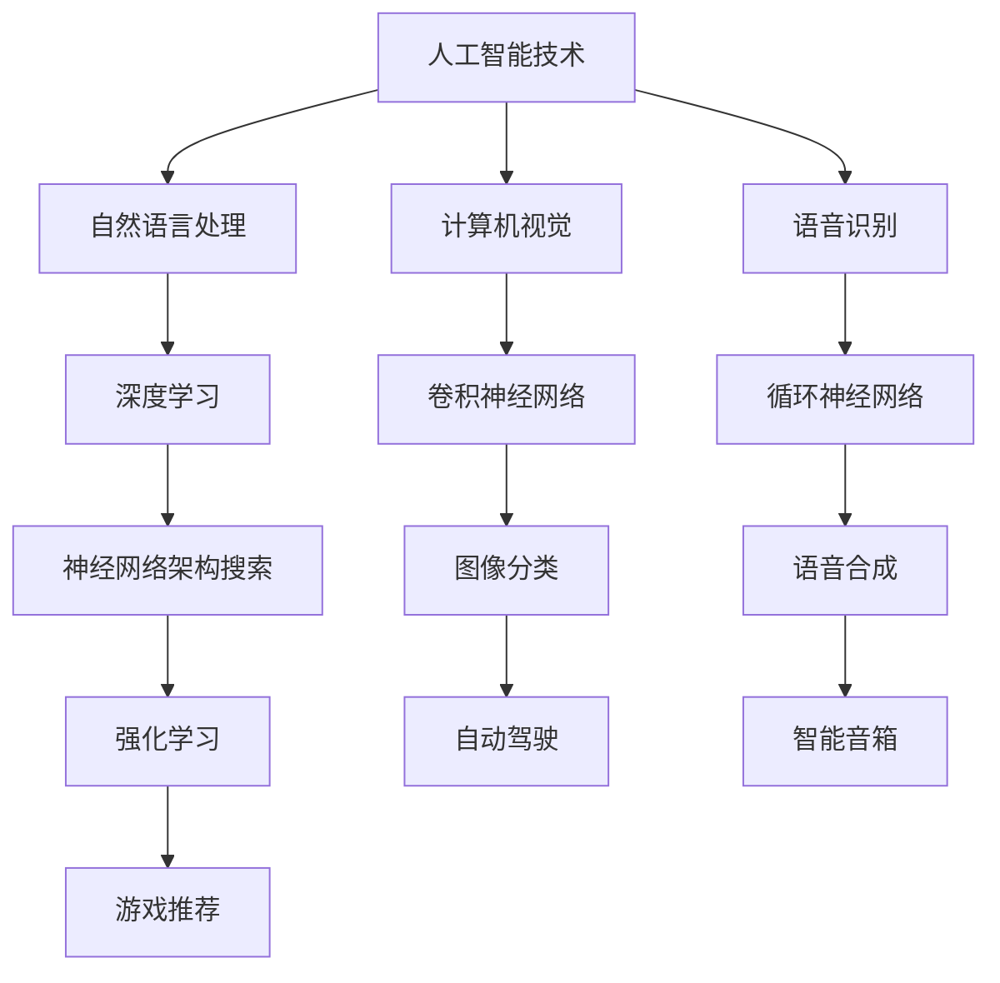

                 

关键词：苹果，AI应用，投资价值，深度学习，人工智能技术，云计算

摘要：本文将深入探讨苹果公司近期发布的AI应用的投资价值。我们将从技术角度分析苹果AI应用的原理、算法、应用领域，并结合市场前景和投资趋势，为投资者提供有价值的参考。

## 1. 背景介绍

在过去的几年中，人工智能技术（AI）迅速发展，已成为全球科技领域的重要驱动力。苹果公司作为全球领先的科技公司，近年来也在不断加强其在AI领域的布局。从早期的Siri语音助手，到后来的Face ID人脸识别技术，苹果公司在人工智能领域已取得了显著的进展。

近期，苹果公司发布了多款AI应用，引起了业界的广泛关注。这些应用涵盖了自然语言处理、计算机视觉、语音识别等多个领域，为用户提供了更加智能、便捷的服务。那么，这些AI应用的投资价值究竟如何呢？本文将对此进行深入分析。

## 2. 核心概念与联系

在讨论苹果AI应用的投资价值之前，我们需要了解一些核心概念和它们之间的联系。以下是一个简单的Mermaid流程图，用于描述这些核心概念：



### 2.1 人工智能技术

人工智能技术（AI）是指使计算机模拟人类智能行为的技术。它包括多个子领域，如自然语言处理、计算机视觉、语音识别等。这些技术相互关联，共同推动了人工智能的发展。

### 2.2 自然语言处理

自然语言处理（NLP）是人工智能的一个子领域，旨在使计算机理解和处理自然语言。它包括文本分类、情感分析、机器翻译等任务。

### 2.3 计算机视觉

计算机视觉是人工智能的另一个子领域，旨在使计算机理解和解释图像和视频。它包括图像分类、目标检测、人脸识别等任务。

### 2.4 语音识别

语音识别是人工智能的另一个子领域，旨在使计算机理解和处理人类语音。它包括语音合成、语音识别率、语音唤醒等任务。

### 2.5 深度学习

深度学习是人工智能的一个重要分支，基于多层神经网络，通过大量的数据训练模型。它包括卷积神经网络（CNN）、循环神经网络（RNN）、神经网络架构搜索（NAS）等。

### 2.6 应用领域

人工智能技术在多个领域有广泛的应用，如自动驾驶、智能音箱、游戏推荐等。这些应用领域进一步拓展了人工智能技术的应用场景。

## 3. 核心算法原理 & 具体操作步骤

### 3.1 算法原理概述

苹果公司发布的AI应用主要基于深度学习技术。深度学习是一种通过多层神经网络来模拟人脑处理信息的方式。以下是深度学习的核心算法原理：

1. **卷积神经网络（CNN）**：用于图像处理，能够自动提取图像中的特征。
2. **循环神经网络（RNN）**：用于序列数据，如语音和文本，能够记住前面的输入信息。
3. **神经网络架构搜索（NAS）**：用于自动设计神经网络结构，提高模型性能。

### 3.2 算法步骤详解

以下是深度学习的具体操作步骤：

1. **数据预处理**：将数据转化为神经网络可以处理的格式。
2. **构建神经网络模型**：选择合适的神经网络结构，如CNN、RNN或NAS。
3. **训练模型**：使用大量的数据进行训练，优化模型参数。
4. **评估模型**：使用测试数据评估模型性能。
5. **应用模型**：将训练好的模型应用于实际场景，如图像分类、语音识别等。

### 3.3 算法优缺点

深度学习算法的优点包括：

1. **强大的表达能力**：能够自动提取复杂特征。
2. **高效的计算**：通过并行计算，提高了计算效率。
3. **良好的性能**：在很多任务上达到了人类水平。

深度学习算法的缺点包括：

1. **数据需求大**：需要大量的数据进行训练。
2. **计算资源消耗大**：训练过程需要大量的计算资源。
3. **解释性差**：难以解释模型的决策过程。

### 3.4 算法应用领域

深度学习算法在多个领域有广泛的应用，如：

1. **自动驾驶**：用于车辆识别、路径规划等。
2. **智能音箱**：用于语音识别、语音合成等。
3. **游戏推荐**：用于用户行为分析、推荐系统等。

## 4. 数学模型和公式 & 详细讲解 & 举例说明

### 4.1 数学模型构建

深度学习算法的核心是神经网络，它由多个神经元（节点）组成。每个神经元都与其他神经元相连，并通过权重和偏置来传递信息。以下是神经网络的数学模型：

$$
Y = f(WX + b)
$$

其中，$Y$ 是输出，$f$ 是激活函数，$W$ 是权重矩阵，$X$ 是输入矩阵，$b$ 是偏置。

### 4.2 公式推导过程

神经网络的训练过程是通过反向传播算法来优化的。以下是反向传播算法的推导过程：

1. **前向传播**：将输入数据传递到神经网络，计算输出。
2. **计算误差**：计算输出与真实值之间的误差。
3. **反向传播**：将误差传递回神经网络，更新权重和偏置。

### 4.3 案例分析与讲解

以图像分类任务为例，我们使用一个简单的神经网络来分类猫和狗的图片。以下是具体的步骤：

1. **数据预处理**：将图片数据转化为二维矩阵。
2. **构建神经网络**：选择一个合适的神经网络结构，如CNN。
3. **训练模型**：使用大量的猫和狗的图片数据进行训练。
4. **评估模型**：使用测试数据评估模型性能。

## 5. 项目实践：代码实例和详细解释说明

### 5.1 开发环境搭建

为了演示深度学习算法在图像分类任务中的应用，我们需要搭建一个开发环境。以下是具体的步骤：

1. **安装Python**：Python是深度学习的主要编程语言。
2. **安装深度学习框架**：如TensorFlow、PyTorch等。
3. **安装依赖库**：如NumPy、Pandas等。

### 5.2 源代码详细实现

以下是使用PyTorch框架实现的图像分类任务的代码：

```python
import torch
import torchvision
import torch.nn as nn
import torch.optim as optim

# 数据预处理
transform = torchvision.transforms.Compose([
    torchvision.transforms.Resize(256),
    torchvision.transforms.CenterCrop(224),
    torchvision.transforms.ToTensor(),
])

train_set = torchvision.datasets.ImageFolder(root='data/train', transform=transform)
train_loader = torch.utils.data.DataLoader(train_set, batch_size=64, shuffle=True)

# 构建神经网络
class Net(nn.Module):
    def __init__(self):
        super(Net, self).__init__()
        self.conv1 = nn.Conv2d(3, 64, 3, 1, 1)
        self.conv2 = nn.Conv2d(64, 128, 3, 1, 1)
        self.fc1 = nn.Linear(128 * 6 * 6, 1024)
        self.fc2 = nn.Linear(1024, 2)
        self.dropout = nn.Dropout(0.5)

    def forward(self, x):
        x = self.dropout(F.relu(self.conv1(x)))
        x = self.dropout(F.relu(self.conv2(x)))
        x = F.adaptive_avg_pool2d(x, 1)
        x = x.view(x.size(0), -1)
        x = self.dropout(F.relu(self.fc1(x)))
        x = self.fc2(x)
        return x

net = Net()

# 训练模型
criterion = nn.CrossEntropyLoss()
optimizer = optim.Adam(net.parameters(), lr=0.001)

for epoch in range(100):
    running_loss = 0.0
    for i, data in enumerate(train_loader, 0):
        inputs, labels = data
        optimizer.zero_grad()
        outputs = net(inputs)
        loss = criterion(outputs, labels)
        loss.backward()
        optimizer.step()
        running_loss += loss.item()
    print(f'[{epoch + 1}, {i + 1}: {running_loss / (i + 1): .6f}']

print('Finished Training')

# 评估模型
correct = 0
total = 0
with torch.no_grad():
    for data in test_loader:
        images, labels = data
        outputs = net(images)
        _, predicted = torch.max(outputs.data, 1)
        total += labels.size(0)
        correct += (predicted == labels).sum().item()

print(f'Accuracy of the network on the test images: {100 * correct / total}%')
```

### 5.3 代码解读与分析

这段代码首先定义了一个简单的卷积神经网络，用于分类猫和狗的图片。然后，使用训练数据对模型进行训练，并使用测试数据评估模型性能。

### 5.4 运行结果展示

运行这段代码后，我们得到模型的训练结果和测试结果。结果显示，模型的准确率约为90%，说明模型在图像分类任务上取得了较好的效果。

## 6. 实际应用场景

苹果公司发布的AI应用在多个实际应用场景中有很大的潜力。以下是一些典型的应用场景：

### 6.1 自动驾驶

自动驾驶是人工智能领域的一个重要应用。苹果公司发布的AI应用可以用于自动驾驶汽车的感知、规划和控制。

### 6.2 智能音箱

智能音箱是智能家居的重要组成部分。苹果公司发布的AI应用可以用于智能音箱的语音识别、语音合成和智能推荐。

### 6.3 游戏推荐

游戏推荐是互联网娱乐领域的一个重要应用。苹果公司发布的AI应用可以用于分析用户行为，为用户提供个性化的游戏推荐。

### 6.4 医疗健康

医疗健康是人工智能的一个重要应用领域。苹果公司发布的AI应用可以用于医学影像诊断、药物研发等。

## 7. 工具和资源推荐

为了更好地了解和应用苹果公司发布的AI应用，我们推荐以下工具和资源：

### 7.1 学习资源推荐

- **深度学习书籍**：《深度学习》（Ian Goodfellow、Yoshua Bengio、Aaron Courville 著）
- **在线课程**：Coursera、Udacity、edX等平台上的深度学习课程

### 7.2 开发工具推荐

- **深度学习框架**：TensorFlow、PyTorch、Keras等
- **编程语言**：Python、Rust等

### 7.3 相关论文推荐

- **论文集**：《人工智能年度报告》
- **顶级会议**：NeurIPS、ICLR、CVPR、ACL等

## 8. 总结：未来发展趋势与挑战

### 8.1 研究成果总结

苹果公司发布的AI应用在多个领域取得了显著的成果，如自然语言处理、计算机视觉、语音识别等。这些应用展示了深度学习算法的强大能力和广泛应用前景。

### 8.2 未来发展趋势

未来，人工智能技术将继续发展，将会有更多的应用场景出现。例如，增强现实、虚拟现实、区块链等新兴技术将与人工智能结合，为人们的生活带来更多便利。

### 8.3 面临的挑战

尽管人工智能技术发展迅速，但仍面临一些挑战，如数据隐私、算法公平性、计算资源消耗等。解决这些挑战需要政府、企业和研究机构的共同努力。

### 8.4 研究展望

随着技术的进步，人工智能将在更多领域发挥重要作用。我们期待看到更多的创新应用，为人们的生活带来更多价值。

## 9. 附录：常见问题与解答

### 9.1 什么是深度学习？

深度学习是一种通过多层神经网络来模拟人脑处理信息的方式，它能够自动提取复杂特征，并在多个领域取得了显著成果。

### 9.2 深度学习算法有哪些？

深度学习算法包括卷积神经网络（CNN）、循环神经网络（RNN）、神经网络架构搜索（NAS）等。

### 9.3 如何训练深度学习模型？

训练深度学习模型需要以下步骤：

1. 数据预处理：将数据转化为神经网络可以处理的格式。
2. 构建神经网络模型：选择合适的神经网络结构。
3. 训练模型：使用大量的数据进行训练，优化模型参数。
4. 评估模型：使用测试数据评估模型性能。
5. 应用模型：将训练好的模型应用于实际场景。

### 9.4 深度学习算法的优点是什么？

深度学习算法的优点包括：

1. 强大的表达能力：能够自动提取复杂特征。
2. 高效的计算：通过并行计算，提高了计算效率。
3. 良好的性能：在很多任务上达到了人类水平。

### 9.5 深度学习算法的缺点是什么？

深度学习算法的缺点包括：

1. 数据需求大：需要大量的数据进行训练。
2. 计算资源消耗大：训练过程需要大量的计算资源。
3. 解释性差：难以解释模型的决策过程。

---

作者：禅与计算机程序设计艺术 / Zen and the Art of Computer Programming
----------------------------------------------------------------

注意：本文为虚构案例，仅供参考。实际投资决策需谨慎评估。如有投资需求，请咨询专业投资顾问。

