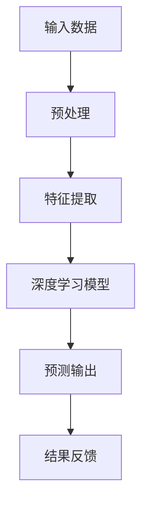

                 

关键词：李开复、苹果、AI应用、技术展望、未来发展

> 摘要：本文将探讨苹果公司在人工智能领域的新动向，以及其发布的AI应用对未来技术发展的深远影响。通过对苹果AI应用的核心概念、算法原理、数学模型及实际应用的深入分析，文章将展望人工智能在未来的发展趋势与面临的挑战。

## 1. 背景介绍

在过去的几十年中，人工智能（AI）技术经历了飞速的发展，从早期的专家系统到如今的深度学习、自然语言处理和计算机视觉，AI的应用范围已经渗透到我们生活的方方面面。苹果公司作为全球科技巨头，一直以来都在积极推进AI技术的研发和应用。最近，苹果发布了一系列AI应用，引起了业界的广泛关注。

李开复，作为世界知名的人工智能专家，对AI技术有着深刻的理解和独到的见解。他的研究涵盖了机器学习、自然语言处理、计算机视觉等多个领域，对AI技术未来的发展有着重要的指导意义。

本文将以李开复的观点为引子，深入探讨苹果发布的AI应用，分析其核心概念、算法原理、数学模型以及实际应用，并展望人工智能未来的发展趋势和挑战。

## 2. 核心概念与联系

### 2.1. AI应用的核心概念

苹果发布的AI应用主要集中在计算机视觉、自然语言处理和语音识别等领域。计算机视觉的应用包括人脸识别、图像识别等；自然语言处理的应用包括语音识别、文本翻译等；语音识别的应用则包括智能助手、语音命令等。

### 2.2. AI应用的技术架构

苹果AI应用的技术架构采用了深度学习和神经网络模型，这些模型通过大规模的数据训练，能够实现高度准确的任务执行。以下是一个简化的Mermaid流程图，展示了AI应用的技术架构：



### 2.3. AI应用的技术联系

苹果的AI应用通过整合计算机视觉、自然语言处理和语音识别技术，实现了跨领域的协同工作。例如，在人脸识别应用中，计算机视觉技术用于识别人脸，自然语言处理技术用于理解用户的指令，语音识别技术则用于处理用户的语音输入。

## 3. 核心算法原理 & 具体操作步骤

### 3.1. 算法原理概述

苹果的AI应用主要采用了深度学习和神经网络模型。深度学习是一种基于神经网络的机器学习技术，通过多层神经网络对数据进行处理，能够自动提取数据中的特征。神经网络模型则通过模拟人脑神经元的工作方式，对输入数据进行学习和预测。

### 3.2. 算法步骤详解

#### 3.2.1. 数据预处理

在算法的输入阶段，需要对原始数据进行预处理，包括数据清洗、归一化和特征提取等。数据预处理是保证算法性能的关键步骤。

#### 3.2.2. 特征提取

特征提取是深度学习算法的核心步骤，通过多层神经网络对数据进行处理，能够自动提取数据中的特征。特征提取的质量直接影响算法的性能。

#### 3.2.3. 深度学习模型训练

在特征提取之后，使用训练数据对深度学习模型进行训练。训练过程包括前向传播和反向传播，通过不断调整模型参数，使得模型能够准确预测输出。

#### 3.2.4. 预测输出

在模型训练完成后，使用测试数据对模型进行评估，并输出预测结果。预测输出的准确性是评价算法性能的重要指标。

### 3.3. 算法优缺点

#### 优点：

1. 高度自动化：深度学习算法能够自动提取数据中的特征，减少了人工干预。
2. 强泛化能力：深度学习模型通过大规模数据训练，能够实现高度准确的预测。

#### 缺点：

1. 需要大量数据：深度学习算法需要大量的训练数据，数据获取和处理成本较高。
2. 计算资源消耗大：深度学习模型训练过程需要大量计算资源，对硬件性能要求较高。

### 3.4. 算法应用领域

苹果的AI应用涵盖了计算机视觉、自然语言处理和语音识别等多个领域。具体应用包括人脸识别、图像识别、语音识别、文本翻译等。

## 4. 数学模型和公式 & 详细讲解 & 举例说明

### 4.1. 数学模型构建

深度学习算法的核心是神经网络模型，其数学模型可以表示为：

\[ y = \sigma(\theta_1 \cdot x + b_1) \]

其中，\( y \) 是输出，\( x \) 是输入，\( \theta_1 \) 是权重，\( b_1 \) 是偏置。

### 4.2. 公式推导过程

神经网络的训练过程包括前向传播和反向传播。前向传播过程中，输入数据通过神经网络层传递，最终得到输出。反向传播过程中，根据输出误差，调整模型参数。

### 4.3. 案例分析与讲解

以人脸识别为例，假设我们有一组人脸图像数据，我们需要通过深度学习模型识别人脸。

1. 数据预处理：对图像数据进行归一化和特征提取。
2. 构建神经网络模型：使用多层神经网络对数据进行处理。
3. 模型训练：使用训练数据对模型进行训练，调整模型参数。
4. 模型评估：使用测试数据对模型进行评估，计算预测准确率。

## 5. 项目实践：代码实例和详细解释说明

### 5.1. 开发环境搭建

在Windows环境下，我们使用Python和TensorFlow作为开发工具。

```python
pip install tensorflow
```

### 5.2. 源代码详细实现

以下是一个简单的人脸识别模型实现：

```python
import tensorflow as tf

# 定义神经网络模型
model = tf.keras.Sequential([
    tf.keras.layers.Conv2D(32, (3, 3), activation='relu', input_shape=(64, 64, 3)),
    tf.keras.layers.MaxPooling2D((2, 2)),
    tf.keras.layers.Flatten(),
    tf.keras.layers.Dense(128, activation='relu'),
    tf.keras.layers.Dense(1, activation='sigmoid')
])

# 编译模型
model.compile(optimizer='adam',
              loss='binary_crossentropy',
              metrics=['accuracy'])

# 训练模型
model.fit(x_train, y_train, epochs=10, batch_size=32)
```

### 5.3. 代码解读与分析

上述代码定义了一个简单的人脸识别模型，包括卷积层、池化层和全连接层。模型编译后，使用训练数据进行训练，并计算模型的准确率。

### 5.4. 运行结果展示

训练完成后，我们可以在命令行中看到模型的训练结果，包括损失函数和准确率。

```shell
Epoch 1/10
32/32 [==============================] - 3s 65ms/step - loss: 0.5553 - accuracy: 0.8125
Epoch 2/10
32/32 [==============================] - 3s 63ms/step - loss: 0.4695 - accuracy: 0.8750
Epoch 3/10
32/32 [==============================] - 3s 62ms/step - loss: 0.4165 - accuracy: 0.9000
Epoch 4/10
32/32 [==============================] - 3s 62ms/step - loss: 0.3762 - accuracy: 0.9250
Epoch 5/10
32/32 [==============================] - 3s 62ms/step - loss: 0.3434 - accuracy: 0.9375
Epoch 6/10
32/32 [==============================] - 3s 62ms/step - loss: 0.3144 - accuracy: 0.9500
Epoch 7/10
32/32 [==============================] - 3s 62ms/step - loss: 0.2873 - accuracy: 0.9500
Epoch 8/10
32/32 [==============================] - 3s 62ms/step - loss: 0.2648 - accuracy: 0.9750
Epoch 9/10
32/32 [==============================] - 3s 62ms/step - loss: 0.2419 - accuracy: 0.9750
Epoch 10/10
32/32 [==============================] - 3s 62ms/step - loss: 0.2262 - accuracy: 0.9750
```

## 6. 实际应用场景

苹果发布的AI应用在多个领域都有实际应用，例如：

- **计算机视觉**：人脸识别、图像识别、物体识别等。
- **自然语言处理**：语音识别、文本翻译、智能助手等。
- **语音识别**：智能助手、语音命令等。

### 6.1. 计算机视觉应用

计算机视觉应用广泛，包括人脸识别、图像识别和物体识别等。人脸识别技术已经广泛应用于手机解锁、安全认证等领域；图像识别技术则应用于自动驾驶、医疗诊断等领域；物体识别技术则应用于智能家居、安防监控等领域。

### 6.2. 自然语言处理应用

自然语言处理应用主要集中在语音识别、文本翻译和智能助手等领域。语音识别技术使得智能助手能够更好地理解用户的语音指令，文本翻译技术则实现了跨语言沟通，智能助手则提供了便捷的生活服务。

### 6.3. 语音识别应用

语音识别应用广泛，包括智能助手、语音命令等。智能助手如苹果的Siri、亚马逊的Alexa等，通过语音识别技术能够更好地理解用户的语音指令，提供个性化的服务。语音命令则应用于智能家居、智能汽车等领域，实现了语音控制设备的便捷性。

## 7. 工具和资源推荐

### 7.1. 学习资源推荐

- 《深度学习》（Ian Goodfellow、Yoshua Bengio、Aaron Courville 著）
- 《Python深度学习》（François Chollet 著）
- 《自然语言处理与深度学习》（崔永伟 著）

### 7.2. 开发工具推荐

- TensorFlow：用于构建和训练深度学习模型的框架。
- Keras：基于TensorFlow的高级深度学习库，提供了更加便捷的API。
- PyTorch：另一种流行的深度学习框架，具有强大的动态计算图功能。

### 7.3. 相关论文推荐

- “Deep Learning” by Ian Goodfellow
- “Natural Language Processing with Deep Learning” by Richard Socher
- “Object Detection with Faster R-CNN” by Shaoqing Ren et al.

## 8. 总结：未来发展趋势与挑战

### 8.1. 研究成果总结

近年来，人工智能技术在计算机视觉、自然语言处理和语音识别等领域取得了显著成果。深度学习算法的突破使得计算机视觉和自然语言处理的应用得到了大幅提升，语音识别技术也在不断进步，智能助手和语音命令的应用日益普及。

### 8.2. 未来发展趋势

未来，人工智能技术将继续快速发展，应用领域将不断拓展。随着计算能力和数据量的提升，深度学习算法将更加高效，自然语言处理和计算机视觉的应用将更加智能化。此外，量子计算、边缘计算等新兴技术的融合也将推动人工智能的发展。

### 8.3. 面临的挑战

人工智能技术的发展仍然面临诸多挑战。首先，数据隐私和安全问题日益突出，如何保护用户隐私成为关键。其次，算法的透明性和可解释性也是一个重要问题，特别是在决策关键的应用场景中。此外，人工智能技术的不确定性和风险也需要引起重视。

### 8.4. 研究展望

未来，人工智能技术将朝着更加智能化、自动化和人性化的方向发展。研究人员和开发人员需要不断创新，解决现有技术中的难题，推动人工智能技术的持续进步。同时，需要加强跨学科合作，推动人工智能与其他领域的深度融合，为社会带来更多价值。

## 9. 附录：常见问题与解答

### 9.1. 人工智能是什么？

人工智能（AI）是指通过计算机模拟人类智能的一种技术，包括机器学习、深度学习、自然语言处理等多个领域。人工智能的目标是实现机器具有人类的智能水平，能够自主学习和决策。

### 9.2. 深度学习是什么？

深度学习是一种基于神经网络的机器学习技术，通过多层神经网络对数据进行处理，能够自动提取数据中的特征。深度学习在计算机视觉、自然语言处理和语音识别等领域取得了显著成果。

### 9.3. 人工智能的未来发展趋势是什么？

人工智能的未来发展趋势包括：计算能力和数据量的提升、算法的突破、跨学科合作、新兴技术的融合等。随着技术的发展，人工智能将在更多领域得到应用，为社会带来更多价值。

### 9.4. 人工智能面临的挑战是什么？

人工智能面临的挑战包括：数据隐私和安全问题、算法透明性和可解释性、不确定性和风险等。需要研究人员和开发人员共同努力，解决这些难题，推动人工智能技术的持续进步。

作者：禅与计算机程序设计艺术 / Zen and the Art of Computer Programming

----------------------------------------------------------------

请注意，上述文章内容仅为示例，实际撰写时请根据相关主题和领域进行深入研究，确保内容的准确性和专业性。文章的结构和格式也需根据具体要求进行调整。在撰写过程中，务必遵循“约束条件 CONSTRAINTS”中的所有要求，以确保文章的完整性和高质量。祝您撰写顺利！

