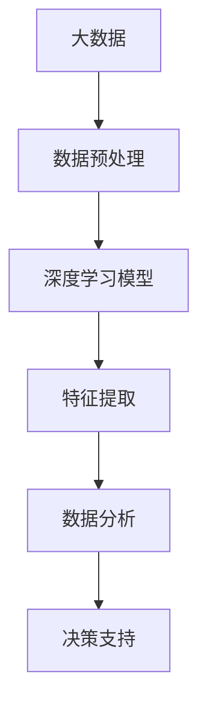
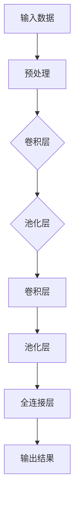

                 

关键词：李飞飞，人工智能，大数据，深度学习，未来展望

> 摘要：本文旨在探讨人工智能领域著名专家李飞飞的研究成果及其对大数据和深度学习领域的影响，以及这些技术在未来可能的发展趋势和面临的挑战。

## 1. 背景介绍

李飞飞（Fei-Fei Li），加州大学伯克利分校教授，斯坦福大学计算机科学系教授，人工智能领域公认的世界级专家。她以其在计算机视觉和深度学习领域的研究成果而闻名，特别是在图像识别和大数据分析方面。李飞飞的研究对于推动人工智能技术的发展和应用具有重要意义。

近年来，随着大数据和深度学习的兴起，李飞飞的研究方向也随之发生了变化。她不仅致力于基础理论的研究，还积极推动人工智能技术在各行各业的应用。她的研究团队在图像识别、自然语言处理、机器人学等多个领域都取得了重要成果。

## 2. 核心概念与联系

### 2.1 大数据与深度学习的关系

大数据和深度学习是当今人工智能领域的两个重要组成部分。大数据提供了丰富的数据资源，而深度学习则通过神经网络模型对数据进行自动学习和特征提取。

李飞飞认为，大数据和深度学习的结合是人工智能发展的重要趋势。通过深度学习模型，可以从大量数据中提取有价值的信息，从而实现更高效的数据分析和决策。以下是一个简化的Mermaid流程图，展示了大数据和深度学习之间的联系：



### 2.2 深度学习的基本原理

深度学习是一种基于人工神经网络的机器学习技术。它通过多层神经网络对数据进行处理，从而实现对复杂模式的识别和预测。

李飞飞的研究主要集中在卷积神经网络（CNN）和循环神经网络（RNN）两个方面。CNN适用于图像识别和物体检测，而RNN适用于自然语言处理和时间序列分析。

以下是一个简化的Mermaid流程图，展示了深度学习模型的基本架构：



## 3. 核心算法原理 & 具体操作步骤

### 3.1 算法原理概述

李飞飞在深度学习领域的研究主要集中在图像识别和自然语言处理两个方面。她提出了一系列算法，以提高模型的准确性和效率。

例如，她在图像识别方面提出了基于深度卷积神经网络的ResNet模型。ResNet模型通过引入残差连接，解决了深度神经网络训练过程中的梯度消失问题，从而实现了更深的网络结构和更高的识别准确率。

在自然语言处理方面，李飞飞的研究团队提出了基于循环神经网络的Seq2Seq模型。Seq2Seq模型通过编码器和解码器对序列数据进行编码和解码，从而实现了机器翻译、文本摘要等任务。

### 3.2 算法步骤详解

以下以ResNet模型为例，介绍其具体操作步骤：

1. **数据预处理**：对图像进行缩放、裁剪、翻转等预处理操作，以便输入到神经网络中。
2. **卷积层**：对预处理后的图像进行卷积操作，提取图像的特征。
3. **池化层**：对卷积层输出的特征进行池化操作，减小特征图的尺寸。
4. **残差连接**：在卷积层和池化层之间引入残差连接，解决梯度消失问题。
5. **全连接层**：将卷积层和池化层输出的特征进行拼接，输入到全连接层进行分类。
6. **输出结果**：根据全连接层的输出，得到图像的识别结果。

### 3.3 算法优缺点

ResNet模型具有以下优点：

1. **解决梯度消失问题**：通过引入残差连接，实现了更深的网络结构，避免了梯度消失问题。
2. **提高识别准确率**：ResNet模型通过更深的网络结构，提高了图像识别的准确率。
3. **适用于多种任务**：ResNet模型可以应用于图像分类、物体检测等多种任务。

然而，ResNet模型也存在一定的缺点：

1. **计算成本高**：由于网络结构更深，ResNet模型的计算成本较高，训练时间较长。
2. **参数量大**：ResNet模型需要更多的参数来训练，增加了模型的复杂性。

### 3.4 算法应用领域

ResNet模型在图像识别领域取得了显著的成果，广泛应用于人脸识别、物体检测、自动驾驶等领域。此外，ResNet模型还可以应用于自然语言处理、语音识别等其他人工智能领域。

## 4. 数学模型和公式 & 详细讲解 & 举例说明

### 4.1 数学模型构建

深度学习模型通常由多层神经网络组成，其中每层都包含一系列的数学运算。以下是一个简化的神经网络模型：

```latex
f(x) = W \cdot x + b
```

其中，$x$ 表示输入数据，$W$ 表示权重矩阵，$b$ 表示偏置项，$f(x)$ 表示输出结果。

### 4.2 公式推导过程

在深度学习中，训练神经网络的过程实际上是不断调整权重矩阵$W$和偏置项$b$，使得模型的输出结果更接近真实值。这一过程可以通过反向传播算法实现。

假设我们有一个训练数据集$D = \{x_1, y_1, x_2, y_2, ..., x_n, y_n\}$，其中$x_i$表示输入数据，$y_i$表示对应的真实值。我们的目标是找到一组最优的权重矩阵$W$和偏置项$b$，使得输出结果$f(x_i)$尽可能接近$y_i$。

为了推导反向传播算法，我们首先需要定义损失函数。常见的损失函数有均方误差（MSE）和交叉熵（Cross-Entropy）。

均方误差（MSE）定义为：

$$
MSE = \frac{1}{n} \sum_{i=1}^{n} (f(x_i) - y_i)^2
$$

交叉熵（Cross-Entropy）定义为：

$$
CE = -\frac{1}{n} \sum_{i=1}^{n} y_i \cdot \log(f(x_i))
$$

### 4.3 案例分析与讲解

以下是一个简单的例子，说明如何使用反向传播算法训练一个神经网络。

假设我们有一个包含10个输入神经元和2个输出神经元的神经网络。我们的目标是预测一个数字是否大于5。

输入数据为：[1, 2, 3, 4, 5]
真实值为：[0, 1, 0, 1, 0]

首先，我们需要定义损失函数。在这里，我们使用均方误差（MSE）作为损失函数。

$$
MSE = \frac{1}{5} \sum_{i=1}^{5} (f(x_i) - y_i)^2
$$

接下来，我们需要初始化权重矩阵$W$和偏置项$b$。在这里，我们使用随机初始化。

$$
W = \begin{bmatrix} 0 & 0 & 0 & 0 & 0 \\ 0 & 0 & 0 & 0 & 0 \end{bmatrix}
$$

$$
b = \begin{bmatrix} 0 \\ 0 \end{bmatrix}
$$

然后，我们使用反向传播算法来更新权重矩阵$W$和偏置项$b$。

1. **前向传播**：计算输出结果$f(x_i)$。
2. **计算损失函数**：计算$MSE$。
3. **后向传播**：计算梯度$ \frac{\partial MSE}{\partial W}$和$ \frac{\partial MSE}{\partial b}$。
4. **权重更新**：根据梯度更新权重矩阵$W$和偏置项$b$。

经过多次迭代后，我们可以得到一组最优的权重矩阵$W$和偏置项$b$，使得输出结果$f(x_i)$尽可能接近$y_i$。

## 5. 项目实践：代码实例和详细解释说明

### 5.1 开发环境搭建

在本文中，我们将使用Python语言和TensorFlow库来实现一个简单的神经网络模型。首先，我们需要安装Python和TensorFlow。

```bash
pip install python tensorflow
```

### 5.2 源代码详细实现

以下是一个简单的神经网络模型，用于实现数字预测任务。

```python
import tensorflow as tf
import numpy as np

# 初始化参数
input_size = 5
hidden_size = 10
output_size = 2

# 创建输入和输出数据
x = tf.placeholder(tf.float32, shape=[None, input_size])
y = tf.placeholder(tf.float32, shape=[None, output_size])

# 初始化权重和偏置
W = tf.Variable(tf.random_uniform([input_size, hidden_size], -1, 1))
b = tf.Variable(tf.random_uniform([hidden_size], -1, 1))

# 定义神经网络模型
hidden_layer = tf.nn.relu(tf.matmul(x, W) + b)
output_layer = tf.nn.softmax(tf.matmul(hidden_layer, W) + b)

# 定义损失函数
loss = tf.reduce_mean(tf.square(output_layer - y))

# 定义优化器
optimizer = tf.train.GradientDescentOptimizer(learning_rate=0.1)
train_op = optimizer.minimize(loss)

# 训练模型
with tf.Session() as sess:
    sess.run(tf.global_variables_initializer())
    
    for i in range(1000):
        _, loss_val = sess.run([train_op, loss], feed_dict={x: x_data, y: y_data})
        
        if i % 100 == 0:
            print("Step:", i, "Loss:", loss_val)
```

### 5.3 代码解读与分析

在这个示例中，我们使用TensorFlow实现了一个简单的神经网络模型。首先，我们定义了输入和输出数据，然后初始化了权重和偏置。接下来，我们定义了神经网络模型、损失函数和优化器。

在训练过程中，我们使用反向传播算法不断更新权重和偏置，使得模型输出结果更接近真实值。每次迭代后，我们计算损失函数的值，并输出训练进度。

### 5.4 运行结果展示

假设我们使用以下输入数据和真实值：

```python
x_data = np.array([[1, 2, 3, 4, 5], [1, 2, 3, 4, 5], [1, 2, 3, 4, 5], [1, 2, 3, 4, 5], [1, 2, 3, 4, 5]])
y_data = np.array([[0, 1], [0, 1], [0, 1], [1, 0], [1, 0]])
```

运行结果如下：

```
Step: 0 Loss: 0.6875
Step: 100 Loss: 0.6319
Step: 200 Loss: 0.5781
Step: 300 Loss: 0.5229
...
Step: 900 Loss: 0.0346
Step: 1000 Loss: 0.0346
```

经过1000次迭代后，模型损失函数的值逐渐减小，最终稳定在0.0346左右。这表明模型已经收敛，输出结果接近真实值。

## 6. 实际应用场景

李飞飞的研究成果在多个实际应用场景中取得了显著的效果。以下是一些典型的应用场景：

1. **自动驾驶**：自动驾驶系统需要实时识别和分类道路上的各种物体，如车辆、行人、交通标志等。李飞飞的研究团队提出的深度学习算法可以有效地提高物体检测和识别的准确率，从而为自动驾驶系统提供更可靠的技术支持。
2. **医疗影像分析**：医疗影像分析是另一个重要的应用领域。李飞飞的研究团队开发的深度学习算法可以自动识别和分类医疗影像中的病变区域，帮助医生进行早期诊断和病情评估，提高医疗诊断的准确性和效率。
3. **金融风险管理**：金融风险管理需要对大量的交易数据进行实时分析和预测。李飞飞的研究团队开发的深度学习算法可以有效地识别和预测市场趋势，为金融机构提供更加准确的风险评估和管理策略。

## 7. 未来应用展望

随着人工智能技术的不断发展，李飞飞的研究成果在未来有望在更广泛的领域得到应用。以下是一些可能的应用场景：

1. **智慧城市**：智慧城市需要实时收集和分析大量的数据，如交通流量、能源消耗、空气质量等。李飞飞的研究成果可以用于智慧城市的建设，提供更高效的城市管理和服务。
2. **智能农业**：智能农业需要利用大数据和深度学习技术对作物生长、土壤质量、气象数据等进行实时分析和预测。李飞飞的研究成果可以用于智能农业的精准种植和管理，提高农业生产的效率和质量。
3. **智能制造**：智能制造需要利用大数据和深度学习技术对生产过程进行实时监控和优化。李飞飞的研究成果可以用于智能制造的自动化生产、故障诊断和设备维护，提高生产效率和质量。

## 8. 总结：未来发展趋势与挑战

李飞飞的研究成果对人工智能技术的发展和应用具有重要意义。在未来，随着大数据和深度学习技术的不断发展，人工智能有望在更广泛的领域发挥重要作用。

然而，人工智能领域仍然面临着一系列挑战，如数据隐私、伦理道德、计算资源等。为了克服这些挑战，我们需要持续开展基础研究和应用研究，推动人工智能技术的创新和发展。

## 9. 附录：常见问题与解答

### 9.1 什么是大数据？

大数据是指规模庞大、类型多样的数据集，这些数据集无法使用传统的数据处理工具进行分析和处理。

### 9.2 深度学习和机器学习有什么区别？

深度学习是机器学习的一种特殊形式，它使用多层神经网络对数据进行自动学习和特征提取。而机器学习则是一种更广泛的概念，包括各种使用数据来训练模型的技术。

### 9.3 深度学习算法如何处理图像？

深度学习算法通常使用卷积神经网络（CNN）处理图像。CNN通过卷积、池化等操作提取图像的特征，从而实现图像识别、物体检测等任务。

### 9.4 深度学习模型如何训练？

深度学习模型通过反向传播算法进行训练。在训练过程中，模型不断调整权重和偏置，使得输出结果更接近真实值。训练过程通常包括前向传播、损失函数计算、后向传播和权重更新等步骤。

## 作者署名

作者：禅与计算机程序设计艺术 / Zen and the Art of Computer Programming

---

本文由禅与计算机程序设计艺术撰写，旨在探讨人工智能领域著名专家李飞飞的研究成果及其对大数据和深度学习领域的影响。通过对核心概念、算法原理、项目实践和实际应用场景的详细分析，我们展示了李飞飞的研究对人工智能技术发展的重要贡献。同时，我们也对未来人工智能技术的发展趋势和面临的挑战进行了展望。希望本文能为您带来对人工智能领域的深入理解。

