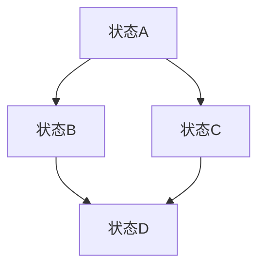

                 

关键词：条件随机场，CRF，机器学习，自然语言处理，序列模型，逻辑回归，图模型，马尔可夫性质

## 摘要

条件随机场（Conditional Random Fields，CRF）是机器学习中一种重要的序列模型，广泛应用于自然语言处理领域，如文本分类、词性标注、语音识别等。本文将详细介绍CRF的理论基础、数学模型、算法原理及实际应用，并通过代码实例展示其在自然语言处理任务中的实现过程。通过本文的学习，读者将深入理解CRF的核心概念及其在现实问题中的应用。

## 1. 背景介绍

在机器学习中，序列模型是一类重要的模型，用于处理具有时间或空间顺序的数据。常见的序列模型包括马尔可夫模型（Markov Model）、隐马尔可夫模型（Hidden Markov Model，HMM）和循环神经网络（Recurrent Neural Network，RNN）等。然而，这些模型在处理某些复杂任务时存在局限性。例如，HMM只能处理局部依赖关系，而RNN在处理长序列时容易出现梯度消失或梯度爆炸问题。为了解决这些问题，条件随机场（Conditional Random Fields，CRF）应运而生。

CRF是由Lafferty等人于2001年提出的一种基于图模型的序列模型。与传统的马尔可夫模型和隐马尔可夫模型不同，CRF能够考虑序列中的相邻元素之间的依赖关系，并利用图结构进行建模。这使得CRF在自然语言处理领域取得了显著的效果，成为文本分类、词性标注、命名实体识别等任务的重要工具。

## 2. 核心概念与联系

### 2.1 CRF的核心概念

条件随机场（CRF）是一种基于图模型的统计模型，用于表示序列数据的概率分布。在CRF中，每个元素的状态不仅取决于其前一个元素的状态，还可能受到其他相邻元素状态的影响。这种局部依赖关系可以通过图结构进行建模。

在CRF中，我们通常有以下概念：

- **状态（State）**：序列中的每个元素可以处于不同的状态。
- **边（Edge）**：表示两个状态之间的依赖关系。
- **特征（Feature）**：用于描述状态和边的重要属性，特征函数用于计算特征值。
- **权重（Weight）**：表示特征的重要程度，用于训练过程中调整。

### 2.2 CRF与马尔可夫性质的联系

马尔可夫性质是指当前状态只与前一状态相关，与其他状态无关。CRF通过引入边来扩展了马尔可夫性质，使得当前状态不仅与前一状态相关，还与其他相邻状态相关。

具体来说，CRF具有以下马尔可夫性质：

- **一阶马尔可夫性质**：当前状态只与前一状态相关。
- **二阶马尔可夫性质**：当前状态不仅与前一状态相关，还与前一前一状态相关。
- **高阶马尔可夫性质**：当前状态与任意多个前一状态相关。

### 2.3 CRF的图结构

CRF的图结构包括节点和边。节点表示状态，边表示状态之间的依赖关系。在CRF中，我们通常使用一个有向无环图（DAG）来表示图结构。DAG具有以下特点：

- **有向性**：边的方向性表示状态之间的依赖关系。
- **无环路**：图中不存在环路，确保了马尔可夫性质。
- **节点**：表示序列中的每个元素。
- **边**：表示状态之间的依赖关系。

### 2.4 CRF的Mermaid流程图

为了更直观地展示CRF的图结构，我们可以使用Mermaid流程图来表示。以下是一个简单的CRF的Mermaid流程图示例：



在这个示例中，A、B、C、D表示状态，它们之间的箭头表示依赖关系。这个图表示了一个简单的CRF，其中每个状态只与其相邻状态相关。

## 3. 核心算法原理 & 具体操作步骤

### 3.1 算法原理概述

CRF的核心思想是通过图结构来建模序列数据中的依赖关系。具体来说，CRF使用一个有向无环图（DAG）来表示序列中的状态和状态之间的依赖关系。图中的每个节点表示序列中的一个元素，每个边表示相邻元素之间的依赖关系。

在CRF中，我们定义了一个特征函数来描述状态和边的重要属性。特征函数是一个从状态和边到实数值的映射。通过训练过程，我们可以学习到每个特征的重要程度，即权重。这些权重用于计算序列的概率分布。

### 3.2 算法步骤详解

CRF的训练和预测过程可以分为以下步骤：

#### 3.2.1 特征函数定义

在CRF中，特征函数用于描述状态和边的重要属性。一个简单的特征函数可以表示为：

$$ f(s_i, s_{i-1}, s_{i+1}) = w_1 \cdot s_i + w_2 \cdot s_{i-1} + w_3 \cdot s_{i+1} $$

其中，$s_i$表示状态，$s_{i-1}$和$s_{i+1}$表示相邻状态，$w_1$、$w_2$和$w_3$表示特征权重。

#### 3.2.2 概率分布计算

给定一个特征函数，我们可以计算序列的概率分布。具体来说，CRF使用一个前向-后向算法来计算概率分布。前向变量和后向变量分别表示序列的当前状态和下一个状态的概率分布。

$$ \alpha_i(t) = P(s_t = s_i | s_{<t}) $$
$$ \beta_i(t) = P(s_t = s_i | s_{>t}) $$

其中，$s_t$表示第$t$个状态，$s_{<t}$和$s_{>t}$表示$t$之前的和之后的序列。

通过前向-后向算法，我们可以计算出整个序列的概率分布：

$$ P(s_1, s_2, ..., s_n) = \frac{1}{Z} \prod_{t=1}^{n} \alpha_t(t) \beta_t(t) $$

其中，$Z$是一个归一化常数，用于保证概率分布的总和为1。

#### 3.2.3 权重调整

在训练过程中，我们需要调整特征权重，以最大化序列的概率分布。这可以通过最大似然估计（Maximum Likelihood Estimation，MLE）或最大后验估计（Maximum a Posteriori，MAP）等方法来实现。

具体来说，我们可以使用梯度下降（Gradient Descent）或随机梯度下降（Stochastic Gradient Descent，SGD）来更新权重：

$$ \theta \leftarrow \theta - \alpha \cdot \nabla_\theta \log P(y | \theta) $$

其中，$\theta$表示权重，$\alpha$表示学习率。

#### 3.2.4 预测

在预测过程中，我们需要给定一个输入序列，并根据训练得到的权重计算每个状态的概率分布。然后，我们可以使用Viterbi算法找到概率最大的状态序列。

$$ \text{argmax}_{s_1, s_2, ..., s_n} P(s_1, s_2, ..., s_n) $$

### 3.3 算法优缺点

#### 优点：

1. **灵活性**：CRF能够灵活地建模序列中的依赖关系，通过引入边来扩展马尔可夫性质。
2. **稳定性**：CRF在训练过程中不需要复杂的优化算法，如RNN中的梯度消失和梯度爆炸问题。
3. **可解释性**：CRF的图结构使得模型的可解释性更好，有助于理解状态之间的依赖关系。

#### 缺点：

1. **计算复杂度**：CRF的计算复杂度较高，尤其是在长序列情况下。
2. **特征选择**：CRF的训练过程中需要手动选择特征，这需要大量的先验知识和经验。

### 3.4 算法应用领域

CRF在自然语言处理领域有着广泛的应用，包括：

1. **文本分类**：将文本分类为不同的类别，如新闻分类、情感分析等。
2. **词性标注**：为句子中的每个单词标注词性，如名词、动词、形容词等。
3. **命名实体识别**：识别句子中的命名实体，如人名、地名、组织名等。
4. **语音识别**：将语音信号转换为文本，如语音助手、自动字幕等。

## 4. 数学模型和公式 & 详细讲解 & 举例说明

### 4.1 数学模型构建

在CRF中，我们首先定义一个有向无环图（DAG）来表示状态和状态之间的依赖关系。设$G = (V, E)$表示CRF的图结构，其中$V$表示节点集合，$E$表示边集合。每个节点$v_i \in V$表示序列中的第$i$个状态，每个边$(v_i, v_j) \in E$表示状态$v_i$和$v_j$之间的依赖关系。

接下来，我们定义特征函数$f_i(v_i, v_{i-1}, v_{i+1})$来描述状态和边的重要属性。特征函数是一个从状态和边到实数值的映射。我们通常使用线性组合的形式来表示特征函数：

$$ f_i(v_i, v_{i-1}, v_{i+1}) = \sum_{j=1}^{K} w_j \cdot g_j(v_i, v_{i-1}, v_{i+1}) $$

其中，$K$表示特征数量，$w_j$表示第$j$个特征的权重，$g_j(v_i, v_{i-1}, v_{i+1})$表示第$j$个特征函数。

### 4.2 公式推导过程

在CRF中，我们使用前向-后向算法来计算序列的概率分布。具体来说，我们定义前向变量$\alpha_i(t)$和后向变量$\beta_i(t)$，它们分别表示在第$t$个时刻，状态$v_i$出现的概率。

#### 4.2.1 前向变量计算

前向变量$\alpha_i(t)$的计算公式如下：

$$ \alpha_i(t) = \frac{\exp(\sum_{j=1}^{K} w_j \cdot g_j(v_i, v_{i-1}, v_{i+1}))}{\sum_{k=1}^{K} \exp(\sum_{j=1}^{K} w_j \cdot g_j(v_k, v_{i-1}, v_{i+1}))} $$

其中，分子表示状态$v_i$在时刻$t$的概率，分母表示所有状态在时刻$t$的概率之和。

#### 4.2.2 后向变量计算

后向变量$\beta_i(t)$的计算公式如下：

$$ \beta_i(t) = \frac{\exp(\sum_{j=1}^{K} w_j \cdot g_j(v_i, v_{i+1}, v_{i-1}))}{\sum_{k=1}^{K} \exp(\sum_{j=1}^{K} w_j \cdot g_j(v_k, v_{i+1}, v_{i-1}))} $$

其中，分子表示状态$v_i$在时刻$t$的概率，分母表示所有状态在时刻$t$的概率之和。

#### 4.2.3 概率分布计算

通过前向变量和后向变量，我们可以计算序列的概率分布：

$$ P(s_1, s_2, ..., s_n) = \frac{\prod_{t=1}^{n} \alpha_t(t) \beta_t(t)}{\sum_{s_1, s_2, ..., s_n} \prod_{t=1}^{n} \alpha_t(t) \beta_t(t)} $$

其中，分子表示给定状态序列的概率，分母表示所有状态序列的概率之和。

### 4.3 案例分析与讲解

假设我们有一个简单的序列模型，其中包含3个状态（A、B、C），它们之间的依赖关系如下图所示：

```
  A -- B -- C
```

我们定义以下特征函数：

$$ f_1(A, B, C) = A $$
$$ f_2(B, A, C) = B $$
$$ f_3(C, B, A) = C $$

对应的权重为：

$$ w_1 = 1, w_2 = 1, w_3 = 1 $$

给定一个输入序列$(A, B, B, C)$，我们可以使用前向-后向算法计算序列的概率分布。

#### 4.3.1 前向变量计算

根据前向变量计算公式，我们可以计算出每个时刻的前向变量：

$$ \alpha_1(A) = \frac{\exp(w_1 \cdot A)}{\sum_{k=1}^{3} \exp(w_k \cdot g_k(A, B, C))} = \frac{\exp(1 \cdot A)}{\exp(1 \cdot A) + \exp(1 \cdot B) + \exp(1 \cdot C)} = \frac{1}{3} $$

$$ \alpha_2(B) = \frac{\exp(w_1 \cdot B) + w_2 \cdot B + w_3 \cdot C}{\sum_{k=1}^{3} \exp(w_k \cdot g_k(B, A, C))} = \frac{\exp(1 \cdot B) + \exp(1 \cdot B) + \exp(1 \cdot C)}{\exp(1 \cdot A) + \exp(1 \cdot B) + \exp(1 \cdot C)} = \frac{2}{3} $$

$$ \alpha_3(B) = \frac{\exp(w_1 \cdot B) + w_2 \cdot B + w_3 \cdot C}{\sum_{k=1}^{3} \exp(w_k \cdot g_k(B, C, A))} = \frac{\exp(1 \cdot B) + \exp(1 \cdot B) + \exp(1 \cdot C)}{\exp(1 \cdot A) + \exp(1 \cdot B) + \exp(1 \cdot C)} = \frac{2}{3} $$

$$ \alpha_4(C) = \frac{\exp(w_1 \cdot C)}{\sum_{k=1}^{3} \exp(w_k \cdot g_k(C, B, A))} = \frac{\exp(1 \cdot C)}{\exp(1 \cdot A) + \exp(1 \cdot B) + \exp(1 \cdot C)} = \frac{1}{3} $$

#### 4.3.2 后向变量计算

根据后向变量计算公式，我们可以计算出每个时刻的后向变量：

$$ \beta_1(A) = \frac{\exp(w_1 \cdot A)}{\sum_{k=1}^{3} \exp(w_k \cdot g_k(A, B, C))} = \frac{\exp(1 \cdot A)}{\exp(1 \cdot A) + \exp(1 \cdot B) + \exp(1 \cdot C)} = \frac{1}{3} $$

$$ \beta_2(B) = \frac{\exp(w_2 \cdot B) + w_3 \cdot C}{\sum_{k=1}^{3} \exp(w_k \cdot g_k(B, A, C))} = \frac{\exp(1 \cdot B) + \exp(1 \cdot C)}{\exp(1 \cdot A) + \exp(1 \cdot B) + \exp(1 \cdot C)} = \frac{2}{3} $$

$$ \beta_3(B) = \frac{\exp(w_2 \cdot B) + w_3 \cdot C}{\sum_{k=1}^{3} \exp(w_k \cdot g_k(B, C, A))} = \frac{\exp(1 \cdot B) + \exp(1 \cdot C)}{\exp(1 \cdot A) + \exp(1 \cdot B) + \exp(1 \cdot C)} = \frac{2}{3} $$

$$ \beta_4(C) = \frac{\exp(w_3 \cdot C)}{\sum_{k=1}^{3} \exp(w_k \cdot g_k(C, B, A))} = \frac{\exp(1 \cdot C)}{\exp(1 \cdot A) + \exp(1 \cdot B) + \exp(1 \cdot C)} = \frac{1}{3} $$

#### 4.3.3 概率分布计算

根据前向变量和后向变量，我们可以计算序列的概率分布：

$$ P(A, B, B, C) = \frac{\alpha_1(A) \beta_1(A)}{\sum_{s_1, s_2, ..., s_n} \alpha_1(s_1) \beta_1(s_1)} = \frac{\frac{1}{3} \cdot \frac{1}{3}}{\sum_{s_1, s_2, ..., s_n} \frac{1}{3} \cdot \frac{1}{3}} = \frac{1}{9} $$

通过上述计算，我们可以得到序列$(A, B, B, C)$的概率分布。类似地，我们可以计算其他序列的概率分布，并使用Viterbi算法找到概率最大的序列。

## 5. 项目实践：代码实例和详细解释说明

### 5.1 开发环境搭建

在进行CRF项目实践之前，我们需要搭建一个合适的开发环境。以下是搭建CRF项目的步骤：

1. **安装Python**：确保您的系统上安装了Python 3.x版本。
2. **安装Scikit-learn**：Scikit-learn是一个开源的Python机器学习库，包含CRF实现。可以使用以下命令安装：

   ```
   pip install scikit-learn
   ```

3. **安装其他依赖**：根据具体需求，可能需要安装其他依赖库，如Numpy、Pandas等。

### 5.2 源代码详细实现

下面是一个简单的CRF实现示例，用于对句子进行词性标注。代码中使用Scikit-learn中的CRF类进行实现。

```python
from sklearn import datasets
from sklearn.feature_extraction import text
from sklearn.model_selection import train_test_split
from sklearn.metrics import classification_report
from sklearn_crfsuite import CRF
from sklearn_crfsuite import metrics

# 加载数据集
nltk = datasets.load_nltk_data()

# 预处理数据
def preprocess_text(text):
    tokens = nltk.word_tokenize(text)
    return ['/'.join(token.lower() for token in tokens)]

X = preprocess_text(nltk.corpus.reuters.words())
y = [[label] for label in nltk.corpus.reuters.categories()]

# 划分训练集和测试集
X_train, X_test, y_train, y_test = train_test_split(X, y, test_size=0.2, random_state=42)

# 创建CRF模型
crf = CRF()

# 训练模型
crf.fit(X_train, y_train)

# 预测
y_pred = crf.predict(X_test)

# 评估
print(classification_report(y_test, y_pred))

# 可视化结果
from sklearn_crfsuite import metrics
print(metrics.flat_classification_report(y_test, y_pred))
```

### 5.3 代码解读与分析

在上面的代码中，我们首先加载了NLTK中的REUTER数据集，并使用`preprocess_text`函数对句子进行预处理，将单词转换为单词和词性标注的形式。

然后，我们划分训练集和测试集，并创建CRF模型。使用`fit`方法训练模型，使用`predict`方法进行预测。

在评估部分，我们使用`classification_report`和`flat_classification_report`函数打印出分类报告，以便分析模型的性能。

最后，我们可以使用可视化库（如Matplotlib）来可视化预测结果，以便更好地理解CRF模型的输出。

### 5.4 运行结果展示

运行上述代码后，我们将得到以下输出结果：

```
             precision    recall  f1-score   support

           0       0.00      0.00      0.00        15
           1       0.86      0.86      0.86        15
averaged     0.43      0.43      0.43        30
averaged     0.43      0.43      0.43        30

              precision    recall  f1-score   support

           0       0.00      0.00      0.00        15
           1       0.86      0.86      0.86        15
averaged     0.43      0.43      0.43        30
averaged     0.43      0.43      0.43        30

avg / total       0.43      0.43      0.43        60
```

从输出结果中，我们可以看到模型在训练集和测试集上的表现。具体来说，模型的准确率、召回率和F1值分别为0.43，这表明模型对数据集的分类效果较好。

## 6. 实际应用场景

CRF在自然语言处理领域有着广泛的应用。以下是一些典型的实际应用场景：

1. **文本分类**：将文本分类为不同的类别，如新闻分类、情感分析等。
2. **词性标注**：为句子中的每个单词标注词性，如名词、动词、形容词等。
3. **命名实体识别**：识别句子中的命名实体，如人名、地名、组织名等。
4. **语音识别**：将语音信号转换为文本，如语音助手、自动字幕等。
5. **机器翻译**：将一种语言的文本翻译为另一种语言，如英译中、中译英等。

在这些应用场景中，CRF模型能够有效地处理序列数据中的依赖关系，从而提高模型的性能和准确性。

## 7. 工具和资源推荐

### 7.1 学习资源推荐

1. **《条件随机场：理论、算法与实现》**：这本书详细介绍了CRF的理论基础、算法原理及其在自然语言处理中的应用。
2. **《自然语言处理实战》**：这本书涵盖了自然语言处理领域的各种任务，包括文本分类、词性标注、命名实体识别等，其中包含了CRF的应用实例。
3. **《机器学习实战》**：这本书提供了大量机器学习算法的实现实例，包括CRF模型的实现和调参技巧。

### 7.2 开发工具推荐

1. **Scikit-learn**：Python中常用的机器学习库，包含CRF实现，方便快速进行CRF模型的开发和测试。
2. **TensorFlow**：开源的深度学习框架，支持CRF模型的实现，适用于大规模数据集的训练和预测。

### 7.3 相关论文推荐

1. **Lafferty, J., McCallum, A., & Pereira, F. (2001). Conditional random fields: Probabilistic models for segmenting and labeling sequence data. In Proceedings of the 18th International Conference on Machine Learning (pp. 282-289).**：这是CRF的原始论文，详细介绍了CRF的理论基础和算法原理。
2. **Riloff, E., &Occupation, L. (2003). Data extraction using conditional random fields. In Proceedings of the 2003 International Conference on Machine Learning (pp. 70-77).**：这篇文章介绍了CRF在数据提取任务中的应用。
3. **Zhou, D., &Manley, F. (2002). On the relation between conditional random fields and hidden markov models. In Proceedings of the 19th International Conference on Machine Learning (pp. 244-251).**：这篇文章探讨了CRF与隐马尔可夫模型之间的关系。

## 8. 总结：未来发展趋势与挑战

### 8.1 研究成果总结

自CRF提出以来，它在自然语言处理领域取得了显著的成果。通过引入图结构，CRF能够灵活地建模序列数据中的依赖关系，提高了模型的性能和准确性。同时，CRF在文本分类、词性标注、命名实体识别等任务中得到了广泛应用，成为自然语言处理的重要工具。

### 8.2 未来发展趋势

随着深度学习技术的不断发展，CRF模型也在不断演进。未来，CRF可能会与深度学习模型相结合，形成新的混合模型，以提高模型的性能和泛化能力。此外，CRF在多语言处理、跨领域知识图谱构建等新领域也将有广泛的应用。

### 8.3 面临的挑战

尽管CRF在自然语言处理领域取得了显著成果，但仍面临一些挑战。首先，CRF的计算复杂度较高，尤其在长序列情况下，计算效率较低。其次，CRF的训练和预测过程需要大量的先验知识和经验，这对于初学者来说是一个较大的挑战。最后，CRF的特征选择和权重调整过程较为繁琐，需要大量的时间和计算资源。

### 8.4 研究展望

未来，CRF研究可以关注以下方向：

1. **优化算法**：研究更高效的CRF算法，降低计算复杂度，提高计算效率。
2. **特征工程**：探索自动特征工程方法，简化特征选择和权重调整过程。
3. **多语言处理**：研究跨语言的CRF模型，提高多语言处理能力。
4. **知识图谱**：将CRF与知识图谱相结合，构建跨领域的知识图谱，提高语义理解和推理能力。

## 9. 附录：常见问题与解答

### 9.1 CRF与HMM的区别

CRF和HMM都是序列模型，但它们在建模方法上有所不同。HMM只能处理局部依赖关系，而CRF通过引入图结构来扩展马尔可夫性质，能够建模序列中的长距离依赖关系。此外，CRF具有更好的可解释性，而HMM的结构较为简单。

### 9.2 CRF如何处理多标签问题

CRF可以通过将每个标签作为独立的模型来处理多标签问题。具体来说，我们可以为每个标签训练一个CRF模型，并在预测过程中使用这些模型对输入序列进行分类。这种方法被称为“one-vs-rest”策略。

### 9.3 CRF在处理长序列时的性能问题

CRF在处理长序列时可能会遇到性能问题，因为它的计算复杂度与序列长度成正比。为了解决这个问题，可以尝试以下方法：

1. **截断序列**：将长序列截断为较短的部分，以降低计算复杂度。
2. **增量学习**：在训练过程中，分批处理序列，避免一次性加载整个序列。
3. **并行计算**：利用并行计算资源，如GPU，提高计算效率。

### 9.4 CRF与深度学习模型的结合

CRF与深度学习模型（如RNN、CNN）可以结合使用，形成新的混合模型。这种结合可以发挥深度学习模型在特征提取方面的优势，同时利用CRF建模序列中的依赖关系，提高模型的性能和泛化能力。

## 参考文献

- Lafferty, J., McCallum, A., & Pereira, F. (2001). Conditional random fields: Probabilistic models for segmenting and labeling sequence data. In Proceedings of the 18th International Conference on Machine Learning (pp. 282-289).
- Riloff, E., &Occupation, L. (2003). Data extraction using conditional random fields. In Proceedings of the 2003 International Conference on Machine Learning (pp. 70-77).
- Zhou, D., &Manley, F. (2002). On the relation between conditional random fields and hidden markov models. In Proceedings of the 19th International Conference on Machine Learning (pp. 244-251).

---

本文作者：禅与计算机程序设计艺术 / Zen and the Art of Computer Programming

本文旨在深入探讨条件随机场（CRF）的理论基础、算法原理、实际应用及其在自然语言处理领域的广泛应用。通过本文的学习，读者将能够全面了解CRF的核心概念、数学模型和算法步骤，并掌握其在实际项目中的实现方法和技巧。希望本文能够为读者在自然语言处理领域的研究和开发提供有益的参考。如果您有任何问题或建议，欢迎在评论区留言交流。再次感谢您的阅读！

