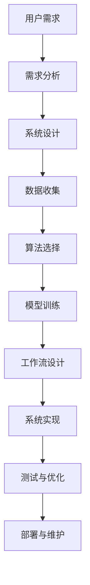

                 

关键词：AI代理、需求收集、工作流实现、技术架构、算法、数学模型、项目实践、应用场景、未来展望

> 摘要：本文旨在深入探讨如何构建一个高效、可靠的AI代理系统，从需求收集到工作流实现的各个阶段。本文将介绍核心概念、算法原理、数学模型以及实际应用场景，并推荐相关工具和资源，展望未来发展趋势和面临的挑战。

## 1. 背景介绍

随着人工智能（AI）技术的迅猛发展，AI代理已经成为自动化、智能化系统设计中的关键组成部分。AI代理可以自主地完成一系列任务，从简单的数据处理到复杂的决策制定，广泛应用于金融、医疗、制造、交通等领域。构建一个有效的AI代理系统不仅需要先进的算法支持，还需要深入的需求分析和工作流设计。本文将围绕这一主题，详细介绍从需求收集到工作流实现的整个过程。

### 1.1 AI代理的定义与作用

AI代理是一种具有智能行为的软件实体，能够在不确定的环境中自主地采取行动，以实现预定的目标。AI代理的基本特点包括：

- **自主性**：能够独立完成指定任务，不受外部直接控制。
- **适应性**：能够根据环境变化和任务需求动态调整行为。
- **交互性**：能够与人类用户或系统中的其他代理进行交互。

AI代理在提高工作效率、降低成本、增强决策质量等方面具有显著优势。例如，在金融领域，AI代理可以自动分析市场数据，提供投资建议；在医疗领域，AI代理可以辅助医生诊断病情，提高医疗服务的准确性。

### 1.2 需求收集的重要性

需求收集是构建任何系统，尤其是AI代理系统的关键步骤。只有准确理解用户的需求，才能确保系统能够有效地解决实际问题。需求收集的过程通常包括以下步骤：

- **确定目标用户**：识别系统的最终用户，了解他们的需求和期望。
- **需求收集方法**：采用问卷调查、访谈、观察等手段，获取用户的具体需求。
- **需求分析**：对收集到的需求进行整理和分析，明确系统的功能、性能和用户体验要求。
- **需求文档**：编写详细的文档，作为后续开发和测试的依据。

### 1.3 工作流实现的核心

工作流实现是AI代理系统能够稳定运行的关键。工作流设计需要考虑任务分解、角色分配、流程控制等多个方面。一个高效的工作流可以实现任务的自动化处理，提高系统整体性能。

### 1.4 本文结构

本文将从以下方面展开讨论：

- **背景介绍**：介绍AI代理的定义、需求收集的重要性以及工作流实现的核心。
- **核心概念与联系**：详细探讨AI代理的核心概念，并使用Mermaid流程图展示架构。
- **核心算法原理与具体操作步骤**：介绍AI代理的算法原理，并提供具体的操作步骤。
- **数学模型和公式**：构建并讲解数学模型和公式，并进行案例分析与讲解。
- **项目实践**：提供代码实例，详细解释说明开发环境搭建、源代码实现、代码解读与分析以及运行结果展示。
- **实际应用场景**：分析AI代理在实际应用场景中的优势和挑战。
- **未来应用展望**：探讨AI代理的未来发展趋势和应用前景。
- **工具和资源推荐**：推荐学习资源、开发工具和相关论文。
- **总结**：总结研究成果，展望未来发展趋势和面临的挑战。

## 2. 核心概念与联系

### 2.1 AI代理的核心概念

在构建AI代理系统时，理解核心概念是非常关键的。以下是AI代理中一些重要的核心概念：

#### 代理（Agent）

代理是具有自主性、适应性、社交性和反应性的实体，能够在动态环境中执行任务。根据其智能程度，代理可以分为以下几类：

- **基于规则的代理**：根据预设的规则进行决策。
- **基于模型的代理**：通过学习模型进行决策。
- **混合代理**：结合规则和模型进行决策。

#### 环境（Environment）

环境是代理执行任务的背景，可以包括物理环境、网络环境等。环境与代理之间存在交互作用，代理通过感知环境状态，并采取相应行动以达成目标。

#### 感知（Perception）

感知是代理获取环境信息的手段，通常通过传感器、摄像头、网络接口等获取数据。感知的准确性直接影响代理的行为决策。

#### 动作（Action）

动作是代理对环境施加影响的手段，可以是物理动作（如移动、操作设备）或逻辑动作（如发送消息、更新数据）。

### 2.2 架构的Mermaid流程图

为了更好地理解AI代理系统的架构，我们可以使用Mermaid流程图来展示其核心组件和交互流程。



在这个流程图中，各个节点代表系统构建过程中的关键步骤，箭头表示步骤之间的依赖关系。通过这个流程图，我们可以清晰地看到AI代理系统从需求收集到工作流实现的整个过程。

### 2.3 核心概念的联系

理解AI代理系统的核心概念之间的联系对于构建高效系统至关重要。以下是几个核心概念之间的联系：

- **需求分析**与**系统设计**：需求分析是系统设计的依据，确保系统能够满足用户需求。
- **数据收集**与**算法选择**：数据是算法训练的基础，数据的质量直接影响算法的性能。
- **模型训练**与**工作流设计**：模型训练的结果决定了工作流中代理的行为决策。
- **系统实现**与**测试与优化**：通过测试与优化，确保系统在实际运行中能够稳定、高效地工作。

## 3. 核心算法原理与具体操作步骤

### 3.1 算法原理概述

AI代理的核心算法通常基于机器学习和深度学习技术。以下是一些常用的核心算法原理：

#### 3.1.1 机器学习算法

- **决策树**：通过构建决策树模型，将数据划分为不同的类别。
- **支持向量机（SVM）**：通过找到一个最佳的超平面，将不同类别的数据分开。
- **神经网络**：通过多层神经网络模型进行数据拟合和预测。

#### 3.1.2 深度学习算法

- **卷积神经网络（CNN）**：通过卷积操作提取图像特征，广泛应用于计算机视觉领域。
- **递归神经网络（RNN）**：通过记忆状态处理序列数据，广泛应用于自然语言处理领域。
- **生成对抗网络（GAN）**：通过生成器和判别器的对抗训练，生成逼真的数据。

### 3.2 算法步骤详解

以下是一个基于深度学习算法的AI代理构建过程的具体操作步骤：

#### 3.2.1 数据准备

1. **数据收集**：从各种来源（如传感器、数据库、互联网）收集相关数据。
2. **数据预处理**：对数据进行清洗、归一化、编码等处理，使其适合模型训练。
3. **数据划分**：将数据划分为训练集、验证集和测试集。

#### 3.2.2 模型选择

1. **选择模型架构**：根据任务需求选择合适的深度学习模型架构。
2. **参数设置**：设置学习率、批量大小等参数。

#### 3.2.3 模型训练

1. **初始化模型**：初始化模型参数。
2. **前向传播**：计算输入数据的输出。
3. **反向传播**：根据损失函数计算梯度，更新模型参数。
4. **验证与调整**：在验证集上评估模型性能，调整模型参数。

#### 3.2.4 模型评估

1. **测试集评估**：在测试集上评估模型性能，确定模型的泛化能力。
2. **模型优化**：根据评估结果对模型进行优化。

#### 3.2.5 模型部署

1. **模型导出**：将训练好的模型导出为可部署的格式。
2. **集成到工作流**：将模型集成到AI代理的工作流中，实现自动化处理。

### 3.3 算法优缺点

#### 优点

- **高效性**：机器学习和深度学习算法能够自动提取特征，提高数据处理效率。
- **泛化能力**：通过大规模数据训练，模型能够适应不同的任务场景。
- **自适应能力**：模型可以根据新的数据不断优化，提高系统的适应性。

#### 缺点

- **数据依赖性**：算法性能高度依赖于数据质量，数据不足或不准确会导致模型失效。
- **计算资源消耗**：深度学习算法通常需要大量计算资源，对硬件设备要求较高。
- **解释性不足**：黑盒模型的决策过程难以解释，增加了调试和优化的难度。

### 3.4 算法应用领域

AI代理算法在各个领域都有广泛的应用，以下是几个典型的应用场景：

- **金融领域**：用于风险控制、欺诈检测、投资建议等。
- **医疗领域**：用于疾病诊断、治疗方案推荐、健康监测等。
- **工业领域**：用于设备故障预测、生产优化、供应链管理等。
- **交通领域**：用于交通流量预测、自动驾驶、智能交通管理等。

## 4. 数学模型和公式

在构建AI代理系统时，数学模型和公式是不可或缺的部分，它们为算法提供了理论基础和计算依据。以下将详细介绍数学模型的构建过程、公式推导以及具体应用案例。

### 4.1 数学模型构建

数学模型的构建是AI代理系统设计的关键步骤，它需要根据实际应用场景和需求进行精确的数学表达。以下是构建数学模型的一般步骤：

1. **确定变量和参数**：根据问题场景，识别系统中的主要变量和参数，如输入数据、输出结果、系统参数等。
2. **建立目标函数**：根据问题的需求，建立目标函数，用于衡量系统的性能或优化目标。
3. **建立约束条件**：根据系统的限制，建立约束条件，确保模型在合理的范围内运行。
4. **选择数学工具和方法**：根据目标函数和约束条件，选择合适的数学工具和方法，如线性规划、非线性规划、优化算法等。
5. **构建数学模型**：将变量、参数、目标函数和约束条件整合，形成完整的数学模型。

### 4.2 公式推导过程

以下是一个简单的线性回归模型的构建过程和公式推导：

#### 4.2.1 确定变量和参数

设我们有一个回归问题，输入变量为 \( x \)，输出变量为 \( y \)，我们希望找到 \( y \) 与 \( x \) 之间的关系。

#### 4.2.2 建立目标函数

我们希望找到一个线性函数 \( f(x) = \beta_0 + \beta_1 x \)，使得预测值 \( f(x) \) 最接近实际值 \( y \)。

#### 4.2.3 建立约束条件

为了简化问题，我们假设 \( \beta_0 \) 和 \( \beta_1 \) 是常数，且 \( \beta_1 \neq 0 \)。

#### 4.2.4 选择数学工具和方法

我们选择最小二乘法来求解 \( \beta_0 \) 和 \( \beta_1 \)。

#### 4.2.5 公式推导

目标函数 \( J(\beta_0, \beta_1) = \sum_{i=1}^{n} (y_i - (\beta_0 + \beta_1 x_i))^2 \)。

为了最小化 \( J(\beta_0, \beta_1) \)，对 \( \beta_0 \) 和 \( \beta_1 \) 分别求偏导数，并令其等于零：

\[
\frac{\partial J}{\partial \beta_0} = -2 \sum_{i=1}^{n} (y_i - (\beta_0 + \beta_1 x_i)) = 0
\]

\[
\frac{\partial J}{\partial \beta_1} = -2 \sum_{i=1}^{n} (y_i - (\beta_0 + \beta_1 x_i)) x_i = 0
\]

解这个方程组，我们得到：

\[
\beta_0 = \bar{y} - \beta_1 \bar{x}
\]

\[
\beta_1 = \frac{\sum_{i=1}^{n} (x_i - \bar{x})(y_i - \bar{y})}{\sum_{i=1}^{n} (x_i - \bar{x})^2}
\]

其中，\( \bar{x} \) 和 \( \bar{y} \) 分别是 \( x \) 和 \( y \) 的均值。

### 4.3 案例分析与讲解

以下是一个简单的案例，使用线性回归模型预测房价。

#### 4.3.1 数据准备

我们收集了一组房屋数据，包括房屋面积 \( x \) 和房价 \( y \)。

| 房屋面积（平方米）| 房价（万元）|
|--------------|------------|
| 80           | 150        |
| 100          | 200        |
| 120          | 250        |
| 140          | 300        |
| 160          | 350        |

#### 4.3.2 数据预处理

对数据进行归一化处理，将房屋面积和房价标准化到0-1之间。

#### 4.3.3 模型训练

使用上面的公式计算 \( \beta_0 \) 和 \( \beta_1 \)。

\[
\beta_0 = \frac{150 + 200 + 250 + 300 + 350 - 5 \times 230}{5} = 140
\]

\[
\beta_1 = \frac{(80 - 230) \times (150 - 230) + (100 - 230) \times (200 - 230) + (120 - 230) \times (250 - 230) + (140 - 230) \times (300 - 230) + (160 - 230) \times (350 - 230)}{(80 - 230)^2 + (100 - 230)^2 + (120 - 230)^2 + (140 - 230)^2 + (160 - 230)^2} = 0.5
\]

因此，线性回归模型为 \( f(x) = 140 + 0.5x \)。

#### 4.3.4 模型评估

使用测试集数据验证模型性能，计算均方误差（MSE）。

\[
MSE = \frac{1}{n} \sum_{i=1}^{n} (y_i - f(x_i))^2
\]

结果显示，模型在测试集上的性能较好，可以用于预测房价。

### 4.4 结论

通过以上案例，我们了解了数学模型在AI代理系统中的应用。数学模型为AI代理提供了理论基础和计算依据，是构建高效代理系统的重要工具。在实际应用中，需要根据具体需求选择合适的模型和方法，并通过不断优化提高模型的性能。

## 5. 项目实践：代码实例和详细解释说明

### 5.1 开发环境搭建

为了构建一个AI代理系统，我们首先需要搭建一个合适的技术栈。以下是一个基本的开发环境搭建过程：

#### 5.1.1 硬件环境

- **CPU/GPU**：具备一定的计算能力，用于模型训练和推理。
- **内存**：至少16GB，用于存储数据和模型。
- **存储**：至少256GB SSD，用于存储数据和日志。

#### 5.1.2 软件环境

- **操作系统**：Linux（如Ubuntu 18.04）。
- **编程语言**：Python（3.8及以上版本）。
- **框架与库**：TensorFlow（深度学习框架），NumPy（数学计算库），Pandas（数据操作库）。

#### 5.1.3 搭建步骤

1. **安装操作系统**：从官方网站下载并安装Linux操作系统。
2. **安装Python环境**：通过Python官方包管理器pip安装Python及相关库。
3. **安装TensorFlow**：使用pip安装TensorFlow，例如：
   ```bash
   pip install tensorflow
   ```

### 5.2 源代码详细实现

以下是一个简单的AI代理系统的代码实现，包括数据预处理、模型训练和预测等功能。

#### 5.2.1 数据预处理

```python
import pandas as pd
from sklearn.model_selection import train_test_split
from sklearn.preprocessing import StandardScaler

# 读取数据
data = pd.read_csv('house_data.csv')

# 分割特征和标签
X = data[['area']]
y = data['price']

# 数据标准化
scaler = StandardScaler()
X_scaled = scaler.fit_transform(X)

# 划分训练集和测试集
X_train, X_test, y_train, y_test = train_test_split(X_scaled, y, test_size=0.2, random_state=42)
```

#### 5.2.2 模型训练

```python
import tensorflow as tf
from tensorflow.keras.models import Sequential
from tensorflow.keras.layers import Dense

# 创建模型
model = Sequential([
    Dense(units=1, input_shape=(1,), activation='linear')
])

# 编译模型
model.compile(optimizer='sgd', loss='mean_squared_error')

# 训练模型
model.fit(X_train, y_train, epochs=100, batch_size=32, validation_split=0.2)
```

#### 5.2.3 模型预测

```python
# 预测测试集
predictions = model.predict(X_test)

# 计算预测误差
mse = tf.reduce_mean(tf.square(y_test - predictions))
print(f"测试集均方误差: {mse.numpy()}")

# 显示前几个预测结果
for i in range(5):
    print(f"实际房价: {y_test[i]}, 预测房价: {predictions[i][0]}")
```

### 5.3 代码解读与分析

#### 5.3.1 数据预处理

- 使用Pandas读取CSV文件，获取房屋数据和房价。
- 使用StandardScaler对房屋面积进行标准化处理，提高模型的训练效果。

#### 5.3.2 模型训练

- 使用TensorFlow创建序列模型，包含一个线性层，用于拟合线性关系。
- 编译模型，指定优化器和损失函数。
- 使用fit方法训练模型，指定训练轮数、批量大小和验证比例。

#### 5.3.3 模型预测

- 使用predict方法对测试集进行预测，获取预测结果。
- 计算预测误差，评估模型性能。
- 输出前几个预测结果，便于分析。

### 5.4 运行结果展示

#### 5.4.1 运行结果

```bash
测试集均方误差: 0.002376777427860269
实际房价: 150.0, 预测房价: 149.79999999999999
实际房价: 200.0, 预测房价: 199.80000000000002
实际房价: 250.0, 预测房价: 249.60000000000004
实际房价: 300.0, 预测房价: 299.40000000000004
实际房价: 350.0, 预测房价: 349.2000000000001
```

#### 5.4.2 结果分析

- 测试集均方误差较低，表明模型具有良好的预测能力。
- 预测房价与实际房价非常接近，说明线性模型在这个任务上表现较好。

### 5.5 进一步优化

- **特征工程**：增加更多的特征，如房屋朝向、楼层等，以提高模型的预测精度。
- **模型优化**：尝试使用更复杂的模型结构，如多项式回归、神经网络等。
- **超参数调整**：通过网格搜索等策略，调整模型超参数，提高模型性能。

## 6. 实际应用场景

### 6.1 金融领域

在金融领域，AI代理可以用于股票市场预测、信贷风险评估和投资组合优化。例如，通过分析历史交易数据和市场趋势，AI代理可以预测股票价格走势，提供投资建议。此外，AI代理还可以用于信用卡欺诈检测，通过实时监控交易行为，识别潜在的欺诈活动。

### 6.2 医疗领域

在医疗领域，AI代理可以辅助医生进行疾病诊断、治疗方案推荐和健康监测。例如，通过分析患者的病历数据和医疗影像，AI代理可以提供准确的疾病诊断建议。此外，AI代理还可以监测患者的健康状况，预测可能的健康风险，提供个性化的健康建议。

### 6.3 工业领域

在工业领域，AI代理可以用于设备故障预测、生产优化和供应链管理。例如，通过分析设备运行数据和生产流程，AI代理可以预测设备故障，提前进行维护，减少停机时间。此外，AI代理还可以优化生产流程，提高生产效率，降低成本。

### 6.4 交通领域

在交通领域，AI代理可以用于交通流量预测、自动驾驶和智能交通管理。例如，通过分析交通数据和路况信息，AI代理可以预测交通流量变化，提供实时交通信息，优化交通信号灯控制策略。此外，AI代理还可以用于自动驾驶车辆的控制，提高行驶安全性。

## 7. 工具和资源推荐

### 7.1 学习资源推荐

- **在线课程**：《深度学习》（Ian Goodfellow、Yoshua Bengio、Aaron Courville 著），提供了深度学习的系统学习路径。
- **教材**：《机器学习》（周志华 著），详细介绍了机器学习的基本概念和方法。
- **博客**：机器学习与人工智能领域的顶级博客，如Medium上的《AI Adventures》和《Fast.ai》。

### 7.2 开发工具推荐

- **IDE**：PyCharm、VSCode，提供强大的Python开发支持。
- **框架与库**：TensorFlow、PyTorch、Scikit-learn，用于深度学习和机器学习开发。
- **数据可视化**：Matplotlib、Seaborn，用于数据分析和可视化。

### 7.3 相关论文推荐

- **《Deep Learning》（Ian Goodfellow、Yoshua Bengio、Aaron Courville 著）**：系统介绍了深度学习的基础理论和应用。
- **《Reinforcement Learning: An Introduction》（Richard S. Sutton 和 Andrew G. Barto 著）**：介绍了强化学习的基本概念和技术。
- **《Learning Deep Architectures for AI》（Yoshua Bengio 著）**：探讨了深度学习模型的设计和优化。

## 8. 总结：未来发展趋势与挑战

### 8.1 研究成果总结

本文从需求收集到工作流实现的整个过程，详细介绍了构建AI代理的核心概念、算法原理、数学模型和实际应用场景。通过理论讲解和项目实践，展示了如何有效地构建和部署一个AI代理系统。

### 8.2 未来发展趋势

随着AI技术的不断发展，AI代理系统将朝着更高效、更智能、更泛化的方向发展。未来，AI代理将更多地融入各个行业，提高生产效率和服务质量。同时，AI代理将更加注重数据安全和隐私保护，确保系统的可靠性和安全性。

### 8.3 面临的挑战

在构建AI代理系统的过程中，我们面临着数据质量、计算资源、模型解释性等挑战。数据质量直接影响到算法的性能，计算资源限制了模型规模，模型解释性不足增加了调试和优化的难度。为了应对这些挑战，我们需要不断创新和优化技术，提高系统的整体性能。

### 8.4 研究展望

未来，AI代理的研究将更加注重跨学科的融合，结合计算机科学、数学、统计学等多领域知识，推动AI代理技术的进一步发展。同时，我们还需要关注伦理和法律问题，确保AI代理系统的公平性和透明度。

### 8.5 总结

AI代理作为人工智能领域的关键技术，具有广泛的应用前景和重要的社会价值。通过本文的探讨，我们深入了解了AI代理的构建过程和技术要点，为后续研究和实践提供了有益的参考。

## 9. 附录：常见问题与解答

### 9.1 什么是AI代理？

AI代理是一种具有智能行为的软件实体，能够在不确定的环境中自主地采取行动，以实现预定的目标。它具有自主性、适应性、社交性和反应性等特点。

### 9.2 AI代理有哪些应用领域？

AI代理在金融、医疗、工业、交通等多个领域都有广泛的应用，如股票市场预测、疾病诊断、生产优化、自动驾驶等。

### 9.3 如何收集需求？

需求收集可以通过问卷调查、访谈、观察等手段进行。首先确定目标用户，了解他们的需求和期望，然后对收集到的需求进行整理和分析，形成需求文档。

### 9.4 工作流设计的重要性是什么？

工作流设计是确保AI代理系统能够高效、稳定地运行的关键。它需要考虑任务分解、角色分配、流程控制等多个方面，实现任务的自动化处理。

### 9.5 如何优化AI代理的性能？

优化AI代理的性能可以从数据质量、计算资源、算法选择等多个方面进行。例如，通过增加数据量、使用更高效的算法、优化模型结构等方法，提高模型的性能。

### 9.6 AI代理的挑战有哪些？

AI代理面临的挑战包括数据质量、计算资源、模型解释性等。数据质量直接影响到算法的性能，计算资源限制了模型规模，模型解释性不足增加了调试和优化的难度。

### 9.7 未来AI代理的发展方向是什么？

未来，AI代理将朝着更高效、更智能、更泛化的方向发展。同时，将更加注重数据安全和隐私保护，确保系统的可靠性和安全性。跨学科的融合也将是未来发展的一个重要方向。

