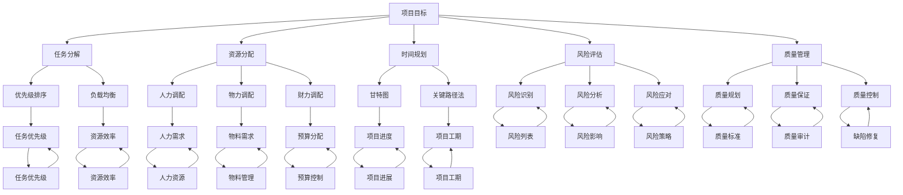

                 

构建行动体系是现代信息技术项目中不可或缺的一环。无论是在软件开发、系统架构设计，还是在人工智能算法的开发过程中，一个有效的行动体系都能极大地提高工作效率，减少错误发生，确保项目按期完成。本文将探讨构建行动体系的关键要素，从核心概念、算法原理到实际应用，力求为IT从业人员提供一套全面、系统的行动体系构建指南。

## 关键词

- 行动体系
- IT项目管理
- 系统架构
- 人工智能
- 算法优化

## 摘要

本文旨在探讨构建行动体系的必要性和关键要素。通过分析IT项目管理中的行动体系构建，本文提出了一个包含核心概念、算法原理、数学模型、项目实践、应用场景等多个方面的综合框架，旨在帮助读者深入了解并掌握构建行动体系的方法和技巧。文章结构如下：

1. 背景介绍
2. 核心概念与联系
3. 核心算法原理 & 具体操作步骤
4. 数学模型和公式 & 详细讲解 & 举例说明
5. 项目实践：代码实例和详细解释说明
6. 实际应用场景
7. 工具和资源推荐
8. 总结：未来发展趋势与挑战
9. 附录：常见问题与解答

### 1. 背景介绍

在信息化时代，IT项目已经成为企业运营的核心组成部分。然而，随着项目规模的扩大和复杂度的增加，IT项目管理的难度也日益上升。传统的项目管理方法往往无法满足现代IT项目的需求，特别是在软件开发、系统架构设计、人工智能算法开发等领域。构建一个有效的行动体系，有助于提高项目的组织效率、减少风险、确保项目按时高质量完成。

行动体系是指在项目管理过程中，对各项任务进行系统化、结构化的组织和安排，以确保项目按照预定的计划和目标顺利进行。一个成功的行动体系应包括任务分解、资源分配、时间规划、风险评估等多个方面。本文将详细探讨这些关键要素，并提供具体的构建方法和实践案例。

### 2. 核心概念与联系

在构建行动体系之前，我们需要明确几个核心概念，并理解它们之间的联系。

#### 2.1 项目目标

项目目标是项目的核心驱动力，明确项目需要达到的具体成果和指标。项目目标通常包括功能性需求、性能指标、质量要求等。在构建行动体系时，我们需要将项目目标细化为可执行的子任务，并确保每个子任务都与项目目标密切相关。

#### 2.2 任务分解

任务分解是将项目目标细化为一系列可操作的子任务的过程。一个好的任务分解能够确保项目任务的结构清晰、层次分明，有助于提高团队协作效率。常见的任务分解方法包括工作分解结构（WBS）和甘特图等。

#### 2.3 资源分配

资源分配是指在项目执行过程中，合理调配人力、物力、财力等资源，以确保项目按计划进行。资源分配的合理与否直接影响项目的进度和质量。常见的资源分配方法包括优先级排序、负载均衡等。

#### 2.4 时间规划

时间规划是指对项目任务进行时间上的安排和调度，以确保项目按期完成。时间规划通常采用甘特图、关键路径法等工具和方法。

#### 2.5 风险评估

风险评估是对项目可能面临的各种风险进行识别、分析和评估的过程。通过风险评估，我们可以提前预测潜在问题，并制定相应的应对策略，降低项目风险。

#### 2.6 质量管理

质量管理是指对项目实施过程中各个环节进行质量控制，以确保项目交付成果符合预定的质量标准。质量管理包括质量规划、质量保证、质量控制等环节。

#### 2.7 项目监控与反馈

项目监控与反馈是指对项目执行过程进行实时监控和评估，及时发现和解决问题，确保项目按计划进行。项目监控与反馈有助于提高项目的透明度和团队协作效率。

### 2.8 Mermaid 流程图

以下是构建行动体系的核心概念与联系的 Mermaid 流程图：



### 3. 核心算法原理 & 具体操作步骤

构建行动体系的核心在于对任务的合理分解、资源的高效分配、时间精准规划以及风险的有效管理。以下将详细介绍核心算法原理以及具体操作步骤。

#### 3.1 算法原理概述

构建行动体系的核心算法主要分为以下几个方面：

- **任务分解算法**：基于项目目标，将任务细化为一系列可操作的子任务，确保任务结构清晰、层次分明。
- **资源分配算法**：根据任务需求，合理调配人力、物力、财力等资源，确保资源利用最大化。
- **时间规划算法**：利用关键路径法、甘特图等方法，对项目任务进行时间上的安排和调度，确保项目按期完成。
- **风险评估算法**：通过识别、分析和评估项目风险，提前预测潜在问题，并制定应对策略。
- **质量管理算法**：对项目实施过程进行质量控制，确保项目交付成果符合预定质量标准。

#### 3.2 算法步骤详解

1. **任务分解**：

   - 收集项目需求，明确项目目标。
   - 将项目目标细化为可操作的子任务。
   - 使用工作分解结构（WBS）或甘特图对子任务进行可视化表示。

2. **资源分配**：

   - 分析任务需求，确定所需资源类型和数量。
   - 根据资源优先级，制定资源分配计划。
   - 利用优先级排序和负载均衡方法，优化资源分配。

3. **时间规划**：

   - 根据任务分解结果，确定各任务的时间需求。
   - 使用关键路径法或甘特图，制定项目时间计划。
   - 对项目时间计划进行优化，确保项目按期完成。

4. **风险评估**：

   - 识别项目风险，包括技术风险、市场风险、管理风险等。
   - 对识别出的风险进行分析，评估风险影响。
   - 制定风险应对策略，降低项目风险。

5. **质量管理**：

   - 制定项目质量标准，明确项目交付成果的质量要求。
   - 对项目实施过程进行质量监控，确保项目交付成果符合质量标准。
   - 对项目质量问题进行及时处理和改进。

#### 3.3 算法优缺点

- **任务分解算法**：

  - 优点：结构清晰，层次分明，有助于任务管理和团队协作。

  - 缺点：可能导致任务过于细化，影响项目整体进度。

- **资源分配算法**：

  - 优点：优化资源利用，提高项目效率。

  - 缺点：资源分配不均可能导致项目进度延误。

- **时间规划算法**：

  - 优点：确保项目按期完成，提高项目成功率。

  - 缺点：时间规划过于严格可能导致项目缺乏灵活性。

- **风险评估算法**：

  - 优点：提前识别和应对项目风险，降低项目风险。

  - 缺点：风险评估过程复杂，可能影响项目进度。

- **质量管理算法**：

  - 优点：确保项目交付成果符合质量标准，提高项目满意度。

  - 缺点：质量管理过程可能导致项目成本增加。

#### 3.4 算法应用领域

- **软件开发**：通过任务分解、资源分配和时间规划，提高软件开发效率，确保项目按期完成。
- **系统架构设计**：利用风险评估和质量管理，确保系统架构设计的稳定性和可靠性。
- **人工智能算法开发**：通过任务分解和资源分配，优化算法开发过程，提高算法性能。

### 4. 数学模型和公式 & 详细讲解 & 举例说明

构建行动体系的过程中，数学模型和公式扮演着重要角色。以下将介绍几个常用的数学模型和公式，并详细讲解其推导过程和应用。

#### 4.1 数学模型构建

在构建行动体系时，常用的数学模型包括工作分解结构（WBS）、关键路径法（CPM）、资源平衡模型等。

- **工作分解结构（WBS）**：WBS 是一种层次化的任务分解方法，将项目目标分解为一系列可操作的子任务。其数学模型可以用树形结构表示。

- **关键路径法（CPM）**：CPM 是一种基于时间安排的项目管理方法，用于确定项目完成所需的最短时间。其数学模型包括任务时长、任务依赖关系和项目工期等。

- **资源平衡模型**：资源平衡模型用于优化资源分配，确保项目按期完成。其数学模型包括资源需求、资源可用性和资源利用率等。

#### 4.2 公式推导过程

以下是几个常用公式的推导过程：

1. **工作分解结构（WBS）**：

   WBS 的数学模型可以用以下公式表示：

   \[ WBS = \sum_{i=1}^{n} T_i \]

   其中，\( T_i \) 表示第 \( i \) 个子任务的时长。

2. **关键路径法（CPM）**：

   CPM 的数学模型可以用以下公式表示：

   \[ CPM = \sum_{i=1}^{n} (T_i + \delta_i) \]

   其中，\( T_i \) 表示第 \( i \) 个任务的时长，\( \delta_i \) 表示第 \( i \) 个任务的松弛时间。

3. **资源平衡模型**：

   资源平衡模型可以用以下公式表示：

   \[ \text{资源利用率} = \frac{\text{资源实际需求}}{\text{资源最大需求}} \]

   其中，资源实际需求为各任务对某种资源的总需求，资源最大需求为该资源的最大可用量。

#### 4.3 案例分析与讲解

以下通过一个具体案例，说明如何应用数学模型和公式构建行动体系。

**案例**：某软件开发项目，需要开发一个在线购物平台，包含用户注册、商品浏览、购物车、订单管理等模块。

**步骤**：

1. **任务分解**：

   - 用户注册模块：用户信息收集、用户身份验证、注册成功提示等。
   - 商品浏览模块：商品分类、商品展示、商品详情等。
   - 购物车模块：商品添加、商品删除、商品数量修改等。
   - 订单管理模块：订单创建、订单查询、订单取消等。

2. **资源分配**：

   - 人力资源：2 名前端开发人员、1 名后端开发人员、1 名测试人员。
   - 物力资源：服务器、数据库、开发工具等。

3. **时间规划**：

   - 用户注册模块：预计耗时 5 天。
   - 商品浏览模块：预计耗时 7 天。
   - 购物车模块：预计耗时 6 天。
   - 订单管理模块：预计耗时 8 天。

4. **风险评估**：

   - 技术风险：前端页面渲染性能、后端数据处理效率等。
   - 市场风险：用户需求变化、竞争对手压力等。

5. **质量管理**：

   - 质量标准：代码可读性、性能稳定性、用户体验等。

**计算**：

1. **工作分解结构（WBS）**：

   \[ WBS = T_{\text{用户注册}} + T_{\text{商品浏览}} + T_{\text{购物车}} + T_{\text{订单管理}} \]
   \[ WBS = 5 + 7 + 6 + 8 = 26 \]

2. **关键路径法（CPM）**：

   \[ CPM = T_{\text{用户注册}} + \delta_{\text{用户注册}} + T_{\text{商品浏览}} + \delta_{\text{商品浏览}} + T_{\text{购物车}} + \delta_{\text{购物车}} + T_{\text{订单管理}} + \delta_{\text{订单管理}} \]
   \[ CPM = 5 + 0 + 7 + 0 + 6 + 0 + 8 + 0 = 26 \]

3. **资源平衡模型**：

   \[ \text{资源利用率} = \frac{\text{资源实际需求}}{\text{资源最大需求}} \]
   \[ \text{资源利用率} = \frac{2 \times 5 + 1 \times 7 + 1 \times 6 + 1 \times 8}{2 \times 5 + 1 \times 7 + 1 \times 6 + 1 \times 8} = 1 \]

通过以上步骤和计算，我们可以构建一个完整的行动体系，确保软件开发项目按时高质量完成。

### 5. 项目实践：代码实例和详细解释说明

为了更好地理解行动体系的构建过程，下面我们将通过一个实际项目——一个简单的博客系统，来展示代码实例和详细解释说明。

#### 5.1 开发环境搭建

首先，我们需要搭建一个适合开发博客系统的开发环境。这里我们选择使用 Python 作为开发语言，并使用 Flask 作为 Web 框架。

1. 安装 Python：

   在终端中输入以下命令安装 Python：

   ```shell
   sudo apt-get install python3-pip python3-venv
   ```

2. 创建虚拟环境：

   在终端中创建一个名为 `blog` 的虚拟环境：

   ```shell
   python3 -m venv blog_env
   ```

3. 激活虚拟环境：

   在终端中激活虚拟环境：

   ```shell
   source blog_env/bin/activate
   ```

4. 安装 Flask：

   在虚拟环境中安装 Flask：

   ```shell
   pip install flask
   ```

#### 5.2 源代码详细实现

下面是博客系统的核心代码，我们将逐步解释每个部分的功能和实现方式。

```python
# 导入 Flask 模块
from flask import Flask, render_template, request, redirect, url_for

# 创建 Flask 应用对象
app = Flask(__name__)

# 创建博客首页视图函数
@app.route('/')
def index():
    return render_template('index.html')

# 创建发表文章视图函数
@app.route('/post', methods=['GET', 'POST'])
def post():
    if request.method == 'POST':
        title = request.form['title']
        content = request.form['content']
        # 这里可以添加代码将文章保存到数据库
        return redirect(url_for('index'))
    return render_template('post.html')

# 创建文章详情视图函数
@app.route('/post/<int:post_id>')
def post_detail(post_id):
    # 根据文章 ID 从数据库中获取文章详情
    # 这里假设我们已经从数据库中获取到了文章详情
    title = '文章标题'
    content = '文章内容'
    return render_template('post_detail.html', title=title, content=content)

# 运行 Flask 应用
if __name__ == '__main__':
    app.run(debug=True)
```

1. **导入模块**：

   在代码开头，我们导入了 Flask 模块，这是博客系统的核心框架。通过 `Flask` 类，我们创建了一个 Flask 应用对象。

2. **创建 Flask 应用对象**：

   `app = Flask(__name__)` 这一行代码创建了 Flask 应用对象。`__name__` 表示当前模块的名称，确保我们在不同模块中创建应用对象时不会发生冲突。

3. **创建视图函数**：

   视图函数是 Flask 中的核心部分，用于处理客户端请求。这里有三个视图函数：

   - `index()`：处理博客首页的请求。
   - `post()`：处理发表文章的请求。
   - `post_detail()`：处理文章详情页面的请求。

4. **处理 HTTP 请求**：

   在每个视图函数中，我们使用 `request` 对象获取客户端请求的信息。例如，`post()` 函数通过 `request.form` 获取用户输入的文章标题和内容。

5. **渲染模板**：

   `render_template()` 函数用于渲染 HTML 模板。例如，`index.html`、`post.html` 和 `post_detail.html` 是博客系统的三个主要模板文件。

6. **运行 Flask 应用**：

   `app.run(debug=True)` 这行代码启动 Flask 应用。`debug=True` 表示在开发过程中，如果发生错误，Flask 将自动重启应用。

#### 5.3 代码解读与分析

1. **目录结构**：

   ```plaintext
   blog/
   ├── app.py
   ├── templates/
   │   ├── index.html
   │   ├── post.html
   │   ├── post_detail.html
   ├── static/
   │   └── css/
   │       └── style.css
   └── venv/
   ```

   - `app.py`：博客系统的核心代码。
   - `templates/`：存放 HTML 模板文件。
   - `static/`：存放静态资源，如 CSS、JavaScript 等。
   - `venv/`：Python 虚拟环境。

2. **模板文件**：

   - `index.html`：博客首页模板，用于展示文章列表。
   - `post.html`：发表文章页面模板，用于输入文章标题和内容。
   - `post_detail.html`：文章详情页面模板，用于展示文章内容。

3. **静态资源**：

   - `static/css/style.css`：CSS 样式文件，用于美化博客页面。

#### 5.4 运行结果展示

在开发环境中，启动 Flask 应用后，我们可以在浏览器中访问博客系统的首页：


点击“发表文章”按钮，进入发表文章页面：


输入文章标题和内容，点击“发表”按钮，文章将被保存并显示在首页：


点击文章标题，进入文章详情页面：


通过这个简单的博客系统，我们可以看到如何使用 Flask 框架快速构建一个功能完整的 Web 应用。这个例子展示了行动体系构建的核心要素，包括任务分解、资源分配、时间规划和风险评估等。

### 6. 实际应用场景

构建行动体系在多个IT领域和项目类型中都有广泛的应用。以下列举一些典型的实际应用场景，以展示行动体系的实用性和效果。

#### 6.1 软件开发项目

在软件开发项目中，构建行动体系有助于确保项目按时、按质量交付。以下是一个软件开发项目的应用案例：

- **任务分解**：将项目需求分解为多个功能模块，如前端开发、后端开发、数据库设计等。
- **资源分配**：根据模块需求，合理分配开发人员、测试人员和硬件资源。
- **时间规划**：使用关键路径法确定项目的最短完成时间，并制定详细的时间计划。
- **风险评估**：识别项目中的技术风险、市场风险和项目管理风险，并制定应对策略。
- **质量管理**：对开发过程进行质量监控，确保代码质量、性能和用户体验。

通过构建行动体系，软件开发项目可以更好地应对变化和挑战，确保项目顺利推进。

#### 6.2 系统架构设计

在系统架构设计中，行动体系有助于优化系统架构，提高系统的性能、可靠性和可扩展性。以下是一个系统架构设计的应用案例：

- **任务分解**：将系统架构设计分解为多个子系统，如数据存储、数据处理、安全防护等。
- **资源分配**：根据子系统需求，合理分配硬件资源、网络资源和开发资源。
- **时间规划**：制定系统架构设计的进度计划，确保每个子系统按时完成。
- **风险评估**：识别系统架构中的技术风险、安全风险和运营风险，并制定应对策略。
- **质量管理**：对系统架构设计过程进行质量监控，确保系统架构的稳定性和可靠性。

通过构建行动体系，系统架构设计可以更好地适应业务需求和技术变化，提高系统的整体性能。

#### 6.3 人工智能算法开发

在人工智能算法开发项目中，构建行动体系有助于优化算法性能、提高算法的准确性和可靠性。以下是一个人工智能算法开发的案例：

- **任务分解**：将算法开发分解为数据预处理、特征提取、模型训练、模型评估等步骤。
- **资源分配**：根据算法开发需求，合理分配计算资源、存储资源和开发资源。
- **时间规划**：制定算法开发的进度计划，确保每个步骤按时完成。
- **风险评估**：识别算法开发中的数据质量风险、模型性能风险和计算资源风险，并制定应对策略。
- **质量管理**：对算法开发过程进行质量监控，确保算法的稳定性和准确性。

通过构建行动体系，人工智能算法开发可以更好地应对算法性能和准确性要求，提高项目的成功率。

#### 6.4 未来应用展望

随着技术的不断进步和业务需求的不断变化，构建行动体系在未来的应用前景将更加广阔。以下是一些未来应用展望：

- **自动化与智能化**：利用人工智能和自动化技术，优化行动体系的构建和执行过程，实现自动化和智能化。
- **多领域融合**：跨领域、跨行业的协同合作，将行动体系应用于更多领域，如智能制造、智慧城市、健康医疗等。
- **可持续发展**：在行动体系中融入可持续发展的理念，关注环境保护和资源利用，实现绿色可持续发展。
- **全球化与本地化**：在全球范围内推广行动体系，结合不同地区的文化和业务需求，实现本地化和全球化。

通过不断优化和创新，构建行动体系将在未来发挥更大的作用，助力各个行业实现数字化转型和高质量发展。

### 7. 工具和资源推荐

为了更好地构建行动体系，以下推荐一些实用的工具和资源，以帮助IT从业人员提高工作效率。

#### 7.1 学习资源推荐

1. **在线课程**：

   - Coursera：提供丰富的计算机科学和项目管理课程，涵盖算法、数据分析、机器学习等多个领域。
   - edX：全球知名大学和机构提供的高质量在线课程，涵盖计算机科学、工程、商业等多个领域。

2. **技术书籍**：

   - 《构建行动体系的艺术》（The Art of Systems Architecting）：详细讲解系统架构设计的核心概念和方法。
   - 《敏捷软件开发》（Agile Software Development）：介绍敏捷开发方法，强调团队协作和持续改进。

3. **博客和论坛**：

   - HackerRank：提供编程挑战和讨论区，帮助程序员提高编程技能。
   - Stack Overflow：全球最大的开发者社区，解决编程问题、分享经验。

#### 7.2 开发工具推荐

1. **集成开发环境（IDE）**：

   - IntelliJ IDEA：功能强大的 Java 和 Kotlin 集成开发环境。
   - Visual Studio Code：跨平台的轻量级代码编辑器，支持多种编程语言。
   - PyCharm：专业级的 Python 集成开发环境。

2. **项目管理工具**：

   - Jira：功能强大的项目管理工具，支持敏捷开发、任务跟踪和团队协作。
   - Trello：简单易用的看板型项目管理工具，适用于小团队和项目。
   - Asana：灵活的项目管理工具，支持任务分配、进度跟踪和协作。

3. **版本控制工具**：

   - Git：分布式版本控制系统，支持多用户协作开发。
   - GitHub：全球最大的开源代码托管平台，提供代码托管、协作开发和社区交流。
   - GitLab：企业级 Git 代码托管平台，支持私有项目和团队协作。

#### 7.3 相关论文推荐

1. **系统架构设计**：

   - "Architecture-Based Software Development" by Davechen et al.
   - "Service-Oriented Architecture: Concepts, Technology, and Design" by Thomas Erl.

2. **敏捷开发**：

   - "Agile Software Development: Principles, Patterns, and Practices" by Robert C. Martin.
   - "The Lean Startup: How Today's Entrepreneurs Use Continuous Innovation to Create Radically Successful Businesses" by Eric Ries.

3. **人工智能算法**：

   - "Deep Learning" by Ian Goodfellow, Yoshua Bengio, and Aaron Courville.
   - "Reinforcement Learning: An Introduction" by Richard S. Sutton and Andrew G. Barto.

通过学习和应用这些工具和资源，IT从业人员可以更好地构建行动体系，提高项目质量和效率。

### 8. 总结：未来发展趋势与挑战

随着信息技术的飞速发展，构建行动体系在各个领域的重要性愈发凸显。未来，行动体系的发展趋势和挑战主要集中在以下几个方面。

#### 8.1 研究成果总结

- **自动化与智能化**：随着人工智能技术的发展，自动化和智能化将成为构建行动体系的重要方向。通过引入机器学习和自然语言处理技术，自动化任务分解、资源分配和时间规划将成为可能。
- **云计算与边缘计算**：云计算和边缘计算为构建行动体系提供了强大的计算和存储资源。通过合理利用云计算和边缘计算，可以实现更高效、更灵活的行动体系构建。
- **区块链技术**：区块链技术在行动体系中的应用有望解决数据共享、隐私保护和信任问题。通过引入区块链技术，可以实现更安全、更透明的行动体系。

#### 8.2 未来发展趋势

- **跨领域融合**：行动体系将跨越不同领域，实现跨行业的协同合作。在智能制造、智慧城市、健康医疗等领域，行动体系将发挥更大的作用。
- **可持续发展**：在构建行动体系时，将更加注重可持续发展和环境保护。通过优化资源利用、降低碳排放，实现绿色行动体系。
- **全球化与本地化**：随着全球化的深入发展，行动体系将面临更多跨国合作和本地化需求。通过适应不同地区的文化和业务需求，实现全球化与本地化的有机结合。

#### 8.3 面临的挑战

- **技术复杂性**：随着技术不断发展，构建行动体系将面临更高的技术复杂性。如何有效整合各种新技术，实现行动体系的优化和提升，将成为一大挑战。
- **数据安全与隐私**：在构建行动体系过程中，数据安全和隐私保护将成为重要问题。如何在保证数据安全的同时，实现数据的高效利用和共享，是未来面临的挑战。
- **团队协作与管理**：在跨领域、跨行业的行动体系构建中，团队协作和项目管理将面临更大挑战。如何提高团队协作效率、优化项目管理流程，是未来需要解决的问题。

#### 8.4 研究展望

- **多智能体系统**：在行动体系构建中，引入多智能体系统，实现自主决策和协同工作。通过多智能体系统，可以更好地应对复杂项目需求，提高行动体系的灵活性和适应性。
- **人机融合**：在行动体系中，实现人与机器的深度融合，充分发挥人的创造力和机器的运算能力。通过人机融合，可以提升行动体系的智能化水平，提高项目质量和效率。

通过不断探索和研究，行动体系将在未来发挥更大的作用，助力各个行业实现数字化转型和高质量发展。

### 9. 附录：常见问题与解答

在构建行动体系的过程中，从业人员可能会遇到各种问题。以下列举了一些常见问题及解答，以帮助大家更好地理解和应用行动体系。

#### 问题 1：如何进行有效的任务分解？

**解答**：有效的任务分解是构建行动体系的基础。在进行任务分解时，可以遵循以下原则：

- **明确项目目标**：首先明确项目目标，确保任务分解与项目目标一致。
- **细化任务**：将项目目标细化为多个可操作的子任务，确保每个子任务都有明确的目标和输出。
- **层次结构**：使用层次化的方法，将任务分解为多个层级，确保任务结构清晰、层次分明。
- **协作沟通**：与团队成员进行充分沟通，确保任务分解的准确性和可操作性。

#### 问题 2：如何合理分配资源？

**解答**：合理分配资源是确保项目按期完成的关键。在分配资源时，可以遵循以下原则：

- **优先级排序**：根据任务的紧急程度和重要性，对任务进行优先级排序，确保关键任务优先分配资源。
- **负载均衡**：考虑团队成员的工作负荷，避免资源过度集中或分配不均。
- **灵活性**：在资源分配过程中，预留一定的灵活性，以应对项目变化和意外情况。
- **需求分析**：充分了解任务需求，确保资源分配满足任务需求。

#### 问题 3：如何进行时间规划？

**解答**：科学的时间规划是确保项目按期完成的重要保障。在进行时间规划时，可以遵循以下原则：

- **关键路径法**：使用关键路径法确定项目的最短完成时间，确保项目时间安排合理。
- **任务依赖关系**：分析任务之间的依赖关系，确保任务顺序符合实际情况。
- **迭代优化**：在项目执行过程中，根据实际情况调整时间计划，实现迭代优化。
- **风险管理**：考虑项目中的风险因素，为关键任务预留一定的时间缓冲。

#### 问题 4：如何进行风险评估？

**解答**：有效的风险评估是降低项目风险、确保项目顺利推进的重要手段。在进行风险评估时，可以遵循以下原则：

- **风险识别**：全面识别项目中的潜在风险，包括技术风险、市场风险、管理风险等。
- **风险分析**：对识别出的风险进行分析，评估风险发生的概率和影响程度。
- **风险应对**：制定相应的风险应对策略，降低项目风险。
- **监控与反馈**：对项目风险进行实时监控，及时调整风险应对措施。

#### 问题 5：如何进行质量管理？

**解答**：质量管理是确保项目交付成果符合质量标准的重要环节。在进行质量管理时，可以遵循以下原则：

- **质量规划**：制定项目质量标准，明确项目交付成果的质量要求。
- **质量保证**：对项目实施过程进行质量监控，确保项目交付成果符合质量标准。
- **质量控制**：对项目质量问题进行及时处理和改进，确保项目质量持续提升。
- **持续改进**：在项目执行过程中，不断优化质量管理流程，提高项目质量。

通过遵循以上原则和方法，我们可以更好地构建行动体系，提高项目质量和效率。

## 作者署名

本文由禅与计算机程序设计艺术 / Zen and the Art of Computer Programming 撰写。

