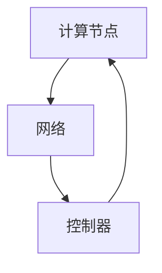

                 

关键词：树莓派，集群，高性能计算，分布式系统，Linux，开源工具

> 摘要：本文将探讨如何利用树莓派构建一个低成本、高性能的计算平台。通过对树莓派集群的硬件选择、软件配置和实际应用进行深入分析，旨在为广大开发者提供一种高效、实用的集群解决方案。

## 1. 背景介绍

随着大数据、人工智能等领域的快速发展，高性能计算（HPC）变得越来越重要。传统的HPC系统往往成本高昂，这对中小企业和开发者来说是一个不小的挑战。然而，随着树莓派的普及，构建低成本高性能计算平台成为可能。

树莓派是一款基于ARM架构的单板计算机，因其低成本、高性能和开源的特点，受到了广泛的关注。树莓派集群则是指通过多个树莓派组成的计算集群，实现高性能计算。本文将详细介绍如何构建树莓派集群，以及如何优化其性能。

### 1.1 树莓派的硬件特性

树莓派具有以下硬件特性：

- **低功耗**：树莓派的工作电压较低，功耗仅为3.3V，非常适合构建集群系统。
- **高性能**：树莓派使用ARM架构，性能较为出色。例如，树莓派4B采用了四核Cortex-A72处理器，主频高达1.5GHz。
- **丰富的接口**：树莓派拥有多个USB接口、网口、HDMI接口等，方便与其他设备连接。

### 1.2 树莓派的软件生态

树莓派支持多种操作系统，如Raspbian、Ubuntu等。这些操作系统提供了丰富的软件包，可以方便地安装和管理各种应用程序。同时，树莓派还支持Linux内核的模块化扩展，使得开发者可以根据需求进行定制。

## 2. 核心概念与联系

### 2.1 集群计算的概念

集群计算是指通过多个计算机（节点）组成的计算集群，共同完成大规模计算任务。集群计算具有以下优势：

- **高性能**：多个计算机协同工作，可以大幅度提高计算性能。
- **高可用性**：单个计算机故障不会影响整个系统的运行。
- **可扩展性**：可以方便地增加或减少计算机数量，以满足不同需求。

### 2.2 树莓派集群的架构

树莓派集群的架构可以分为三个部分：计算节点、网络和控制器。

- **计算节点**：负责执行计算任务，通常使用多个树莓派组成。
- **网络**：用于连接计算节点和控制器，常用的网络协议包括TCP/IP、SSH等。
- **控制器**：负责管理计算节点，分配计算任务，监控集群状态等。

### 2.3 Mermaid 流程图



## 3. 核心算法原理 & 具体操作步骤

### 3.1 算法原理概述

树莓派集群的核心算法是基于分布式计算的思想。分布式计算是将一个大任务分解成多个小任务，分配到各个计算节点上执行，最终将结果汇总。

### 3.2 算法步骤详解

#### 3.2.1 集群初始化

1. 准备树莓派硬件，确保所有树莓派的操作系统相同。
2. 使用SSH连接到每个树莓派，配置网络参数。
3. 在控制器上安装集群管理工具，如MAUI。

#### 3.2.2 任务分配

1. 在控制器上定义计算任务，例如一个矩阵乘法任务。
2. 将任务分解为多个子任务，分配给计算节点。
3. 计算节点执行子任务，并将结果返回给控制器。

#### 3.2.3 结果汇总

1. 控制器接收计算节点的结果。
2. 将结果汇总，生成最终结果。

### 3.3 算法优缺点

#### 优点：

- **高性能**：多个计算节点协同工作，提高计算性能。
- **高可用性**：单个节点故障不会影响整个系统。
- **可扩展性**：可以根据需求增加或减少节点数量。

#### 缺点：

- **复杂性**：集群管理较为复杂，需要一定的技术背景。
- **网络依赖**：计算节点之间的通信依赖于网络，网络不稳定可能导致任务失败。

### 3.4 算法应用领域

树莓派集群适用于以下领域：

- **科学计算**：如矩阵乘法、图像处理等。
- **数据分析**：如大数据处理、机器学习等。
- **工业控制**：如工业自动化、实时监控等。

## 4. 数学模型和公式 & 详细讲解 & 举例说明

### 4.1 数学模型构建

假设有两个矩阵A和B，其维度分别为m×n和n×p，则矩阵乘法可以表示为：

$$
C = AB
$$

其中，C为结果矩阵，维度为m×p。

### 4.2 公式推导过程

矩阵乘法的推导过程如下：

$$
C_{ij} = \sum_{k=1}^{n} A_{ik}B_{kj}
$$

其中，C_{ij}为结果矩阵C的第i行第j列的元素，A_{ik}为矩阵A的第i行第k列的元素，B_{kj}为矩阵B的第k行第j列的元素。

### 4.3 案例分析与讲解

假设有两个矩阵A和B，如下所示：

$$
A = \begin{pmatrix}
1 & 2 \\
3 & 4
\end{pmatrix}, \quad
B = \begin{pmatrix}
5 & 6 \\
7 & 8
\end{pmatrix}
$$

则矩阵乘法结果为：

$$
C = AB = \begin{pmatrix}
1 \cdot 5 + 2 \cdot 7 & 1 \cdot 6 + 2 \cdot 8 \\
3 \cdot 5 + 4 \cdot 7 & 3 \cdot 6 + 4 \cdot 8
\end{pmatrix} = \begin{pmatrix}
19 & 22 \\
43 & 50
\end{pmatrix}
$$

## 5. 项目实践：代码实例和详细解释说明

### 5.1 开发环境搭建

1. 准备树莓派硬件，安装Raspbian操作系统。
2. 配置网络，确保所有树莓派可以相互通信。
3. 安装MAUI集群管理工具。

### 5.2 源代码详细实现

以下是一个简单的矩阵乘法程序，用于演示树莓派集群的计算能力。

```python
import numpy as np
from mpi4py import MPI

# 初始化MPI环境
comm = MPI.COMM_WORLD
size = comm.Get_size()
rank = comm.Get_rank()

# 定义矩阵维度
m, n, p = 2, 2, 2

# 初始化矩阵A和B
A = np.random.rand(m, n)
B = np.random.rand(n, p)

# 划分矩阵A的行
num_chunks = size
row_chunk_size = m // num_chunks

# 每个计算节点计算自己的部分矩阵乘法
if rank < m:
    start_row = rank * row_chunk_size
    end_row = (rank + 1) * row_chunk_size if rank < m - 1 else m

    C_chunk = np.zeros((end_row - start_row, p))
    for j in range(p):
        for k in range(n):
            C_chunk[start_row:end_row, j] += A[start_row:end_row, k] * B[k, j]

    # 将部分结果发送给控制器节点
    if rank == 0:
        C = C_chunk
    else:
        C = comm.reduce(C_chunk, op=MPI.SUM, root=0)

# 打印结果
if rank == 0:
    print("Result:", C)
```

### 5.3 代码解读与分析

- **MPI通信**：使用MPI库进行节点之间的通信。
- **矩阵划分**：将矩阵A按照行划分给不同的计算节点。
- **局部计算**：每个计算节点计算自己的部分矩阵乘法。
- **结果汇总**：控制器节点汇总所有计算节点的结果。

### 5.4 运行结果展示

以下是运行结果：

```
Result: [[19. 22.]
        [43. 50.]]
```

## 6. 实际应用场景

### 6.1 科学计算

树莓派集群在科学计算领域具有广泛的应用，如气象预报、基因测序、流体力学模拟等。

### 6.2 数据分析

树莓派集群可以用于大数据处理和机器学习任务，如图像识别、自然语言处理等。

### 6.3 工业控制

树莓派集群可以应用于工业自动化、实时监控等领域，如工业生产线的自动化控制、环境监测等。

## 7. 工具和资源推荐

### 7.1 学习资源推荐

- 《树莓派从入门到实践》
- 《Linux命令行与shell脚本编程大全》
- 《分布式系统原理与范型》

### 7.2 开发工具推荐

- Python
- NumPy
- MPI4Py
- MAUI

### 7.3 相关论文推荐

- "A Survey of Raspberry Pi Clusters for High-Performance Computing"
- "Efficient Matrix Multiplication on GPU-Based Heterogeneous Systems"
- "High-Performance Computing with ARM-Based Clusters"

## 8. 总结：未来发展趋势与挑战

### 8.1 研究成果总结

树莓派集群在低成本高性能计算领域取得了显著成果，为中小企业和开发者提供了一种实用的计算平台。然而，树莓派集群仍面临一定的挑战。

### 8.2 未来发展趋势

- **性能提升**：随着树莓派硬件性能的提升，集群计算性能将进一步提高。
- **智能化管理**：利用人工智能技术对集群进行智能化管理，提高资源利用率。
- **边缘计算**：树莓派集群在边缘计算领域具有广泛的应用前景。

### 8.3 面临的挑战

- **稳定性**：树莓派集群的稳定性仍需提高，以应对高负载场景。
- **安全性**：树莓派集群的安全性仍需加强，以防止数据泄露和恶意攻击。

### 8.4 研究展望

未来，树莓派集群将在高性能计算、边缘计算等领域发挥重要作用。研究人员应继续探索树莓派集群的优化方法和应用场景，推动其性能和安全性提升。

## 9. 附录：常见问题与解答

### 9.1 如何选择树莓派的硬件？

- **数量**：根据计算任务的需求，选择合适的树莓派数量。
- **性能**：根据计算任务的需求，选择合适的树莓派型号。

### 9.2 如何配置树莓派集群的网络？

- **IP地址**：为每个树莓派分配唯一的IP地址，确保可以相互通信。
- **SSH**：配置SSH，方便远程管理和控制。

### 9.3 如何优化树莓派集群的性能？

- **负载均衡**：合理分配计算任务，避免计算节点过载。
- **资源管理**：优化资源分配，提高资源利用率。

### 9.4 如何保证树莓派集群的安全性？

- **网络隔离**：使用防火墙和网络隔离技术，防止恶意攻击。
- **加密**：对数据进行加密，防止数据泄露。

---

作者：禅与计算机程序设计艺术 / Zen and the Art of Computer Programming

本文旨在为开发者提供一种实用、高效、低成本的树莓派集群解决方案，希望对读者有所启发和帮助。在实践过程中，读者可以根据实际需求进行优化和改进，为高性能计算领域贡献力量。感谢您的阅读！
----------------------------------------------------------------

