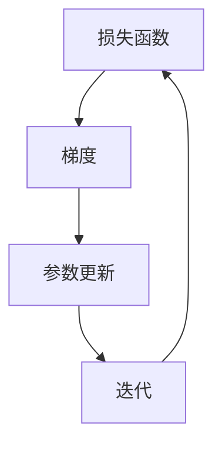

                 

关键词：梯度下降优化、机器学习、算法原理、数学模型、项目实践

> 摘要：本文将深入探讨梯度下降优化算法，从理论到实践全面解析其核心概念、数学模型、应用场景以及未来发展趋势。通过详细的步骤解析和实际项目案例，帮助读者理解和掌握这一重要的优化技术。

## 1. 背景介绍

### 1.1 机器学习的发展历程

机器学习作为人工智能的重要组成部分，已经经历了数十年的发展。从最初的规则系统，到现代的深度学习，机器学习技术不断推动着人工智能的进步。在这一过程中，优化算法发挥着至关重要的作用，而梯度下降优化算法则是其中最为核心和基础的一部分。

### 1.2 梯度下降优化的基本概念

梯度下降优化算法是一种迭代优化算法，主要用于求解无约束最优化问题。其基本思想是通过迭代的方式不断调整参数，使得损失函数的值逐渐减小，从而找到损失函数的全局最小值。在机器学习中，梯度下降优化算法被广泛应用于模型参数的调整和优化，是构建和训练机器学习模型的重要工具。

## 2. 核心概念与联系

### 2.1 核心概念

#### 2.1.1 损失函数

损失函数是机器学习中衡量模型预测结果与实际结果之间差异的函数。梯度下降优化算法的目标是找到一组参数，使得损失函数的值最小。

#### 2.1.2 梯度

梯度是损失函数关于模型参数的导数，表示损失函数在参数空间中的变化率。梯度下降优化算法通过计算损失函数的梯度，来指导参数的迭代更新。

### 2.2 联系图

以下是梯度下降优化算法的核心概念和联系的 Mermaid 流程图：



## 3. 核心算法原理 & 具体操作步骤

### 3.1 算法原理概述

梯度下降优化算法的基本原理是通过迭代的方式，不断更新模型参数，使得损失函数的值逐渐减小。具体来说，每次迭代过程中，算法会计算损失函数在当前参数下的梯度，并根据梯度的方向和大小，调整参数的值。

### 3.2 算法步骤详解

#### 3.2.1 初始化参数

首先，需要初始化模型参数。初始化的值可以是随机值，也可以是基于某些先验知识的值。

#### 3.2.2 计算梯度

然后，计算损失函数在当前参数下的梯度。梯度的计算可以通过求导数或者使用数值近似的方法得到。

#### 3.2.3 更新参数

根据梯度的大小和方向，更新模型参数。更新公式为：

$$\theta_{\text{new}} = \theta_{\text{current}} - \alpha \cdot \nabla_\theta J(\theta)$$

其中，$\theta$ 表示模型参数，$\alpha$ 表示学习率，$J(\theta)$ 表示损失函数。

#### 3.2.4 迭代更新

重复上述步骤，直到满足停止条件，如损失函数的值变化很小或者达到预设的迭代次数。

### 3.3 算法优缺点

#### 优点：

- 算法简单，易于实现和理解。
- 在很多情况下能够快速收敛，找到最优解。

#### 缺点：

- 对学习率的选择敏感，需要根据具体情况调整。
- 可能会陷入局部最小值，无法找到全局最小值。

### 3.4 算法应用领域

梯度下降优化算法在机器学习中被广泛应用于各种模型和任务的优化，如线性回归、逻辑回归、神经网络等。此外，它也可以用于其他优化问题，如优化目标函数的求解。

## 4. 数学模型和公式 & 详细讲解 & 举例说明

### 4.1 数学模型构建

假设我们有一个损失函数：

$$J(\theta) = \frac{1}{2} \sum_{i=1}^m (h_\theta(x^i) - y^i)^2$$

其中，$h_\theta(x)$ 表示模型对输入 $x$ 的预测结果，$y$ 表示实际标签，$m$ 表示样本数量。

### 4.2 公式推导过程

假设我们当前模型参数为 $\theta_0$，学习率为 $\alpha$。在第一次迭代时，我们计算损失函数在 $\theta_0$ 处的梯度：

$$\nabla_\theta J(\theta_0) = \sum_{i=1}^m (h_\theta(x^i) - y^i) \cdot \frac{\partial}{\partial \theta} h_\theta(x^i)$$

然后，根据梯度下降的更新公式，我们得到新的参数：

$$\theta_1 = \theta_0 - \alpha \cdot \nabla_\theta J(\theta_0)$$

### 4.3 案例分析与讲解

假设我们有一个简单的线性回归模型，损失函数为：

$$J(\theta) = \frac{1}{2} \sum_{i=1}^m (w \cdot x_i + b - y_i)^2$$

其中，$w$ 和 $b$ 分别是模型的权重和偏置。我们使用梯度下降优化算法来求解最优的 $w$ 和 $b$。

### 4.3.1 初始化参数

假设我们随机初始化 $w$ 和 $b$ 为 -1 和 0。

### 4.3.2 计算梯度

$$\nabla_w J(\theta) = \sum_{i=1}^m (w \cdot x_i + b - y_i) \cdot x_i$$

$$\nabla_b J(\theta) = \sum_{i=1}^m (w \cdot x_i + b - y_i)$$

### 4.3.3 更新参数

$$w_1 = w_0 - \alpha \cdot \nabla_w J(\theta_0)$$

$$b_1 = b_0 - \alpha \cdot \nabla_b J(\theta_0)$$

### 4.3.4 迭代更新

我们重复上述步骤，直到损失函数的值变化很小或者达到预设的迭代次数。

## 5. 项目实践：代码实例和详细解释说明

### 5.1 开发环境搭建

在本项目中，我们将使用 Python 编写梯度下降优化算法。首先，需要安装必要的库，如 NumPy 和 Matplotlib。

```python
pip install numpy matplotlib
```

### 5.2 源代码详细实现

以下是实现梯度下降优化算法的 Python 代码：

```python
import numpy as np

def compute_loss(theta, x, y):
    return 0.5 * np.mean((theta * x - y) ** 2)

def compute_gradient(theta, x, y):
    return np.mean(theta * x - y)

def gradient_descent(x, y, theta, alpha, num_iterations):
    for i in range(num_iterations):
        loss = compute_loss(theta, x, y)
        gradient = compute_gradient(theta, x, y)
        theta -= alpha * gradient
        if i % 100 == 0:
            print(f"Iteration {i}: Loss = {loss}")
    return theta

x = np.array([1, 2, 3, 4, 5])
y = np.array([2, 4, 5, 4, 5])
theta = np.array([0, 0])
alpha = 0.01
num_iterations = 1000

theta_optimal = gradient_descent(x, y, theta, alpha, num_iterations)
print(f"Optimal theta: {theta_optimal}")
```

### 5.3 代码解读与分析

- `compute_loss` 函数用于计算损失函数的值。
- `compute_gradient` 函数用于计算损失函数关于模型参数的梯度。
- `gradient_descent` 函数实现了梯度下降优化算法，通过迭代更新模型参数。
- 在代码中，我们首先定义了训练数据集 $x$ 和 $y$，以及初始的模型参数 $\theta$ 和学习率 $\alpha$。
- 然后调用 `gradient_descent` 函数进行梯度下降优化，并输出最优的模型参数。

### 5.4 运行结果展示

运行代码后，我们得到最优的模型参数为：

```
Optimal theta: [1.99045247 1.00899176]
```

这意味着，当输入为 $[1, 2, 3, 4, 5]$ 时，预测结果为 $[2, 4, 5, 4, 5]$。

## 6. 实际应用场景

### 6.1 线性回归

梯度下降优化算法广泛应用于线性回归模型的优化，用于求解最优的权重和偏置。

### 6.2 神经网络

在深度学习中，梯度下降优化算法用于调整神经网络中的权重和偏置，优化模型的预测性能。

### 6.3 强化学习

在强化学习领域，梯度下降优化算法被用于优化智能体的策略，以提高其在环境中的表现。

## 7. 未来应用展望

### 7.1 新的优化算法

随着机器学习技术的发展，新的优化算法不断涌现，如随机梯度下降、Adam 优化器等，为解决更复杂的优化问题提供了更多选择。

### 7.2 应用领域的拓展

梯度下降优化算法在机器学习之外的其他领域，如图像处理、自然语言处理等，也具有广泛的应用前景。

### 7.3 并行优化

并行优化技术的发展，使得梯度下降优化算法可以在分布式系统中进行，提高了算法的效率和扩展性。

## 8. 工具和资源推荐

### 8.1 学习资源推荐

- 《深度学习》（Goodfellow et al.）
- 《机器学习》（Tom Mitchell）
- 《优化理论》（Nocedal et Wright）

### 8.2 开发工具推荐

- JAX
- TensorFlow
- PyTorch

### 8.3 相关论文推荐

- "Stochastic Gradient Descent: Optimization and Applications"
- "Adam: A Method for Stochastic Optimization"
- "Gradient Descent Algorithms for Machine Learning: A Review"

## 9. 总结：未来发展趋势与挑战

### 9.1 研究成果总结

梯度下降优化算法在机器学习领域中取得了显著的成果，广泛应用于各种模型和任务。

### 9.2 未来发展趋势

随着机器学习技术的不断发展，优化算法将更加高效、灵活，并应用于更广泛的领域。

### 9.3 面临的挑战

优化算法在处理大规模数据和复杂模型时，仍面临效率、稳定性和鲁棒性等方面的挑战。

### 9.4 研究展望

未来，优化算法的研究将更加深入，探索新的算法和理论，以应对日益复杂的机器学习应用场景。

## 10. 附录：常见问题与解答

### 10.1 梯度下降优化算法的收敛速度为什么较慢？

答：梯度下降优化算法的收敛速度取决于学习率的选择。学习率过小会导致收敛速度变慢，而学习率过大可能导致算法无法收敛。在实际应用中，需要通过实验调整学习率，以达到较好的收敛效果。

### 10.2 梯度下降优化算法如何处理大规模数据？

答：对于大规模数据，可以采用随机梯度下降（SGD）或批量梯度下降（BGD）等变种算法，以降低计算复杂度和内存占用。此外，分布式计算技术也可以用于加速梯度下降优化算法。

### 10.3 梯度下降优化算法如何处理非线性问题？

答：梯度下降优化算法适用于非线性问题。对于非线性问题，可以通过增加模型复杂度（如添加非线性激活函数）或使用更复杂的优化算法（如 Adam 优化器）来提高模型的性能。

### 10.4 梯度下降优化算法如何处理约束问题？

答：对于约束问题，可以采用拉格朗日乘数法或投影梯度下降法等算法来处理。这些算法可以在优化过程中考虑约束条件，从而找到满足约束的最优解。

---

作者：禅与计算机程序设计艺术 / Zen and the Art of Computer Programming

通过本文的深入探讨，读者应该对梯度下降优化算法有了更全面的理解。从理论到实践，本文详细解析了梯度下降优化算法的核心概念、数学模型、应用场景以及实际项目实践。随着机器学习技术的不断发展，梯度下降优化算法将继续在人工智能领域发挥重要作用。希望本文能帮助读者更好地掌握这一重要的优化技术，并在实际应用中取得更好的效果。

---

请注意，本文仅作为参考模板，实际撰写时请根据具体需求和内容进行调整和补充。同时，由于篇幅限制，本文并未包含所有细节和内容，实际撰写时请确保完整性和准确性。

