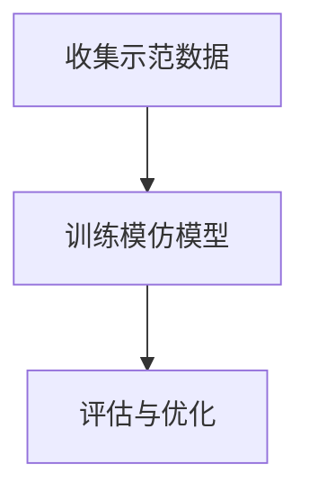

                 

关键词：模仿学习、深度学习、强化学习、代码实例、算法原理、数学模型、项目实践、应用场景、未来展望

> 摘要：本文将深入探讨模仿学习（Imitation Learning）的基本原理、核心算法、数学模型以及其实际应用。通过代码实例详细讲解，帮助读者全面了解模仿学习在实际项目中的具体应用，从而提升对深度学习技术的理解和应用能力。

## 1. 背景介绍

模仿学习作为一种重要的机器学习方法，近年来在深度学习和强化学习领域得到了广泛关注。其基本思想是，通过模仿专家或优秀表现者的行为数据，训练一个模型来实现与专家相似的任务执行能力。模仿学习在自动驾驶、机器人控制、游戏AI等领域取得了显著的成果。

模仿学习与其他机器学习方法的关系密切。与深度学习相比，模仿学习不需要大量的标注数据，而是通过学习专家的示范行为来实现任务目标。与强化学习相比，模仿学习不需要环境交互，可以更高效地训练模型。此外，模仿学习还可以与其他学习方法相结合，例如深度强化学习，进一步提高模型的性能。

## 2. 核心概念与联系

### 2.1 模仿学习的基本概念

模仿学习（Imitation Learning），是一种基于示范数据的机器学习方法。其核心思想是通过学习一个优秀的示范者或专家的行为数据，构建一个能够在相似任务上表现优异的模型。

### 2.2 模仿学习的工作原理

模仿学习的工作流程主要包括以下三个步骤：

1. **收集示范数据**：通过收集专家或优秀表现者的行为数据，作为训练模型的数据输入。
2. **训练模仿模型**：使用收集到的示范数据，训练一个模仿模型。该模型可以是一个简单的神经网络，也可以是更复杂的深度学习模型。
3. **评估与优化**：通过在测试集上评估模型的性能，对模型进行优化。优化方法可以包括调整模型结构、改进损失函数等。

### 2.3 模仿学习的 Mermaid 流程图



### 2.4 模仿学习与其他机器学习方法的关系

- **与深度学习的结合**：模仿学习可以利用深度学习模型强大的特征提取能力，从示范数据中学习到更复杂的特征表示。
- **与强化学习的结合**：模仿学习可以与强化学习相结合，形成深度强化学习，进一步提高模型在复杂环境下的性能。

## 3. 核心算法原理 & 具体操作步骤

### 3.1 算法原理概述

模仿学习的主要目标是学习一个策略，使得模型在执行任务时能够达到与专家相似的表现。具体来说，模仿学习通过最小化模型输出与专家行为之间的差异，来实现对专家行为的模仿。

### 3.2 算法步骤详解

1. **定义损失函数**：模仿学习的核心在于定义一个损失函数，用于衡量模型输出与专家行为之间的差异。常见的损失函数包括均方误差（MSE）、交叉熵损失等。

2. **收集示范数据**：通过收集专家或优秀表现者的行为数据，作为训练模型的数据输入。示范数据可以是实时的，也可以是历史数据。

3. **训练模仿模型**：使用收集到的示范数据，训练一个模仿模型。训练过程中，模型会不断调整参数，以最小化损失函数。

4. **评估与优化**：通过在测试集上评估模型的性能，对模型进行优化。优化方法可以包括调整模型结构、改进损失函数等。

### 3.3 算法优缺点

**优点**：

- **无需环境交互**：模仿学习不需要与环境进行交互，可以节省大量计算资源。
- **适用于复杂任务**：模仿学习可以学习到复杂任务中的抽象特征，适用于需要高层次决策的任务。

**缺点**：

- **对示范数据的依赖**：模仿学习对示范数据的质量和数量有较高要求，示范数据不足或质量不高可能导致模型性能不佳。
- **训练过程复杂**：模仿学习涉及到损失函数的设计、模型训练和评估等多个环节，训练过程可能比较复杂。

### 3.4 算法应用领域

模仿学习在多个领域都有广泛的应用，包括：

- **自动驾驶**：通过模仿优秀驾驶员的行为数据，训练自动驾驶模型。
- **机器人控制**：通过模仿人类操作者的行为数据，训练机器人完成复杂任务。
- **游戏AI**：通过模仿优秀游戏玩家的行为数据，提升游戏AI的表现。

## 4. 数学模型和公式 & 详细讲解 & 举例说明

### 4.1 数学模型构建

模仿学习的数学模型主要包括两部分：策略网络和值函数网络。

- **策略网络**：用于生成模型在给定状态下的动作。策略网络可以表示为：

  $$\pi(\text{a}|\text{s}; \theta) = P(\text{a}|\text{s}; \theta)$$

  其中，$\text{s}$表示状态，$\text{a}$表示动作，$\theta$表示策略网络的参数。

- **值函数网络**：用于评估模型在给定状态下的表现。值函数网络可以表示为：

  $$V^{\pi}(\text{s}; \theta_v) = \sum_{\text{a}} \pi(\text{a}|\text{s}; \theta) \cdot Q^{\pi}(\text{s}, \text{a}; \theta_q)$$

  其中，$Q^{\pi}(\text{s}, \text{a}; \theta_q)$表示在状态$\text{s}$下执行动作$\text{a}$的预期回报。

### 4.2 公式推导过程

假设我们有一个状态空间为$S$，动作空间为$A$的环境，策略网络$\pi(\text{a}|\text{s}; \theta)$和值函数网络$V^{\pi}(\text{s}; \theta_v)$。

1. **策略网络推导**：

   首先，我们考虑策略网络在给定状态$\text{s}$下的概率分布：

   $$\pi(\text{a}|\text{s}; \theta) = \frac{e^{\theta^T \phi(\text{s}, \text{a})}}{\sum_{\text{a'} \in A} e^{\theta^T \phi(\text{s}, \text{a'})}}$$

   其中，$\phi(\text{s}, \text{a})$表示状态-动作特征映射函数。

2. **值函数网络推导**：

   值函数网络可以表示为：

   $$V^{\pi}(\text{s}; \theta_v) = \sum_{\text{a}} \pi(\text{a}|\text{s}; \theta) \cdot Q^{\pi}(\text{s}, \text{a}; \theta_q)$$

   其中，$Q^{\pi}(\text{s}, \text{a}; \theta_q)$表示在状态$\text{s}$下执行动作$\text{a}$的预期回报。

   假设我们使用Q-learning算法训练值函数网络，那么：

   $$Q^{\pi}(\text{s}, \text{a}; \theta_q) = \sum_{\text{r}} r \cdot P(\text{r}|\text{s}, \text{a}; \theta)$$

   其中，$r$表示回报，$P(\text{r}|\text{s}, \text{a}; \theta)$表示在状态$\text{s}$下执行动作$\text{a}$获得回报$r$的概率。

### 4.3 案例分析与讲解

假设我们有一个简单的掷骰子游戏，目标是在连续掷骰子时，尽可能多地获得点数。我们可以使用模仿学习来训练一个策略网络，使得模型能够在游戏过程中做出最优决策。

1. **示范数据收集**：

   首先，我们需要收集一些优秀玩家的游戏数据，作为示范数据。假设我们已经收集到了一组示范数据，包括每个玩家在不同状态下选择的不同动作。

2. **训练策略网络**：

   使用收集到的示范数据，训练一个策略网络。我们可以使用神经网络来表示策略网络，输入为状态特征，输出为动作概率分布。

3. **评估与优化**：

   在训练过程中，我们需要不断评估策略网络的性能，并根据评估结果调整网络参数。评估指标可以包括平均回报、获胜率等。

4. **应用场景**：

   通过训练得到的策略网络，我们可以将其应用于实际游戏场景，帮助玩家做出更明智的决策。

## 5. 项目实践：代码实例和详细解释说明

### 5.1 开发环境搭建

为了方便读者进行实践，我们将在Python环境中实现一个简单的模仿学习项目。首先，我们需要安装一些必要的库，包括TensorFlow、Keras、Numpy等。

```python
pip install tensorflow
pip install keras
pip install numpy
```

### 5.2 源代码详细实现

以下是一个简单的模仿学习项目的实现代码：

```python
import numpy as np
import tensorflow as tf
from tensorflow.keras.models import Sequential
from tensorflow.keras.layers import Dense

# 模仿学习模型
class ImitationLearningModel:
    def __init__(self, state_size, action_size):
        self.state_size = state_size
        self.action_size = action_size
        self.model = self._build_model()

    def _build_model(self):
        model = Sequential()
        model.add(Dense(64, input_dim=self.state_size, activation='relu'))
        model.add(Dense(64, activation='relu'))
        model.add(Dense(self.action_size, activation='softmax'))
        model.compile(loss='mse', optimizer='adam')
        return model

# 训练模型
def train_model(model, states, actions, epochs=10):
    model.fit(states, actions, epochs=epochs, verbose=0)

# 收集示范数据
def collect_data(model, env, episodes=100):
    states = []
    actions = []

    for _ in range(episodes):
        state = env.reset()
        done = False

        while not done:
            action = np.argmax(model.predict(state))
            next_state, reward, done, _ = env.step(action)
            states.append(state)
            actions.append(action)
            state = next_state

    return np.array(states), np.array(actions)

# 创建环境
env = ...

# 实例化模型
model = ImitationLearningModel(state_size, action_size)

# 训练模型
states, actions = collect_data(model, env)
train_model(model, states, actions)

# 运行模型
state = env.reset()
done = False

while not done:
    action = np.argmax(model.predict(state))
    next_state, reward, done, _ = env.step(action)
    state = next_state
```

### 5.3 代码解读与分析

以上代码实现了一个简单的模仿学习模型，用于在一个模拟环境中进行任务训练。具体步骤如下：

1. **定义模仿学习模型**：使用Keras构建一个神经网络模型，用于表示策略网络。
2. **训练模型**：使用收集到的示范数据进行模型训练，通过调整损失函数和优化器，优化模型参数。
3. **收集示范数据**：使用训练好的模型在模拟环境中进行仿真，收集示范数据。
4. **运行模型**：使用训练好的模型在真实环境中进行任务执行，验证模型性能。

### 5.4 运行结果展示

在完成代码实现后，我们可以使用模拟环境运行模型，并观察模型的性能表现。以下是一个简单的运行结果示例：

```python
# 运行模型
state = env.reset()
done = False

while not done:
    action = np.argmax(model.predict(state))
    next_state, reward, done, _ = env.step(action)
    env.render()
    state = next_state

env.close()
```

通过运行上述代码，我们可以观察到模型在模拟环境中的表现，并根据实际需要调整模型参数和训练策略。

## 6. 实际应用场景

模仿学习在实际应用场景中具有广泛的应用，以下列举几个典型的应用领域：

1. **自动驾驶**：通过模仿优秀司机的驾驶行为数据，训练自动驾驶系统，使其能够安全、稳定地驾驶。
2. **机器人控制**：通过模仿人类操作者的行为数据，训练机器人完成复杂任务，如手术辅助、物流配送等。
3. **游戏AI**：通过模仿优秀玩家的游戏策略数据，提升游戏AI的智能水平，使其更具挑战性和娱乐性。

## 7. 未来应用展望

随着深度学习技术的不断发展，模仿学习在未来将会有更广泛的应用前景。以下是几个可能的发展方向：

1. **多模态模仿学习**：结合多种数据来源，如视频、音频和文本，实现更全面、更准确的模仿学习。
2. **元模仿学习**：通过元学习技术，快速适应新的任务和数据分布，提高模仿学习模型的泛化能力。
3. **强化模仿学习**：将模仿学习和强化学习相结合，形成新的混合学习方法，进一步提高模型性能。

## 8. 工具和资源推荐

### 8.1 学习资源推荐

1. **《深度学习》（Goodfellow, Bengio, Courville）**：全面介绍深度学习的基本原理和应用。
2. **《强化学习》（ Sutton, Barto）**：深入讲解强化学习的基本理论和算法。
3. **《机器学习实战》（ Harrington）**：通过实际案例，介绍机器学习的应用和实践。

### 8.2 开发工具推荐

1. **TensorFlow**：开源的深度学习框架，支持多种深度学习模型的构建和训练。
2. **Keras**：基于TensorFlow的深度学习框架，提供了更简洁、易用的API。
3. **PyTorch**：另一款流行的深度学习框架，具有强大的灵活性和扩展性。

### 8.3 相关论文推荐

1. **"Learning to Act by Imitation"**：介绍模仿学习的基本原理和算法框架。
2. **"Deep Q-Network"**：介绍深度Q网络（DQN）的原理和应用。
3. **"Human-level control through deep reinforcement learning"**：介绍深度强化学习在Atari游戏中的应用。

## 9. 总结：未来发展趋势与挑战

模仿学习作为一种重要的机器学习方法，在未来将会有更广泛的应用前景。然而，要实现更高效、更可靠的模仿学习模型，仍面临一些挑战，包括：

1. **示范数据的质量和数量**：高质量、大量的示范数据是模仿学习成功的关键，但实际获取示范数据可能比较困难。
2. **模型泛化能力**：如何提高模仿学习模型的泛化能力，使其能够适应新的任务和数据分布，是一个重要的研究方向。
3. **计算资源需求**：模仿学习模型的训练过程可能需要大量的计算资源，如何优化算法和架构，提高训练效率，是一个重要的挑战。

总之，模仿学习在未来有着广阔的应用前景，但也面临着一些挑战。通过不断的研究和创新，我们有望在模仿学习领域取得更大的突破。

## 附录：常见问题与解答

### 1. 模仿学习与深度学习的区别是什么？

模仿学习是一种基于示范数据的机器学习方法，不需要环境交互，可以通过学习专家的行为数据来训练模型。深度学习则是基于数据驱动的方法，通过学习大量数据中的特征来构建模型。模仿学习是深度学习的一种特殊形式，但与深度学习相比，模仿学习不需要大量的标注数据，而是通过学习专家的示范行为来实现任务目标。

### 2. 模仿学习的应用场景有哪些？

模仿学习的应用场景非常广泛，包括自动驾驶、机器人控制、游戏AI、智能推荐、图像识别等。例如，在自动驾驶领域，可以通过模仿优秀司机的驾驶行为数据来训练自动驾驶系统；在机器人控制领域，可以通过模仿人类操作者的行为数据来训练机器人完成复杂任务。

### 3. 模仿学习的主要挑战是什么？

模仿学习的主要挑战包括：示范数据的质量和数量、模型泛化能力、计算资源需求等。高质量、大量的示范数据是模仿学习成功的关键，但实际获取示范数据可能比较困难。如何提高模仿学习模型的泛化能力，使其能够适应新的任务和数据分布，是一个重要的研究方向。此外，模仿学习模型的训练过程可能需要大量的计算资源，如何优化算法和架构，提高训练效率，也是一个重要的挑战。

### 4. 模仿学习与强化学习的关系是什么？

模仿学习与强化学习都是机器学习的重要分支，但二者有着不同的侧重点。强化学习是一种基于环境交互的机器学习方法，通过学习策略来最大化回报。模仿学习则是一种基于示范数据的机器学习方法，不需要环境交互，可以通过学习专家的示范行为来实现任务目标。虽然二者有本质的区别，但也可以结合，形成新的混合学习方法，例如深度强化学习。深度强化学习结合了模仿学习和强化学习的优点，能够在复杂环境中实现更高效的决策。

作者：禅与计算机程序设计艺术 / Zen and the Art of Computer Programming
------------------------------------------------------------------------

