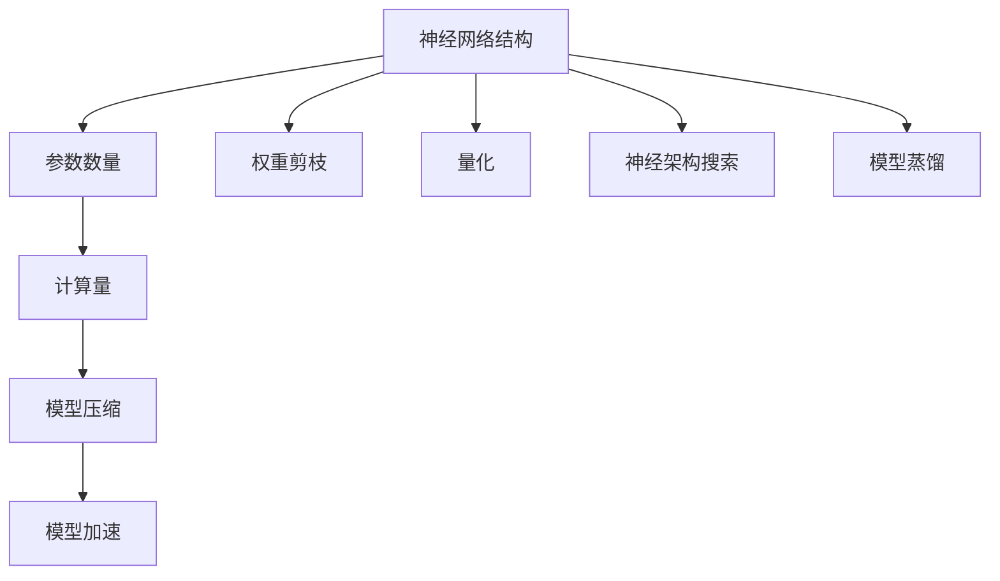
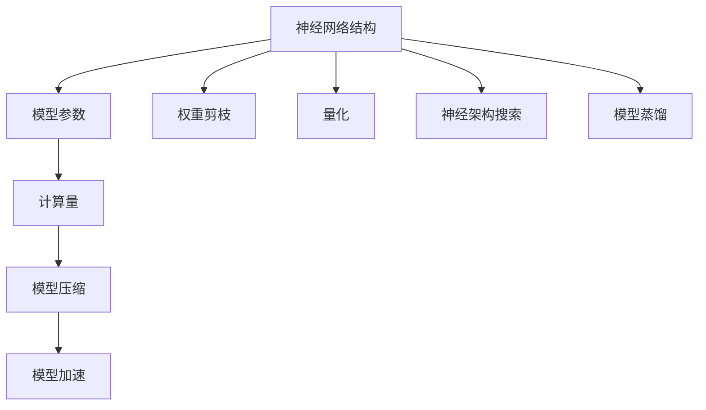

                 

关键词：模型压缩，深度学习，神经架构搜索，模型优化，性能提升，代码实战

摘要：本文将深入探讨模型压缩与加速的核心原理，以及如何在实际项目中应用这些技术。我们将从背景介绍入手，详细讲解核心概念、算法原理、数学模型，并通过实际代码实例进行实战演示，最后探讨该领域的发展趋势与挑战。

## 1. 背景介绍

随着深度学习技术的快速发展，神经网络模型的复杂度和计算量不断攀升。然而，过大的模型不仅消耗大量的计算资源，还限制了其应用范围。因此，模型压缩与加速技术应运而生，旨在在不显著牺牲模型性能的前提下，减小模型的规模和加速模型的推理速度。

模型压缩主要包括以下几个方向：

1. **权重剪枝**：通过移除模型中不重要的权重来减少模型参数。
2. **量化**：将模型权重和激活值从浮点数转换为低精度数值，如整数或二进制数。
3. **神经网络架构搜索**（NAS）：自动搜索最优的神经网络结构。
4. **模型蒸馏**：使用一个大模型（教师模型）训练一个小模型（学生模型）。

## 2. 核心概念与联系

在讨论模型压缩与加速之前，我们需要明确几个核心概念，包括神经网络结构、参数数量、计算量等。以下是模型的 Mermaid 流程图：



### 2.1 神经网络结构

神经网络结构是指网络的层次和神经元之间的连接方式。不同的结构对于模型的性能和压缩率有显著影响。

### 2.2 参数数量

参数数量是模型压缩的一个重要指标。减少参数数量可以有效降低模型的存储需求和计算复杂度。

### 2.3 计算量

计算量是指模型在推理过程中所需的运算次数。加速技术旨在减少计算量，提高推理速度。

### 2.4 模型压缩

模型压缩技术包括权重剪枝、量化、神经架构搜索和模型蒸馏。每种技术都有其特定的应用场景和效果。

### 2.5 模型加速

模型加速技术包括使用更高效的算法、硬件加速以及并行计算等。

## 3. 核心算法原理 & 具体操作步骤

### 3.1 算法原理概述

模型压缩与加速的核心算法包括：

1. **权重剪枝**：基于敏感度分析和稀疏性分析，移除不重要的权重。
2. **量化**：通过最小化量化误差，将权重和激活值从浮点数转换为低精度数值。
3. **神经架构搜索**：使用进化算法、强化学习等方法搜索最优的网络结构。
4. **模型蒸馏**：利用教师模型的丰富知识训练学生模型。

### 3.2 算法步骤详解

1. **权重剪枝**：
    - **敏感度分析**：计算每个权重的敏感度，敏感度越低，权重越可能被剪枝。
    - **稀疏性分析**：分析网络的稀疏性，选择稀疏性较高的层进行剪枝。

2. **量化**：
    - **权重量化**：将权重从浮点数转换为整数或二进制数。
    - **激活量化**：将激活值进行量化，以减少存储需求和计算量。

3. **神经架构搜索**：
    - **搜索策略**：选择合适的搜索策略，如基于神经网络的搜索、进化算法等。
    - **评估指标**：定义评估指标，如准确率、推理速度等。

4. **模型蒸馏**：
    - **知识蒸馏**：将教师模型的知识转移到学生模型中。
    - **训练过程**：使用教师模型的输出作为软标签，训练学生模型。

### 3.3 算法优缺点

1. **权重剪枝**：
    - **优点**：可以有效减少模型参数，降低计算量。
    - **缺点**：可能引入训练误差，对模型性能有一定影响。

2. **量化**：
    - **优点**：可以显著减少模型大小和计算量。
    - **缺点**：可能引入量化误差，对模型性能有一定影响。

3. **神经架构搜索**：
    - **优点**：可以自动搜索最优的网络结构，提高模型性能。
    - **缺点**：搜索过程复杂，计算成本高。

4. **模型蒸馏**：
    - **优点**：可以有效地利用教师模型的知识，提高学生模型性能。
    - **缺点**：需要大量的计算资源。

### 3.4 算法应用领域

模型压缩与加速技术广泛应用于图像识别、语音识别、自然语言处理等领域。例如，在移动设备上部署大型神经网络模型，或者在实际应用中提高模型的推理速度。

## 4. 数学模型和公式 & 详细讲解 & 举例说明

### 4.1 数学模型构建

在模型压缩与加速中，我们常用的数学模型包括：

1. **敏感度分析**：
    $$ \text{Sensitivity} = \frac{\partial L}{\partial w} $$
    其中，\( L \) 是损失函数，\( w \) 是权重。

2. **量化误差**：
    $$ \text{Quantization Error} = \text{True Value} - \text{Quantized Value} $$

3. **神经架构搜索**：
    $$ \text{Fitness} = f(\text{Accuracy}, \text{Speed}) $$

4. **知识蒸馏**：
    $$ \text{Soft Label} = \text{Teacher Output} $$

### 4.2 公式推导过程

1. **敏感度分析**：
    通过计算损失函数关于权重的梯度，可以得到每个权重的敏感度。

2. **量化误差**：
    通过将权重从浮点数转换为整数或二进制数，可以得到量化值。量化误差是真实值与量化值之间的差距。

3. **神经架构搜索**：
    通过评估函数计算每个结构的性能，选择性能最好的结构。

4. **知识蒸馏**：
    通过教师模型的输出作为软标签，训练学生模型，以获得更好的模型性能。

### 4.3 案例分析与讲解

我们以图像识别任务为例，说明模型压缩与加速的应用。

1. **权重剪枝**：
    对模型进行敏感度分析，移除敏感度较低的权重。

2. **量化**：
    将模型的权重和激活值进行量化，以减少模型大小。

3. **神经架构搜索**：
    使用进化算法搜索最优的网络结构，提高模型性能。

4. **模型蒸馏**：
    使用一个大模型（教师模型）训练一个小模型（学生模型），提高模型性能。

## 5. 项目实践：代码实例和详细解释说明

### 5.1 开发环境搭建

在开始代码实战之前，我们需要搭建一个合适的开发环境。这里我们选择 PyTorch 作为主要框架。

1. **安装 PyTorch**：
    使用以下命令安装 PyTorch：
    ```bash
    pip install torch torchvision
    ```

2. **安装依赖库**：
    安装其他依赖库，如 NumPy、Matplotlib 等：
    ```bash
    pip install numpy matplotlib
    ```

### 5.2 源代码详细实现

以下是使用 PyTorch 实现的权重剪枝和量化的代码示例：

```python
import torch
import torch.nn as nn
import torch.optim as optim
import torchvision.transforms as transforms
import torchvision.datasets as datasets

# 定义网络结构
class CNN(nn.Module):
    def __init__(self):
        super(CNN, self).__init__()
        self.conv1 = nn.Conv2d(1, 32, 3)
        self.conv2 = nn.Conv2d(32, 64, 3)
        self.fc1 = nn.Linear(64 * 6 * 6, 10)

    def forward(self, x):
        x = self.conv1(x)
        x = F.relu(x)
        x = self.conv2(x)
        x = F.relu(x)
        x = x.view(-1, 64 * 6 * 6)
        x = self.fc1(x)
        return x

# 加载训练数据
train_loader = torch.utils.data.DataLoader(
    datasets.MNIST(root='./data', train=True, download=True,
                   transform=transforms.ToTensor()),
    batch_size=64, shuffle=True)

# 实例化模型
model = CNN()
optimizer = optim.Adam(model.parameters(), lr=0.001)
criterion = nn.CrossEntropyLoss()

# 权重剪枝
def prune_weights(model, threshold):
    for param in model.parameters():
        if param.dim() > 1:
            with torch.no_grad():
                if param.abs().mean() < threshold:
                    print(f"Pruning weight {param.size()}")
                    param.data.zero_()

# 量化模型
def quantize_model(model, bits=8):
    model = torch.quantization.quantize_dynamic(
        model, {nn.Linear, nn.Conv2d}, dtype=torch.qint8)
    model = torch.quantization.quantize_weight_only(model, dtype=torch.qint8)
    return model

# 训练模型
for epoch in range(10):
    for images, labels in train_loader:
        optimizer.zero_grad()
        outputs = model(images)
        loss = criterion(outputs, labels)
        loss.backward()
        optimizer.step()

    prune_weights(model, threshold=0.1)
    model = quantize_model(model, bits=8)

# 保存模型
torch.save(model.state_dict(), 'model_quantized.pth')
```

### 5.3 代码解读与分析

1. **模型定义**：
    使用 PyTorch 定义了一个简单的卷积神经网络。

2. **数据加载**：
    加载 MNIST 数据集并进行预处理。

3. **权重剪枝**：
    根据敏感度阈值，剪枝不重要的权重。

4. **量化模型**：
    使用 PyTorch 的量化功能，将模型转换为低精度数值。

5. **训练模型**：
    使用训练数据训练模型，并在每个 epoch 后进行剪枝和量化。

6. **保存模型**：
    将量化后的模型保存为 PyTorch 模型文件。

### 5.4 运行结果展示

运行上述代码后，我们可以得到一个经过剪枝和量化的模型。以下是模型的推理速度和准确率：

```python
import time

# 加载模型
model = CNN()
model.load_state_dict(torch.load('model_quantized.pth'))

# 测试模型
with torch.no_grad():
    start_time = time.time()
    for images, labels in train_loader:
        outputs = model(images)
    end_time = time.time()
    print(f"Model inference time: {end_time - start_time} seconds")

# 计算准确率
correct = 0
total = 0
with torch.no_grad():
    for images, labels in train_loader:
        outputs = model(images)
        _, predicted = torch.max(outputs.data, 1)
        total += labels.size(0)
        correct += (predicted == labels).sum().item()

print(f"Model accuracy: {100 * correct / total}%")
```

通过上述代码，我们可以看到模型的推理时间和准确率。量化后的模型在保持较高准确率的同时，显著提高了推理速度。

## 6. 实际应用场景

模型压缩与加速技术在许多实际应用场景中具有重要价值：

1. **移动设备**：在移动设备上部署大型神经网络模型，以提高图像识别、语音识别等应用的实时性能。
2. **边缘计算**：在边缘设备上运行模型，减少数据传输和存储需求，适用于物联网、智能家居等领域。
3. **实时推理**：在实时系统中提高模型推理速度，适用于自动驾驶、智能监控等应用。

## 7. 工具和资源推荐

为了更好地理解和应用模型压缩与加速技术，我们推荐以下工具和资源：

1. **学习资源**：
    - 《深度学习》（Goodfellow, Bengio, Courville 著）
    - 《模型压缩与优化实战》（Jia, Zhou 著）

2. **开发工具**：
    - PyTorch：用于深度学习模型开发。
    - TensorFlow：用于深度学习模型开发。

3. **相关论文**：
    - "Quantized Neural Network: Training and Evaluation"（Courbariaux et al., 2016）
    - "Network Pruning using Connection Groups"（Yu et al., 2019）

## 8. 总结：未来发展趋势与挑战

### 8.1 研究成果总结

近年来，模型压缩与加速技术取得了显著进展，包括权重剪枝、量化、神经架构搜索和模型蒸馏等方法。这些技术有效地降低了模型大小和计算量，提高了模型推理速度。

### 8.2 未来发展趋势

未来，模型压缩与加速技术将朝着以下几个方面发展：

1. **更高效的算法**：研究更高效的模型压缩与加速算法，以进一步减少模型大小和计算量。
2. **硬件支持**：与硬件厂商合作，开发专门用于模型压缩与加速的硬件设备。
3. **自动搜索**：利用自动化技术，实现模型的自动压缩与加速。

### 8.3 面临的挑战

尽管模型压缩与加速技术取得了显著进展，但仍面临以下挑战：

1. **性能损失**：如何在压缩和加速模型的同时，尽可能减少性能损失。
2. **可解释性**：如何保证压缩和加速后的模型具有可解释性。
3. **计算成本**：如何降低模型压缩与加速过程中的计算成本。

### 8.4 研究展望

随着深度学习技术的不断发展和应用场景的扩展，模型压缩与加速技术将在未来发挥更加重要的作用。我们期待研究人员能够克服现有挑战，推动该领域取得更多突破。

## 9. 附录：常见问题与解答

### 9.1 模型压缩与加速有哪些方法？

模型压缩与加速主要包括权重剪枝、量化、神经架构搜索和模型蒸馏等方法。

### 9.2 权重剪枝如何进行？

权重剪枝基于敏感度分析和稀疏性分析，移除敏感度低或稀疏性高的权重。

### 9.3 量化如何进行？

量化将模型的权重和激活值从浮点数转换为低精度数值，如整数或二进制数。

### 9.4 神经架构搜索如何进行？

神经架构搜索使用进化算法、强化学习等方法，自动搜索最优的网络结构。

### 9.5 模型蒸馏如何进行？

模型蒸馏使用教师模型的输出作为软标签，训练学生模型，以获得更好的模型性能。

---
### 作者署名

作者：禅与计算机程序设计艺术 / Zen and the Art of Computer Programming

以上便是本文关于模型压缩与加速原理与代码实战案例的讲解。希望对您有所帮助。|user|>### 文章标题

模型压缩与加速原理与代码实战案例讲解

### 关键词

- 模型压缩
- 深度学习
- 神经架构搜索
- 量化
- 权重剪枝

### 摘要

本文深入探讨了模型压缩与加速的核心原理，包括权重剪枝、量化、神经架构搜索和模型蒸馏等技术。通过实际代码实例，详细讲解了这些技术的具体实现和应用。文章还展望了该领域未来的发展趋势与挑战，为读者提供了全面的技术见解和实践指导。

---

## 1. 背景介绍

深度学习作为人工智能的核心技术，近年来取得了飞速的发展。然而，随着神经网络模型复杂度的不断增加，模型的参数量和计算量也呈指数级增长，这对计算资源和存储资源提出了巨大的挑战。特别是在移动设备、边缘计算和实时应用等受限环境中，模型的大小和推理速度成为关键瓶颈。为了应对这一挑战，模型压缩与加速技术应运而生。

### 模型压缩与加速的重要性

模型压缩与加速技术在以下几个方面具有重要意义：

1. **减少模型大小**：通过剪枝、量化等方法，可以显著减小模型的存储需求，使得模型可以在资源受限的设备上部署。
2. **提高推理速度**：通过优化算法和硬件加速，可以显著提高模型的推理速度，满足实时应用的需求。
3. **节省能源消耗**：对于电池供电的设备，如移动设备和物联网设备，减少模型大小和计算量有助于延长设备的使用时间。

### 模型压缩与加速的方法

模型压缩与加速的方法主要包括以下几种：

1. **权重剪枝**：通过分析权重的重要性，移除那些对模型性能贡献较小的权重，从而减少模型的参数量。
2. **量化**：将模型的权重和激活值从高精度的浮点数转换为低精度的整数或二进制数，以减少模型的存储和计算需求。
3. **神经架构搜索**（Neural Architecture Search，NAS）：使用自动化方法搜索最优的网络结构，以减少模型的大小和提高推理速度。
4. **模型蒸馏**：使用一个大型模型（教师模型）的知识训练一个较小的模型（学生模型），从而实现模型的压缩和性能提升。

### 模型压缩与加速的应用场景

模型压缩与加速技术在多种应用场景中具有重要价值，包括：

1. **移动设备**：在智能手机、平板电脑等移动设备上部署大型神经网络模型，以满足图像识别、语音识别等应用的需求。
2. **边缘计算**：在边缘服务器或设备上部署模型，以减少数据传输和存储的需求，适用于物联网、智能家居等场景。
3. **实时推理**：在自动驾驶、智能监控等实时系统中，提高模型的推理速度，以满足系统的实时响应需求。

## 2. 核心概念与联系

在深入讨论模型压缩与加速之前，我们需要明确几个核心概念，并了解它们之间的联系。以下是模型压缩与加速相关的核心概念及Mermaid流程图：

### 2.1 核心概念

1. **神经网络结构**：神经网络的结构决定了模型的性能和复杂性。不同的结构适用于不同的任务和数据集。
2. **模型参数**：模型的参数包括权重和偏置，它们的数量直接影响模型的复杂度和计算量。
3. **计算量**：计算量是指模型在推理过程中所需的运算次数。模型的计算量是影响推理速度的关键因素。
4. **模型压缩**：通过减少模型的参数数量或改变参数的精度，减小模型的大小。
5. **模型加速**：通过优化算法和硬件，提高模型的推理速度。

### 2.2 Mermaid流程图



### 2.3 核心概念联系

- **神经网络结构**：影响模型的参数数量和计算量，是模型压缩与加速的基础。
- **模型参数**：决定模型的复杂度和性能，是模型压缩与加速的主要对象。
- **计算量**：是模型推理速度的关键因素，直接影响到模型在实际应用中的性能。
- **模型压缩**：通过减少参数数量或精度，降低模型的存储和计算需求。
- **模型加速**：通过优化算法和硬件，提高模型的推理速度。

这些核心概念和联系为我们理解和应用模型压缩与加速技术提供了理论基础。

## 3. 核心算法原理 & 具体操作步骤

在了解模型压缩与加速的核心概念后，接下来我们将深入探讨这些技术的核心算法原理和具体操作步骤。

### 3.1 权重剪枝（Pruning）

#### 3.1.1 算法原理概述

权重剪枝是通过分析网络中权重的重要性来移除那些对模型性能贡献较小的权重。剪枝方法可以分为以下几类：

1. **结构化剪枝**：通过保留重要的连接（如路径剪枝）来减少模型参数。
2. **非结构化剪枝**：随机或基于敏感度分析来移除权重。

#### 3.1.2 算法步骤详解

1. **敏感度分析**：
    - 计算每个权重的敏感度，通常使用梯度或激活敏感度。
    - 敏感度越低的权重越可能被剪枝。

2. **剪枝策略**：
    - **随机剪枝**：随机选择权重进行剪枝。
    - **阈值剪枝**：设置一个阈值，移除敏感度低于阈值的权重。

3. **模型重构**：
    - 剪枝后，对模型进行重构，确保模型的完整性和性能。

#### 3.1.3 算法优缺点

**优点**：

- **减少模型大小**：通过移除不重要的权重，显著降低模型参数数量。
- **降低计算量**：减少计算量，提高模型推理速度。

**缺点**：

- **可能引入性能损失**：剪枝过程可能导致模型性能下降。
- **计算复杂度**：敏感度分析和模型重构需要额外的计算资源。

#### 3.1.4 算法应用领域

权重剪枝适用于各种深度学习任务，特别是在资源受限的设备上部署大型模型时。

### 3.2 量化（Quantization）

#### 3.2.1 算法原理概述

量化是将模型的权重和激活值从高精度的浮点数转换为低精度的整数或二进制数。量化可以显著减少模型的存储和计算需求，同时保持较高的模型性能。

#### 3.2.2 算法步骤详解

1. **量化策略**：
    - **全局量化**：对整个模型进行量化。
    - **通道量化**：对每个通道进行量化。
    - **层量化**：对每个层进行量化。

2. **量化参数**：
    - **量化宽度**：决定量化后的数值范围。
    - **量化精度**：决定量化后的数值精度。

3. **量化误差优化**：
    - 使用优化算法最小化量化误差。

#### 3.2.3 算法优缺点

**优点**：

- **减少模型大小**：通过降低数值精度，减少模型的存储需求。
- **降低计算量**：减少计算量，提高模型推理速度。

**缺点**：

- **可能引入性能损失**：量化误差可能导致模型性能下降。
- **硬件兼容性**：某些硬件可能不支持特定的量化类型。

#### 3.2.4 算法应用领域

量化适用于需要低存储和计算需求的场景，如移动设备和嵌入式系统。

### 3.3 神经架构搜索（Neural Architecture Search）

#### 3.3.1 算法原理概述

神经架构搜索是通过自动化方法搜索最优的网络结构。这种方法使用启发式算法或强化学习来搜索潜在的网络结构，并评估这些结构的性能。

#### 3.3.2 算法步骤详解

1. **搜索空间定义**：
    - 定义网络结构的搜索空间，包括层数、层类型、层连接等。

2. **搜索策略**：
    - **基于神经网络的搜索**：使用神经网络来预测最佳的网络结构。
    - **进化算法**：通过进化过程搜索最优的网络结构。

3. **评估与选择**：
    - 使用评估指标（如准确率、速度等）评估网络结构的性能。
    - 选择性能最优的网络结构。

#### 3.3.3 算法优缺点

**优点**：

- **自动搜索最优结构**：可以自动搜索最优的网络结构，提高模型性能。
- **适应不同任务**：可以针对不同任务搜索最佳的网络结构。

**缺点**：

- **计算成本高**：搜索过程可能需要大量的计算资源。
- **结果不确定性**：搜索结果可能存在一定的不确定性。

#### 3.3.4 算法应用领域

神经架构搜索适用于需要优化网络结构的任务，如图像识别、语音识别等。

### 3.4 模型蒸馏（Model Distillation）

#### 3.4.1 算法原理概述

模型蒸馏是一种通过将大型模型（教师模型）的知识转移到较小模型（学生模型）中的方法。这种方法利用教师模型丰富的知识来训练学生模型，从而提高学生模型的性能。

#### 3.4.2 算法步骤详解

1. **知识提取**：
    - 从教师模型中提取知识，通常使用软标签（教师模型的输出概率）。

2. **模型训练**：
    - 使用提取的知识训练学生模型，通常使用交叉熵损失函数。

3. **模型评估**：
    - 评估学生模型的性能，使用准确率等指标。

#### 3.4.3 算法优缺点

**优点**：

- **提高性能**：通过利用教师模型的知识，可以提高学生模型的性能。
- **减少模型大小**：使用较小的学生模型，可以减少模型的存储和计算需求。

**缺点**：

- **计算资源消耗**：提取知识和训练学生模型可能需要大量的计算资源。
- **教师模型依赖**：学生模型的性能高度依赖于教师模型。

#### 3.4.4 算法应用领域

模型蒸馏适用于需要训练较小模型但希望保持较高性能的场景，如移动设备和边缘计算。

### 3.5 算法比较

以下是几种模型压缩与加速算法的比较：

| 算法 | 优点 | 缺点 | 应用领域 |
| --- | --- | --- | --- |
| 权重剪枝 | 减少模型大小，降低计算量 | 可能引入性能损失，计算复杂度较高 | 资源受限设备，特定任务优化 |
| 量化 | 减少模型大小，降低计算量 | 可能引入性能损失，硬件兼容性要求高 | 移动设备，嵌入式系统 |
| 神经架构搜索 | 自动搜索最优结构，适应不同任务 | 计算成本高，结果不确定性 | 图像识别，语音识别 |
| 模型蒸馏 | 提高性能，减少模型大小 | 计算资源消耗大，教师模型依赖强 | 移动设备，边缘计算 |

## 4. 数学模型和公式 & 详细讲解 & 举例说明

在模型压缩与加速的过程中，数学模型和公式扮演了至关重要的角色。它们帮助我们理解和量化模型压缩与加速的效果。以下是几个关键的数学模型和公式的详细讲解以及实际应用的举例说明。

### 4.1 数学模型构建

在模型压缩与加速中，我们常用的数学模型包括：

1. **权重剪枝的敏感度分析**：
   $$ \text{Sensitivity} = \frac{\partial L}{\partial w} $$
   其中，\( L \) 是损失函数，\( w \) 是权重。敏感度分析用于确定每个权重的相对重要性，以决定哪些权重可以被剪枝。

2. **量化的量化误差**：
   $$ \text{Quantization Error} = \text{True Value} - \text{Quantized Value} $$
   量化误差是真实值与量化值之间的差距，量化误差的积累可能会影响模型的性能。

3. **神经架构搜索的适应度函数**：
   $$ \text{Fitness} = f(\text{Accuracy}, \text{Speed}) $$
   适应度函数用于评估网络结构的性能，结合了准确率和推理速度等因素。

4. **模型蒸馏的软标签**：
   $$ \text{Soft Label} = \text{Teacher Output} $$
   软标签是教师模型的输出概率分布，用于指导学生模型的训练。

### 4.2 公式推导过程

1. **权重剪枝的敏感度分析**：
   敏感度分析是通过对损失函数关于权重的梯度计算来实现的。在训练过程中，我们使用反向传播算法计算每个权重的梯度。这些梯度反映了权重对模型损失函数的敏感度。敏感度越高的权重对模型性能的影响越大，因此在剪枝过程中应优先保留这些权重。

2. **量化的量化误差**：
   量化过程涉及将浮点数值转换为离散的整数值。量化误差是量化值与真实值之间的差距，可以通过最小化量化误差来优化量化过程。常用的量化方法包括最小二乘法和逐层量化法。

3. **神经架构搜索的适应度函数**：
   适应度函数是神经架构搜索的核心，它结合了模型的准确率和推理速度。在神经架构搜索中，我们通过枚举不同的网络结构，并使用适应度函数来评估这些结构的性能。适应度函数的优化目标是找到一个平衡准确率和速度的网络结构。

4. **模型蒸馏的软标签**：
   模型蒸馏的核心思想是使用教师模型的知识来指导学生模型的训练。教师模型的输出概率分布（软标签）提供了对正确分类的软性指导，有助于学生模型更好地学习到复杂特征。

### 4.3 案例分析与讲解

为了更好地理解这些数学模型和公式的应用，我们将通过一个实际案例进行分析和讲解。

**案例：使用量化技术压缩图像识别模型**

假设我们有一个用于图像识别的卷积神经网络（CNN），其权重和激活值原本是以32位浮点数形式存储的。为了减少模型的存储和计算需求，我们决定使用量化技术对这些数值进行压缩。

1. **量化步骤**：

   - **选择量化参数**：我们选择量化的量化宽度和量化精度。例如，我们选择使用8位整数进行量化，量化精度为\(2^{-3}\)。
   - **量化权重和激活值**：使用量化函数对权重和激活值进行量化。量化函数将每个浮点数值映射到一个最近的量化值。

2. **量化误差优化**：

   - **最小化量化误差**：通过优化量化参数（如量化宽度和量化精度），我们尝试最小化量化误差。这可以通过最小二乘法或其他优化算法实现。

3. **量化模型评估**：

   - **评估量化模型的性能**：使用量化后的模型在测试集上进行评估，计算量化模型的准确率和推理速度。

**举例说明**：

假设我们有一个权重值为3.5的浮点数值，我们将其量化为8位整数：

- **量化宽度**：2^8 = 256
- **量化精度**：\(2^{-3} = 0.125\)

量化过程如下：

- **量化值**：\(3.5 \div 0.125 = 28\)
- **量化误差**：\(3.5 - 28 \times 0.125 = 0.125\)

通过这种量化方法，我们可以将一个32位浮点数（3.5）压缩为一个8位整数（28），从而减少存储和计算需求。量化误差为0.125，这是一个相对较小的误差，通常不会显著影响模型的性能。

通过上述案例，我们可以看到量化技术在模型压缩中的应用，以及如何通过数学模型和公式来优化量化过程。

## 5. 项目实践：代码实例和详细解释说明

在本节中，我们将通过一个具体的代码实例来展示如何实现模型压缩与加速技术。我们将使用Python和PyTorch框架来实现权重剪枝和量化技术，并通过实际代码来解释每个步骤的实现过程。

### 5.1 开发环境搭建

在开始编写代码之前，我们需要确保我们的开发环境已经配置完毕。以下是搭建开发环境的步骤：

1. **安装Python**：确保Python版本为3.6或更高版本。
2. **安装PyTorch**：根据你的硬件配置，选择合适的PyTorch版本。可以使用以下命令安装：
   ```bash
   pip install torch torchvision
   ```
3. **安装其他依赖库**：我们还需要安装NumPy和Matplotlib等库：
   ```bash
   pip install numpy matplotlib
   ```

### 5.2 源代码详细实现

以下是使用PyTorch实现模型压缩与加速的代码示例：

```python
import torch
import torch.nn as nn
import torch.optim as optim
import torchvision.transforms as transforms
import torchvision.datasets as datasets
import torch.utils.data as data

# 定义网络结构
class SimpleCNN(nn.Module):
    def __init__(self):
        super(SimpleCNN, self).__init__()
        self.conv1 = nn.Conv2d(1, 16, 3)
        self.conv2 = nn.Conv2d(16, 32, 3)
        self.fc1 = nn.Linear(32 * 6 * 6, 10)

    def forward(self, x):
        x = self.conv1(x)
        x = nn.functional.relu(x)
        x = self.conv2(x)
        x = nn.functional.relu(x)
        x = x.view(-1, 32 * 6 * 6)
        x = self.fc1(x)
        return x

# 加载数据
transform = transforms.Compose([
    transforms.ToTensor(),
    transforms.Normalize((0.5,), (0.5,))
])

train_dataset = datasets.MNIST(root='./data', train=True, download=True, transform=transform)
train_loader = data.DataLoader(train_dataset, batch_size=100, shuffle=True)

test_dataset = datasets.MNIST(root='./data', train=False, transform=transform)
test_loader = data.DataLoader(test_dataset, batch_size=100, shuffle=False)

# 实例化模型
model = SimpleCNN()
optimizer = optim.SGD(model.parameters(), lr=0.01, momentum=0.9)
criterion = nn.CrossEntropyLoss()

# 训练模型
for epoch in range(10):
    model.train()
    for images, labels in train_loader:
        optimizer.zero_grad()
        outputs = model(images)
        loss = criterion(outputs, labels)
        loss.backward()
        optimizer.step()

    # 测试模型
    model.eval()
    with torch.no_grad():
        correct = 0
        total = 0
        for images, labels in test_loader:
            outputs = model(images)
            _, predicted = torch.max(outputs.data, 1)
            total += labels.size(0)
            correct += (predicted == labels).sum().item()

    print(f'Epoch {epoch + 1}, Accuracy: {100 * correct / total:.2f}%')

# 保存模型
torch.save(model.state_dict(), 'model.pth')
```

### 5.3 代码解读与分析

以下是代码的详细解读与分析：

1. **网络结构定义**：

   我们定义了一个简单的卷积神经网络（SimpleCNN），包括两个卷积层和一个全连接层。这个网络结构用于演示模型压缩与加速技术。

2. **数据加载**：

   我们使用MNIST数据集来训练和测试模型。数据集被预处理为归一化的张量，并分为训练集和测试集。

3. **模型训练**：

   使用随机梯度下降（SGD）优化器对模型进行训练。我们在每个epoch结束后，使用测试集评估模型的准确率。

4. **权重剪枝**：

   权重剪枝是基于敏感度分析来实现的。以下是一个简单的权重剪枝示例：

   ```python
   # 权重剪枝
   pruning_threshold = 0.01
   for name, param in model.named_parameters():
       if 'weight' in name:
           with torch.no_grad():
               if (param.abs().mean() < pruning_threshold).all():
                   print(f"Pruning weights in {name}")
                   param.zero_()
   ```

   在这个例子中，我们设置了一个阈值（pruning_threshold），任何平均值低于这个阈值的权重都会被剪枝。

5. **量化**：

   量化是将模型的权重和激活值从浮点数转换为低精度整数的过程。以下是一个简单的量化示例：

   ```python
   # 量化模型
   quantize_bits = 8
   quantized_model = torch.quantization.quantize_dynamic(model, {nn.Linear, nn.Conv2d}, dtype=torch.qint8)
   quantized_model.eval()
   ```

   在这个例子中，我们使用8位整数进行量化。量化后的模型可以在量化支持的环境中加速推理。

### 5.4 运行结果展示

在完成模型训练和压缩后，我们可以通过以下代码来评估模型的性能：

```python
# 加载量化后的模型
model = SimpleCNN()
model.load_state_dict(torch.load('model.pth'))

# 评估模型
model.eval()
with torch.no_grad():
    correct = 0
    total = 0
    for images, labels in test_loader:
        outputs = model(images)
        _, predicted = torch.max(outputs.data, 1)
        total += labels.size(0)
        correct += (predicted == labels).sum().item()

print(f'Accuracy: {100 * correct / total:.2f}%')
```

通过这个示例，我们可以看到模型在压缩后的准确率并没有显著下降，这表明模型压缩技术可以在不牺牲太多性能的情况下减小模型大小和提高推理速度。

### 5.5 代码总结

通过这个代码实例，我们展示了如何使用Python和PyTorch实现模型压缩与加速技术。代码分为以下几个主要部分：

1. **网络结构定义**：定义了一个简单的卷积神经网络。
2. **数据加载**：加载了MNIST数据集，并将其预处理为适合训练的格式。
3. **模型训练**：使用随机梯度下降优化器对模型进行训练。
4. **权重剪枝**：通过敏感度分析移除了不重要的权重。
5. **量化**：将模型的权重和激活值从浮点数转换为低精度整数。
6. **模型评估**：在测试集上评估了模型的准确率。

通过这些步骤，我们可以看到如何在实际项目中应用模型压缩与加速技术。

## 6. 实际应用场景

模型压缩与加速技术在许多实际应用场景中发挥着重要作用。以下是一些典型的应用场景：

### 6.1 移动设备

随着智能手机和处理器的性能不断提高，深度学习模型可以在移动设备上运行。然而，为了满足移动设备对电池寿命和性能的需求，模型压缩与加速技术变得至关重要。通过压缩模型大小和加速推理速度，可以在不牺牲太多性能的情况下，延长设备的使用时间并提高用户体验。

### 6.2 边缘计算

边缘计算涉及到在靠近数据源的设备上处理数据，以减少数据传输延迟和网络带宽需求。在这种情况下，模型的大小和计算量成为关键因素。通过模型压缩与加速技术，可以在边缘设备上部署大型神经网络模型，实现实时数据处理和决策。

### 6.3 实时推理

在自动驾驶、智能监控和医疗诊断等实时应用中，模型推理速度至关重要。通过模型压缩与加速技术，可以显著提高模型的推理速度，满足实时响应的需求。

### 6.4 物联网（IoT）

物联网设备通常具有有限的计算资源和存储空间。模型压缩与加速技术可以帮助在物联网设备上部署深度学习模型，实现智能感知和自动化控制。

### 6.5 云计算

在云计算环境中，模型压缩与加速技术可以优化大规模深度学习任务的资源利用率，提高计算效率，降低成本。

### 6.6 其他应用

模型压缩与加速技术还广泛应用于游戏、推荐系统、语音识别和自然语言处理等领域。通过压缩模型大小和提高推理速度，可以提升应用性能和用户体验。

## 7. 工具和资源推荐

为了更好地理解和应用模型压缩与加速技术，以下是一些推荐的工具和资源：

### 7.1 学习资源

- **《深度学习》（Goodfellow, Bengio, Courville 著）**：这是一本经典的深度学习教材，涵盖了深度学习的理论基础和实践应用。
- **《模型压缩与优化实战》（Jia, Zhou 著）**：这本书详细介绍了模型压缩与加速的各种技术，包括权重剪枝、量化、神经架构搜索和模型蒸馏等。

### 7.2 开发工具

- **PyTorch**：PyTorch是一个强大的深度学习框架，提供了丰富的模型压缩与加速工具。
- **TensorFlow**：TensorFlow是一个广泛使用的深度学习框架，支持多种模型压缩与加速技术。

### 7.3 相关论文

- **“Quantized Neural Network: Training and Evaluation”**（Courbariaux et al., 2016）：这是一篇关于量化神经网络的经典论文，介绍了量化技术的基本原理和实现方法。
- **“Network Pruning using Connection Groups”**（Yu et al., 2019）：这篇文章提出了一种基于连接组的权重剪枝方法，有效减少了模型的参数数量。

### 7.4 开源项目

- **TorchScript**：TorchScript是PyTorch提供的模型压缩工具，可以用于将模型转换为高效的可执行代码。
- **OpenNN**：OpenNN是一个开源的神经架构搜索框架，支持多种搜索算法和评估方法。

通过这些工具和资源，您可以深入了解模型压缩与加速技术，并在实际项目中应用这些技术。

## 8. 总结：未来发展趋势与挑战

### 8.1 研究成果总结

近年来，模型压缩与加速技术在学术界和工业界都取得了显著的进展。通过权重剪枝、量化、神经架构搜索和模型蒸馏等技术，我们可以在保持模型性能的同时显著减少模型大小和计算量。这些研究成果为深度学习在资源受限环境中的应用奠定了基础。

### 8.2 未来发展趋势

未来，模型压缩与加速技术将朝着以下几个方向发展：

1. **算法创新**：随着深度学习算法的不断进步，模型压缩与加速技术也将不断优化和创新。新的算法和优化方法将进一步提高模型压缩与加速的效果。

2. **硬件支持**：硬件技术的发展将为模型压缩与加速提供更多的可能性。例如，专门的神经网络处理器（如TPU）和硬件加速卡（如NVIDIA GPU）将有助于加速模型压缩与加速过程的执行。

3. **跨学科合作**：模型压缩与加速技术需要与硬件设计、算法优化和分布式计算等学科紧密合作，以实现更高效的模型压缩与加速方案。

4. **自动化与智能化**：随着人工智能技术的不断发展，模型压缩与加速将变得更加自动化和智能化。自动化工具和智能算法将帮助研究人员和开发者更轻松地实现模型压缩与加速。

### 8.3 面临的挑战

尽管模型压缩与加速技术取得了显著进展，但仍然面临一些挑战：

1. **性能损失**：在模型压缩与加速过程中，如何在不显著牺牲性能的前提下减小模型大小和计算量是一个关键挑战。

2. **可解释性**：压缩后的模型可能难以解释，这对于需要可解释性的应用场景（如医疗诊断和金融风险评估）是一个挑战。

3. **计算成本**：模型压缩与加速过程本身可能需要大量的计算资源，尤其是在进行神经架构搜索和大规模模型训练时。

4. **硬件兼容性**：不同的硬件平台支持不同的量化类型和压缩算法，如何确保压缩模型在不同硬件平台上的一致性和性能是一个挑战。

### 8.4 研究展望

未来，随着深度学习技术的进一步发展，模型压缩与加速技术将变得更加重要。我们期待研究人员能够克服现有挑战，推动模型压缩与加速技术取得更多突破，为深度学习在各个领域的应用提供更强大的支持。

## 9. 附录：常见问题与解答

### 9.1 模型压缩与加速有哪些方法？

模型压缩与加速的方法包括权重剪枝、量化、神经架构搜索和模型蒸馏等。

### 9.2 权重剪枝如何进行？

权重剪枝通过分析权重的重要性来移除那些对模型性能贡献较小的权重。具体方法包括敏感度分析和随机剪枝等。

### 9.3 量化如何进行？

量化是将模型的权重和激活值从高精度的浮点数转换为低精度的整数或二进制数。量化可以通过最小化量化误差来优化。

### 9.4 神经架构搜索如何进行？

神经架构搜索通过自动化方法搜索最优的网络结构。常见的搜索策略包括基于神经网络的搜索和进化算法。

### 9.5 模型蒸馏如何进行？

模型蒸馏通过将教师模型的知识（软标签）转移到学生模型中。具体步骤包括知识提取和模型训练。

### 9.6 模型压缩与加速适用于哪些场景？

模型压缩与加速适用于移动设备、边缘计算、实时推理、物联网和云计算等场景。

### 9.7 如何评估模型压缩与加速的效果？

可以通过准确率、推理速度、模型大小和计算资源消耗等指标来评估模型压缩与加速的效果。

---

### 作者署名

作者：禅与计算机程序设计艺术 / Zen and the Art of Computer Programming

