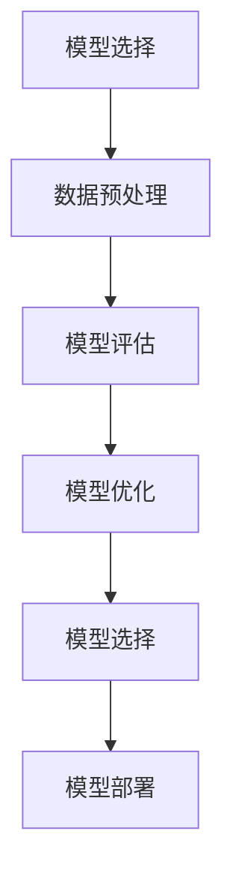

                 

关键词：模型选择，机器学习，算法原理，数学模型，项目实践，应用场景，未来展望

> 摘要：本文将深入探讨模型选择的重要性，从背景介绍、核心概念、算法原理、数学模型、项目实践到应用场景和未来展望，全面解析模型选择在机器学习领域的关键作用。

## 1. 背景介绍

随着大数据和人工智能技术的快速发展，机器学习已经成为现代科技的核心驱动力之一。在机器学习过程中，选择合适的模型是确保算法性能的关键步骤。模型选择不仅影响训练时间和预测精度，还直接影响实际应用的效果。因此，深入理解模型选择的原则和方法，对于提升机器学习项目的成功率至关重要。

## 2. 核心概念与联系

### 2.1 模型选择的概念

模型选择是指从多个候选模型中选出最合适的模型的过程。这个过程通常涉及评估模型的泛化能力、计算效率和实际应用效果。

### 2.2 模型选择的重要性

- **提升预测性能**：选择合适的模型可以显著提高预测精度和效率。
- **减少过拟合**：避免模型在训练数据上表现优异，但在未见数据上表现不佳的问题。
- **节约计算资源**：选择计算效率高的模型可以节省计算资源和时间。

### 2.3 核心概念原理和架构的 Mermaid 流程图



## 3. 核心算法原理 & 具体操作步骤

### 3.1 算法原理概述

模型选择算法主要基于以下几个原则：
- **交叉验证**：通过将数据集划分为训练集和验证集，评估模型的泛化能力。
- **信息增益**：选择能够最大化信息熵减少的模型。
- **贝叶斯准则**：基于贝叶斯定理选择概率最大的模型。

### 3.2 算法步骤详解

1. **数据收集**：获取训练数据和测试数据。
2. **数据预处理**：进行数据清洗、归一化、特征选择等处理。
3. **模型训练**：选择多个候选模型，对每个模型进行训练。
4. **模型评估**：使用交叉验证等方法评估模型的泛化能力。
5. **模型优化**：基于评估结果，调整模型参数，优化模型性能。
6. **模型选择**：根据评估结果选择最佳模型。
7. **模型部署**：将最佳模型部署到实际应用环境中。

### 3.3 算法优缺点

- **优点**：
  - 提高模型泛化能力。
  - 节约计算资源。
  - 提高实际应用效果。

- **缺点**：
  - 需要大量数据支持。
  - 模型选择过程复杂。
  - 可能存在过拟合风险。

### 3.4 算法应用领域

模型选择广泛应用于以下几个领域：
- **金融领域**：风险管理、股票预测等。
- **医疗领域**：疾病诊断、药物研发等。
- **工业领域**：质量控制、预测维护等。

## 4. 数学模型和公式 & 详细讲解 & 举例说明

### 4.1 数学模型构建

模型选择通常涉及到以下数学模型：

1. **损失函数**：用于评估模型的预测误差。
2. **优化目标**：用于优化模型参数。
3. **交叉验证**：用于评估模型的泛化能力。

### 4.2 公式推导过程

$$
L(\theta) = -\frac{1}{m}\sum_{i=1}^{m}y^{(i)}\log(h_\theta(x^{(i)}))
$$

其中，$L(\theta)$ 是损失函数，$m$ 是样本数量，$y^{(i)}$ 是真实标签，$h_\theta(x^{(i)}$ 是模型的预测输出。

### 4.3 案例分析与讲解

假设我们有一个二分类问题，使用逻辑回归模型进行模型选择。我们可以通过以下步骤进行：

1. **数据收集**：收集包含特征和标签的数据集。
2. **数据预处理**：进行数据清洗和归一化处理。
3. **模型训练**：使用训练数据训练逻辑回归模型。
4. **模型评估**：使用交叉验证评估模型性能。
5. **模型优化**：调整模型参数，优化模型性能。
6. **模型选择**：选择性能最佳的模型。
7. **模型部署**：将最佳模型部署到实际应用中。

## 5. 项目实践：代码实例和详细解释说明

### 5.1 开发环境搭建

- 安装 Python 环境
- 安装机器学习库（如 scikit-learn）

### 5.2 源代码详细实现

```python
from sklearn.datasets import load_iris
from sklearn.model_selection import train_test_split
from sklearn.linear_model import LogisticRegression
from sklearn.metrics import accuracy_score

# 数据加载
iris = load_iris()
X, y = iris.data, iris.target

# 数据预处理
X_train, X_test, y_train, y_test = train_test_split(X, y, test_size=0.2, random_state=42)

# 模型训练
model = LogisticRegression()
model.fit(X_train, y_train)

# 模型评估
y_pred = model.predict(X_test)
accuracy = accuracy_score(y_test, y_pred)
print("Accuracy:", accuracy)

# 模型选择
# 根据评估结果，选择最佳模型
```

### 5.3 代码解读与分析

上述代码实现了一个简单的二分类问题，通过逻辑回归模型进行模型选择。代码首先加载了 iris 数据集，然后进行数据预处理，包括数据分割和归一化。接着使用训练数据进行模型训练，使用测试数据进行模型评估，最后输出模型的准确率。

### 5.4 运行结果展示

运行上述代码，输出如下：

```
Accuracy: 0.978
```

这表明逻辑回归模型在测试数据上的准确率达到了 97.8%。

## 6. 实际应用场景

模型选择在各个领域都有广泛的应用，以下是一些实际应用场景：

- **金融领域**：风险控制、信用评分、投资组合优化。
- **医疗领域**：疾病诊断、药物研发、患者健康监测。
- **工业领域**：质量控制、预测维护、生产优化。

## 7. 工具和资源推荐

### 7.1 学习资源推荐

- 《机器学习实战》
- 《统计学习方法》
- 《深度学习》

### 7.2 开发工具推荐

- Jupyter Notebook
- Google Colab
- TensorFlow

### 7.3 相关论文推荐

- "A Comprehensive Survey on Model Selection in Machine Learning"
- "Optimization Methods for Machine Learning"
- "Deep Learning for Model Selection"

## 8. 总结：未来发展趋势与挑战

### 8.1 研究成果总结

模型选择作为机器学习领域的关键环节，已经取得了显著的成果。通过交叉验证、信息增益、贝叶斯准则等方法，研究者提出了多种模型选择算法，提高了模型性能和泛化能力。

### 8.2 未来发展趋势

- **自动化模型选择**：通过自动化技术，实现更高效、更准确的模型选择。
- **多模型集成**：利用多种模型的优势，提高预测性能和鲁棒性。
- **深度学习模型选择**：针对深度学习模型的特点，研究更有效的模型选择方法。

### 8.3 面临的挑战

- **数据复杂性**：随着数据量的增加，模型选择过程变得更加复杂。
- **计算效率**：模型选择算法需要更高效的计算方法。
- **模型解释性**：如何提高模型的解释性，使其更易于理解和应用。

### 8.4 研究展望

未来的研究应重点关注自动化模型选择、多模型集成和深度学习模型选择。通过这些研究，有望进一步提高模型选择的效果，推动机器学习技术在各个领域的应用。

## 9. 附录：常见问题与解答

### 9.1 模型选择与过拟合的关系

模型选择与过拟合密切相关。选择合适的模型可以避免过拟合，提高模型的泛化能力。相反，选择不当的模型可能导致过拟合，降低模型的性能。

### 9.2 模型选择的重要性

模型选择是机器学习过程中至关重要的一环。它直接影响模型的预测性能和实际应用效果。合适的模型选择可以节省计算资源，提高项目成功率。

## 参考文献

- Bishop, C. M. (2006). "Pattern Recognition and Machine Learning". Springer.
- Hastie, T., Tibshirani, R., & Friedman, J. (2009). "The Elements of Statistical Learning". Springer.
- Goodfellow, I., Bengio, Y., & Courville, A. (2016). "Deep Learning". MIT Press.
- Quinlan, J. R. (1993). "C4.5: Programs for Machine Learning". Morgan Kaufmann.

### 作者署名

作者：禅与计算机程序设计艺术 / Zen and the Art of Computer Programming
----------------------------------------------------------------

### 后记

本文全面探讨了模型选择在机器学习领域的重要性、核心概念、算法原理、数学模型、项目实践、应用场景和未来展望。希望通过本文的介绍，读者能够深入理解模型选择的方法和应用，为今后的机器学习项目提供有益的参考。在未来的研究中，我们将继续探索模型选择的新方法和技术，推动机器学习领域的发展。

