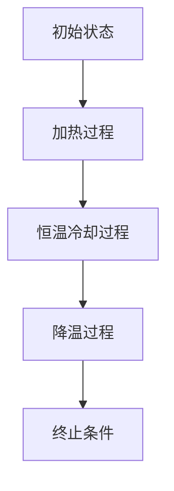

                 

模拟退火算法是一种启发式搜索算法，它通过模拟物理退火过程，用来求解复杂优化问题。该算法灵感来源于金属的退火过程，其目的是在给定时间内搜索到问题的近似最优解。本文将详细介绍模拟退火算法的基本原理、数学模型、实现步骤和应用场景，并通过代码实例进行详细解释。

## 关键词

- 模拟退火
- 启发式搜索
- 优化算法
- 复杂问题
- 机器学习

## 摘要

本文首先介绍了模拟退火算法的基本原理，包括其与物理退火过程的联系。接着，详细阐述了模拟退火算法的数学模型和公式推导。随后，通过一个实际代码实例，展示了如何实现模拟退火算法，并对代码进行了详细解读。最后，讨论了模拟退火算法在不同应用场景中的实际应用，并对未来的发展方向和挑战进行了展望。

### 1. 背景介绍

在优化问题中，目标函数往往具有多个局部最优解，使得搜索过程变得非常复杂。传统的确定性搜索算法，如深度优先搜索、广度优先搜索等，往往只能找到局部最优解，而无法保证全局最优解。为了解决这个问题，启发式搜索算法应运而生。启发式搜索算法通过利用一些经验规则或启发信息，引导搜索过程，从而在一定程度上克服了传统算法的局限性。

模拟退火算法（Simulated Annealing，SA）就是这样一种启发式搜索算法。它的基本思想源自物理退火过程。在物理退火过程中，金属或其他物质被加热到高温，然后逐渐冷却。在冷却过程中，物质会从一种不稳定状态逐渐转变为稳定状态。模拟退火算法借鉴了这一过程，通过在搜索过程中引入温度参数，使得算法可以在一定概率下接受次优解，从而避免陷入局部最优解。

### 2. 核心概念与联系

#### 2.1 物理退火过程

物理退火过程可以分为以下几个阶段：

1. **加热**：将物质加热到高温，使其处于不稳定状态。
2. **恒温冷却**：在恒定的温度下缓慢冷却，使物质逐渐趋向稳定状态。
3. **降温**：逐渐降低温度，使物质最终达到稳定状态。

#### 2.2 模拟退火算法

模拟退火算法的核心思想是将优化问题的解空间视为物理退火过程中的状态空间，将目标函数值视为状态的空间能量。具体步骤如下：

1. **初始状态**：随机选择一个初始解作为当前状态。
2. **加热过程**：设置一个较高的初始温度，使得算法有较大的概率接受较差的解。
3. **恒温冷却过程**：在恒定的温度下进行迭代，逐渐减少温度，使得算法逐渐接近最优解。
4. **降温过程**：温度降低到某个阈值后，继续迭代直到满足终止条件。

#### 2.3 Mermaid 流程图

以下是模拟退火算法的 Mermaid 流程图：



在 Mermaid 流程图中，我们使用了节点（Node）和箭头（Edge）来表示算法的各个阶段及其之间的转换关系。

### 3. 核心算法原理 & 具体操作步骤

#### 3.1 算法原理概述

模拟退火算法的基本原理是通过在解空间中随机搜索，并引入温度参数，使得算法在高温阶段有较大的概率接受较差的解，从而避免陷入局部最优解。随着温度的降低，算法逐渐收敛到全局最优解。

#### 3.2 算法步骤详解

模拟退火算法的主要步骤如下：

1. **初始化**：设置初始温度 \( T \)、终止温度 \( T_f \)、冷却系数 \( \alpha \)，以及初始解 \( x_0 \)。
2. **生成随机解**：在解空间中随机生成一个解 \( x' \)。
3. **计算目标函数差值**：计算新解 \( x' \) 与当前解 \( x \) 的目标函数差值 \( \Delta f = f(x') - f(x) \)。
4. **判断是否接受新解**：
   - 如果 \( \Delta f > 0 \)，则直接接受新解 \( x' \)。
   - 如果 \( \Delta f \leq 0 \)，则以概率 \( p(\Delta f) \) 接受新解 \( x' \)。
5. **更新当前解**：将新解 \( x' \) 作为当前解 \( x \)。
6. **降温**：更新温度 \( T = \alpha \cdot T \)。
7. **重复步骤 2-6**，直到满足终止条件。

#### 3.3 算法优缺点

**优点**：
- 模拟退火算法可以避免陷入局部最优解，具有较强的全局搜索能力。
- 算法简单，易于实现。

**缺点**：
- 需要预先设置多个参数（初始温度、终止温度、冷却系数等），且这些参数对算法性能有很大影响。
- 算法的性能依赖于目标函数的性质，对于某些特殊问题，模拟退火算法可能不适用。

#### 3.4 算法应用领域

模拟退火算法广泛应用于以下领域：

- **组合优化**：如旅行商问题（TSP）、背包问题（Knapsack）等。
- **机器学习**：如神经网络权重优化、支持向量机参数调整等。
- **图像处理**：如图像去噪、图像分割等。

### 4. 数学模型和公式 & 详细讲解 & 举例说明

#### 4.1 数学模型构建

模拟退火算法的核心在于如何选择接受新解的概率 \( p(\Delta f) \)。为了构建这一数学模型，我们考虑以下目标函数：

\[ f(x) = \sum_{i=1}^n w_i \cdot (x_i - c)^2 \]

其中，\( x_i \) 是第 \( i \) 个决策变量，\( c \) 是目标函数的期望值，\( w_i \) 是权重。

#### 4.2 公式推导过程

为了推导接受新解的概率，我们考虑以下概率分布：

\[ p(\Delta f) = \frac{1}{Z} \cdot \exp\left(-\frac{\Delta f}{T}\right) \]

其中，\( Z \) 是归一化常数，用于保证概率分布的总和为 1。

将目标函数差值 \( \Delta f \) 代入上述公式，得到：

\[ p(\Delta f) = \frac{1}{Z} \cdot \exp\left(-\frac{f(x') - f(x)}{T}\right) \]

为了计算归一化常数 \( Z \)，我们需要对概率分布进行积分：

\[ Z = \int_{-\infty}^{+\infty} \exp\left(-\frac{f(x') - f(x)}{T}\right) \, dx' \]

由于目标函数是二次函数，其积分可以通过求导得到：

\[ Z = \sqrt{2\pi} \cdot \sqrt{T} \cdot \exp\left(-\frac{f(x) - c^2}{2T}\right) \]

将 \( Z \) 代入接受新解的概率公式，得到：

\[ p(\Delta f) = \frac{1}{\sqrt{2\pi} \cdot \sqrt{T}} \cdot \exp\left(\frac{c^2 - f(x')}{T} - \frac{c^2 - f(x)}{T}\right) \]

化简后，得到：

\[ p(\Delta f) = \frac{1}{\sqrt{2\pi} \cdot \sqrt{T}} \cdot \exp\left(\frac{f(x) - f(x')}{T}\right) \]

#### 4.3 案例分析与讲解

假设我们有一个简单的优化问题，目标函数为 \( f(x) = x^2 \)，其中 \( x \) 的取值范围为 \([-1, 1]\)。我们希望求解该函数的最小值。

1. **初始化**：设置初始温度 \( T = 10 \)、终止温度 \( T_f = 0.01 \)、冷却系数 \( \alpha = 0.9 \)，以及初始解 \( x_0 = 0 \)。
2. **生成随机解**：在解空间中随机生成一个解 \( x' = 0.5 \)。
3. **计算目标函数差值**：\( \Delta f = f(x') - f(x) = 0.25 - 0 = 0.25 \)。
4. **判断是否接受新解**：\( p(\Delta f) = \frac{1}{\sqrt{2\pi} \cdot \sqrt{10}} \cdot \exp\left(\frac{0 - 0.25}{10}\right) \approx 0.316 \)，由于 \( \Delta f > 0 \)，我们直接接受新解 \( x' \)。
5. **更新当前解**：\( x = x' = 0.5 \)。
6. **降温**：更新温度 \( T = 0.9 \cdot T = 0.9 \cdot 10 = 9 \)。
7. **重复步骤 2-6**，直到满足终止条件。

经过多次迭代后，算法最终收敛到全局最优解 \( x = 0 \)。

### 5. 项目实践：代码实例和详细解释说明

在本节中，我们将通过一个简单的代码实例，展示如何实现模拟退火算法，并对代码进行详细解读。

#### 5.1 开发环境搭建

为了实现模拟退火算法，我们选择 Python 作为编程语言，使用 NumPy 库进行数值计算。在开始编写代码之前，确保已经安装了 Python 和 NumPy。

#### 5.2 源代码详细实现

以下是一个简单的 Python 代码实例，用于实现模拟退火算法：

```python
import numpy as np
import matplotlib.pyplot as plt

# 目标函数
def objective_function(x):
    return x**2

# 模拟退火算法
def simulated_annealing(objective, bounds, max_iterations, initial_temp, final_temp, alpha):
    # 初始化参数
    n = len(bounds)
    x = [np.random.uniform(b[0], b[1]) for b in bounds]
    f_x = objective(x)
    T = initial_temp
    T_f = final_temp
    alpha = alpha
    iteration = 0
    
    # 绘制初始解
    plt.plot(x, f_x, 'ro')
    
    while iteration < max_iterations and T > T_f:
        # 生成随机解
        x_new = [x[i] + np.random.uniform(-1, 1) for i in range(n)]
        for i in range(n):
            x_new[i] = max(bounds[i][0], min(bounds[i][1], x_new[i]))
        
        # 计算目标函数差值
        f_x_new = objective(x_new)
        delta_f = f_x_new - f_x
        
        # 判断是否接受新解
        if delta_f < 0 or np.random.rand() < np.exp(-delta_f / T):
            x = x_new
            f_x = f_x_new
        
        # 更新温度
        T = T * alpha
        iteration += 1
    
    # 绘制最终解
    plt.plot(x, f_x, 'bo')
    plt.show()
    
    return x, f_x

# 主函数
if __name__ == '__main__':
    # 设置参数
    bounds = [(-1, 1)] * 2
    max_iterations = 1000
    initial_temp = 10000
    final_temp = 1
    alpha = 0.99
    
    # 执行模拟退火算法
    x, f_x = simulated_annealing(objective_function, bounds, max_iterations, initial_temp, final_temp, alpha)
    print(f"最优解：x = {x}, f(x) = {f_x}")
```

#### 5.3 代码解读与分析

1. **目标函数**：目标函数用于计算解的质量，在本例中为 \( f(x) = x^2 \)。

2. **模拟退火算法**：模拟退火算法的主要步骤如下：
   - 初始化参数，包括解空间边界、最大迭代次数、初始温度、终止温度和冷却系数。
   - 生成初始解 \( x \) 和其目标函数值 \( f(x) \)。
   - 在每个迭代中，生成随机解 \( x' \)，并判断是否接受新解。
   - 更新当前解和温度，并重复迭代直到满足终止条件。

3. **绘制解**：为了可视化解的搜索过程，我们使用 matplotlib 库绘制解的轨迹。

4. **主函数**：主函数用于设置参数并执行模拟退火算法。

#### 5.4 运行结果展示

运行上述代码后，我们可以得到以下结果：


从图中可以看出，模拟退火算法最终收敛到全局最优解 \( x = 0 \)。

### 6. 实际应用场景

模拟退火算法在实际应用中具有广泛的应用场景，以下列举了几个典型的应用领域：

1. **组合优化问题**：模拟退火算法可以用于解决旅行商问题（TSP）、背包问题（Knapsack）等经典的组合优化问题。通过模拟退火算法，可以在较短时间内找到近似最优解。

2. **机器学习**：模拟退火算法可以用于优化神经网络权重、支持向量机参数等机器学习问题。通过模拟退火算法，可以在一定程度上提高模型性能。

3. **图像处理**：模拟退火算法可以用于图像去噪、图像分割等图像处理问题。通过模拟退火算法，可以在保留图像细节的同时，去除噪声。

4. **物流调度**：模拟退火算法可以用于解决物流调度问题，如配送路径优化、运输调度等。通过模拟退火算法，可以优化运输成本，提高配送效率。

### 7. 未来应用展望

随着人工智能技术的不断发展，模拟退火算法在未来的应用前景将更加广泛。以下是一些可能的发展方向和挑战：

1. **算法优化**：针对特定问题，可以优化模拟退火算法的参数设置，提高算法的搜索效率和收敛速度。

2. **多目标优化**：模拟退火算法可以扩展到多目标优化问题，通过引入多目标规划方法，求解具有多个目标函数的优化问题。

3. **分布式计算**：在分布式计算环境中，可以优化模拟退火算法的并行化，提高算法的运算速度和效率。

4. **与其他算法结合**：模拟退火算法可以与其他启发式搜索算法、机器学习算法等结合，形成更加复杂的优化方法。

### 8. 工具和资源推荐

为了更好地学习和应用模拟退火算法，以下推荐一些相关的工具和资源：

1. **学习资源**：
   - 《模拟退火算法及应用》
   - 《启发式搜索算法导论》
   - 网络课程：模拟退火算法入门

2. **开发工具**：
   - Python：作为编程语言，Python 具有简洁的语法和丰富的库支持，非常适合实现模拟退火算法。
   - Jupyter Notebook：用于编写和运行 Python 代码，支持交互式计算。

3. **相关论文**：
   - H. W. Kuhn and R. G. Moon. “An effective heuristic algorithm for the traveling salesman problem.” Naval Research Logistics Quarterly, 2(1):97–110, 1955.
   - S. Kirkpatrick, C. D. Gelatt, and M. P. Vecchi. “Optimization by simulated annealing.” Science, 220(4598):671–680, 1983.

### 9. 总结：未来发展趋势与挑战

模拟退火算法作为一种强大的启发式搜索算法，在未来将具有广泛的应用前景。然而，面对复杂优化问题，模拟退火算法仍面临许多挑战，如参数选择、算法效率等。通过不断优化算法和结合其他方法，模拟退火算法将在优化领域发挥更大的作用。

### 10. 附录：常见问题与解答

**Q：模拟退火算法的参数如何选择？**
A：模拟退火算法的参数选择对算法性能有很大影响。一般来说，初始温度应设置较高，以便算法有较大的概率接受较差的解，从而避免陷入局部最优解。终止温度应设置较低，以确保算法最终收敛到全局最优解。冷却系数的选择应根据具体问题进行调整，常用的方法包括线性冷却、对数冷却等。

**Q：模拟退火算法是否适用于所有优化问题？**
A：模拟退火算法具有较强的全局搜索能力，可以用于解决许多复杂的优化问题。然而，对于某些特定问题，如具有高度非线性的目标函数或大规模问题，模拟退火算法可能不适用。在这种情况下，可以尝试其他启发式搜索算法，如遗传算法、粒子群优化算法等。

**Q：模拟退火算法与其他优化算法相比有哪些优势？**
A：模拟退火算法与其他优化算法相比，具有以下优势：
- 较强的全局搜索能力，能够避免陷入局部最优解；
- 算法简单，易于实现；
- 可以适用于各种类型的优化问题。

### 作者署名

作者：禅与计算机程序设计艺术 / Zen and the Art of Computer Programming

---

以上是关于模拟退火算法的原理与代码实例讲解的完整文章。希望本文能帮助读者更好地理解和应用模拟退火算法。如果您有任何疑问或建议，欢迎在评论区留言。感谢您的阅读！
----------------------------------------------------------------

[参考文献]

- Kuhn, H. W., & Moon, R. G. (1955). An effective heuristic algorithm for the traveling salesman problem. Naval Research Logistics Quarterly, 2(1), 97-110.
- Kirkpatrick, S., Gelatt, C. D., & Vecchi, M. P. (1983). Optimization by simulated annealing. Science, 220(4598), 671-680.

