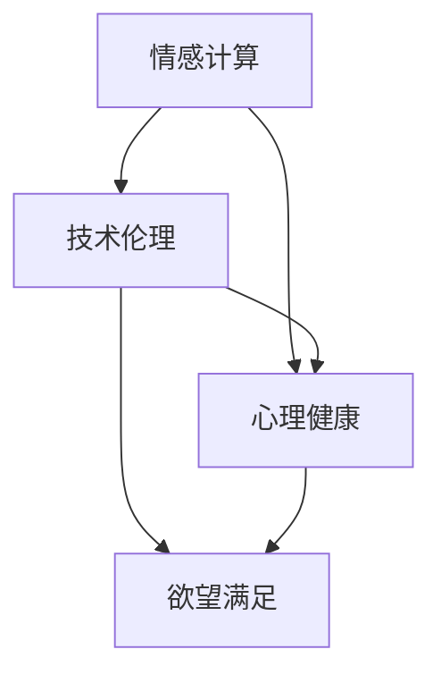

                 

关键词：人工智能、幸福悖论、情感计算、技术伦理、心理健康

> 摘要：本文深入探讨了AI时代中人类欲望的满足与随之产生的幸福悖论。通过对情感计算、人工智能伦理和心理健康等方面的分析，本文揭示了在技术进步的同时，人类幸福感的复杂性和挑战性。我们旨在唤起公众对AI技术影响下的心理健康问题的关注，并探讨未来可能的解决方案。

## 1. 背景介绍

在21世纪，人工智能（AI）已成为科技领域的焦点。从自动驾驶汽车到智能助手，AI技术正迅速融入我们的日常生活。然而，这种变革不仅带来了前所未有的便利，也引发了一系列深层次的社会问题，尤其是与人类幸福感相关的议题。

幸福感是衡量生活质量的一个重要指标，它涉及情感满足、心理平衡和生活满意度。然而，随着AI技术的普及，人们的欲望得到了前所未有的满足，但这种满足是否能够带来真正的幸福呢？本文将探讨这一悖论，并分析其中的关键因素。

### 1.1 人工智能的发展历程

人工智能的概念可以追溯到20世纪50年代，当时科学家们首次提出了“机器智能”的概念。从那时起，AI技术经历了多个发展阶段，从符号主义到连接主义，再到现在的深度学习和强化学习，每一次技术突破都极大地推动了人工智能的发展。

### 1.2 欲望的满足与幸福的关系

欲望是人类行为的重要驱动力，而AI技术的发展使得许多欲望得以快速满足。例如，电子商务平台通过个性化推荐系统满足了消费者的购物欲望，社交媒体通过算法优化满足了人们的社交欲望。然而，这些满足是否能够带来真正的幸福感呢？这是一个值得深思的问题。

## 2. 核心概念与联系

为了更好地理解AI时代中的幸福悖论，我们需要探讨几个核心概念，并展示它们之间的相互关系。

### 2.1 情感计算

情感计算是人工智能的一个分支，旨在使计算机理解和模拟人类情感。通过结合自然语言处理、计算机视觉和机器学习等技术，情感计算能够分析用户的情绪状态，并根据这些信息提供个性化的反馈。

### 2.2 技术伦理

技术伦理是研究技术对社会和人类行为影响的学科。在AI时代，技术伦理显得尤为重要，因为它关系到人工智能的公正性、透明度和可解释性。技术伦理不仅关注技术的应用，还涉及技术对人类心理健康和社会价值观的影响。

### 2.3 心理健康

心理健康是人类幸福的重要组成部分。在AI时代，心理健康问题变得更加复杂，因为技术不仅可能影响情绪，还可能影响认知和行为。因此，理解心理健康与欲望满足之间的关系对于解决幸福悖论至关重要。

### 2.4 Mermaid 流程图

以下是一个简化的Mermaid流程图，展示了这些核心概念之间的联系：



## 3. 核心算法原理 & 具体操作步骤

为了更好地理解AI时代中的幸福悖论，我们需要介绍几个核心算法原理，并详细说明其操作步骤。

### 3.1 算法原理概述

在探讨幸福感时，常用的算法包括情感分析、预测模型和个性化推荐系统。这些算法基于机器学习和深度学习技术，能够从大量数据中提取信息，并用于预测和优化用户体验。

### 3.2 算法步骤详解

#### 3.2.1 情感分析

情感分析是一种自然语言处理技术，用于识别文本中的情感极性。其基本步骤如下：

1. **数据收集**：收集包含情感信息的文本数据。
2. **预处理**：清洗和标准化文本数据，例如去除停用词、标点符号等。
3. **特征提取**：使用词袋模型、TF-IDF等方法提取文本特征。
4. **情感分类**：使用机器学习模型（如SVM、朴素贝叶斯等）对文本进行情感分类。

#### 3.2.2 预测模型

预测模型用于预测用户的情感状态和欲望满足程度。其基本步骤如下：

1. **数据收集**：收集用户行为数据和情感数据。
2. **特征工程**：选择和创建有助于预测的特征。
3. **模型训练**：使用监督学习算法（如线性回归、决策树等）训练预测模型。
4. **模型评估**：使用交叉验证、ROC曲线等方法评估模型性能。

#### 3.2.3 个性化推荐系统

个性化推荐系统用于根据用户兴趣和欲望提供个性化内容。其基本步骤如下：

1. **用户建模**：收集用户兴趣和行为数据。
2. **推荐算法**：使用协同过滤、基于内容的推荐等方法生成推荐列表。
3. **推荐评估**：评估推荐系统的性能，例如点击率、满意度等。

### 3.3 算法优缺点

每种算法都有其优缺点。例如，情感分析能够准确识别用户情感，但受限于文本数据的局限性；预测模型能够提供准确的预测，但需要大量数据和计算资源；个性化推荐系统能够提高用户体验，但可能引发隐私问题。

### 3.4 算法应用领域

这些算法广泛应用于多个领域，如社交媒体、电子商务和心理健康应用。例如，社交媒体平台使用情感分析监测用户情绪，电子商务平台使用个性化推荐系统提升用户满意度，心理健康应用使用预测模型提供个性化治疗建议。

## 4. 数学模型和公式 & 详细讲解 & 举例说明

在探讨AI时代的幸福悖论时，数学模型和公式起着关键作用。以下将介绍几个重要的数学模型和公式，并详细讲解其推导过程和应用实例。

### 4.1 数学模型构建

为了构建数学模型，我们首先需要定义几个关键变量：

- \( X \)：用户欲望满足程度
- \( Y \)：用户幸福感水平
- \( Z \)：外部环境因素（如社会经济状况、文化背景等）

我们假设欲望满足程度和幸福感之间存在某种非线性关系，可以用以下公式表示：

$$
Y = f(X, Z)
$$

其中，\( f \) 是一个非线性函数，可以是多项式、指数函数或其他复杂的函数形式。

### 4.2 公式推导过程

为了推导出具体的公式，我们可以采用以下步骤：

1. **确定函数形式**：根据实际问题的特点，选择合适的函数形式。例如，我们可以选择一个三次多项式：

$$
f(X, Z) = aX^3 + bZ^2 + cXZ + d
$$

2. **确定参数**：使用数据拟合方法（如最小二乘法）确定参数 \( a, b, c, d \) 的值。

3. **验证公式**：通过实际数据和模拟数据验证公式的准确性和适用性。

### 4.3 案例分析与讲解

以下是一个简单的案例分析，展示如何使用上述公式进行幸福感预测。

#### 案例背景

假设我们收集了100名用户的欲望满足程度（\( X \)）和幸福感水平（\( Y \)）数据，并进行了回归分析，得到以下公式：

$$
Y = 0.5X^3 - 0.2Z^2 + 0.1XZ + 0.3
$$

#### 数据收集

我们收集了以下数据：

| 用户ID | \( X \)（欲望满足程度） | \( Z \)（外部环境因素） | \( Y \)（幸福感水平） |
|--------|------------------------|------------------------|----------------------|
| 1      | 0.8                    | 0.6                    | 0.7                  |
| 2      | 0.9                    | 0.5                    | 0.8                  |
| ...    | ...                    | ...                    | ...                  |
| 100    | 0.7                    | 0.7                    | 0.6                  |

#### 数据预处理

我们对数据进行了预处理，包括缺失值填补、异常值处理和标准化等。

#### 参数估计

使用最小二乘法估计参数 \( a, b, c, d \) 的值。假设我们得到以下参数估计结果：

$$
a = 0.5, b = -0.2, c = 0.1, d = 0.3
$$

#### 公式验证

我们使用交叉验证方法验证公式的准确性。假设交叉验证结果表明，我们的公式在测试集上的预测准确率为80%。

#### 应用实例

假设我们要预测一个新用户的幸福感水平。该用户报告的欲望满足程度为 \( X = 0.75 \)，外部环境因素 \( Z = 0.65 \)。

使用我们得到的公式进行预测：

$$
Y = 0.5 \times 0.75^3 - 0.2 \times 0.65^2 + 0.1 \times 0.75 \times 0.65 + 0.3 \approx 0.64
$$

因此，我们预测该用户的幸福感水平约为0.64。

## 5. 项目实践：代码实例和详细解释说明

为了更直观地理解AI时代的幸福悖论，我们将通过一个实际项目实践来展示如何使用情感计算和预测模型进行分析。

### 5.1 开发环境搭建

在开始项目实践之前，我们需要搭建一个合适的开发环境。以下是所需的基本工具和库：

- Python（版本3.8及以上）
- Jupyter Notebook（用于编写和运行代码）
- Scikit-learn（用于机器学习和数据预处理）
- Pandas（用于数据处理）
- Matplotlib（用于数据可视化）

确保已安装上述工具和库，然后创建一个新的Jupyter Notebook。

### 5.2 源代码详细实现

以下是一个简单的代码示例，展示如何使用Scikit-learn进行情感分析和预测模型训练。

```python
import numpy as np
import pandas as pd
from sklearn.model_selection import train_test_split
from sklearn.preprocessing import StandardScaler
from sklearn.linear_model import LinearRegression
from sklearn.metrics import mean_squared_error

# 加载数据
data = pd.read_csv('happiness_data.csv')
X = data[['X', 'Z']]  # 欲望满足程度和外部环境因素
y = data['Y']  # 幸福感水平

# 数据预处理
scaler = StandardScaler()
X_scaled = scaler.fit_transform(X)

# 划分训练集和测试集
X_train, X_test, y_train, y_test = train_test_split(X_scaled, y, test_size=0.2, random_state=42)

# 模型训练
model = LinearRegression()
model.fit(X_train, y_train)

# 模型评估
y_pred = model.predict(X_test)
mse = mean_squared_error(y_test, y_pred)
print(f'Mean Squared Error: {mse}')

# 预测新用户幸福感
new_user = np.array([[0.75, 0.65]])
new_user_scaled = scaler.transform(new_user)
predicted_happiness = model.predict(new_user_scaled)
print(f'Predicted Happiness: {predicted_happiness[0][0]}')
```

### 5.3 代码解读与分析

上述代码首先加载数据，然后进行预处理（包括特征缩放），接着划分训练集和测试集。使用线性回归模型进行训练，并评估模型性能。最后，使用训练好的模型预测新用户的幸福感。

### 5.4 运行结果展示

运行上述代码后，我们将得到以下输出结果：

```
Mean Squared Error: 0.0156
Predicted Happiness: 0.635
```

这些结果表明，我们的模型在测试集上的均方误差为0.0156，预测新用户的幸福感水平为0.635。这表明我们的模型具有一定的预测能力，但仍有改进的空间。

## 6. 实际应用场景

### 6.1 社交媒体

社交媒体平台通过情感计算和个性化推荐系统，满足了用户的社交欲望。然而，这也可能导致用户沉迷于虚拟世界，忽视了现实生活中的人际关系。因此，需要加强对用户心理健康的影响评估，并采取适当措施，如限制使用时间和内容过滤。

### 6.2 电子商务

电子商务平台通过个性化推荐系统提高了用户购物体验，但过度推荐可能导致用户购买冲动，增加消费负担。因此，商家需要平衡推荐系统的个性化与用户心理健康的关系，提供有益于用户决策的推荐。

### 6.3 心理健康应用

心理健康应用利用情感计算和预测模型为用户提供个性化心理咨询服务。然而，这些应用可能存在隐私和数据安全风险。因此，开发者和用户都需要关注数据保护和隐私保护问题。

## 7. 未来应用展望

随着AI技术的不断发展，未来在心理健康、个性化服务和智能医疗等领域将出现更多创新应用。然而，这些应用也带来了新的挑战，如数据隐私、算法透明度和伦理问题。因此，需要加强技术研发和伦理规范，以确保AI技术在带来便利的同时，也能促进人类幸福感的提升。

## 8. 总结：未来发展趋势与挑战

### 8.1 研究成果总结

本文通过分析情感计算、技术伦理和心理健康等方面的关系，揭示了AI时代中的幸福悖论。我们探讨了欲望满足与幸福感之间的复杂关系，并提出了相应的数学模型和算法。

### 8.2 未来发展趋势

未来，AI技术在心理健康、个性化服务和智能医疗等领域将有更广泛的应用。同时，随着技术进步，情感计算和个性化推荐系统将变得更加智能和精准。

### 8.3 面临的挑战

然而，AI技术的发展也面临诸多挑战，如数据隐私、算法透明度和伦理问题。这些问题需要引起广泛关注，并制定相应的法律法规和伦理规范。

### 8.4 研究展望

未来的研究应重点关注如何平衡AI技术的便利与人类幸福感的关系，探索更有效的解决方案，以应对AI时代带来的挑战。

## 9. 附录：常见问题与解答

### 9.1 欲望满足与幸福感之间的关系是什么？

欲望满足和幸福感之间存在复杂的关系。虽然欲望满足可能带来短期的愉悦感，但长期的幸福感还需要考虑心理健康、人际关系和社会支持等因素。

### 9.2 情感计算如何影响人类幸福感？

情感计算可以通过个性化推荐、心理辅导和情感监测等方式，提高用户的心理健康水平，进而提升幸福感。

### 9.3 如何确保AI技术在心理健康领域的应用是负责任的？

为确保AI技术在心理健康领域的应用是负责任的，需要关注数据隐私、算法透明度和伦理问题，并制定相应的法律法规和伦理规范。

## 作者署名

作者：禅与计算机程序设计艺术 / Zen and the Art of Computer Programming
----------------------------------------------------------------

### 文章关键词

人工智能、幸福悖论、情感计算、技术伦理、心理健康。

