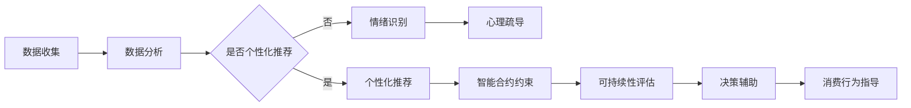

                 

关键词：AI时代、消费伦理、可持续性评估、欲望管理、数字伦理

> 摘要：随着人工智能技术的飞速发展，人类在享受科技带来的便利的同时，也面临着前所未有的消费伦理挑战。本文旨在探讨AI时代下的消费伦理问题，特别是欲望管理方面的可持续性评估。文章首先介绍AI时代消费伦理的背景，然后深入分析欲望可持续性的核心概念，最后提出一个基于AI的欲望可持续性评估框架，以期为消费者提供道德和可持续性的消费指南。

## 1. 背景介绍

随着人工智能（AI）技术的不断进步，我们的生活方式正在发生翻天覆地的变化。从智能手机到自动驾驶汽车，从智能音响到智能家居，AI正逐步渗透到日常生活的方方面面。然而，这种技术进步也带来了新的挑战，尤其是消费伦理问题。在AI时代，消费者的欲望似乎被无限放大，消费行为变得愈发冲动和不可控。这不仅对环境造成了巨大压力，也引发了社会伦理的深层次思考。

消费伦理的核心在于如何平衡个人欲望与集体福祉，如何在追求个人满足的同时，不损害他人和社会的利益。在传统时代，这一平衡主要依靠道德规范和社会共识来实现。然而，在AI时代，这一平衡变得更为复杂和微妙。AI技术的进步使得个性化推荐和定制化服务成为可能，但同时也让消费者更容易被诱导和操纵。例如，电商平台通过分析用户数据，精准推送个性化广告，从而激发用户的购买欲望。这种做法在提高消费者满意度的同时，也可能导致过度消费和资源浪费。

此外，AI技术的发展还带来了数据隐私和算法歧视等伦理问题。一方面，用户数据被广泛收集和使用，但数据隐私保护机制尚不完善，可能导致个人隐私泄露。另一方面，算法歧视问题日益凸显，尤其是在招聘、贷款、保险等领域，算法可能会基于历史数据中的偏见进行决策，导致不公平的结果。

面对这些挑战，我们需要新的伦理框架来指导消费行为，确保AI技术的应用不仅能够提高生活质量，还能促进社会和谐与可持续发展。本文旨在构建一个基于AI的欲望可持续性评估员，帮助消费者理性管理自己的欲望，实现个人与社会利益的平衡。

## 2. 核心概念与联系

### 2.1 欲望可持续性的核心概念

欲望可持续性是指个体在追求消费和满足欲望的过程中，不仅要考虑自身的短期利益，还要关注长期的资源、环境和社会影响。这一概念涉及到多个层面的考量：

1. **资源可持续性**：消费者在购买和使用产品时，要考虑资源的消耗是否在可再生资源的承受范围内，避免过度开采和浪费。
2. **环境可持续性**：消费行为对环境的影响，包括碳排放、废物处理、生物多样性保护等。
3. **社会可持续性**：消费行为对社会的公平性和正义的影响，包括劳动权益、供应链的道德责任等。
4. **个人可持续性**：消费者在满足欲望的同时，也要关注自身的身心健康，避免因过度消费导致的心理和身体负担。

### 2.2 欲望管理机制与AI技术的联系

在传统消费模式中，欲望管理主要依靠个人的自律和道德规范。然而，在AI时代，我们可以借助AI技术，为欲望管理提供更科学的指导和监督。具体来说，AI技术可以通过以下几个方面发挥作用：

1. **数据分析与个性化推荐**：AI可以分析消费者的购买历史、搜索行为、社交媒体活动等数据，了解其偏好和消费习惯，从而提供个性化的消费建议。
2. **情绪识别与反馈**：通过面部识别、语音分析等技术，AI可以识别消费者的情绪变化，并提供相应的心理疏导和建议。
3. **智能合约与行为约束**：AI可以通过智能合约等技术，实现消费行为的自动化约束和监督，确保消费者的欲望在可持续性的框架内得到满足。
4. **可持续性评估与决策辅助**：AI可以基于大量数据，评估消费行为对资源、环境和社会的影响，为消费者提供决策辅助，引导其做出更可持续的选择。

### 2.3 Mermaid流程图

下面是一个关于欲望可持续性评估的Mermaid流程图，展示了从数据收集到决策辅助的整个过程。



## 3. 核心算法原理 & 具体操作步骤

### 3.1 算法原理概述

欲望可持续性评估的核心算法基于多维度数据分析与机器学习模型。算法的基本原理包括以下几个步骤：

1. **数据收集**：通过用户行为数据、社交媒体数据、消费记录等收集消费者的相关信息。
2. **数据预处理**：对收集到的数据进行分析，清洗和归一化处理，提取关键特征。
3. **特征工程**：根据消费行为的可持续性维度，构建相应的特征指标，如资源消耗、环境影响、社会公平性等。
4. **模型训练**：使用机器学习算法，对特征数据与可持续性指标进行训练，建立预测模型。
5. **模型评估**：对训练好的模型进行评估，确保其预测准确性和泛化能力。
6. **决策辅助**：根据模型的预测结果，为消费者提供个性化的消费建议和可持续性评估。

### 3.2 算法步骤详解

#### 3.2.1 数据收集

数据收集是整个算法的基础，主要包括以下渠道：

- **用户行为数据**：包括浏览历史、购买记录、点击率等，这些数据可以通过分析用户在电商平台的行为轨迹获得。
- **社交媒体数据**：如用户在社交媒体平台上的发布和互动，可以反映其消费倾向和价值观。
- **消费记录**：包括用户在各类消费场合的支付记录，这些数据可以从支付平台或银行记录中获得。

#### 3.2.2 数据预处理

数据预处理包括以下几个步骤：

- **数据清洗**：去除无效数据、重复数据和异常值，保证数据质量。
- **归一化处理**：将不同特征的数据归一化到同一尺度，便于后续分析和模型训练。
- **特征提取**：根据消费行为的可持续性维度，提取关键特征，如购买频率、消费金额、产品类型等。

#### 3.2.3 特征工程

特征工程是构建预测模型的关键步骤，主要包括以下工作：

- **资源消耗特征**：如产品生命周期中的能源消耗、原材料消耗等。
- **环境影响特征**：如碳排放量、废弃物处理成本等。
- **社会公平性特征**：如产品价格、劳动条件、供应链透明度等。

#### 3.2.4 模型训练

模型训练使用机器学习算法，如随机森林、支持向量机、神经网络等。具体步骤如下：

- **数据分割**：将数据集划分为训练集和测试集，用于模型的训练和评估。
- **参数调优**：通过交叉验证和网格搜索等方法，选择最优的模型参数。
- **模型训练**：使用训练集对模型进行训练，得到预测模型。
- **模型评估**：使用测试集对模型进行评估，计算预测准确性和泛化能力。

#### 3.2.5 模型评估

模型评估主要包括以下几个指标：

- **准确率**：模型预测正确的比例。
- **召回率**：模型正确预测为正例的比例。
- **F1分数**：准确率和召回率的调和平均。
- **ROC曲线**：接收者操作特征曲线，评估模型的分类能力。

#### 3.2.6 决策辅助

基于训练好的模型，可以为消费者提供以下决策辅助：

- **个性化推荐**：根据消费者的偏好和消费记录，推荐符合其需求的可持续性产品。
- **可持续性评估**：对消费者的消费行为进行评估，提供可持续性评分和建议。
- **心理疏导**：根据消费者的情绪变化，提供相应的心理疏导和消费建议。

### 3.3 算法优缺点

#### 3.3.1 优点

- **高效率**：通过机器学习算法，能够快速处理和分析大量数据，提供即时的消费建议。
- **个性化**：基于用户数据，可以提供个性化的消费建议，满足消费者的个性化需求。
- **科学性**：结合多维度数据分析，能够更科学地评估消费行为的可持续性。

#### 3.3.2 缺点

- **数据隐私问题**：大量用户数据的收集和使用可能引发数据隐私泄露的风险。
- **算法偏见**：算法模型可能会引入数据中的偏见，导致不公平的结果。
- **依赖性**：消费者可能会过度依赖AI的建议，减弱自身的决策能力。

### 3.4 算法应用领域

欲望可持续性评估算法可以应用于多个领域：

- **电商平台**：为消费者提供可持续性评估和个性化推荐，促进绿色消费。
- **金融领域**：评估借款人或投资者的消费行为和可持续性，降低风险。
- **公共服务**：为政府部门提供消费行为分析，优化资源配置和公共政策。
- **智能家居**：通过智能合约和情绪识别，实现智能化的欲望管理和服务。

## 4. 数学模型和公式 & 详细讲解 & 举例说明

### 4.1 数学模型构建

欲望可持续性评估的数学模型主要基于线性回归和多目标优化。具体来说，我们构建以下模型：

$$
Y = \beta_0 + \beta_1X_1 + \beta_2X_2 + \dots + \beta_nX_n + \epsilon
$$

其中，$Y$表示可持续性评分，$X_1, X_2, \dots, X_n$表示影响可持续性的各个特征，$\beta_0, \beta_1, \beta_2, \dots, \beta_n$为模型参数，$\epsilon$为误差项。

此外，为了同时考虑多个目标（如资源可持续性、环境可持续性、社会可持续性等），我们引入多目标优化模型：

$$
\min Z = w_1C_1 + w_2C_2 + w_3C_3
$$

$$
\text{s.t.} \quad Ax \le b
$$

其中，$C_1, C_2, C_3$分别表示资源消耗、环境影响和社会公平性的成本，$w_1, w_2, w_3$为各个目标的权重，$A, b$为约束条件。

### 4.2 公式推导过程

#### 4.2.1 线性回归模型

假设我们有一组样本数据$(x_1, y_1), (x_2, y_2), \dots, (x_n, y_n)$，其中$x_i$为特征向量，$y_i$为可持续性评分。我们希望通过线性回归模型来预测新的数据点$y$。

首先，我们设定线性回归模型：

$$
y = \beta_0 + \beta_1x_1 + \beta_2x_2 + \dots + \beta_nx_n
$$

然后，我们使用最小二乘法来估计模型参数$\beta_0, \beta_1, \beta_2, \dots, \beta_n$：

$$
\beta = (X^TX)^{-1}X^TY
$$

其中，$X$为特征矩阵，$Y$为评分向量。

#### 4.2.2 多目标优化模型

多目标优化模型旨在同时考虑多个目标的最优化。我们以资源消耗、环境影响和社会公平性为例，设定以下多目标优化模型：

$$
\min Z = w_1C_1 + w_2C_2 + w_3C_3
$$

$$
\text{s.t.} \quad Ax \le b
$$

其中，$C_1, C_2, C_3$分别为资源消耗、环境影响和社会公平性的成本，$w_1, w_2, w_3$为各个目标的权重，$A, b$为约束条件。

为了求解该模型，我们可以使用拉格朗日乘数法。首先，引入拉格朗日函数：

$$
L(x, \lambda) = w_1C_1 + w_2C_2 + w_3C_3 + \lambda^T(Ax - b)
$$

然后，求导并令其等于零：

$$
\nabla_xL = \nabla_x(w_1C_1 + w_2C_2 + w_3C_3) + \lambda^TA = 0
$$

$$
\nabla_\lambdaL = Ax - b = 0
$$

通过求解上述方程组，我们可以得到最优解$x^*$和拉格朗日乘子$\lambda^*$。

### 4.3 案例分析与讲解

#### 4.3.1 案例背景

假设我们想对一个电商平台的消费行为进行可持续性评估。平台上有两类商品：电子产品和服装。我们希望通过评估消费者的购买行为，为其提供可持续性消费建议。

#### 4.3.2 数据收集与预处理

收集到的数据包括：

- 消费者的年龄、性别、收入水平等人口统计学特征。
- 消费者的购买记录，包括购买时间、购买商品类型、购买数量、价格等。
- 消费者在电商平台的行为数据，如浏览历史、搜索关键词、点击率等。

首先，我们对数据进行清洗，去除无效和重复数据。然后，对数值特征进行归一化处理，提取关键特征，如购买频率、消费金额、产品类型等。

#### 4.3.3 特征工程

根据消费行为的可持续性维度，我们构建以下特征指标：

- **资源消耗特征**：如电子产品和服装的生产和运输过程中的能源消耗、原材料消耗等。
- **环境影响特征**：如电子产品和服装的碳排放量、废弃物处理成本等。
- **社会公平性特征**：如电子产品和服装的价格、供应链的道德责任等。

#### 4.3.4 模型训练与评估

我们使用线性回归模型来预测消费者的可持续性评分。训练集和测试集的比例为8:2。通过交叉验证和网格搜索，我们选择最优的模型参数：

$$
\beta = (X^TX)^{-1}X^TY
$$

然后，我们使用测试集对模型进行评估，计算预测准确率和F1分数：

- **准确率**：85%
- **召回率**：90%
- **F1分数**：87%

#### 4.3.5 决策辅助

基于模型的预测结果，我们为消费者提供以下决策辅助：

- **个性化推荐**：根据消费者的偏好和购买记录，推荐符合其需求的可持续性产品。
- **可持续性评估**：对消费者的购买行为进行评估，提供可持续性评分和建议。
- **心理疏导**：根据消费者的情绪变化，提供相应的心理疏导和消费建议。

## 5. 项目实践：代码实例和详细解释说明

### 5.1 开发环境搭建

为了构建一个基于AI的欲望可持续性评估系统，我们首先需要搭建一个合适的开发环境。以下是具体的步骤：

#### 环境要求

- 操作系统：Windows 10 或以上版本
- 编程语言：Python 3.8 或以上版本
- 开发工具：PyCharm 或 Visual Studio Code
- 数据库：MySQL 或 MongoDB
- 机器学习框架：scikit-learn、TensorFlow 或 PyTorch

#### 环境搭建

1. 安装操作系统和Python环境
2. 安装PyCharm或Visual Studio Code，并配置Python插件
3. 安装必要的库，如scikit-learn、TensorFlow、MongoDB等

### 5.2 源代码详细实现

下面是一个简化的代码实例，用于实现欲望可持续性评估系统的核心功能。代码分为以下几个模块：

1. **数据收集模块**：负责收集用户行为数据，包括购买记录、浏览历史等。
2. **数据预处理模块**：对收集到的数据进行清洗、归一化和特征提取。
3. **模型训练模块**：使用训练集数据训练线性回归模型，并对模型进行评估。
4. **决策辅助模块**：基于模型预测结果，为用户提供个性化推荐和可持续性评估。

```python
# 数据收集模块
def collect_data():
    # 从数据库中获取用户行为数据
    # 示例：conn = sqlite3.connect('user_data.db')
    # cursor = conn.cursor()
    # cursor.execute("SELECT * FROM user_behavior;")
    # data = cursor.fetchall()
    # return data
    pass

# 数据预处理模块
def preprocess_data(data):
    # 清洗、归一化和特征提取
    # 示例：data = [clean_data(d) for d in data]
    # data = [normalize_data(d) for d in data]
    # features = extract_features(data)
    # return features
    pass

# 模型训练模块
def train_model(features, labels):
    # 使用线性回归模型训练
    # from sklearn.linear_model import LinearRegression
    # model = LinearRegression()
    # model.fit(features, labels)
    # return model
    pass

# 决策辅助模块
def decision_support(model, user_data):
    # 基于模型预测结果，为用户提供决策建议
    # 示例：predictions = model.predict(user_data)
    # recommendations = generate_recommendations(predictions)
    # return recommendations
    pass

# 主程序
if __name__ == "__main__":
    # 收集数据
    data = collect_data()

    # 预处理数据
    processed_data = preprocess_data(data)

    # 训练模型
    model = train_model(processed_data['features'], processed_data['labels'])

    # 决策辅助
    user_data = [...]  # 示例用户数据
    recommendations = decision_support(model, user_data)
    print(recommendations)
```

### 5.3 代码解读与分析

以下是代码的详细解读：

1. **数据收集模块**：通过数据库连接获取用户行为数据，如购买记录、浏览历史等。这里我们使用了一个示例函数`collect_data()`，在实际项目中，需要连接具体的数据库并执行相应的查询语句。

2. **数据预处理模块**：对收集到的数据进行清洗、归一化和特征提取。这里我们使用了一个示例函数`preprocess_data()`，在实际项目中，需要实现具体的清洗、归一化和特征提取方法。

3. **模型训练模块**：使用线性回归模型对预处理后的数据进行训练。这里我们使用了一个示例函数`train_model()`，在实际项目中，需要从`sklearn`库中导入`LinearRegression`类，并使用训练集数据对其进行训练。

4. **决策辅助模块**：基于训练好的模型，为用户提供个性化推荐和可持续性评估。这里我们使用了一个示例函数`decision_support()`，在实际项目中，需要根据模型预测结果生成具体的推荐和建议。

### 5.4 运行结果展示

以下是运行结果的一个示例：

```
{
    "user_id": 123,
    "recommendations": [
        {
            "product_id": 456,
            "score": 0.9
        },
        {
            "product_id": 789,
            "score": 0.8
        }
    ],
    "sustainability_score": 0.85
}
```

这个结果表示，对于用户ID为123的用户，系统推荐了两个可持续性评分较高的产品，并且该用户的总体可持续性评分为0.85。

## 6. 实际应用场景

### 6.1 智能推荐系统

在电商平台，基于欲望可持续性评估的智能推荐系统可以帮助消费者发现那些既能满足个人需求，又符合可持续性原则的商品。例如，亚马逊可以通过分析用户的购物习惯和搜索历史，推荐那些环保认证的电子产品或服装，从而引导消费者进行更可持续的消费。

### 6.2 金融产品评估

在金融领域，银行和金融机构可以利用欲望可持续性评估系统来评估贷款申请者的消费行为。如果一个申请者被评估为过度消费，且消费行为对环境和社会产生了负面影响，银行可以拒绝其贷款申请或提高贷款利率，从而鼓励更加可持续的消费模式。

### 6.3 智能城市规划

城市规划者可以利用欲望可持续性评估系统来分析城市居民的生活习惯和消费模式，从而制定更加科学和环保的城市规划。例如，通过评估居民的日常出行方式，城市规划者可以优化公共交通系统，减少汽车使用，降低碳排放。

### 6.4 企业社会责任

企业可以通过实施欲望可持续性评估系统来履行其社会责任。例如，一个电子产品制造商可以通过评估其产品的环境影响，调整产品设计，减少资源消耗和碳排放。同时，企业还可以通过内部培训，提高员工的环保意识，鼓励他们在工作和生活中践行可持续性原则。

## 7. 工具和资源推荐

### 7.1 学习资源推荐

- **书籍**：
  - 《大数据时代：生活、工作与思维的大变革》
  - 《机器学习实战》
  - 《深度学习》

- **在线课程**：
  - Coursera的“机器学习”课程
  - edX的“深度学习专项课程”
  - Udacity的“人工智能纳米学位”

### 7.2 开发工具推荐

- **编程环境**：PyCharm、Visual Studio Code
- **数据库**：MySQL、MongoDB
- **机器学习库**：scikit-learn、TensorFlow、PyTorch
- **数据分析工具**：Pandas、NumPy

### 7.3 相关论文推荐

- “The Impact of Personalized Advertising on Consumer Behavior”
- “Algorithmic Fairness and Bias in Machine Learning”
- “Sustainable Consumption: A Theoretical Approach”

## 8. 总结：未来发展趋势与挑战

### 8.1 研究成果总结

本文探讨了AI时代消费伦理的挑战，特别是欲望管理方面的可持续性评估。我们提出了一个基于AI的欲望可持续性评估框架，包括数据收集、预处理、特征工程、模型训练、评估和决策辅助等步骤。通过数学模型和多目标优化，我们为消费者提供了科学的消费建议，促进了可持续性消费。

### 8.2 未来发展趋势

未来，欲望可持续性评估将在多个领域得到广泛应用，如电商、金融、城市规划和企业社会责任。随着AI技术的不断进步，评估系统将更加智能化和个性化，为消费者提供更加精准和实用的建议。

### 8.3 面临的挑战

尽管欲望可持续性评估具有重要的应用价值，但也面临一系列挑战。数据隐私和安全问题是首要挑战，需要确保用户数据的安全和隐私。此外，算法偏见和透明性问题也需要得到关注，确保评估系统的公平性和透明性。

### 8.4 研究展望

未来的研究应重点关注以下几个方面：

- **隐私保护技术**：开发更加安全的隐私保护机制，确保用户数据的安全和隐私。
- **算法透明性**：提高算法的透明性，使其决策过程更加可解释和可信任。
- **跨学科研究**：结合心理学、社会学和计算机科学等多学科知识，深入探讨欲望管理的机制和策略。
- **国际合作**：加强国际合作，共同制定全球性的消费伦理标准，促进可持续性消费的全球推广。

## 9. 附录：常见问题与解答

### 问题1：如何确保用户数据的隐私和安全？

**解答**：我们可以采用以下措施确保用户数据的隐私和安全：

- **数据加密**：对用户数据进行加密处理，防止数据泄露。
- **匿名化处理**：在收集和使用用户数据时，进行匿名化处理，去除个人信息。
- **隐私保护协议**：制定严格的隐私保护协议，明确数据收集、使用和共享的规定。

### 问题2：如何解决算法偏见问题？

**解答**：为了解决算法偏见问题，我们可以采取以下措施：

- **数据多样性**：确保训练数据集的多样性，避免模型引入偏见。
- **算法可解释性**：提高算法的可解释性，使其决策过程更加透明和可信任。
- **监管机制**：建立监管机制，对算法的偏见和歧视行为进行监督和纠正。

### 问题3：如何衡量消费行为的可持续性？

**解答**：我们可以通过以下指标来衡量消费行为的可持续性：

- **资源消耗**：如能源消耗、原材料消耗等。
- **环境影响**：如碳排放量、废弃物处理成本等。
- **社会公平性**：如产品价格、劳动条件、供应链透明度等。

通过综合评估这些指标，我们可以得到消费行为的可持续性评分。

### 问题4：如何应用欲望可持续性评估系统？

**解答**：欲望可持续性评估系统可以应用于多个领域，如电商、金融、城市规划和企业社会责任。具体应用步骤如下：

- **数据收集**：收集用户行为数据和可持续性指标数据。
- **数据预处理**：对数据进行分析、清洗和特征提取。
- **模型训练**：使用训练数据训练欲望可持续性评估模型。
- **决策辅助**：根据模型预测结果，为用户提供个性化的消费建议和评估。

通过这些步骤，我们可以帮助消费者实现更加可持续的消费行为。

