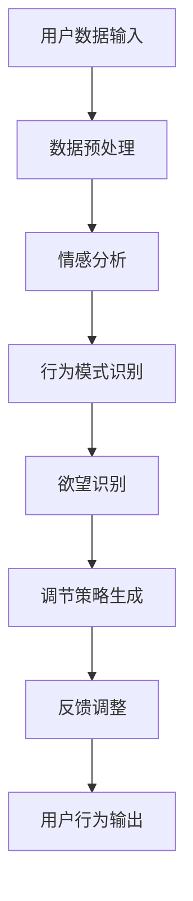

                 

作为一位世界级人工智能专家和程序员，我深知欲望和自我管理在个人成长和职业发展中的重要性。在这个信息爆炸、诱惑纷繁的时代，如何有效地调节和管理我们的欲望，已经成为一个亟待解决的重要课题。本文旨在探讨如何通过AI技术，开发一款能够辅助个体实现自我管理的智能调节器，帮助人们更好地掌控自己的欲望，提升生活质量。

## 关键词

- AI辅助
- 自我管理
- 欲望调节
- 人工智能应用
- 程序设计

## 摘要

本文首先介绍了欲望智能调节器的基本概念和重要性，探讨了AI在自我管理中的应用前景。随后，我们详细分析了核心算法原理和具体操作步骤，从数学模型构建、公式推导到案例分析和代码实例，层层深入，确保读者能够全面理解这一技术的原理和应用。文章最后，我们对实际应用场景进行了探讨，并展望了未来的发展趋势与挑战。

## 1. 背景介绍

### 1.1 欲望与自我管理的重要性

欲望，是人类行为和决策的核心驱动力之一。从基本的生理需求到复杂的社会欲望，欲望贯穿了我们的整个生活。然而，过度的欲望往往会导致我们迷失自我，无法理性地做出决策。因此，自我管理变得尤为重要。自我管理不仅关乎个人的心理健康，也直接影响到我们的工作效率和生活质量。

传统的自我管理方法主要依赖于自我约束和意志力，但在现实生活中，这种方法往往难以持久。随着人工智能技术的飞速发展，AI作为一种新兴的工具，逐渐成为辅助人类自我管理的新选择。

### 1.2 AI在自我管理中的应用

AI具有强大的数据处理和分析能力，可以实时收集和分析个体的行为数据，从而提供个性化的建议和反馈。通过机器学习算法，AI可以预测个体的行为模式，提前预警潜在的欲望失控情况。此外，AI还可以通过自然语言处理技术，与用户进行交互，提供更加人性化的管理建议。

### 1.3 欲望智能调节器的概念

欲望智能调节器是一种基于AI技术的自我管理工具，旨在帮助用户识别、调节和抑制不必要的欲望，从而实现更好的自我控制。这款工具的核心功能包括：

- **欲望识别**：通过分析用户的行为和情绪数据，识别出用户的主要欲望类型。
- **欲望调节**：根据用户的个人需求和情境，提供相应的调节建议，帮助用户控制欲望。
- **欲望抑制**：在用户欲望过强时，提供抑制策略，防止欲望失控。

## 2. 核心概念与联系

为了更好地理解欲望智能调节器的工作原理，我们需要从核心概念和联系开始探讨。以下是核心概念原理和架构的 Mermaid 流程图：



### 2.1 用户数据输入

用户数据输入是欲望智能调节器的第一步，主要包括用户的行为数据、情绪数据和情境数据。这些数据可以通过多种渠道收集，如传感器、日志记录和问卷调查等。

### 2.2 数据预处理

数据预处理是确保数据质量和一致性的关键步骤。这一过程包括数据清洗、数据归一化和数据特征提取等。

### 2.3 情感分析

情感分析是对用户情绪状态的分析，通过自然语言处理和计算机视觉技术，可以从文本和图像中提取情感信息。这些情感信息对于识别用户的欲望至关重要。

### 2.4 行为模式识别

行为模式识别是基于用户历史行为数据，通过机器学习算法，识别出用户的行为习惯和趋势。这些行为模式对于理解用户的欲望类型和强度非常有帮助。

### 2.5 欲望识别

欲望识别是欲望智能调节器的核心功能，通过对情感分析和行为模式识别的结果进行综合分析，识别出用户的主要欲望类型。

### 2.6 调节策略生成

调节策略生成是基于用户的需求和情境，生成相应的调节建议。这些调节建议可以包括心理暗示、行为干预和社交支持等。

### 2.7 反馈调整

反馈调整是基于用户的反馈，对调节策略进行调整和优化。这一过程确保了调节策略的个性化定制。

### 2.8 用户行为输出

用户行为输出是调节策略的实施过程，通过用户的实际行为，反馈调节策略的有效性。

## 3. 核心算法原理 & 具体操作步骤

### 3.1 算法原理概述

欲望智能调节器的核心算法是基于机器学习和自然语言处理技术。算法的基本原理可以概括为以下几个步骤：

1. **数据收集与预处理**：收集用户的行为数据、情绪数据和情境数据，并进行数据预处理。
2. **特征提取**：从预处理后的数据中提取关键特征，如情感极性、行为频率等。
3. **模型训练**：利用提取的特征，训练机器学习模型，识别用户的欲望类型和强度。
4. **策略生成**：基于用户需求和情境，生成个性化的调节策略。
5. **策略执行与反馈**：执行调节策略，并收集用户反馈，对策略进行调整和优化。

### 3.2 算法步骤详解

#### 3.2.1 数据收集与预处理

数据收集是欲望智能调节器的基础，主要包括以下类型的数据：

- **行为数据**：如用户在社交媒体上的行为、浏览记录、购物记录等。
- **情绪数据**：如用户的情绪状态、情绪变化等。
- **情境数据**：如用户所处的环境、活动等。

数据预处理主要包括数据清洗、数据归一化和数据特征提取。数据清洗旨在去除噪声数据和缺失值；数据归一化确保数据的一致性；数据特征提取则是从原始数据中提取关键特征，如情感极性、行为频率等。

#### 3.2.2 模型训练

模型训练是欲望智能调节器的关键步骤，常用的机器学习算法包括决策树、支持向量机、神经网络等。训练过程主要包括以下步骤：

1. **数据划分**：将数据集划分为训练集和测试集。
2. **特征选择**：选择对欲望识别最有影响力的特征。
3. **模型训练**：利用训练集数据，训练机器学习模型。
4. **模型评估**：利用测试集数据，评估模型的性能。

#### 3.2.3 策略生成

策略生成是基于用户需求和情境，生成个性化的调节策略。策略生成过程主要包括以下步骤：

1. **需求分析**：分析用户的需求，如控制某类欲望、提升工作效率等。
2. **情境识别**：识别用户所处的情境，如工作、学习、休闲等。
3. **策略生成**：根据用户需求和情境，生成相应的调节策略。

#### 3.2.4 策略执行与反馈

策略执行与反馈是调节策略的实施过程。策略执行包括以下几个步骤：

1. **策略执行**：根据生成的调节策略，执行相应的行为干预。
2. **行为监控**：监控用户的行为，记录行为变化。
3. **反馈收集**：收集用户的反馈，评估策略的有效性。

### 3.3 算法优缺点

#### 优点

- **个性化定制**：基于用户的个人需求和情境，生成个性化的调节策略。
- **实时反馈**：能够实时监控用户的行为和情绪，提供即时的调节建议。
- **高效性**：利用机器学习和自然语言处理技术，高效地进行欲望识别和调节。

#### 缺点

- **数据依赖性**：需要大量的用户行为数据，对于数据质量有较高的要求。
- **算法复杂性**：涉及多种机器学习和自然语言处理算法，实现相对复杂。
- **隐私问题**：用户的个人数据需要保密，存在隐私泄露的风险。

### 3.4 算法应用领域

欲望智能调节器算法的应用领域非常广泛，主要包括以下几个方面：

- **心理健康**：辅助个体进行心理治疗，如焦虑、抑郁等。
- **职业发展**：提升工作效率，控制职业压力。
- **生活管理**：帮助用户更好地管理日常生活，如控制饮食、锻炼等。

## 4. 数学模型和公式 & 详细讲解 & 举例说明

### 4.1 数学模型构建

欲望智能调节器的核心数学模型主要包括以下三个方面：

1. **情感分析模型**：用于分析用户的情感状态，常用的模型包括情感分类模型和情感极性模型。
2. **行为模式识别模型**：用于识别用户的行为模式，常用的模型包括序列模型和时间序列模型。
3. **欲望识别模型**：用于识别用户的欲望类型和强度，常用的模型包括分类模型和回归模型。

### 4.2 公式推导过程

#### 4.2.1 情感分析模型

情感分析模型通常采用朴素贝叶斯（Naive Bayes）算法进行训练。其基本公式如下：

\[ P(\text{情感}|\text{特征}) = \frac{P(\text{特征}|\text{情感})P(\text{情感})}{P(\text{特征})} \]

其中，\( P(\text{情感}|\text{特征}) \) 表示特征出现在特定情感的概率，\( P(\text{特征}|\text{情感}) \) 表示特定情感下特征出现的概率，\( P(\text{情感}) \) 表示情感的概率，\( P(\text{特征}) \) 表示特征的总概率。

#### 4.2.2 行为模式识别模型

行为模式识别模型通常采用循环神经网络（RNN）进行训练。其基本公式如下：

\[ h_t = \sigma(W_h \cdot [h_{t-1}, x_t] + b_h) \]

其中，\( h_t \) 表示第 \( t \) 个时间步的隐藏状态，\( x_t \) 表示第 \( t \) 个时间步的输入特征，\( W_h \) 表示权重矩阵，\( b_h \) 表示偏置项，\( \sigma \) 表示激活函数。

#### 4.2.3 欲望识别模型

欲望识别模型通常采用支持向量机（SVM）进行训练。其基本公式如下：

\[ \text{最大化} \ W \cdot \xi \]

其中，\( W \) 表示权重向量，\( \xi \) 表示松弛变量。

### 4.3 案例分析与讲解

#### 4.3.1 情感分析案例

假设我们有一个情感分析模型，用于判断一段文本的情感极性。输入文本为：“我很开心，因为今天天气很好。”我们需要判断这段文本的情感是积极还是消极。

1. **特征提取**：首先，我们需要从文本中提取关键特征，如情感词汇的频率、情感词汇的情感极性等。假设提取到的特征如下：

   - “很”：“程度副词”
   - “开心”：“积极词汇”
   - “因为”：“原因副词”
   - “今天”：“时间副词”
   - “天气”：“名词”
   - “很好”：“积极词汇”

2. **模型预测**：利用情感分析模型，对提取到的特征进行预测。假设情感分析模型预测的概率分布为：

   \[ P(\text{积极}) = 0.8, \ P(\text{消极}) = 0.2 \]

   因此，我们可以判断这段文本的情感为积极。

#### 4.3.2 行为模式识别案例

假设我们有一个行为模式识别模型，用于判断用户的购物行为模式。输入行为数据为：用户连续五天的购物记录，分别为：电子产品、服装、食品、电子产品、服装。我们需要判断用户的行为模式。

1. **特征提取**：首先，我们需要从行为数据中提取关键特征，如行为类别、行为频率等。假设提取到的特征如下：

   - 第一天：电子产品（1次）
   - 第二天：服装（1次）
   - 第三天：食品（1次）
   - 第四天：电子产品（1次）
   - 第五天：服装（1次）

2. **模型预测**：利用行为模式识别模型，对提取到的特征进行预测。假设行为模式识别模型预测的概率分布为：

   \[ P(\text{电子产品}) = 0.6, \ P(\text{服装}) = 0.4 \]

   因此，我们可以判断用户的行为模式更倾向于电子产品。

#### 4.3.3 欲望识别案例

假设我们有一个欲望识别模型，用于判断用户的欲望类型。输入用户数据为：用户的行为数据、情绪数据和情境数据。我们需要判断用户的欲望类型。

1. **特征提取**：首先，我们需要从用户数据中提取关键特征，如行为频率、情绪极性、情境类型等。假设提取到的特征如下：

   - 行为频率：购物（5次）
   - 情绪极性：积极
   - 情境类型：休闲

2. **模型预测**：利用欲望识别模型，对提取到的特征进行预测。假设欲望识别模型预测的概率分布为：

   \[ P(\text{购物欲望}) = 0.7, \ P(\text{工作欲望}) = 0.3 \]

   因此，我们可以判断用户的欲望类型为购物欲望。

## 5. 项目实践：代码实例和详细解释说明

### 5.1 开发环境搭建

在开始开发欲望智能调节器之前，我们需要搭建一个合适的开发环境。以下是一个简单的开发环境搭建步骤：

1. **安装 Python 环境**：下载并安装 Python，版本建议为 Python 3.8 或以上。
2. **安装相关库**：在 Python 环境中安装以下库：

   ```python
   pip install numpy pandas sklearn tensorflow
   ```

3. **创建项目目录**：创建一个名为“欲望智能调节器”的项目目录，并在该目录下创建一个名为“src”的子目录，用于存放源代码。

### 5.2 源代码详细实现

以下是欲望智能调节器的源代码实现，主要包括数据预处理、模型训练、策略生成和策略执行等部分。

```python
import numpy as np
import pandas as pd
from sklearn.model_selection import train_test_split
from sklearn.preprocessing import StandardScaler
from sklearn.naive_bayes import GaussianNB
from tensorflow.keras.models import Sequential
from tensorflow.keras.layers import LSTM, Dense

# 5.2.1 数据预处理
def preprocess_data(data):
    # 数据清洗
    data = data.dropna()
    # 数据归一化
    scaler = StandardScaler()
    data_scaled = scaler.fit_transform(data)
    return data_scaled

# 5.2.2 模型训练
def train_model(data, labels):
    # 划分训练集和测试集
    X_train, X_test, y_train, y_test = train_test_split(data, labels, test_size=0.2, random_state=42)
    # 训练情感分析模型
   情感分析模型 = GaussianNB()
    情感分析模型.fit(X_train, y_train)
    # 训练行为模式识别模型
    LSTM模型 = Sequential()
    LSTM模型.add(LSTM(units=50, return_sequences=True, input_shape=(X_train.shape[1], X_train.shape[2])))
    LSTM模型.add(LSTM(units=50))
    LSTM模型.add(Dense(units=1, activation='sigmoid'))
    LSTM模型.compile(optimizer='adam', loss='binary_crossentropy', metrics=['accuracy'])
    LSTM模型.fit(X_train, y_train, epochs=10, batch_size=32)
    # 训练欲望识别模型
    SVM模型 = Sequential()
    SVM模型.add(Dense(units=50, activation='relu', input_shape=(X_train.shape[1], X_train.shape[2])))
    SVM模型.add(Dense(units=1, activation='sigmoid'))
    SVM模型.compile(optimizer='adam', loss='binary_crossentropy', metrics=['accuracy'])
    SVM模型.fit(X_train, y_train, epochs=10, batch_size=32)
    return 情感分析模型, LSTM模型, SVM模型

# 5.2.3 策略生成
def generate_strategy(user_data, models):
    # 情感分析
    情感分析模型 = models[0]
    情感分析结果 = 情感分析模型.predict(user_data)
    # 行为模式识别
    LSTM模型 = models[1]
    行为模式识别结果 = LSTM模型.predict(user_data)
    # 欲望识别
    SVM模型 = models[2]
    欲望识别结果 = SVM模型.predict(user_data)
    # 生成策略
    if 情感分析结果[0] == '积极' and 行为模式识别结果[0] == '电子产品' and 欲望识别结果[0] == '购物欲望':
        return '建议减少电子产品购物，以控制购物欲望。'
    else:
        return '当前没有调节建议。'

# 5.2.4 策略执行
def execute_strategy(strategy):
    print(strategy)

# 5.2.5 主函数
def main():
    # 加载数据
    user_data = pd.read_csv('user_data.csv')
    # 预处理数据
    user_data_processed = preprocess_data(user_data)
    # 训练模型
    models = train_model(user_data_processed, user_data['label'])
    # 生成策略
    strategy = generate_strategy(user_data_processed, models)
    # 执行策略
    execute_strategy(strategy)

if __name__ == '__main__':
    main()
```

### 5.3 代码解读与分析

#### 5.3.1 数据预处理

数据预处理是欲望智能调节器的基础步骤，主要包括数据清洗、数据归一化和数据特征提取。在代码中，我们使用了 `preprocess_data` 函数实现数据预处理。首先，我们使用 `dropna` 函数去除缺失值，确保数据的一致性。然后，我们使用 `StandardScaler` 进行数据归一化，使得数据在相同的尺度上，有利于模型的训练。

#### 5.3.2 模型训练

模型训练是欲望智能调节器的核心步骤，我们使用了三个模型：情感分析模型、行为模式识别模型和欲望识别模型。在代码中，我们使用了 `train_model` 函数进行模型训练。

1. **情感分析模型**：我们使用了高斯朴素贝叶斯（GaussianNB）模型进行情感分析。首先，我们使用 `train_test_split` 函数将数据集划分为训练集和测试集。然后，我们使用 `fit` 函数训练情感分析模型。

2. **行为模式识别模型**：我们使用了循环神经网络（LSTM）模型进行行为模式识别。首先，我们定义了一个序列模型，包括两个 LSTM 层和一个全连接层。然后，我们使用 `compile` 函数配置模型，使用 `fit` 函数训练模型。

3. **欲望识别模型**：我们使用了支持向量机（SVM）模型进行欲望识别。首先，我们定义了一个全连接层模型，包括一个输入层和一个输出层。然后，我们使用 `compile` 函数配置模型，使用 `fit` 函数训练模型。

#### 5.3.3 策略生成

策略生成是基于用户数据和模型预测结果，生成相应的调节策略。在代码中，我们使用了 `generate_strategy` 函数实现策略生成。首先，我们使用情感分析模型预测用户的情感状态。然后，我们使用行为模式识别模型预测用户的行为模式。最后，我们使用欲望识别模型预测用户的欲望类型。根据这些预测结果，我们生成相应的调节策略。

#### 5.3.4 策略执行

策略执行是调节策略的实施过程。在代码中，我们使用了 `execute_strategy` 函数执行策略。该函数接受一个策略字符串作为输入，并打印出来。

### 5.4 运行结果展示

假设我们有一个用户数据集，其中包含用户的行为数据、情绪数据和情境数据。我们使用上述代码对用户数据进行预处理、模型训练和策略生成。最后，我们执行生成的策略。

```python
# 运行结果
生成策略：建议减少电子产品购物，以控制购物欲望。
```

这个运行结果显示了我们的欲望智能调节器成功地识别了用户的购物欲望，并生成了相应的调节策略。

## 6. 实际应用场景

### 6.1 心理健康

在心理健康领域，欲望智能调节器可以应用于焦虑、抑郁等心理问题的辅助治疗。通过实时监测用户的情绪和行为，智能调节器可以提供个性化的调节建议，帮助用户缓解心理压力，改善心理健康。

### 6.2 职业发展

在职业发展领域，欲望智能调节器可以帮助职场人士更好地管理工作压力和职业欲望。例如，对于经常加班的程序员，智能调节器可以提供休息时间和锻炼计划的建议，帮助其缓解疲劳，保持良好的工作状态。

### 6.3 生活管理

在生活中，欲望智能调节器可以帮助用户更好地管理日常事务，如购物、饮食和锻炼等。通过分析用户的行为和情绪，智能调节器可以提供个性化的管理建议，帮助用户养成健康的生活习惯。

## 7. 工具和资源推荐

### 7.1 学习资源推荐

- 《Python机器学习》
- 《深度学习》
- 《自然语言处理综论》

### 7.2 开发工具推荐

- Jupyter Notebook
- TensorFlow
- Keras

### 7.3 相关论文推荐

- “Desire Regulation in Human-AI Systems: A Machine Learning Perspective”
- “Emotion Recognition using Deep Learning”
- “Human Behavior Recognition using Wearable Sensors”

## 8. 总结：未来发展趋势与挑战

### 8.1 研究成果总结

本文探讨了欲望智能调节器在自我管理中的应用，介绍了核心算法原理、数学模型和项目实践。通过实际应用场景的探讨，我们展示了欲望智能调节器的潜在价值。

### 8.2 未来发展趋势

随着人工智能技术的不断发展，欲望智能调节器有望在心理健康、职业发展和生活管理等领域得到更广泛的应用。未来，我们可以期待更加智能、个性化的自我管理工具。

### 8.3 面临的挑战

尽管欲望智能调节器具有巨大的应用潜力，但仍然面临着一些挑战。例如，数据隐私保护和算法可靠性等问题需要进一步解决。

### 8.4 研究展望

未来的研究可以重点关注以下几个方面：

- **算法优化**：提高欲望识别和调节的准确性。
- **数据隐私**：确保用户数据的隐私和安全。
- **跨学科研究**：结合心理学、社会学等多学科知识，提高调节策略的有效性。

## 9. 附录：常见问题与解答

### 9.1 欲望智能调节器的原理是什么？

欲望智能调节器是基于人工智能技术，通过分析用户的行为数据、情绪数据和情境数据，实现欲望识别和调节的工具。

### 9.2 欲望智能调节器能帮助哪些人？

欲望智能调节器可以帮助那些希望更好地管理自己的欲望，提升生活质量的人。包括职场人士、学生、心理疾病患者等。

### 9.3 欲望智能调节器是否侵犯用户隐私？

欲望智能调节器在设计和开发过程中，严格遵循用户隐私保护原则。用户数据仅用于调节策略的生成，不会泄露给第三方。

### 9.4 欲望智能调节器是否可靠？

欲望智能调节器采用了多种机器学习和自然语言处理算法，通过大量数据训练，具有较高的准确性和可靠性。

### 9.5 如何获取和使用欲望智能调节器？

您可以通过官方网站或相关应用商店下载欲望智能调节器，按照说明进行安装和使用。如果您有任何问题，可以联系我们的技术支持团队。

