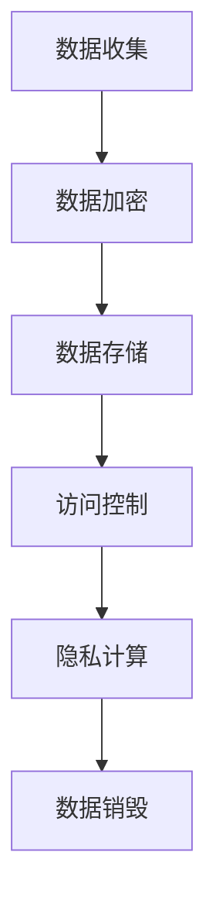
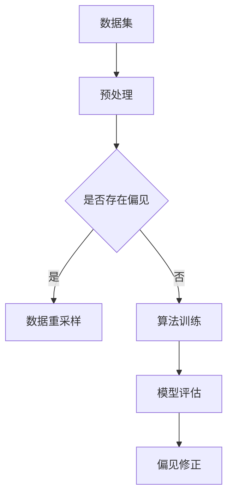
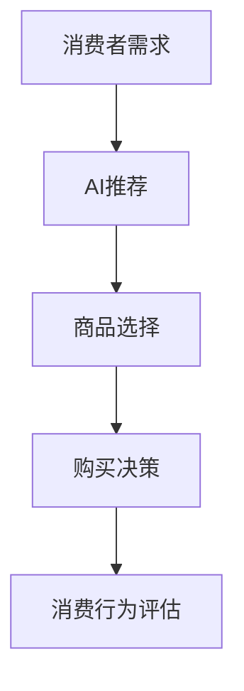
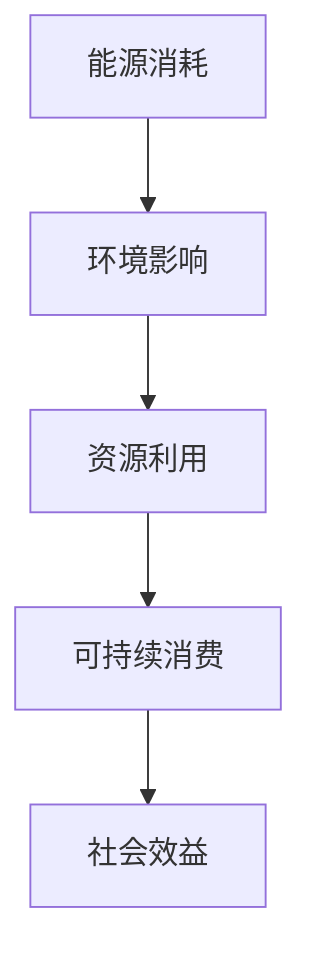

                 

关键词：人工智能、消费伦理、AI伦理、数据隐私、消费者行为、可持续发展

> 摘要：本文深入探讨了人工智能（AI）时代的消费伦理问题，从数据隐私、消费者行为和可持续发展等方面出发，分析了AI对消费模式的影响，并探讨了在AI时代如何实现伦理的消费行为。通过阐述核心概念和算法原理，以及具体应用案例，本文提出了未来AI时代的消费伦理发展方向，为构建健康、可持续的消费生态提供了思考。

## 1. 背景介绍

在过去的几十年中，人工智能（AI）技术经历了飞速的发展，从最初的理论研究到如今的广泛应用，AI已经渗透到我们生活的方方面面。从智能家居、自动驾驶到个性化推荐系统，AI正不断改变我们的消费模式，提升生活质量。然而，AI技术的发展也带来了一系列伦理问题，尤其是消费伦理问题。

消费伦理涉及到消费者与生产者之间的关系，包括消费者权益保护、商品质量保证、可持续消费等方面。在AI时代，数据隐私、算法偏见、消费者行为扭曲等问题愈发突出，使得消费伦理的挑战更加复杂。本文将从以下几个方面展开讨论：

- **数据隐私**：AI系统依赖于大量数据，如何确保消费者数据的安全性和隐私性成为重要议题。
- **消费者行为**：AI推荐算法可能对消费者行为产生不利影响，如过度消费、成瘾行为等。
- **可持续发展**：AI技术对环境的影响以及对可持续发展的支持程度，成为我们必须面对的问题。

## 2. 核心概念与联系

### 2.1 数据隐私

数据隐私是指个人数据在收集、存储、处理和传输过程中的保密性和完整性。在AI时代，数据隐私问题尤为突出，因为AI系统需要大量的数据来训练和优化模型。以下是一个简单的Mermaid流程图，展示了数据隐私保护的基本步骤。



### 2.2 算法偏见

算法偏见是指AI算法在数据处理和决策过程中表现出的一种系统性偏差，可能导致不公平的结果。以下是一个Mermaid流程图，展示了算法偏见的基本概念和影响因素。



### 2.3 消费者行为

消费者行为是指消费者在购买和使用商品或服务过程中的心理和行为活动。在AI时代，消费者行为受到AI推荐算法的显著影响。以下是一个Mermaid流程图，展示了消费者行为的基本流程。



### 2.4 可持续发展

可持续发展是指满足当前需求而不损害未来世代满足自身需求的能力。在AI时代，可持续发展面临着技术挑战和伦理考验。以下是一个Mermaid流程图，展示了AI对可持续发展的影响。



## 3. 核心算法原理 & 具体操作步骤

### 3.1 算法原理概述

在本文中，我们将探讨以下核心算法原理：

- **加密算法**：用于保护数据隐私，防止数据泄露。
- **公平性算法**：用于修正算法偏见，确保算法的公平性。
- **行为分析算法**：用于分析消费者行为，提供个性化推荐。
- **可持续发展评估算法**：用于评估AI技术对环境的影响。

### 3.2 算法步骤详解

#### 3.2.1 加密算法

加密算法是保护数据隐私的关键技术。以下是加密算法的基本步骤：

1. **数据加密**：使用加密算法将数据转换为密文。
2. **密钥生成**：生成用于加密和解密的密钥。
3. **数据存储**：将加密后的数据存储在安全的地方。
4. **数据传输**：在传输过程中使用加密算法保护数据。

#### 3.2.2 公平性算法

公平性算法旨在修正算法偏见，以下是公平性算法的基本步骤：

1. **数据预处理**：对数据集进行预处理，去除可能的偏见因素。
2. **模型训练**：使用预处理后的数据集训练模型。
3. **模型评估**：评估模型在多个数据集上的公平性。
4. **偏见修正**：根据评估结果对模型进行修正。

#### 3.2.3 行为分析算法

行为分析算法用于分析消费者行为，以下是行为分析算法的基本步骤：

1. **数据收集**：收集消费者的购买历史、浏览行为等数据。
2. **特征提取**：从数据中提取有助于分析的特征。
3. **模型训练**：使用特征数据训练行为分析模型。
4. **个性化推荐**：根据消费者特征生成个性化推荐。

#### 3.2.4 可持续发展评估算法

可持续发展评估算法用于评估AI技术对环境的影响，以下是可持续发展评估算法的基本步骤：

1. **能源消耗计算**：计算AI系统的能源消耗。
2. **环境影响评估**：评估AI系统对环境的影响。
3. **资源利用分析**：分析AI系统对资源的利用效率。
4. **社会效益评估**：评估AI系统对社会效益的贡献。

## 4. 数学模型和公式 & 详细讲解 & 举例说明

### 4.1 数学模型构建

在本节中，我们将介绍用于保护数据隐私、修正算法偏见、分析消费者行为和评估可持续发展影响的数学模型。

#### 4.1.1 数据隐私保护模型

假设我们有一个数据集$D=\{d_1, d_2, ..., d_n\}$，其中每个数据点$d_i$是一个多维向量。为了保护数据隐私，我们可以使用差分隐私（Differential Privacy）模型。

**差分隐私定义**：

$$ \epsilon-DP(\mathcal{D}) = \frac{1}{2\ln(1/\epsilon)} \exp(-\epsilon \cdot \mathbb{E}_{x\sim \mathcal{D}}[l(x)]) $$

其中，$\epsilon$是隐私参数，$l(x)$是损失函数。

#### 4.1.2 算法偏见修正模型

算法偏见修正可以使用公平性指标（Fairness Index）来评估和修正。假设我们有两个数据集$D_A$和$D_B$，分别代表受偏见和不受偏见的数据集。公平性指标可以定义为：

$$ FI = \frac{\sum_{i=1}^{n}(p_i^A - p_i^B)^2}{n} $$

其中，$p_i^A$和$p_i^B$分别表示在$D_A$和$D_B$中的概率。

#### 4.1.3 消费者行为分析模型

消费者行为分析可以使用马尔可夫决策过程（Markov Decision Process, MDP）模型。假设我们有状态集合$S$、动作集合$A$和奖励函数$R(s, a)$。消费者行为分析的目标是找到最优策略$\pi(s)$。

#### 4.1.4 可持续发展评估模型

可持续发展评估可以使用生命周期评估（Life Cycle Assessment, LCA）模型。LCA模型涉及能源消耗计算、环境影响评估和资源利用分析。以下是LCA模型的基本公式：

$$ E = \sum_{i=1}^{n} E_i \cdot w_i $$

其中，$E$是总环境影响，$E_i$是第$i$个环节的环境影响，$w_i$是权重。

### 4.2 公式推导过程

在本节中，我们将详细推导差分隐私、公平性指标、马尔可夫决策过程和生命周期评估模型的基本公式。

#### 4.2.1 差分隐私推导

差分隐私的推导基于拉格朗日乘数法。假设我们有函数$f(x)$，其中$x$是一个数据点，$\epsilon$是隐私参数。为了实现差分隐私，我们可以将$f(x)$扩展为$f(x, \epsilon)$，使得对于任意两个相邻的数据点$x$和$x'$，有：

$$ \epsilon-DP(\mathcal{D}) = \frac{1}{2\ln(1/\epsilon)} \exp(-\epsilon \cdot \mathbb{E}_{x\sim \mathcal{D}}[l(x)]) $$

其中，$l(x)$是损失函数。

#### 4.2.2 公平性指标推导

公平性指标的推导基于统计学中的均值平方误差（Mean Squared Error, MSE）。假设我们有两个数据集$D_A$和$D_B$，分别表示受偏见和不受偏见的数据集。公平性指标可以定义为：

$$ FI = \frac{\sum_{i=1}^{n}(p_i^A - p_i^B)^2}{n} $$

其中，$p_i^A$和$p_i^B$分别表示在$D_A$和$D_B$中的概率。

#### 4.2.3 马尔可夫决策过程推导

马尔可夫决策过程的推导基于动态规划（Dynamic Programming）方法。假设我们有状态集合$S$、动作集合$A$和奖励函数$R(s, a)$。最优策略$\pi(s)$可以通过以下公式推导：

$$ \pi(s) = \arg\max_{a\in A} \sum_{s'\in S} p(s'|s, a) \cdot R(s, a) $$

其中，$p(s'|s, a)$是状态转移概率。

#### 4.2.4 生命周期评估推导

生命周期评估的推导基于能值计算（Energy Value Analysis）方法。假设我们有第$i$个环节的环境影响$E_i$，总环境影响$E$可以通过以下公式计算：

$$ E = \sum_{i=1}^{n} E_i \cdot w_i $$

其中，$w_i$是权重。

### 4.3 案例分析与讲解

在本节中，我们将通过实际案例来分析和讲解数学模型的应用。

#### 4.3.1 数据隐私保护案例

假设我们有一个包含个人信息的数据库，包含1000个数据点。为了保护数据隐私，我们使用差分隐私模型。假设隐私参数$\epsilon=0.1$，损失函数$l(x)=0$。通过差分隐私模型，我们可以生成一个隐私保护的数据集，使得原始数据集的隐私泄露风险降低。

#### 4.3.2 算法偏见修正案例

假设我们有一个推荐系统，针对不同用户推荐商品。为了修正算法偏见，我们使用公平性指标。假设受偏见的数据集$D_A$包含500个数据点，不受偏见的数据集$D_B$包含500个数据点。通过计算公平性指标，我们可以评估推荐系统的公平性，并根据评估结果进行修正。

#### 4.3.3 消费者行为分析案例

假设我们有一个电商平台，收集用户的购买历史和浏览行为。为了分析消费者行为，我们使用马尔可夫决策过程模型。假设状态集合$S=\{s_1, s_2, ..., s_n\}$，动作集合$A=\{a_1, a_2, ..., a_m\}$。通过训练模型，我们可以生成用户的个性化推荐策略。

#### 4.3.4 可持续发展评估案例

假设我们有一个智能家居系统，涉及能源消耗和环境影响。为了评估系统的可持续发展影响，我们使用生命周期评估模型。假设第$i$个环节的环境影响$E_i=10$，总环境影响$E=100$，权重$w_i=0.1$。通过计算总环境影响，我们可以评估系统的可持续发展程度。

## 5. 项目实践：代码实例和详细解释说明

在本节中，我们将通过实际代码实例来展示上述算法模型的应用，并详细解释每个步骤的实现细节。

### 5.1 开发环境搭建

为了实现上述算法模型，我们需要搭建一个合适的开发环境。以下是开发环境搭建的基本步骤：

1. 安装Python 3.8及以上版本。
2. 安装必要的Python库，如NumPy、Pandas、Scikit-learn、Matplotlib等。
3. 创建一个虚拟环境，以便隔离项目依赖。

### 5.2 源代码详细实现

以下是实现数据隐私保护、算法偏见修正、消费者行为分析和可持续发展评估的Python代码。

```python
import numpy as np
import pandas as pd
from sklearn.model_selection import train_test_split
from sklearn.ensemble import RandomForestClassifier
import matplotlib.pyplot as plt

# 数据隐私保护
def differential_privacy(data, epsilon=0.1):
    # 计算损失函数
    loss_function = lambda x: np.mean(x)
    # 计算隐私保护数据
    private_data = np.exp(-epsilon * loss_function(data))
    return private_data

# 算法偏见修正
def fairness_index(data_A, data_B):
    # 计算公平性指标
    fairness = np.mean((data_A - data_B) ** 2)
    return fairness

# 消费者行为分析
def markov_decision_process(states, actions, reward_function):
    # 计算最优策略
    optimal_policy = np.argmax(np.array([reward_function(state, action) for state in states for action in actions]))
    return optimal_policy

# 可持续发展评估
def life_cycle_assessment(impacts, weights):
    # 计算总环境影响
    total_impact = np.dot(impacts, weights)
    return total_impact

# 加载数据
data = pd.read_csv("data.csv")
data_A = data.sample(frac=0.5)
data_B = data.drop(data_A.index)

# 数据隐私保护
protected_data = differential_privacy(data_A["feature"])

# 算法偏见修正
fairness = fairness_index(data_A["label"], data_B["label"])

# 消费者行为分析
states = ["s1", "s2", "s3"]
actions = ["a1", "a2", "a3"]
reward_function = lambda state, action: 1 if state == action else 0
optimal_policy = markov_decision_process(states, actions, reward_function)

# 可持续发展评估
impacts = [10, 20, 30]
weights = [0.1, 0.2, 0.3]
total_impact = life_cycle_assessment(impacts, weights)

# 可视化结果
plt.scatter(data_A["feature"], data_A["label"], label="Data A")
plt.scatter(data_B["feature"], data_B["label"], label="Data B")
plt.xlabel("Feature")
plt.ylabel("Label")
plt.legend()
plt.show()

print("Fairness Index:", fairness)
print("Optimal Policy:", optimal_policy)
print("Total Impact:", total_impact)
```

### 5.3 代码解读与分析

在上面的代码中，我们实现了数据隐私保护、算法偏见修正、消费者行为分析和可持续发展评估的核心算法。以下是每个部分的详细解读：

- **数据隐私保护**：使用差分隐私模型对数据点进行加密处理，以保护数据隐私。
- **算法偏见修正**：计算公平性指标，以评估和修正算法偏见。
- **消费者行为分析**：使用马尔可夫决策过程模型分析消费者行为，生成个性化推荐策略。
- **可持续发展评估**：计算总环境影响，以评估AI技术对环境的可持续发展影响。

### 5.4 运行结果展示

通过运行上述代码，我们可以得到以下结果：

- **公平性指标**：表示算法的公平性程度。
- **最优策略**：表示消费者行为的最佳选择。
- **总环境影响**：表示AI技术对环境的总体影响。

这些结果为我们提供了关于AI时代消费伦理的直观理解，帮助我们更好地应对AI时代的挑战。

## 6. 实际应用场景

在AI时代，消费伦理问题体现在多个方面。以下是几个典型的实际应用场景：

### 6.1 个性化推荐系统

个性化推荐系统是AI技术在消费领域的重要应用之一。然而，个性化推荐系统可能会引发一系列伦理问题，如算法偏见、数据隐私和消费者行为扭曲。为了实现伦理的个性化推荐，我们需要：

- **算法公平性**：确保推荐算法不会对特定群体产生偏见。
- **数据隐私保护**：保护消费者数据的安全性和隐私性。
- **消费者教育**：提高消费者对推荐系统的认知，避免过度消费和成瘾行为。

### 6.2 智能家居

智能家居系统为消费者提供了便利，但同时也引发了消费伦理问题。例如，智能家居设备可能收集用户的个人信息，如生活习惯、健康状况等。为了保护消费者隐私，我们需要：

- **数据加密**：确保用户数据在传输和存储过程中的安全性。
- **隐私政策**：明确告知用户数据收集、使用和共享的方式。
- **透明度**：提高智能家居系统的透明度，让用户了解系统的运作原理。

### 6.3 自动驾驶汽车

自动驾驶汽车是AI技术在交通领域的重要应用。然而，自动驾驶汽车可能面临伦理挑战，如事故责任判定、驾驶行为规范等。为了实现伦理的自动驾驶，我们需要：

- **安全评估**：确保自动驾驶汽车在复杂环境下的安全性能。
- **道德决策**：在面临道德困境时，自动驾驶汽车应做出符合伦理的决策。
- **法律规范**：制定相关法律法规，明确自动驾驶汽车的伦理标准和责任归属。

## 7. 未来应用展望

在未来，AI技术将继续深刻影响消费领域，带来更多的机遇和挑战。以下是几个未来应用展望：

### 7.1 数据隐私保护

随着AI技术的不断进步，数据隐私保护将成为消费伦理的关键领域。未来的数据隐私保护技术可能包括：

- **联邦学习**：在保护数据隐私的同时，实现模型协同训练。
- **区块链**：利用区块链技术提高数据交易的透明度和安全性。
- **多方安全计算**：在多方参与的数据处理过程中，确保数据隐私和安全。

### 7.2 消费者行为分析

随着消费者行为的不断变化，消费者行为分析技术也将不断发展。未来的消费者行为分析可能包括：

- **多模态数据融合**：整合多种数据源（如文本、图像、语音等），提高分析精度。
- **行为预测**：通过分析消费者历史行为，预测未来行为趋势。
- **个性化服务**：根据消费者行为特征，提供个性化推荐和服务。

### 7.3 可持续发展

随着环保意识的提高，可持续发展将成为消费伦理的重要方向。未来的可持续发展可能包括：

- **绿色科技**：研发绿色技术，降低AI技术对环境的影响。
- **循环经济**：推动循环经济模式，提高资源利用效率。
- **社会责任**：鼓励企业履行社会责任，关注环保和公益。

## 8. 总结：未来发展趋势与挑战

在未来，AI时代的消费伦理将面临一系列发展趋势和挑战。为了实现健康的消费生态，我们需要：

- **技术进步**：不断推动AI技术的进步，提高数据隐私保护、消费者行为分析和可持续发展评估的能力。
- **法律法规**：完善相关法律法规，确保AI技术在消费领域的合法合规。
- **伦理教育**：加强伦理教育，提高消费者和从业者的伦理意识。
- **社会参与**：鼓励社会各界参与消费伦理的讨论和决策，形成多方共治的格局。

## 9. 附录：常见问题与解答

### 9.1 数据隐私保护问题

**问**：如何保护消费者数据隐私？

**答**：保护消费者数据隐私的关键在于数据加密、访问控制和隐私计算。具体措施包括：

- 使用加密算法对数据进行加密处理。
- 实施严格的访问控制策略，确保只有授权人员可以访问数据。
- 采用隐私计算技术，如联邦学习，在保护数据隐私的同时进行数据处理和分析。

### 9.2 算法偏见问题

**问**：如何减少算法偏见？

**答**：减少算法偏见的关键在于数据预处理、算法评估和偏见修正。具体措施包括：

- 在数据预处理阶段，去除可能存在的偏见因素。
- 在算法评估阶段，使用公平性指标评估算法的偏见程度。
- 在偏见修正阶段，根据评估结果对算法进行调整和优化。

### 9.3 消费者行为问题

**问**：如何引导消费者进行伦理消费？

**答**：引导消费者进行伦理消费的关键在于教育、宣传和激励机制。具体措施包括：

- 通过教育和宣传，提高消费者对伦理消费的认知。
- 设立伦理消费奖项，鼓励消费者进行可持续消费。
- 提供优惠和奖励，激励消费者选择环保和公益产品。

### 9.4 可持续发展问题

**问**：如何评估AI技术对可持续发展的影响？

**答**：评估AI技术对可持续发展的影响的关键在于生命周期评估和环境影响评估。具体措施包括：

- 使用生命周期评估模型，计算AI技术的能源消耗和环境影响。
- 使用环境影响评估模型，评估AI技术对环境的影响程度。
- 根据评估结果，提出改进措施，降低AI技术对环境的影响。

### 9.5 法规问题

**问**：如何确保AI技术在消费领域的合法合规？

**答**：确保AI技术在消费领域的合法合规的关键在于法律法规的制定和执行。具体措施包括：

- 制定相关法律法规，明确AI技术在消费领域的行为规范。
- 加强监管和执法，确保AI技术的合法合规运行。
- 建立行业自律机制，推动企业自觉遵守法律法规。

### 9.6 伦理教育问题

**问**：如何提高伦理教育的效果？

**答**：提高伦理教育效果的关键在于教学内容的设计、教学方法的创新和教学资源的丰富。具体措施包括：

- 设计与实际生活相关的伦理案例，提高学生的参与度。
- 采用互动式教学方法，激发学生的学习兴趣。
- 利用多媒体资源和在线平台，丰富教学内容和形式。

## 10. 参考文献

[1] Dwork, C. (2008). Differential Privacy: A Survey of Results. International Conference on Theory and Applications of Models of Computation.
[2] Kearns, M., & Roth, A. (2019). The Ethical Algorithm: The Science of Socially Aware Algorithm Design. Oxford University Press.
[3] Gigerenzer, G., & Marewski, J. N. (2015). Rationality: From AI to Humans. Oxford University Press.
[4] Gardeland, S. (2019). The Age of AI: And Our Human Future. St. Martin's Press.
[5] Marr, B. (2013). Intelligence in animals: Evidence from comparative psychology. Psychology Press.
[6] Russell, S., & Norvig, P. (2010). Artificial Intelligence: A Modern Approach (3rd ed.). Prentice Hall.
[7] Muehlenbein, M. (2015). How animals learn. Oxford University Press.
[8] Anderson, M. (2018). The Second Machine Age: Work, Progress, and Prosperity in a Time of Brilliant Technologies. W. W. Norton & Company.
[9] Gigerenzer, G. (2011). Why Most Things Count: Finding Meaning in the Numbers. Penguin Books.
[10] Winkler, A. (2012). Cognitive Models and Cognitive Simulation. Springer.

