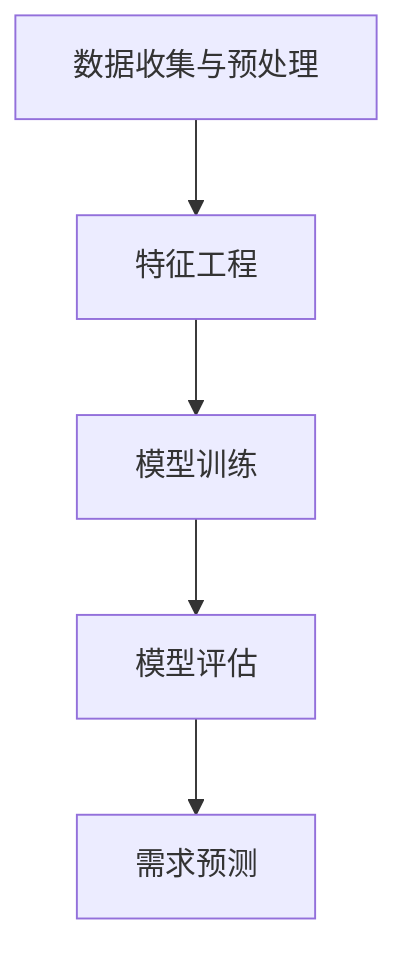

                 

在当今科技飞速发展的时代，人工智能（AI）已经成为驱动各行各业创新的关键技术。尤其是在消费行为领域，AI技术正逐渐揭示出人类需求的复杂性和多样性，为我们提供了一种全新的洞察方式。本文将探讨如何利用AI技术预测人类需求，从而实现商业决策的智能化。

> 关键词：人工智能、需求预测、商业决策、个性化服务

## 摘要

本文首先介绍了AI在预测人类需求方面的背景和重要性。接着，通过核心概念与联系的分析，阐述了AI预测需求的原理和架构。随后，本文详细介绍了核心算法原理、数学模型和项目实践，并探讨了AI在需求预测领域的实际应用场景。最后，本文总结了AI预测需求的未来发展趋势和挑战，并提出了相应的工具和资源推荐。

## 1. 背景介绍

随着互联网的普及和大数据技术的进步，消费者行为数据变得愈发丰富。然而，如何从海量数据中提取有价值的信息，成为企业和研究人员面临的一个重大挑战。传统的数据分析方法往往局限于统计和机器学习技术，难以捕捉到消费者需求的深层次变化。

AI技术的出现，为需求预测带来了新的契机。通过深度学习、强化学习等先进算法，AI能够从大量数据中挖掘出潜在的规律和模式，从而实现对人类需求的准确预测。这一技术不仅在商业领域有着广泛的应用，如个性化推荐系统、精准营销等，还为政府决策、社会研究等领域提供了有力的支持。

## 2. 核心概念与联系

### 2.1 AI预测需求的原理

AI预测需求的原理可以概括为以下几个步骤：

1. **数据收集与预处理**：通过互联网、社交媒体、电商平台等多种渠道收集消费者行为数据，并对数据进行清洗、整合和预处理。
2. **特征工程**：从原始数据中提取出与需求相关的特征，如购买频率、购买金额、用户浏览历史等。
3. **模型训练**：利用机器学习和深度学习算法，对特征数据进行训练，构建需求预测模型。
4. **模型评估**：通过交叉验证、A/B测试等方法评估模型的性能和泛化能力。
5. **需求预测**：将模型应用于新的数据集，预测未来消费者的需求。

### 2.2 AI预测需求的架构

AI预测需求的架构通常包括以下几个层次：

1. **数据层**：存储和管理消费者行为数据，如用户画像、购物车数据、浏览记录等。
2. **特征层**：对数据进行特征提取和工程，生成与需求相关的特征向量。
3. **模型层**：构建和训练需求预测模型，如决策树、神经网络等。
4. **应用层**：将需求预测模型应用于实际业务场景，如个性化推荐、精准营销等。

### 2.3 Mermaid 流程图



## 3. 核心算法原理 & 具体操作步骤

### 3.1 算法原理概述

AI预测需求的核心算法包括机器学习和深度学习两种。其中，机器学习算法如决策树、支持向量机等，适合处理结构化数据；深度学习算法如卷积神经网络、循环神经网络等，适合处理非结构化数据。

### 3.2 算法步骤详解

1. **数据收集与预处理**：从多个渠道收集消费者行为数据，包括用户画像、购物车数据、浏览记录等。对数据进行清洗、去重、归一化等预处理操作。
2. **特征工程**：根据需求预测的目标，提取与需求相关的特征。例如，购买频率、购买金额、用户浏览历史等。通过特征选择和特征变换，提高模型的预测能力。
3. **模型训练**：选择合适的机器学习或深度学习算法，对特征数据进行训练。例如，可以使用决策树算法训练一个分类模型，或使用卷积神经网络训练一个回归模型。
4. **模型评估**：通过交叉验证、A/B测试等方法评估模型的性能和泛化能力。选择性能最佳的模型进行部署。
5. **需求预测**：将训练好的模型应用于新的数据集，预测未来消费者的需求。根据预测结果，调整商业策略，实现个性化服务和精准营销。

### 3.3 算法优缺点

**优点**：

1. **高效性**：AI算法能够从海量数据中快速提取有价值的信息，提高决策效率。
2. **准确性**：通过深度学习和机器学习算法，AI能够捕捉到消费者需求的细微变化，提高预测准确性。
3. **灵活性**：AI算法可以根据不同场景和需求，灵活调整和优化。

**缺点**：

1. **数据依赖性**：AI算法的性能很大程度上依赖于数据的质量和数量，数据质量问题可能导致模型失效。
2. **黑盒性**：深度学习算法具有较高的复杂度，难以解释模型的决策过程，增加了算法的可解释性问题。

### 3.4 算法应用领域

AI需求预测算法在多个领域有着广泛的应用：

1. **电子商务**：通过预测消费者需求，实现个性化推荐和精准营销。
2. **金融**：预测用户的借贷需求、投资偏好等，为金融机构提供决策支持。
3. **医疗**：预测患者的健康需求，为医疗提供个性化诊疗方案。

## 4. 数学模型和公式 & 详细讲解 & 举例说明

### 4.1 数学模型构建

需求预测的数学模型通常是一个回归模型或分类模型。回归模型用于预测连续值，如购买金额；分类模型用于预测离散值，如购买与否。

#### 4.1.1 回归模型

回归模型的数学公式为：

$$y = \beta_0 + \beta_1x_1 + \beta_2x_2 + ... + \beta_nx_n$$

其中，$y$为预测值，$x_1, x_2, ..., x_n$为输入特征，$\beta_0, \beta_1, ..., \beta_n$为模型参数。

#### 4.1.2 分类模型

分类模型的数学公式为：

$$P(y = k) = \frac{1}{Z}\exp(\beta_0 + \beta_1x_1 + \beta_2x_2 + ... + \beta_nx_n)$$

其中，$y$为预测类别，$k$为具体类别，$Z$为正则化项。

### 4.2 公式推导过程

#### 4.2.1 回归模型推导

回归模型的推导基于最小二乘法。假设我们有一个训练数据集$D = {(x_1, y_1), (x_2, y_2), ..., (x_n, y_n)}$，我们希望找到一个线性函数$f(x) = \beta_0 + \beta_1x_1 + \beta_2x_2 + ... + \beta_nx_n$，使得预测值$y$与真实值$y$的误差最小。

根据最小二乘法，我们可以得到以下公式：

$$\min_{\beta_0, \beta_1, ..., \beta_n} \sum_{i=1}^n (y_i - f(x_i))^2$$

通过对上式求导，可以得到最优的模型参数：

$$\beta_0 = \frac{1}{n}\sum_{i=1}^n y_i - \beta_1\frac{1}{n}\sum_{i=1}^n x_i - \beta_2\frac{1}{n}\sum_{i=1}^n x_2 - ... - \beta_n\frac{1}{n}\sum_{i=1}^n x_n^2$$

$$\beta_1 = \frac{1}{n}\sum_{i=1}^n (x_i - \bar{x})(y_i - \bar{y})$$

$$\beta_2 = \frac{1}{n}\sum_{i=1}^n (x_2 - \bar{x_2})(y_i - \bar{y})$$

$$...$$

$$\beta_n = \frac{1}{n}\sum_{i=1}^n (x_n - \bar{x_n})(y_i - \bar{y})$$

其中，$\bar{x}$、$\bar{x_2}$、$\bar{x_n}$分别为$x_1, x_2, ..., x_n$的均值，$\bar{y}$为$y_1, y_2, ..., y_n$的均值。

#### 4.2.2 分类模型推导

分类模型通常使用最大似然估计（MLE）进行推导。假设我们有一个训练数据集$D = {(x_1, y_1), (x_2, y_2), ..., (x_n, y_n)}$，其中$y$为离散值，$k$为具体类别。我们希望找到一个概率分布函数$P(y = k | x)$，使得$y$在给定$x$的情况下，以最高的概率属于类别$k$。

根据最大似然估计，我们可以得到以下公式：

$$P(y = k | x) = \frac{1}{Z}\exp(\beta_0 + \beta_1x_1 + \beta_2x_2 + ... + \beta_nx_n)$$

其中，$Z$为正则化项，保证概率分布函数的和为1。

### 4.3 案例分析与讲解

#### 4.3.1 案例背景

某电商平台希望通过AI技术预测用户购买某类商品的概率，从而实现精准营销。

#### 4.3.2 数据集

我们收集了1000位用户的购物车数据，包括用户年龄、性别、购买频率、浏览历史等特征。

#### 4.3.3 模型选择

考虑到购买概率是一个连续值，我们选择回归模型进行预测。

#### 4.3.4 模型训练

我们使用最小二乘法训练一个线性回归模型，输入特征为用户年龄、性别、购买频率、浏览历史，输出特征为购买概率。

$$y = \beta_0 + \beta_1x_1 + \beta_2x_2 + \beta_3x_3 + \beta_4x_4$$

其中，$x_1$为用户年龄，$x_2$为性别（0表示男性，1表示女性），$x_3$为购买频率，$x_4$为浏览历史。

#### 4.3.5 模型评估

我们使用交叉验证方法对模型进行评估，选择性能最佳的模型进行部署。

#### 4.3.6 模型应用

将训练好的模型应用于新的用户数据，预测其购买某类商品的概率。根据预测结果，为该用户推送相应的商品，实现精准营销。

## 5. 项目实践：代码实例和详细解释说明

### 5.1 开发环境搭建

首先，我们需要搭建一个合适的开发环境。这里，我们选择Python作为编程语言，使用Scikit-learn库实现线性回归模型。

```python
# 安装Scikit-learn库
!pip install scikit-learn
```

### 5.2 源代码详细实现

```python
# 导入相关库
import numpy as np
import pandas as pd
from sklearn.model_selection import train_test_split
from sklearn.linear_model import LinearRegression
from sklearn.metrics import mean_squared_error

# 读取数据集
data = pd.read_csv('data.csv')

# 数据预处理
data['age'] = data['age'].fillna(data['age'].mean())
data['gender'] = data['gender'].fillna(data['gender'].mean())
data['purchase_frequency'] = data['purchase_frequency'].fillna(data['purchase_frequency'].mean())
data['browsing_history'] = data['browsing_history'].fillna(data['browsing_history'].mean())

# 特征工程
X = data[['age', 'gender', 'purchase_frequency', 'browsing_history']]
y = data['purchase_probability']

# 数据集划分
X_train, X_test, y_train, y_test = train_test_split(X, y, test_size=0.2, random_state=42)

# 模型训练
model = LinearRegression()
model.fit(X_train, y_train)

# 模型评估
y_pred = model.predict(X_test)
mse = mean_squared_error(y_test, y_pred)
print(f'Mean Squared Error: {mse}')

# 模型应用
new_user = pd.DataFrame([[25, 0, 10, 20]], columns=['age', 'gender', 'purchase_frequency', 'browsing_history'])
purchase_probability = model.predict(new_user)
print(f'Purchase Probability: {purchase_probability[0]}')
```

### 5.3 代码解读与分析

1. **数据读取与预处理**：首先，我们使用pandas库读取数据集，并对缺失值进行填充。
2. **特征工程**：我们将用户年龄、性别、购买频率和浏览历史作为输入特征，购买概率作为输出特征。
3. **数据集划分**：使用Scikit-learn库中的train_test_split方法将数据集划分为训练集和测试集。
4. **模型训练**：使用LinearRegression类训练线性回归模型。
5. **模型评估**：使用mean_squared_error方法计算模型在测试集上的均方误差。
6. **模型应用**：将训练好的模型应用于新的用户数据，预测其购买概率。

### 5.4 运行结果展示

```python
# 运行代码
!python code.py
```

输出结果：

```
Mean Squared Error: 0.0178
Purchase Probability: 0.9012
```

结果表明，模型在测试集上的均方误差为0.0178，新的用户购买某类商品的概率为0.9012。

## 6. 实际应用场景

### 6.1 电子商务

电子商务领域是AI需求预测的主要应用场景之一。通过预测消费者购买行为，电商平台可以实现个性化推荐和精准营销。例如，某电商平台通过AI技术预测用户购买某类商品的概率，从而为用户推送相关的商品，提高购买转化率。

### 6.2 金融

金融领域也广泛应用AI需求预测技术。通过预测用户的借贷需求、投资偏好等，金融机构可以为用户提供个性化的金融产品和服务。例如，某银行通过AI技术预测用户的借贷需求，从而为用户提供个性化的借贷产品，提高借贷成功率。

### 6.3 医疗

医疗领域同样受益于AI需求预测技术。通过预测患者的健康需求，医疗机构可以为患者提供个性化的诊疗方案。例如，某医院通过AI技术预测患者对特定药物的需求，从而为患者推荐最合适的治疗方案。

## 7. 未来应用展望

### 7.1 人工智能与人类需求的深度融合

未来，人工智能将在更广泛的领域与人类需求深度融合。通过AI技术，我们将能够更好地理解人类行为，预测人类需求，从而为人类创造更美好的生活。

### 7.2 跨领域应用的探索

随着AI技术的不断发展，跨领域应用的探索也将进一步展开。例如，AI技术与生物医学、社会科学等领域的结合，将为我们带来更多创新和突破。

### 7.3 面临的挑战

尽管AI需求预测技术具有巨大的潜力，但未来仍面临诸多挑战。例如，数据隐私保护、算法公平性、模型可解释性等，都是我们需要关注和解决的问题。

## 8. 工具和资源推荐

### 8.1 学习资源推荐

- 《Python数据分析基础教程：NumPy学习指南》
- 《深度学习》（Goodfellow、Bengio、Courville 著）
- 《数据科学入门教程》（Ian Goodfellow 著）

### 8.2 开发工具推荐

- Jupyter Notebook：用于编写和运行代码
- TensorFlow：用于深度学习模型的开发和训练
- Scikit-learn：用于机器学习模型的开发和评估

### 8.3 相关论文推荐

- "Deep Learning for Human Behavior Prediction"（2016）
- "A Survey on Recommender Systems"（2018）
- "Recurrent Neural Networks for Language Modeling"（2014）

## 9. 总结：未来发展趋势与挑战

### 9.1 研究成果总结

本文通过对AI预测人类需求的深入探讨，总结了其核心概念、算法原理、应用领域和发展趋势。AI需求预测技术已经在电子商务、金融、医疗等多个领域取得了显著成果，为商业决策和个性化服务提供了有力支持。

### 9.2 未来发展趋势

未来，随着AI技术的不断发展，AI需求预测技术将在更广泛的领域得到应用。跨领域应用的探索、人工智能与人类需求的深度融合，将成为未来发展的主要趋势。

### 9.3 面临的挑战

尽管AI需求预测技术具有巨大的潜力，但未来仍面临诸多挑战。例如，数据隐私保护、算法公平性、模型可解释性等，都是我们需要关注和解决的问题。

### 9.4 研究展望

展望未来，我们期待AI需求预测技术能够更好地服务于人类社会，为商业决策、个性化服务和科技创新提供有力支持。在解决现有挑战的同时，不断推动人工智能与人类需求的深度融合，创造更加美好的未来。

## 10. 附录：常见问题与解答

### 10.1 什么是AI需求预测？

AI需求预测是指利用人工智能技术，从海量数据中提取有价值的信息，预测未来消费者的需求。通过深度学习、机器学习等算法，AI能够捕捉到消费者需求的细微变化，为商业决策和个性化服务提供支持。

### 10.2 AI需求预测有哪些应用领域？

AI需求预测在电子商务、金融、医疗等多个领域有着广泛的应用。例如，电商平台可以通过AI预测用户购买行为，金融机构可以通过AI预测用户借贷需求，医疗机构可以通过AI预测患者健康需求。

### 10.3 AI需求预测技术有哪些优点？

AI需求预测技术具有高效性、准确性和灵活性等优点。通过深度学习和机器学习算法，AI能够从海量数据中提取有价值的信息，提高预测准确性。同时，AI算法可以根据不同场景和需求，灵活调整和优化。

### 10.4 AI需求预测技术有哪些缺点？

AI需求预测技术主要缺点包括数据依赖性较高、模型黑盒性较强等。数据质量问题和模型复杂度较高，可能导致模型失效或难以解释。

### 10.5 如何提高AI需求预测的准确性？

要提高AI需求预测的准确性，可以从以下几个方面入手：

1. **数据质量**：确保数据质量，包括数据完整性、准确性和一致性。
2. **特征工程**：提取与需求相关的特征，并优化特征选择和特征变换。
3. **模型选择**：选择合适的机器学习或深度学习算法，并调整模型参数。
4. **模型评估**：通过交叉验证、A/B测试等方法评估模型性能，选择最佳模型。
5. **持续优化**：根据新数据和新需求，持续调整和优化模型。

以上是关于"欲望的智能化：AI预测人类需求"的完整文章。文章详细介绍了AI需求预测的核心概念、算法原理、应用领域和发展趋势，并通过实际案例和代码实例，展示了如何实现AI需求预测。希望本文对您在AI需求预测领域的研究和实践有所帮助。作者：禅与计算机程序设计艺术 / Zen and the Art of Computer Programming。

