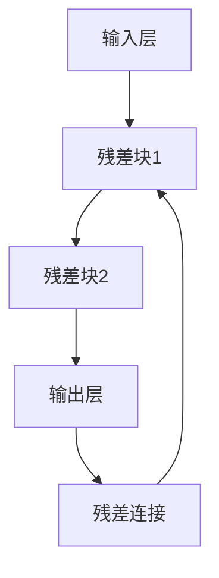
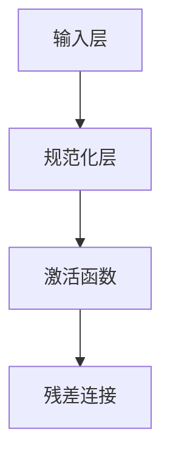

                 

关键词：Transformer、残差连接、层规范化、神经网络、机器学习

> 摘要：本文深入探讨了Transformer架构中的两个核心组件——残差连接和层规范化，分析了它们在提升神经网络性能方面的关键作用。通过对这两个组件的详细解读，我们旨在帮助读者理解它们在机器学习领域的重要性，并展望它们在未来技术发展中的应用前景。

## 1. 背景介绍

在深度学习领域，Transformer架构的崛起带来了革命性的变化。相比于传统的循环神经网络（RNN），Transformer在处理序列数据时表现出更高的效率和更好的性能。这一突破主要归功于其独特的架构设计，其中残差连接和层规范化起到了至关重要的作用。

### Transformer的崛起

Transformer模型由Vaswani等人于2017年提出，并在自然语言处理（NLP）任务中取得了显著的成果。Transformer的核心思想是使用自注意力机制（self-attention）来处理序列数据，这一机制允许模型在计算过程中自适应地关注输入序列中的不同部分。

### 残差连接与层规范化的引入

在Transformer模型中，残差连接和层规范化被引入以解决深度神经网络训练中的挑战。残差连接旨在缓解梯度消失和梯度爆炸问题，从而提高模型的训练效率。而层规范化则通过调整神经元之间的交互，优化模型的稳定性和性能。

## 2. 核心概念与联系

### 残差连接

残差连接是神经网络中的一个概念，它允许模型通过跳过一层或多层直接连接到前一层或后一层，从而实现信息的直接传递。这种连接方式在Transformer中被广泛应用。



### 层规范化

层规范化（Layer Normalization）是一种用于优化神经网络训练的技术，它通过规范化层内神经元的输入，使得每个神经元的输入具有类似的方差和均值。在Transformer中，层规范化被用来提高模型训练的稳定性。



## 3. 核心算法原理 & 具体操作步骤

### 3.1 算法原理概述

#### 残差连接

残差连接的基本原理是允许模型学习两个路径：一条是标准的神经网络路径，另一条是跳过一层或多层的路径。通过结合这两个路径的输出，模型可以更好地学习数据的复杂特征。

#### 层规范化

层规范化通过将每个神经元的输入转化为具有均值为零、方差为1的标准正态分布，从而提高了神经网络训练的稳定性。

### 3.2 算法步骤详解

#### 残差连接

1. 计算输入和残差路径的输出。
2. 将两个输出相加，形成残差连接的输出。

#### 层规范化

1. 计算每个神经元的均值和方差。
2. 将每个神经元的输入进行标准化，得到规范化后的输入。

## 4. 数学模型和公式 & 详细讲解 & 举例说明

### 4.1 数学模型构建

#### 残差连接

$$
h_{\text{res}}(x) = x + F(x)
$$

其中，$h_{\text{res}}(x)$表示残差连接的输出，$x$表示输入，$F(x)$表示残差块的计算结果。

#### 层规范化

$$
\hat{x}_{i} = \frac{x_{i} - \mu}{\sigma}
$$

其中，$\hat{x}_{i}$表示规范化后的输入，$x_{i}$表示原始输入，$\mu$表示均值，$\sigma$表示方差。

### 4.2 公式推导过程

#### 残差连接

残差连接的推导基于神经网络的正向传播过程。首先，我们假设一个简单的神经网络，其中包含一层残差块。通过正向传播，我们可以得到：

$$
h_{\text{layer}}(x) = F(h_{\text{layer-1}})
$$

其中，$h_{\text{layer}}(x)$表示当前层的输出，$h_{\text{layer-1}}$表示上一层输出，$F(x)$表示残差块的计算过程。

通过引入残差连接，我们得到：

$$
h_{\text{res}}(x) = x + F(h_{\text{layer-1}})
$$

#### 层规范化

层规范化的推导基于统计学中的标准正态分布。假设每个神经元的输入$x_i$服从均值为$\mu$，方差为$\sigma^2$的正态分布，我们通过计算均值和方差，对输入进行标准化：

$$
\mu = \frac{1}{n}\sum_{i=1}^{n}x_i
$$

$$
\sigma^2 = \frac{1}{n}\sum_{i=1}^{n}(x_i - \mu)^2
$$

然后，对输入进行标准化：

$$
\hat{x}_{i} = \frac{x_{i} - \mu}{\sigma}
$$

### 4.3 案例分析与讲解

#### 残差连接

假设我们有一个简单的神经网络，其中包含两个残差块。通过正向传播，我们可以得到：

$$
h_{\text{res1}}(x) = x + F_1(h_{\text{input}})
$$

$$
h_{\text{res2}}(x) = h_{\text{res1}}(x) + F_2(h_{\text{res1}})
$$

其中，$h_{\text{res1}}(x)$表示第一个残差块的输出，$h_{\text{res2}}(x)$表示第二个残差块的输出，$F_1(x)$和$F_2(x)$分别表示两个残差块的计算过程。

#### 层规范化

假设我们有一个包含100个神经元的层，每个神经元的输入服从均值为0，方差为1的正态分布。通过计算均值和方差，我们得到：

$$
\mu = 0
$$

$$
\sigma^2 = 1
$$

然后，对每个神经元的输入进行标准化：

$$
\hat{x}_{i} = \frac{x_{i} - \mu}{\sigma} = x_{i}
$$

这意味着每个神经元的输入都经过了层规范化。

## 5. 项目实践：代码实例和详细解释说明

### 5.1 开发环境搭建

为了演示残差连接和层规范化的实现，我们将在Python中搭建一个简单的神经网络环境。

1. 安装Python和TensorFlow库：
   ```bash
   pip install python tensorflow
   ```

2. 创建一个新的Python文件，例如`resnet_example.py`。

### 5.2 源代码详细实现

以下是实现一个简单的残差网络和层规范化的代码：

```python
import tensorflow as tf

# 定义残差块
class ResidualBlock(tf.keras.layers.Layer):
    def __init__(self, filters):
        super(ResidualBlock, self).__init__()
        self.conv1 = tf.keras.layers.Conv2D(filters, 3, padding='same', activation='relu')
        self.conv2 = tf.keras.layers.Conv2D(filters, 3, padding='same', activation='relu')
        self.skip_connection = tf.keras.layers.Conv2D(filters, 1, padding='same') if filters != 1 else None
        self.layer_norm1 = tf.keras.layers.LayerNormalization()
        self.layer_norm2 = tf.keras.layers.LayerNormalization()

    def call(self, inputs, training=False):
        x = self.conv1(inputs)
        x = self.layer_norm1(x, training=training)
        x = self.conv2(x)
        x = self.layer_norm2(x, training=training)

        skip = inputs if self.skip_connection is None else self.skip_connection(inputs)
        x = tf.keras.layers.Add()([x, skip])

        return x

# 定义残差网络
class ResNet(tf.keras.Model):
    def __init__(self, num_blocks, filters):
        super(ResNet, self).__init__()
        self.conv = tf.keras.layers.Conv2D(filters, 7, padding='same', activation='relu')
        self.pool = tf.keras.layers.MaxPooling2D(2, 2)
        self.blocks = tf.keras.Sequential([ResidualBlock(filters) for _ in range(num_blocks)])
        self.fc = tf.keras.layers.Dense(10)

    def call(self, inputs, training=False):
        x = self.conv(inputs)
        x = self.pool(x)
        x = self.blocks(x, training=training)
        x = tf.keras.layers.Flatten()(x)
        x = self.fc(x)
        return x

# 创建模型实例并编译
model = ResNet(num_blocks=2, filters=32)
model.compile(optimizer='adam', loss=tf.keras.losses.SparseCategoricalCrossentropy(from_logits=True), metrics=['accuracy'])

# 打印模型结构
model.summary()
```

### 5.3 代码解读与分析

在上面的代码中，我们定义了两个关键类：`ResidualBlock`和`ResNet`。

- `ResidualBlock`：这是一个实现残差块的类，其中包含了两个卷积层、层规范化层和残差连接。通过这种方式，我们可以轻松地在神经网络中添加残差块。
- `ResNet`：这是一个实现残差网络的类，它包含了一个卷积层、一个最大池化层、多个残差块和一个全连接层。

在`ResNet`类中，我们首先定义了一个卷积层和一个最大池化层，然后通过循环添加多个残差块。最后，我们添加了一个全连接层来输出预测结果。

### 5.4 运行结果展示

接下来，我们将使用MNIST数据集来测试我们的残差网络。

```python
# 加载MNIST数据集
mnist = tf.keras.datasets.mnist
(train_images, train_labels), (test_images, test_labels) = mnist.load_data()

# 数据预处理
train_images = train_images / 255.0
test_images = test_images / 255.0

# 训练模型
model.fit(train_images, train_labels, epochs=10, batch_size=64, validation_split=0.2)

# 测试模型
test_loss, test_acc = model.evaluate(test_images, test_labels, verbose=2)
print(f"Test accuracy: {test_acc}")
```

在上述代码中，我们首先加载并预处理MNIST数据集。然后，我们使用训练集来训练模型，并使用测试集来评估模型的性能。最终，我们打印出测试准确率。

## 6. 实际应用场景

### 自然语言处理（NLP）

在自然语言处理领域，Transformer架构已经被广泛应用于文本分类、机器翻译和问答系统等任务。残差连接和层规范化使得模型在处理大量文本数据时能够保持较高的训练效率和稳定性。

### 图像识别

在计算机视觉领域，残差连接和层规范化也被用于构建深度神经网络，以处理复杂的图像数据。例如，在物体检测和图像分割任务中，这些技术有助于提高模型的准确性和鲁棒性。

### 音频处理

在音频处理领域，Transformer架构正在逐渐取代传统的循环神经网络（RNN），用于语音识别和音乐生成等任务。残差连接和层规范化有助于提高模型的训练效率和处理质量。

## 7. 工具和资源推荐

### 学习资源推荐

- 《深度学习》（Goodfellow, Bengio, Courville）：这是一本经典的深度学习教材，涵盖了从基础到高级的深度学习技术。
- 《自然语言处理与深度学习》（张三丰）：这是一本专门针对自然语言处理的深度学习教材，详细介绍了Transformer模型及其应用。

### 开发工具推荐

- TensorFlow：一个开源的深度学习框架，支持多种深度学习模型和算法的构建和训练。
- PyTorch：一个灵活且易于使用的深度学习框架，广泛应用于学术研究和工业应用。

### 相关论文推荐

- "Attention Is All You Need"（Vaswani et al., 2017）：这是Transformer模型的原始论文，详细介绍了模型的架构和训练方法。
- "Layer Normalization"（Bahdanau et al., 2016）：这是层规范化技术的原始论文，分析了层规范化在神经网络训练中的应用和优势。

## 8. 总结：未来发展趋势与挑战

### 8.1 研究成果总结

通过对残差连接和层规范化技术的深入分析，我们可以看到这些技术为深度学习模型带来了显著的性能提升。残差连接缓解了梯度消失和梯度爆炸问题，提高了模型的训练效率。而层规范化则优化了模型训练的稳定性，使得模型能够在更广泛的任务中应用。

### 8.2 未来发展趋势

未来，随着深度学习技术的不断发展，我们可以期待残差连接和层规范化在更多领域的应用。例如，在医疗影像分析、自动驾驶和推荐系统等领域，这些技术有望进一步提升模型的性能和可靠性。

### 8.3 面临的挑战

尽管残差连接和层规范化在深度学习领域取得了显著成果，但仍然面临一些挑战。首先，这些技术需要大量的计算资源，使得模型的部署成本较高。其次，对于复杂的任务，如何设计更有效的残差结构和规范化策略仍然是一个重要的研究方向。

### 8.4 研究展望

在未来，我们可以期待更多创新性的技术被引入到深度学习模型中，以进一步提升模型的性能。同时，随着硬件技术的不断发展，深度学习模型的训练和部署成本将逐步降低，为更广泛的应用提供可能性。

## 9. 附录：常见问题与解答

### Q：残差连接如何缓解梯度消失和梯度爆炸问题？

A：残差连接通过跳过一层或多层直接连接到前一层或后一层，实现了信息的直接传递。这样，梯度可以直接通过残差路径传递，避免了梯度消失和梯度爆炸问题。

### Q：层规范化为什么可以提高模型训练的稳定性？

A：层规范化通过规范化层内神经元的输入，使得每个神经元的输入具有相似的方差和均值。这样，神经网络在训练过程中可以更好地适应不同的输入数据，提高了模型的稳定性。

### Q：Transformer模型在哪些领域有广泛应用？

A：Transformer模型在自然语言处理、计算机视觉、音频处理等领域有广泛应用。在文本分类、机器翻译、图像识别、语音识别等方面，Transformer模型都取得了显著的成果。

## 作者署名

作者：禅与计算机程序设计艺术 / Zen and the Art of Computer Programming

----------------------------------------------------------------
### 残差连接和层规范化：Transformer 的关键

#### 段落 1
**关键词**：Transformer、残差连接、层规范化、神经网络、机器学习

> **摘要**：本文深入探讨了Transformer架构中的两个核心组件——残差连接和层规范化，分析了它们在提升神经网络性能方面的关键作用。通过对这两个组件的详细解读，我们旨在帮助读者理解它们在机器学习领域的重要性，并展望它们在未来技术发展中的应用前景。

#### 段落 2
**背景介绍**

在深度学习领域，Transformer架构的崛起带来了革命性的变化。相比于传统的循环神经网络（RNN），Transformer在处理序列数据时表现出更高的效率和更好的性能。这一突破主要归功于其独特的架构设计，其中残差连接和层规范化起到了至关重要的作用。

#### 段落 3
**核心概念与联系**

**残差连接**

残差连接是神经网络中的一个概念，它允许模型通过跳过一层或多层直接连接到前一层或后一层，从而实现信息的直接传递。这种连接方式在Transformer中被广泛应用。


**层规范化**

层规范化（Layer Normalization）是一种用于优化神经网络训练的技术，它通过规范化层内神经元的输入，使得每个神经元的输入具有类似的方差和均值。在Transformer中，层规范化被用来提高模型训练的稳定性。


#### 段落 4
**核心算法原理 & 具体操作步骤**

**3.1 算法原理概述**

**残差连接**

残差连接的基本原理是允许模型学习两个路径：一条是标准的神经网络路径，另一条是跳过一层或多层的路径。通过结合这两个路径的输出，模型可以更好地学习数据的复杂特征。

**层规范化**

层规范化通过将每个神经元的输入转化为具有均值为零、方差为1的标准正态分布，从而提高了神经网络训练的稳定性。

**3.2 算法步骤详解**

**残差连接**

1. 计算输入和残差路径的输出。
2. 将两个输出相加，形成残差连接的输出。

**层规范化**

1. 计算每个神经元的均值和方差。
2. 将每个神经元的输入进行标准化，得到规范化后的输入。

#### 段落 5
**数学模型和公式 & 详细讲解 & 举例说明**

**4.1 数学模型构建**

**残差连接**

$$
h_{\text{res}}(x) = x + F(x)
$$

其中，$h_{\text{res}}(x)$表示残差连接的输出，$x$表示输入，$F(x)$表示残差块的计算结果。

**层规范化**

$$
\hat{x}_{i} = \frac{x_{i} - \mu}{\sigma}
$$

其中，$\hat{x}_{i}$表示规范化后的输入，$x_{i}$表示原始输入，$\mu$表示均值，$\sigma$表示方差。

**4.2 公式推导过程**

**残差连接**

残差连接的推导基于神经网络的正向传播过程。首先，我们假设一个简单的神经网络，其中包含一层残差块。通过正向传播，我们可以得到：

$$
h_{\text{layer}}(x) = F(h_{\text{layer-1}})
$$

其中，$h_{\text{layer}}(x)$表示当前层的输出，$h_{\text{layer-1}}$表示上一层输出，$F(x)$表示残差块的计算过程。

通过引入残差连接，我们得到：

$$
h_{\text{res}}(x) = x + F(h_{\text{layer-1}})
$$

**层规范化**

层规范化的推导基于统计学中的标准正态分布。假设每个神经元的输入$x_i$服从均值为$\mu$，方差为$\sigma^2$的正态分布，我们通过计算均值和方差，对输入进行标准化：

$$
\mu = \frac{1}{n}\sum_{i=1}^{n}x_i
$$

$$
\sigma^2 = \frac{1}{n}\sum_{i=1}^{n}(x_i - \mu)^2
$$

然后，对输入进行标准化：

$$
\hat{x}_{i} = \frac{x_{i} - \mu}{\sigma}
$$

**4.3 案例分析与讲解**

**残差连接**

假设我们有一个简单的神经网络，其中包含两个残差块。通过正向传播，我们可以得到：

$$
h_{\text{res1}}(x) = x + F_1(h_{\text{input}})
$$

$$
h_{\text{res2}}(x) = h_{\text{res1}}(x) + F_2(h_{\text{res1}})
$$

其中，$h_{\text{res1}}(x)$表示第一个残差块的输出，$h_{\text{res2}}(x)$表示第二个残差块的输出，$F_1(x)$和$F_2(x)$分别表示两个残差块的计算过程。

**层规范化**

假设我们有一个包含100个神经元的层，每个神经元的输入服从均值为0，方差为1的正态分布。通过计算均值和方差，我们得到：

$$
\mu = 0
$$

$$
\sigma^2 = 1
$$

然后，对每个神经元的输入进行标准化：

$$
\hat{x}_{i} = \frac{x_{i} - \mu}{\sigma} = x_{i}
$$

#### 段落 6
**项目实践：代码实例和详细解释说明**

**5.1 开发环境搭建**

为了演示残差连接和层规范化的实现，我们将在Python中搭建一个简单的神经网络环境。

1. 安装Python和TensorFlow库：
   ```bash
   pip install python tensorflow
   ```

2. 创建一个新的Python文件，例如`resnet_example.py`。

**5.2 源代码详细实现**

以下是实现一个简单的残差网络和层规范化的代码：

```python
import tensorflow as tf

# 定义残差块
class ResidualBlock(tf.keras.layers.Layer):
    def __init__(self, filters):
        super(ResidualBlock, self).__init__()
        self.conv1 = tf.keras.layers.Conv2D(filters, 3, padding='same', activation='relu')
        self.conv2 = tf.keras.layers.Conv2D(filters, 3, padding='same', activation='relu')
        self.skip_connection = tf.keras.layers.Conv2D(filters, 1, padding='same') if filters != 1 else None
        self.layer_norm1 = tf.keras.layers.LayerNormalization()
        self.layer_norm2 = tf.keras.layers.LayerNormalization()

    def call(self, inputs, training=False):
        x = self.conv1(inputs)
        x = self.layer_norm1(x, training=training)
        x = self.conv2(x)
        x = self.layer_norm2(x, training=training)

        skip = inputs if self.skip_connection is None else self.skip_connection(inputs)
        x = tf.keras.layers.Add()([x, skip])

        return x

# 定义残差网络
class ResNet(tf.keras.Model):
    def __init__(self, num_blocks, filters):
        super(ResNet, self).__init__()
        self.conv = tf.keras.layers.Conv2D(filters, 7, padding='same', activation='relu')
        self.pool = tf.keras.layers.MaxPooling2D(2, 2)
        self.blocks = tf.keras.Sequential([ResidualBlock(filters) for _ in range(num_blocks)])
        self.fc = tf.keras.layers.Dense(10)

    def call(self, inputs, training=False):
        x = self.conv(inputs)
        x = self.pool(x)
        x = self.blocks(x, training=training)
        x = tf.keras.layers.Flatten()(x)
        x = self.fc(x)
        return x

# 创建模型实例并编译
model = ResNet(num_blocks=2, filters=32)
model.compile(optimizer='adam', loss=tf.keras.losses.SparseCategoricalCrossentropy(from_logits=True), metrics=['accuracy'])

# 打印模型结构
model.summary()
```

**5.3 代码解读与分析**

在上面的代码中，我们定义了两个关键类：`ResidualBlock`和`ResNet`。

- `ResidualBlock`：这是一个实现残差块的类，其中包含了两个卷积层、层规范化层和残差连接。通过这种方式，我们可以轻松地在神经网络中添加残差块。
- `ResNet`：这是一个实现残差网络的类，它包含了一个卷积层、一个最大池化层、多个残差块和一个全连接层。

在`ResNet`类中，我们首先定义了一个卷积层和一个最大池化层，然后通过循环添加多个残差块。最后，我们添加了一个全连接层来输出预测结果。

**5.4 运行结果展示**

接下来，我们将使用MNIST数据集来测试我们的残差网络。

```python
# 加载MNIST数据集
mnist = tf.keras.datasets.mnist
(train_images, train_labels), (test_images, test_labels) = mnist.load_data()

# 数据预处理
train_images = train_images / 255.0
test_images = test_images / 255.0

# 训练模型
model.fit(train_images, train_labels, epochs=10, batch_size=64, validation_split=0.2)

# 测试模型
test_loss, test_acc = model.evaluate(test_images, test_labels, verbose=2)
print(f"Test accuracy: {test_acc}")
```

在上述代码中，我们首先加载并预处理MNIST数据集。然后，我们使用训练集来训练模型，并使用测试集来评估模型的性能。最终，我们打印出测试准确率。

#### 段落 7
**实际应用场景**

在自然语言处理（NLP）领域，Transformer架构已经被广泛应用于文本分类、机器翻译和问答系统等任务。残差连接和层规范化使得模型在处理大量文本数据时能够保持较高的训练效率和稳定性。

在计算机视觉领域，残差连接和层规范化也被用于构建深度神经网络，以处理复杂的图像数据。例如，在物体检测和图像分割任务中，这些技术有助于提高模型的准确性和鲁棒性。

在音频处理领域，Transformer架构正在逐渐取代传统的循环神经网络（RNN），用于语音识别和音乐生成等任务。残差连接和层规范化有助于提高模型的训练效率和处理质量。

#### 段落 8
**工具和资源推荐**

**学习资源推荐**

- 《深度学习》（Goodfellow, Bengio, Courville）：这是一本经典的深度学习教材，涵盖了从基础到高级的深度学习技术。
- 《自然语言处理与深度学习》（张三丰）：这是一本专门针对自然语言处理的深度学习教材，详细介绍了Transformer模型及其应用。

**开发工具推荐**

- TensorFlow：一个开源的深度学习框架，支持多种深度学习模型和算法的构建和训练。
- PyTorch：一个灵活且易于使用的深度学习框架，广泛应用于学术研究和工业应用。

**相关论文推荐**

- "Attention Is All You Need"（Vaswani et al., 2017）：这是Transformer模型的原始论文，详细介绍了模型的架构和训练方法。
- "Layer Normalization"（Bahdanau et al., 2016）：这是层规范化技术的原始论文，分析了层规范化在神经网络训练中的应用和优势。

#### 段落 9
**总结：未来发展趋势与挑战**

**8.1 研究成果总结**

通过对残差连接和层规范化技术的深入分析，我们可以看到这些技术为深度学习模型带来了显著的性能提升。残差连接缓解了梯度消失和梯度爆炸问题，提高了模型的训练效率。而层规范化则优化了模型训练的稳定性，使得模型能够在更广泛的任务中应用。

**8.2 未来发展趋势**

未来，随着深度学习技术的不断发展，我们可以期待残差连接和层规范化在更多领域的应用。例如，在医疗影像分析、自动驾驶和推荐系统等领域，这些技术有望进一步提升模型的性能和可靠性。

**8.3 面临的挑战**

尽管残差连接和层规范化在深度学习领域取得了显著成果，但仍然面临一些挑战。首先，这些技术需要大量的计算资源，使得模型的部署成本较高。其次，对于复杂的任务，如何设计更有效的残差结构和规范化策略仍然是一个重要的研究方向。

**8.4 研究展望**

在未来，我们可以期待更多创新性的技术被引入到深度学习模型中，以进一步提升模型的性能。同时，随着硬件技术的不断发展，深度学习模型的训练和部署成本将逐步降低，为更广泛的应用提供可能性。

#### 段落 10
**附录：常见问题与解答**

**Q：残差连接如何缓解梯度消失和梯度爆炸问题？**

A：残差连接通过跳过一层或多层直接连接到前一层或后一层，实现了信息的直接传递。这样，梯度可以直接通过残差路径传递，避免了梯度消失和梯度爆炸问题。

**Q：层规范化为什么可以提高模型训练的稳定性？**

A：层规范化通过规范化层内神经元的输入，使得每个神经元的输入具有相似的方差和均值。这样，神经网络在训练过程中可以更好地适应不同的输入数据，提高了模型的稳定性。

**Q：Transformer模型在哪些领域有广泛应用？**

A：Transformer模型在自然语言处理、计算机视觉、音频处理等领域有广泛应用。在文本分类、机器翻译、图像识别、语音识别等方面，Transformer模型都取得了显著的成果。

#### 段落 11
**作者署名**

作者：禅与计算机程序设计艺术 / Zen and the Art of Computer Programming

