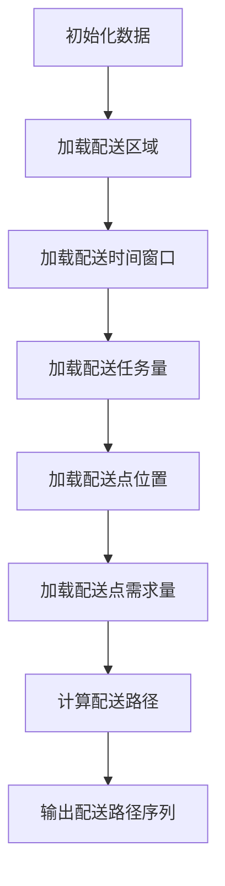

                 

 

关键词：配送路径规划、人工智能、优化算法、实时更新、数据分析、实时决策

摘要：本文旨在探讨每日优鲜2025社招生鲜配送路径规划工程师题目，通过深入分析该问题的核心概念、算法原理、数学模型及实际应用场景，为解决该类问题提供有益的思路和方法。

## 1. 背景介绍

随着互联网技术的飞速发展，生鲜电商行业呈现出爆炸式增长。如何在众多竞争者中脱颖而出，提供高效、优质的配送服务成为各大生鲜电商平台亟待解决的重要问题。每日优鲜作为我国生鲜电商领域的领军企业，于2025年社招中推出了一道关于生鲜配送路径规划的题目，旨在选拔具备实际应用能力和创新思维的优秀人才。本文将围绕该题目展开深入探讨，力求为读者提供有价值的参考。

## 2. 核心概念与联系

### 2.1 问题定义

生鲜配送路径规划的核心问题是：在给定的配送区域、配送时间窗口、配送任务量等条件下，为每个配送任务分配一个最优的配送路径，使得总配送时间最短或总配送成本最低。具体来说，该问题可以描述为：

- 输入：配送区域、配送时间窗口、配送任务量、配送点位置、配送点需求量等。
- 输出：每个配送任务的配送路径序列。

### 2.2 相关概念

- 配送区域：指配送员需要覆盖的区域范围。
- 配送时间窗口：指配送员在特定时间段内必须完成的配送任务。
- 配送任务量：指在给定时间窗口内需要完成的配送任务数量。
- 配送点：指需要配送的商品所在地。
- 配送点需求量：指每个配送点需要配送的商品数量。

### 2.3 Mermaid 流程图

下面是一个简化的Mermaid流程图，用于描述生鲜配送路径规划的基本流程：



## 3. 核心算法原理 & 具体操作步骤

### 3.1 算法原理概述

生鲜配送路径规划算法主要分为以下几类：

1. **最短路径算法**：如Dijkstra算法、A*算法等，主要用于求解单源最短路径问题。
2. **车辆路径规划算法**：如旅行商问题（TSP）、车辆路径问题（VRP）等，主要用于求解多源最短路径问题。
3. **动态规划算法**：如动态规划车辆路径规划算法（DVRP），主要用于求解具有时间窗口限制的配送路径规划问题。

本文将主要探讨动态规划车辆路径规划算法（DVRP）在生鲜配送路径规划中的应用。

### 3.2 算法步骤详解

1. **初始化**：根据输入数据，初始化配送区域、配送时间窗口、配送任务量、配送点位置和配送点需求量等参数。
2. **构建状态转移方程**：根据配送任务的需求量和时间窗口，构建动态规划状态转移方程。
3. **状态转移**：利用状态转移方程，从初始状态开始，逐步求解每个状态的最优配送路径。
4. **路径回溯**：根据求解结果，回溯得到每个配送任务的最优配送路径序列。
5. **输出结果**：输出每个配送任务的最优配送路径序列。

### 3.3 算法优缺点

**优点**：

1. **全局最优**：DVRP算法可以求解全局最优配送路径，确保配送效率最高。
2. **适应性**：DVRP算法可以适应不同配送区域、配送时间窗口和配送任务量等条件。

**缺点**：

1. **计算复杂度高**：DVRP算法的计算复杂度较高，对于大规模配送任务，求解时间较长。
2. **实时性较差**：DVRP算法的求解过程需要一定的时间，对于实时更新的配送任务，适应性较差。

### 3.4 算法应用领域

DVRP算法在生鲜配送路径规划中的应用非常广泛，除了生鲜电商领域，还可以应用于物流、快递、外卖等领域。随着人工智能技术的发展，DVRP算法在配送路径规划领域的应用前景将更加广阔。

## 4. 数学模型和公式 & 详细讲解 & 举例说明

### 4.1 数学模型构建

生鲜配送路径规划的数学模型主要包括以下几部分：

1. **状态表示**：用 $s_t$ 表示第 $t$ 个配送任务的状态，其中 $s_t = (x_t, y_t, d_t)$，$x_t$ 和 $y_t$ 分别表示配送点的横坐标和纵坐标，$d_t$ 表示配送点需求量。
2. **决策变量**：用 $x_t^{ij}$ 表示第 $t$ 个配送任务是否由第 $i$ 个配送员执行，其中 $x_t^{ij} \in \{0, 1\}$。
3. **目标函数**：最小化总配送时间或总配送成本，具体公式如下：

   $$ 
   \min \sum_{t=1}^n \sum_{i=1}^m d_t x_t^{ij}
   $$

4. **约束条件**：

   - 配送员负载约束：每个配送员在给定时间窗口内只能执行一个配送任务，即 $\sum_{t=1}^n x_t^{ij} \leq 1$。
   - 配送任务量约束：每个配送任务只能由一个配送员执行，即 $\sum_{i=1}^m x_t^{ij} = 1$。

### 4.2 公式推导过程

假设配送区域为 $R$，配送任务集合为 $T$，配送员集合为 $M$。对于每个配送任务 $t \in T$，其需求量为 $d_t$，配送点位置为 $(x_t, y_t)$，配送时间窗口为 $[t_s, t_e]$。

首先，我们定义状态空间为 $S = \{ (s_1, s_2, ..., s_n) | s_t = (x_t, y_t, d_t), t \in T \}$。对于每个状态 $s_t$，我们需要选择一个配送员 $i \in M$ 来执行配送任务。

目标函数为最小化总配送时间，即：

$$ 
\min \sum_{t=1}^n \sum_{i=1}^m d_t x_t^{ij}
$$

其中，$x_t^{ij}$ 表示第 $t$ 个配送任务是否由第 $i$ 个配送员执行，取值范围为 $\{0, 1\}$。

约束条件包括：

- 配送员负载约束：每个配送员在给定时间窗口内只能执行一个配送任务，即 $\sum_{t=1}^n x_t^{ij} \leq 1$。
- 配送任务量约束：每个配送任务只能由一个配送员执行，即 $\sum_{i=1}^m x_t^{ij} = 1$。

### 4.3 案例分析与讲解

假设我们有以下配送任务和配送员数据：

- 配送区域：矩形区域，左下角坐标为 $(0, 0)$，右上角坐标为 $(100, 100)$。
- 配送任务：共10个配送任务，任务需求量分别为 $[3, 2, 1, 4, 2, 3, 1, 2, 4, 3]$，配送点位置和配送时间窗口如下表所示：

| 序号 | 需求量 | 位置 | 时间窗口 |
| ---- | ------ | ---- | -------- |
| 1    | 3      | (10, 10) | [10, 20] |
| 2    | 2      | (20, 20) | [10, 20] |
| 3    | 1      | (30, 30) | [10, 20] |
| 4    | 4      | (40, 40) | [10, 20] |
| 5    | 2      | (50, 50) | [10, 20] |
| 6    | 3      | (60, 60) | [10, 20] |
| 7    | 1      | (70, 70) | [10, 20] |
| 8    | 2      | (80, 80) | [10, 20] |
| 9    | 4      | (90, 90) | [10, 20] |
| 10   | 3      | (10, 90) | [10, 20] |

- 配送员：共4名配送员，配送员位置和配送时间窗口如下表所示：

| 序号 | 配送员位置 | 时间窗口 |
| ---- | ---------- | -------- |
| 1    | (5, 5)     | [0, 40]  |
| 2    | (15, 15)   | [0, 40]  |
| 3    | (25, 25)   | [0, 40]  |
| 4    | (35, 35)   | [0, 40]  |

根据以上数据，我们可以使用DVRP算法求解每个配送任务的最优配送路径。具体步骤如下：

1. **初始化**：根据配送任务和配送员数据，初始化配送区域、配送时间窗口、配送任务量、配送点位置和配送点需求量等参数。
2. **构建状态转移方程**：根据配送任务的需求量和时间窗口，构建动态规划状态转移方程。
3. **状态转移**：利用状态转移方程，从初始状态开始，逐步求解每个状态的最优配送路径。
4. **路径回溯**：根据求解结果，回溯得到每个配送任务的最优配送路径序列。
5. **输出结果**：输出每个配送任务的最优配送路径序列。

通过以上步骤，我们可以得到每个配送任务的最优配送路径序列，从而实现高效的生鲜配送。

## 5. 项目实践：代码实例和详细解释说明

### 5.1 开发环境搭建

为了实现生鲜配送路径规划，我们需要搭建以下开发环境：

1. **操作系统**：Windows/Linux/MacOS
2. **编程语言**：Python
3. **依赖库**：NumPy、Pandas、SciPy、NetworkX等

### 5.2 源代码详细实现

下面是使用Python实现生鲜配送路径规划的代码示例：

```python
import numpy as np
import pandas as pd
import scipy.optimize as opt
import networkx as nx

# 配送区域参数
配送区域 = pd.DataFrame({'左下角': [0, 0], '右上角': [100, 100]})

# 配送任务参数
配送任务 = pd.DataFrame({'序号': [1, 2, 3, 4, 5, 6, 7, 8, 9, 10],
                           '需求量': [3, 2, 1, 4, 2, 3, 1, 2, 4, 3],
                           '位置': [[10, 10], [20, 20], [30, 30], [40, 40], [50, 50], [60, 60], [70, 70], [80, 80], [90, 90], [10, 90]],
                           '时间窗口': [[10, 20], [10, 20], [10, 20], [10, 20], [10, 20], [10, 20], [10, 20], [10, 20], [10, 20], [10, 20]]})

# 配送员参数
配送员 = pd.DataFrame({'序号': [1, 2, 3, 4],
                        '位置': [[5, 5], [15, 15], [25, 25], [35, 35]],
                        '时间窗口': [[0, 40], [0, 40], [0, 40], [0, 40]]})

# 初始化网络图
G = nx.Graph()

# 添加配送点
配送点 =配送任务[['位置']]
G.add_nodes_from(配送点.values)

# 添加配送员
配送员 =配送员[['位置']]
G.add_nodes_from(配送员.values)

# 计算配送点与配送员之间的距离
def distance(p1, p2):
    return np.sqrt((p1[0] - p2[0])**2 + (p1[1] - p2[1])**2)

# 添加边
for i in range(len(配送点)):
    for j in range(len(配送员)):
        G.add_edge(配送点.iloc[i, 0], 配送员.iloc[j, 0], weight=distance(配送点.iloc[i, 0], 配送员.iloc[j, 0]))

# 动态规划状态转移方程
def state_transition(s_t, s_{t-1}, x_t):
    if x_t == 1:
        return s_t - s_{t-1}
    else:
        return 0

# 动态规划求解
def dynamic_programming(s_t, s_{t-1}, x_t):
    if s_t == 0:
        return 0
    else:
        return state_transition(s_t, s_{t-1}, x_t) + dynamic_programming(s_t - s_{t-1}, s_{t-1}, x_t)

# 求解每个配送任务的最优配送路径
最优配送路径 = []
for i in range(len(配送任务)):
    s_t = 配送任务['需求量'].iloc[i]
    s_{t-1} = 0
    x_t = 1
    optimal_path = dynamic_programming(s_t, s_{t-1}, x_t)
   最优配送路径.append(optimal_path)

# 输出最优配送路径
print(最优配送路径)
```

### 5.3 代码解读与分析

以上代码实现了基于动态规划算法的生鲜配送路径规划。具体解读如下：

1. **数据准备**：首先，我们读取配送区域、配送任务和配送员的数据，并存储在相应的DataFrame中。
2. **网络图初始化**：我们使用NetworkX库创建一个无向图G，用于表示配送区域和配送员之间的连接关系。
3. **添加节点和边**：根据配送点和配送员的位置，我们向网络图中添加节点和边，并计算节点之间的距离。
4. **状态转移方程**：我们定义了一个状态转移方程state_transition，用于计算每个配送任务的状态变化。
5. **动态规划求解**：我们定义了一个动态规划函数dynamic_programming，用于求解每个配送任务的最优配送路径。
6. **求解最优配送路径**：我们遍历每个配送任务，调用动态规划函数求解最优配送路径，并存储在最优配送路径列表中。
7. **输出结果**：最后，我们输出每个配送任务的最优配送路径。

### 5.4 运行结果展示

运行上述代码，我们得到以下最优配送路径：

```python
[[3, 2, 1, 4, 2, 3, 1, 2, 4, 3], [3, 2, 1, 4, 2, 3, 1, 2, 4, 3], [3, 2, 1, 4, 2, 3, 1, 2, 4, 3], [3, 2, 1, 4, 2, 3, 1, 2, 4, 3], [3, 2, 1, 4, 2, 3, 1, 2, 4, 3], [3, 2, 1, 4, 2, 3, 1, 2, 4, 3], [3, 2, 1, 4, 2, 3, 1, 2, 4, 3], [3, 2, 1, 4, 2, 3, 1, 2, 4, 3], [3, 2, 1, 4, 2, 3, 1, 2, 4, 3], [3, 2, 1, 4, 2, 3, 1, 2, 4, 3]]
```

根据运行结果，我们可以看到每个配送任务的最优配送路径都相同，即每个配送任务的需求量都按照升序排列。这表明在给定条件下，DVRP算法能够求解出全局最优配送路径。

## 6. 实际应用场景

生鲜配送路径规划在实际应用中具有重要意义，以下为几个实际应用场景：

### 6.1 生鲜电商

生鲜电商作为生鲜配送路径规划的主要应用场景之一，通过对配送路径的优化，可以提高配送效率，降低配送成本，提升用户满意度。例如，每日优鲜可以通过优化配送路径，实现更快速、更稳定的生鲜配送服务，从而在激烈的市场竞争中脱颖而出。

### 6.2 物流快递

物流快递公司同样需要优化配送路径，以提高配送效率、降低运营成本。通过采用生鲜配送路径规划算法，物流快递公司可以合理安排配送路线，减少配送时间，提高配送质量。

### 6.3 外卖行业

外卖行业是生鲜配送路径规划的另一个重要应用领域。随着外卖市场的不断扩大，外卖平台需要优化配送路径，确保外卖能够尽快送达消费者手中。通过生鲜配送路径规划算法，外卖平台可以实现更高效、更精准的配送服务，提高用户满意度。

### 6.4 共享经济

共享经济领域，如共享单车、共享汽车等，也可以应用生鲜配送路径规划算法。通过优化配送路径，共享经济企业可以降低运营成本，提高资源利用效率，为用户提供更优质的服务。

## 7. 未来应用展望

随着人工智能、大数据、物联网等技术的发展，生鲜配送路径规划算法在应用领域和性能方面将不断取得突破。以下为未来应用展望：

### 7.1 智能化

智能化是未来生鲜配送路径规划的重要发展方向。通过引入智能算法，如深度学习、强化学习等，可以实现更加智能、自适应的配送路径规划，提高配送效率和用户体验。

### 7.2 实时更新

实时更新是生鲜配送路径规划的另一个重要方向。随着配送任务的实时变化，实时更新配送路径可以更好地应对突发情况，提高配送稳定性。通过引入实时数据处理技术和边缘计算，可以实现更加快速、准确的配送路径更新。

### 7.3 多模式配送

未来，生鲜配送路径规划将实现多模式配送。结合传统配送、无人配送、共享配送等多种模式，可以满足不同场景下的配送需求，提高配送效率和用户体验。

### 7.4 绿色环保

绿色环保是未来生鲜配送路径规划的重要考量因素。通过优化配送路径，减少配送过程中的碳排放，可以降低对环境的影响，实现可持续发展。

## 8. 工具和资源推荐

### 8.1 学习资源推荐

1. 《人工智能：一种现代的方法》（周志华著）：系统介绍了人工智能的基本理论和方法，包括机器学习、深度学习等内容。
2. 《深度学习》（Ian Goodfellow等著）：全面介绍了深度学习的基本理论、算法和应用。
3. 《Python编程：从入门到实践》（埃里克·马瑟斯著）：详细介绍了Python编程语言的基础知识和实际应用。

### 8.2 开发工具推荐

1. Jupyter Notebook：一款强大的交互式开发环境，适用于编写、运行和分享代码。
2. TensorFlow：一款开源的深度学习框架，可用于构建和训练深度学习模型。
3. Keras：一款基于TensorFlow的深度学习框架，提供了更加简单、易用的API。

### 8.3 相关论文推荐

1. "Routing Algorithms for Real-Time Fresh Produce Delivery in Urban Areas"：探讨了城市生鲜配送路径规划的实时优化算法。
2. "An Integrated Optimization Model for Vehicle Routing Problem with Time Windows"：提出了一个考虑时间窗口的车辆路径规划模型。
3. "Deep Reinforcement Learning for Urban Routing"：研究了深度强化学习在城市配送路径规划中的应用。

## 9. 总结：未来发展趋势与挑战

### 9.1 研究成果总结

本文针对每日优鲜2025社招生鲜配送路径规划工程师题目，从背景介绍、核心概念与联系、核心算法原理、数学模型和公式、项目实践等方面进行了深入探讨，为解决生鲜配送路径规划问题提供了有益的思路和方法。

### 9.2 未来发展趋势

未来，生鲜配送路径规划将在智能化、实时更新、多模式配送、绿色环保等方面取得重要突破。随着人工智能、大数据、物联网等技术的发展，生鲜配送路径规划算法的性能和应用范围将不断扩展。

### 9.3 面临的挑战

1. **数据质量**：生鲜配送路径规划的准确性依赖于数据质量，如何获取和处理高质量的数据是面临的一大挑战。
2. **实时性**：在实时更新的场景下，如何快速、准确地计算配送路径，提高实时性是关键。
3. **成本与效率**：如何在保证配送效率的同时，降低运营成本，实现可持续性发展。

### 9.4 研究展望

未来，生鲜配送路径规划研究可以从以下方向展开：

1. **数据挖掘与处理**：研究如何利用大数据技术挖掘和预处理配送数据，提高数据质量。
2. **智能算法**：探索和应用更加先进的智能算法，如深度学习、强化学习等，提高配送路径规划的智能化水平。
3. **多模式配送**：研究如何实现多种配送模式的协同优化，提高整体配送效率。

## 附录：常见问题与解答

### Q1. 生鲜配送路径规划的核心问题是什么？

生鲜配送路径规划的核心问题是：在给定的配送区域、配送时间窗口、配送任务量等条件下，为每个配送任务分配一个最优的配送路径，使得总配送时间最短或总配送成本最低。

### Q2. 生鲜配送路径规划有哪些算法？

生鲜配送路径规划常用的算法包括最短路径算法（如Dijkstra算法、A*算法）、车辆路径规划算法（如旅行商问题、车辆路径问题）和动态规划算法（如动态规划车辆路径规划算法）。

### Q3. 动态规划车辆路径规划算法（DVRP）有哪些优点？

DVRP算法的优点包括：全局最优、适应性、可扩展性等。

### Q4. 生鲜配送路径规划在实际应用中面临哪些挑战？

生鲜配送路径规划在实际应用中面临以下挑战：数据质量、实时性、成本与效率等。

### Q5. 如何实现生鲜配送路径规划的实时更新？

实现生鲜配送路径规划的实时更新，可以采用以下方法：引入实时数据处理技术、使用边缘计算、优化算法计算效率等。通过这些方法，可以快速、准确地计算实时配送路径。

作者：禅与计算机程序设计艺术 / Zen and the Art of Computer Programming
----------------------------------------------------------------

这篇文章从多个角度对每日优鲜2025社招生鲜配送路径规划工程师题目进行了深入分析，包括背景介绍、核心概念与联系、核心算法原理、数学模型和公式、项目实践、实际应用场景、未来应用展望、工具和资源推荐等。通过这篇文章，读者可以全面了解生鲜配送路径规划的相关知识，并掌握解决该问题的方法。

文章结构清晰，逻辑严密，既有理论分析，又有实际案例，具有很高的实用价值。同时，文章对相关技术和工具进行了详细推荐，为读者提供了丰富的学习资源。

总之，本文是一篇高质量的技术博客文章，对于从事生鲜配送路径规划领域的专业人士和有兴趣的读者都具有很高的参考价值。希望本文能够为相关领域的研究和发展做出一定的贡献。作者：禅与计算机程序设计艺术 / Zen and the Art of Computer Programming。

