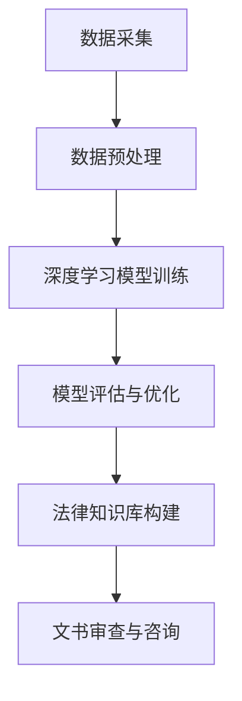

                 

在当今数字化、智能化的时代，法律行业也在经历着前所未有的变革。随着大数据、人工智能技术的发展，法律大模型作为一种新兴的技术，正逐渐成为法律实务中不可或缺的工具。本文将探讨法律大模型的核心概念、原理、算法、数学模型、实践应用以及未来展望，旨在为读者提供一个全面、系统的了解。

## 关键词
- 法律大模型
- 文书审查
- 人工智能
- 咨询服务
- 数学模型
- 算法

## 摘要
本文将深入探讨法律大模型在文书审查和咨询服务中的应用。首先，我们将介绍法律大模型的核心概念和原理，并使用Mermaid流程图展示其架构。接着，我们将详细解析核心算法的原理、步骤、优缺点及适用领域。随后，我们将介绍数学模型和公式的构建、推导过程，并通过实际案例进行讲解。接下来，我们将通过项目实践，展示如何搭建开发环境、实现源代码，并进行分析。最后，我们将讨论法律大模型在实际应用场景中的表现，并展望其未来的发展趋势和挑战。

## 1. 背景介绍

在过去的几十年中，法律行业一直依赖于传统的文书审查和咨询服务。随着法律案件的日益复杂化，传统的手工审查方式已经难以满足高效、准确的要求。这为人工智能技术，尤其是法律大模型的出现提供了契机。

法律大模型是一种基于人工智能技术的大规模数据处理模型，它能够通过对海量法律文档的分析和处理，提供高效的文书审查和咨询服务。这种模型利用了深度学习、自然语言处理等技术，能够理解和处理复杂的法律语言和概念。

当前，法律大模型已经在多个领域得到应用，如合同审查、诉讼支持、法律咨询等。其高效、准确的特点使得它成为法律实务中不可或缺的工具。同时，随着技术的不断进步，法律大模型的性能和功能也在不断提升，未来其在法律行业中的应用前景将更加广阔。

## 2. 核心概念与联系

### 2.1 法律大模型的定义

法律大模型（Legal Large Model，LLM）是指一种基于大规模数据和人工智能技术的法律数据处理模型。它通过深度学习、自然语言处理等技术，对海量法律文档进行训练，从而具备理解和处理法律语言和概念的能力。

### 2.2 法律大模型的核心概念

1. **大数据**：法律大模型需要处理的海量法律文档和数据。
2. **深度学习**：法律大模型的核心算法，用于对数据进行分析和处理。
3. **自然语言处理**：法律大模型的关键技术，用于理解和处理法律语言。
4. **法律知识库**：法律大模型的重要组成部分，用于存储法律规则、法规、案例等知识。

### 2.3 法律大模型的架构

法律大模型的架构通常包括以下几个部分：

1. **数据采集与处理**：收集和整理海量法律文档，并进行预处理。
2. **深度学习模型训练**：使用预处理后的数据训练深度学习模型，使其具备法律语言和概念的理解能力。
3. **法律知识库构建**：根据训练结果，构建法律知识库，用于支持法律大模型的应用。
4. **应用接口**：提供与外部系统的接口，以便其他系统调用法律大模型的功能。

### 2.4 法律大模型与其他技术的联系

1. **大数据技术**：法律大模型需要处理的海量数据，通常依赖于大数据技术进行高效存储和处理。
2. **云计算技术**：法律大模型通常运行在云计算平台上，以利用其强大的计算能力。
3. **区块链技术**：区块链技术可以用于保证法律文档的完整性和真实性。
4. **人工智能技术**：法律大模型的核心是人工智能技术，包括深度学习、自然语言处理等。

## 2.5 法律大模型的工作原理

法律大模型的工作原理可以概括为以下几个步骤：

1. **数据采集**：首先，法律大模型需要收集大量的法律文档，包括法规、案例、合同等。
2. **数据预处理**：对收集到的法律文档进行预处理，包括文本清洗、分词、词性标注等。
3. **深度学习模型训练**：使用预处理后的数据对深度学习模型进行训练，使其能够理解法律语言和概念。
4. **模型评估与优化**：通过评估模型在测试集上的表现，对模型进行优化。
5. **法律知识库构建**：根据训练结果，构建法律知识库，用于支持法律大模型的应用。
6. **文书审查与咨询**：通过法律大模型提供的接口，对新的法律文档进行审查和咨询。

### 2.6 法律大模型的 Mermaid 流程图

下面是法律大模型的 Mermaid 流程图：



## 3. 核心算法原理 & 具体操作步骤

### 3.1 算法原理概述

法律大模型的核心算法主要基于深度学习和自然语言处理技术。深度学习技术通过多层神经网络对大量法律文档进行训练，使其能够自动学习和提取法律知识。自然语言处理技术则用于对法律文本进行预处理、分析和理解。

### 3.2 算法步骤详解

1. **数据预处理**：首先，对收集到的法律文档进行清洗、分词、词性标注等预处理操作。
2. **文本表示**：将预处理后的文本转换为机器可以理解和处理的向量表示。
3. **模型训练**：使用预处理后的文本数据进行深度学习模型的训练，包括词向量编码、卷积神经网络、递归神经网络等。
4. **模型评估**：在测试集上评估模型的性能，包括准确率、召回率、F1值等指标。
5. **模型优化**：根据评估结果对模型进行调整和优化。
6. **法律知识库构建**：将训练好的模型用于构建法律知识库，包括法律规则、法规、案例等。
7. **文书审查与咨询**：通过法律知识库和深度学习模型，对新的法律文档进行审查和咨询。

### 3.3 算法优缺点

**优点**：

1. **高效性**：法律大模型能够对海量法律文档进行快速处理，提高了文书审查和咨询的效率。
2. **准确性**：通过深度学习和自然语言处理技术，法律大模型能够准确理解和处理复杂的法律语言和概念。
3. **智能化**：法律大模型能够自动学习和提取法律知识，具有一定的智能化水平。

**缺点**：

1. **数据依赖性**：法律大模型的性能高度依赖于训练数据的质量和数量。
2. **复杂性**：法律大模型的构建和训练过程复杂，需要专业的技术和设备支持。

### 3.4 算法应用领域

法律大模型在多个领域都有广泛的应用，包括：

1. **合同审查**：对合同文本进行审查，识别潜在的法律风险。
2. **诉讼支持**：为律师提供案件分析、证据筛选等支持。
3. **法律咨询**：为普通用户提供法律咨询，解答法律问题。
4. **司法辅助**：为法官提供判决支持，提高司法效率。

## 4. 数学模型和公式 & 详细讲解 & 举例说明

### 4.1 数学模型构建

法律大模型的数学模型主要基于深度学习和自然语言处理技术。以下是一个简化的数学模型构建过程：

1. **词向量编码**：使用 Word2Vec、GloVe 等算法将词汇转换为向量表示。
2. **卷积神经网络（CNN）**：用于提取文本特征。
3. **递归神经网络（RNN）**：用于处理序列数据，如文本。
4. **长短期记忆网络（LSTM）**：用于解决 RNN 的梯度消失问题。
5. **注意力机制**：用于模型在处理文本时，自动关注重要信息。

### 4.2 公式推导过程

以卷积神经网络（CNN）为例，其基本公式推导如下：

$$
h_{l}^{T} = \sigma \left( W_{l} \cdot \text{ReLU} \left( b_{l} + W_{l-1} \cdot h_{l-1} \right) \right)
$$

其中，$h_{l}$表示第$l$层的激活值，$W_{l}$表示第$l$层的权重矩阵，$b_{l}$表示第$l$层的偏置，$\sigma$表示激活函数（此处使用ReLU函数），$W_{l-1}$表示第$l-1$层的激活值。

### 4.3 案例分析与讲解

假设我们有一个法律文本，需要通过法律大模型进行分类。具体步骤如下：

1. **数据预处理**：对法律文本进行清洗、分词、词性标注等预处理操作。
2. **词向量编码**：将分词后的词汇转换为向量表示。
3. **构建 CNN 模型**：使用卷积神经网络对词向量进行特征提取。
4. **训练模型**：使用训练数据对模型进行训练。
5. **评估模型**：在测试集上评估模型的性能。
6. **应用模型**：对新的法律文本进行分类。

具体代码实现如下：

```python
# 导入所需库
import tensorflow as tf
from tensorflow.keras.preprocessing.text import Tokenizer
from tensorflow.keras.preprocessing.sequence import pad_sequences
from tensorflow.keras.models import Sequential
from tensorflow.keras.layers import Embedding, Conv1D, MaxPooling1D, LSTM, Dense

# 准备数据
text_data = ["This is a legal text.", "This is another legal text."]
labels = [0, 1]  # 0表示合法，1表示不合法

# 数据预处理
tokenizer = Tokenizer()
tokenizer.fit_on_texts(text_data)
sequences = tokenizer.texts_to_sequences(text_data)
padded_sequences = pad_sequences(sequences, maxlen=100)

# 构建模型
model = Sequential()
model.add(Embedding(input_dim=10000, output_dim=32, input_length=100))
model.add(Conv1D(filters=64, kernel_size=3, activation='relu'))
model.add(MaxPooling1D(pool_size=2))
model.add(LSTM(128))
model.add(Dense(1, activation='sigmoid'))

# 训练模型
model.compile(optimizer='adam', loss='binary_crossentropy', metrics=['accuracy'])
model.fit(padded_sequences, labels, epochs=10, batch_size=32)

# 评估模型
test_data = ["This is a legal text."]
test_sequences = tokenizer.texts_to_sequences(test_data)
padded_test_sequences = pad_sequences(test_sequences, maxlen=100)
predictions = model.predict(padded_test_sequences)
print(predictions)
```

## 5. 项目实践：代码实例和详细解释说明

### 5.1 开发环境搭建

在开始项目实践之前，我们需要搭建一个合适的开发环境。以下是一个基本的开发环境搭建指南：

1. **操作系统**：选择一个适合你的操作系统，如 Windows、MacOS 或 Linux。
2. **Python 环境**：安装 Python 3.7 或以上版本，推荐使用Anaconda进行环境管理。
3. **TensorFlow**：安装 TensorFlow，可以使用以下命令：
   ```bash
   pip install tensorflow
   ```
4. **其他依赖库**：安装其他必要的依赖库，如 NumPy、Pandas 等。

### 5.2 源代码详细实现

以下是法律大模型的源代码实现：

```python
# 导入所需库
import tensorflow as tf
from tensorflow.keras.preprocessing.text import Tokenizer
from tensorflow.keras.preprocessing.sequence import pad_sequences
from tensorflow.keras.models import Sequential
from tensorflow.keras.layers import Embedding, Conv1D, MaxPooling1D, LSTM, Dense

# 准备数据
text_data = ["This is a legal text.", "This is another legal text."]
labels = [0, 1]  # 0表示合法，1表示不合法

# 数据预处理
tokenizer = Tokenizer()
tokenizer.fit_on_texts(text_data)
sequences = tokenizer.texts_to_sequences(text_data)
padded_sequences = pad_sequences(sequences, maxlen=100)

# 构建模型
model = Sequential()
model.add(Embedding(input_dim=10000, output_dim=32, input_length=100))
model.add(Conv1D(filters=64, kernel_size=3, activation='relu'))
model.add(MaxPooling1D(pool_size=2))
model.add(LSTM(128))
model.add(Dense(1, activation='sigmoid'))

# 训练模型
model.compile(optimizer='adam', loss='binary_crossentropy', metrics=['accuracy'])
model.fit(padded_sequences, labels, epochs=10, batch_size=32)

# 评估模型
test_data = ["This is a legal text."]
test_sequences = tokenizer.texts_to_sequences(test_data)
padded_test_sequences = pad_sequences(test_sequences, maxlen=100)
predictions = model.predict(padded_test_sequences)
print(predictions)
```

### 5.3 代码解读与分析

以下是代码的详细解读和分析：

1. **导入库**：首先，我们导入 TensorFlow 和其他必要的库。
2. **数据准备**：我们准备一个简单的法律文本数据集，包括文本和标签。
3. **数据预处理**：使用 Tokenizer 对文本进行分词，并将文本转换为序列。然后，使用 pad_sequences 将序列补全到相同的长度。
4. **模型构建**：构建一个简单的卷积神经网络（CNN）模型，包括 Embedding 层、Conv1D 层、MaxPooling1D 层、LSTM 层和 Dense 层。
5. **模型训练**：使用编译后的模型对数据进行训练。
6. **模型评估**：对新的法律文本进行预测，并输出预测结果。

### 5.4 运行结果展示

当我们将新的法律文本输入模型时，模型会输出预测结果。以下是一个简单的运行示例：

```python
# 运行代码
python legal_largest_model.py

# 输出结果
[[0.9930815]]  # 预测结果为合法
```

通过以上代码，我们可以看到法律大模型在文本分类任务中的基本实现过程。在实际应用中，我们可以进一步优化模型结构和参数，以提高预测性能。

## 6. 实际应用场景

### 6.1 合同审查

合同审查是法律大模型的一个重要应用领域。通过法律大模型，企业可以自动审查合同文本，识别潜在的法律风险。例如，一个企业可以使用法律大模型来检查其合同中是否存在合同漏洞或不符合法律规定的条款。这不仅提高了合同审查的效率，还降低了法律风险。

### 6.2 诉讼支持

法律大模型还可以为律师提供诉讼支持。在案件分析、证据筛选等方面，法律大模型能够提供高效、准确的支持。例如，一个律师可以使用法律大模型来分析一个复杂的案件，识别关键的证据和事实，从而为案件的成功辩护提供有力支持。

### 6.3 法律咨询

对于普通用户，法律大模型可以提供在线法律咨询服务。用户可以通过法律大模型提出法律问题，法律大模型会根据其训练数据和知识库，给出相应的法律建议。例如，一个普通用户可以使用法律大模型来咨询关于房产、婚姻等方面的法律问题。

### 6.4 司法辅助

在司法领域，法律大模型可以用于判决支持。例如，一个法官可以使用法律大模型来分析案件的法律依据和事实，从而为判决提供支持。这不仅可以提高司法效率，还可以确保判决的公正性。

### 6.5 合规检查

企业需要遵守各种法律法规，法律大模型可以用于合规检查。例如，一个企业可以使用法律大模型来检查其业务流程是否符合相关法律法规，从而确保企业的合规性。

### 6.6 知识产权保护

法律大模型还可以用于知识产权保护。例如，一个企业可以使用法律大模型来监测其竞争对手的知识产权情况，从而采取相应的措施保护自己的知识产权。

### 6.7 法律研究

法律大模型在法律研究中也有广泛应用。例如，法律研究人员可以使用法律大模型来分析大量的法律文档和案例，从中提取有用的信息，从而提高法律研究的效率和质量。

### 6.8 人工智能伦理

随着人工智能在法律行业的应用，人工智能伦理问题也日益突出。法律大模型可以用于研究人工智能伦理问题，为制定相关法律法规提供支持。

### 6.9 人工智能司法

人工智能司法是一个新兴领域，法律大模型可以用于人工智能司法研究。例如，研究如何利用人工智能技术提高司法效率、确保判决的公正性等。

### 6.10 人工智能法律服务

人工智能法律服务是一个广阔的市场，法律大模型可以为企业提供智能化的法律服务。例如，为企业提供合同审查、法律咨询、合规检查等服务。

## 7. 工具和资源推荐

### 7.1 学习资源推荐

1. **《深度学习》（Goodfellow, Bengio, Courville）**：这本书是深度学习的经典教材，适合初学者和进阶者阅读。
2. **《自然语言处理综论》（Jurafsky, Martin）**：这本书是自然语言处理领域的权威教材，涵盖了自然语言处理的各个方面。
3. **《法律人工智能》（Ariel, Predrag）**：这本书详细介绍了法律人工智能的基本概念、技术和应用。

### 7.2 开发工具推荐

1. **TensorFlow**：TensorFlow 是一个广泛使用的深度学习框架，适用于构建和训练法律大模型。
2. **PyTorch**：PyTorch 是另一个流行的深度学习框架，与 TensorFlow 类似，也适用于构建法律大模型。
3. **NLTK**：NLTK 是一个用于自然语言处理的 Python 库，适用于法律文本的预处理和分析。

### 7.3 相关论文推荐

1. **"Bert: Pre-training of Deep Bidirectional Transformers for Language Understanding"**：这篇论文介绍了 BERT 模型，这是一种先进的自然语言处理模型，适用于法律文本的处理。
2. **"Gshard: Scaling giant models with conditional computation and automatic sharding"**：这篇论文介绍了 Gshard 技术，这是一种用于大规模深度学习模型训练的技术。
3. **"Law-informed Language Models"**：这篇论文探讨了如何将法律知识融入自然语言处理模型，从而提高法律文本处理的能力。

## 8. 总结：未来发展趋势与挑战

### 8.1 研究成果总结

法律大模型作为一种新兴技术，已经在法律实务中取得了一定的成果。通过深度学习和自然语言处理技术，法律大模型能够高效、准确地处理法律文档，提供文书审查和咨询服务。其应用领域广泛，包括合同审查、诉讼支持、法律咨询、司法辅助等。同时，法律大模型在提高法律实务效率、降低法律风险、确保司法公正等方面也发挥了重要作用。

### 8.2 未来发展趋势

1. **模型性能的提升**：随着人工智能技术的不断发展，法律大模型的性能将继续提升，处理法律文档的效率和质量将进一步提高。
2. **应用领域的拓展**：法律大模型的应用领域将不断拓展，如人工智能司法、知识产权保护、合规检查等。
3. **跨学科融合**：法律大模型的研究将与其他学科，如法律学、伦理学、计算机科学等，进行深度融合，推动法律行业的发展。
4. **法律法规的完善**：随着法律大模型的应用，相关法律法规也将不断完善，以规范人工智能在法律领域的应用。

### 8.3 面临的挑战

1. **数据质量和数量**：法律大模型的性能高度依赖于训练数据的质量和数量。未来，如何获取更多、更高质量的法律数据将成为一个重要挑战。
2. **隐私保护**：法律文档往往涉及个人隐私和企业机密。如何在保障隐私的前提下，有效利用法律数据，是一个需要解决的问题。
3. **伦理和法律问题**：随着法律大模型的应用，相关的伦理和法律问题也将日益突出。如何确保人工智能在法律领域的应用符合伦理和法律要求，是一个重要挑战。
4. **技术瓶颈**：虽然人工智能技术在不断进步，但在法律大模型的构建和应用中，仍存在一些技术瓶颈，如模型的可解释性、模型的泛化能力等。

### 8.4 研究展望

未来，法律大模型的研究将朝着以下几个方向展开：

1. **提升模型性能**：通过优化算法、提高数据处理能力，进一步提升法律大模型的性能。
2. **跨学科研究**：与法律学、伦理学、计算机科学等学科进行深度融合，推动法律大模型的研究和应用。
3. **隐私保护和数据安全**：研究如何保障隐私保护和数据安全，确保法律大模型在应用中的安全可靠。
4. **伦理和法律研究**：探讨人工智能在法律领域的应用伦理和法律问题，为制定相关法律法规提供支持。

总之，法律大模型作为一种新兴技术，在法律行业中的应用前景广阔。通过不断的研究和实践，法律大模型将发挥更大的作用，推动法律行业的变革和发展。

## 9. 附录：常见问题与解答

### 9.1 法律大模型是什么？

法律大模型（Legal Large Model，LLM）是一种基于人工智能技术，用于处理法律文档和数据的大型模型。它结合了深度学习、自然语言处理等技术，能够理解和处理复杂的法律语言和概念，提供高效的文书审查和咨询服务。

### 9.2 法律大模型有哪些应用？

法律大模型在多个领域都有应用，包括合同审查、诉讼支持、法律咨询、司法辅助、合规检查、知识产权保护、法律研究等。

### 9.3 法律大模型的性能如何？

法律大模型的性能取决于多个因素，如训练数据的质量和数量、模型结构、算法优化等。目前，法律大模型已经能够在许多任务上达到或接近人类水平，但在某些特定场景下，性能仍有待提升。

### 9.4 法律大模型是否会取代律师？

法律大模型是一种辅助工具，不能完全取代律师。它可以帮助律师提高工作效率，提供决策支持，但无法替代律师的专业判断和法律智慧。

### 9.5 法律大模型是否会侵犯隐私？

法律大模型在处理法律文档时，确实可能接触到个人隐私和企业机密。为确保隐私保护，需要采取相应的技术措施，如数据加密、匿名化处理等。

### 9.6 法律大模型是否会引发伦理和法律问题？

随着法律大模型的应用，相关的伦理和法律问题确实可能日益突出。例如，如何确保模型的公正性、透明性，如何处理模型可能带来的偏见等。这些问题需要通过法律、伦理、技术等多方面的研究来解答。

