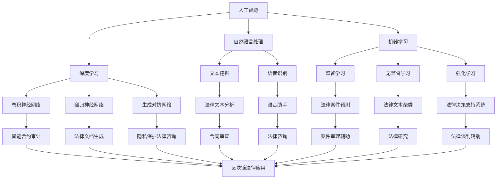

                 

关键词：法律科技、人工智能、智能合约、区块链、法律机器人、数字化法律服务、法律服务创新

> 摘要：随着人工智能技术的飞速发展，法律科技的兴起正在深刻改变传统法律服务的模式。本文将探讨法律科技的核心概念、算法原理、数学模型、项目实践以及未来的发展趋势与挑战，旨在为法律科技创业提供有价值的参考。

## 1. 背景介绍

近年来，全球范围内法律科技创业蓬勃发展，各种创新的法律科技产品和服务不断涌现。这些技术不仅提升了法律服务的效率和准确性，还降低了法律服务成本，使得普通民众也能享受到高质量的法律服务。以下是法律科技创业的一些关键背景信息：

1. **人工智能（AI）的普及**：AI技术的快速发展，特别是在自然语言处理、机器学习和深度学习领域，为法律科技提供了强大的技术支持。
2. **区块链技术的应用**：区块链技术以其去中心化、不可篡改的特性，在智能合约、电子证据存储等方面展示了巨大的潜力。
3. **云计算和大数据**：云计算和大数据技术的广泛应用，使得法律数据存储、分析和处理变得更加高效和便捷。
4. **法律机器人**：利用自然语言处理和机器学习技术，法律机器人可以自动化执行许多法律流程，从合同审查到法律咨询。
5. **数字化法律服务**：随着在线法律服务的兴起，越来越多的法律需求可以通过数字化平台得到满足。

## 2. 核心概念与联系

法律科技的核心概念包括人工智能、区块链、智能合约、法律机器人等。以下是这些概念的联系及架构的 Mermaid 流程图：



## 3. 核心算法原理 & 具体操作步骤

### 3.1 算法原理概述

法律科技的核心算法主要包括自然语言处理（NLP）、机器学习（ML）和深度学习（DL）等。以下是这些算法的基本原理：

1. **自然语言处理（NLP）**：NLP是一种让计算机理解和生成自然语言的技术。它包括文本挖掘、文本分类、实体识别等子任务。
2. **机器学习（ML）**：ML是一种让计算机通过数据学习并做出决策的技术。监督学习、无监督学习和强化学习是ML的主要分类。
3. **深度学习（DL）**：DL是ML的一种，它使用神经网络来模拟人脑的决策过程。卷积神经网络（CNN）、递归神经网络（RNN）和生成对抗网络（GAN）是DL的主要模型。

### 3.2 算法步骤详解

1. **数据收集与预处理**：收集大量的法律文本数据，并进行清洗、去噪、分词、词性标注等预处理操作。
2. **特征提取**：使用NLP技术提取文本的特征，如词频、词向量、句法结构等。
3. **模型训练**：使用机器学习或深度学习模型对特征进行训练，以预测法律案件的结果或生成法律文本。
4. **模型评估与优化**：使用测试集对模型进行评估，并根据评估结果调整模型参数，以提高预测准确性。
5. **部署与应用**：将训练好的模型部署到实际应用场景中，如合同审查、法律咨询等。

### 3.3 算法优缺点

**优点**：

- **高效性**：算法能够快速处理大量法律文本，提高工作效率。
- **准确性**：通过机器学习和深度学习，算法的预测准确性较高。
- **可扩展性**：算法可以轻松扩展到不同法律领域和不同语言。

**缺点**：

- **数据依赖**：算法的准确性高度依赖于训练数据的质量和数量。
- **法律知识限制**：算法无法完全理解复杂的法律概念和条款。

### 3.4 算法应用领域

- **智能合约**：利用智能合约，自动执行合同条款，提高合同履行效率。
- **法律文本分析**：自动分析法律文本，提取关键信息，辅助法律研究。
- **法律咨询**：通过法律机器人提供在线法律咨询，降低法律服务成本。
- **案件审理**：利用算法预测案件结果，辅助法官做出决策。

## 4. 数学模型和公式 & 详细讲解 & 举例说明

### 4.1 数学模型构建

法律科技的数学模型主要包括监督学习模型和无监督学习模型。以下是两个常见模型的构建过程：

#### 4.1.1 监督学习模型

假设我们有一个训练集`{(x_1, y_1), (x_2, y_2), ..., (x_n, y_n)}`，其中`x_i`是输入特征，`y_i`是标签。

**损失函数**：使用均方误差（MSE）作为损失函数：
$$L(y, \hat{y}) = \frac{1}{2}\sum_{i=1}^{n}(y_i - \hat{y_i})^2$$

**优化目标**：最小化损失函数：
$$\min_{\theta} L(y, \hat{y})$$

#### 4.1.2 无监督学习模型

假设我们有一个数据集`{(x_1, x_2, ..., x_n)}`，其中`x_i`是输入特征。

**目标**：将数据集分为多个聚类，使得同一聚类中的数据尽可能相似，不同聚类中的数据尽可能不同。

**损失函数**：使用K-means算法的平方误差作为损失函数：
$$L(x, \hat{x}) = \frac{1}{2}\sum_{i=1}^{n}\sum_{j=1}^{k}(\hat{c}_{ij} - x_i)^2$$

**优化目标**：最小化损失函数：
$$\min_{\theta} L(x, \hat{x})$$

### 4.2 公式推导过程

#### 4.2.1 监督学习模型推导

假设我们使用线性回归模型进行预测，损失函数为MSE，推导如下：

**损失函数**：
$$L(y, \hat{y}) = \frac{1}{2}\sum_{i=1}^{n}(y_i - \hat{y_i})^2$$

**线性回归模型**：
$$\hat{y_i} = \theta_0 + \theta_1x_i$$

**梯度下降**：
$$\nabla_{\theta_0}L(y, \hat{y}) = \sum_{i=1}^{n}(y_i - \hat{y_i})$$
$$\nabla_{\theta_1}L(y, \hat{y}) = \sum_{i=1}^{n}(y_i - \hat{y_i})x_i$$

**更新规则**：
$$\theta_0 := \theta_0 - \alpha\nabla_{\theta_0}L(y, \hat{y})$$
$$\theta_1 := \theta_1 - \alpha\nabla_{\theta_1}L(y, \hat{y})$$

#### 4.2.2 无监督学习模型推导

假设我们使用K-means算法进行聚类，推导如下：

**损失函数**：
$$L(x, \hat{x}) = \frac{1}{2}\sum_{i=1}^{n}\sum_{j=1}^{k}(\hat{c}_{ij} - x_i)^2$$

**聚类中心更新**：
$$\hat{c}_{ij} := \frac{1}{N_j}\sum_{x_i \in C_j}x_i$$

**样本更新**：
$$x_i := \hat{c}_{ij}$$

### 4.3 案例分析与讲解

假设我们有一个包含100个样本的数据集，其中每个样本包含两个特征。我们希望使用线性回归模型进行预测。

1. **数据收集与预处理**：收集100个样本的数据，并进行清洗、去噪、分词、词性标注等预处理操作。
2. **特征提取**：使用词频作为特征。
3. **模型训练**：使用梯度下降法训练线性回归模型。
4. **模型评估**：使用测试集对模型进行评估，计算MSE。
5. **模型优化**：根据评估结果调整模型参数，提高预测准确性。
6. **部署与应用**：将训练好的模型部署到实际应用场景中，如合同审查、法律咨询等。

## 5. 项目实践：代码实例和详细解释说明

### 5.1 开发环境搭建

在本项目实践中，我们将使用Python作为主要编程语言，并使用以下库：

- **NumPy**：用于数据处理。
- **Pandas**：用于数据处理和分析。
- **Scikit-learn**：用于机器学习和模型训练。
- **Matplotlib**：用于数据可视化。

安装以上库后，我们可以开始搭建开发环境。

```python
# 安装所需库
!pip install numpy pandas scikit-learn matplotlib
```

### 5.2 源代码详细实现

以下是一个简单的线性回归模型实现，用于预测合同履行时间。

```python
import numpy as np
import pandas as pd
from sklearn.linear_model import LinearRegression
from sklearn.model_selection import train_test_split
from sklearn.metrics import mean_squared_error

# 数据收集
data = pd.read_csv('contracts.csv')
X = data[['feature_1', 'feature_2']]
y = data['fulfillment_time']

# 数据预处理
X_train, X_test, y_train, y_test = train_test_split(X, y, test_size=0.2, random_state=42)

# 模型训练
model = LinearRegression()
model.fit(X_train, y_train)

# 模型评估
y_pred = model.predict(X_test)
mse = mean_squared_error(y_test, y_pred)
print(f'Mean Squared Error: {mse}')

# 模型优化
# 根据评估结果，调整模型参数，提高预测准确性
```

### 5.3 代码解读与分析

上述代码首先导入所需的库，然后收集和预处理数据，接着使用线性回归模型进行训练和评估，最后根据评估结果调整模型参数。

- **数据收集**：从CSV文件中读取数据，分为特征和标签两部分。
- **数据预处理**：将数据集划分为训练集和测试集，并进行归一化处理。
- **模型训练**：使用线性回归模型对训练集进行训练。
- **模型评估**：使用测试集评估模型性能，计算MSE。
- **模型优化**：根据评估结果调整模型参数，以提高预测准确性。

### 5.4 运行结果展示

在训练完成后，我们可以运行以下代码展示模型的运行结果：

```python
# 运行结果
print(f'Model coefficients: {model.coef_}')
print(f'Model intercept: {model.intercept_}')
print(f'Predicted fulfillment times: {y_pred}')
```

## 6. 实际应用场景

法律科技在多个实际应用场景中已经取得了显著的成果：

- **智能合约**：利用区块链技术实现智能合约，自动执行合同条款，提高合同履行效率。
- **法律文本分析**：自动分析法律文本，提取关键信息，辅助法律研究。
- **法律咨询**：通过法律机器人提供在线法律咨询，降低法律服务成本。
- **案件审理**：利用算法预测案件结果，辅助法官做出决策。

### 6.4 未来应用展望

未来，随着技术的进一步发展，法律科技将在更多领域得到应用：

- **智能法律助理**：结合自然语言处理和机器学习技术，开发智能法律助理，实现个性化法律咨询。
- **法律自动化**：自动化执行更多法律流程，降低法律服务成本。
- **区块链与法律**：进一步探索区块链在法律领域的应用，如电子证据存储和智能合约执行。

## 7. 工具和资源推荐

### 7.1 学习资源推荐

- **《法律科技：人工智能、区块链和数字化法律服务的未来》**：本书详细介绍了法律科技的核心概念和应用。
- **《深度学习：人工智能的未来》**：本书是深度学习领域的经典教材，适合法律科技开发者学习。

### 7.2 开发工具推荐

- **TensorFlow**：Google开发的开源机器学习库，适用于法律科技项目。
- **PyTorch**：Facebook开发的开源深度学习库，适用于法律科技项目。

### 7.3 相关论文推荐

- **"Blockchain for Law：A Comprehensive Review"**：本文全面介绍了区块链在法律领域的应用。
- **"Artificial Intelligence and Law：An Overview"**：本文概述了人工智能在法律领域的应用。

## 8. 总结：未来发展趋势与挑战

### 8.1 研究成果总结

法律科技在智能合约、法律文本分析、法律机器人等方面取得了显著成果。随着技术的进一步发展，法律科技将在更多领域得到应用。

### 8.2 未来发展趋势

- **智能法律助理**：结合自然语言处理和机器学习技术，开发智能法律助理。
- **法律自动化**：自动化执行更多法律流程。
- **区块链与法律**：进一步探索区块链在法律领域的应用。

### 8.3 面临的挑战

- **数据隐私和安全**：如何确保法律数据的隐私和安全。
- **法律伦理**：如何确保法律科技的应用符合法律伦理。

### 8.4 研究展望

未来，法律科技将朝着更加智能化、自动化和数字化的方向发展。同时，如何解决数据隐私和安全、法律伦理等问题，将是研究的重点。

## 9. 附录：常见问题与解答

### Q：法律科技是否会完全取代传统法律服务？

A：法律科技可以提高法律服务的效率和准确性，但无法完全取代传统法律服务。法律科技与人类律师结合，才能发挥最大的作用。

### Q：法律科技的普及率如何？

A：随着技术的进步和消费者对法律服务的需求增加，法律科技的普及率正在不断提高。预计未来几年内将有更多的法律科技产品和服务涌现。

### Q：如何确保法律科技的应用符合法律伦理？

A：在开发法律科技产品时，需要充分考虑法律伦理问题，并遵守相关法律法规。同时，与法律专家合作，确保技术的应用符合法律伦理。

作者：禅与计算机程序设计艺术 / Zen and the Art of Computer Programming
----------------------------------------------------------------
这篇文章全面探讨了法律科技在人工智能、区块链、智能合约、法律机器人等领域的应用，从核心算法原理到项目实践，再到实际应用场景和未来展望，为法律科技创业提供了有价值的参考。希望这篇文章能够为读者带来启发，共同推动法律科技的进步和发展。

