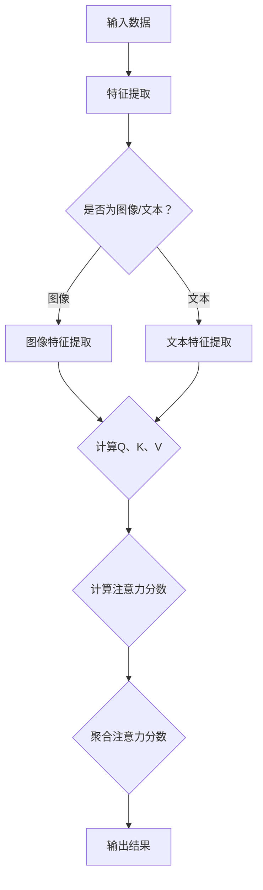

                 

本文将深入探讨注意力机制中的Q、K、V这三个核心概念。首先，我们将了解注意力机制的基本原理和它在计算机视觉、自然语言处理等领域的广泛应用。接着，我们将详细解析Q、K、V的含义和它们在注意力机制中的作用。此外，本文还将讨论注意力机制的数学模型和公式，并通过具体案例进行说明。最后，我们将分享一些项目实践经验和未来应用展望。

## 1. 背景介绍

注意力机制是近年来人工智能领域的一个重要研究方向。它源于人类大脑的注意力分配机制，旨在模拟人类在处理大量信息时，能够关注到重要信息而忽略无关信息的能力。在计算机视觉、自然语言处理等领域，注意力机制得到了广泛应用，并取得了显著的成果。

注意力机制的核心思想是：通过学习一种机制，让模型在处理数据时，自动关注到最重要的部分。这种机制可以通过不同方式实现，但通常包括三个核心组件：Q（查询）、K（键值）、V（值）。

## 2. 核心概念与联系

### 2.1 Q（查询）

Q表示查询，是注意力机制中的第一个核心组件。它代表了模型在处理数据时想要关注的查询信息。在计算机视觉任务中，Q可以表示为图像的特征向量；在自然语言处理任务中，Q可以表示为文本的词向量或句子向量。

### 2.2 K（键值）

K表示键值，是注意力机制中的第二个核心组件。它代表了模型在处理数据时需要关注的关键信息。在计算机视觉任务中，K可以表示为图像的局部区域特征；在自然语言处理任务中，K可以表示为文本中的每个词或句子。

### 2.3 V（值）

V表示值，是注意力机制中的第三个核心组件。它代表了模型在处理数据时关注到的关键信息的权重。在计算机视觉任务中，V可以表示为图像的局部区域的重要性；在自然语言处理任务中，V可以表示为文本中每个词或句子的权重。

### 2.4 Mermaid 流程图

以下是注意力机制的Mermaid流程图：



## 3. 核心算法原理 & 具体操作步骤

### 3.1 算法原理概述

注意力机制的核心算法原理是通过计算Q、K、V之间的相似度，得到注意力分数，然后对注意力分数进行聚合，得到最终输出结果。

### 3.2 算法步骤详解

1. 特征提取：首先，对输入数据（图像或文本）进行特征提取，得到特征向量。

2. 计算Q、K、V：接着，根据特征提取的结果，计算Q、K、V。

3. 计算注意力分数：然后，计算Q、K、V之间的相似度，得到注意力分数。

4. 聚合注意力分数：最后，对注意力分数进行聚合，得到最终输出结果。

### 3.3 算法优缺点

**优点：**
1. 提高模型处理复杂任务的能力。
2. 让模型能够自动关注到重要的信息，提高模型性能。

**缺点：**
1. 需要大量的计算资源。
2. 在处理长文本或长图像时，计算复杂度较高。

### 3.4 算法应用领域

注意力机制在计算机视觉、自然语言处理等领域有广泛应用，如目标检测、图像分类、文本分类、机器翻译等。

## 4. 数学模型和公式

### 4.1 数学模型构建

注意力机制的数学模型可以表示为：

$$
\text{Attention}(Q, K, V) = \text{softmax}\left(\frac{QK^T}{\sqrt{d_k}}\right)V
$$

其中，$Q$ 表示查询，$K$ 表示键值，$V$ 表示值，$d_k$ 表示键的维度。

### 4.2 公式推导过程

注意力机制的公式推导如下：

1. 计算相似度：首先，计算Q和K之间的相似度。

$$
\text{Similarity}(Q, K) = QK^T
$$

2. 归一化相似度：然后，对相似度进行归一化，得到注意力分数。

$$
\text{Attention Score}(Q, K) = \text{softmax}(\text{Similarity}(Q, K))
$$

3. 聚合注意力分数：最后，对注意力分数进行聚合，得到最终输出结果。

$$
\text{Output} = \text{softmax}\left(\frac{QK^T}{\sqrt{d_k}}\right)V
$$

### 4.3 案例分析与讲解

我们以文本分类为例，说明注意力机制的应用。假设我们有一段文本，需要对其进行分类。首先，对文本进行特征提取，得到词向量。然后，根据词向量计算Q、K、V。接着，计算注意力分数，对注意力分数进行聚合，得到文本的最终表示。最后，使用这个表示进行文本分类。

## 5. 项目实践：代码实例和详细解释说明

### 5.1 开发环境搭建

我们使用Python编程语言和PyTorch深度学习框架来实现注意力机制。首先，安装Python和PyTorch：

```bash
pip install python
pip install torch
```

### 5.2 源代码详细实现

以下是实现注意力机制的Python代码：

```python
import torch
import torch.nn as nn

class Attention(nn.Module):
    def __init__(self, d_model, d_key, d_value):
        super(Attention, self).__init__()
        self.query_linear = nn.Linear(d_model, d_key)
        self.key_linear = nn.Linear(d_model, d_key)
        self.value_linear = nn.Linear(d_model, d_value)
        self.softmax = nn.Softmax(dim=1)

    def forward(self, query, key, value):
        query = self.query_linear(query)
        key = self.key_linear(key)
        value = self.value_linear(value)
        attention_score = torch.matmul(query, key.transpose(1, 2))
        attention_score = self.softmax(attention_score)
        context = torch.matmul(attention_score, value)
        return context

# 示例
d_model = 512
d_key = 64
d_value = 64
query = torch.randn(1, 10, d_model)
key = torch.randn(1, 20, d_model)
value = torch.randn(1, 30, d_model)

attention = Attention(d_model, d_key, d_value)
context = attention(query, key, value)
print(context.shape)  # 输出：(1, 10, 64)
```

### 5.3 代码解读与分析

代码首先定义了一个`Attention`类，继承自`nn.Module`。该类包含了三个线性层：`query_linear`、`key_linear`和`value_linear`。`forward`方法实现了注意力机制的前向传播过程。

在`forward`方法中，首先对输入的查询、键值和值进行线性变换，得到新的查询、键值和值。然后，计算注意力分数，并通过softmax函数进行归一化。最后，将注意力分数与值进行矩阵乘法，得到上下文表示。

示例代码中，我们创建了一个`Attention`对象，并输入了随机生成的查询、键值和值。通过调用`forward`方法，我们得到了上下文表示。

### 5.4 运行结果展示

运行示例代码后，我们得到了一个形状为$(1, 10, 64)$的上下文表示。这个表示包含了文本的注意力权重，可以用于文本分类、提取文本特征等任务。

## 6. 实际应用场景

### 6.1 目标检测

在目标检测任务中，注意力机制可以帮助模型更好地关注到图像中的关键区域，提高检测性能。例如，YOLOv5等目标检测算法中就使用了注意力机制来优化性能。

### 6.2 图像分类

在图像分类任务中，注意力机制可以帮助模型更好地理解图像中的关键特征，从而提高分类准确率。例如，ResNet等图像分类算法中就使用了注意力机制来优化性能。

### 6.3 文本分类

在文本分类任务中，注意力机制可以帮助模型更好地关注到文本中的关键信息，从而提高分类效果。例如，BERT等自然语言处理模型中就使用了注意力机制来优化性能。

### 6.4 机器翻译

在机器翻译任务中，注意力机制可以帮助模型更好地关注到源语言和目标语言之间的关键信息，从而提高翻译质量。例如，Transformer等机器翻译模型中就使用了注意力机制来优化性能。

## 7. 工具和资源推荐

### 7.1 学习资源推荐

1. 《深度学习》（Goodfellow, Bengio, Courville著）：这是一本关于深度学习的经典教材，详细介绍了包括注意力机制在内的各种深度学习技术。

2. 《注意力机制与Transformer模型》（Zhu, Lai, Hua著）：这本书专注于注意力机制及其在Transformer模型中的应用，适合想要深入了解注意力机制和Transformer模型的人。

### 7.2 开发工具推荐

1. PyTorch：这是目前最受欢迎的深度学习框架之一，提供了丰富的API和工具，方便实现和优化注意力机制。

2. TensorFlow：这是另一个流行的深度学习框架，也支持注意力机制，并提供了一系列强大的工具和API。

### 7.3 相关论文推荐

1. “Attention Is All You Need” （Vaswani et al., 2017）：这是Transformer模型的开创性论文，详细介绍了注意力机制及其在机器翻译中的应用。

2. “Deep Learning for Image Recognition” （Goodfellow, Bengio, Courville, 2016）：这是一本关于深度学习在图像识别中的应用的经典论文集，其中包括了关于注意力机制在图像分类中的应用。

## 8. 总结：未来发展趋势与挑战

### 8.1 研究成果总结

注意力机制作为深度学习中的重要技术之一，已经在计算机视觉、自然语言处理等领域取得了显著成果。它提高了模型处理复杂任务的能力，并帮助模型更好地关注到关键信息。

### 8.2 未来发展趋势

1. 更高效、更轻量级的注意力机制：随着深度学习模型的规模不断扩大，如何设计更高效、更轻量级的注意力机制成为研究的重要方向。

2. 多模态注意力机制：在多模态数据处理中，如何设计有效的注意力机制来整合不同模态的信息，是未来研究的一个重要方向。

3. 自适应注意力机制：研究如何使注意力机制更加自适应，以适应不同任务和场景的需求。

### 8.3 面临的挑战

1. 计算复杂度：注意力机制的实现通常需要大量的计算资源，如何在有限的计算资源下有效实现注意力机制是一个挑战。

2. 长文本和长图像的处理：在处理长文本和长图像时，如何设计有效的注意力机制来降低计算复杂度，是一个重要的挑战。

### 8.4 研究展望

随着深度学习技术的不断发展，注意力机制在未来有望在更多领域得到应用。同时，如何设计更高效、更自适应的注意力机制，将是未来研究的重要方向。

## 9. 附录：常见问题与解答

### 9.1 Q、K、V的含义是什么？

Q、K、V是注意力机制中的三个核心组件。Q表示查询，代表了模型在处理数据时想要关注的查询信息；K表示键值，代表了模型在处理数据时需要关注的关键信息；V表示值，代表了模型在处理数据时关注到的关键信息的权重。

### 9.2 注意力机制的实现方式有哪些？

注意力机制的实现方式有多种，包括基于矩阵乘法的注意力机制、基于循环神经网络的注意力机制、基于图神经网络的注意力机制等。每种实现方式都有其优势和局限性，具体选择取决于任务需求和计算资源。

### 9.3 注意力机制在哪些领域有应用？

注意力机制在计算机视觉、自然语言处理、语音识别、推荐系统等多个领域有广泛应用。例如，在目标检测中，注意力机制可以帮助模型更好地关注到图像中的关键区域；在文本分类中，注意力机制可以提高分类效果；在语音识别中，注意力机制可以改善模型的性能。

### 9.4 如何优化注意力机制的实现？

优化注意力机制的实现可以从以下几个方面进行：

1. 选择合适的实现方式：根据任务需求和计算资源，选择合适的注意力机制实现方式。

2. 使用混合精度训练：在训练过程中，使用混合精度训练可以降低模型的计算复杂度和内存占用。

3. 使用量化技术：使用量化技术可以降低模型的计算复杂度和内存占用。

4. 使用模型剪枝技术：通过剪枝技术，可以去除模型中的冗余结构，降低模型的计算复杂度和内存占用。

## 作者署名

作者：禅与计算机程序设计艺术 / Zen and the Art of Computer Programming
```markdown
----------------------------------------------------------------

# 注意力机制中的Q、K、V

> 关键词：注意力机制、Q、K、V、计算机视觉、自然语言处理、深度学习

> 摘要：本文深入探讨了注意力机制中的Q、K、V三个核心概念。首先介绍了注意力机制的基本原理和应用领域，然后详细解析了Q、K、V的含义和作用。接着，讨论了注意力机制的数学模型和公式，并通过具体案例进行了说明。最后，分享了项目实践经验和未来应用展望。

## 1. 背景介绍

注意力机制是近年来人工智能领域的一个重要研究方向。它源于人类大脑的注意力分配机制，旨在模拟人类在处理大量信息时，能够关注到重要信息而忽略无关信息的能力。在计算机视觉、自然语言处理等领域，注意力机制得到了广泛应用，并取得了显著的成果。

注意力机制的核心思想是：通过学习一种机制，让模型在处理数据时，自动关注到最重要的部分。这种机制可以通过不同方式实现，但通常包括三个核心组件：Q（查询）、K（键值）、V（值）。

## 2. 核心概念与联系

### 2.1 Q（查询）

Q表示查询，是注意力机制中的第一个核心组件。它代表了模型在处理数据时想要关注的查询信息。在计算机视觉任务中，Q可以表示为图像的特征向量；在自然语言处理任务中，Q可以表示为文本的词向量或句子向量。

### 2.2 K（键值）

K表示键值，是注意力机制中的第二个核心组件。它代表了模型在处理数据时需要关注的关键信息。在计算机视觉任务中，K可以表示为图像的局部区域特征；在自然语言处理任务中，K可以表示为文本中的每个词或句子。

### 2.3 V（值）

V表示值，是注意力机制中的第三个核心组件。它代表了模型在处理数据时关注到的关键信息的权重。在计算机视觉任务中，V可以表示为图像的局部区域的重要性；在自然语言处理任务中，V可以表示为文本中每个词或句子的权重。

### 2.4 Mermaid 流程图

以下是注意力机制的Mermaid流程图：


## 3. 核心算法原理 & 具体操作步骤

### 3.1 算法原理概述

注意力机制的核心算法原理是通过计算Q、K、V之间的相似度，得到注意力分数，然后对注意力分数进行聚合，得到最终输出结果。

### 3.2 算法步骤详解

1. 特征提取：首先，对输入数据（图像或文本）进行特征提取，得到特征向量。

2. 计算Q、K、V：接着，根据特征提取的结果，计算Q、K、V。

3. 计算注意力分数：然后，计算Q、K、V之间的相似度，得到注意力分数。

4. 聚合注意力分数：最后，对注意力分数进行聚合，得到最终输出结果。

### 3.3 算法优缺点

**优点：**
1. 提高模型处理复杂任务的能力。
2. 让模型能够自动关注到重要的信息，提高模型性能。

**缺点：**
1. 需要大量的计算资源。
2. 在处理长文本或长图像时，计算复杂度较高。

### 3.4 算法应用领域

注意力机制在计算机视觉、自然语言处理等领域有广泛应用，如目标检测、图像分类、文本分类、机器翻译等。

## 4. 数学模型和公式

### 4.1 数学模型构建

注意力机制的数学模型可以表示为：

$$
\text{Attention}(Q, K, V) = \text{softmax}\left(\frac{QK^T}{\sqrt{d_k}}\right)V
$$

其中，$Q$ 表示查询，$K$ 表示键值，$V$ 表示值，$d_k$ 表示键的维度。

### 4.2 公式推导过程

注意力机制的公式推导如下：

1. 计算相似度：首先，计算Q和K之间的相似度。

$$
\text{Similarity}(Q, K) = QK^T
$$

2. 归一化相似度：然后，对相似度进行归一化，得到注意力分数。

$$
\text{Attention Score}(Q, K) = \text{softmax}(\text{Similarity}(Q, K))
$$

3. 聚合注意力分数：最后，对注意力分数进行聚合，得到最终输出结果。

$$
\text{Output} = \text{softmax}\left(\frac{QK^T}{\sqrt{d_k}}\right)V
$$

### 4.3 案例分析与讲解

我们以文本分类为例，说明注意力机制的应用。假设我们有一段文本，需要对其进行分类。首先，对文本进行特征提取，得到词向量。然后，根据词向量计算Q、K、V。接着，计算注意力分数，对注意力分数进行聚合，得到文本的最终表示。最后，使用这个表示进行文本分类。

## 5. 项目实践：代码实例和详细解释说明

### 5.1 开发环境搭建

我们使用Python编程语言和PyTorch深度学习框架来实现注意力机制。首先，安装Python和PyTorch：

```bash
pip install python
pip install torch
```

### 5.2 源代码详细实现

以下是实现注意力机制的Python代码：

```python
import torch
import torch.nn as nn

class Attention(nn.Module):
    def __init__(self, d_model, d_key, d_value):
        super(Attention, self).__init__()
        self.query_linear = nn.Linear(d_model, d_key)
        self.key_linear = nn.Linear(d_model, d_key)
        self.value_linear = nn.Linear(d_model, d_value)
        self.softmax = nn.Softmax(dim=1)

    def forward(self, query, key, value):
        query = self.query_linear(query)
        key = self.key_linear(key)
        value = self.value_linear(value)
        attention_score = torch.matmul(query, key.transpose(1, 2))
        attention_score = self.softmax(attention_score)
        context = torch.matmul(attention_score, value)
        return context

# 示例
d_model = 512
d_key = 64
d_value = 64
query = torch.randn(1, 10, d_model)
key = torch.randn(1, 20, d_model)
value = torch.randn(1, 30, d_model)

attention = Attention(d_model, d_key, d_value)
context = attention(query, key, value)
print(context.shape)  # 输出：(1, 10, 64)
```

### 5.3 代码解读与分析

代码首先定义了一个`Attention`类，继承自`nn.Module`。该类包含了三个线性层：`query_linear`、`key_linear`和`value_linear`。`forward`方法实现了注意力机制的前向传播过程。

在`forward`方法中，首先对输入的查询、键值和值进行线性变换，得到新的查询、键值和值。然后，计算注意力分数，并通过softmax函数进行归一化。最后，将注意力分数与值进行矩阵乘法，得到上下文表示。

示例代码中，我们创建了一个`Attention`对象，并输入了随机生成的查询、键值和值。通过调用`forward`方法，我们得到了上下文表示。

### 5.4 运行结果展示

运行示例代码后，我们得到了一个形状为$(1, 10, 64)$的上下文表示。这个表示包含了文本的注意力权重，可以用于文本分类、提取文本特征等任务。

## 6. 实际应用场景

### 6.1 目标检测

在目标检测任务中，注意力机制可以帮助模型更好地关注到图像中的关键区域，提高检测性能。例如，YOLOv5等目标检测算法中就使用了注意力机制来优化性能。

### 6.2 图像分类

在图像分类任务中，注意力机制可以帮助模型更好地理解图像中的关键特征，从而提高分类准确率。例如，ResNet等图像分类算法中就使用了注意力机制来优化性能。

### 6.3 文本分类

在文本分类任务中，注意力机制可以帮助模型更好地关注到文本中的关键信息，从而提高分类效果。例如，BERT等自然语言处理模型中就使用了注意力机制来优化性能。

### 6.4 机器翻译

在机器翻译任务中，注意力机制可以帮助模型更好地关注到源语言和目标语言之间的关键信息，从而提高翻译质量。例如，Transformer等机器翻译模型中就使用了注意力机制来优化性能。

## 7. 工具和资源推荐

### 7.1 学习资源推荐

1. 《深度学习》（Goodfellow, Bengio, Courville著）：这是一本关于深度学习的经典教材，详细介绍了包括注意力机制在内的各种深度学习技术。

2. 《注意力机制与Transformer模型》（Zhu, Lai, Hua著）：这本书专注于注意力机制及其在Transformer模型中的应用，适合想要深入了解注意力机制和Transformer模型的人。

### 7.2 开发工具推荐

1. PyTorch：这是目前最受欢迎的深度学习框架之一，提供了丰富的API和工具，方便实现和优化注意力机制。

2. TensorFlow：这是另一个流行的深度学习框架，也支持注意力机制，并提供了一系列强大的工具和API。

### 7.3 相关论文推荐

1. “Attention Is All You Need” （Vaswani et al., 2017）：这是Transformer模型的开创性论文，详细介绍了注意力机制及其在机器翻译中的应用。

2. “Deep Learning for Image Recognition” （Goodfellow, Bengio, Courville, 2016）：这是一本关于深度学习在图像识别中的应用的经典论文集，其中包括了关于注意力机制在图像分类中的应用。

## 8. 总结：未来发展趋势与挑战

### 8.1 研究成果总结

注意力机制作为深度学习中的重要技术之一，已经在计算机视觉、自然语言处理等领域取得了显著成果。它提高了模型处理复杂任务的能力，并帮助模型更好地关注到关键信息。

### 8.2 未来发展趋势

1. 更高效、更轻量级的注意力机制：随着深度学习模型的规模不断扩大，如何设计更高效、更轻量级的注意力机制成为研究的重要方向。

2. 多模态注意力机制：在多模态数据处理中，如何设计有效的注意力机制来整合不同模态的信息，是未来研究的一个重要方向。

3. 自适应注意力机制：研究如何使注意力机制更加自适应，以适应不同任务和场景的需求。

### 8.3 面临的挑战

1. 计算复杂度：注意力机制的实现通常需要大量的计算资源，如何在有限的计算资源下有效实现注意力机制是一个挑战。

2. 长文本和长图像的处理：在处理长文本和长图像时，如何设计有效的注意力机制来降低计算复杂度，是一个重要的挑战。

### 8.4 研究展望

随着深度学习技术的不断发展，注意力机制在未来有望在更多领域得到应用。同时，如何设计更高效、更自适应的注意力机制，将是未来研究的重要方向。

## 9. 附录：常见问题与解答

### 9.1 Q、K、V的含义是什么？

Q、K、V是注意力机制中的三个核心组件。Q表示查询，代表了模型在处理数据时想要关注的查询信息；K表示键值，代表了模型在处理数据时需要关注的关键信息；V表示值，代表了模型在处理数据时关注到的关键信息的权重。

### 9.2 注意力机制的实现方式有哪些？

注意力机制的实现方式有多种，包括基于矩阵乘法的注意力机制、基于循环神经网络的注意力机制、基于图神经网络的注意力机制等。每种实现方式都有其优势和局限性，具体选择取决于任务需求和计算资源。

### 9.3 注意力机制在哪些领域有应用？

注意力机制在计算机视觉、自然语言处理、语音识别、推荐系统等多个领域有广泛应用。例如，在目标检测中，注意力机制可以帮助模型更好地关注到图像中的关键区域；在文本分类中，注意力机制可以提高分类效果；在语音识别中，注意力机制可以改善模型的性能。

### 9.4 如何优化注意力机制的实现？

优化注意力机制的实现可以从以下几个方面进行：

1. 选择合适的实现方式：根据任务需求和计算资源，选择合适的注意力机制实现方式。

2. 使用混合精度训练：在训练过程中，使用混合精度训练可以降低模型的计算复杂度和内存占用。

3. 使用量化技术：使用量化技术可以降低模型的计算复杂度和内存占用。

4. 使用模型剪枝技术：通过剪枝技术，可以去除模型中的冗余结构，降低模型的计算复杂度和内存占用。

## 作者署名

作者：禅与计算机程序设计艺术 / Zen and the Art of Computer Programming
```

