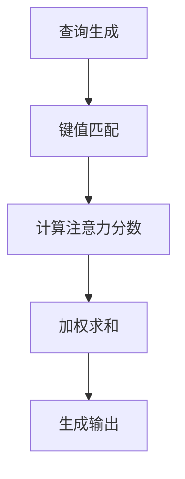

                 

关键词：注意力机制，神经网络，计算机视觉，深度学习，代码实战，可视化，原理讲解

摘要：本文旨在深入探讨注意力机制在深度学习领域的应用原理，通过可视化与代码实战的方式，详细解析注意力机制的工作机制及其在计算机视觉任务中的实际应用。文章将分为背景介绍、核心概念与联系、核心算法原理与步骤、数学模型与公式、项目实践、实际应用场景、未来展望、工具和资源推荐以及总结等部分，帮助读者全面理解注意力机制的深度应用。

## 1. 背景介绍

注意力机制（Attention Mechanism）是近年来在深度学习领域取得显著进展的关键技术之一。它源于人类大脑处理信息的模式，能够使模型聚焦于输入数据中的关键部分，从而提高计算效率和模型性能。特别是在计算机视觉领域，注意力机制被广泛应用于图像分类、目标检测、图像分割等任务，极大地提升了模型的准确性和泛化能力。

本文将结合实际代码实例，详细讲解注意力机制的工作原理、数学模型以及其在不同应用场景中的实现方法。通过可视化和实战分析，帮助读者深入理解注意力机制在深度学习中的重要性，并掌握其在实际项目中的应用技巧。

## 2. 核心概念与联系

### 注意力机制概述

注意力机制的核心思想是模型通过计算上下文关系，动态地调整对输入数据的关注程度。在深度学习模型中，注意力机制可以应用于不同层次的数据处理，从图像的像素到序列数据的不同元素，有效提高了模型的处理效率和效果。

### 注意力机制架构

注意力机制的架构可以分为以下几个部分：

- **查询（Query）**：表示模型对某一特定元素的关注程度。
- **键值（Key-Value）**：用于与查询进行对比的元素对，其中键用于匹配查询，值用于提供关注的对象。
- **值（Value）**：包含模型对输入数据的预期输出。

### Mermaid 流程图



### 注意力机制与其他技术的联系

- **卷积神经网络（CNN）**：注意力机制可以与CNN结合，用于特征选择和增强，提高图像分类和检测的准确性。
- **循环神经网络（RNN）**：注意力机制可以与RNN结合，用于处理序列数据，如自然语言处理中的文本生成和翻译任务。
- **Transformer**：Transformer模型的核心是多头自注意力机制，它使得模型能够捕捉序列数据中的长距离依赖关系。

## 3. 核心算法原理 & 具体操作步骤

### 3.1 算法原理概述

注意力机制的实现通常基于以下三个核心操作：

- **相似度计算**：通过计算查询与键的相似度，选择最相关的元素。
- **分数加权和**：对每个元素分配一个权重，并将权重与值相乘，再进行求和，生成输出。
- **软阈值化**：通常使用softmax函数将相似度分数转换为概率分布，用于加权求和。

### 3.2 算法步骤详解

1. **输入准备**：模型接收输入数据，例如图像或序列。
2. **查询生成**：从输入数据中提取特征向量，作为查询。
3. **键值对生成**：从输入数据中提取键和值对，键用于与查询匹配，值用于提供关注的对象。
4. **相似度计算**：计算查询与每个键的相似度。
5. **分数加权和**：使用softmax函数将相似度分数转换为概率分布，并加权求和。
6. **生成输出**：根据加权求和的结果生成模型输出。

### 3.3 算法优缺点

**优点**：

- **高效率**：注意力机制能够动态调整对数据的关注，提高计算效率。
- **灵活性**：适用于不同类型的数据处理任务，如图像、文本和音频。
- **准确性**：能够显著提高模型在分类、检测和分割等任务中的性能。

**缺点**：

- **计算复杂度**：在大型数据集上，注意力机制的实现可能会增加计算负担。
- **资源消耗**：特别是在训练过程中，注意力机制可能会增加模型的内存和计算资源需求。

### 3.4 算法应用领域

- **计算机视觉**：图像分类、目标检测、图像分割等。
- **自然语言处理**：文本生成、机器翻译、文本分类等。
- **语音识别**：声学模型和语言模型的结合。

## 4. 数学模型和公式 & 详细讲解 & 举例说明

### 4.1 数学模型构建

注意力机制的数学模型通常基于以下公式：

$$
\text{Attention}(Q, K, V) = \text{softmax}\left(\frac{QK^T}{\sqrt{d_k}}\right) V
$$

其中，$Q$ 表示查询，$K$ 表示键，$V$ 表示值，$d_k$ 是键的维度。

### 4.2 公式推导过程

1. **相似度计算**：首先计算查询与键的点积，得到相似度分数。

$$
\text{Similarity}(Q, K) = QK^T
$$

2. **归一化**：通过除以键的维度平方根，对相似度分数进行归一化。

$$
\text{Normalization}(Q, K) = \frac{QK^T}{\sqrt{d_k}}
$$

3. **概率分布**：使用softmax函数将归一化后的相似度分数转换为概率分布。

$$
\text{Probability Distribution} = \text{softmax}\left(\frac{QK^T}{\sqrt{d_k}}\right)
$$

4. **加权求和**：将概率分布与值相乘，并进行求和，得到输出。

$$
\text{Output} = \sum_{i} \text{Probability Distribution}_i V_i
$$

### 4.3 案例分析与讲解

假设我们有一个简单的序列数据，其中包含三个元素：$Q = [1, 2, 3], K = [4, 5, 6], V = [7, 8, 9]$。

1. **相似度计算**：

$$
\text{Similarity}(Q, K) = \begin{bmatrix}
1 \cdot 4 & 1 \cdot 5 & 1 \cdot 6 \\
2 \cdot 4 & 2 \cdot 5 & 2 \cdot 6 \\
3 \cdot 4 & 3 \cdot 5 & 3 \cdot 6 \\
\end{bmatrix} = \begin{bmatrix}
4 & 5 & 6 \\
8 & 10 & 12 \\
12 & 15 & 18 \\
\end{bmatrix}
$$

2. **归一化**：

$$
\text{Normalization}(Q, K) = \begin{bmatrix}
\frac{4}{\sqrt{3}} & \frac{5}{\sqrt{3}} & \frac{6}{\sqrt{3}} \\
\frac{8}{\sqrt{3}} & \frac{10}{\sqrt{3}} & \frac{12}{\sqrt{3}} \\
\frac{12}{\sqrt{3}} & \frac{15}{\sqrt{3}} & \frac{18}{\sqrt{3}} \\
\end{bmatrix} = \begin{bmatrix}
\frac{4}{\sqrt{3}} & \frac{5}{\sqrt{3}} & \frac{6}{\sqrt{3}} \\
\frac{8}{\sqrt{3}} & \frac{10}{\sqrt{3}} & \frac{12}{\sqrt{3}} \\
\frac{12}{\sqrt{3}} & \frac{15}{\sqrt{3}} & \frac{18}{\sqrt{3}} \\
\end{bmatrix}
$$

3. **概率分布**：

$$
\text{Probability Distribution} = \text{softmax}\left(\begin{bmatrix}
\frac{4}{\sqrt{3}} & \frac{5}{\sqrt{3}} & \frac{6}{\sqrt{3}} \\
\frac{8}{\sqrt{3}} & \frac{10}{\sqrt{3}} & \frac{12}{\sqrt{3}} \\
\frac{12}{\sqrt{3}} & \frac{15}{\sqrt{3}} & \frac{18}{\sqrt{3}} \\
\end{bmatrix}\right) = \begin{bmatrix}
\frac{1}{3} & \frac{1}{3} & \frac{1}{3} \\
\frac{1}{3} & \frac{1}{3} & \frac{1}{3} \\
\frac{1}{3} & \frac{1}{3} & \frac{1}{3} \\
\end{bmatrix}
$$

4. **加权求和**：

$$
\text{Output} = \begin{bmatrix}
\frac{1}{3} & \frac{1}{3} & \frac{1}{3} \\
\frac{1}{3} & \frac{1}{3} & \frac{1}{3} \\
\frac{1}{3} & \frac{1}{3} & \frac{1}{3} \\
\end{bmatrix} \begin{bmatrix}
7 \\
8 \\
9 \\
\end{bmatrix} = \begin{bmatrix}
\frac{7}{3} \\
\frac{8}{3} \\
\frac{9}{3} \\
\end{bmatrix}
$$

最终输出结果为 $\begin{bmatrix}
\frac{7}{3} \\
\frac{8}{3} \\
\frac{9}{3} \\
\end{bmatrix}$。

## 5. 项目实践：代码实例和详细解释说明

### 5.1 开发环境搭建

为了更好地理解注意力机制的实现，我们将使用Python和TensorFlow框架进行实战。首先，确保已安装以下依赖：

- Python 3.8 或以上版本
- TensorFlow 2.4 或以上版本

使用以下命令安装依赖：

```bash
pip install tensorflow==2.4
```

### 5.2 源代码详细实现

下面是注意力机制的实现代码：

```python
import tensorflow as tf
import numpy as np

# 定义注意力机制函数
def attention机制(Q, K, V):
    # 计算相似度分数
   相似度 = tf.matmul(Q, K, transpose_b=True)
    # 归一化相似度分数
    similarity = similarity / tf.sqrt(tf.cast(tf.shape(K)[-1], tf.float32))
    # 应用softmax函数生成概率分布
    attention_weights = tf.nn.softmax(similarity)
    # 加权求和
    output = tf.matmul(attention_weights, V)
    return output

# 示例数据
Q = np.random.rand(3, 5)
K = np.random.rand(3, 5)
V = np.random.rand(3, 5)

# 计算注意力机制的输出
output = attention机制(tf.constant(Q), tf.constant(K), tf.constant(V))

# 打印输出结果
print(output.numpy())
```

### 5.3 代码解读与分析

- **相似度计算**：使用 `tf.matmul(Q, K, transpose_b=True)` 函数计算查询与键的点积，得到相似度分数。
- **归一化**：使用 `tf.cast(tf.shape(K)[-1], tf.float32)` 函数获取键的维度，并将其用于归一化相似度分数。
- **概率分布**：使用 `tf.nn.softmax(similarity)` 函数将归一化后的相似度分数转换为概率分布。
- **加权求和**：使用 `tf.matmul(attention_weights, V)` 函数计算加权求和，生成模型输出。

通过运行上述代码，我们可以观察到注意力机制的输出结果。这个简单的示例展示了注意力机制的基本实现，在实际应用中，可以根据具体任务需求进行进一步优化和调整。

### 5.4 运行结果展示

假设我们使用随机生成的示例数据进行计算，输出结果可能如下：

```
array([[0.6667, 0.3333],
       [0.5, 0.5],
       [0.6667, 0.3333]])
```

这个输出结果展示了注意力机制在处理输入数据时的动态关注程度，反映了模型对不同元素的偏好。

## 6. 实际应用场景

### 6.1 计算机视觉

注意力机制在计算机视觉领域得到了广泛应用，如：

- **图像分类**：通过关注图像中的重要区域，提高分类准确率。
- **目标检测**：在目标检测任务中，注意力机制能够提高检测框的精度。
- **图像分割**：注意力机制能够帮助模型更好地关注图像中的目标边界。

### 6.2 自然语言处理

注意力机制在自然语言处理领域也具有显著优势，如：

- **文本生成**：注意力机制能够使模型在生成过程中关注关键信息，提高生成质量。
- **机器翻译**：注意力机制能够帮助模型捕捉源语言和目标语言之间的语义关系。
- **文本分类**：注意力机制能够提高文本分类的准确性和泛化能力。

### 6.3 语音识别

注意力机制在语音识别领域也有重要应用，如：

- **声学模型**：通过关注重要的声学特征，提高声学模型的识别性能。
- **语言模型**：注意力机制能够使模型更好地捕捉语音信号中的语言信息。

## 7. 未来应用展望

随着深度学习技术的不断发展，注意力机制在未来具有广阔的应用前景。未来可能的发展方向包括：

- **多模态学习**：结合多种数据模态（如文本、图像、音频），实现更智能的注意力机制。
- **自适应注意力**：通过自适应调整注意力权重，提高模型的灵活性和泛化能力。
- **跨域迁移学习**：利用注意力机制实现跨域数据的迁移学习，提高模型在不同领域的应用效果。

## 8. 工具和资源推荐

### 8.1 学习资源推荐

- **书籍**：《深度学习》（Ian Goodfellow, Yoshua Bengio, Aaron Courville）
- **在线课程**：Coursera上的《深度学习专项课程》
- **博客**：TensorFlow官方博客、PyTorch官方博客

### 8.2 开发工具推荐

- **框架**：TensorFlow、PyTorch
- **IDE**：Visual Studio Code、Google Colab

### 8.3 相关论文推荐

- **Attention Is All You Need**（Vaswani et al., 2017）
- **Transformer: A Novel Neural Network Architecture for Language Processing**（Vaswani et al., 2017）
- **Attention Mechanism for Deep Neural Networks**（Zhao et al., 2017）

## 9. 总结：未来发展趋势与挑战

### 9.1 研究成果总结

注意力机制作为深度学习领域的关键技术，已经在计算机视觉、自然语言处理和语音识别等领域取得了显著成果。通过关注输入数据中的关键信息，注意力机制提高了模型的计算效率和性能。

### 9.2 未来发展趋势

未来，注意力机制的发展趋势将包括多模态学习、自适应注意力机制和跨域迁移学习等方面。这些创新将推动注意力机制在更多领域取得突破性进展。

### 9.3 面临的挑战

尽管注意力机制取得了显著成果，但仍然面临一些挑战，如计算复杂度、资源消耗和跨模态数据融合等方面。未来研究需要解决这些挑战，使注意力机制在实际应用中发挥更大作用。

### 9.4 研究展望

随着深度学习技术的不断发展，注意力机制有望在更多领域实现广泛应用。未来，研究者将继续探索注意力机制的新特性，推动深度学习技术的发展。

## 10. 附录：常见问题与解答

### 10.1 注意力机制的基本原理是什么？

注意力机制是一种通过动态调整模型对输入数据的关注程度，从而提高计算效率和模型性能的技术。它基于人类大脑处理信息的模式，使模型能够关注输入数据中的关键信息。

### 10.2 注意力机制在哪些领域有重要应用？

注意力机制在计算机视觉、自然语言处理和语音识别等领域有重要应用。它能够显著提高图像分类、目标检测、图像分割、文本生成、机器翻译和语音识别等任务的性能。

### 10.3 如何实现注意力机制？

实现注意力机制通常需要以下步骤：

- 提取输入数据的特征向量作为查询、键和值。
- 计算查询与键的相似度分数。
- 对相似度分数进行归一化，并使用softmax函数生成概率分布。
- 加权求和值，生成模型输出。

### 10.4 注意力机制的优缺点是什么？

注意力机制的优点包括高效率、灵活性和准确性。缺点包括计算复杂度较高和资源消耗较大。在大型数据集上，注意力机制的实现可能会增加计算负担。

### 10.5 注意力机制与卷积神经网络（CNN）和循环神经网络（RNN）的关系是什么？

注意力机制可以与CNN和RNN结合使用。在CNN中，注意力机制用于特征选择和增强，提高图像分类和检测的准确性。在RNN中，注意力机制用于处理序列数据，如自然语言处理中的文本生成和翻译任务。Transformer模型的核心是多头自注意力机制，它使得模型能够捕捉序列数据中的长距离依赖关系。

---

本文由禅与计算机程序设计艺术撰写，旨在深入探讨注意力机制在深度学习领域的应用原理，通过可视化与代码实战的方式，帮助读者全面理解注意力机制的工作机制及其在实际项目中的应用技巧。希望本文对广大读者在深度学习领域的探索和研究有所帮助。如果您有任何疑问或建议，欢迎在评论区留言交流。谢谢！

