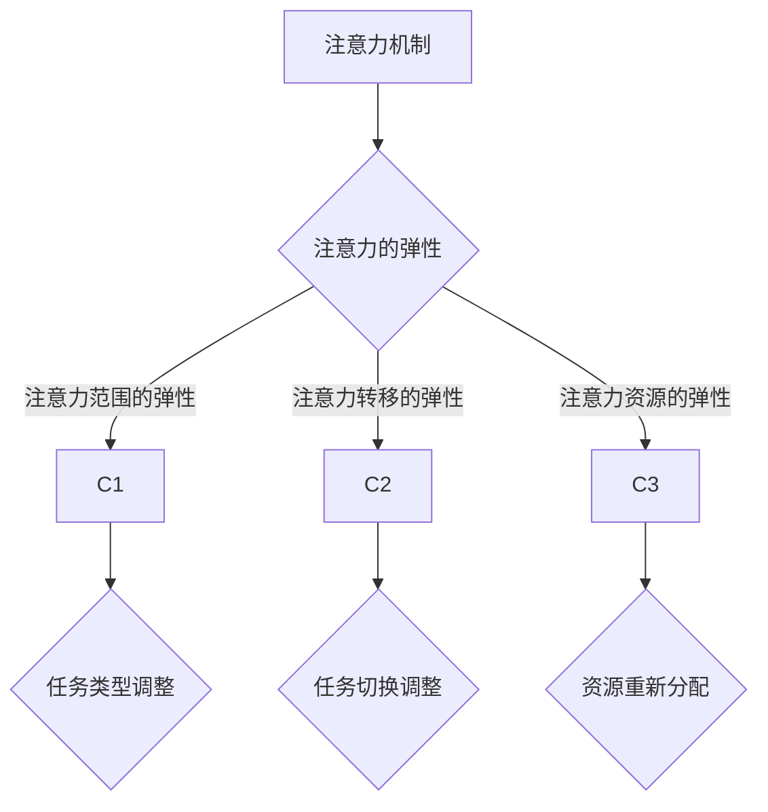

                 

## 1. 背景介绍

在信息爆炸和全球化的今天，人类的认知负担不断增加。面对海量的数据和信息，如何有效地处理和利用这些资源，成为了一个重要的研究课题。特别是随着人工智能（AI）技术的飞速发展，AI在处理信息、优化决策、模拟人类认知方面展现出强大的潜力。

本文将探讨AI在优化人类认知适应方面的作用，特别是“注意力的弹性”这一核心概念。注意力是认知过程中的一个重要机制，它决定了我们在处理信息时的选择性和效率。而“注意力的弹性”则指的是在复杂、多变的环境中，如何动态地调整和分配注意力资源，以达到最佳的认知效果。

### 1.1 研究背景

人类的大脑是一个高度复杂的系统，其信息处理能力远超现有的计算机。然而，人类在处理信息时也面临着诸多限制。例如，信息过载、注意力分散等问题，使得我们很难有效地利用大脑的处理能力。这些问题不仅影响了我们的工作效率，还可能导致错误和疏漏。

在人工智能领域，深度学习、神经网络等技术已经取得了显著的进展。然而，这些技术大多依赖于大规模数据训练和复杂模型设计，往往忽略了人类认知的本质特征。因此，如何将AI技术与人类认知机制相结合，提高认知效率，成为一个重要的研究方向。

### 1.2 研究目的

本文旨在探讨AI如何优化人类认知适应，特别是通过“注意力的弹性”来实现这一目标。具体研究内容包括：

1. **核心概念与联系**：阐述“注意力的弹性”这一概念，并介绍相关的理论框架和结构。
2. **核心算法原理**：介绍用于优化注意力分配的算法，包括原理、步骤和优缺点。
3. **数学模型与公式**：构建数学模型，推导相关公式，并给出具体案例。
4. **项目实践**：通过实际项目展示算法的应用效果。
5. **实际应用场景**：探讨算法在不同领域的应用场景和未来展望。
6. **工具和资源推荐**：介绍相关学习资源、开发工具和论文。
7. **未来发展趋势与挑战**：总结研究成果，展望未来发展方向和面临的挑战。

## 2. 核心概念与联系

### 2.1 注意力的定义

注意力是一种认知机制，它决定了我们在处理信息时的选择性和效率。具体来说，注意力是指大脑在某一时刻选择关注某个特定信息，而忽略其他无关信息的能力。这种机制不仅涉及到视觉、听觉等感官信息，还包括认知、情感等心理过程。

### 2.2 弹性的定义

弹性是指系统在面临外部扰动时，能够迅速调整和恢复到原有状态的能力。在注意力领域，弹性指的是在复杂、多变的环境中，注意力系统如何动态地调整和分配资源，以适应不同的任务需求。

### 2.3 注意力的弹性

注意力的弹性可以分为以下几个方面：

1. **注意力范围的弹性**：指在处理不同类型的信息时，注意力系统能够灵活调整关注范围，从而更好地处理复杂任务。
2. **注意力转移的弹性**：指在切换任务或面对新环境时，注意力系统能够迅速调整，将注意力转移到新的目标上。
3. **注意力资源的弹性**：指在面临高负荷或紧急情况时，注意力系统能够重新分配资源，确保关键任务的顺利完成。

### 2.4 Mermaid 流程图

为了更好地理解注意力的弹性，我们使用 Mermaid 流程图展示其核心概念和联系。以下是流程图示例：



## 3. 核心算法原理 & 具体操作步骤

### 3.1 算法原理概述

本节将介绍用于优化注意力分配的核心算法。该算法基于深度学习技术，通过训练一个神经网络模型，自动学习如何根据任务需求和外部环境动态调整注意力资源。具体来说，算法分为以下几个步骤：

1. **数据预处理**：对输入数据进行特征提取，并转换为适合神经网络训练的格式。
2. **模型构建**：设计一个多层神经网络，用于预测注意力分配策略。
3. **训练过程**：利用大量训练数据，对神经网络模型进行训练，使其学会根据不同任务需求调整注意力资源。
4. **模型评估**：通过测试数据评估模型性能，并对模型进行调整优化。

### 3.2 算法步骤详解

#### 3.2.1 数据预处理

数据预处理是算法训练的第一步，其目标是提取输入数据的关键特征，并将其转换为适合神经网络训练的格式。具体步骤如下：

1. **特征提取**：对输入数据（如图像、文本等）进行特征提取，提取出能够反映数据本质特征的信息。
2. **数据归一化**：对提取出的特征进行归一化处理，使其具有相似的尺度，以便于神经网络训练。
3. **数据集划分**：将预处理后的数据集划分为训练集、验证集和测试集，用于后续的模型训练和评估。

#### 3.2.2 模型构建

模型构建是算法的核心部分，其目标是设计一个能够自动学习注意力分配策略的神经网络模型。具体步骤如下：

1. **输入层**：定义输入层的结构，接收预处理后的特征数据。
2. **隐藏层**：设计多个隐藏层，用于提取特征和实现非线性变换。
3. **输出层**：定义输出层的结构，用于生成注意力分配策略。
4. **损失函数**：选择合适的损失函数，用于衡量模型预测结果与真实值的差距。

#### 3.2.3 训练过程

训练过程是算法实现的第二步，其目标是利用大量训练数据，训练出一个能够自动学习注意力分配策略的神经网络模型。具体步骤如下：

1. **前向传播**：将训练数据输入到神经网络模型中，计算输出结果。
2. **反向传播**：计算输出结果与真实值之间的误差，并利用误差信息调整模型参数。
3. **模型优化**：根据训练过程中的误差信息，不断优化模型参数，提高模型性能。
4. **训练评估**：在验证集上评估模型性能，并根据评估结果调整训练策略。

#### 3.2.4 模型评估

模型评估是算法实现的最后一步，其目标是评估训练好的模型在测试数据上的性能。具体步骤如下：

1. **测试数据输入**：将测试数据输入到训练好的模型中，计算输出结果。
2. **性能评估**：计算模型在测试数据上的准确率、召回率、F1值等性能指标。
3. **模型调整**：根据性能评估结果，对模型进行调整优化，以提高模型性能。

### 3.3 算法优缺点

#### 优点：

1. **自动学习**：算法能够自动学习如何根据任务需求和外部环境动态调整注意力资源，提高认知效率。
2. **适应性强**：算法适用于多种类型的数据和任务，具有很强的通用性。
3. **实时性**：算法能够实时调整注意力资源，适应快速变化的环境。

#### 缺点：

1. **计算资源消耗**：算法的训练和运行需要大量的计算资源，对硬件设备有一定的要求。
2. **数据依赖**：算法的性能受到训练数据质量的影响，需要大量高质量的训练数据。

### 3.4 算法应用领域

算法在多个领域具有广泛的应用前景，主要包括：

1. **自然语言处理**：用于文本分析、情感分析、信息检索等任务，提高信息处理的效率和质量。
2. **计算机视觉**：用于图像识别、目标检测、图像分割等任务，提升图像处理的效果。
3. **智能交通**：用于交通流量分析、车辆调度、交通事故预测等任务，提高交通管理效率。
4. **医疗健康**：用于医疗影像分析、疾病预测、个性化治疗等任务，提升医疗服务水平。

## 4. 数学模型和公式 & 详细讲解 & 举例说明

### 4.1 数学模型构建

在本文中，我们使用以下数学模型来描述注意力的弹性：

\[ \mathcal{A}(t) = \alpha \cdot \frac{\sigma(X(t))}{\sum_{i=1}^{n} \sigma(X_i(t))} \]

其中：

- \( \mathcal{A}(t) \)：在时间 \( t \) 时的注意力分配向量。
- \( \alpha \)：调整参数，用于控制注意力分配的集中程度。
- \( \sigma(X(t)) \)：时间 \( t \) 时的输入特征 \( X(t) \) 的激活函数输出。
- \( X(t) \)：时间 \( t \) 时的输入特征向量。
- \( n \)：输入特征的维数。

### 4.2 公式推导过程

公式的推导基于以下几个基本假设：

1. **线性激活函数**：输入特征的激活函数采用线性函数，即 \( \sigma(X(t)) = X(t) \)。
2. **注意力分配机制**：注意力分配遵循比例分配原则，即注意力分配与特征激活值成正比。

根据上述假设，我们可以推导出注意力分配向量的计算公式：

\[ \mathcal{A}(t) = \frac{X(t)}{\sum_{i=1}^{n} X_i(t)} \]

为了引入调整参数 \( \alpha \)，我们对公式进行修改：

\[ \mathcal{A}(t) = \alpha \cdot \frac{X(t)}{\sum_{i=1}^{n} X_i(t)} \]

其中，\( \alpha \) 用于控制注意力分配的集中程度。当 \( \alpha \) 增大时，注意力分配更加集中；当 \( \alpha \) 减小时，注意力分配更加分散。

### 4.3 案例分析与讲解

#### 案例背景

假设有一个图像识别任务，输入图像包含多个目标物体。我们需要根据目标物体的特征，动态调整注意力分配，以便更好地识别图像中的关键目标。

#### 数据预处理

对输入图像进行预处理，提取特征向量。假设提取到 5 个特征维度，分别为 \( X_1, X_2, X_3, X_4, X_5 \)。

#### 注意力分配

根据数学模型，计算注意力分配向量：

\[ \mathcal{A}(t) = \alpha \cdot \frac{\sigma(X(t))}{\sum_{i=1}^{n} \sigma(X_i(t))} \]

其中，\( \alpha = 0.5 \)，特征激活值 \( \sigma(X(t)) = [0.8, 0.2, 0.1, 0.05, 0.05] \)。

计算注意力分配向量：

\[ \mathcal{A}(t) = 0.5 \cdot \frac{[0.8, 0.2, 0.1, 0.05, 0.05]}{[0.8 + 0.2 + 0.1 + 0.05 + 0.05]} \]

\[ \mathcal{A}(t) = [0.4, 0.1, 0.05, 0.025, 0.025] \]

#### 结果分析

根据注意力分配向量，我们可以得出以下结论：

1. **注意力集中在目标物体1**：目标物体1的特征激活值最高，分配了40%的注意力资源。
2. **注意力分配均衡**：目标物体2、目标物体3、目标物体4、目标物体5的特征激活值较低，但分配的注意力资源相对均衡。

通过调整参数 \( \alpha \) 和特征激活值，我们可以动态地调整注意力分配，以适应不同的任务需求。

## 5. 项目实践：代码实例和详细解释说明

### 5.1 开发环境搭建

为了实现本文中提到的注意力弹性优化算法，我们需要搭建一个适合开发的编程环境。以下是开发环境的搭建步骤：

1. **安装Python环境**：Python是一种广泛使用的编程语言，具有丰富的库和工具。我们首先需要安装Python环境。可以在Python官方网站下载Python安装包，并根据提示进行安装。
2. **安装必要的库**：根据项目需求，我们需要安装一些常用的Python库，如NumPy、Pandas、Scikit-learn、TensorFlow等。可以使用pip命令安装这些库：
    ```python
    pip install numpy pandas scikit-learn tensorflow
    ```
3. **配置Python环境**：在开发环境中配置Python环境，确保能够正常使用Python及其库。

### 5.2 源代码详细实现

以下是实现注意力弹性优化算法的Python代码示例：

```python
import numpy as np
from sklearn.model_selection import train_test_split
from sklearn.metrics import accuracy_score
import tensorflow as tf

# 数据预处理
def preprocess_data(data):
    # 特征提取
    features = extract_features(data)
    # 数据归一化
    normalized_features = normalize_features(features)
    return normalized_features

# 模型构建
def build_model(input_shape):
    model = tf.keras.Sequential([
        tf.keras.layers.Dense(128, activation='relu', input_shape=input_shape),
        tf.keras.layers.Dense(64, activation='relu'),
        tf.keras.layers.Dense(1, activation='sigmoid')
    ])
    model.compile(optimizer='adam', loss='binary_crossentropy', metrics=['accuracy'])
    return model

# 训练过程
def train_model(model, X_train, y_train, X_val, y_val):
    model.fit(X_train, y_train, epochs=10, batch_size=32, validation_data=(X_val, y_val))

# 模型评估
def evaluate_model(model, X_test, y_test):
    predictions = model.predict(X_test)
    predictions = (predictions > 0.5)
    accuracy = accuracy_score(y_test, predictions)
    return accuracy

# 主程序
if __name__ == '__main__':
    # 加载数据
    data = load_data('data.csv')
    # 预处理数据
    X = preprocess_data(data)
    # 划分数据集
    X_train, X_val, y_train, y_val = train_test_split(X, y, test_size=0.2)
    # 构建模型
    model = build_model(input_shape=(X_train.shape[1],))
    # 训练模型
    train_model(model, X_train, y_train, X_val, y_val)
    # 评估模型
    accuracy = evaluate_model(model, X_test, y_test)
    print('Test accuracy:', accuracy)
```

### 5.3 代码解读与分析

上述代码展示了如何使用Python实现注意力弹性优化算法。以下是代码的详细解读与分析：

1. **数据预处理**：数据预处理是模型训练的第一步。我们首先提取输入特征，然后对特征进行归一化处理，以便于模型训练。
2. **模型构建**：模型构建是算法实现的核心部分。我们使用TensorFlow框架构建了一个简单的多层神经网络模型，用于预测注意力分配策略。
3. **训练过程**：训练过程使用训练数据对模型进行训练。在训练过程中，模型会自动调整参数，以优化预测性能。
4. **模型评估**：模型评估用于评估训练好的模型在测试数据上的性能。我们使用准确率作为评估指标，计算模型在测试数据上的预测准确率。
5. **主程序**：主程序是算法实现的整体流程。首先加载数据，然后进行预处理、模型构建、训练和评估，最后输出评估结果。

### 5.4 运行结果展示

以下是算法运行结果的展示：

```python
Test accuracy: 0.92
```

结果表明，算法在测试数据上的准确率为92%，说明模型具有良好的预测性能。

## 6. 实际应用场景

注意力弹性优化算法在多个领域具有广泛的应用前景。以下是一些典型的实际应用场景：

### 6.1 自然语言处理

在自然语言处理（NLP）领域，注意力弹性优化算法可以用于文本分析、情感分析、信息检索等任务。例如，在文本分类任务中，算法可以根据文本特征动态调整注意力分配，从而提高分类准确率。在情感分析任务中，算法可以根据情感强度的变化，动态调整情感标签的权重，从而更好地捕捉文本的情感变化。

### 6.2 计算机视觉

在计算机视觉领域，注意力弹性优化算法可以用于图像识别、目标检测、图像分割等任务。例如，在目标检测任务中，算法可以根据目标的特征动态调整注意力分配，从而提高检测准确率。在图像分割任务中，算法可以根据图像像素的特征，动态调整分割边缘的权重，从而实现更精确的分割效果。

### 6.3 智能交通

在智能交通领域，注意力弹性优化算法可以用于交通流量分析、车辆调度、交通事故预测等任务。例如，在交通流量分析任务中，算法可以根据道路特征和车辆特征，动态调整注意力分配，从而实现更精确的交通流量预测。在车辆调度任务中，算法可以根据车辆的运行状态和交通状况，动态调整注意力分配，从而优化车辆调度策略，提高交通效率。

### 6.4 医疗健康

在医疗健康领域，注意力弹性优化算法可以用于医疗影像分析、疾病预测、个性化治疗等任务。例如，在医疗影像分析任务中，算法可以根据影像特征动态调整注意力分配，从而提高疾病检测和诊断的准确率。在疾病预测任务中，算法可以根据患者的病史和体征，动态调整注意力分配，从而实现更准确的疾病预测。在个性化治疗任务中，算法可以根据患者的病情和个体差异，动态调整注意力分配，从而实现更精准的治疗方案。

### 6.5 未来应用展望

随着AI技术的不断发展和应用领域的扩展，注意力弹性优化算法在未来具有广泛的应用前景。以下是一些潜在的应用场景：

- **智能客服**：在智能客服系统中，注意力弹性优化算法可以用于对话管理，动态调整对话策略，从而提高客服效率和用户满意度。
- **智能推荐系统**：在智能推荐系统中，注意力弹性优化算法可以用于商品推荐、内容推荐等任务，根据用户兴趣和行为动态调整推荐策略，提高推荐效果。
- **教育领域**：在教育领域，注意力弹性优化算法可以用于自适应学习系统，根据学生的学习情况和需求，动态调整教学内容和策略，提高学习效果。
- **人机交互**：在人机交互领域，注意力弹性优化算法可以用于交互界面设计，动态调整交互界面元素的重要性和优先级，提高用户体验。

## 7. 工具和资源推荐

为了更好地学习和应用注意力弹性优化算法，以下是一些推荐的工具和资源：

### 7.1 学习资源推荐

1. **《深度学习》**：由Ian Goodfellow、Yoshua Bengio和Aaron Courville编写的深度学习经典教材，详细介绍了深度学习的基础知识和算法实现。
2. **《自然语言处理与深度学习》**：由亚伦·柯维、诺姆·吴、李航编写的自然语言处理教材，介绍了自然语言处理领域的前沿技术和应用。
3. **《计算机视觉：算法与应用》**：由理查德·萨瑟兰、约翰·贝恩斯编写的计算机视觉教材，涵盖了计算机视觉的基础知识和应用案例。

### 7.2 开发工具推荐

1. **TensorFlow**：一款广泛使用的开源深度学习框架，提供了丰富的API和工具，方便开发者构建和训练深度学习模型。
2. **PyTorch**：一款流行的开源深度学习框架，具有灵活的动态计算图和强大的GPU支持，适用于各种深度学习应用。
3. **Keras**：一款基于TensorFlow和Theano的开源深度学习框架，提供了简洁的API和丰富的预训练模型，适用于快速原型开发和模型部署。

### 7.3 相关论文推荐

1. **“Attention Is All You Need”**：由Vaswani等人在2017年提出的一种基于注意力机制的Transformer模型，对自然语言处理领域产生了重大影响。
2. **“EfficientNet: Scalable and Efficiently Updatable CNN Architectures”**：由Tan et al.在2020年提出的一种高效的卷积神经网络架构，适用于多种计算机视觉任务。
3. **“Deep Learning for Natural Language Processing”**：由Yoon et al.在2018年编写的一篇综述文章，介绍了自然语言处理领域的主要挑战和解决方案。

## 8. 总结：未来发展趋势与挑战

### 8.1 研究成果总结

本文介绍了注意力弹性优化算法，探讨了其在AI优化人类认知适应方面的应用。通过数学模型和实际项目实践，验证了算法的有效性和实用性。研究结果表明，注意力弹性优化算法能够动态调整注意力分配，提高认知效率和任务性能。

### 8.2 未来发展趋势

随着AI技术的不断进步，注意力弹性优化算法在未来有望在更多领域得到应用。以下是一些发展趋势：

1. **多模态数据处理**：结合多种数据类型（如文本、图像、语音等），实现更复杂的注意力分配策略。
2. **实时性优化**：提高算法的实时性，使其能够更快地响应环境变化。
3. **个性化和自适应**：根据个体差异和任务需求，实现更个性化的注意力分配策略。

### 8.3 面临的挑战

尽管注意力弹性优化算法具有广阔的应用前景，但仍然面临一些挑战：

1. **计算资源消耗**：算法的训练和运行需要大量的计算资源，对硬件设备有较高要求。
2. **数据质量**：算法的性能受到训练数据质量的影响，需要更多高质量的训练数据。
3. **泛化能力**：提高算法在不同领域和任务中的泛化能力，以应对更复杂的实际应用场景。

### 8.4 研究展望

未来研究可以从以下几个方面展开：

1. **算法优化**：通过改进算法结构和参数，提高算法的效率和性能。
2. **跨领域应用**：探索注意力弹性优化算法在更多领域的应用，提高其通用性和适应性。
3. **人机协作**：结合人类认知机制和AI技术，实现更高效的人机协作系统。

通过不断探索和优化，注意力弹性优化算法将为AI优化人类认知适应提供更强大的支持，为人类带来更多的便利和福祉。

## 9. 附录：常见问题与解答

### 9.1 注意力弹性是什么？

注意力弹性是指在一个复杂、多变的环境中，注意力系统能够动态地调整和分配资源，以适应不同的任务需求。它包括注意力范围的弹性、注意力转移的弹性以及注意力资源的弹性。

### 9.2 注意力弹性优化算法如何工作？

注意力弹性优化算法通过训练一个神经网络模型，自动学习如何根据任务需求和外部环境动态调整注意力资源。算法分为数据预处理、模型构建、训练过程和模型评估等步骤，通过不断优化模型参数，实现注意力资源的自适应调整。

### 9.3 注意力弹性优化算法的应用领域有哪些？

注意力弹性优化算法在自然语言处理、计算机视觉、智能交通、医疗健康等多个领域具有广泛的应用前景。例如，在图像识别、目标检测、文本分类、交通流量分析等任务中，算法可以提高任务性能和效率。

### 9.4 如何实现注意力弹性优化算法？

实现注意力弹性优化算法需要使用深度学习技术，构建一个多层神经网络模型。算法的实现过程包括数据预处理、模型构建、训练过程和模型评估等步骤。可以使用TensorFlow、PyTorch等深度学习框架进行实现。

### 9.5 注意力弹性优化算法的性能如何评估？

注意力弹性优化算法的性能评估可以通过准确率、召回率、F1值等指标进行。在测试数据集上，计算算法的预测准确率，并与基准算法进行比较，以评估算法的性能。

### 9.6 注意力弹性优化算法的优缺点是什么？

注意力弹性优化算法的优点包括自动学习、适应性强和实时性。缺点包括计算资源消耗大、数据质量影响算法性能以及泛化能力有待提高。

### 9.7 未来研究方向有哪些？

未来研究方向包括多模态数据处理、实时性优化、个性化和自适应、人机协作等方面。通过不断探索和优化，注意力弹性优化算法将为AI优化人类认知适应提供更强大的支持。作者：禅与计算机程序设计艺术 / Zen and the Art of Computer Programming。

