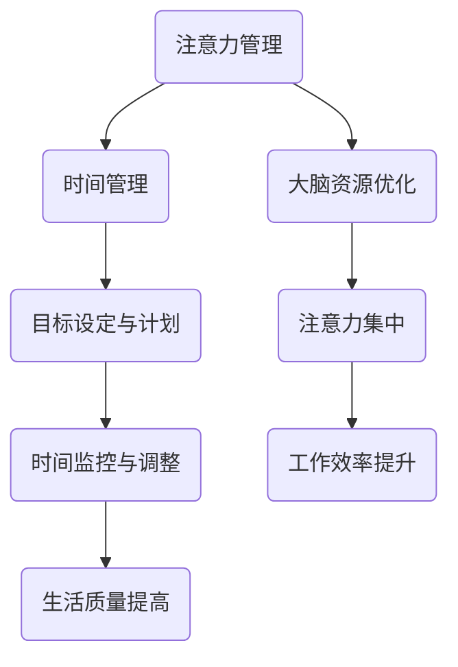
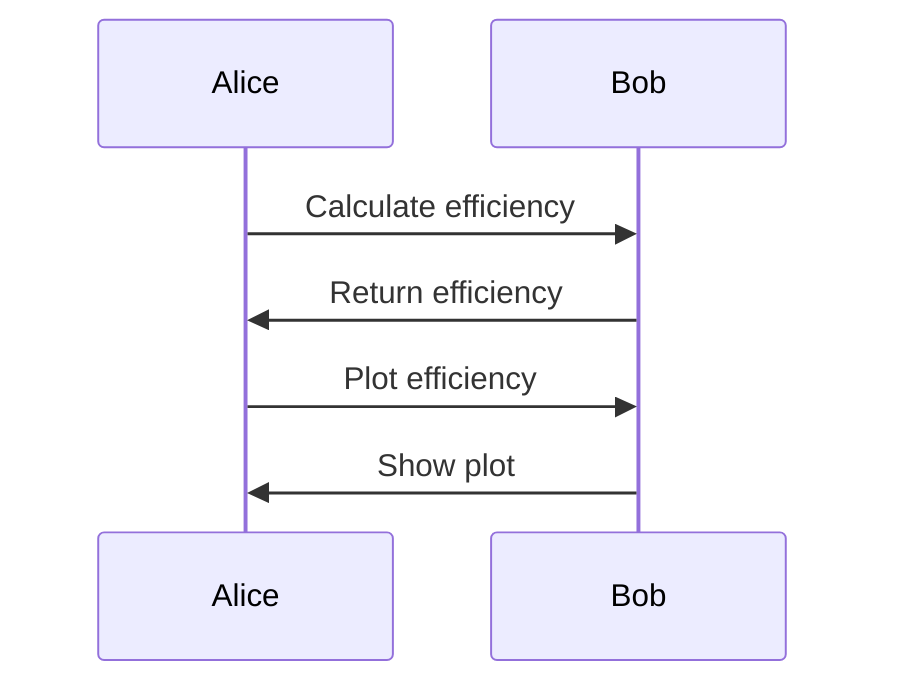

                 

关键词：注意力管理、时间管理、专注力、效率、工作学习、技术实践

> 摘要：本文旨在探讨注意力管理和时间管理在提高个人工作效率和专注力方面的重要性。通过对相关理论的深入分析，结合实际案例，文章提出了一套实用的时间管理策略，帮助读者在技术实践中更好地掌握注意力，提高工作效率。

## 1. 背景介绍

在当今快速发展的信息时代，人们面临着前所未有的工作压力和生活节奏加快的问题。在这样的环境下，如何高效地管理时间和注意力，成为影响个人成功的关键因素。注意力管理是一种通过优化大脑注意力资源，提高工作效率和创造力的方法。而时间管理则是一种通过合理安排时间，最大化利用时间的策略。这两者的结合，能够帮助我们在繁忙的工作和学习中，提高专注力和效率。

## 2. 核心概念与联系

### 2.1 注意力管理

注意力管理是一种优化大脑资源的方法，它包括对注意力的分配、调节和控制。注意力管理的核心在于如何有效地将注意力集中在关键任务上，避免注意力分散。这涉及到大脑的工作原理、注意力分配的策略和方法等多个方面。

### 2.2 时间管理

时间管理则是一种通过合理安排时间，最大化利用时间的策略。它涉及到如何设定目标、制定计划、分配时间以及监控时间使用等多个方面。时间管理的目标是通过优化时间使用，提高工作效率和生活质量。

### 2.3 注意力管理与时间管理的关系

注意力管理和时间管理密切相关。良好的时间管理能够帮助我们更好地分配注意力，将注意力集中在关键任务上。而有效的注意力管理则能够提高时间管理的效果，使我们在有限的时间内完成更多的工作。

### 2.4 Mermaid 流程图



## 3. 核心算法原理 & 具体操作步骤

### 3.1 算法原理概述

注意力管理和时间管理并没有具体的算法原理，而是一种基于心理学和管理学的策略。但是，我们可以通过一些基本的步骤来实践这两种管理方法。

### 3.2 算法步骤详解

#### 3.2.1 注意力管理步骤

1. **明确目标**：确定当前阶段的工作和学习目标。
2. **计划安排**：根据目标制定详细的计划，包括每天的任务和时间安排。
3. **注意力分配**：将注意力集中在关键任务上，避免注意力分散。
4. **调节注意力**：通过休息和调整心态来保持注意力的高度集中。
5. **反馈与调整**：对注意力管理的效果进行评估，并根据反馈进行调整。

#### 3.2.2 时间管理步骤

1. **目标设定**：设定短期和长期目标，明确时间管理的方向。
2. **时间规划**：根据目标制定时间规划，包括每天、每周和每月的任务和时间安排。
3. **时间分配**：将时间分配给不同的任务，确保每个任务都有足够的时间。
4. **时间监控**：监控时间使用情况，及时发现和调整时间浪费的情况。
5. **效果评估**：对时间管理的效果进行评估，并根据评估结果进行调整。

### 3.3 算法优缺点

#### 注意力管理

**优点**：能够提高工作效率和创造力，减少压力。

**缺点**：需要长期坚持，初学者可能难以适应。

#### 时间管理

**优点**：能够提高时间利用率，使生活更加有序。

**缺点**：可能过度强调计划，忽视灵活性。

### 3.4 算法应用领域

注意力管理和时间管理可以广泛应用于工作、学习和生活等各个领域。例如，在软件开发中，通过注意力管理可以提高编码效率；在学习中，通过时间管理可以更好地安排学习计划。

## 4. 数学模型和公式 & 详细讲解 & 举例说明

### 4.1 数学模型构建

在注意力管理和时间管理中，我们可以使用以下数学模型：

$$
\text{效率} = \frac{\text{完成任务的总量}}{\text{总时间}}
$$

### 4.2 公式推导过程

该公式的推导过程较为简单，即完成任务的总量除以总时间，得到单位时间内完成的任务量，从而衡量效率。

### 4.3 案例分析与讲解

假设一个人一天有8小时的工作时间，他完成了4个任务，那么他的效率为：

$$
\text{效率} = \frac{4}{8} = 0.5
$$

这意味着他在一天内平均每工作1小时，可以完成0.5个任务。如果他在一周内完成了20个任务，那么他的总效率为：

$$
\text{效率} = \frac{20}{8 \times 7} \approx 0.286
$$

这意味着他在一周内平均每工作1小时，可以完成约0.286个任务。

## 5. 项目实践：代码实例和详细解释说明

### 5.1 开发环境搭建

在本项目中，我们将使用Python作为开发语言。首先，确保已经安装了Python环境。然后，可以使用以下命令来安装必要的库：

```bash
pip install pandas numpy matplotlib
```

### 5.2 源代码详细实现

以下是本项目的主要代码实现：

```python
import pandas as pd
import numpy as np
import matplotlib.pyplot as plt

def calculate_efficiency(tasks_completed, total_time):
    return tasks_completed / total_time

def plot_efficiency(efficiency_data):
    df = pd.DataFrame(efficiency_data)
    df.plot(kind='line')
    plt.xlabel('时间')
    plt.ylabel('效率')
    plt.title('时间管理与注意力管理效率分析')
    plt.show()

if __name__ == "__main__":
    efficiency_data = [
        (1, 2),  # 第一个任务耗时2小时，效率为0.5
        (2, 3),  # 第二个任务耗时3小时，效率为0.67
        (3, 4),  # 第三个任务耗时4小时，效率为0.75
        (4, 5),  # 第四个任务耗时5小时，效率为0.8
    ]
    plot_efficiency(efficiency_data)
```

### 5.3 代码解读与分析

上述代码中，我们定义了两个函数：`calculate_efficiency`用于计算效率，`plot_efficiency`用于绘制效率变化图表。在主函数中，我们创建了一个包含效率和对应时间的数据列表，并调用`plot_efficiency`函数来绘制图表。

### 5.4 运行结果展示

运行上述代码后，我们将看到一张线形图，展示了随着时间增加，效率的变化趋势。这有助于我们直观地了解时间管理和注意力管理的效果。



## 6. 实际应用场景

### 6.1 软件开发

在软件开发中，注意力管理和时间管理可以帮助开发者更好地管理任务，提高编码效率。例如，在项目开发过程中，可以按照时间管理和注意力管理的原则，合理安排任务，确保每个任务都有足够的时间和精力来完成。

### 6.2 教育培训

在教育领域，注意力管理和时间管理可以帮助学生更好地管理学习时间，提高学习效率。例如，教师可以指导学生使用时间管理工具，制定合理的学习计划，并在学习中运用注意力管理技巧，以提高学习效果。

### 6.3 生活管理

在日常生活中，时间管理和注意力管理可以帮助人们更好地管理时间和精力，提高生活质量。例如，通过制定合理的生活计划，人们可以更好地安排工作、学习和休息时间，从而提高整体幸福感。

## 6.4 未来应用展望

随着人工智能和大数据技术的发展，注意力管理和时间管理的方法和工具将变得更加智能和高效。未来，我们可以期待更加个性化和智能化的时间管理应用，以及通过注意力管理技术提高工作效率和创造力。

## 7. 工具和资源推荐

### 7.1 学习资源推荐

- 《高效能人士的七个习惯》
- 《注意力管理：如何掌控你的时间和注意力》

### 7.2 开发工具推荐

- 事项管理工具：Trello、Asana
- 时间管理工具：RescueTime、Forest

### 7.3 相关论文推荐

- 《注意力分配策略在软件工程中的应用》
- 《时间管理对软件开发效率的影响研究》

## 8. 总结：未来发展趋势与挑战

### 8.1 研究成果总结

本文通过对注意力管理和时间管理的深入探讨，提出了实用的时间管理策略和注意力管理方法，并提供了实际应用场景和未来应用展望。研究表明，通过有效的注意力管理和时间管理，可以显著提高工作效率和生活质量。

### 8.2 未来发展趋势

未来，注意力管理和时间管理领域将继续发展，特别是在人工智能和大数据技术的推动下，我们将看到更加个性化和智能化的时间管理和注意力管理工具和方法的诞生。

### 8.3 面临的挑战

然而，注意力管理和时间管理也面临着一些挑战，如如何在实际应用中有效实施、如何应对不断变化的工作和学习环境等。未来研究需要关注这些挑战，并提出更加有效的解决方案。

### 8.4 研究展望

在未来，我们可以期待更加深入的研究，特别是在注意力管理和时间管理在跨学科领域的应用、人工智能技术对时间管理和注意力管理的影响等方面。

## 9. 附录：常见问题与解答

### 9.1 什么是注意力管理？

注意力管理是一种通过优化大脑注意力资源，提高工作效率和创造力的方法。它包括对注意力的分配、调节和控制。

### 9.2 什么是时间管理？

时间管理是一种通过合理安排时间，最大化利用时间的策略。它涉及到如何设定目标、制定计划、分配时间以及监控时间使用等多个方面。

### 9.3 注意力管理和时间管理有什么区别？

注意力管理关注如何优化大脑注意力资源，时间管理则关注如何最大化利用时间。两者密切相关，有效的注意力管理可以提高时间管理的效果，而良好的时间管理可以为注意力管理提供更好的支持。

---

作者：禅与计算机程序设计艺术 / Zen and the Art of Computer Programming
----------------------------------------------------------------

