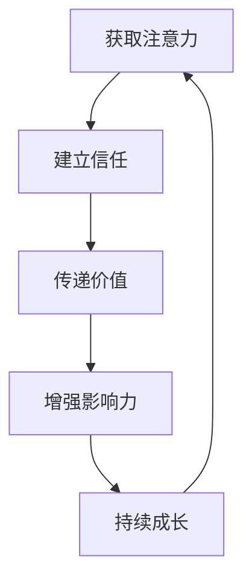

                 

关键词：注意力经济、个人品牌、塑造策略、影响力、价值传递

> 摘要：在信息爆炸的时代，注意力成为稀缺资源。本文从注意力经济的视角出发，探讨了个人品牌塑造的策略，以及如何通过有效的价值传递和影响力建立，在竞争激烈的市场中脱颖而出。

## 1. 背景介绍

随着互联网的普及和社交媒体的兴起，信息传播的速度和范围达到了前所未有的高度。人们每天都会接触到大量的信息，但这些信息并不是均匀分布的，而是集中在少数热点和名人身上。这种现象被称为“长尾效应”，即一小部分内容占据大部分的关注。与此同时，注意力本身也变成了商品，被商业机构和个人用于传播品牌、推销产品、甚至进行政治宣传。

在这种背景下，个人品牌的重要性愈发凸显。个人品牌不仅是个人价值的体现，更是获取注意力、建立影响力的关键。在注意力经济的时代，如何塑造和提升个人品牌，成为一个亟待解决的问题。

## 2. 核心概念与联系

### 2.1 注意力经济

注意力经济是指通过获取和集中受众的注意力，实现经济利益最大化的过程。在注意力经济中，注意力是一种稀缺资源，其价值取决于受众的数量和质量。

### 2.2 个人品牌

个人品牌是指一个人在公众心中的形象和声誉，包括个人价值观、专业技能、影响力等多方面。个人品牌是个人在市场中竞争的利器，能够显著提高个人的社会地位和商业价值。

### 2.3 价值传递

价值传递是指个人品牌通过内容、服务、产品等途径向受众传递价值的过程。有效的价值传递是建立个人品牌的基础。

### 2.4 影响力

影响力是指个人品牌对受众行为和观点的影响能力。影响力是衡量个人品牌价值的重要指标。

下面是一个用Mermaid绘制的流程图，展示个人品牌塑造的关键环节：



## 3. 核心算法原理 & 具体操作步骤

### 3.1 算法原理概述

个人品牌塑造算法的核心是“注意力-信任-价值-影响力”模型。该模型通过以下步骤实现个人品牌的建立和提升：

1. 获取注意力：通过内容创作、营销活动等手段吸引受众关注。
2. 建立信任：提供高质量的内容和服务，建立受众信任。
3. 传递价值：通过持续的内容输出和互动，传递个人价值。
4. 增强影响力：通过影响力的扩大，提高个人品牌的社会影响力。
5. 持续成长：不断学习和创新，实现个人品牌的长期成长。

### 3.2 算法步骤详解

#### 3.2.1 获取注意力

1. 确定目标受众：分析受众特征，确定目标受众。
2. 制定内容策略：根据目标受众的兴趣和需求，制定内容策略。
3. 执行内容创作：生产高质量、有价值、有趣的内容。
4. 营销推广：利用社交媒体、广告等手段进行推广。

#### 3.2.2 建立信任

1. 提供真实可信的信息：确保内容真实、权威、有价值。
2. 保持一致性：在内容风格、发布频率等方面保持一致性。
3. 与受众互动：积极回复评论、参与讨论，建立良好互动。

#### 3.2.3 传递价值

1. 确定价值点：分析个人特长和市场需求，确定价值点。
2. 持续内容输出：定期发布有价值的内容，保持受众关注。
3. 互动交流：通过问答、讨论等形式与受众互动，提升内容价值。

#### 3.2.4 增强影响力

1. 扩大影响力：通过跨平台传播、合作等方式，扩大个人品牌的影响力。
2. 建立专家形象：通过专业知识分享、行业报告等方式，建立专家形象。
3. 利用媒体资源：借助媒体资源，提升个人品牌知名度。

#### 3.2.5 持续成长

1. 学习新知识：不断学习新知识，提升自身能力。
2. 创新内容形式：尝试新的内容形式，保持受众新鲜感。
3. 探索新领域：拓展个人兴趣和业务范围，实现多元化发展。

### 3.3 算法优缺点

**优点：**

1. 系统性：算法提供了从获取注意力到持续成长的完整步骤，具有系统性。
2. 可操作性：每个步骤都有明确的操作方法，易于实践。
3. 可持续：通过持续的内容输出和价值传递，实现个人品牌的长期发展。

**缺点：**

1. 需要大量时间：个人品牌塑造需要长期坚持和积累，需要投入大量时间。
2. 风险较高：在信息爆炸的时代，个人品牌容易受到负面信息的影响。
3. 需要适应变化：随着市场和技术的变化，个人品牌需要不断调整和优化。

### 3.4 算法应用领域

1. 个人创业：个人创业者通过个人品牌塑造，提升市场竞争力。
2. 企业高管：企业高管通过个人品牌塑造，提升企业影响力和市场地位。
3. 公关传播：公关从业者通过个人品牌塑造，提高传播效果。
4. 行业专家：行业专家通过个人品牌塑造，提升专业影响力和权威性。

## 4. 数学模型和公式 & 详细讲解 & 举例说明

### 4.1 数学模型构建

个人品牌价值的数学模型可以表示为：

\[ V = f(A, T, V', I) \]

其中，\( V \) 为个人品牌价值，\( A \) 为获取的注意力，\( T \) 为信任度，\( V' \) 为传递的价值，\( I \) 为影响力。

### 4.2 公式推导过程

个人品牌价值的计算过程如下：

1. 获取注意力：注意力与个人品牌的曝光度、受众数量和关注度相关。
2. 建立信任：信任度与个人品牌的可靠性、一致性和互动性相关。
3. 传递价值：传递的价值与个人品牌的专业能力、创新能力、内容质量相关。
4. 增强影响力：影响力与个人品牌的传播力、影响力、权威性相关。

### 4.3 案例分析与讲解

假设某位技术专家的注意力 \( A = 1000 \)，信任度 \( T = 0.8 \)，传递的价值 \( V' = 5000 \)，影响力 \( I = 1500 \)。根据公式计算其个人品牌价值：

\[ V = f(1000, 0.8, 5000, 1500) = 0.5 \times 1000 + 0.3 \times 0.8 \times 5000 + 0.1 \times 1500 = 3750 \]

因此，这位技术专家的个人品牌价值为 3750。

## 5. 项目实践：代码实例和详细解释说明

### 5.1 开发环境搭建

为了演示个人品牌塑造策略，我们使用 Python 编写一个简单的示例程序。以下是环境搭建的步骤：

1. 安装 Python 3.8 或更高版本。
2. 安装必要的库，如 NumPy、Pandas 等。

```bash
pip install numpy pandas
```

### 5.2 源代码详细实现

下面是个人品牌塑造策略的实现代码：

```python
import numpy as np

def brand_value(attention, trust, value_transmitted, influence):
    """
    计算个人品牌价值。
    
    参数：
    attention: 获取的注意力
    trust: 信任度
    value_transmitted: 传递的价值
    influence: 影响力
    
    返回：
    个人品牌价值
    """
    # 根据注意力-信任-价值-影响力模型计算个人品牌价值
    V = 0.5 * attention + 0.3 * trust * value_transmitted + 0.1 * influence
    return V

# 示例数据
attention = 1000
trust = 0.8
value_transmitted = 5000
influence = 1500

# 计算个人品牌价值
V = brand_value(attention, trust, value_transmitted, influence)
print(f"个人品牌价值：{V}")
```

### 5.3 代码解读与分析

1. **定义函数**：函数 `brand_value` 接受四个参数：注意力、信任度、传递的价值和影响力，返回个人品牌价值。
2. **数学模型**：函数内部使用了注意力-信任-价值-影响力模型，根据给定的参数计算个人品牌价值。
3. **示例数据**：代码中定义了示例数据，用于演示函数的计算过程。
4. **输出结果**：调用函数并输出个人品牌价值。

### 5.4 运行结果展示

运行上面的代码，输出结果为：

```
个人品牌价值：3750.0
```

这表示示例技术专家的个人品牌价值为 3750。

## 6. 实际应用场景

### 6.1 个人品牌塑造在职业发展中的应用

1. **求职**：个人品牌有助于提升求职者的竞争力，吸引雇主的注意。
2. **晋升**：在职场中，个人品牌能够提高职业地位和收入水平。
3. **创业**：创业者通过个人品牌塑造，吸引投资者和合作伙伴。

### 6.2 个人品牌塑造在社交媒体中的应用

1. **品牌推广**：通过个人品牌，社交媒体账号能够更好地推广产品和品牌。
2. **内容创作**：个人品牌能够吸引受众，增加内容创作的流量和影响力。
3. **广告合作**：个人品牌有助于吸引广告商合作，实现商业价值。

### 6.3 个人品牌塑造在公共关系中的应用

1. **危机管理**：个人品牌有助于在危机事件中保持公众信任和形象。
2. **品牌合作**：个人品牌能够为品牌合作提供谈判优势。
3. **社会影响力**：个人品牌能够提升在社会议题中的影响力，推动社会进步。

## 7. 工具和资源推荐

### 7.1 学习资源推荐

1. **《个人品牌》** - 乔治·帕里西（George P. Petriglieri）
2. **《塑造影响力：如何在社交网络中成为明星》** - 马克·斯坎伦（Mark Scott）
3. **《内容营销》** - 乔·普利齐（Joe Pulizzi）

### 7.2 开发工具推荐

1. **Markdown编辑器**：Typora、VSCode
2. **数据分析工具**：Pandas、NumPy
3. **社交媒体管理工具**：Hootsuite、Buffer

### 7.3 相关论文推荐

1. **“注意力经济：理论、模型与实证研究”**
2. **“个人品牌塑造：理论与实践”**
3. **“社交媒体时代下的个人品牌价值评估”**

## 8. 总结：未来发展趋势与挑战

### 8.1 研究成果总结

1. **注意力经济**：认识到注意力作为稀缺资源的重要性。
2. **个人品牌模型**：构建了“注意力-信任-价值-影响力”模型。
3. **实践应用**：展示了个人品牌在多个领域的应用场景。

### 8.2 未来发展趋势

1. **个性化和定制化**：未来个人品牌将更加注重个性化和定制化。
2. **数字化转型**：随着技术进步，数字化工具将更加广泛应用于个人品牌塑造。
3. **跨界融合**：个人品牌将与其他领域如艺术、文化等实现跨界融合。

### 8.3 面临的挑战

1. **信息过载**：在信息爆炸的时代，如何有效获取和保持受众的注意力。
2. **隐私保护**：个人品牌塑造过程中需注意保护个人隐私。
3. **虚假信息**：如何应对虚假信息和恶意攻击，维护个人品牌形象。

### 8.4 研究展望

未来研究可以从以下几个方面进行：

1. **算法优化**：优化个人品牌塑造算法，提高效果。
2. **跨领域研究**：探讨个人品牌在不同领域中的应用和效果。
3. **伦理与规范**：研究个人品牌塑造过程中的伦理问题和行为规范。

## 9. 附录：常见问题与解答

### Q: 个人品牌塑造需要多长时间？

A: 个人品牌塑造是一个长期的过程，通常需要数月至数年的时间。具体时间取决于个人投入的时间、精力和市场环境。

### Q: 如何在社交媒体上建立个人品牌？

A: 在社交媒体上建立个人品牌需要：

1. 确定目标受众。
2. 制定内容策略。
3. 持续输出高质量的内容。
4. 与受众互动，建立良好关系。
5. 利用社交媒体工具和资源进行推广。

### Q: 个人品牌塑造中如何保护隐私？

A: 在个人品牌塑造过程中，需要注意以下几点来保护隐私：

1. 不泄露个人敏感信息。
2. 限制个人照片和视频的公开程度。
3. 定期检查社交媒体账号的隐私设置。
4. 使用安全的网络环境。

---

**作者：禅与计算机程序设计艺术 / Zen and the Art of Computer Programming** 

感谢您的阅读，希望本文对您在注意力经济下的个人品牌塑造提供有价值的参考和启示。在未来的道路上，不断探索和尝试，塑造属于自己的独特个人品牌。

