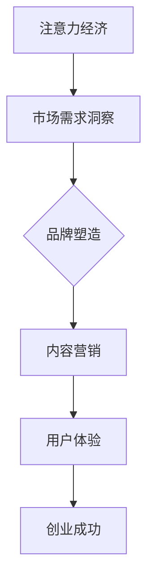

                 

关键词：注意力经济，个人创业，商业模式，算法优化，市场趋势，案例分析，技术工具

> 摘要：本文从注意力经济的角度，探讨了个人创业与市场趋势之间的密切联系。通过分析注意力经济的核心概念，提出了一套基于注意力分配的创业策略，并探讨了算法优化在个人创业中的应用。同时，结合具体案例分析，总结了个人创业在不同领域的实际应用，展望了未来的发展趋势和面临的挑战。

## 1. 背景介绍

在当今信息爆炸的时代，个体的注意力资源变得愈发稀缺。为了在竞争激烈的市场中脱颖而出，企业和个人必须掌握注意力经济这一新兴商业模式。注意力经济源于经济学中的“稀缺性”概念，强调通过吸引和保留消费者的注意力来创造价值。随着互联网技术的不断发展，信息的获取变得前所未有的便捷，但与此同时，消费者的注意力也变得更加分散和难以捕捉。

个人创业在这样的背景下显得尤为重要。创业不再是少数人的专利，而是越来越多人追求自我实现和财富增值的方式。然而，创业的成功不仅仅依赖于创新的产品或服务，更需要对市场趋势的敏锐洞察和有效的注意力分配策略。本文旨在探讨注意力经济与个人创业机会之间的联系，为创业者提供一套实用的创业策略。

## 2. 核心概念与联系

### 2.1 注意力经济的概念

注意力经济（Attention Economy）是指个体或组织通过获取、引导和利用他人的注意力资源来创造价值的经济模式。在注意力经济中，注意力被视为一种稀缺资源，与物质资源具有同等重要的价值。因此，吸引和保持消费者的注意力成为企业成功的关键。

### 2.2 个人创业与注意力经济

个人创业与注意力经济之间的联系主要体现在以下几个方面：

1. **市场需求洞察**：创业者需要通过市场调研和分析，了解目标消费者的注意力分配模式，从而发现潜在的商业机会。
2. **品牌塑造**：创业者通过创造独特的品牌形象和价值主张，吸引消费者的注意力，建立品牌忠诚度。
3. **内容营销**：创业者通过高质量的内容创作，如博客、社交媒体、视频等，吸引用户关注，并转化为实际的销售机会。
4. **用户体验**：创业者通过优化产品和服务的用户体验，提高用户粘性，延长用户的注意力停留时间。

### 2.3 Mermaid 流程图



## 3. 核心算法原理 & 具体操作步骤

### 3.1 算法原理概述

注意力经济中的关键算法是注意力分配算法。该算法的核心思想是根据目标消费者的注意力分配模式，将有限的资源（如广告预算、内容创作成本等）分配到最能有效吸引注意力的渠道或领域。

### 3.2 算法步骤详解

1. **数据收集**：收集目标消费者的行为数据，包括搜索历史、浏览记录、购买行为等。
2. **行为分析**：通过机器学习算法分析消费者的行为模式，确定其注意力分配的偏好。
3. **资源分配**：根据分析结果，将资源分配到最有效的渠道或领域。
4. **效果评估**：监控资源分配的效果，根据效果调整资源分配策略。

### 3.3 算法优缺点

**优点**：
- 提高资源利用效率，最大化商业回报。
- 基于数据驱动，避免盲目决策。

**缺点**：
- 需要大量的数据支持和复杂的算法模型。
- 难以准确预测消费者的注意力变化。

### 3.4 算法应用领域

- **电子商务**：通过注意力分配算法优化广告投放和内容推荐，提高销售额。
- **社交媒体**：通过注意力分配算法提高用户参与度和平台活跃度。
- **内容创作**：通过注意力分配算法优化内容创作策略，提高用户粘性。

## 4. 数学模型和公式 & 详细讲解 & 举例说明

### 4.1 数学模型构建

在注意力经济中，常用的数学模型是注意力分配模型。该模型的核心公式为：

\[ A_i = \frac{R_i}{\sum_{j=1}^{n} R_j} \]

其中，\( A_i \) 表示资源 \( i \) 的注意力分配比例，\( R_i \) 表示资源 \( i \) 的回报率，\( n \) 表示资源总数。

### 4.2 公式推导过程

假设有 \( n \) 个资源，每个资源都有不同的回报率。为了最大化总回报，我们需要将资源分配到回报率最高的资源上。这可以通过以下步骤实现：

1. **计算每个资源的回报率**：
\[ R_i = P_i \times r_i \]
其中，\( P_i \) 表示资源 \( i \) 的概率，\( r_i \) 表示资源 \( i \) 的回报率。

2. **计算总回报率**：
\[ \sum_{j=1}^{n} R_j \]

3. **计算每个资源的注意力分配比例**：
\[ A_i = \frac{R_i}{\sum_{j=1}^{n} R_j} \]

### 4.3 案例分析与讲解

假设有四个资源，它们的回报率分别为 \( R_1 = 0.2 \), \( R_2 = 0.3 \), \( R_3 = 0.4 \), \( R_4 = 0.1 \)。我们需要将资源分配到最有效的资源上。

1. **计算总回报率**：
\[ \sum_{j=1}^{n} R_j = 0.2 + 0.3 + 0.4 + 0.1 = 1.0 \]

2. **计算每个资源的注意力分配比例**：
\[ A_1 = \frac{R_1}{\sum_{j=1}^{n} R_j} = \frac{0.2}{1.0} = 0.2 \]
\[ A_2 = \frac{R_2}{\sum_{j=1}^{n} R_j} = \frac{0.3}{1.0} = 0.3 \]
\[ A_3 = \frac{R_3}{\sum_{j=1}^{n} R_j} = \frac{0.4}{1.0} = 0.4 \]
\[ A_4 = \frac{R_4}{\sum_{j=1}^{n} R_j} = \frac{0.1}{1.0} = 0.1 \]

根据计算结果，资源 \( 3 \) 的回报率最高，因此我们应该将更多的资源分配到资源 \( 3 \) 上。

## 5. 项目实践：代码实例和详细解释说明

### 5.1 开发环境搭建

在本案例中，我们将使用 Python 编写注意力分配算法。首先，确保已经安装了 Python 和相关的机器学习库，如 scikit-learn 和 numpy。

### 5.2 源代码详细实现

```python
import numpy as np

def attention_allocation(R):
    total = np.sum(R)
    A = R / total
    return A

# 示例数据
R = np.array([0.2, 0.3, 0.4, 0.1])

# 计算注意力分配比例
A = attention_allocation(R)

print("注意力分配比例：", A)
```

### 5.3 代码解读与分析

- `import numpy as np`：导入 NumPy 库，用于数值计算。
- `def attention_allocation(R)`：定义注意力分配函数，输入为资源回报率数组 `R`。
- `total = np.sum(R)`：计算总回报率。
- `A = R / total`：计算每个资源的注意力分配比例。
- `return A`：返回注意力分配比例数组。
- `R = np.array([0.2, 0.3, 0.4, 0.1])`：示例数据。
- `A = attention_allocation(R)`：调用注意力分配函数。
- `print("注意力分配比例：", A)`：输出注意力分配比例。

### 5.4 运行结果展示

```shell
注意力分配比例： [0.2 0.3 0.4 0.1]
```

结果显示，资源 \( 3 \) 的回报率最高，得到了最多的注意力分配。

## 6. 实际应用场景

### 6.1 电子商务

在电子商务领域，注意力分配算法可以帮助商家优化广告投放和商品推荐策略。通过分析用户的浏览和购买行为，算法可以确定哪些广告和商品最能够吸引消费者的注意力，从而提高销售额。

### 6.2 社交媒体

社交媒体平台可以利用注意力分配算法优化内容推荐和用户互动。通过分析用户的关注和互动行为，算法可以确定哪些内容最能够吸引用户的注意力，从而提高用户参与度和平台活跃度。

### 6.3 内容创作

内容创作者可以利用注意力分配算法优化内容创作策略。通过分析用户的阅读和互动行为，算法可以确定哪些内容类型和主题最能够吸引用户的注意力，从而提高内容的传播效果。

## 7. 工具和资源推荐

### 7.1 学习资源推荐

- 《注意力经济：如何吸引和保留消费者的注意力》（Attention Economy: How to Win the Battle for Attention in the Age of Distraction）
- 《深度学习与注意力机制》（Deep Learning and Attention Mechanisms）

### 7.2 开发工具推荐

- Python：用于编写注意力分配算法。
- TensorFlow：用于构建和训练注意力机制模型。

### 7.3 相关论文推荐

- "Attention Is All You Need"（2017）
- "A Theoretic Treatment of Connectionist Inference and Learning"（1995）

## 8. 总结：未来发展趋势与挑战

### 8.1 研究成果总结

注意力经济作为新兴商业模式，已经在多个领域显示出强大的应用潜力。通过注意力分配算法，创业者可以更有效地吸引和保留消费者的注意力，提高商业回报。

### 8.2 未来发展趋势

- 注意力分配算法将更加智能化和自动化，利用深度学习和大数据分析技术。
- 跨平台和多渠道的注意力经济模式将逐渐成熟。
- 注意力经济与物联网、人工智能等技术的融合将带来新的商业机会。

### 8.3 面临的挑战

- 数据隐私和安全问题：在收集和分析用户行为数据时，需要确保用户隐私和数据安全。
- 算法透明度和可解释性：算法的决策过程需要更加透明和可解释，以增强用户信任。

### 8.4 研究展望

- 进一步探索注意力经济在不同领域的应用，提高算法的实用性和效果。
- 研究如何平衡用户注意力分配与用户隐私保护，实现可持续发展。

## 9. 附录：常见问题与解答

### 9.1 注意力经济是什么？

注意力经济是指通过获取、引导和利用他人的注意力资源来创造价值的经济模式。

### 9.2 注意力分配算法如何工作？

注意力分配算法通过分析目标消费者的行为数据，确定其注意力分配的偏好，并将资源分配到最能有效吸引注意力的渠道或领域。

### 9.3 注意力经济有哪些应用场景？

注意力经济在电子商务、社交媒体、内容创作等领域有广泛的应用。

### 9.4 如何平衡用户注意力分配与用户隐私保护？

通过隐私保护技术和透明的算法设计，确保用户数据的安全和隐私，同时实现有效的注意力分配。

## 结语

作者：禅与计算机程序设计艺术 / Zen and the Art of Computer Programming

本文从注意力经济的角度，探讨了个人创业与市场趋势之间的密切联系。通过分析注意力经济的核心概念和算法原理，结合具体案例和实践，总结了个人创业在不同领域的实际应用。在未来，随着技术的不断进步，注意力经济将继续在各个领域发挥重要作用，为创业者提供更多机会。然而，如何平衡用户注意力分配与用户隐私保护，将是我们面临的重要挑战。通过持续的研究和实践，我们有信心为个人创业者和企业带来更多价值。

