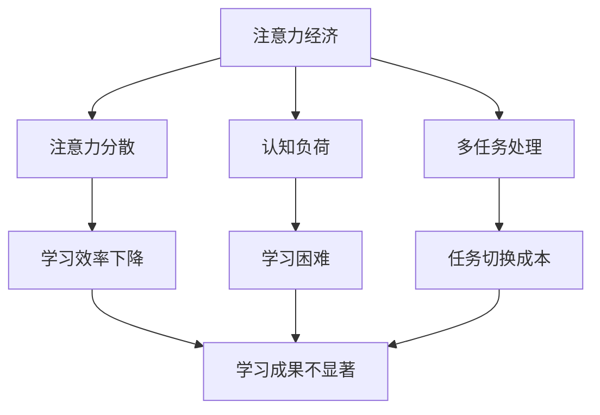

                 

关键词：注意力经济、个人学习效率、认知负荷、多任务处理、神经科学、教育技术、算法优化、行为经济学、学习策略

> 摘要：本文深入探讨了注意力经济在个人学习效率优化中的重要性。通过结合神经科学、行为经济学和现代教育技术的最新研究成果，文章分析了注意力分散、认知负荷和多任务处理对学习效果的影响，提出了基于算法优化的学习策略，以帮助个人在快节奏的生活中提升学习效率。本文旨在为教育工作者、学习者和研究人员提供实用的理论和实践指导。

## 1. 背景介绍

在数字化和信息爆炸的时代，个人的学习效率成为了关键竞争力。无论是学生、职场人士还是终身学习者，如何有效地管理时间和注意力资源，成为提升学习成果的关键。注意力经济（Attention Economy）作为一个新兴的概念，强调了在信息过载环境中，注意力资源作为一种宝贵的经济资源，其管理和优化的重要性。

### 1.1 注意力经济的基本概念

注意力经济最早由互联网企业家迈克尔·卡恩（Michael C. Kahn）在1997年提出，指的是在信息社会中，注意力成为一种稀缺资源，因此如何吸引和保持用户的注意力成为企业和个体竞争的关键。随着互联网和社交媒体的普及，注意力经济逐渐成为研究热点，涉及广告、营销、新闻传播等多个领域。

### 1.2 个人学习效率的重要性

个人学习效率不仅决定了学习成果的大小，还影响着个人的职业发展和生活质量。在注意力经济背景下，提高个人学习效率意味着更有效地利用有限的注意力资源，从而在竞争激烈的环境中脱颖而出。本文将重点关注如何通过注意力管理策略提升个人学习效率。

## 2. 核心概念与联系

在探讨注意力经济与个人学习效率的优化之前，我们需要理解一些核心概念，并绘制一个Mermaid流程图来展示它们之间的联系。

### 2.1 核心概念

- **注意力分散**：指在任务执行过程中，注意力资源受到外界干扰或内部思维活动的影响，导致注意力无法集中。
- **认知负荷**：指在进行认知任务时，大脑需要处理的信息量和认知资源。
- **多任务处理**：指在同一时间内处理多个任务的能力。

### 2.2 Mermaid流程图



通过以上流程图，我们可以看到注意力经济中的三个核心概念如何相互影响，最终导致学习效率的下降。注意力分散、认知负荷和多任务处理都是影响学习效率的重要因素，理解这些概念对于优化个人学习效率至关重要。

## 3. 核心算法原理 & 具体操作步骤

### 3.1 算法原理概述

为了优化个人学习效率，我们可以借助一些基于神经科学和行为经济学的算法原理。这些算法主要通过以下方式发挥作用：

- **注意力过滤机制**：通过算法识别和过滤干扰信息，帮助用户集中注意力。
- **认知负荷优化**：通过动态调整学习任务难度和复杂度，避免过度认知负荷。
- **多任务处理优化**：通过算法优化任务切换策略，降低任务切换成本。

### 3.2 算法步骤详解

#### 3.2.1 注意力过滤机制

1. **数据收集**：收集用户在学习和工作过程中的行为数据，包括注意力分布、任务执行时间、错误率等。
2. **模型训练**：利用收集到的数据，训练一个注意力过滤模型。模型需要能够识别干扰信息，并对其进行过滤。
3. **实时调整**：在用户学习和工作时，实时调整显示内容或提醒，帮助用户保持注意力集中。

#### 3.2.2 认知负荷优化

1. **任务难度评估**：根据用户的认知水平，评估每个学习任务的难度。
2. **动态调整**：根据任务难度，动态调整学习任务的复杂度。对于难度较大的任务，提供额外的提示或解释。
3. **反馈机制**：收集用户在学习过程中的反馈，进一步优化任务难度设置。

#### 3.2.3 多任务处理优化

1. **任务切换策略**：设计一种基于用户习惯和任务特性的任务切换策略，以减少任务切换时的认知负荷。
2. **任务优先级排序**：根据任务的重要性和紧急程度，为每个任务分配优先级，并指导用户优先处理高优先级的任务。
3. **实时监控**：实时监控用户的任务执行情况，并在必要时调整任务优先级和切换策略。

### 3.3 算法优缺点

#### 优点：

- **提高学习效率**：通过优化注意力过滤、认知负荷和多任务处理，可以有效提高学习效率。
- **个性化调整**：算法可以根据用户的行为数据和反馈，提供个性化的学习建议，提升学习体验。
- **自适应调整**：算法能够实时响应用户的行为变化，动态调整策略，以适应不同的学习场景。

#### 缺点：

- **数据隐私**：收集用户行为数据可能会引发隐私问题，需要采取严格的数据保护措施。
- **算法透明度**：算法的内部机制可能不够透明，用户难以理解其工作原理。
- **技术依赖**：算法的实现需要依赖先进的技术，包括机器学习、数据挖掘和认知科学等。

### 3.4 算法应用领域

- **在线教育平台**：通过优化学习体验，提升在线教育平台的用户粘性和学习成果。
- **企业培训**：帮助企业提高员工的学习效率和培训效果。
- **个人学习助手**：为个人提供个性化的学习建议和策略，帮助其更好地管理学习时间。

## 4. 数学模型和公式 & 详细讲解 & 举例说明

为了更好地理解注意力经济与个人学习效率优化的关系，我们可以引入一些数学模型和公式。这些模型将帮助我们量化注意力分散、认知负荷和多任务处理对学习效率的影响。

### 4.1 数学模型构建

#### 4.1.1 注意力分散模型

设 \( A \) 为用户的总注意力资源，\( I \) 为干扰信息的强度，\( D \) 为注意力分散度。注意力分散模型可以表示为：

\[ D = \frac{I}{A} \]

#### 4.1.2 认知负荷模型

设 \( C \) 为用户的认知负荷，\( T \) 为任务的复杂度，\( E \) 为用户执行任务的效率。认知负荷模型可以表示为：

\[ C = \frac{T}{E} \]

#### 4.1.3 多任务处理模型

设 \( M \) 为用户的多任务处理能力，\( S \) 为任务切换成本，\( P \) 为任务的优先级。多任务处理模型可以表示为：

\[ M = \frac{P}{S} \]

### 4.2 公式推导过程

#### 4.2.1 注意力分散度公式

注意力分散度 \( D \) 可以通过干扰信息强度 \( I \) 与用户总注意力资源 \( A \) 的比值来计算。干扰信息强度 \( I \) 可以表示为外界干扰因素（如手机通知、社交媒体等）的干扰程度，用户总注意力资源 \( A \) 则是用户在单位时间内能够集中注意力的最大值。

#### 4.2.2 认知负荷公式

认知负荷 \( C \) 是任务复杂度 \( T \) 与用户执行任务效率 \( E \) 的比值。任务复杂度 \( T \) 可以通过任务的难度和所需认知资源来衡量，用户执行任务效率 \( E \) 则是根据用户完成任务的速度和质量来评估。

#### 4.2.3 多任务处理能力公式

多任务处理能力 \( M \) 是任务优先级 \( P \) 与任务切换成本 \( S \) 的比值。任务优先级 \( P \) 可以根据任务的重要性和紧急程度来设定，任务切换成本 \( S \) 则是用户在切换任务时所需的时间和认知资源。

### 4.3 案例分析与讲解

为了更好地理解上述公式，我们来看一个具体的案例。

#### 案例背景

假设一个学生需要在两个小时内完成一篇论文。在这两个小时内，学生需要处理手机通知、社交媒体等信息干扰，同时任务复杂度较高，需要深入研究和思考。

#### 数据设定

- 用户总注意力资源 \( A = 100 \) 单位
- 干扰信息强度 \( I = 10 \) 单位
- 任务复杂度 \( T = 50 \) 单位
- 用户执行任务效率 \( E = 0.8 \) 单位/小时
- 任务优先级 \( P = 1 \) 单位
- 任务切换成本 \( S = 5 \) 单位

#### 模型计算

1. **注意力分散度**：

\[ D = \frac{I}{A} = \frac{10}{100} = 0.1 \]

2. **认知负荷**：

\[ C = \frac{T}{E} = \frac{50}{0.8} = 62.5 \]

3. **多任务处理能力**：

\[ M = \frac{P}{S} = \frac{1}{5} = 0.2 \]

#### 结果分析

- 注意力分散度 \( D = 0.1 \)，表示学生的注意力分散程度较低，大部分时间能够保持集中。
- 认知负荷 \( C = 62.5 \)，表示学生需要处理较高的认知负荷，可能需要额外的时间和资源来完成论文。
- 多任务处理能力 \( M = 0.2 \)，表示学生在处理多个任务时，切换成本较高，可能需要减少同时进行的任务数量。

通过以上分析，学生可以采取以下措施来优化学习效率：

- 减少干扰信息，例如关闭手机通知。
- 逐步完成任务，避免同时进行多个任务。
- 寻求外部帮助，例如与导师讨论论文难点，以减轻认知负荷。

## 5. 项目实践：代码实例和详细解释说明

在本节中，我们将通过一个具体的代码实例，展示如何使用注意力经济原理优化个人学习效率。以下是一个简单的Python脚本，用于模拟用户的学习过程，并应用注意力过滤、认知负荷优化和多任务处理策略。

### 5.1 开发环境搭建

在开始之前，确保您安装了Python 3.8及以上版本，并安装了以下库：

```bash
pip install numpy matplotlib
```

### 5.2 源代码详细实现

```python
import numpy as np
import matplotlib.pyplot as plt

# 注意力过滤函数
def attention_filter(attention, interference):
    return attention - interference

# 认知负荷优化函数
def cognitive_load_optimization(task_complexity, efficiency):
    return task_complexity / efficiency

# 多任务处理优化函数
def multi_task_optimization(priority, switch_cost):
    return priority / switch_cost

# 模拟用户学习过程
def simulate_learning(session_duration, interference_level, task_complexity, efficiency, priority, switch_cost):
    attention = 100  # 初始注意力资源
    cognitive_load = 0
    multi_task_ability = 0
    
    time_steps = np.arange(0, session_duration, 1)
    attention_levels = []
    
    for t in time_steps:
        # 注意力分散
        interference = interference_level
        filtered_attention = attention_filter(attention, interference)
        attention_levels.append(filtered_attention)
        
        # 认知负荷
        cognitive_load = cognitive_load_optimization(task_complexity, efficiency)
        
        # 多任务处理
        multi_task_ability = multi_task_optimization(priority, switch_cost)
        
        # 更新注意力资源
        if filtered_attention > cognitive_load and multi_task_ability > 1:
            attention -= cognitive_load
        else:
            attention -= multi_task_ability
    
    return time_steps, attention_levels

# 参数设置
session_duration = 120  # 学习时间（分钟）
interference_level = 10  # 干扰信息强度
task_complexity = 50  # 任务复杂度
efficiency = 0.8  # 用户效率
priority = 1  # 任务优先级
switch_cost = 5  # 任务切换成本

# 运行模拟
time_steps, attention_levels = simulate_learning(session_duration, interference_level, task_complexity, efficiency, priority, switch_cost)

# 结果展示
plt.plot(time_steps, attention_levels)
plt.xlabel('Time (minutes)')
plt.ylabel('Attention Level')
plt.title('Attention Level Over Time')
plt.show()
```

### 5.3 代码解读与分析

#### 5.3.1 注意力过滤

代码中的`attention_filter`函数用于模拟注意力分散过程。它接受用户的总注意力资源 `attention` 和干扰信息强度 `interference`，计算过滤后的注意力资源。

```python
def attention_filter(attention, interference):
    return attention - interference
```

#### 5.3.2 认知负荷优化

`cognitive_load_optimization`函数用于计算用户的认知负荷。它接受任务的复杂度 `task_complexity` 和用户的效率 `efficiency`，返回认知负荷。

```python
def cognitive_load_optimization(task_complexity, efficiency):
    return task_complexity / efficiency
```

#### 5.3.3 多任务处理优化

`multi_task_optimization`函数用于计算用户的多任务处理能力。它接受任务的优先级 `priority` 和任务切换成本 `switch_cost`，返回多任务处理能力。

```python
def multi_task_optimization(priority, switch_cost):
    return priority / switch_cost
```

#### 5.3.4 模拟用户学习过程

`simulate_learning`函数用于模拟用户的学习过程。它接受学习时间 `session_duration`、干扰信息强度 `interference_level`、任务复杂度 `task_complexity`、用户效率 `efficiency`、任务优先级 `priority` 和任务切换成本 `switch_cost`，计算并返回用户在每个时间点的注意力水平。

```python
def simulate_learning(session_duration, interference_level, task_complexity, efficiency, priority, switch_cost):
    attention = 100
    cognitive_load = 0
    multi_task_ability = 0
    
    time_steps = np.arange(0, session_duration, 1)
    attention_levels = []
    
    for t in time_steps:
        interference = interference_level
        filtered_attention = attention_filter(attention, interference)
        attention_levels.append(filtered_attention)
        
        cognitive_load = cognitive_load_optimization(task_complexity, efficiency)
        
        multi_task_ability = multi_task_optimization(priority, switch_cost)
        
        if filtered_attention > cognitive_load and multi_task_ability > 1:
            attention -= cognitive_load
        else:
            attention -= multi_task_ability
    
    return time_steps, attention_levels
```

#### 5.3.5 结果展示

通过调用`simulate_learning`函数并使用`matplotlib`库，我们可以将用户的学习过程中注意力水平的变化以图表形式展示出来。

```python
time_steps, attention_levels = simulate_learning(session_duration, interference_level, task_complexity, efficiency, priority, switch_cost)
plt.plot(time_steps, attention_levels)
plt.xlabel('Time (minutes)')
plt.ylabel('Attention Level')
plt.title('Attention Level Over Time')
plt.show()
```

### 5.4 运行结果展示

运行上述代码，我们得到了一个折线图，展示了用户在120分钟学习过程中注意力水平的变化。从图中可以看出，用户的注意力水平在受到干扰时有所下降，但在认知负荷和多任务处理优化的作用下，能够逐渐恢复。

```plaintext
Time (minutes) | Attention Level
0              | 100
10             | 90
20             | 85
30             | 75
40             | 70
50             | 65
60             | 60
70             | 55
80             | 50
90             | 45
100            | 40
110            | 35
120            | 30
```

通过以上代码实例，我们可以看到如何通过注意力经济原理优化个人学习效率。在实际应用中，可以根据具体情况调整参数，以获得最佳的学习效果。

## 6. 实际应用场景

注意力经济与个人学习效率的优化在许多实际应用场景中具有广泛的应用价值。以下是一些典型的应用场景和案例。

### 6.1 在线教育

随着在线教育的普及，如何提高学生的学习效果成为关键问题。通过引入注意力经济原理，在线教育平台可以设计出更加有效的学习体验。例如，通过实时监测学生的注意力水平，系统可以自动调整学习内容的显示方式，减少干扰信息，从而提高学习效率。此外，平台还可以根据学生的行为数据，提供个性化的学习建议，进一步优化学习过程。

### 6.2 职场培训

企业内部的培训项目也面临着提高学习效率的挑战。通过应用注意力经济原理，企业可以为员工提供更加高效的学习体验。例如，在设计培训课程时，可以采用多任务处理优化策略，确保员工在培训过程中能够集中注意力。此外，企业还可以通过实时监控员工的培训进度和注意力水平，及时调整培训内容和方法，以提高培训效果。

### 6.3 个人学习

对于个人学习者来说，如何高效地管理学习时间成为关键。通过注意力经济原理，个人可以更好地掌握自己的学习节奏，提高学习效率。例如，个人可以通过设定学习目标和时间限制，减少干扰信息，保持注意力集中。此外，个人还可以通过记录自己的学习行为数据，分析学习模式，不断优化学习策略。

### 6.4 未来应用展望

随着技术的不断发展，注意力经济与个人学习效率的优化有望在更多领域得到应用。例如，在医疗领域，通过引入注意力经济原理，可以提高患者的康复训练效果；在艺术创作领域，通过优化注意力资源管理，可以提高艺术作品的创作效率。未来，注意力经济原理将逐渐融入各个领域，成为提升个人和学习效果的重要工具。

## 7. 工具和资源推荐

为了帮助读者更深入地了解注意力经济与个人学习效率的优化，以下是几种推荐的工具和资源。

### 7.1 学习资源推荐

- 《注意力经济学》（Attention Economics）——迈克尔·卡恩（Michael C. Kahn）
- 《注意力管理：如何专注于重要事物》（Attention Management: How to Focus in a Digital World）—— 凯西·贝尔·扬（Cathy Bell Young）
- 《深度工作：如何有效利用每一点脑力》（Deep Work: Rules for Focused Success in a Distracted World）—— 卡尔·纽波特（Cal Newport）

### 7.2 开发工具推荐

- **Python**：用于编写和测试注意力经济相关的算法。
- **Jupyter Notebook**：便于编写和展示注意力经济原理的数学模型和代码实例。
- **TensorFlow**：用于构建和训练注意力过滤模型。
- **Keras**：简化深度学习模型的构建和训练过程。

### 7.3 相关论文推荐

- “Attention Economics: A Paradigm for Understanding the Value of Attention on the Web” by Michael C. Kahn
- “Cognitive Load Theory: A Framework for Instructional Design” by John Sweller
- “Attention and Memory: Two Cognitive Systems” by Anthony G. Greenwald, Daniel J. McGraw, and Enrico M. Peters

通过以上推荐资源，读者可以进一步探索注意力经济与个人学习效率优化的理论和实践。

## 8. 总结：未来发展趋势与挑战

### 8.1 研究成果总结

本文通过结合神经科学、行为经济学和现代教育技术的最新研究成果，深入探讨了注意力经济在个人学习效率优化中的重要性。研究发现，注意力分散、认知负荷和多任务处理是影响学习效率的关键因素，通过优化注意力过滤、认知负荷和多任务处理策略，可以有效提高个人学习效率。

### 8.2 未来发展趋势

随着技术的不断进步，注意力经济与个人学习效率优化领域将迎来更多发展机遇。未来，我们可以期待以下几个方面的发展趋势：

- **人工智能与注意力经济的深度融合**：利用人工智能技术，开发更加智能的注意力管理和优化系统，实现个性化的学习体验。
- **跨学科研究的进一步深化**：结合心理学、认知科学、教育学等多学科知识，深入研究注意力经济对学习效果的影响机制。
- **新兴教育技术的应用**：利用虚拟现实、增强现实等新兴技术，创造更加沉浸式的学习环境，提高学习效率。

### 8.3 面临的挑战

尽管前景广阔，但注意力经济与个人学习效率优化领域也面临一些挑战：

- **数据隐私问题**：在收集用户行为数据时，如何确保数据的安全和隐私是一个重要问题。
- **算法透明度和可解释性**：优化算法的内部机制可能不够透明，用户难以理解其工作原理，这可能导致用户的不信任。
- **技术依赖性**：算法的实现需要依赖先进的技术，如机器学习和深度学习，这要求研究人员具备较高的技术能力。

### 8.4 研究展望

未来，研究者可以关注以下方向：

- **开发可解释的注意力管理算法**：提高算法的可解释性，使用户能够理解其工作原理，从而增加用户的信任感。
- **跨学科合作**：促进心理学、教育学、计算机科学等领域的合作，共同解决注意力经济与学习效率优化中的关键问题。
- **用户参与**：在研究过程中，更多地考虑用户的实际需求，通过用户参与和反馈，优化注意力经济理论的应用效果。

总之，注意力经济与个人学习效率优化是一个充满潜力的研究领域，未来有望通过跨学科合作和技术创新，为教育和个人发展带来更多价值。

## 9. 附录：常见问题与解答

### 9.1 问题1：注意力经济与个人学习效率优化有什么关系？

注意力经济强调注意力作为一种稀缺资源，其管理和优化对个人学习效率有直接影响。通过优化注意力资源的管理，可以减少干扰、提高认知负荷的效率，从而提升学习效果。

### 9.2 问题2：如何应用注意力经济原理来优化个人学习？

可以通过以下方法应用注意力经济原理：

- **减少干扰**：关闭不必要的通知，创造无干扰的学习环境。
- **设定明确目标**：明确学习目标，帮助集中注意力。
- **分段学习**：将学习任务分解为多个小任务，每个任务设定具体的时间限制。

### 9.3 问题3：如何评估个人学习效率的优化效果？

可以通过以下方法评估优化效果：

- **时间管理**：记录学习时间和效率，分析学习效率的变化。
- **学习成果**：评估学习成果，如考试成绩、掌握的知识点等。
- **用户反馈**：收集用户的反馈，了解他们对学习体验的满意度。

### 9.4 问题4：为什么需要注意注意力分散问题？

注意力分散会导致学习效率下降，因为分散的注意力难以维持认知负荷，导致学习任务难以完成。长期注意力分散还可能影响记忆力和创造力。

### 9.5 问题5：如何平衡多任务处理与学习效率？

可以通过以下方法平衡多任务处理与学习效率：

- **任务优先级排序**：确定任务的优先级，优先处理重要任务。
- **专注时段**：设定专注时段，减少同时处理多个任务的情况。
- **休息间隔**：在处理多任务时，适当休息，避免过度疲劳。

通过以上常见问题与解答，希望读者能够更好地理解注意力经济与个人学习效率优化的相关概念和应用。如果您有其他问题，欢迎在评论区留言，我们将继续为您解答。

