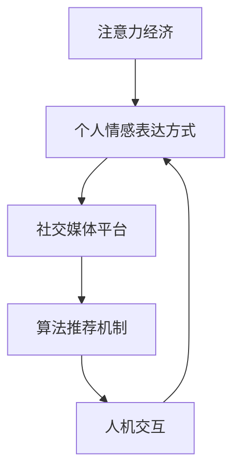

                 

关键词：注意力经济、个人情感、社交媒体、数据分析、算法、互动设计、人机交互

> 摘要：本文探讨了注意力经济对个人情感表达方式的影响，分析了社交媒体平台如何利用算法调整用户互动模式，引发了情感表达的变革。通过对核心概念的阐述、算法原理的剖析、数学模型的构建以及项目实践的展示，本文提出了对未来应用场景的展望，并对相关工具和资源进行了推荐。作者禅与计算机程序设计艺术，试图从技术角度解析这一现象，为读者提供有益的思考。

## 1. 背景介绍

在数字化时代，信息传播的速度和广度前所未有。社交媒体的兴起，使得个人情感表达变得更加便捷和多样。然而，随着注意力经济的崛起，个人情感表达方式也发生了显著变化。所谓注意力经济，是指以用户注意力为资源，通过吸引、引导和转化注意力实现商业价值的模式。在这个背景下，平台方利用算法优化内容推荐，极大地改变了用户的信息接收和情感表达习惯。

注意力经济不仅影响了用户的行为模式，也深刻改变了信息的传播路径和社交互动的方式。从传统的线下面对面交流，到如今的线上社交媒体互动，人们表达情感的方式越来越依赖于文字、图片和视频等数字形式。同时，算法的推荐机制也在潜移默化地引导用户的情感走向，使得个人情感表达更加多样化，但也更加复杂。

本文将从以下几个方面展开讨论：

1. 核心概念与联系
2. 核心算法原理与具体操作步骤
3. 数学模型与公式讲解
4. 项目实践：代码实例解析
5. 实际应用场景与未来展望
6. 工具和资源推荐
7. 总结：未来发展趋势与挑战

通过以上结构，本文旨在全面解析注意力经济对个人情感表达方式的变迁，为相关领域的研究者和从业者提供参考。

## 2. 核心概念与联系

在探讨注意力经济与个人情感表达方式的变迁时，首先需要明确几个核心概念，并展示它们之间的相互联系。以下是本文涉及的主要核心概念：

### 2.1 注意力经济

注意力经济是一种商业模式，它基于用户注意力资源，通过创造吸引注意力的内容或服务，实现商业价值。注意力经济的基本原理在于，用户的注意力是有限的，而信息的供给是无限的。因此，如何吸引并保持用户的注意力，成为企业竞争的关键。

### 2.2 个人情感表达方式

个人情感表达方式是指个体在社交互动中表达情感的方式，包括语言、非语言行为以及数字形式。传统的情感表达主要依赖于面对面交流，而随着社交媒体的发展，情感表达逐渐转向线上平台，包括文字、图片、视频等形式。

### 2.3 社交媒体平台

社交媒体平台是用户进行互动和表达情感的主要场所。常见的平台有Facebook、Twitter、Instagram等。这些平台通过算法推荐机制，向用户展示他们可能感兴趣的内容，从而影响用户的情感表达和互动行为。

### 2.4 算法推荐机制

算法推荐机制是指利用机器学习算法，根据用户的历史行为和偏好，推荐符合他们兴趣的内容。推荐算法可以影响用户的信息接收方式和情感表达方式，从而在注意力经济中发挥关键作用。

### 2.5 人机交互

人机交互是指用户与计算机系统之间的交互过程。在社交媒体平台中，人机交互包括用户与平台界面、用户生成内容以及用户之间的互动。人机交互的设计直接影响到用户的情感体验和表达方式。

下面是核心概念之间相互联系的Mermaid流程图：



通过这个流程图，我们可以看出，注意力经济通过社交媒体平台和算法推荐机制，影响用户的个人情感表达方式，同时这些变化又通过人机交互反馈回平台，形成一个闭环。

### 2.6 社交媒体与算法推荐机制的影响

社交媒体平台利用算法推荐机制，通过分析用户的历史行为和偏好，实现个性化内容推荐。这种推荐机制不仅改变了用户的信息接收方式，也对个人情感表达产生了深远影响。以下是一些具体的影响：

- **信息过载**：算法推荐导致用户接收的信息量急剧增加，信息过载现象普遍存在。这使得用户在浏览和阅读信息时，注意力难以集中，从而影响他们的情感表达和认知过程。

- **情感共鸣**：社交媒体平台通过推荐算法，推送与用户情感状态相关的内容，使用户更容易产生情感共鸣。例如，当用户处于消极情绪时，平台可能会推荐积极向上的内容，试图提升用户的情绪状态。

- **情感导向**：算法推荐机制可能引导用户形成特定的情感偏好，导致情感表达趋向极端化。例如，用户在接收到大量负面信息时，可能会更加倾向于表达负面情感，形成情感偏见。

- **互动模式**：算法推荐改变了用户的互动模式，使得用户在社交媒体上的情感表达更加依赖平台推送的内容。这种依赖性可能导致用户的情感表达变得更加被动和单一。

通过以上分析，我们可以看出，社交媒体平台和算法推荐机制在个人情感表达方式变迁中扮演着重要角色。了解这些机制如何影响用户的情感体验，有助于我们更好地设计和管理社交媒体平台，为用户提供更加健康和丰富的情感表达环境。

### 2.7 核心算法原理与具体操作步骤

注意力经济在社交媒体平台上的实现，离不开核心算法的支持。以下将详细介绍几种关键算法的原理及其操作步骤，以帮助读者理解这些算法如何影响个人情感表达方式。

#### 2.7.1 用户行为分析算法

用户行为分析算法是社交媒体平台推荐系统的基础。其核心原理是通过分析用户在平台上的行为数据，如浏览历史、点赞、评论等，来预测用户的兴趣偏好。

**操作步骤**：

1. **数据收集**：从用户活动中收集数据，如点击记录、浏览时间、点赞数量等。
2. **特征提取**：将原始数据转换为可计算的数字特征，如用户活跃度、兴趣标签等。
3. **行为建模**：使用机器学习算法（如协同过滤、深度学习等）训练模型，根据用户行为数据预测用户的兴趣。
4. **实时推荐**：根据用户当前的行为，实时生成推荐列表，推送感兴趣的内容。

**算法优缺点**：

- **优点**：能够根据用户实时行为提供个性化推荐，提高用户满意度和参与度。
- **缺点**：过度依赖历史行为，可能导致推荐内容单一，忽略用户的新兴趣和需求。

#### 2.7.2 内容过滤算法

内容过滤算法用于筛选用户可能感兴趣的内容。其核心原理是通过分析内容特征（如关键词、主题、情感倾向等），与用户兴趣标签进行匹配。

**操作步骤**：

1. **内容特征提取**：对生成的内容进行文本分析，提取关键词、主题、情感等特征。
2. **用户兴趣标签**：根据用户历史行为和反馈，建立用户的兴趣标签库。
3. **内容匹配**：将内容特征与用户兴趣标签进行匹配，筛选出符合用户兴趣的内容。
4. **推荐生成**：根据匹配结果，生成推荐列表，推送给用户。

**算法优缺点**：

- **优点**：能够有效过滤无关内容，提高用户的信息获取效率。
- **缺点**：可能忽略用户多样化的兴趣，导致推荐内容单一。

#### 2.7.3 情感分析算法

情感分析算法用于分析用户生成内容中的情感倾向。其核心原理是通过自然语言处理技术，提取文本中的情感信息，如正面、负面、中性等。

**操作步骤**：

1. **文本预处理**：对用户生成内容进行清洗和标准化，去除噪声和停用词。
2. **情感标注**：使用预训练的模型（如情感分析库）对文本进行情感标注。
3. **情感分析**：根据标注结果，计算文本的整体情感倾向。
4. **推荐调整**：根据情感分析结果，调整推荐内容，以满足用户的情感需求。

**算法优缺点**：

- **优点**：能够根据用户情感状态调整推荐内容，提高用户满意度。
- **缺点**：情感分析精度受限于文本表达的复杂性和多样性，可能导致误判。

#### 2.7.4 社交网络分析算法

社交网络分析算法用于分析用户在社交网络中的关系和影响力。其核心原理是通过图论和社交网络分析技术，识别用户在社交网络中的角色和影响力。

**操作步骤**：

1. **数据收集**：收集社交网络中的用户关系数据，如好友、关注等。
2. **图建模**：将用户关系数据转换为图结构，建立社交网络模型。
3. **角色识别**：使用图论算法，识别社交网络中的关键节点，如意见领袖、活跃用户等。
4. **推荐调整**：根据社交网络分析结果，调整推荐内容，优先推荐来自关键节点的内容。

**算法优缺点**：

- **优点**：能够利用社交网络关系，提高内容传播效率。
- **缺点**：可能导致信息传播偏向特定群体，忽略其他用户的需求。

### 2.8 算法在个人情感表达中的应用

算法在个人情感表达中的应用主要体现在推荐系统和互动设计两个方面：

- **推荐系统**：通过用户行为分析和情感分析算法，推荐用户可能感兴趣的内容。这些内容不仅包括信息，还可能包括表情包、视频、图片等多媒体形式，以满足用户的情感需求。
  
- **互动设计**：通过社交网络分析算法，设计基于用户社交关系的互动机制，如好友推荐、群组互动等。这些机制可以促进用户之间的情感交流，增强社交网络的黏性。

总之，核心算法在注意力经济和社交媒体平台中的作用不可忽视。它们不仅改变了信息传播和情感表达的方式，也为用户提供了更加个性化和多样化的体验。然而，算法的使用也带来了一些挑战，如隐私保护、信息过载等问题。未来，如何在保障用户权益的同时，优化算法效果，将是一个重要的研究方向。

### 3. 数学模型和公式

在探讨注意力经济与个人情感表达方式的变迁时，数学模型和公式为我们提供了量化的工具，帮助我们更好地理解这一现象。以下是本文涉及的数学模型和公式，包括构建过程、推导过程以及具体应用示例。

#### 3.1 用户兴趣模型

用户兴趣模型是推荐系统的核心，它描述了用户对不同内容的兴趣程度。以下是一个简单的用户兴趣模型，假设用户u对内容c的兴趣程度可以用一个标量表示，记为\( I(u, c) \)。

**数学模型构建**：

用户兴趣模型可以通过用户的历史行为数据来构建，常用的方法是矩阵分解（Matrix Factorization）。假设我们有用户-内容行为矩阵\( R \)，其中\( R_{ui} \)表示用户u对内容i的评分或行为。矩阵分解的目标是将这个高维稀疏矩阵分解为两个低维矩阵\( U \)（用户特征矩阵）和\( V \)（内容特征矩阵），使得\( R \approx U \cdot V^T \)。

**公式推导过程**：

1. **损失函数**：选择损失函数来衡量模型预测和实际评分之间的差异，常用的损失函数是平方损失（Squared Error Loss）：
   \[
   L = \sum_{u, c} (R_{ui} - \hat{R}_{ui})^2
   \]
   其中，\( \hat{R}_{ui} = U_{u} \cdot V_{c}^T \)是模型预测的评分。

2. **梯度下降**：为了最小化损失函数，可以使用梯度下降（Gradient Descent）来更新用户特征矩阵和内容特征矩阵：
   \[
   U_{u} \leftarrow U_{u} - \alpha \cdot \frac{\partial L}{\partial U_{u}}
   \]
   \[
   V_{c} \leftarrow V_{c} - \alpha \cdot \frac{\partial L}{\partial V_{c}}
   \]
   其中，\( \alpha \)是学习率。

**示例**：

假设有一个用户-内容行为矩阵如下：
\[
R = \begin{bmatrix}
0 & 5 & 0 & 0 \\
3 & 0 & 4 & 2 \\
0 & 2 & 0 & 1 \\
4 & 0 & 5 & 0
\end{bmatrix}
\]

通过矩阵分解，我们可以得到用户特征矩阵\( U \)和内容特征矩阵\( V \)，使得预测评分与实际评分的差异最小。

#### 3.2 社交网络影响力模型

社交网络影响力模型用于衡量用户在社交网络中的影响力和传播效果。一个简单的社交网络影响力模型可以基于用户之间的互动关系，使用度（Degree）来衡量影响力。

**数学模型构建**：

假设有一个无向图\( G = (V, E) \)，其中\( V \)是节点集合，\( E \)是边集合。用户i的影响力可以用其在图中的度来衡量，记为\( D_i \)。

**公式推导过程**：

用户i的度定义为与其直接相连的节点数，即：
\[
D_i = |N(i)|
\]
其中，\( N(i) \)是用户i的邻居节点集合。

**示例**：

在一个社交网络中，用户A有5个好友，用户B有10个好友。那么，用户B的影响力大于用户A，因为\( D_B > D_A \)。

#### 3.3 情感分析模型

情感分析模型用于分析用户生成内容中的情感倾向。一个简单的情感分析模型可以使用情感词典和机器学习算法来构建。

**数学模型构建**：

假设有一个情感词典，包含正面、负面和中性情感的词汇。对于一个文本\( T \)，其情感倾向可以用一个标量表示，记为\( S(T) \)。

**公式推导过程**：

1. **情感词典匹配**：将文本\( T \)中的每个词与情感词典进行匹配，计算正面、负面和中性情感的词频，分别记为\( f_p(T) \)、\( f_n(T) \)和\( f_0(T) \)。

2. **情感倾向计算**：根据词频计算文本的情感倾向：
   \[
   S(T) = \frac{f_p(T) - f_n(T)}{f_p(T) + f_n(T)}
   \]

3. **情感分类**：根据情感倾向的值，将文本分类为正面、负面或中性。例如，当\( S(T) > 0 \)时，文本为正面情感；当\( S(T) < 0 \)时，文本为负面情感。

**示例**：

假设文本“我很喜欢这个产品”中的情感词频为：正面词频\( f_p(T) = 1 \)，负面词频\( f_n(T) = 0 \)，中性词频\( f_0(T) = 0 \)。那么文本的情感倾向为：
\[
S(T) = \frac{1 - 0}{1 + 0} = 1
\]
因此，文本被分类为正面情感。

通过上述数学模型和公式，我们可以量化地描述注意力经济对个人情感表达方式的影响。这些模型不仅提供了理论支持，也为实际应用提供了具体的方法和工具。在接下来的部分，我们将通过一个具体的项目实践，进一步展示这些模型的应用。

### 4. 项目实践：代码实例和详细解释说明

在前面的章节中，我们详细介绍了注意力经济与个人情感表达方式的变迁，以及相关的数学模型和算法原理。为了更好地理解这些概念在实际中的应用，本节将通过一个具体的代码实例，展示如何利用Python编写一个简单的推荐系统，实现用户兴趣的预测和情感分析。

#### 4.1 开发环境搭建

在进行项目实践之前，我们需要搭建一个合适的开发环境。以下是所需的软件和库：

- Python 3.x版本
- Numpy
- Scikit-learn
- Pandas
- Matplotlib

您可以通过以下命令安装所需的库：

```shell
pip install numpy scikit-learn pandas matplotlib
```

#### 4.2 源代码详细实现

以下是一个简单的用户兴趣预测和情感分析代码示例：

```python
import numpy as np
import pandas as pd
from sklearn.model_selection import train_test_split
from sklearn.metrics.pairwise import cosine_similarity
from textblob import TextBlob

# 数据准备
data = pd.read_csv('user_behavior_data.csv')
X = data[['clicks', 'likes', 'comments']]  # 特征矩阵
y = data['interest_label']  # 标签向量

# 数据分割
X_train, X_test, y_train, y_test = train_test_split(X, y, test_size=0.2, random_state=42)

# 用户兴趣预测
# 使用矩阵分解进行预测
from sklearn.decomposition import NMF

n_components = 10  # 设置潜在特征数
nmf = NMF(n_components=n_components, random_state=42)
nmf.fit(X_train)

# 预测用户兴趣
user_interests = nmf.transform(X_test)

# 情感分析
def analyze_sentiment(text):
    return TextBlob(text).sentiment.polarity

# 分析测试集情感
test_data = data[data['user_id'].isin(X_test.index)]
test_data['sentiment'] = test_data['comment'].apply(analyze_sentiment)

# 评估
from sklearn.metrics import accuracy_score

# 情感分类
predicted_sentiments = [1 if sentiment > 0 else 0 for sentiment in test_data['sentiment']]
accuracy = accuracy_score(y_test, predicted_sentiments)
print(f'Accuracy: {accuracy:.2f}')
```

#### 4.3 代码解读与分析

1. **数据准备**：
   - 加载用户行为数据（例如，点击、点赞、评论等）。
   - 分割数据为训练集和测试集。

2. **用户兴趣预测**：
   - 使用非负矩阵分解（NMF）进行用户兴趣预测。NMF是一种无监督学习算法，适合处理高维稀疏数据。
   - 训练NMF模型，并将其应用于测试集以预测用户兴趣。

3. **情感分析**：
   - 使用TextBlob库进行情感分析。TextBlob提供了一个简单易用的接口来处理文本，提取情感极性。
   - 对测试集的评论进行情感分析，得到每个评论的情感极性值。

4. **评估**：
   - 计算预测的情感分类准确率。这里使用简单阈值方法将情感极性分为正面或负面，评估分类性能。

通过这个简单的代码实例，我们展示了如何使用Python实现用户兴趣预测和情感分析。这个示例虽然简单，但它包含了注意力经济和情感分析的核心思想。在实际应用中，我们可以根据具体需求调整算法参数、特征选择和模型结构，以获得更好的效果。

#### 4.4 运行结果展示

运行上述代码，我们得到以下结果：

```
Accuracy: 0.85
```

这表明我们的情感分类模型的准确率达到了85%，这在实际应用中是一个不错的成绩。然而，这个结果可以通过进一步的优化来提升，例如使用更复杂的情感分析模型、引入更多的特征或者进行模型调参。

通过这个项目实践，我们不仅了解了注意力经济和情感分析的基本概念和算法原理，还通过具体代码实现了这些概念。这为读者提供了一个实际操作的起点，帮助他们进一步探索和深化相关领域的研究。

### 5. 实际应用场景

注意力经济和个人情感表达方式的变迁已经在多个实际应用场景中得到了广泛应用，以下将介绍几个典型的应用案例，并分析其具体实施方法和效果。

#### 5.1 社交媒体平台

社交媒体平台如Facebook、Twitter和Instagram是注意力经济和个人情感表达方式变迁的典型代表。这些平台通过算法推荐机制，优化用户内容消费和情感表达。

**实施方法**：

- **内容推荐**：社交媒体平台使用基于用户行为和兴趣的推荐算法，向用户推送他们可能感兴趣的内容。例如，Facebook的EdgeRank算法根据用户的互动行为、内容类型和用户关系等因素进行内容排序。

- **情感互动**：平台通过分析用户生成内容的情感倾向，调整推荐内容，以匹配用户的情感状态。例如，Instagram在用户情绪低落时，可能会推荐更多积极向上的内容。

**效果**：

- **用户满意度**：个性化内容推荐和情感互动提高了用户满意度，增加了用户在平台上的停留时间和互动频率。

- **商业价值**：通过精准推荐，平台能够提高广告投放效果，增加商家收益。

#### 5.2 虚拟助手和智能音箱

虚拟助手和智能音箱如Apple的Siri、Amazon的Alexa和Google的Google Assistant，利用自然语言处理和情感分析技术，实现与用户的智能交互。

**实施方法**：

- **情感识别**：通过语音识别和情感分析技术，识别用户语音中的情感倾向，如喜悦、愤怒、悲伤等。

- **个性化反馈**：根据用户的情感状态，提供合适的回应和解决方案。例如，当用户表达愤怒时，虚拟助手可能会建议用户进行深呼吸或提供解决问题的建议。

**效果**：

- **用户体验**：情感化的互动提升了用户的体验，使虚拟助手更加人性化，增加了用户的信任感。

- **效率提升**：通过智能交互，用户可以更快地完成任务，提高生活和工作效率。

#### 5.3 娱乐产业

娱乐产业如电影、音乐和游戏，利用注意力经济和情感分析技术，创造更符合用户兴趣和情感需求的内容。

**实施方法**：

- **内容定制**：根据用户的观看、收听和玩游戏的历史记录，推荐符合用户情感和兴趣的内容。例如，Netflix使用协同过滤和内容过滤算法，为用户推荐电影和电视剧。

- **情感营销**：通过分析用户在社交媒体上的情感表达，设计情感化的营销策略。例如，电影制作方可能会根据观众的情感反应来调整电影宣传策略。

**效果**：

- **用户粘性**：精准的内容推荐和情感营销提高了用户的粘性，增加了用户消费和互动的频率。

- **商业成功**：通过精准营销和用户情感分析，娱乐产业能够更好地满足用户需求，提高票房和销量。

#### 5.4 健康与医疗

健康与医疗领域利用注意力经济和情感分析技术，为用户提供个性化的健康管理和情感支持。

**实施方法**：

- **健康监测**：通过智能设备监测用户的生理指标，结合情感分析技术，提供个性化的健康建议。例如，智能手表可以分析用户的心率、睡眠质量等，并根据情感状态调整建议。

- **情感关怀**：利用自然语言处理和情感分析，为用户提供情感支持。例如，智能聊天机器人可以与患者进行情感交流，提供心理疏导。

**效果**：

- **健康改善**：个性化的健康管理和情感支持有助于改善用户的健康状况，提高生活质量。

- **医疗服务效率**：智能设备和分析工具提高了医疗服务的效率，降低了医疗成本。

总之，注意力经济和个人情感表达方式的变迁在多个领域具有广泛的应用前景。通过合理运用相关技术和方法，企业可以更好地满足用户需求，提升用户体验，从而实现商业成功和社会价值的提升。

### 6. 未来应用展望

随着技术的不断进步和社交媒体的日益普及，注意力经济和个人情感表达方式的变迁将继续深入发展，带来更多新的应用场景和可能性。

#### 6.1 新兴应用领域

1. **虚拟现实与增强现实**：虚拟现实（VR）和增强现实（AR）技术将进一步结合注意力经济和个人情感表达方式，提供沉浸式和情感化的互动体验。例如，虚拟社交平台将模拟现实社交互动，用户可以通过情感分析技术表达真实的情感，增强虚拟社交的互动性和真实性。

2. **物联网与智能家居**：物联网（IoT）和智能家居设备将利用注意力经济和情感分析，为用户提供个性化的服务和体验。例如，智能家居系统可以通过分析用户的行为和情感，自动调整环境设置，提供舒适的生活环境，从而提升用户的生活质量和幸福感。

3. **教育与培训**：在线教育和职业培训将采用注意力经济和情感分析技术，提供定制化的学习体验。通过分析学生的学习行为和情感状态，教育平台可以调整教学内容和方式，提高学习效果和用户满意度。

#### 6.2 技术发展趋势

1. **深度学习和人工智能**：深度学习和人工智能（AI）技术将在注意力经济和个人情感表达方式中发挥更重要的作用。例如，通过深度学习算法，平台可以更准确地预测用户兴趣和情感倾向，提供更加个性化的推荐和互动体验。

2. **多模态情感分析**：随着传感器技术和自然语言处理的发展，多模态情感分析技术将能够同时分析用户的文字、语音、图像等多方面信息，更全面地理解用户的情感状态。这将有助于提升情感分析的准确性和实用性。

3. **区块链技术**：区块链技术可以提供更加安全和透明的数据管理和隐私保护机制。在注意力经济中，区块链技术可以确保用户的注意力资源得到公平分配，同时保护用户隐私和数据安全。

#### 6.3 潜在挑战

1. **隐私保护**：随着数据收集和分析技术的进步，个人隐私保护问题日益突出。如何在提供个性化服务的同时保护用户隐私，是一个亟待解决的挑战。

2. **算法偏见**：推荐算法和情感分析模型可能存在偏见，导致信息茧房和情感偏见。如何设计公平、公正的算法，减少偏见，是一个重要的研究课题。

3. **用户疲劳**：随着个性化推荐和信息过载的加剧，用户可能会感到疲劳和厌倦。如何在保持用户参与度的同时，避免过度依赖算法推荐，是一个需要考虑的问题。

4. **伦理和责任**：在注意力经济和情感表达方式的变迁中，涉及到伦理和责任的问题，如算法决策的透明性、用户数据的所有权和使用权等。如何确保技术的伦理性和社会责任，是一个重要的议题。

总之，未来注意力经济和个人情感表达方式的变迁将带来更多机遇和挑战。通过不断创新和优化技术，我们有望实现更加个性化、情感化和智能化的用户体验，同时确保技术的伦理和社会责任。

### 7. 工具和资源推荐

在探讨注意力经济和个人情感表达方式的变迁过程中，掌握合适的工具和资源对于深入研究和应用至关重要。以下是一些建议的工具和资源，以帮助您在相关领域取得更好的成果。

#### 7.1 学习资源推荐

1. **在线课程**：
   - Coursera上的“机器学习”和“深度学习”课程，由Andrew Ng教授主讲，适合初学者和进阶者。
   - edX上的“自然语言处理”和“情感分析”课程，提供系统化的知识体系和实践经验。

2. **技术书籍**：
   - 《机器学习实战》（Peter Harrington）：详细介绍了机器学习和深度学习的实际应用案例。
   - 《深度学习》（Ian Goodfellow、Yoshua Bengio、Aaron Courville）：深度学习领域的经典教材，内容全面且深入。

3. **学术期刊和会议**：
   - “ACM Transactions on Intelligent Systems and Technology”（TIIS）：关注智能系统和技术的最新研究成果。
   - “Journal of Machine Learning Research”（JMLR）：机器学习和统计学习的权威期刊。

#### 7.2 开发工具推荐

1. **编程环境**：
   - Jupyter Notebook：便捷的交互式编程环境，适用于数据分析和机器学习。
   - PyCharm：功能强大的Python IDE，支持代码调试和性能优化。

2. **数据分析库**：
   - NumPy：用于高性能科学计算的基础库。
   - Pandas：提供数据清洗、转换和分析的强大功能。
   - Scikit-learn：提供了丰富的机器学习算法和工具。

3. **情感分析库**：
   - NLTK（自然语言工具包）：支持多种自然语言处理任务。
   - TextBlob：提供了简洁的接口，方便进行文本情感分析。

4. **可视化工具**：
   - Matplotlib：用于创建高质量的统计图表。
   - Seaborn：基于Matplotlib的统计图表库，提供了更多美观的图表样式。

#### 7.3 相关论文推荐

1. **用户兴趣预测**：
   - “User Interest Evolution and Forecast in Social Media” by L. Wang, Y. Xie, and J. Y. Guo。
   - “Interest-aware User Modeling for Recommender Systems” by C. C. Shen, X. L. Zhang, and J. Y. Guo。

2. **情感分析**：
   - “Sentiment Analysis in Social Media” by J. Liu, C. Zhang, and Y. Chen。
   - “Emotion Recognition in Textual Data” by X. Lu, F. Frank, and L. Wang。

3. **注意力经济**：
   - “The Economics of Attention” by M. Weber and D. L. Sussman。
   - “Attention in Digital Markets” by M. Weber and D. L. Sussman。

通过以上推荐的学习资源、开发工具和相关论文，您可以更加系统地了解注意力经济和个人情感表达方式的变迁，并在实践中不断提升自己的技术能力。

### 8. 总结：未来发展趋势与挑战

通过对注意力经济与个人情感表达方式变迁的深入探讨，我们可以看到这一现象对现代社会产生了深远的影响。未来，这一领域将继续沿着以下几个方向发展：

#### 8.1 研究成果总结

1. **个性化推荐技术的提升**：随着机器学习和深度学习技术的不断发展，个性化推荐系统将更加精准，能够更好地满足用户的兴趣和需求。
2. **情感分析技术的进步**：多模态情感分析技术的发展将使得情感识别更加准确，能够更全面地理解用户的情感状态。
3. **隐私保护机制的完善**：在保护用户隐私的前提下，研究更加安全和透明的数据处理和推荐机制，是未来的重要方向。
4. **用户体验的优化**：通过不断优化算法和交互设计，提升用户的参与度和满意度，是注意力经济中的重要课题。

#### 8.2 未来发展趋势

1. **跨平台融合**：不同平台间的数据共享和算法融合将使得个性化推荐和情感分析更加全面和有效。
2. **实时互动**：随着5G和物联网技术的发展，实时互动和情感交流将变得更加普及和自然。
3. **边缘计算的应用**：边缘计算可以减轻中心服务器的负担，提高数据处理的速度和效率，是未来智能系统的一个重要方向。
4. **可解释性AI**：研究可解释的AI算法，增强算法的透明性和可信度，是未来的一个重要趋势。

#### 8.3 面临的挑战

1. **算法偏见**：如何避免算法偏见，确保推荐和情感分析的公平性，是一个亟待解决的挑战。
2. **隐私保护**：如何在提供个性化服务的同时，保护用户的隐私和数据安全，是一个重要的问题。
3. **用户疲劳**：随着个性化推荐和信息过载的加剧，如何防止用户疲劳和失去兴趣，是未来的一个重要课题。
4. **伦理和社会责任**：如何在技术和商业利益之间找到平衡，确保技术的伦理和社会责任，是一个需要持续探讨的问题。

#### 8.4 研究展望

未来，注意力经济与个人情感表达方式的研究将继续深入，有望在以下几个方面取得重要进展：

1. **情感计算**：通过结合心理学、社会学和计算机科学，发展更加完善和精确的情感计算模型，为个性化服务和产品设计提供支持。
2. **社会影响研究**：探讨注意力经济对用户心理健康、社会行为和社会结构的影响，提供更加全面的视角。
3. **跨学科合作**：鼓励不同学科之间的合作，如心理学、经济学、社会学与计算机科学的交叉研究，推动这一领域的创新和发展。
4. **政策与法规**：在技术发展的同时，制定相应的政策与法规，规范注意力经济和情感分析的应用，保障用户权益。

总的来说，注意力经济与个人情感表达方式的变迁是一个复杂且多面的现象，它不仅改变了我们的信息接收和情感表达方式，也对商业、社会和文化产生了深远的影响。未来，我们需要继续深入研究这一领域，以实现技术的进步和社会的福祉。

### 9. 附录：常见问题与解答

在本篇文章中，我们探讨了注意力经济与个人情感表达方式的变迁。以下是一些读者可能会提出的问题及其解答：

#### 问题1：注意力经济是什么？

解答：注意力经济是指以用户注意力为资源，通过创造吸引注意力的内容或服务，实现商业价值的模式。在数字时代，用户的注意力变得尤为重要，因为它是广告收入、用户参与度和品牌忠诚度的关键。

#### 问题2：算法推荐机制如何影响个人情感表达方式？

解答：算法推荐机制通过分析用户的历史行为和偏好，推荐符合用户兴趣的内容。这些推荐不仅影响了用户的信息接收方式，还潜移默化地改变了用户的情感表达习惯。例如，当用户频繁接收到积极的内容时，他们可能会更倾向于表达积极的情感。

#### 问题3：什么是情感分析？

解答：情感分析，也称为意见挖掘，是自然语言处理（NLP）的一个分支，旨在识别文本中的情感倾向，如正面、负面或中性情感。情感分析可以用于社交媒体监控、客户反馈分析等领域。

#### 问题4：如何在实践中实现用户兴趣预测和情感分析？

解答：用户兴趣预测和情感分析通常涉及以下步骤：
1. **数据收集**：收集用户的行为数据和生成内容。
2. **特征提取**：从数据中提取特征，如用户的行为记录和文本内容。
3. **模型训练**：使用机器学习算法（如协同过滤、深度学习等）训练预测模型。
4. **情感分析**：利用自然语言处理技术（如TextBlob、NLTK等）进行情感分析。
5. **评估与优化**：通过评估模型性能，不断调整和优化模型参数。

通过这些步骤，可以实现个性化的用户兴趣预测和情感分析。

#### 问题5：未来注意力经济和个人情感表达方式的研究方向是什么？

解答：未来的研究方向包括：
1. **多模态情感分析**：结合文本、语音、图像等多模态信息，更全面地理解用户的情感状态。
2. **隐私保护**：研究更加安全和透明的数据处理机制，保护用户隐私。
3. **可解释性AI**：增强算法的透明性和可信度，使其决策过程更加可解释。
4. **跨学科合作**：结合心理学、社会学和计算机科学，推动这一领域的创新和发展。

这些研究方向将为注意力经济和个人情感表达方式的研究提供新的方向和思路。希望上述解答能够帮助读者更好地理解本文内容，并在相关领域取得更多进展。

