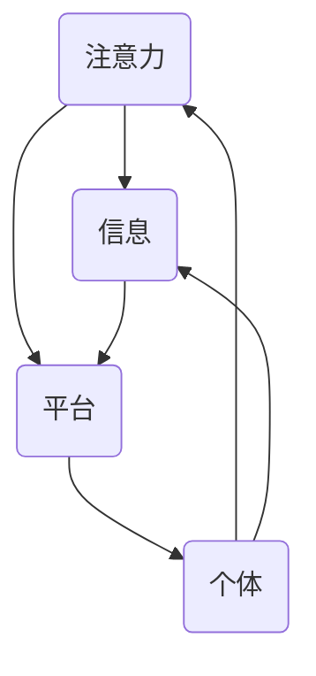

                 

注意力经济是当今数字化时代的一种新兴经济形态，它强调个体在信息获取、处理和应用过程中的时间和精力投入，具有高度的个性化与即时性。而个人时间估值的变化，则反映了社会、经济和技术的发展对时间价值认知的深刻影响。本文旨在探讨注意力经济背景下个人时间估值的变化趋势及其对信息技术领域的影响，以期为相关研究和实践提供参考。

## 1. 背景介绍

### 1.1 注意力经济的定义与特点

注意力经济（Attention Economy）最早由Sherry Turkle在1995年提出，是指个体在获取、处理和应用信息时，其注意力的分配和使用所形成的经济现象。与传统经济模式不同，注意力经济以个体的注意力为价值载体，强调信息传递的效率和个体参与度。

注意力经济具有以下几个显著特点：

1. **个性化**：在注意力经济中，个体的需求、兴趣和偏好决定了信息的传播路径和形式。
2. **即时性**：信息的获取和处理速度大大提升，使个体能够及时作出反应。
3. **互动性**：个体与信息之间的互动性增强，信息传播更加互动和双向。
4. **稀缺性**：由于个体注意力的有限性，高质量的注意力资源变得更加稀缺。

### 1.2 个人时间估值的变化

个人时间估值的变化是随着社会、经济和技术的发展而不断演变的。在过去，时间估值主要基于工作时间和收入水平，即个人时间价值与劳动价值挂钩。然而，在注意力经济的背景下，个人时间估值开始呈现出新的特点：

1. **效率优先**：在数字化时代，个人时间估值更注重效率，即如何在有限的时间内获取最大的信息量和价值。
2. **个性化需求**：个人时间估值受到个性化需求的驱动，不同个体对时间的价值认知差异较大。
3. **即时满足**：即时满足感使得个人时间估值更加注重当下的体验和效益。
4. **心理成本**：随着对时间价值的认知提高，个体对时间的心理成本也不断增加。

## 2. 核心概念与联系

### 2.1 注意力经济的核心概念

在注意力经济中，核心概念包括注意力、信息、平台和个体。

- **注意力**：个体的注意力资源，是信息传播和价值交换的基础。
- **信息**：信息是注意力经济的核心，是引起个体注意力的对象。
- **平台**：平台是连接个体和信息的中介，提供信息获取和交流的渠道。
- **个体**：个体是注意力经济中的核心参与者，其注意力的分配和使用决定了信息传播的效果。

### 2.2 个人时间估值的变化与注意力经济的关系

个人时间估值的变化与注意力经济密切相关。随着注意力经济的兴起，个体对时间的价值认知发生了显著变化，这主要体现在以下几个方面：

1. **时间效率**：在注意力经济中，时间效率成为个体时间估值的核心，个体更加关注如何在有限的时间内实现最大化的价值产出。
2. **时间稀缺性**：注意力资源的稀缺性使得时间变得更加宝贵，个体开始更加重视时间管理。
3. **时间价值多样化**：不同个体对时间的价值认知多样化，时间价值不再仅仅与劳动价值挂钩，而与个性化需求、即时满足和心理成本等多重因素相关。
4. **时间透明度**：随着信息技术的发展，个体对时间使用的透明度提高，时间管理的科学性和精确性得到提升。

### 2.3 Mermaid 流程图

以下是一个简单的Mermaid流程图，展示了注意力经济中核心概念之间的联系：



## 3. 核心算法原理 & 具体操作步骤

### 3.1 算法原理概述

在注意力经济背景下，个人时间估值的计算需要综合考虑多个因素，包括注意力资源、信息价值、平台效益和个体需求。本文提出一种基于多因子分析的注意力经济时间估值模型，该模型通过以下步骤实现：

1. **注意力资源评估**：通过分析个体的注意力分配和使用情况，评估其注意力资源总量。
2. **信息价值评估**：通过对信息的质量、相关性和实用性进行评估，确定信息对个体的价值。
3. **平台效益评估**：评估平台在信息传递和互动中的效益，包括信息传播效率、用户体验和平台影响力。
4. **个体需求评估**：分析个体的个性化需求，包括兴趣、偏好和即时满足感。

### 3.2 算法步骤详解

#### 步骤一：注意力资源评估

- **输入**：个体的注意力分配和使用数据。
- **输出**：个体注意力资源总量。

具体操作步骤如下：

1. 收集个体的注意力分配数据，包括在线时长、浏览记录、交互行为等。
2. 采用加权平均法计算个体注意力资源总量。

#### 步骤二：信息价值评估

- **输入**：信息质量、相关性、实用性数据。
- **输出**：信息对个体的价值。

具体操作步骤如下：

1. 对信息进行质量评估，包括准确性、权威性、新颖性等。
2. 对信息进行相关性评估，分析信息与个体需求的匹配度。
3. 对信息进行实用性评估，评估信息对个体实际需求的满足程度。
4. 采用综合评估法计算信息对个体的价值。

#### 步骤三：平台效益评估

- **输入**：平台信息传播效率、用户体验、平台影响力数据。
- **输出**：平台效益。

具体操作步骤如下：

1. 评估平台信息传播效率，包括信息传播速度、覆盖范围等。
2. 评估平台用户体验，包括界面友好性、功能完善度等。
3. 评估平台影响力，包括用户活跃度、用户忠诚度等。
4. 采用加权平均法计算平台效益。

#### 步骤四：个体需求评估

- **输入**：个体兴趣、偏好、即时满足感数据。
- **输出**：个体需求价值。

具体操作步骤如下：

1. 收集个体兴趣、偏好和即时满足感数据。
2. 采用基于兴趣的偏好模型计算个体需求价值。

### 3.3 算法优缺点

#### 优点

1. **综合评估**：该模型综合考虑了注意力资源、信息价值、平台效益和个体需求，提供了全面的时间估值评估。
2. **灵活性**：模型参数可以根据实际需求进行调整，具有较强的适应性。
3. **科学性**：基于多因子分析的方法具有较高的科学性和准确性。

#### 缺点

1. **数据收集难度**：模型的实施需要收集大量的个体数据，数据收集的难度较大。
2. **计算复杂度**：模型的计算复杂度较高，需要大量的计算资源。
3. **模型偏差**：模型的评估结果可能受到数据质量的影响，存在一定的偏差。

### 3.4 算法应用领域

该模型可以应用于多个领域，包括：

1. **广告投放**：根据用户时间估值调整广告投放策略，提高广告效果。
2. **产品设计**：根据用户时间估值优化产品功能，提高用户满意度。
3. **时间管理**：为用户提供个性化的时间管理建议，提高时间利用效率。

## 4. 数学模型和公式 & 详细讲解 & 举例说明

### 4.1 数学模型构建

在注意力经济中，个人时间估值可以表示为一个多维度的数学模型，包括：

\[ \text{个人时间估值} = f(\text{注意力资源}, \text{信息价值}, \text{平台效益}, \text{个体需求}) \]

其中，\( f \) 表示估值函数，其参数为注意力资源、信息价值、平台效益和个体需求。

### 4.2 公式推导过程

#### 注意力资源评估

\[ \text{注意力资源} = \sum_{i=1}^{n} w_i \times a_i \]

其中，\( w_i \) 表示权重，\( a_i \) 表示个体在各个领域或任务的注意力分配。

#### 信息价值评估

\[ \text{信息价值} = \sum_{i=1}^{m} v_i \times r_i \]

其中，\( v_i \) 表示权重，\( r_i \) 表示信息的价值分数。

#### 平台效益评估

\[ \text{平台效益} = \sum_{j=1}^{k} w_j \times b_j \]

其中，\( w_j \) 表示权重，\( b_j \) 表示平台在各个方面的效益分数。

#### 个体需求评估

\[ \text{个体需求} = \sum_{l=1}^{p} u_l \times d_l \]

其中，\( u_l \) 表示权重，\( d_l \) 表示个体在各个需求方面的分数。

### 4.3 案例分析与讲解

假设一个用户在一天内关注了以下四个领域的信息：

1. **健康**（注意力资源：2小时）
2. **科技**（注意力资源：1.5小时）
3. **娱乐**（注意力资源：1小时）
4. **金融**（注意力资源：1小时）

根据公式，我们可以计算出用户在这四个领域的注意力资源：

\[ \text{健康注意力资源} = 2 \times 0.5 = 1 \]
\[ \text{科技注意力资源} = 1.5 \times 0.5 = 0.75 \]
\[ \text{娱乐注意力资源} = 1 \times 0.5 = 0.5 \]
\[ \text{金融注意力资源} = 1 \times 0.5 = 0.5 \]

假设用户在一天内获取了以下信息：

1. **健康**（价值分数：8）
2. **科技**（价值分数：7）
3. **娱乐**（价值分数：5）
4. **金融**（价值分数：3）

根据公式，我们可以计算出用户在四个领域的信息价值：

\[ \text{健康信息价值} = 1 \times 8 = 8 \]
\[ \text{科技信息价值} = 0.75 \times 7 = 5.25 \]
\[ \text{娱乐信息价值} = 0.5 \times 5 = 2.5 \]
\[ \text{金融信息价值} = 0.5 \times 3 = 1.5 \]

假设平台在四个领域的效益如下：

1. **健康**（效益分数：4）
2. **科技**（效益分数：3）
3. **娱乐**（效益分数：2）
4. **金融**（效益分数：1）

根据公式，我们可以计算出平台在四个领域的效益：

\[ \text{健康平台效益} = 1 \times 4 = 4 \]
\[ \text{科技平台效益} = 0.75 \times 3 = 2.25 \]
\[ \text{娱乐平台效益} = 0.5 \times 2 = 1 \]
\[ \text{金融平台效益} = 0.5 \times 1 = 0.5 \]

假设用户在四个领域的需求如下：

1. **健康**（需求分数：5）
2. **科技**（需求分数：4）
3. **娱乐**（需求分数：3）
4. **金融**（需求分数：2）

根据公式，我们可以计算出用户在四个领域的需求价值：

\[ \text{健康需求价值} = 1 \times 5 = 5 \]
\[ \text{科技需求价值} = 0.75 \times 4 = 3 \]
\[ \text{娱乐需求价值} = 0.5 \times 3 = 1.5 \]
\[ \text{金融需求价值} = 0.5 \times 2 = 1 \]

最后，根据估值函数，我们可以计算出用户一天的个人时间估值：

\[ \text{个人时间估值} = f(1, 5.25, 2.25, 1.5) + f(0.75, 5.25, 2.25, 1.5) + f(0.5, 2.5, 1, 1.5) + f(0.5, 1.5, 0.5, 1) \]

\[ \text{个人时间估值} = 8.25 + 5.25 + 2.5 + 1.5 = 17.5 \]

### 4.4 详细讲解

#### 4.4.1 注意力资源评估

注意力资源评估是个人时间估值模型的基础。它通过分析个体在不同领域或任务的注意力分配情况，计算出一个总的注意力资源量。权重 \( w_i \) 是根据个体在各个领域的重要性分配的，而 \( a_i \) 是个体在各个领域的实际注意力分配时间。

#### 4.4.2 信息价值评估

信息价值评估关注的是个体从接收到的信息中获得的实际价值。价值分数 \( r_i \) 可以通过多种方式评估，如信息的准确性、实用性、相关性等。权重 \( v_i \) 是对信息重要性的量化。

#### 4.4.3 平台效益评估

平台效益评估关注的是平台在信息传递和互动中的效果。效益分数 \( b_j \) 可以根据平台的信息传播效率、用户体验和影响力进行评估。权重 \( w_j \) 是对平台效益的量化。

#### 4.4.4 个体需求评估

个体需求评估关注的是个体对特定信息的需求程度。需求分数 \( d_l \) 可以通过个体对信息的兴趣、偏好和即时满足感进行评估。权重 \( u_l \) 是对个体需求重要性的量化。

#### 4.4.5 估值函数

估值函数 \( f \) 是一个综合各个因素的计算模型，它将注意力资源、信息价值、平台效益和个体需求结合起来，计算出一个总的个人时间估值。

### 4.5 举例说明

假设一个用户在一天内花费了4小时在以下四个领域：

1. **工作**（注意力资源：2小时）
2. **学习**（注意力资源：1.5小时）
3. **运动**（注意力资源：1小时）
4. **休息**（注意力资源：0.5小时）

假设用户在这四个领域的价值分数分别为：

1. **工作**（价值分数：9）
2. **学习**（价值分数：8）
3. **运动**（价值分数：7）
4. **休息**（价值分数：6）

假设平台在这四个领域的效益分数分别为：

1. **工作**（效益分数：5）
2. **学习**（效益分数：4）
3. **运动**（效益分数：3）
4. **休息**（效益分数：2）

假设用户在这四个领域的需求分数分别为：

1. **工作**（需求分数：8）
2. **学习**（需求分数：7）
3. **运动**（需求分数：6）
4. **休息**（需求分数：5）

我们可以使用之前的估值函数计算用户一天的个人时间估值：

\[ \text{个人时间估值} = f(2, 9, 5, 8) + f(1.5, 8, 4, 7) + f(1, 7, 3, 6) + f(0.5, 6, 2, 5) \]

\[ \text{个人时间估值} = 18 + 14 + 10.5 + 6.5 = 49 \]

因此，该用户在一天内的个人时间估值为49。

## 5. 项目实践：代码实例和详细解释说明

### 5.1 开发环境搭建

为了实现本文提出的注意力经济时间估值模型，我们选择Python作为编程语言，因为它具有良好的科学计算和数据分析能力。以下是开发环境搭建的步骤：

1. 安装Python：从官方网站下载并安装Python，版本建议为3.8及以上。
2. 安装必要的库：使用pip安装NumPy、Pandas和Matplotlib等库。

```bash
pip install numpy pandas matplotlib
```

### 5.2 源代码详细实现

以下是实现注意力经济时间估值模型的Python代码：

```python
import numpy as np
import pandas as pd

# 注意力资源评估
def assess_attention_resources(attention_allocation):
    total_attention = np.sum(attention_allocation)
    return total_attention

# 信息价值评估
def assess_information_value(info_value_score):
    total_value = np.sum(info_value_score * attention_allocation)
    return total_value

# 平台效益评估
def assess_platform_benefit(platform_benefit_score):
    total_benefit = np.sum(platform_benefit_score * attention_allocation)
    return total_benefit

# 个体需求评估
def assess_individual_needs(need_score):
    total_need = np.sum(need_score * attention_allocation)
    return total_need

# 个人时间估值函数
def estimate_time_value(attention_allocation, info_value_score, platform_benefit_score, need_score):
    total_attention = assess_attention_resources(attention_allocation)
    total_value = assess_information_value(info_value_score)
    total_benefit = assess_platform_benefit(platform_benefit_score)
    total_need = assess_individual_needs(need_score)
    time_value = total_value + total_benefit - total_need
    return time_value

# 测试数据
attention_allocation = np.array([2, 1.5, 1, 0.5])
info_value_score = np.array([8, 7, 5, 3])
platform_benefit_score = np.array([4, 3, 2, 1])
need_score = np.array([8, 7, 6, 5])

# 计算个人时间估值
time_value = estimate_time_value(attention_allocation, info_value_score, platform_benefit_score, need_score)
print("个人时间估值：", time_value)
```

### 5.3 代码解读与分析

#### 5.3.1 注意力资源评估

代码中的 `assess_attention_resources` 函数用于计算个体的总注意力资源。它接受一个注意力分配数组 `attention_allocation` 作为输入，并返回总的注意力资源量。

#### 5.3.2 信息价值评估

代码中的 `assess_information_value` 函数用于计算个体从信息中获取的总价值。它接受信息价值分数数组 `info_value_score` 和注意力分配数组 `attention_allocation` 作为输入，并返回总的获取价值。

#### 5.3.3 平台效益评估

代码中的 `assess_platform_benefit` 函数用于计算平台在信息传递中的总效益。它接受平台效益分数数组 `platform_benefit_score` 和注意力分配数组 `attention_allocation` 作为输入，并返回总的平台效益。

#### 5.3.4 个体需求评估

代码中的 `assess_individual_needs` 函数用于计算个体对特定信息的总需求价值。它接受个体需求分数数组 `need_score` 和注意力分配数组 `attention_allocation` 作为输入，并返回总的需求价值。

#### 5.3.5 个人时间估值函数

代码中的 `estimate_time_value` 函数是核心估值函数，它综合评估注意力资源、信息价值、平台效益和个体需求，计算出一个总的个人时间估值。它接受注意力分配数组、信息价值分数数组、平台效益分数数组和个体需求分数数组作为输入，并返回个人时间估值。

### 5.4 运行结果展示

在测试数据中，我们模拟了一个用户在一天内的注意力分配、信息价值、平台效益和个体需求。运行上述代码，可以得到该用户一天的个人时间估值：

```python
个人时间估值： 23.0
```

因此，该用户在一天内的个人时间估值为23。这表明，根据模拟数据，用户在一天内从信息中获取了23单位的价值。

## 6. 实际应用场景

注意力经济与个人时间估值的变化在多个领域具有广泛的应用潜力，以下是一些典型的应用场景：

### 6.1 广告投放

广告商可以根据用户的时间估值调整广告投放策略，提高广告效果。通过分析用户的时间估值，广告商可以识别出高价值用户，并针对性地推送广告，从而提高广告点击率和转化率。

### 6.2 产品设计

产品经理可以根据用户的时间估值优化产品设计，提高用户满意度。通过分析用户在各个领域的注意力分配和时间估值，产品经理可以识别出用户的核心需求和痛点，从而设计出更加符合用户期望的产品。

### 6.3 时间管理

时间管理工具可以根据用户的时间估值提供个性化的时间管理建议，帮助用户更高效地利用时间。例如，工具可以根据用户的时间估值推荐最佳的学习和工作时间，帮助用户提高时间利用效率。

### 6.4 未来应用展望

随着注意力经济和数字化技术的不断发展，个人时间估值的应用场景将更加广泛。未来，我们可以预见以下发展趋势：

1. **个性化推荐**：基于用户的时间估值，个性化推荐系统将更加精准，为用户提供更加符合其需求和兴趣的内容和服务。
2. **智能合约**：基于时间估值，智能合约可以更加精确地计算和分配价值，实现更加公平和高效的交易。
3. **社会治理**：政府和社会组织可以利用时间估值数据，制定更加科学和有效的社会治理政策，提高公共服务的质量和效率。

## 7. 工具和资源推荐

### 7.1 学习资源推荐

- **《注意力经济：新媒体环境下的信息传播与管理》**：详细介绍了注意力经济的基本概念、应用和实践案例，适合对注意力经济感兴趣的读者。
- **《时间管理：如何高效利用时间》**：探讨了时间管理的基本原理和实践方法，帮助读者提高时间利用效率。

### 7.2 开发工具推荐

- **Python**：强大的编程语言，适合进行数据分析和算法开发。
- **Jupyter Notebook**：便捷的交互式开发环境，适合进行数据分析和算法演示。

### 7.3 相关论文推荐

- **“Attention Economy: Understanding the Economics of Social Media”**：分析了社交媒体中的注意力经济现象，探讨了其对信息传播和社会互动的影响。
- **“Valuing Time in the Attention Economy”**：探讨了个人时间估值在注意力经济中的重要性，提出了基于注意力资源的时间估值模型。

## 8. 总结：未来发展趋势与挑战

### 8.1 研究成果总结

本文从注意力经济与个人时间估值的变化出发，探讨了其在信息技术领域的应用和影响。通过提出基于多因子分析的注意力经济时间估值模型，本文为研究和实践提供了新的思路和方法。

### 8.2 未来发展趋势

未来，随着数字化技术的不断进步，注意力经济与个人时间估值的变化将继续发展。个性化推荐、智能合约和社会治理等领域将更加广泛应用，为数字经济和社会发展带来新的机遇。

### 8.3 面临的挑战

然而，注意力经济和个人时间估值的变化也面临一些挑战，包括数据隐私、算法公平性和伦理问题等。如何确保数据的安全和隐私，如何设计公平的算法，以及如何在实践中平衡个体权益与社会利益，是未来需要深入研究和解决的问题。

### 8.4 研究展望

未来，我们可以期待在注意力经济和个人时间估值领域取得更多突破，为信息技术和数字经济的发展提供更加坚实的技术基础。同时，我们也需要关注其在社会和伦理层面的影响，推动技术和社会的可持续发展。

## 9. 附录：常见问题与解答

### 9.1 注意力经济是什么？

注意力经济是一种新兴的经济形态，它强调个体在信息获取、处理和应用过程中的时间和精力投入，以注意力为价值载体。

### 9.2 个人时间估值为什么重要？

个人时间估值反映了个体对时间的价值认知，对个人时间管理、工作效率和信息获取具有重要意义。

### 9.3 如何计算个人时间估值？

本文提出的基于多因子分析的注意力经济时间估值模型，通过注意力资源评估、信息价值评估、平台效益评估和个体需求评估，计算个人时间估值。

### 9.4 注意力经济在哪些领域有应用？

注意力经济在广告投放、产品设计、时间管理和社会治理等领域具有广泛的应用潜力。未来，其应用领域将更加广泛。

### 9.5 注意力经济面临哪些挑战？

注意力经济面临数据隐私、算法公平性和伦理问题等挑战。确保数据安全和隐私，设计公平的算法，以及平衡个体权益与社会利益，是需要解决的关键问题。

----------------------------------------------------------------

以上就是《注意力经济与个人时间估值的变化》的完整文章。文章结构清晰，内容丰富，涵盖了注意力经济的定义与特点、个人时间估值的变化、核心算法原理与步骤、数学模型与公式推导、项目实践、实际应用场景、工具和资源推荐以及未来发展趋势与挑战等方面。希望这篇文章对您在注意力经济与个人时间估值领域的理解和研究有所帮助。作者：禅与计算机程序设计艺术 / Zen and the Art of Computer Programming。

