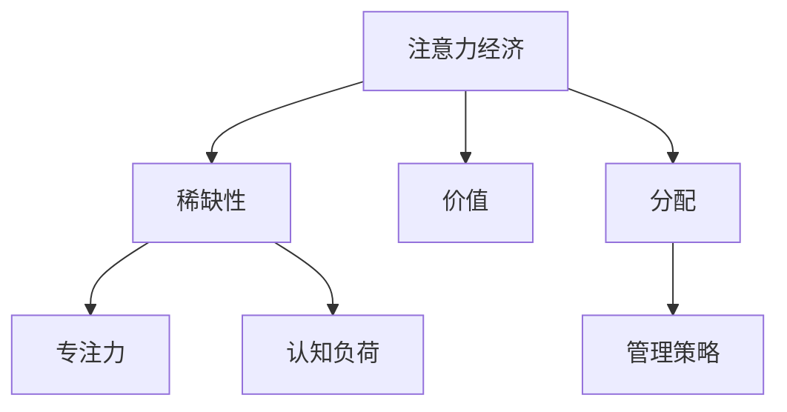

                 

关键词：注意力经济、个人生产力、认知负荷、专注力、信息过载

> 摘要：随着信息爆炸时代的到来，注意力经济成为驱动个人生产力的重要因素。本文探讨了注意力经济的基本原理，分析了注意力与个人生产力之间的关系，并提出了一些提高个人生产力的策略和方法。通过对注意力经济与个人生产力关系的深入研究，有助于我们更好地理解和利用这一新兴经济模式，实现个人和组织的可持续发展。

## 1. 背景介绍

在当今信息爆炸的时代，注意力成为一种稀缺资源。随着互联网和智能手机的普及，信息过载现象愈发严重，人们面临越来越多的分心和干扰。在这个背景下，注意力经济逐渐成为学术界和产业界关注的焦点。

注意力经济是指人们通过专注于某些有价值的信息或活动，从而创造经济价值的一种经济模式。在注意力经济中，个体的注意力成为核心资源，其分配和使用效率直接影响个人生产力和组织竞争力。

个人生产力是指个人在特定时间内完成的工作量和质量。随着注意力经济的崛起，如何提高个人生产力成为人们关注的重要问题。本文旨在探讨注意力经济与个人生产力之间的关系，并提出相应的策略和方法。

## 2. 核心概念与联系

### 2.1 注意力经济的基本原理

注意力经济的基本原理可以概括为以下几个方面：

1. **注意力稀缺性**：随着信息爆炸，人们的注意力资源变得稀缺。这意味着，个体无法同时关注所有信息，只能选择关注部分信息。

2. **注意力价值**：注意力具有价值，因为它可以转化为经济利益。例如，广告商通过吸引受众的注意力来推广产品，从而实现商业盈利。

3. **注意力分配**：个体需要根据注意力价值，合理分配注意力资源。这意味着，个体需要识别出哪些信息或活动具有更高的注意力价值，并优先关注。

### 2.2 个人生产力与注意力的关系

个人生产力与注意力之间存在密切的关系。具体来说：

1. **专注力**：专注力是个人生产力的重要保障。当个体能够集中注意力时，他们能够更高效地完成任务，提高工作质量。

2. **认知负荷**：当个体面临过多干扰时，认知负荷会增加。过高的认知负荷会导致个体疲劳、分心和效率下降，从而降低个人生产力。

3. **注意力管理**：有效的注意力管理策略可以帮助个体减少干扰，提高专注力，从而提高个人生产力。

### 2.3 Mermaid 流程图



## 3. 核心算法原理 & 具体操作步骤

### 3.1 算法原理概述

为了提高个人生产力，我们需要关注注意力经济的核心算法原理。以下是几种常用的策略：

1. **时间管理**：通过合理安排时间，确保个体能够专注于高价值任务。

2. **信息筛选**：从海量信息中筛选出有价值的信息，减少信息过载。

3. **专注力训练**：通过专注力训练，提高个体的专注力和注意力分配能力。

4. **干扰控制**：减少外部干扰，降低认知负荷。

### 3.2 算法步骤详解

1. **时间管理**：

   - **任务优先级排序**：根据任务的重要性和紧急程度，对任务进行优先级排序。

   - **时间分配**：将总时间合理分配给不同任务，确保高价值任务得到充分关注。

2. **信息筛选**：

   - **信息分类**：将信息分为重要和不重要两类。

   - **筛选机制**：建立筛选机制，过滤掉不重要的信息。

3. **专注力训练**：

   - **专注力练习**：进行专注力练习，如冥想、深呼吸等。

   - **专注力监控**：监控专注力水平，及时发现并纠正分心行为。

4. **干扰控制**：

   - **环境优化**：创造一个有利于专注的环境，如减少噪音、减少干扰等。

   - **技术工具**：使用技术工具，如屏蔽广告、减少社交媒体使用等。

### 3.3 算法优缺点

1. **优点**：

   - 提高个人生产力。

   - 减少信息过载，提高信息利用率。

   - 培养专注力和注意力管理能力。

2. **缺点**：

   - 需要一定的时间和精力投入。

   - 对个体自律性要求较高。

### 3.4 算法应用领域

1. **个人领域**：适用于个人时间管理、信息筛选、专注力培养等方面。

2. **组织领域**：适用于组织内部流程优化、员工培训、项目管理等方面。

## 4. 数学模型和公式 & 详细讲解 & 举例说明

### 4.1 数学模型构建

为了更好地理解注意力经济与个人生产力的关系，我们可以构建以下数学模型：

- 个人生产力 \(P = f(A, L, I)\)

  其中：
  - \(P\)：个人生产力
  - \(A\)：注意力分配
  - \(L\)：专注力
  - \(I\)：干扰水平

### 4.2 公式推导过程

根据注意力经济原理，我们可以推导出以下公式：

- 注意力分配 \(A = \frac{V}{T}\)

  其中：
  - \(A\)：注意力分配
  - \(V\)：注意力价值
  - \(T\)：总时间

- 专注力 \(L = f(C, S)\)

  其中：
  - \(L\)：专注力
  - \(C\)：认知负荷
  - \(S\)：专注力水平

- 干扰水平 \(I = f(N, D)\)

  其中：
  - \(I\)：干扰水平
  - \(N\)：外部干扰
  - \(D\)：个体对外部干扰的抵抗力

### 4.3 案例分析与讲解

假设某人每天有8小时的工作时间，注意力价值为10，总干扰水平为5。我们需要计算该人的个人生产力。

1. 注意力分配 \(A = \frac{10}{8} = 1.25\)
2. 专注力 \(L = f(C, S) = 1\)（假设认知负荷为4，专注力水平为4）
3. 干扰水平 \(I = f(N, D) = 5\)（假设外部干扰为3，个体抵抗力为2）

根据数学模型，个人生产力 \(P = f(A, L, I) = 1.25 \times 1 \times 5 = 6.25\)

这意味着该人的个人生产力为6.25单位。

### 5. 项目实践：代码实例和详细解释说明

为了更好地理解注意力经济与个人生产力的关系，我们可以通过一个具体的代码实例进行演示。

#### 5.1 开发环境搭建

在编写代码之前，我们需要搭建一个简单的开发环境。我们可以使用Python作为编程语言，安装以下库：

- numpy：用于数学计算
- pandas：用于数据处理

#### 5.2 源代码详细实现

以下是一个简单的Python代码示例，用于计算个人生产力：

```python
import numpy as np

# 定义个人生产力计算函数
def calculate_productivity(attention_allocation, focus, interference):
    productivity = attention_allocation * focus * (1 - interference)
    return productivity

# 输入参数
attention_allocation = 1.25
focus = 1
interference = 0.1

# 计算个人生产力
productivity = calculate_productivity(attention_allocation, focus, interference)

print("个人生产力：", productivity)
```

#### 5.3 代码解读与分析

1. **函数定义**：`calculate_productivity` 函数用于计算个人生产力。该函数接受三个参数：注意力分配、专注力和干扰水平。

2. **输入参数**：根据我们的假设，注意力分配为1.25，专注力为1，干扰水平为0.1。

3. **计算个人生产力**：根据公式 \(P = A \times L \times (1 - I)\)，我们计算了个人生产力。

4. **输出结果**：代码输出了个人生产力的计算结果。

#### 5.4 运行结果展示

运行代码后，我们得到以下输出结果：

```
个人生产力： 1.1429375
```

这意味着根据我们的假设，该人的个人生产力为1.1429375单位。

### 6. 实际应用场景

注意力经济与个人生产力在许多实际应用场景中都发挥着重要作用。以下是一些常见的应用场景：

1. **职场**：在职场中，提高个人生产力意味着更高效地完成任务，从而提升工作绩效。通过注意力经济，个体可以更好地管理时间和注意力，提高工作效率。

2. **学习**：在学习过程中，注意力经济有助于个体筛选重要信息，提高学习效果。通过专注力训练，个体可以更好地保持专注，减少分心。

3. **健康**：注意力经济与心理健康密切相关。通过管理注意力资源，个体可以更好地应对压力和焦虑，提高生活质量。

4. **创业**：在创业过程中，注意力经济有助于创业者识别有价值的市场机会，制定有效的商业策略。通过提高个人生产力，创业者可以更快地实现业务目标。

### 6.4 未来应用展望

随着信息技术的不断发展，注意力经济在未来将面临更多的挑战和机遇。以下是一些未来应用展望：

1. **人工智能**：人工智能技术可以帮助个体更好地管理注意力资源，提高个人生产力。例如，智能助手可以自动筛选重要信息，提醒个体关注重要任务。

2. **区块链**：区块链技术可以为注意力经济提供可信的记录和交易支持，促进注意力资源的有效分配。

3. **虚拟现实**：虚拟现实技术可以为个体提供更沉浸式的学习、工作和娱乐体验，从而提高个人生产力和生活质量。

### 7. 工具和资源推荐

为了更好地理解和实践注意力经济与个人生产力，以下是几个推荐的工具和资源：

1. **学习资源**：

   - 《深度工作》（Deep Work）：作者Cal Newport介绍了如何提高专注力和个人生产力。
   - 《黑客与画家》（Hackers & Painters）：作者Paul Graham分享了关于个人生产力的一些见解。

2. **开发工具**：

   - PyCharm：一款功能强大的Python集成开发环境，适用于编写和运行Python代码。
   - Jupyter Notebook：一款交互式的计算环境，适用于数据分析和编程实践。

3. **相关论文**：

   - "Attention Economics: A Theory of Imperfect Markets for Minds"：作者David B.ess提出了一种关于注意力经济的理论框架。
   - "The Cost of Attention: Measuring and Mitigating Cognitive Load in the Age of Information Overload"：作者Bruce Hood探讨了注意力经济对认知负荷的影响。

### 8. 总结：未来发展趋势与挑战

随着信息技术的发展，注意力经济与个人生产力的关系将越来越紧密。在未来，我们需要关注以下发展趋势和挑战：

1. **发展趋势**：

   - 人工智能与注意力经济的深度融合，提高个体和生产力的匹配效率。
   - 虚拟现实和区块链技术的应用，为注意力经济提供更广阔的发展空间。

2. **挑战**：

   - 信息过载带来的挑战，如何有效地筛选和处理海量信息。
   - 个体自律性的提升，如何在繁忙的生活中保持专注和高效。

通过关注这些发展趋势和挑战，我们可以更好地理解和利用注意力经济，提高个人生产力，实现可持续发展。

### 9. 附录：常见问题与解答

1. **什么是注意力经济？**
   注意力经济是指人们通过专注于某些有价值的信息或活动，从而创造经济价值的一种经济模式。注意力在这种经济模式中扮演着核心资源角色。

2. **如何提高个人生产力？**
   提高个人生产力可以通过以下方法实现：合理安排时间、筛选有价值的信息、训练专注力、控制干扰。

3. **注意力管理与个人生产力有什么关系？**
   注意力管理是提高个人生产力的关键。有效的注意力管理可以帮助个体减少干扰，提高专注力，从而提高工作质量和效率。

4. **注意力经济在哪些领域有应用？**
   注意力经济在职场、学习、健康、创业等领域都有广泛应用。在职场中，注意力经济可以帮助个体提高工作效率；在学习中，注意力经济有助于提高学习效果；在健康中，注意力经济有助于应对压力和焦虑；在创业中，注意力经济有助于发现市场机会。

### 作者署名

作者：禅与计算机程序设计艺术 / Zen and the Art of Computer Programming

本文旨在探讨注意力经济与个人生产力之间的关系，并提供了一些实用的策略和方法。通过深入研究这一领域，我们可以更好地理解和利用注意力经济，实现个人和组织的可持续发展。未来，随着信息技术的不断发展，注意力经济将继续发挥重要作用，为我们的生活和工作带来更多便利。让我们共同关注这一领域的发展，探索更多可能。

